# API 参考

<cite>
**本文引用的文件**
- [README.md](file://README.md)
- [main.py](file://main.py)
- [src/drbrain/cli/main.py](file://src/drbrain/cli/main.py)
- [src/drbrain/cli/setup.py](file://src/drbrain/cli/setup.py)
- [src/drbrain/cli/commands.py](file://src/drbrain/cli/commands.py)
- [src/drbrain/config.py](file://src/drbrain/config.py)
- [src/drbrain/services/pipeline.py](file://src/drbrain/services/pipeline.py)
- [src/drbrain/storage/database.py](file://src/drbrain/storage/database.py)
- [src/drbrain/auth.py](file://src/drbrain/auth.py)
- [src/drbrain/query/tree_retrieval.py](file://src/drbrain/query/tree_retrieval.py)
- [src/drbrain/graph/engine.py](file://src/drbrain/graph/engine.py)
- [src/drbrain/services/fetch.py](file://src/drbrain/services/fetch.py)
- [src/drbrain/services/enrich.py](file://src/drbrain/services/enrich.py)
- [src/drbrain/exceptions.py](file://src/drbrain/exceptions.py)
</cite>

## 目录
1. [简介](#简介)
2. [项目结构](#项目结构)
3. [核心组件](#核心组件)
4. [架构总览](#架构总览)
5. [详细组件分析](#详细组件分析)
6. [依赖关系分析](#依赖关系分析)
7. [性能考量](#性能考量)
8. [故障排查指南](#故障排查指南)
9. [结论](#结论)
10. [附录](#附录)

## 简介
本文件为 DrBrain 的 API 参考文档，覆盖以下方面：
- CLI 接口：命令、参数、返回值与使用示例
- 内部服务 API：函数签名、参数类型、异常处理与调用示例
- 外部集成 API：HTTP 方法、URL 模式、请求/响应模式与认证方法
- 协议特定示例、错误处理策略、安全考虑、速率限制与版本信息
- 常见用例、客户端实现指南与性能优化技巧

DrBrain 是面向学术知识图谱的系统，提供从 PDF 到结构化知识的提取、基于符号规则的推理与检索增强等能力。其 CLI 提供完整的端到端工作流，内部服务模块负责数据持久化、检索、推理与外部服务集成。

章节来源
- [README.md:1-112](file://README.md#L1-L112)

## 项目结构
DrBrain 的核心入口通过 CLI 驱动，配置由 YAML 加载，数据库采用 SQLite，检索与推理模块围绕知识图谱与树状结构展开。

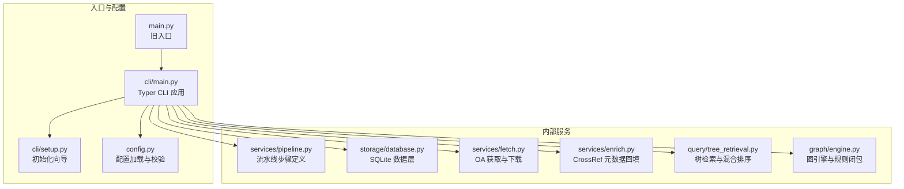

图表来源
- [src/drbrain/cli/main.py:1-150](file://src/drbrain/cli/main.py#L1-L150)
- [src/drbrain/cli/setup.py:1-588](file://src/drbrain/cli/setup.py#L1-L588)
- [src/drbrain/config.py:1-292](file://src/drbrain/config.py#L1-L292)
- [src/drbrain/services/pipeline.py:1-109](file://src/drbrain/services/pipeline.py#L1-L109)
- [src/drbrain/storage/database.py:1-775](file://src/drbrain/storage/database.py#L1-L775)
- [src/drbrain/services/fetch.py:1-345](file://src/drbrain/services/fetch.py#L1-L345)
- [src/drbrain/services/enrich.py:1-171](file://src/drbrain/services/enrich.py#L1-L171)
- [src/drbrain/query/tree_retrieval.py:1-876](file://src/drbrain/query/tree_retrieval.py#L1-L876)
- [src/drbrain/graph/engine.py:1-1118](file://src/drbrain/graph/engine.py#L1-L1118)

章节来源
- [src/drbrain/cli/main.py:1-150](file://src/drbrain/cli/main.py#L1-L150)
- [src/drbrain/config.py:1-292](file://src/drbrain/config.py#L1-L292)

## 核心组件
- CLI 应用：集中注册所有命令，统一回调进行日志与配置初始化
- 配置系统：支持 YAML 合并、本地覆盖与环境变量解析
- 数据库：Schema 自动迁移、索引与常用查询封装
- 流水线：预设与自定义步骤链，支持批量处理
- 检索：树结构优先的两阶段检索与向量混合排序
- 图引擎：多跳遍历、规则闭包、TransE 链接预测
- 外部服务：OA 获取、CrossRef 元数据回填

章节来源
- [src/drbrain/cli/main.py:77-146](file://src/drbrain/cli/main.py#L77-L146)
- [src/drbrain/config.py:182-292](file://src/drbrain/config.py#L182-L292)
- [src/drbrain/storage/database.py:159-258](file://src/drbrain/storage/database.py#L159-L258)
- [src/drbrain/services/pipeline.py:14-109](file://src/drbrain/services/pipeline.py#L14-L109)
- [src/drbrain/query/tree_retrieval.py:215-380](file://src/drbrain/query/tree_retrieval.py#L215-L380)
- [src/drbrain/graph/engine.py:33-122](file://src/drbrain/graph/engine.py#L33-L122)
- [src/drbrain/services/fetch.py:13-264](file://src/drbrain/services/fetch.py#L13-L264)
- [src/drbrain/services/enrich.py:14-171](file://src/drbrain/services/enrich.py#L14-L171)

## 架构总览
DrBrain 的内部 API 以模块化方式组织，CLI 作为统一入口，内部服务通过明确的数据结构与接口协作，数据库提供稳定的持久化层。

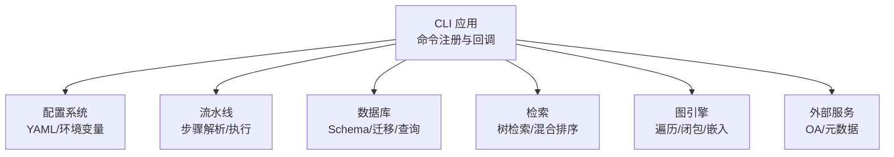

图表来源
- [src/drbrain/cli/main.py:77-146](file://src/drbrain/cli/main.py#L77-L146)
- [src/drbrain/config.py:283-292](file://src/drbrain/config.py#L283-L292)
- [src/drbrain/storage/database.py:159-258](file://src/drbrain/storage/database.py#L159-L258)
- [src/drbrain/services/pipeline.py:53-109](file://src/drbrain/services/pipeline.py#L53-L109)
- [src/drbrain/query/tree_retrieval.py:451-479](file://src/drbrain/query/tree_retrieval.py#L451-L479)
- [src/drbrain/graph/engine.py:124-315](file://src/drbrain/graph/engine.py#L124-L315)
- [src/drbrain/services/fetch.py:219-264](file://src/drbrain/services/fetch.py#L219-L264)
- [src/drbrain/services/enrich.py:128-171](file://src/drbrain/services/enrich.py#L128-L171)

## 详细组件分析

### CLI 接口（drbrain）
- 入口与回调
  - 应用初始化：Typer 应用实例，统一帮助信息
  - 回调：设置日志、加载配置、记录会话与命令
- 命令注册：覆盖 ingest、query、export、repair、build、graph、ws 等子应用
- 初始化向导：生成本地配置、创建目录、环境验证、可选安装技能

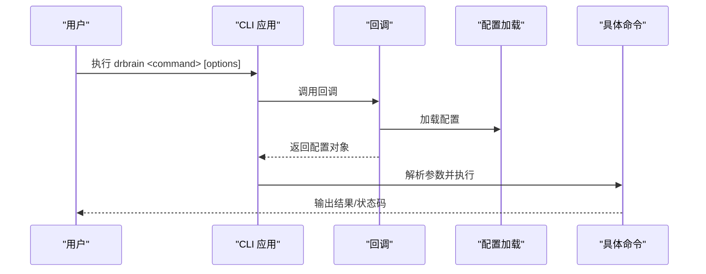

图表来源
- [src/drbrain/cli/main.py:80-92](file://src/drbrain/cli/main.py#L80-L92)
- [src/drbrain/cli/main.py:94-146](file://src/drbrain/cli/main.py#L94-L146)
- [src/drbrain/cli/setup.py:207-369](file://src/drbrain/cli/setup.py#L207-L369)

章节来源
- [src/drbrain/cli/main.py:77-146](file://src/drbrain/cli/main.py#L77-L146)
- [src/drbrain/cli/setup.py:207-369](file://src/drbrain/cli/setup.py#L207-L369)

### 配置系统（config）
- 类型化配置：LLM、MinerU、API、目录、数据库、抽取并发、BM25、队列阈值、抓取、嵌入、备份等
- 加载流程：基础 YAML + 本地覆盖 + 环境变量解析
- 运行时访问：字典兼容接口，便于向后兼容

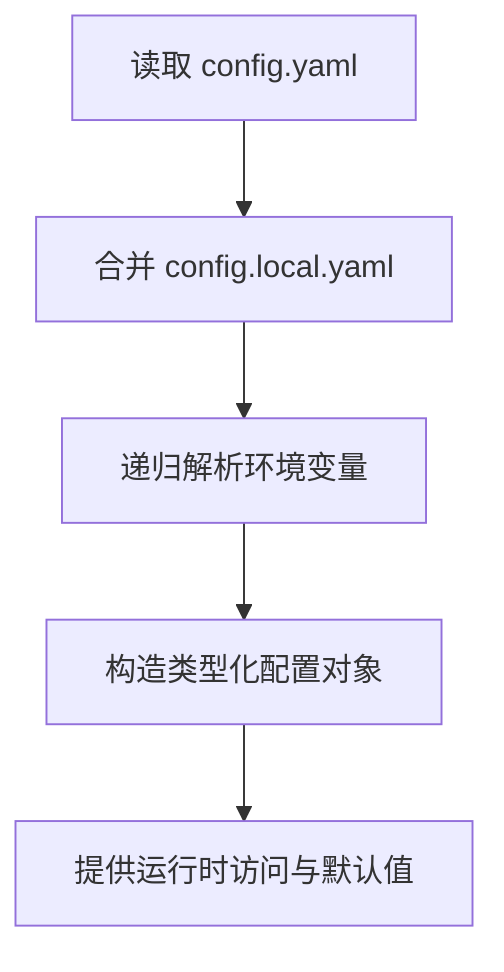

图表来源
- [src/drbrain/config.py:195-244](file://src/drbrain/config.py#L195-L244)
- [src/drbrain/config.py:264-278](file://src/drbrain/config.py#L264-L278)
- [src/drbrain/config.py:283-292](file://src/drbrain/config.py#L283-L292)

章节来源
- [src/drbrain/config.py:44-194](file://src/drbrain/config.py#L44-L194)
- [src/drbrain/config.py:195-292](file://src/drbrain/config.py#L195-L292)

### 数据库（storage/database）
- Schema 管理：自动建表、索引与迁移
- 常用操作：论文、概念、论点、边、别名、嵌入、树向量/摘要、队列、种子等
- 查询辅助：全量/单篇论文、概念/论点列表、删除论文级联清理、时间演化信号检测

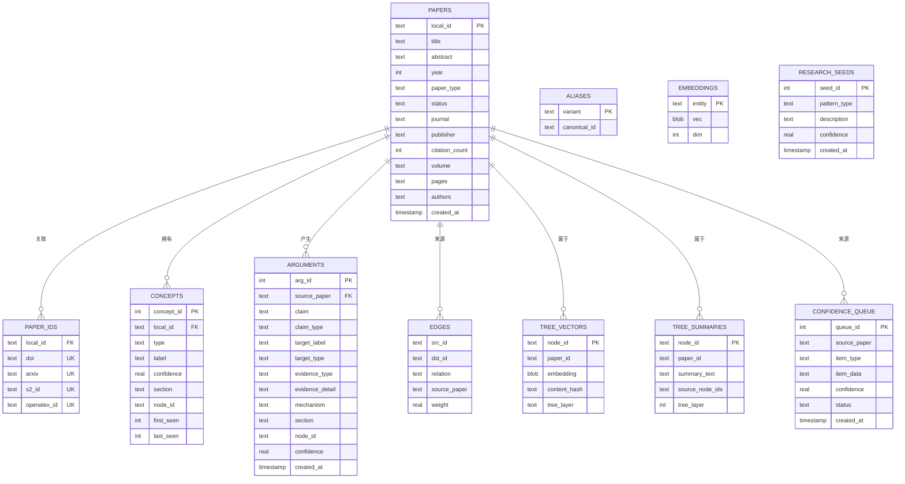

图表来源
- [src/drbrain/storage/database.py:10-156](file://src/drbrain/storage/database.py#L10-L156)
- [src/drbrain/storage/database.py:159-258](file://src/drbrain/storage/database.py#L159-L258)

章节来源
- [src/drbrain/storage/database.py:159-775](file://src/drbrain/storage/database.py#L159-L775)

### 流水线（services/pipeline）
- 步骤定义：ingest/build/embed/closure
- 预设：full/quick/embed
- 解析逻辑：预设或逗号分隔步骤名，去重与校验

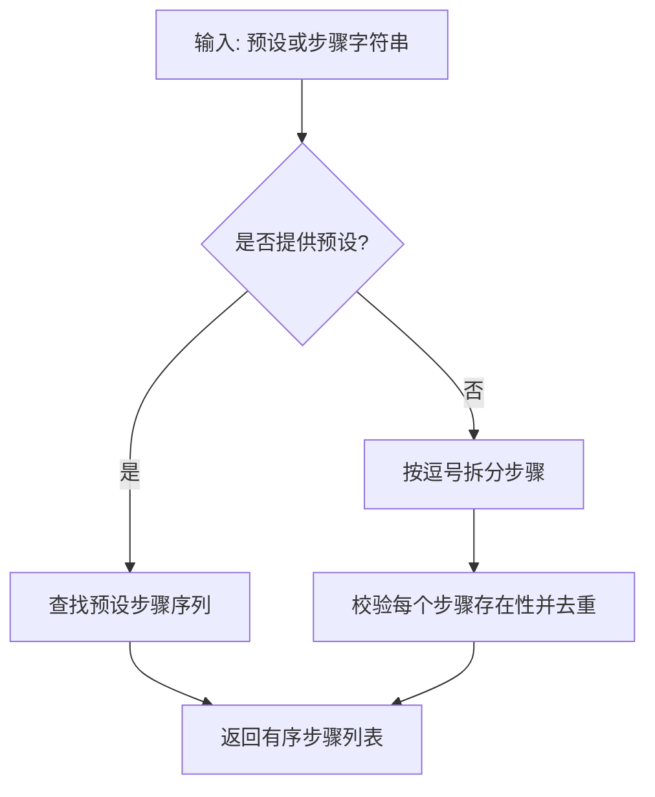

图表来源
- [src/drbrain/services/pipeline.py:53-90](file://src/drbrain/services/pipeline.py#L53-L90)

章节来源
- [src/drbrain/services/pipeline.py:14-109](file://src/drbrain/services/pipeline.py#L14-L109)

### 检索（query/tree_retrieval）
- 树检索：两阶段迭代选择 + 内容按需加载
- 混合排序：BM25 与向量融合；RRF 融合多路排序
- 跨论文检索：折叠树 + 向量搜索
- 层序遍历：RAPTOR 分层 + 页索引叶层回退

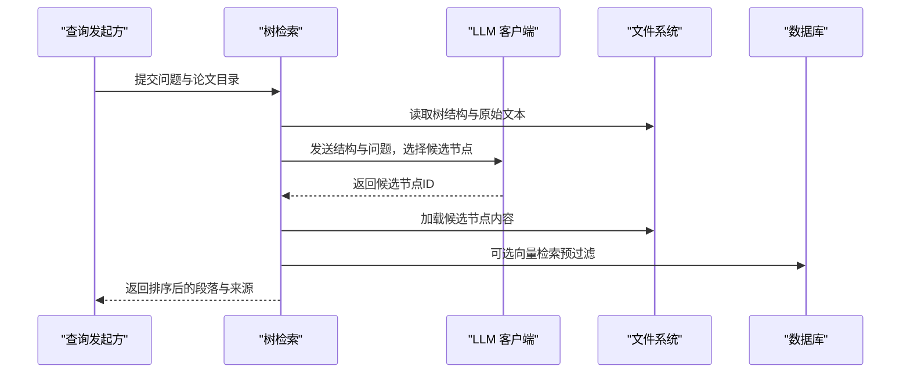

图表来源
- [src/drbrain/query/tree_retrieval.py:215-380](file://src/drbrain/query/tree_retrieval.py#L215-L380)
- [src/drbrain/query/tree_retrieval.py:451-479](file://src/drbrain/query/tree_retrieval.py#L451-L479)
- [src/drbrain/query/tree_retrieval.py:484-708](file://src/drbrain/query/tree_retrieval.py#L484-L708)

章节来源
- [src/drbrain/query/tree_retrieval.py:215-800](file://src/drbrain/query/tree_retrieval.py#L215-L800)

### 图引擎（graph/engine）
- 邻域与遍历：N 跳邻居、关系过滤、方向控制
- 规则闭包：8 条符号规则 + 路径规则 + 对称性检测
- 嵌入学习：TransE 实体/关系嵌入，持久化与相似度查询
- 研究种子：基于图与时间的前沿发现模式

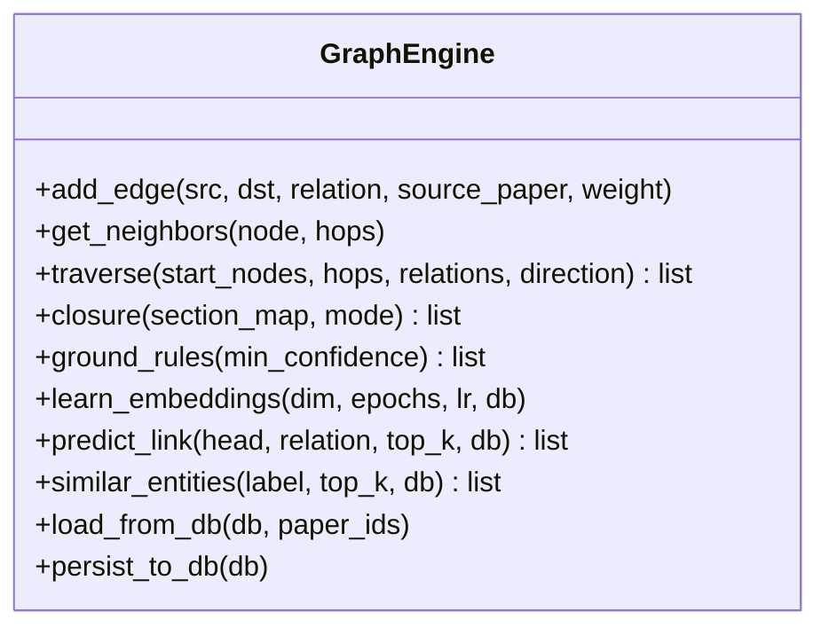

图表来源
- [src/drbrain/graph/engine.py:33-122](file://src/drbrain/graph/engine.py#L33-L122)
- [src/drbrain/graph/engine.py:124-315](file://src/drbrain/graph/engine.py#L124-L315)
- [src/drbrain/graph/engine.py:626-741](file://src/drbrain/graph/engine.py#L626-L741)

章节来源
- [src/drbrain/graph/engine.py:33-1118](file://src/drbrain/graph/engine.py#L33-L1118)

### 外部服务（fetch/enrich）
- OA 获取：多阶段回退（arXiv/OpenAlex/Unpaywall/直接DOI/标题搜索），代理支持
- 下载：流式下载、内容类型探测、大小校验
- 元数据回填：CrossRef API 请求、字段解析、缺失字段合并

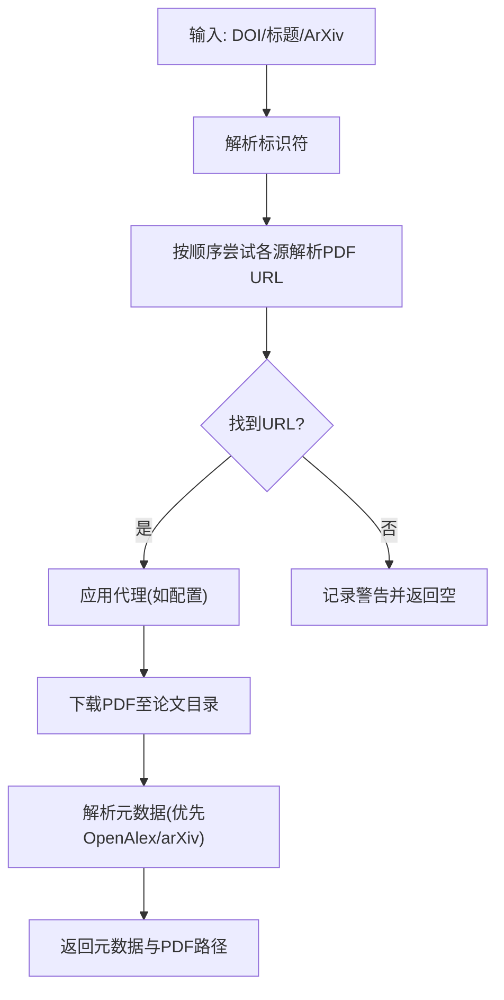

图表来源
- [src/drbrain/services/fetch.py:13-264](file://src/drbrain/services/fetch.py#L13-L264)
- [src/drbrain/services/enrich.py:128-171](file://src/drbrain/services/enrich.py#L128-L171)

章节来源
- [src/drbrain/services/fetch.py:13-345](file://src/drbrain/services/fetch.py#L13-L345)
- [src/drbrain/services/enrich.py:14-171](file://src/drbrain/services/enrich.py#L14-L171)

### 异常体系（exceptions）
- 统一基类与细分：配置错误、外部 API 错误、速率限制、抽取失败、存储错误

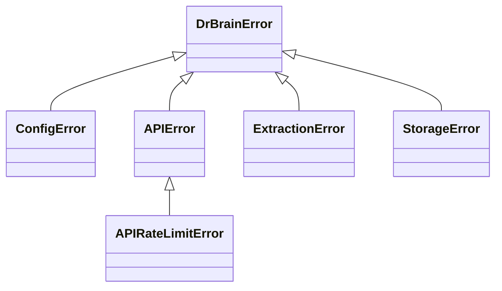

图表来源
- [src/drbrain/exceptions.py:6-28](file://src/drbrain/exceptions.py#L6-L28)

章节来源
- [src/drbrain/exceptions.py:1-28](file://src/drbrain/exceptions.py#L1-L28)

## 依赖关系分析
- CLI 依赖配置加载与日志初始化
- 服务模块依赖数据库与配置
- 检索与图引擎依赖嵌入配置与数据库
- 外部服务依赖网络与第三方 API

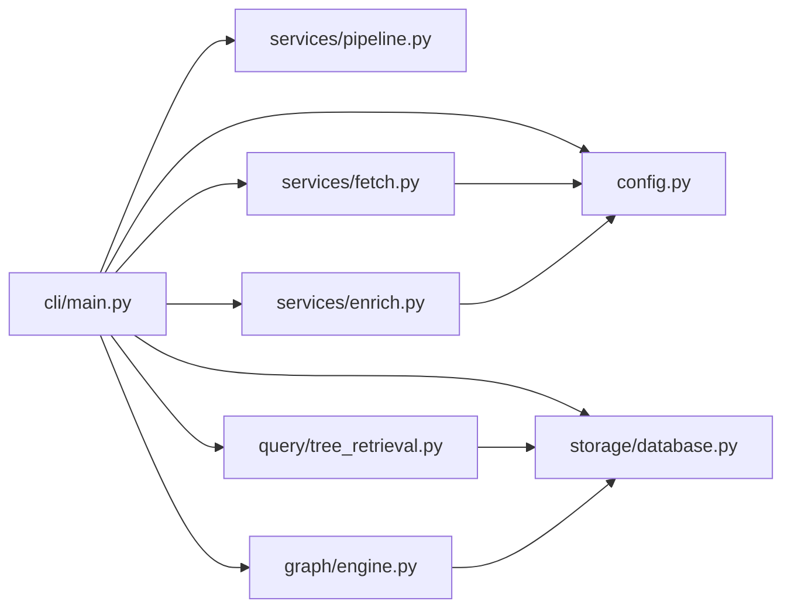

图表来源
- [src/drbrain/cli/main.py:77-146](file://src/drbrain/cli/main.py#L77-L146)
- [src/drbrain/config.py:283-292](file://src/drbrain/config.py#L283-L292)
- [src/drbrain/storage/database.py:159-258](file://src/drbrain/storage/database.py#L159-L258)
- [src/drbrain/query/tree_retrieval.py:451-479](file://src/drbrain/query/tree_retrieval.py#L451-L479)
- [src/drbrain/graph/engine.py:626-741](file://src/drbrain/graph/engine.py#L626-L741)
- [src/drbrain/services/fetch.py:219-264](file://src/drbrain/services/fetch.py#L219-L264)
- [src/drbrain/services/enrich.py:128-171](file://src/drbrain/services/enrich.py#L128-L171)

章节来源
- [src/drbrain/cli/main.py:77-146](file://src/drbrain/cli/main.py#L77-L146)
- [src/drbrain/config.py:283-292](file://src/drbrain/config.py#L283-L292)

## 性能考量
- 检索效率
  - 树检索采用“先结构后内容”的两阶段策略，减少大文档上下文传输
  - 向量预过滤与混合排序降低 LLM 评估成本
  - 层序遍历优先比较相关层级，避免全库扫描
- 存储与索引
  - SQLite WAL 模式提升并发写入性能
  - 关键查询建立索引（概念类型/标签、论点来源/目标、边关系/源、队列状态）
- 并发与批处理
  - 抽取并发、抓取并发、嵌入批大小可配置
  - 流水线步骤可并行执行（视实现而定）

[本节为通用指导，不直接分析具体文件]

## 故障排查指南
- 配置相关
  - 使用初始化向导生成本地配置，检查必需项（LLM、MinerU、API 密钥）
  - 环境变量未解析：确认变量名与占位符格式
- 外部 API
  - 速率限制：识别 APIRateLimitError，调整并发或等待
  - 元数据缺失：使用 enric.py 的回填工具
- 数据库
  - Schema 不一致：启用迁移流程；必要时重建数据库
  - 查询缓慢：确认索引是否存在，关注大数据量场景下的分页与过滤
- 安全
  - 管理员密码：通过 auth 工具设置与变更，防止破坏性操作
  - 认证：CLI 不暴露 HTTP API，仅通过本地配置与密钥交互

章节来源
- [src/drbrain/cli/setup.py:207-369](file://src/drbrain/cli/setup.py#L207-L369)
- [src/drbrain/exceptions.py:18-20](file://src/drbrain/exceptions.py#L18-L20)
- [src/drbrain/services/enrich.py:128-171](file://src/drbrain/services/enrich.py#L128-L171)
- [src/drbrain/storage/database.py:175-201](file://src/drbrain/storage/database.py#L175-L201)
- [src/drbrain/auth.py:26-29](file://src/drbrain/auth.py#L26-L29)

## 结论
DrBrain 的 API 以 CLI 为中心，围绕配置、数据库、检索与图推理构建了清晰的内部服务层。通过类型化配置、模块化流水线与可扩展的外部服务集成，系统在学术知识图谱构建与探索方面提供了稳健的工程化能力。建议在生产环境中结合速率限制、缓存与监控，持续优化检索与推理性能。

[本节为总结性内容，不直接分析具体文件]

## 附录

### CLI 命令参考（节选）
- drbrain setup [--quick | --change-password]
  - 功能：初始化配置、创建目录、环境验证、可选更改管理员密码
  - 示例：drbrain setup --quick
- drbrain pipeline [--preset | --steps]
  - 功能：执行流水线步骤（full/quick/embed 或自定义）
  - 示例：drbrain pipeline --preset full
- drbrain query / show / index / stats / list / seed
  - 功能：查询、展示、索引统计、列出条目、种子管理
- drbrain export / backup / metrics / queue
  - 功能：导出、备份、指标、队列管理
- drbrain fetch / citations / check-citations / report / closure
  - 功能：获取 PDF、引用处理、引用校验、报告、闭包
- drbrain build / embed / translate
  - 功能：构建知识、向量嵌入、翻译
- drbrain ask / reason / frontier / evolve / descendants / landscape / paradigm / transfers / isomorphism / difficulty
  - 功能：问答与推理、前沿分析、演化、后代、景观、范式、转移、同构、难度

章节来源
- [src/drbrain/cli/main.py:94-142](file://src/drbrain/cli/main.py#L94-L142)
- [src/drbrain/services/pipeline.py:46-50](file://src/drbrain/services/pipeline.py#L46-L50)

### 配置项速览（节选）
- llm.models: LLM 模型列表（provider/model/base_url/api_key）
- mineru: MinerU 解析器配置（token/model/is_ocr/enable_formula/enable_table/max_pages）
- api: DeepXiv/OpenAlex/Semantic Scholar/CrossRef 配置与缓存 TTL
- dirs: inbox/pending/papers/reports/cache/logs 目录
- db.path: SQLite 数据库路径
- extract.max_concurrent: 并发抽取数
- bm25.k1/b: BM25 参数
- queue.weak_threshold/auto_accept: 置信队列阈值
- fetch: 最大并发、超时、User-Agent、回退顺序、Unpaywall 邮箱、机构代理
- embed: provider/model/cache_dir/device/top_k/source/hf_endpoint/api_base/api_key/batch_size
- backup: ssh/rsync 路径与目标集

章节来源
- [src/drbrain/config.py:44-194](file://src/drbrain/config.py#L44-L194)

### 外部集成与安全
- OA 获取与下载
  - 支持多阶段回退与代理（ezproxy/url_prefix）
  - 下载前探测 PDF 类型，失败重试与日志记录
- CrossRef 元数据回填
  - 仅填充缺失字段，避免覆盖既有值
- 速率限制与错误处理
  - APIRateLimitError 用于识别限流
  - 多数外部调用具备超时与异常捕获

章节来源
- [src/drbrain/services/fetch.py:13-264](file://src/drbrain/services/fetch.py#L13-L264)
- [src/drbrain/services/enrich.py:128-171](file://src/drbrain/services/enrich.py#L128-L171)
- [src/drbrain/exceptions.py:18-20](file://src/drbrain/exceptions.py#L18-L20)