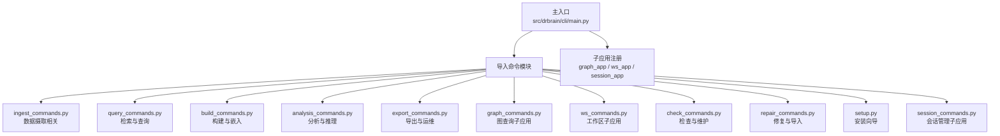
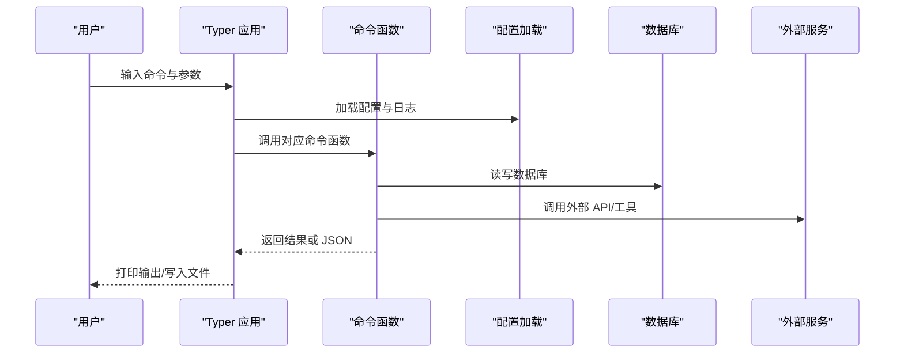
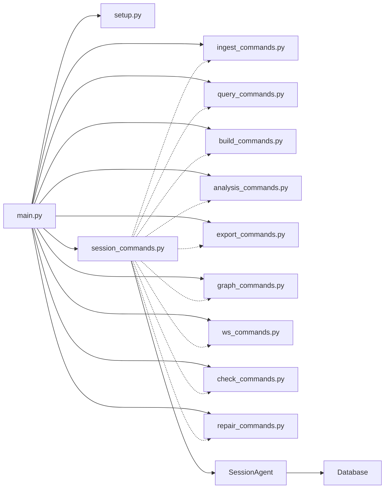

# CLI 接口

<cite>
**本文档引用的文件**
- [src/drbrain/cli/main.py](file://src/drbrain/cli/main.py)
- [src/drbrain/cli/commands.py](file://src/drbrain/cli/commands.py)
- [src/drbrain/cli/_common.py](file://src/drbrain/cli/_common.py)
- [src/drbrain/cli/ingest_commands.py](file://src/drbrain/cli/ingest_commands.py)
- [src/drbrain/cli/query_commands.py](file://src/drbrain/cli/query_commands.py)
- [src/drbrain/cli/build_commands.py](file://src/drbrain/cli/build_commands.py)
- [src/drbrain/cli/analysis_commands.py](file://src/drbrain/cli/analysis_commands.py)
- [src/drbrain/cli/export_commands.py](file://src/drbrain/cli/export_commands.py)
- [src/drbrain/cli/graph_commands.py](file://src/drbrain/cli/graph_commands.py)
- [src/drbrain/cli/ws_commands.py](file://src/drbrain/cli/ws_commands.py)
- [src/drbrain/cli/check_commands.py](file://src/drbrain/cli/check_commands.py)
- [src/drbrain/cli/repair_commands.py](file://src/drbrain/cli/repair_commands.py)
- [src/drbrain/cli/setup.py](file://src/drbrain/cli/setup.py)
- [src/drbrain/cli/session_commands.py](file://src/drbrain/cli/session_commands.py)
- [src/drbrain/extractor/session_agent.py](file://src/drbrain/extractor/session_agent.py)
- [src/drbrain/storage/database.py](file://src/drbrain/storage/database.py)
</cite>

## 目录
1. [简介](#简介)
2. [项目结构](#项目结构)
3. [核心组件](#核心组件)
4. [架构总览](#架构总览)
5. [详细组件分析](#详细组件分析)
6. [依赖分析](#依赖分析)
7. [性能考虑](#性能考虑)
8. [故障排除指南](#故障排除指南)
9. [结论](#结论)
10. [附录](#附录)

## 简介
本文件为 DrBrain CLI 的完整命令行 API 参考文档，覆盖 ingest、query、build、analysis、export、session 等主要功能组，并提供命令组合使用最佳实践、错误处理与调试技巧。DrBrain CLI 基于 Typer 构建，通过统一入口注册各子命令与子应用（graph、ws、session），并在执行前加载配置与初始化日志。

## 项目结构
DrBrain CLI 模块化组织，按功能拆分为多个命令模块，主入口集中注册所有命令与子应用：

**更新** 新增了会话管理子应用，提供持久化对话能力

图表来源
- [src/drbrain/cli/main.py:100-146](file://src/drbrain/cli/main.py#L100-L146)

章节来源
- [src/drbrain/cli/main.py:1-150](file://src/drbrain/cli/main.py#L1-L150)

## 核心组件
- 主入口 Typer 应用：集中注册命令与子应用，执行前加载配置与日志。
- 公共工具模块：提供通用辅助函数（如解析工作区、DOI 丰富、批量导出等）。
- 功能模块：按领域划分命令实现，职责清晰、可独立扩展。
- **会话管理模块**：新增 SessionAgent 类和相关 CLI 命令，支持持久化多轮对话。

**更新** 新增会话管理模块，提供跨 CLI 调用的上下文连续性

章节来源
- [src/drbrain/cli/main.py:77-146](file://src/drbrain/cli/main.py#L77-L146)
- [src/drbrain/cli/commands.py:1-88](file://src/drbrain/cli/commands.py#L1-L88)

## 架构总览
DrBrain CLI 的调用链路如下：用户输入 → Typer 解析 → 命令函数执行 → 数据库/外部服务交互 → 输出结果或 JSON。

**更新** 会话命令通过 SessionAgent 类管理持久化对话状态

图表来源
- [src/drbrain/cli/main.py:80-91](file://src/drbrain/cli/main.py#L80-L91)
- [src/drbrain/cli/_common.py:26-310](file://src/drbrain/cli/_common.py#L26-L310)

## 详细组件分析

### ingest 组（数据摄取）
- 命令列表
  - ingest：批量摄取 PDF，支持目录与多文件；默认扫描 inbox 目录。
  - fetch：根据 DOI/标题/arXiv 获取开放获取 PDF 并自动摄取。
  - citations：查询论文引文图（refs/citing/shared-refs），支持限制工作区与交互式抓取占位论文。
  - check-citations：在文本中校验参考文献是否存在于本地库。
  - report：显示单篇报告摘要。
  - closure：对全图运行规则闭包，支持干跑、指定规则、混合模式、规则挖掘与 t-norm 规则落地。
  - ingest-link：通过外部 web 提取器抓取网页内容并入库。
  - patent-search：搜索 USPTO 专利（ppubs/odp），支持应用号查询与 API Key。
  - pipeline：编排流水线（ingest → build → embed → closure）。
  - proceedings：会议论文集管理（创建/添加/展示/列出）。

- 关键参数与行为
  - ingest
    - 参数：paths（可选，PDF/目录，默认 data/spool/inbox）
    - 选项：--json（机器可读 JSON 输出）
    - 行为：遍历文件，逐个调用 _ingest_single_paper，支持批量统计与 JSON 输出。
  - fetch
    - 参数：identifier（DOI/标题/arXiv）
    - 选项：--arxiv（将 identifier 视作 arXiv ID）
    - 行为：解析标识符 → 下载 PDF → 自动调用 ingest 流程。
  - citations
    - 参数：local_id
    - 选项：--type/-t（refs/citing/shared-refs/all）、--limit/-l、--sort、--workspace/-w、--json、--fetch-interested
    - 行为：查询引文图，必要时先扩展引用；支持交互式选择占位论文并批量抓取。
  - check-citations
    - 参数：text 或 --file
    - 选项：--json
    - 行为：抽取并匹配文本中的参考文献，输出匹配结果。
  - report
    - 参数：local_id
    - 选项：--json
    - 行为：读取 reports 目录下的 JSON 报告并打印摘要。
  - closure
    - 选项：--dry-run、--rule、--workspace/-w、--mode、--mine-rules、--min-confidence、--ground
    - 行为：加载图 → 运行闭包 → 可选规则挖掘与落地 → 可选过滤规则 → 写回数据库。
  - ingest-link
    - 参数：urls（列表）
    - 选项：--pdf/--no-pdf、--dry-run、--json
    - 行为：校验 web 提取器服务 → 提取内容 → 生成本地 ID → 写入 DB。
  - patent-search
    - 参数：query（列表）
    - 选项：--application/-a（应用号查询，需 odp 源与 API Key）、--limit/-n、--source/-s（ppubs/odp）、--api-key、--json
    - 行为：ppubs 匿名搜索或 odp 需要 Key 的搜索，输出专利摘要。
  - pipeline
    - 选项：--preset/-p、--steps/-s、--list、--dry-run
    - 行为：解析预设/步骤 → 子进程调用对应命令。
  - proceedings
    - 选项：--list/-l、--create、--show、--add、--json
    - 行为：创建/添加/展示/列出会议论文集。

- 使用示例
  - 摄取 PDF：drbrain ingest data/papers/*.pdf
  - 从 arXiv 抓取：drbrain fetch --arxiv arXivId
  - 查询引文：drbrain citations p123456 --type refs --limit 100
  - 闭包推理：drbrain closure --workspace myws --mine-rules --min-confidence 0.6
  - 网页抓取：drbrain ingest-link https://example.com
  - 专利搜索：drbrain patent-search "neural network" --source odp --api-key YOUR_KEY
  - 编排流水线：drbrain pipeline --preset full

- 错误处理与调试
  - 文件不存在/无 PDF：提示并退出码 1。
  - 引文图为空：提示先扩展引用。
  - 闭包规则无效：列出有效规则并报错。
  - Web 提取器不可达：提示安装/启动 qt-web-extractor 或设置 WEBEXTRACT_URL。
  - 专利搜索失败：提示 API Key 或网络问题。

章节来源
- [src/drbrain/cli/ingest_commands.py:26-110](file://src/drbrain/cli/ingest_commands.py#L26-L110)
- [src/drbrain/cli/ingest_commands.py:112-150](file://src/drbrain/cli/ingest_commands.py#L112-L150)
- [src/drbrain/cli/ingest_commands.py:152-247](file://src/drbrain/cli/ingest_commands.py#L152-L247)
- [src/drbrain/cli/ingest_commands.py:249-305](file://src/drbrain/cli/ingest_commands.py#L249-L305)
- [src/drbrain/cli/ingest_commands.py:307-350](file://src/drbrain/cli/ingest_commands.py#L307-L350)
- [src/drbrain/cli/ingest_commands.py:350-462](file://src/drbrain/cli/ingest_commands.py#L350-L462)
- [src/drbrain/cli/ingest_commands.py:464-567](file://src/drbrain/cli/ingest_commands.py#L464-L567)
- [src/drbrain/cli/ingest_commands.py:569-701](file://src/drbrain/cli/ingest_commands.py#L569-L701)
- [src/drbrain/cli/ingest_commands.py:703-757](file://src/drbrain/cli/ingest_commands.py#L703-L757)
- [src/drbrain/cli/ingest_commands.py:759-801](file://src/drbrain/cli/ingest_commands.py#L759-L801)

### query 组（检索与查询）
- 命令列表
  - seed：检测研究种子（基于图模式）。
  - list：列出数据库中所有论文。
  - stats：数据库统计信息（论文/概念/边/别名/研究种子/置信队列）。
  - show：显示单篇论文详情（概念/论点/边）。
  - index：重建 BM25 索引。
  - query：BM25 文本检索 + 可选图遍历扩展；支持按年份过滤、工作区限制、混合排序（PageRank）。
  - fsearch：联邦搜索（本地库 + arXiv），支持交叉引用本地已摄取状态。
  - show（同上）：显示单篇论文详情。

- 关键参数与行为
  - seed
    - 选项：--json、--workspace/-w
    - 行为：加载图 → 检测种子 → 输出类型/描述。
  - list
    - 选项：--json
    - 行为：输出表格或 JSON。
  - stats
    - 选项：--json、--workspace/-w
    - 行为：统计论文/占位/概念/边/别名/研究种子/论点/置信队列。
  - show
    - 参数：local_id
    - 选项：--json
    - 行为：输出论文元数据、概念、论点与邻接边。
  - index
    - 选项：--rebuild、--json
    - 行为：重建 BM25 索引。
  - query
    - 参数：text
    - 选项：--type-filter、--arg-type、--year-start、--year-end、--min-confidence、--limit、--neighbors/-n、--relation/-R、--direction/-D、--hybrid、--json、--jsonl、--paper、--workspace/-w
    - 行为：BM25 检索 → 可选图遍历扩展 → 可选 PageRank 混合排序 → 输出富文本或 JSON/JSONL。
  - fsearch
    - 参数：query（列表）
    - 选项：--arxiv、--arxiv-only、--limit/-n、--json
    - 行为：本地库搜索 → arXiv 搜索 → 交叉引用本地已摄取状态 → 输出结果。

- 使用示例
  - 检测种子：drbrain seed --workspace myws
  - 列表：drbrain list --json
  - 统计：drbrain stats --workspace myws
  - 查看论文：drbrain show p123456 --json
  - 重建索引：drbrain index --rebuild
  - 复合查询：drbrain query "attention mechanism" --type-filter Problem --neighbors 2 --relation addresses,extends --hybrid
  - 联邦搜索：drbrain fsearch "transformer" --limit 10

- 错误处理与调试
  - 未找到论文：提示并退出。
  - BM25 无结果：提示"无结果"。
  - 图遍历方向/关系非法：提示有效集合并报错。
  - PageRank 计算收敛：内置迭代收敛判断。

章节来源
- [src/drbrain/cli/query_commands.py:24-47](file://src/drbrain/cli/query_commands.py#L24-L47)
- [src/drbrain/cli/query_commands.py:49-75](file://src/drbrain/cli/query_commands.py#L49-L75)
- [src/drbrain/cli/query_commands.py:77-178](file://src/drbrain/cli/query_commands.py#L77-L178)
- [src/drbrain/cli/query_commands.py:180-261](file://src/drbrain/cli/query_commands.py#L180-L261)
- [src/drbrain/cli/query_commands.py:263-281](file://src/drbrain/cli/query_commands.py#L263-L281)
- [src/drbrain/cli/query_commands.py:283-402](file://src/drbrain/cli/query_commands.py#L283-L402)
- [src/drbrain/cli/query_commands.py:403-578](file://src/drbrain/cli/query_commands.py#L403-L578)
- [src/drbrain/cli/query_commands.py:580-631](file://src/drbrain/cli/query_commands.py#L580-L631)
- [src/drbrain/cli/query_commands.py:633-738](file://src/drbrain/cli/query_commands.py#L633-L738)

### build 组（构建与嵌入）
- 命令列表
  - translate：将论文 markdown 翻译为目标语言。
  - build：基于 5 阶段 LLM 提取构建知识图谱（概念/关系/共指消解/修正）。
  - embed：训练 TransE 图嵌入；支持 --tree 生成树节点向量。

- 关键参数与行为
  - translate
    - 参数：local_id、--lang/-l、--force/-f、--json
    - 行为：检查模型配置 → 翻译 → 输出路径或部分完成信息。
  - build
    - 参数：paper_id（可选列表）、--all、--skip-refine、--json
    - 行为：选择论文 → 生成/恢复树结构 → 5 阶段提取 → 插入概念/边 → 概念去重 → 输出统计。
  - embed
    - 选项：--dim、--epochs、--retrain、--tree
    - 行为：加载图 → 可增量训练实体嵌入 → 写回数据库；--tree 模式遍历论文生成树向量。

- 使用示例
  - 翻译：drbrain translate p123456 --lang zh --force
  - 构建：drbrain build --all --skip-refine
  - 嵌入：drbrain embed --dim 128 --epochs 100
  - 树向量：drbrain embed --tree

- 错误处理与调试
  - 无 LLM 模型：提示"运行 setup"。
  - 无图数据：提示"先运行 build"。
  - 树缺失：尝试重新生成树结构。

章节来源
- [src/drbrain/cli/build_commands.py:16-95](file://src/drbrain/cli/build_commands.py#L16-L95)
- [src/drbrain/cli/build_commands.py:97-278](file://src/drbrain/cli/build_commands.py#L97-L278)
- [src/drbrain/cli/build_commands.py:280-361](file://src/drbrain/cli/build_commands.py#L280-L361)

### analysis 组（分析与推理）
- 命令列表
  - ask：自然语言问答，检索 KG 并返回答案。
  - reason：基于图约束的双向 LLM-KG 迭代推理。
  - evolve：追踪概念演化（祖先/后代/双向），支持时间信号与梅尔曼图输出。
  - descendants：追踪论文后代（被引用/扩展/改进）。
  - landscape：工作区领域景观（时间线/持久缺口/争议）。
  - paradigm：检测范式转移（替换/爆炸/跨域入侵）。
  - transfers：跨域方法迁移机会发现（显式/自动/历史）。
  - isomorphism：寻找结构同构子图。
  - difficulty：难度图（缺口按来源节类型分类）。
  - frontier：知识前沿（活跃缺口/争议/范式转移）。

- 关键参数与行为
  - ask
    - 参数：question（列表）、--top/-k、--json
    - 行为：BM25 检索 → 构造上下文 → LLM 生成答案。
  - reason
    - 参数：question、--bidirectional/-b、--max-rounds/-r
    - 行为：可选双向验证 → 输出答案与探索轮次。
  - evolve
    - 参数：concept、--direction/-d、--max-depth/-n、--mermaid、--json、--stats
    - 行为：构建演化树/图 → 可选统计输出。
  - descendants
    - 参数：paper_id、--generations/-g、--mermaid、--json、--sections
    - 行为：追踪后代 → 可选节来源增强。
  - landscape
    - 参数：workspace（可选）、--top-n、--json
    - 行为：工作区景观分析 → 渲染输出。
  - paradigm
    - 参数：concept（可选）、--workspace/-w、--json
    - 行为：检测范式转移 → 输出类型/描述。
  - transfers
    - 选项：--from/--to、--auto、--min-confidence、--json、--history、--sections
    - 行为：跨域迁移机会/历史 → 可选节来源增强。
  - isomorphism
    - 参数：concept（可选）、--min-confidence、--json
    - 行为：寻找同构模式 → 可选 RAPTOR 上下文。
  - difficulty
    - 选项：--json
    - 行为：缺口分类统计 → 输出清单。
  - frontier
    - 选项：--json
    - 行为：汇总活跃缺口/争议/范式转移。

- 使用示例
  - 问答：drbrain ask "Is attention better than CNN for NLP?" --top 5
  - 推理：drbrain reason "What are the limitations of transformer models?" --bidirectional --max-rounds 3
  - 演化：drbrain evolve "attention" --direction both --max-depth 3 --stats
  - 后代：drbrain descendants p123456 --generations 3 --sections
  - 景观：drbrain landscape myws --top-n 5
  - 范式：drbrain paradigm --workspace myws
  - 迁移：drbrain transfers --from methods --to problems --min-confidence 0.3
  - 同构：drbrain isomorphism --min-confidence 0.5
  - 难度：drbrain difficulty
  - 前沿：drbrain frontier

- 错误处理与调试
  - 无 LLM 模型：提示"运行 setup"。
  - 无概念/论文：提示"未找到"。

章节来源
- [src/drbrain/cli/analysis_commands.py:118-212](file://src/drbrain/cli/analysis_commands.py#L118-L212)
- [src/drbrain/cli/analysis_commands.py:54-116](file://src/drbrain/cli/analysis_commands.py#L54-L116)
- [src/drbrain/cli/analysis_commands.py:214-266](file://src/drbrain/cli/analysis_commands.py#L214-L266)
- [src/drbrain/cli/analysis_commands.py:268-307](file://src/drbrain/cli/analysis_commands.py#L268-L307)
- [src/drbrain/cli/analysis_commands.py:309-343](file://src/drbrain/cli/analysis_commands.py#L309-L343)
- [src/drbrain/cli/analysis_commands.py:345-396](file://src/drbrain/cli/analysis_commands.py#L345-L396)
- [src/drbrain/cli/analysis_commands.py:398-547](file://src/drbrain/cli/analysis_commands.py#L398-L547)
- [src/drbrain/cli/analysis_commands.py:550-602](file://src/drbrain/cli/analysis_commands.py#L550-L602)
- [src/drbrain/cli/analysis_commands.py:604-638](file://src/drbrain/cli/analysis_commands.py#L604-L638)
- [src/drbrain/cli/analysis_commands.py:640-678](file://src/drbrain/cli/analysis_commands.py#L640-L678)

### export 组（导出与运维）
- 命令列表
  - export：导出论文元数据（BibTeX/RIS/Markdown），支持 --all 与样式定制。
  - queue：查看置信队列待处理项。
  - queue resolve：接受/拒绝单个队列项。
  - queue resolve-all：批量接受/拒绝队列项（支持类型过滤与置信度上限）。
  - delete：删除论文及其关联数据（可选删除文件目录）。
  - backup：创建 tar.gz 备份或同步到 rsync 目标（支持 dry-run）。
  - style：管理 Markdown 导出样式（列出/查看源）。
  - lineage：探索作者/研究者谱系（OpenAlex 去重 ID）。
  - document：检查 Office 文档（DOCX/PPTX/XLSX）结构化摘要。
  - metrics：用户行为分析（周趋势/热词/最读论文）。

- 关键参数与行为
  - export
    - 参数：local_id（可选）或 --all
    - 选项：--format/-f（bib/ris/md）、--output/-o、--style/-s、--json
    - 行为：构建元数据 → 格式化输出 → 可写入文件。
  - queue / queue resolve / queue resolve-all
    - 行为：查看/接受/拒绝置信队列项 → 支持过滤与批量。
  - delete
    - 选项：--force/-f、--rm-files、--json
    - 行为：删除论文 → 可级联删除文件 → 输出统计。
  - backup
    - 选项：--output/-o、--list、--target/-t、--dry-run、--json
    - 行为：tar.gz 备份或 rsync 同步 → 支持目标配置与 dry-run。
  - style
    - 选项：--list/-l、--show、--json
    - 行为：列出/显示引用样式。
  - lineage
    - 选项：--list、--name/-n、--json
    - 行为：作者 ID/名称/列表 → 展示谱系与论文数。
  - document
    - 参数：file、--format/-f
    - 行为：检查 Office 文档 → 输出结构化摘要。
  - metrics
    - 选项：--json
    - 行为：周趋势/热词/最读论文 → 可 JSON 输出。

- 使用示例
  - 导出：drbrain export p123456 --format bib --output out.bib
  - 导出全部：drbrain export --all --format md --style apa
  - 查看队列：drbrain queue
  - 删除：drbrain delete p123456 --rm-files
  - 备份：drbrain backup --target remote --dry-run
  - 样式：drbrain style --list
  - 谱系：drbrain lineage --name "Smith"
  - 文档检查：drbrain document paper.docx
  - 指标：drbrain metrics

- 错误处理与调试
  - 未找到论文：提示并退出。
  - 队列冲突：提示不能同时 accept/reject。
  - rsync 失败：输出返回码与错误信息。

章节来源
- [src/drbrain/cli/export_commands.py:21-78](file://src/drbrain/cli/export_commands.py#L21-L78)
- [src/drbrain/cli/export_commands.py:80-120](file://src/drbrain/cli/export_commands.py#L80-L120)
- [src/drbrain/cli/export_commands.py:122-177](file://src/drbrain/cli/export_commands.py#L122-L177)
- [src/drbrain/cli/export_commands.py:166-225](file://src/drbrain/cli/export_commands.py#L166-L225)
- [src/drbrain/cli/export_commands.py:227-282](file://src/drbrain/cli/export_commands.py#L227-L282)
- [src/drbrain/cli/export_commands.py:283-427](file://src/drbrain/cli/export_commands.py#L283-L427)
- [src/drbrain/cli/export_commands.py:429-478](file://src/drbrain/cli/export_commands.py#L429-L478)
- [src/drbrain/cli/export_commands.py:480-552](file://src/drbrain/cli/export_commands.py#L480-L552)
- [src/drbrain/cli/export_commands.py:554-574](file://src/drbrain/cli/export_commands.py#L554-L574)
- [src/drbrain/cli/export_commands.py:576-628](file://src/drbrain/cli/export_commands.py#L576-L628)

### session 子应用（会话管理）
- 命令列表
  - new：创建新的推理会话，支持标题设置。
  - ask：在现有会话中提问（上下文感知）。
  - chat：进入会话的交互式聊天模式。
  - list：列出所有活动会话。
  - delete：删除会话（软删除）。
  - export：将会话历史导出为 JSON 或 Markdown。

- 关键参数与行为
  - new
    - 选项：--title/-t（会话标题）
    - 行为：创建 SessionAgent → 生成 session_id → 输出会话信息 → 支持后续 ask/chat 命令。
  - ask
    - 参数：session_id（会话ID）、question（问题）
    - 选项：--max-turns/-m（最大工具调用轮数，默认8）、--json（JSON输出）
    - 行为：加载会话 → 执行 ask 操作 → 输出答案与消息计数。
  - chat
    - 参数：session_id（会话ID）
    - 选项：--max-turns/-m（每轮问题的最大工具调用轮数，默认8）
    - 行为：加载会话 → 交互式聊天循环 → 支持 /exit、/quit、/history 命令。
  - list
    - 选项：--all/-a（包含已删除/归档会话）
    - 行为：查询 agent_sessions 表 → 输出会话列表（含消息计数）。
  - delete
    - 参数：session_id（会话ID）
    - 选项：--force/-f（跳过确认）
    - 行为：软删除会话 → 更新状态为 deleted → 清空本地会话状态。
  - export
    - 参数：session_id（会话ID）
    - 选项：--output/-o（输出文件路径，默认stdout）、--format/-F（格式：json或markdown，默认json）
    - 行为：加载会话元数据与消息 → 导出为 JSON 或 Markdown 格式。

- 使用示例
  - 创建会话：drbrain session new --title "Transformer Research"
  - 提问：drbrain session ask sess-12345678 "What are the key innovations in attention?"
  - 交互式聊天：drbrain session chat sess-12345678
  - 列出会话：drbrain session list
  - 删除会话：drbrain session delete sess-12345678 --force
  - 导出会话：drbrain session export sess-12345678 --format markdown --output session.md

- 错误处理与调试
  - 会话不存在：提示并退出。
  - 无 LLM 模型：提示"运行 setup"。
  - 会话已删除：无法加载。
  - 导出格式未知：提示并退出。

**新增** 完整的会话管理功能，支持持久化多轮对话和跨 CLI 调用的上下文连续性

章节来源
- [src/drbrain/cli/session_commands.py:33-59](file://src/drbrain/cli/session_commands.py#L33-L59)
- [src/drbrain/cli/session_commands.py:61-99](file://src/drbrain/cli/session_commands.py#L61-L99)
- [src/drbrain/cli/session_commands.py:101-126](file://src/drbrain/cli/session_commands.py#L101-L126)
- [src/drbrain/cli/session_commands.py:128-177](file://src/drbrain/cli/session_commands.py#L128-L177)
- [src/drbrain/cli/session_commands.py:179-212](file://src/drbrain/cli/session_commands.py#L179-L212)
- [src/drbrain/cli/session_commands.py:214-290](file://src/drbrain/cli/session_commands.py#L214-L290)

### graph 子应用（直接图查询）
- 命令列表
  - neighbors：从节点出发按跳数与关系类型遍历邻居，支持方向控制与工作区限制。
  - path：在知识图中查找两点间最短路径（无向复制 + BFS 截断）。
  - related：多论文共享概念/连接分析（concepts/graph/edges 三种模式）。
  - describe：生成子图自然语言描述（可结合 LLM）。
  - query：基于 TransE 嵌入的复杂查询 DSL（支持 project/intersect/union/negate）。
  - traverse-from：从文档树节标题出发，发现锚定概念并图遍历。

- 关键参数与行为
  - neighbors
    - 参数：node_label、--hops/-n、--relation/-R、--direction/-D、--json、--workspace/-w
    - 行为：校验节点存在 → 遍历 → 输出路径与标签。
  - path
    - 参数：src_label、dst_label、--max-length、--json、--workspace/-w
    - 行为：无向图 BFS 查找 → 输出路径步骤。
  - related
    - 参数：paper_id（列表，至少 2 个）、--mode/-m（concepts/graph/edges）、--min-shared、--json、--workspace/-w
    - 行为：SQL/图遍历/边模式 → 输出共享统计与覆盖。
  - describe
    - 参数：node_label、--depth/-n、--json、--workspace/-w
    - 行为：遍历收集路径 → LLM 生成描述。
  - query
    - 参数：query_json（JSON DSL）、--top/-k、--json
    - 行为：解析 DSL → 嵌入查询 → 输出得分最高的标签。
  - traverse-from
    - 参数：section、--depth/-d、--direction、--json、--workspace/-w
    - 行为：树节匹配 → 概念发现 → 图遍历 → 输出邻居。

- 使用示例
  - 邻居：drbrain graph neighbors "attention" --hops 2 --relation addresses,extends
  - 路径：drbrain graph path p123456 p654321 --max-length 6
  - 共享：drbrain graph related p123456 p654321 --mode concepts --min-shared 2
  - 描述：drbrain graph describe "transformer" --depth 2
  - 查询：drbrain graph query '{"type":"project","entity":"attention","relation":"addresses"}' --top 10
  - 从节遍历：drbrain graph traverse-from "Introduction" --depth 2

- 错误处理与调试
  - 节点不存在：提示并退出。
  - 无路径：提示最大长度截断。
  - DSL 语法错误：提示 JSON 解析失败。

章节来源
- [src/drbrain/cli/graph_commands.py:20-152](file://src/drbrain/cli/graph_commands.py#L20-L152)
- [src/drbrain/cli/graph_commands.py:153-264](file://src/drbrain/cli/graph_commands.py#L153-L264)
- [src/drbrain/cli/graph_commands.py:266-501](file://src/drbrain/cli/graph_commands.py#L266-L501)
- [src/drbrain/cli/graph_commands.py:503-574](file://src/drbrain/cli/graph_commands.py#L503-L574)
- [src/drbrain/cli/graph_commands.py:576-621](file://src/drbrain/cli/graph_commands.py#L576-L621)
- [src/drbrain/cli/graph_commands.py:623-756](file://src/drbrain/cli/graph_commands.py#L623-L756)

### ws 子应用（工作区管理）
- 命令列表
  - create：创建工作区（可带描述）。
  - add：向工作区添加论文。
  - remove：从工作区移除论文。
  - list：列出所有工作区。
  - show：显示工作区详情与论文列表。
  - delete：删除工作区。
  - rename：重命名工作区。

- 使用示例
  - 创建：drbrain ws create myws --description "My research area"
  - 添加：drbrain ws add myws p123456 p654321
  - 显示：drbrain ws show myws
  - 重命名：drbrain ws rename old new

- 错误处理与调试
  - 工作区不存在：提示并退出。
  - 重复重命名：提示异常。

章节来源
- [src/drbrain/cli/ws_commands.py:12-171](file://src/drbrain/cli/ws_commands.py#L12-L171)

### check 组（系统检查与维护）
- 命令列表
  - check：检查依赖、配置、环境变量、目录、数据库、磁盘空间、API 连通性（MinerU/DeepXiv/LLM）。
  - analyze：分析知识前沿（种子/因果链/假设等），支持单篇/多篇/查询/发现/工作区边界扫描。
  - clean：清理数据目录（保留 inbox），支持强制与管理员密码校验。

- 使用示例
  - 检查：drbrain check
  - 分析：drbrain analyze --discover "machine learning applications" --full
  - 清理：drbrain clean --force

- 错误处理与调试
  - 依赖缺失：提示安装。
  - API 不可达：提示检查令牌/网络。
  - 清理确认：需要确认或管理员密码。

章节来源
- [src/drbrain/cli/check_commands.py:24-427](file://src/drbrain/cli/check_commands.py#L24-L427)
- [src/drbrain/cli/check_commands.py:428-563](file://src/drbrain/cli/check_commands.py#L428-L563)
- [src/drbrain/cli/check_commands.py:565-626](file://src/drbrain/cli/check_commands.py#L565-L626)

### repair 组（修复与导入）
- 命令列表
  - repair：通过 CrossRef/arXiv/OpenAlex 修复论文元数据，支持 --all/--workspace/--dry-run。
  - import：从 Zotero/BibTeX/Endnote 导入论文，支持 Web API/本地 SQLite、PDF 检测/下载、集合过滤、工作区创建。
  - enrich：从 CrossRef 丰富元数据并检测可疑记录。

- 使用示例
  - 修复：drbrain repair --all --dry-run
  - 导入：drbrain import zotero path/to/zotero.sqlite --collection KEY --import-collections
  - 丰富：drbrain enrich --all

- 错误处理与调试
  - 源类型不支持：提示正确类型。
  - 文件不存在：提示路径。
  - 集合列表仅支持 zotero：提示。

章节来源
- [src/drbrain/cli/repair_commands.py:14-76](file://src/drbrain/cli/repair_commands.py#L14-L76)
- [src/drbrain/cli/repair_commands.py:77-341](file://src/drbrain/cli/repair_commands.py#L77-L341)
- [src/drbrain/cli/repair_commands.py:343-438](file://src/drbrain/cli/repair_commands.py#L343-L438)

### setup（安装向导）
- 功能：生成 config.local.yaml、初始化数据目录、验证环境、可交互/快速模式、安装技能。
- 关键选项
  - --quick/-q：跳过交互，使用环境变量。
  - --change-password：修改管理员密码。
- 行为：检查依赖/工具/目录 → 写入配置 → 初始化目录 → 环境验证 → 可选安装技能。

章节来源
- [src/drbrain/cli/setup.py:207-588](file://src/drbrain/cli/setup.py#L207-L588)

## 依赖分析
- 模块耦合
  - main.py 作为统一入口，集中导入各命令模块，降低耦合度。
  - _common.py 提供跨模块复用的工具函数，避免重复逻辑。
  - 各命令模块内部依赖数据库、图引擎、外部服务，但对外暴露清晰的 Typer 接口。
  - **session 子应用** 依赖 SessionAgent 类和数据库表结构。
- 外部依赖
  - Typer：命令行框架。
  - Loguru：日志。
  - Rich：终端表格与输出美化。
  - SQLite：本地数据库。
  - 多种 LLM/嵌入/解析器/外部 API（CrossRef/OpenAlex/USPTO/MinerU 等）。

**更新** 新增会话子应用依赖关系图

图表来源
- [src/drbrain/cli/main.py:10-75](file://src/drbrain/cli/main.py#L10-L75)

章节来源
- [src/drbrain/cli/main.py:1-150](file://src/drbrain/cli/main.py#L1-L150)
- [src/drbrain/cli/_common.py:1-100](file://src/drbrain/cli/_common.py#L1-L100)

## 性能考虑
- 批量处理
  - ingest 支持批量 PDF 处理，建议分批执行以控制内存占用。
  - pipeline 将多步骤串行执行，注意 I/O 与网络延迟叠加。
- 图遍历与混合排序
  - query 的 --neighbors 与 --hybrid 会增加计算开销，建议合理设置 --limit 与 --neighbors。
  - PageRank 混合排序为自实现，注意节点规模与迭代次数。
- 嵌入训练
  - embed 默认增量训练实体嵌入，建议在已有嵌入基础上 retrain 以节省时间。
  - --tree 模式遍历论文生成树向量，I/O 成本较高，建议并行度与磁盘性能匹配。
- 外部 API
  - fsearch/arXiv/USPTO/MinerU/DeepXiv 等均可能成为瓶颈，建议合理设置限流与缓存策略。
- **会话管理**
  - **SessionAgent** 支持上下文压缩，当消息数量和令牌超过预算时自动压缩。
  - 会话持久化存储在 SQLite 数据库中，注意磁盘 I/O 性能。

**更新** 新增会话管理性能考虑

## 故障排除指南
- 常见错误与解决
  - 未找到论文/节点：确认 local_id 或节点标签正确。
  - 无 LLM 模型：运行 drbrain setup 完成配置。
  - 无 PDF/树结构：先执行 ingest，再执行 build/embed。
  - API Key 缺失：检查 config.local.yaml 中对应字段，或设置环境变量。
  - 磁盘空间不足：清理 data/ 目录或扩容。
  - 权限问题：确保对 data/ 目录有读写权限。
  - **会话相关**：会话不存在时提示并退出；会话已删除无法加载；导出格式未知时报错。
- 调试技巧
  - 使用 --json 输出机器可读结果，便于脚本化处理。
  - 使用 --dry-run 预览操作（如 pipeline、repair、backup）。
  - 使用 drbrain check 快速定位依赖/配置/API 连通性问题。
  - 查看日志：CLI 在执行前初始化日志，结合会话 ID 定位问题。
  - **会话调试**：使用 /history 命令查看当前会话历史；使用 --max-turns 控制推理轮数。

**更新** 新增会话管理故障排除指南

章节来源
- [src/drbrain/cli/check_commands.py:24-427](file://src/drbrain/cli/check_commands.py#L24-L427)
- [src/drbrain/cli/_common.py:26-310](file://src/drbrain/cli/_common.py#L26-L310)

## 结论
DrBrain CLI 提供了从数据摄取、知识图谱构建、检索查询、分析推理到导出运维的完整命令行能力。**新增的会话管理功能**进一步增强了系统的实用性，支持持久化的多轮对话和跨 CLI 调用的上下文连续性。通过模块化设计与统一入口，用户可以灵活组合命令完成复杂任务。建议在生产环境中配合 --json 与 --dry-run 使用，并定期运行 drbrain check 与 backup 保障系统稳定与数据安全。

## 附录
- 命令组合最佳实践
  - 全流程：drbrain ingest → drbrain build --all → drbrain embed --tree → drbrain embed（TransE） → drbrain closure --mine-rules
  - 检索增强：drbrain query "... --neighbors 2 --relation addresses,extends --hybrid" → drbrain graph neighbors ...
  - 分析洞察：drbrain ask / drbrain reason / drbrain evolve / drbrain frontier
  - 导出与备份：drbrain export --all --format bib → drbrain backup --target remote
  - **会话工作流**：drbrain session new → drbrain session ask → drbrain session chat → drbrain session export
- 常用参数速查
  - --json：输出 JSON/JSONL，便于自动化。
  - --workspace/-w：限定工作区范围。
  - --dry-run：预演，不写入。
  - --limit/-n：限制结果数量。
  - --rebuild：重建索引/缓存。
  - --force/-f：强制覆盖/删除。
  - --type-filter / --arg-type：过滤概念/论点类型。
  - --year-start / --year-end：按年份过滤。
  - --min-confidence：置信度阈值。
  - --paper：基于树检索（绕过 BM25）。
  - --mermaid：以梅尔曼图输出。
  - --history：历史轨迹。
  - --sections：节来源增强。
  - **会话相关**：--max-turns：控制工具调用轮数；--title：设置会话标题；--format：导出格式（json/markdown）。

**更新** 新增会话管理最佳实践和参数速查