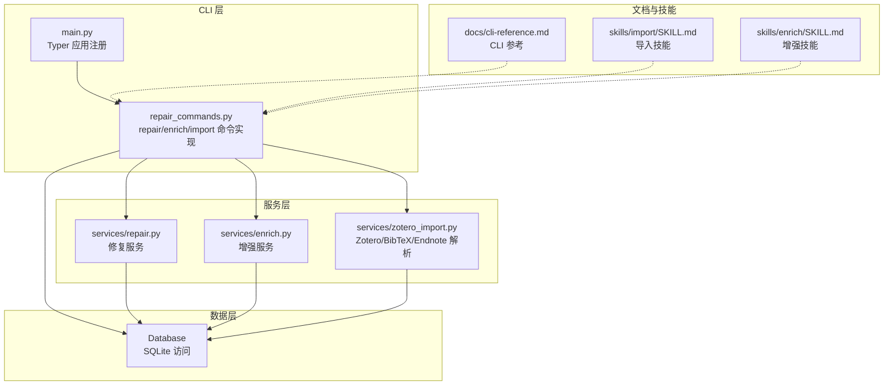
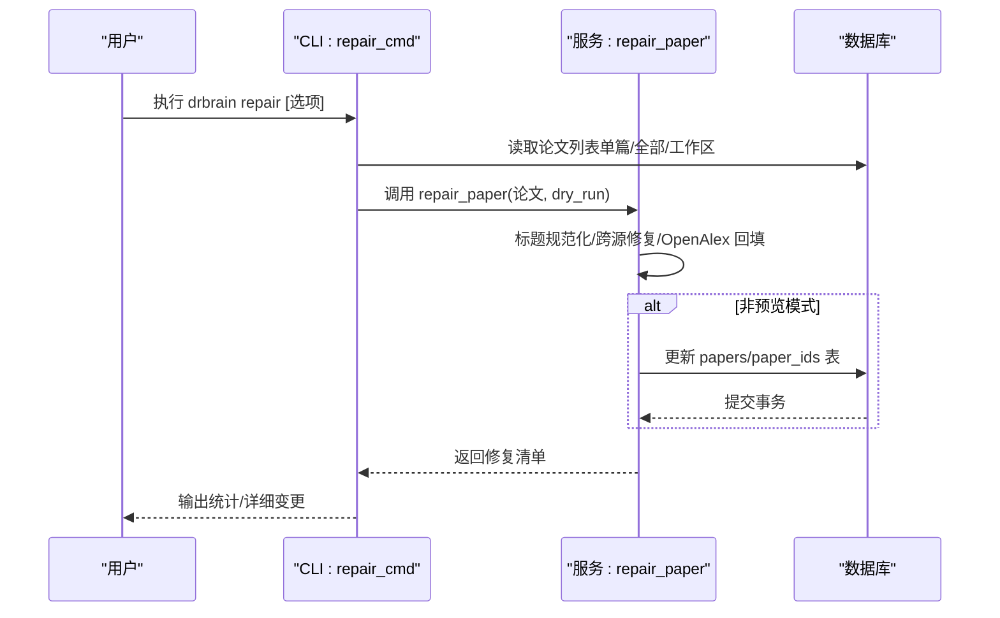
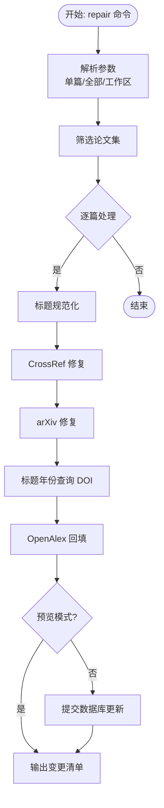
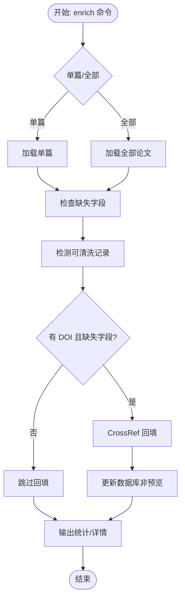
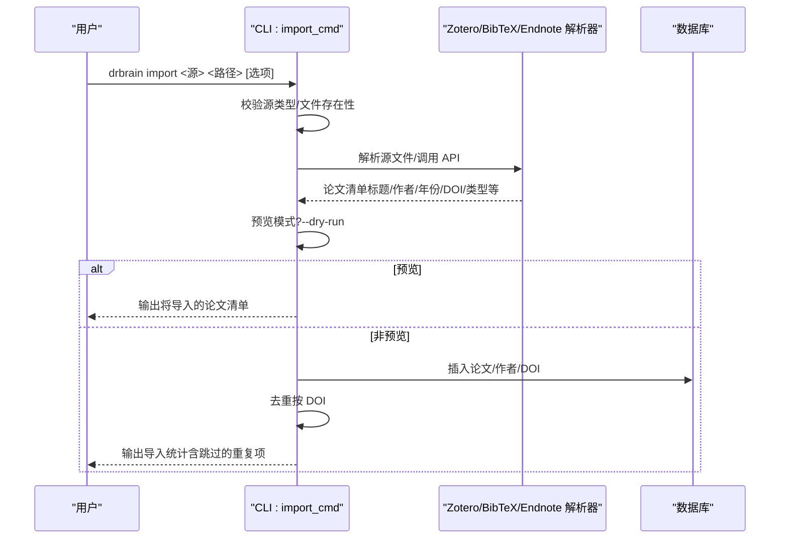
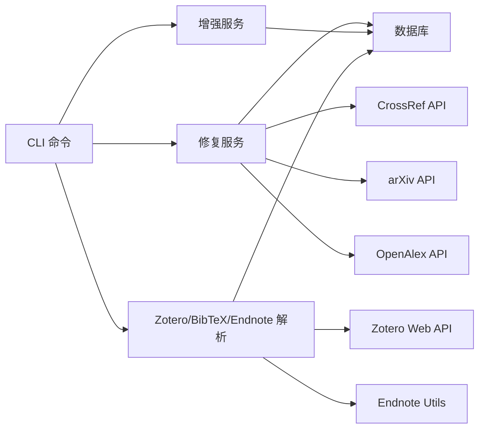

# 修复命令

<cite>
**本文引用的文件**
- [src/drbrain/cli/repair_commands.py](file://src/drbrain/cli/repair_commands.py)
- [src/drbrain/services/repair.py](file://src/drbrain/services/repair.py)
- [src/drbrain/services/enrich.py](file://src/drbrain/services/enrich.py)
- [src/drbrain/services/zotero_import.py](file://src/drbrain/services/zotero_import.py)
- [src/drbrain/cli/main.py](file://src/drbrain/cli/main.py)
- [docs/cli-reference.md](file://docs/cli-reference.md)
- [skills/import/SKILL.md](file://skills/import/SKILL.md)
- [skills/enrich/SKILL.md](file://skills/enrich/SKILL.md)
- [tests/test_repair.py](file://tests/test_repair.py)
- [tests/test_enrich.py](file://tests/test_enrich.py)
- [tests/test_cli_commands.py](file://tests/test_cli_commands.py)
</cite>

## 目录
1. [简介](#简介)
2. [项目结构](#项目结构)
3. [核心组件](#核心组件)
4. [架构总览](#架构总览)
5. [详细组件分析](#详细组件分析)
6. [依赖分析](#依赖分析)
7. [性能考虑](#性能考虑)
8. [故障排查指南](#故障排查指南)
9. [结论](#结论)
10. [附录](#附录)

## 简介
本文件面向 DrBrain 的“修复命令”，系统性梳理并文档化以下 CLI 能力：
- 修复命令（repair）：通过 CrossRef、arXiv、OpenAlex 等外部源修复元数据，支持预览与批量处理。
- 内容增强命令（enrich）：基于 CrossRef 回填缺失字段并检测“可清洗”记录，辅助质量治理。
- 外部导入命令（import）：从 Zotero（本地 SQLite/Web API）、BibTeX、Endnote 导入论文，支持集合过滤、PDF 检测与工作区映射。

文档覆盖参数配置、使用方法、数据质量问题识别与修复策略选择、导入流程配置、修复效果验证与数据完整性检查、以及批量修复操作指南。

## 项目结构
与修复命令直接相关的模块组织如下：
- CLI 层：命令入口与参数解析，负责调用服务层并输出结果。
- 服务层：封装具体修复/增强/导入逻辑，调用外部 API 或解析文件格式。
- 数据访问层：数据库读写，用于持久化修复结果与导入状态。
- 技能与参考文档：为用户与自动化工具提供使用示例与最佳实践。

图表来源
- [src/drbrain/cli/repair_commands.py:1-438](file://src/drbrain/cli/repair_commands.py#L1-L438)
- [src/drbrain/services/repair.py:1-337](file://src/drbrain/services/repair.py#L1-L337)
- [src/drbrain/services/enrich.py:1-171](file://src/drbrain/services/enrich.py#L1-L171)
- [src/drbrain/services/zotero_import.py:1-719](file://src/drbrain/services/zotero_import.py#L1-L719)
- [src/drbrain/cli/main.py:67-130](file://src/drbrain/cli/main.py#L67-L130)

章节来源
- [src/drbrain/cli/repair_commands.py:1-438](file://src/drbrain/cli/repair_commands.py#L1-L438)
- [src/drbrain/cli/main.py:67-130](file://src/drbrain/cli/main.py#L67-L130)

## 核心组件
- 修复命令（repair）
  - 支持按单篇、全部或工作区范围执行；支持预览模式；支持 JSON 输出。
  - 修复策略：标题规范化、CrossRef 补全、arXiv 标题/年份补全、基于标题的 DOI 查询、OpenAlex 元数据回填。
- 内容增强命令（enrich）
  - 检查缺失字段（标题、年份、作者、期刊），检测“可清洗”记录（空标题、可疑文件名、远未来年份等），在存在 DOI 且字段缺失时回填。
- 外部导入命令（import）
  - 支持 Zotero 本地 SQLite、Zotero Web API、BibTeX、Endnote XML/RIS。
  - 支持集合过滤、PDF 检测、集合到工作区映射、去重（以 DOI 为准）、JSON 预览。

章节来源
- [src/drbrain/cli/repair_commands.py:14-438](file://src/drbrain/cli/repair_commands.py#L14-L438)
- [src/drbrain/services/repair.py:16-337](file://src/drbrain/services/repair.py#L16-L337)
- [src/drbrain/services/enrich.py:14-171](file://src/drbrain/services/enrich.py#L14-L171)
- [src/drbrain/services/zotero_import.py:118-719](file://src/drbrain/services/zotero_import.py#L118-L719)
- [docs/cli-reference.md:650-794](file://docs/cli-reference.md#L650-L794)

## 架构总览
下图展示修复命令在 CLI 与服务层之间的交互，以及与数据库的写入路径。

图表来源
- [src/drbrain/cli/repair_commands.py:14-75](file://src/drbrain/cli/repair_commands.py#L14-L75)
- [src/drbrain/services/repair.py:265-337](file://src/drbrain/services/repair.py#L265-L337)

## 详细组件分析

### 修复命令（repair）
- 功能要点
  - 输入：单篇 local_id、全部论文、工作区限制、预览模式、JSON 输出。
  - 处理：标题规范化、CrossRef 修复、arXiv 修复、标题年份查询、OpenAlex 回填。
  - 输出：变更统计、逐条字段变更详情（旧值→新值）。
- 关键流程
  - 参数校验与论文集筛选（全部/工作区/单篇）。
  - 逐篇调用修复函数，收集变更清单。
  - 非预览模式提交数据库更新。
- 修复策略选择
  - 优先使用 DOI（CrossRef）进行精确修复。
  - 缺少 DOI 时尝试 arXiv（标题/年份）。
  - 若仍不完整，尝试基于标题查询 DOI。
  - 最后通过 OpenAlex 回填摘要、引用数、作者、卷期页码等。
- 使用建议
  - 初次修复建议先启用预览模式，确认变更后再提交。
  - 对于大规模库，建议按工作区分批执行，避免长事务锁表。
  - 修复完成后建议运行索引重建与审计，确保一致性。

图表来源
- [src/drbrain/cli/repair_commands.py:28-75](file://src/drbrain/cli/repair_commands.py#L28-L75)
- [src/drbrain/services/repair.py:265-337](file://src/drbrain/services/repair.py#L265-L337)

章节来源
- [src/drbrain/cli/repair_commands.py:14-75](file://src/drbrain/cli/repair_commands.py#L14-L75)
- [src/drbrain/services/repair.py:16-337](file://src/drbrain/services/repair.py#L16-L337)
- [tests/test_repair.py:93-441](file://tests/test_repair.py#L93-L441)

### 内容增强命令（enrich）
- 功能要点
  - 检查缺失字段（标题、年份、作者、期刊）。
  - 检测“可清洗”记录（空标题、短标题、可疑文件名、远未来年份、空作者）。
  - 当存在 DOI 且字段缺失时，从 CrossRef 回填。
- 输出
  - 统计：缺失字段数量、可清洗记录数量、通过 CrossRef 回填数量。
  - 可选 JSON 输出，便于流水线集成。
- 使用建议
  - 建议先执行 enrich --all --dry-run 进行质量扫描。
  - 对于可清洗记录，建议人工复核或标记后统一清理。
  - 回填后可结合 repair 做进一步修复。

图表来源
- [src/drbrain/cli/repair_commands.py:343-438](file://src/drbrain/cli/repair_commands.py#L343-L438)
- [src/drbrain/services/enrich.py:14-171](file://src/drbrain/services/enrich.py#L14-L171)

章节来源
- [src/drbrain/cli/repair_commands.py:343-438](file://src/drbrain/cli/repair_commands.py#L343-L438)
- [src/drbrain/services/enrich.py:14-171](file://src/drbrain/services/enrich.py#L14-L171)
- [tests/test_enrich.py:9-125](file://tests/test_enrich.py#L9-L125)

### 外部导入命令（import）
- 支持源
  - Zotero：本地 SQLite（自动检测相邻 PDF）、Web API（需 API Key）。
  - BibTeX：解析 .bib 文件。
  - Endnote：解析 .xml 或 .ris 文件。
- 关键特性
  - 集合过滤（Zotero 本地/远程）。
  - PDF 检测与复制（Zotero 本地模式）。
  - 去重：按 DOI 去重，避免重复导入。
  - 工作区映射：导入后可按集合创建工作区。
  - 预览模式：--dry-run 输出将要导入的论文清单。
- 使用建议
  - 先用 --dry-run 预览，确认集合与字段完整性。
  - 导入后默认为占位状态，建议先运行 repair --all 填充元数据，再根据需要执行 ingest 获取 PDF 并构建知识图谱。

图表来源
- [src/drbrain/cli/repair_commands.py:77-341](file://src/drbrain/cli/repair_commands.py#L77-L341)
- [src/drbrain/services/zotero_import.py:118-719](file://src/drbrain/services/zotero_import.py#L118-L719)

章节来源
- [src/drbrain/cli/repair_commands.py:77-341](file://src/drbrain/cli/repair_commands.py#L77-L341)
- [src/drbrain/services/zotero_import.py:118-719](file://src/drbrain/services/zotero_import.py#L118-L719)
- [skills/import/SKILL.md:13-91](file://skills/import/SKILL.md#L13-L91)
- [docs/cli-reference.md:650-673](file://docs/cli-reference.md#L650-L673)

## 依赖分析
- 组件耦合
  - CLI 仅负责参数解析与调用服务层，耦合度低，职责清晰。
  - 服务层内部通过模块化函数拆分（CrossRef/arXiv/OpenAlex/标题年份），便于测试与扩展。
  - 数据库访问集中在服务层，CLI 仅传递连接字符串与配置。
- 外部依赖
  - CrossRef、arXiv、OpenAlex API（网络请求）。
  - Zotero Web API（pyzotero）。
  - Endnote XML 解析（endnote-utils）。
- 潜在循环依赖
  - 未发现直接循环依赖；各模块通过函数调用而非类继承耦合。

图表来源
- [src/drbrain/cli/repair_commands.py:14-341](file://src/drbrain/cli/repair_commands.py#L14-L341)
- [src/drbrain/services/repair.py:58-262](file://src/drbrain/services/repair.py#L58-L262)
- [src/drbrain/services/zotero_import.py:348-470](file://src/drbrain/services/zotero_import.py#L348-L470)

章节来源
- [src/drbrain/cli/repair_commands.py:14-341](file://src/drbrain/cli/repair_commands.py#L14-L341)
- [src/drbrain/services/repair.py:58-262](file://src/drbrain/services/repair.py#L58-L262)
- [src/drbrain/services/zotero_import.py:348-470](file://src/drbrain/services/zotero_import.py#L348-L470)

## 性能考虑
- 批量修复
  - 建议按工作区分批执行，避免一次性锁表时间过长。
  - 预览模式先行，减少不必要的数据库写入。
- API 调用
  - CrossRef/arXiv/OpenAlex 请求可能受速率限制，建议合理控制并发与重试。
  - 导入阶段建议先去重（按 DOI），减少后续修复成本。
- 数据库写入
  - 合理使用事务，批量提交；避免频繁提交导致的 I/O 压力。

## 故障排查指南
- 常见问题与定位
  - 参数错误：未指定论文、--all 与 --workspace 冲突、源类型非法。
  - 文件不存在：Zotero/Endnote/BibTeX 文件路径错误。
  - 外部 API 不可用：CrossRef/arXiv/OpenAlex/PyZotero/Endnote Utils 缺失或网络异常。
  - 论文不存在：传入的 local_id 无效。
- 定位手段
  - 使用 --dry-run 与 --json 快速验证输入与预期行为。
  - 结合审计命令（audit）与增强命令（enrich）进行质量扫描。
  - 查看 CLI 日志与服务层异常捕获（日志会记录失败原因）。
- 相关测试参考
  - CLI 参数校验与错误退出码。
  - 修复服务的异常处理与边界条件。
  - 增强服务的字段检查与合并策略。

章节来源
- [tests/test_cli_commands.py:794-830](file://tests/test_cli_commands.py#L794-L830)
- [tests/test_repair.py:377-441](file://tests/test_repair.py#L377-L441)
- [tests/test_enrich.py:47-125](file://tests/test_enrich.py#L47-L125)

## 结论
- 修复命令（repair）提供多源修复能力，适合在导入后快速补齐缺失元数据并提升一致性。
- 内容增强命令（enrich）聚焦质量治理，帮助识别与清理“可清洗”记录。
- 外部导入命令（import）支持多种参考管理器与导出格式，配合去重与工作区映射，可高效完成库迁移与批量入库。
- 建议在生产环境遵循“预览→评估→修复→审计”的闭环流程，确保修复效果与数据完整性。

## 附录

### 参数与使用示例（节选）
- 修复命令（repair）
  - 选项：--all、--workspace/-w、--dry-run、--json。
  - 示例：修复全部论文并输出 JSON；按工作区修复并预览。
- 内容增强命令（enrich）
  - 选项：--all、--dry-run、--json。
  - 示例：对全库进行质量扫描与回填。
- 外部导入命令（import）
  - 选项：--dry-run、--json、--list-collections、--collection、--api-key、--library-id、--library-type、--no-pdf、--import-collections。
  - 示例：从 Zotero 本地数据库导入并创建工作区；从 BibTeX 导入并预览。

章节来源
- [docs/cli-reference.md:650-794](file://docs/cli-reference.md#L650-L794)
- [skills/import/SKILL.md:13-91](file://skills/import/SKILL.md#L13-L91)
- [skills/enrich/SKILL.md:11-44](file://skills/enrich/SKILL.md#L11-L44)