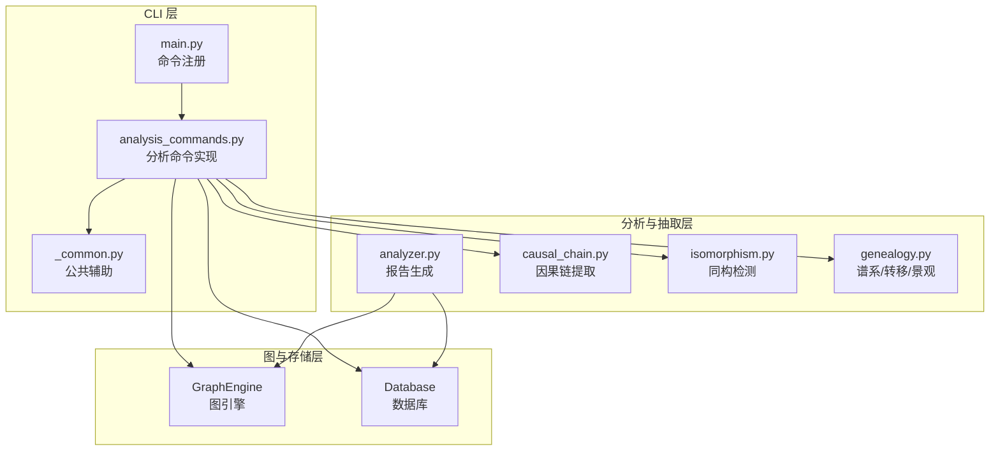
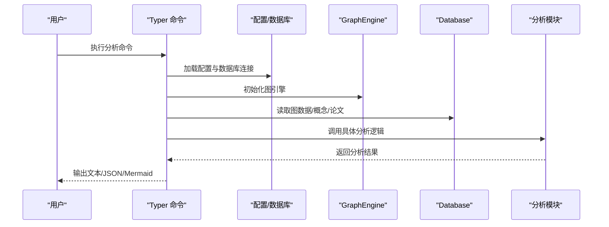
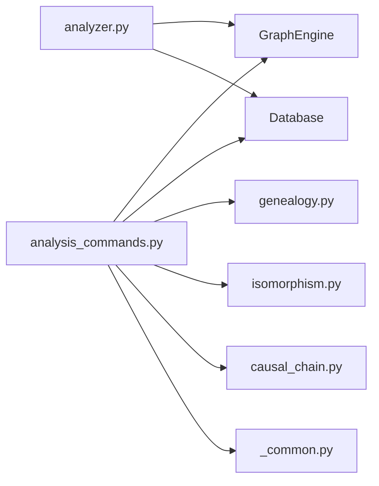

# 分析命令

<cite>
**本文引用的文件**
- [analysis_commands.py](file://src/drbrain/cli/analysis_commands.py)
- [_common.py](file://src/drbrain/cli/_common.py)
- [cli-reference.md](file://docs/cli-reference.md)
- [main.py](file://src/drbrain/cli/main.py)
- [analyzer.py](file://src/drbrain/report/analyzer.py)
- [causal_chain.py](file://src/drbrain/extractor/causal_chain.py)
- [isomorphism.py](file://src/drbrain/extractor/isomorphism.py)
- [genealogy.py](file://src/drbrain/graph/genealogy.py)
</cite>

## 目录
1. [简介](#简介)
2. [项目结构](#项目结构)
3. [核心组件](#核心组件)
4. [架构总览](#架构总览)
5. [详细组件分析](#详细组件分析)
6. [依赖分析](#依赖分析)
7. [性能考虑](#性能考虑)
8. [故障排查指南](#故障排查指南)
9. [结论](#结论)
10. [附录](#附录)

## 简介
本章节面向使用 DrBrain 进行学术知识图谱分析的用户，系统化梳理“分析命令”子集：ask、evolve、descendants、landscape、paradigm、transfers、isomorphism、difficulty、frontier、reason 等。内容覆盖命令参数、输出格式与结果解读，并提供因果链分析、范式转移检测、知识前沿探索、同构检测等高级分析功能的使用指南与可视化建议。

## 项目结构
分析命令位于 CLI 子模块中，通过 Typer 注册到主应用；其核心逻辑调用图引擎、数据库与抽取器模块完成分析任务。命令入口在主 CLI 文件中注册，公共辅助函数集中在 _common.py 中。

图表来源
- [main.py:100-142](file://src/drbrain/cli/main.py#L100-L142)
- [analysis_commands.py:10-18](file://src/drbrain/cli/analysis_commands.py#L10-L18)
- [analyzer.py:1-231](file://src/drbrain/report/analyzer.py#L1-L231)
- [causal_chain.py:1-238](file://src/drbrain/extractor/causal_chain.py#L1-L238)
- [isomorphism.py:1-257](file://src/drbrain/extractor/isomorphism.py#L1-L257)
- [genealogy.py:1-1001](file://src/drbrain/graph/genealogy.py#L1-L1001)

章节来源
- [main.py:100-142](file://src/drbrain/cli/main.py#L100-L142)
- [cli-reference.md:358-512](file://docs/cli-reference.md#L358-L512)

## 核心组件
- 命令注册与入口：在主 CLI 文件中注册分析类命令，统一加载配置与日志。
- 公共辅助：提供工作区解析、树节点补充、景观渲染、闭包上下文构建等通用能力。
- 分析执行：各命令按需加载图引擎与数据库，调用相应分析模块（谱系/转移/景观/因果链/同构/难度/前沿）。
- 报告生成：综合分析模块输出结构化报告，支持摘要与跨论文洞察。

章节来源
- [main.py:100-142](file://src/drbrain/cli/main.py#L100-L142)
- [_common.py:370-381](file://src/drbrain/cli/_common.py#L370-L381)
- [_common.py:749-775](file://src/drbrain/cli/_common.py#L749-L775)
- [_common.py:896-940](file://src/drbrain/cli/_common.py#L896-L940)
- [_common.py:941-988](file://src/drbrain/cli/_common.py#L941-L988)
- [analyzer.py:9-134](file://src/drbrain/report/analyzer.py#L9-L134)

## 架构总览
下图展示分析命令从 CLI 到图引擎与数据库的调用路径，以及关键分析模块的职责边界。

图表来源
- [analysis_commands.py:118-212](file://src/drbrain/cli/analysis_commands.py#L118-L212)
- [analysis_commands.py:214-266](file://src/drbrain/cli/analysis_commands.py#L214-L266)
- [analysis_commands.py:268-307](file://src/drbrain/cli/analysis_commands.py#L268-L307)
- [analysis_commands.py:309-343](file://src/drbrain/cli/analysis_commands.py#L309-L343)
- [analysis_commands.py:345-396](file://src/drbrain/cli/analysis_commands.py#L345-L396)
- [analysis_commands.py:398-548](file://src/drbrain/cli/analysis_commands.py#L398-L548)
- [analysis_commands.py:550-602](file://src/drbrain/cli/analysis_commands.py#L550-L602)
- [analysis_commands.py:604-678](file://src/drbrain/cli/analysis_commands.py#L604-L678)

## 详细组件分析

### ask 命令：自然语言问答
- 功能：检索知识图谱中的相关概念，结合 BM25 检索与可选的闭包增强，生成简洁回答。
- 关键参数
  - --top/-k：检索的概念数量（默认 5）
  - --json：以 JSON 格式输出（包含问题、答案、上下文）
- 输出格式
  - 文本模式：显示 Q/A 与基于的概念数量
  - JSON 模式：包含问题、答案、上下文三元组
- 结果解读
  - 回答质量受检索到的概念数量与关系上下文影响
  - 可结合 --json 观察检索到的概念及其邻域关系
- 使用建议
  - 提高 --top 值可提升召回但可能引入噪声
  - 若未配置 LLM，将仅输出上下文

章节来源
- [analysis_commands.py:118-212](file://src/drbrain/cli/analysis_commands.py#L118-L212)
- [cli-reference.md:179-191](file://docs/cli-reference.md#L179-L191)

### evolve 命令：概念谱系演化
- 功能：基于 BFS 遍历展示概念的祖先与后代（沿 extends/refines/applies 边），支持统计与时序信号。
- 关键参数
  - --direction/-d：ancestors/descendants/both（默认 both）
  - --max-depth/-n：最大遍历深度（默认 3）
  - --mermaid：以 Mermaid 图形输出
  - --stats：显示时间演化信号与年份分布
  - --json：以 JSON 输出
- 输出格式
  - 文本树：带层级与关系标注
  - Mermaid：可粘贴至支持 Mermaid 的编辑器
  - JSON：包含树结构与可选统计
- 结果解读
  - ancestors：追溯概念的来源与演进脉络
  - descendants：观察概念的扩展与应用方向
  - stats：信号类型（新兴/确立/衰落/争议/复苏）与年份趋势
- 使用建议
  - 结合 --stats 查看长时段趋势
  - 使用 --mermaid 快速可视化谱系

章节来源
- [analysis_commands.py:214-266](file://src/drbrain/cli/analysis_commands.py#L214-L266)
- [cli-reference.md:360-377](file://docs/cli-reference.md#L360-L377)
- [genealogy.py:14-71](file://src/drbrain/graph/genealogy.py#L14-L71)
- [genealogy.py:273-316](file://src/drbrain/graph/genealogy.py#L273-L316)

### descendants 命令：论文后代追踪
- 功能：从给定论文出发，递归追踪其被扩展、细化、应用、挑战或引用的后代论文。
- 关键参数
  - --generations/-g：世代数（默认 3）
  - --mermaid：Mermaid 输出
  - --json：JSON 输出
  - --sections：显示每个概念的章节出处
- 输出格式
  - 文本树：标注关系与年份
  - Mermaid：图形化后代网络
  - JSON：树结构与可选章节信息
- 结果解读
  - 识别思想传播路径与学术影响范围
  - 结合 --sections 定位思想在原文中的位置
- 使用建议
  - 适度增加 --generations 以观察更远影响
  - 启用 --sections 更易定位思想来源

章节来源
- [analysis_commands.py:268-307](file://src/drbrain/cli/analysis_commands.py#L268-L307)
- [cli-reference.md:379-394](file://docs/cli-reference.md#L379-L394)
- [genealogy.py:189-271](file://src/drbrain/graph/genealogy.py#L189-L271)

### landscape 命令：领域全景
- 功能：按年份排序展示论文与关键概念，同时识别持久性缺口与活跃争论。
- 关键参数
  - --top-n：每年显示的论文数（默认 5）
  - --json：JSON 输出
- 输出格式
  - 文本：年份时间线、关键概念列表、持久性缺口、活跃争论
  - JSON：包含 timeline、gaps、debates 字段
- 结果解读
  - timeline：把握领域发展脉络
  - gaps：识别长期未解决的问题
  - debates：发现当前争议焦点
- 使用建议
  - 限定工作区以聚焦特定主题
  - 结合 --json 用于下游可视化

章节来源
- [analysis_commands.py:309-343](file://src/drbrain/cli/analysis_commands.py#L309-L343)
- [cli-reference.md:396-408](file://docs/cli-reference.md#L396-L408)
- [genealogy.py:540-632](file://src/drbrain/graph/genealogy.py#L540-L632)
- [_common.py:896-940](file://src/drbrain/cli/_common.py#L896-L940)

### paradigm 命令：范式转移检测
- 功能：检测三种范式转移类型：替换（旧概念衰落、新概念兴起）、爆炸（概念快速扩散）、跨域入侵（方法在新领域传播并引发连锁反应）。
- 关键参数
  - --workspace/-w：扫描整个工作区
  - --json：JSON 输出
- 输出格式
  - 文本：类型标签与描述，附来源/目标出处
  - JSON：包含类型、描述、涉及概念及置信度
- 结果解读
  - 替换：关注“挑战”边上的衰落与新生
  - 爆炸：关注概念的快速扩散与后代数量
  - 跨域：关注“应用”边上的级联传播
- 使用建议
  - 结合工作区过滤，聚焦特定领域
  - 注意阈值参数对检测敏感度的影响

章节来源
- [analysis_commands.py:345-396](file://src/drbrain/cli/analysis_commands.py#L345-L396)
- [cli-reference.md:410-422](file://docs/cli-reference.md#L410-L422)
- [genealogy.py:318-494](file://src/drbrain/graph/genealogy.py#L318-L494)

### transfers 命令：跨域迁移机会
- 功能：发现方法（Method）到问题（Problem）的跨域迁移机会，支持显式工作区与自动聚类两种模式，亦可查看历史迁移。
- 关键参数
  - --from/--to：源/目标工作区（显式模式）
  - --auto：自动聚类检测（基于标签相似度）
  - --history：查看历史迁移时间线
  - --min-confidence：最小置信度（默认 0.3）
  - --sections：显示迁移概念的章节出处
  - --json：JSON 输出
- 输出格式
  - 文本：迁移对与置信度，可选章节标注
  - JSON：包含源方法、目标问题、置信度与出处
- 结果解读
  - 显式模式：限定源/目标领域，适合定向探索
  - 自动模式：基于标签相似度聚类，适合无先验领域的探索
  - 历史模式：按年份回溯迁移轨迹
- 使用建议
  - 适当提高 --min-confidence 过滤噪声
  - 启用 --sections 定位迁移思想的来源章节

章节来源
- [analysis_commands.py:398-548](file://src/drbrain/cli/analysis_commands.py#L398-L548)
- [cli-reference.md:424-442](file://docs/cli-reference.md#L424-L442)
- [genealogy.py:779-1001](file://src/drbrain/graph/genealogy.py#L779-L1001)

### isomorphism 命令：结构同构检测
- 功能：寻找跨领域结构上相似的概念模式（基于入/出关系签名与标签相似度），并可补充 RAPTOR 上下文。
- 关键参数
  - --min-confidence：最小置信度（默认 0.5）
  - --json：JSON 输出（包含 RAPTOR 上下文）
- 输出格式
  - 文本：双向映射与共享结构描述
  - JSON：包含源/目标域、共享结构、置信度与 RAPTOR 上下文
- 结果解读
  - 置信度由关系签名 Jaccard 与标签相似度加权得到
  - RAPTOR 上下文有助于理解跨域映射的语义背景
- 使用建议
  - 降低 --min-confidence 以扩大候选集合
  - 结合 JSON 输出进行深入对比分析

章节来源
- [analysis_commands.py:550-602](file://src/drbrain/cli/analysis_commands.py#L550-L602)
- [cli-reference.md:444-457](file://docs/cli-reference.md#L444-L457)
- [isomorphism.py:17-171](file://src/drbrain/extractor/isomorphism.py#L17-L171)
- [isomorphism.py:173-257](file://src/drbrain/extractor/isomorphism.py#L173-L257)

### difficulty 命令：难度地图
- 功能：按来源章节语义对知识缺口进行分类，形成难度地图。
- 关键参数
  - --json：JSON 输出
- 输出格式
  - 文本：四类缺口（限制、未来工作、讨论、未分类）的数量与示例
  - JSON：按类别分组的缺口列表
- 结果解读
  - 限制类：来自“限制/弱点/不足”的缺口
  - 未来工作类：来自“未来/开放问题”的缺口
  - 讨论类：来自“讨论/结论”的缺口
  - 未分类：其他来源的缺口
- 使用建议
  - 结合领域知识评估各类缺口的优先级

章节来源
- [analysis_commands.py:604-638](file://src/drbrain/cli/analysis_commands.py#L604-L638)
- [cli-reference.md:459-470](file://docs/cli-reference.md#L459-L470)
- [genealogy.py:635-682](file://src/drbrain/graph/genealogy.py#L635-L682)

### frontier 命令：知识前沿
- 功能：综合活跃缺口、争论、范式转移与难度分布，生成知识前沿报告。
- 关键参数
  - --json：JSON 输出
- 输出格式
  - 文本：摘要、活跃缺口、活跃争论、范式转移与难度分布
  - JSON：包含活跃/陈旧缺口、争论、范式转移与难度统计
- 结果解读
  - 活跃缺口：近 3 年内出现的缺口
  - 陈旧缺口：较早年份的缺口
  - 争论：当前活跃的争议点
  - 范式转移：领域内的重大变化
  - 难度分布：缺口来源章节类型的统计
- 使用建议
  - 结合 --json 用于自动化报告与可视化

章节来源
- [analysis_commands.py:639-678](file://src/drbrain/cli/analysis_commands.py#L639-L678)
- [cli-reference.md:472-483](file://docs/cli-reference.md#L472-L483)
- [genealogy.py:684-753](file://src/drbrain/graph/genealogy.py#L684-L753)

### reason 命令：图驱动推理
- 功能：基于工具调用的 LLM-KG 迭代推理，支持单向与双向验证（约束校验）。
- 关键参数
  - --bidirectional/-b：启用双向迭代推理
  - --max-rounds/-r：最大假设修订轮次（默认 3）
- 输出格式
  - 文本：答案与探索的假设数量、每轮一致性与违反模式数量
- 结果解读
  - 单向：直接生成答案
  - 双向：在每轮中用图约束验证假设，减少幻觉
- 使用建议
  - 在需要严谨性的场景启用 --bidirectional
  - 控制 --max-rounds 平衡成本与精度

章节来源
- [analysis_commands.py:54-116](file://src/drbrain/cli/analysis_commands.py#L54-L116)
- [cli-reference.md:552-564](file://docs/cli-reference.md#L552-L564)

## 依赖分析
- 命令到模块的依赖
  - ask/evolve/descendants/landscape/paradigm/transfers/isomorphism/difficulty/frontier/reason 均依赖 GraphEngine 与 Database
  - 公共辅助函数贯穿多个命令，如工作区解析、树节点补充、景观渲染、闭包上下文构建
- 分析模块的内部依赖
  - 谱系/转移/景观：依赖 genealogy.py
  - 同构检测：依赖 isomorphism.py
  - 因果链：依赖 causal_chain.py
  - 综合分析报告：依赖 analyzer.py

图表来源
- [analysis_commands.py:10-18](file://src/drbrain/cli/analysis_commands.py#L10-L18)
- [analyzer.py:5-6](file://src/drbrain/report/analyzer.py#L5-L6)
- [_common.py:13-23](file://src/drbrain/cli/_common.py#L13-L23)

章节来源
- [analysis_commands.py:10-18](file://src/drbrain/cli/analysis_commands.py#L10-L18)
- [analyzer.py:5-6](file://src/drbrain/report/analyzer.py#L5-L6)
- [_common.py:13-23](file://src/drbrain/cli/_common.py#L13-L23)

## 性能考虑
- 搜索与遍历
  - ask/evolve/descendants 等命令涉及 BM25 检索与图遍历，合理设置 --top 与 --max-depth 可控制计算量
- 闭包增强
  - 闭包增量推断会引入额外计算，建议在需要时启用并限制返回条目（如 --stats、--mermaid）
- 大规模数据
  - transfers 的自动聚类与 isomorphism 的签名匹配在大规模图上可能耗时，可通过调整阈值与采样策略优化
- I/O 与缓存
  - JSON 输出便于流水线处理，但会增加 I/O；若追求交互体验，优先使用文本输出

## 故障排查指南
- 未配置 LLM
  - 现象：ask/reason 等命令提示未配置模型
  - 处理：运行初始化流程并配置模型后重试
- 数据库为空或未构建图
  - 现象：frontier/difficulty/paradigm 等命令无结果
  - 处理：先执行构建命令生成图后再运行分析
- 工作区解析失败
  - 现象：landscape/paradigm/transfers 报错或无结果
  - 处理：确认工作区名称正确，或提供论文 ID 列表
- 未找到概念/论文
  - 现象：evolve/descendants/paradigm 等提示未找到
  - 处理：检查标签拼写或先执行构建

章节来源
- [analysis_commands.py:90-94](file://src/drbrain/cli/analysis_commands.py#L90-L94)
- [analysis_commands.py:244-248](file://src/drbrain/cli/analysis_commands.py#L244-L248)
- [analysis_commands.py:290-294](file://src/drbrain/cli/analysis_commands.py#L290-L294)
- [analysis_commands.py:337-339](file://src/drbrain/cli/analysis_commands.py#L337-L339)

## 结论
DrBrain 的分析命令围绕“检索—推理—可视化—报告”闭环展开，既支持交互式探索，也支持机器可读输出。通过组合使用 ask、evolve、descendants、landscape、paradigm、transfers、isomorphism、difficulty、frontier、reason 等命令，用户可以系统地把握知识图谱中的关键线索、思想脉络与跨域机会，并据此制定研究方向与策略。

## 附录
- 可视化建议
  - Mermaid 输出：适用于快速绘制谱系与后代网络
  - JSON 输出：便于后续脚本处理与仪表板集成
  - 景观渲染：结合 --top-n 展示年度关键论文与缺口
- 深度解读方法
  - 因果链：结合因果链提取模块，定位机制与路径
  - 同构：结合 RAPTOR 上下文，理解跨域映射的语义基础
  - 范式转移：结合谱系与转移检测，识别重大变化的触发因素与传播路径