# 子应用

<cite>
**本文引用的文件**
- [src/drbrain/cli/main.py](file://src/drbrain/cli/main.py)
- [src/drbrain/cli/graph_commands.py](file://src/drbrain/cli/graph_commands.py)
- [src/drbrain/cli/ws_commands.py](file://src/drbrain/cli/ws_commands.py)
- [src/drbrain/cli/_common.py](file://src/drbrain/cli/_common.py)
- [src/drbrain/graph/engine.py](file://src/drbrain/graph/engine.py)
- [src/drbrain/storage/database.py](file://src/drbrain/storage/database.py)
- [src/drbrain/storage/workspace.py](file://src/drbrain/storage/workspace.py)
- [src/drbrain/graph/query_embeddings.py](file://src/drbrain/graph/query_embeddings.py)
- [src/drbrain/services/graph_to_text.py](file://src/drbrain/services/graph_to_text.py)
- [skills/graph/SKILL.md](file://skills/graph/SKILL.md)
- [skills/workspace-analysis/SKILL.md](file://skills/workspace-analysis/SKILL.md)
- [src/drbrain/config.py](file://src/drbrain/config.py)
</cite>

## 目录
1. [简介](#简介)
2. [项目结构](#项目结构)
3. [核心组件](#核心组件)
4. [架构总览](#架构总览)
5. [详细组件分析](#详细组件分析)
6. [依赖关系分析](#依赖关系分析)
7. [性能考量](#性能考量)
8. [故障排查指南](#故障排查指南)
9. [结论](#结论)
10. [附录](#附录)

## 简介
本文件面向 DrBrain 的子应用，系统化梳理并文档化两个子应用：graph（知识图谱）与 ws（工作空间）。内容覆盖：
- graph 子应用：图遍历、最短路径、跨论文关联分析、子图描述、嵌入式复杂查询、混合树+图遍历等能力与使用方式。
- ws 子应用：工作空间的创建、增删改查、内容管理、与主应用分析命令的协同工作方式。
- 配置方法、扩展机制与集成使用指南，以及子应用与主应用之间的交互与数据共享机制。

## 项目结构
DrBrain 的 CLI 主入口在主应用中注册所有命令，并通过 add_typer 将 graph 与 ws 作为子应用挂载。graph 子应用提供直接的图查询能力；ws 子应用提供工作空间的生命周期管理。

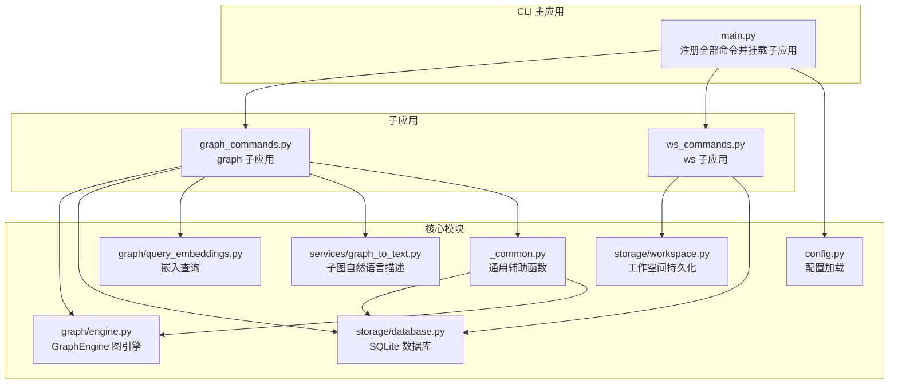

图表来源
- [src/drbrain/cli/main.py:144-146](file://src/drbrain/cli/main.py#L144-L146)
- [src/drbrain/cli/graph_commands.py:17](file://src/drbrain/cli/graph_commands.py#L17)
- [src/drbrain/cli/ws_commands.py:9](file://src/drbrain/cli/ws_commands.py#L9)
- [src/drbrain/graph/engine.py:33](file://src/drbrain/graph/engine.py#L33)
- [src/drbrain/storage/database.py:159](file://src/drbrain/storage/database.py#L159)
- [src/drbrain/storage/workspace.py:71](file://src/drbrain/storage/workspace.py#L71)
- [src/drbrain/graph/query_embeddings.py:133](file://src/drbrain/graph/query_embeddings.py#L133)
- [src/drbrain/services/graph_to_text.py:70](file://src/drbrain/services/graph_to_text.py#L70)
- [src/drbrain/config.py:283](file://src/drbrain/config.py#L283)

章节来源
- [src/drbrain/cli/main.py:144-146](file://src/drbrain/cli/main.py#L144-L146)
- [src/drbrain/cli/graph_commands.py:17](file://src/drbrain/cli/graph_commands.py#L17)
- [src/drbrain/cli/ws_commands.py:9](file://src/drbrain/cli/ws_commands.py#L9)

## 核心组件
- graph 子应用：提供 neighbors、path、related、describe、query、traverse-from 等命令，支持关系过滤、方向控制、跨论文概念分析、子图自然语言描述、嵌入式复杂查询与混合树+图遍历。
- ws 子应用：提供 create、add、remove、list、show、delete、rename 等命令，实现工作空间的全生命周期管理与 JSON 输出模式。
- 共享组件：GraphEngine 提供图遍历、规则闭包、嵌入学习与预测、从数据库加载/持久化；Database 提供论文、概念、边、别名、嵌入等表的访问；Workspace 提供工作空间元数据与引用列表的读写；_common 提供工作空间解析、节点类型解析、DOI 增强等通用逻辑。

章节来源
- [src/drbrain/cli/graph_commands.py:20-756](file://src/drbrain/cli/graph_commands.py#L20-L756)
- [src/drbrain/cli/ws_commands.py:12-171](file://src/drbrain/cli/ws_commands.py#L12-L171)
- [src/drbrain/graph/engine.py:33-800](file://src/drbrain/graph/engine.py#L33-L800)
- [src/drbrain/storage/database.py:159-775](file://src/drbrain/storage/database.py#L159-L775)
- [src/drbrain/storage/workspace.py:71-212](file://src/drbrain/storage/workspace.py#L71-L212)
- [src/drbrain/cli/_common.py:370-381](file://src/drbrain/cli/_common.py#L370-L381)

## 架构总览
graph 与 ws 子应用均通过 Typer 注册命令，调用各自的服务与共享模块完成业务逻辑。graph 子应用侧重于图结构与嵌入查询；ws 子应用侧重于工作空间的元数据与引用管理。两者均可通过 --workspace/-w 参数限定分析范围，实现“按域聚焦”的研究范式。

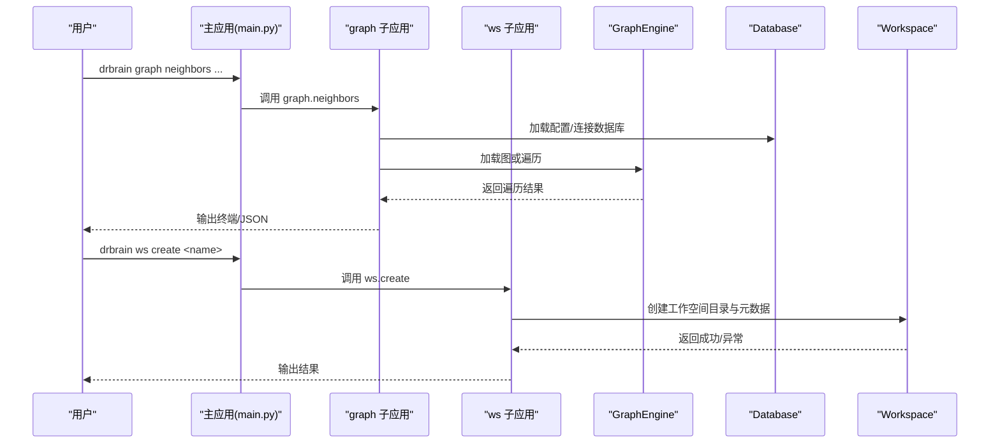

图表来源
- [src/drbrain/cli/main.py:144-146](file://src/drbrain/cli/main.py#L144-L146)
- [src/drbrain/cli/graph_commands.py:41-132](file://src/drbrain/cli/graph_commands.py#L41-L132)
- [src/drbrain/cli/ws_commands.py:21-32](file://src/drbrain/cli/ws_commands.py#L21-L32)
- [src/drbrain/graph/engine.py:760-780](file://src/drbrain/graph/engine.py#L760-L780)
- [src/drbrain/storage/database.py:159-174](file://src/drbrain/storage/database.py#L159-L174)
- [src/drbrain/storage/workspace.py:71-100](file://src/drbrain/storage/workspace.py#L71-L100)

## 详细组件分析

### graph 子应用详解
graph 子应用提供以下命令与能力：

- neighbors：从给定节点出发进行多跳遍历，支持关系过滤与方向控制，可输出 JSON 或终端格式，并可限定工作空间。
- path：在无向图上寻找两点间最短路径，恢复有向边方向，支持最大长度限制与 JSON 输出。
- related：跨论文分析共享概念、共享边或基于图遍历的共享概念，支持最小共享阈值。
- describe：生成子图的自然语言描述，结合 LLM 与路径描述模板。
- query：执行嵌入式复杂查询（project/intersect/union/negate），需要已训练的 TransE 嵌入。
- traverse-from：从文档树中的某个章节出发，找到锚定该章节的概念，再在知识图谱中遍历。

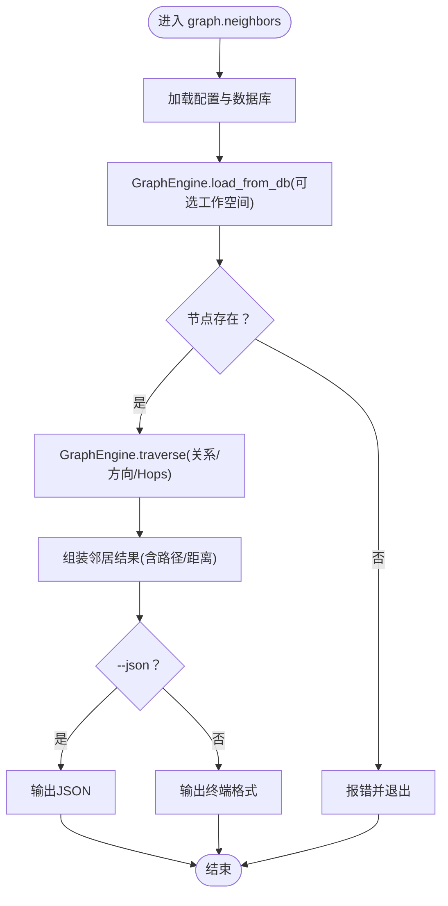

图表来源
- [src/drbrain/cli/graph_commands.py:41-132](file://src/drbrain/cli/graph_commands.py#L41-L132)
- [src/drbrain/graph/engine.py:62-122](file://src/drbrain/graph/engine.py#L62-L122)
- [src/drbrain/storage/database.py:159-174](file://src/drbrain/storage/database.py#L159-L174)

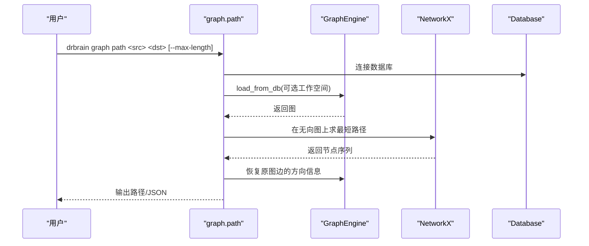

图表来源
- [src/drbrain/cli/graph_commands.py:154-263](file://src/drbrain/cli/graph_commands.py#L154-L263)
- [src/drbrain/graph/engine.py:760-780](file://src/drbrain/graph/engine.py#L760-L780)

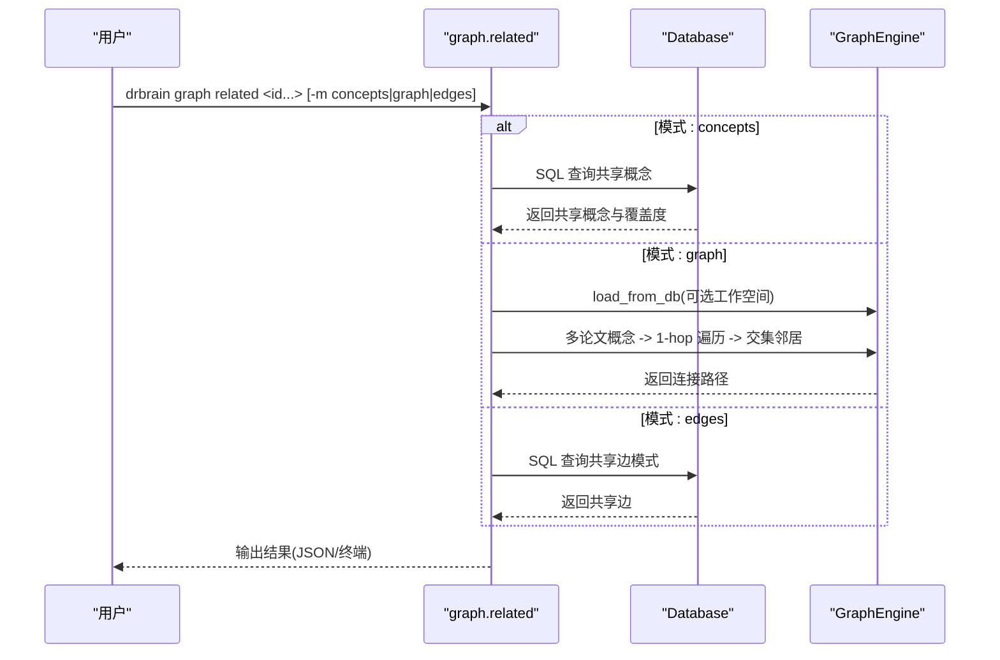

图表来源
- [src/drbrain/cli/graph_commands.py:266-501](file://src/drbrain/cli/graph_commands.py#L266-L501)
- [src/drbrain/storage/database.py:159-775](file://src/drbrain/storage/database.py#L159-L775)
- [src/drbrain/graph/engine.py:760-780](file://src/drbrain/graph/engine.py#L760-L780)

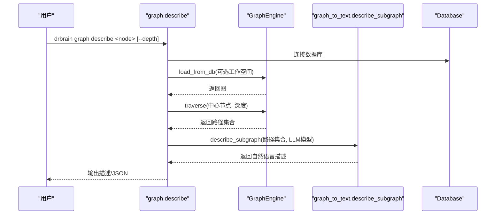

图表来源
- [src/drbrain/cli/graph_commands.py:503-573](file://src/drbrain/cli/graph_commands.py#L503-L573)
- [src/drbrain/services/graph_to_text.py:70-145](file://src/drbrain/services/graph_to_text.py#L70-L145)
- [src/drbrain/graph/engine.py:62-122](file://src/drbrain/graph/engine.py#L62-L122)

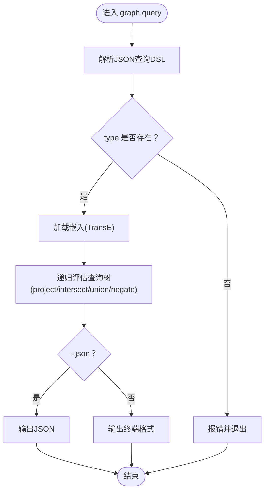

图表来源
- [src/drbrain/cli/graph_commands.py:576-621](file://src/drbrain/cli/graph_commands.py#L576-L621)
- [src/drbrain/graph/query_embeddings.py:133-226](file://src/drbrain/graph/query_embeddings.py#L133-L226)

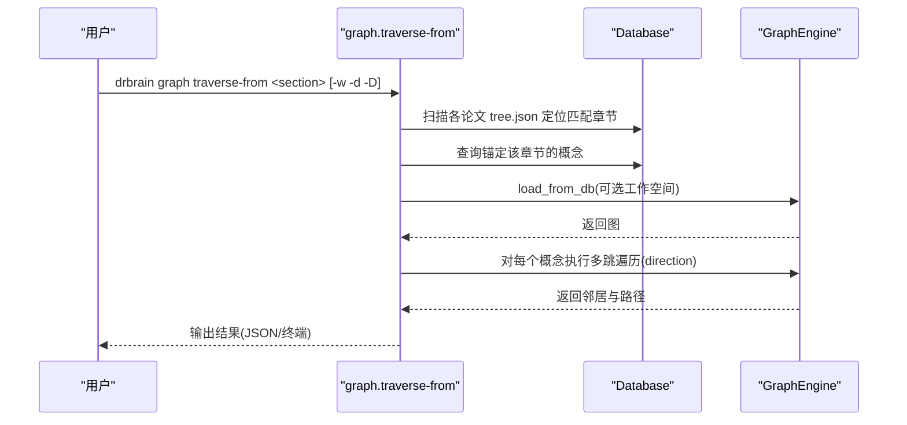

图表来源
- [src/drbrain/cli/graph_commands.py:623-756](file://src/drbrain/cli/graph_commands.py#L623-L756)
- [src/drbrain/graph/engine.py:760-780](file://src/drbrain/graph/engine.py#L760-L780)

章节来源
- [src/drbrain/cli/graph_commands.py:20-756](file://src/drbrain/cli/graph_commands.py#L20-L756)
- [skills/graph/SKILL.md:25-126](file://skills/graph/SKILL.md#L25-L126)

### ws 子应用详解
ws 子应用提供工作空间的全生命周期管理与内容维护，支持 JSON 输出模式，便于自动化集成。

- create：创建新工作空间，写入元数据与空引用列表。
- add/remove：向工作空间添加或移除论文引用，自动去重。
- list/show/delete/rename：列出、展示详情、删除与重命名工作空间。
- 与分析命令的协同：所有分析命令均可通过 --workspace/-w 限定作用域，实现“按域聚焦”的分析。

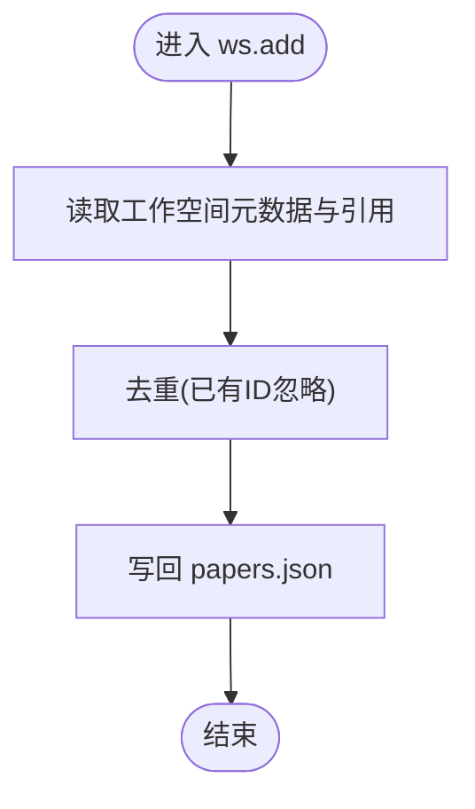

图表来源
- [src/drbrain/cli/ws_commands.py:35-56](file://src/drbrain/cli/ws_commands.py#L35-L56)
- [src/drbrain/storage/workspace.py:103-120](file://src/drbrain/storage/workspace.py#L103-L120)

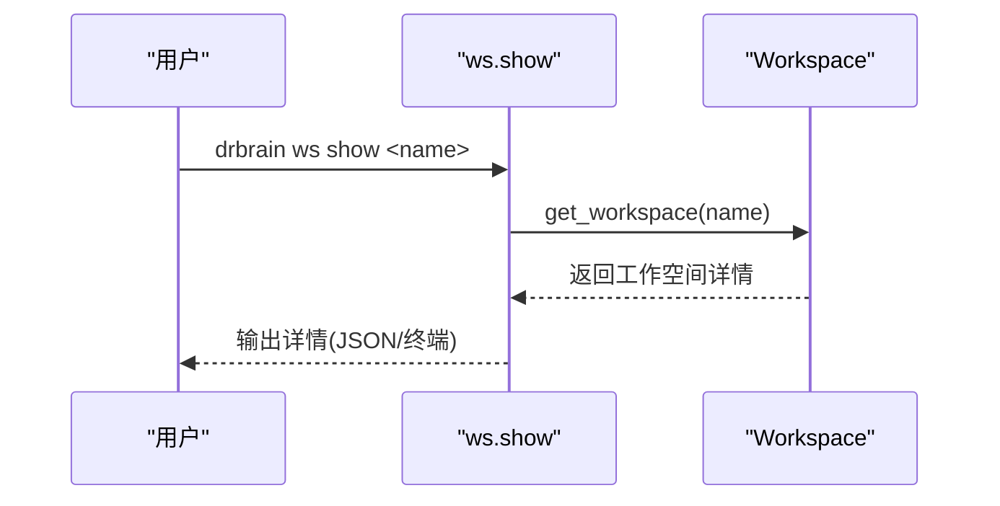

图表来源
- [src/drbrain/cli/ws_commands.py:94-121](file://src/drbrain/cli/ws_commands.py#L94-L121)
- [src/drbrain/storage/workspace.py:142-155](file://src/drbrain/storage/workspace.py#L142-L155)

章节来源
- [src/drbrain/cli/ws_commands.py:12-171](file://src/drbrain/cli/ws_commands.py#L12-L171)
- [src/drbrain/storage/workspace.py:71-212](file://src/drbrain/storage/workspace.py#L71-L212)
- [skills/workspace-analysis/SKILL.md:24-89](file://skills/workspace-analysis/SKILL.md#L24-L89)

## 依赖关系分析
- graph 子应用依赖：
  - GraphEngine：提供图遍历、规则闭包、嵌入学习与预测、从数据库加载/持久化。
  - Database：提供论文、概念、边、别名、嵌入等表的访问。
  - graph_to_text：提供子图路径到自然语言的描述。
  - query_embeddings：提供嵌入式复杂查询（project/intersect/union/negate）。
  - _common：提供工作空间解析、节点类型解析等通用逻辑。
- ws 子应用依赖：
  - storage/workspace：提供工作空间的创建、读取、更新、删除与重命名。
  - Database：用于工作空间元数据与引用列表的持久化。

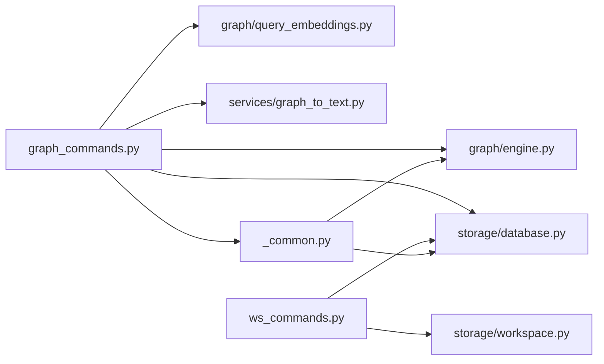

图表来源
- [src/drbrain/cli/graph_commands.py:11-15](file://src/drbrain/cli/graph_commands.py#L11-L15)
- [src/drbrain/cli/ws_commands.py:19-100](file://src/drbrain/cli/ws_commands.py#L19-L100)
- [src/drbrain/cli/_common.py:370-381](file://src/drbrain/cli/_common.py#L370-L381)

章节来源
- [src/drbrain/cli/graph_commands.py:11-15](file://src/drbrain/cli/graph_commands.py#L11-L15)
- [src/drbrain/cli/ws_commands.py:19-100](file://src/drbrain/cli/ws_commands.py#L19-L100)
- [src/drbrain/cli/_common.py:370-381](file://src/drbrain/cli/_common.py#L370-L381)

## 性能考量
- 图遍历与路径查找：neighbors/path 使用 BFS 层序展开，复杂度与节点数与边数线性相关；建议合理设置 hops 与 max-length，避免大规模图上的高复杂度搜索。
- 关系过滤与方向控制：通过 relations 与 direction 可显著缩小搜索空间，提升效率。
- 嵌入查询：project/intersect/union/negate 基于向量相似度计算，实体/关系向量规模越大，计算成本越高；建议在必要时加载 TransE 嵌入并限制 top_k。
- 工作空间限定：通过 --workspace/-w 仅加载指定论文的边，可显著减少图规模，提高遍历与查询性能。
- I/O 优化：Database 默认 WAL 模式与索引（如 idx_edges_relation、idx_concepts_label）有助于查询性能；批量写入（如 _write_papers）采用临时文件替换策略，降低锁竞争。

## 故障排查指南
- 节点不存在：neighbors/path 在节点不在图中时会提示错误并退出。
- 无路径/邻居：当两点无连通路径或目标节点无邻居时，命令会输出相应提示。
- 无效关系/方向：neighbors 对关系与方向参数进行校验，非法值会提示有效选项。
- 工作空间不存在/重名冲突：ws 子应用对工作空间名称进行校验，重复创建/重名冲突会抛出异常。
- 嵌入未训练：graph.query 需要 TransE 嵌入，若未训练则返回“无结果”提示。
- 配置缺失：部分命令依赖 LLM 模型配置，若未配置会提示运行 setup。

章节来源
- [src/drbrain/cli/graph_commands.py:68-73](file://src/drbrain/cli/graph_commands.py#L68-L73)
- [src/drbrain/cli/graph_commands.py:174-186](file://src/drbrain/cli/graph_commands.py#L174-L186)
- [src/drbrain/cli/graph_commands.py:315-316](file://src/drbrain/cli/graph_commands.py#L315-L316)
- [src/drbrain/cli/ws_commands.py:27-32](file://src/drbrain/cli/ws_commands.py#L27-L32)
- [src/drbrain/cli/_common.py:143-147](file://src/drbrain/cli/_common.py#L143-L147)

## 结论
graph 与 ws 子应用分别覆盖了 DrBrain 的两大核心能力：以图为中心的知识探索与以域为单位的研究聚焦。通过统一的 CLI 接口与共享的图引擎、数据库与工作空间模块，二者实现了良好的解耦与复用。配合 --workspace 限定范围，用户可以高效地在全库与特定子域之间切换，开展从图遍历、路径发现到子图描述与嵌入查询的全流程知识分析。

## 附录

### 配置方法与扩展机制
- 配置加载：主应用在回调中加载配置，子应用通过 ctx.obj["config"] 获取；配置项包括数据库路径、目录结构、嵌入模型、API 密钥等。
- 扩展机制：新增命令可通过 Typer 在主应用中注册，或在子应用内新增命令文件并通过 main.py 的 add_typer 挂载；共享逻辑放入 _common 与对应服务模块。
- 集成使用：graph 与 ws 均支持 --json 输出，便于与其他工具链集成；分析命令可直接通过 --workspace/-w 限定作用域。

章节来源
- [src/drbrain/cli/main.py:80-92](file://src/drbrain/cli/main.py#L80-L92)
- [src/drbrain/config.py:283-292](file://src/drbrain/config.py#L283-L292)

### 子应用与主应用交互与数据共享
- 交互方式：主应用统一注册命令并在回调中初始化日志与配置；graph/ws 子应用通过 Typer 子应用挂载，继承主应用上下文。
- 数据共享：GraphEngine 与 Database 作为共享组件被 graph 子应用广泛使用；_common 提供工作空间解析与节点类型解析等通用能力；ws 子应用通过 storage/workspace 与 Database 协同实现工作空间元数据与引用列表的持久化。

章节来源
- [src/drbrain/cli/main.py:144-146](file://src/drbrain/cli/main.py#L144-L146)
- [src/drbrain/graph/engine.py:760-780](file://src/drbrain/graph/engine.py#L760-L780)
- [src/drbrain/storage/database.py:159-174](file://src/drbrain/storage/database.py#L159-L174)
- [src/drbrain/cli/_common.py:370-381](file://src/drbrain/cli/_common.py#L370-L381)