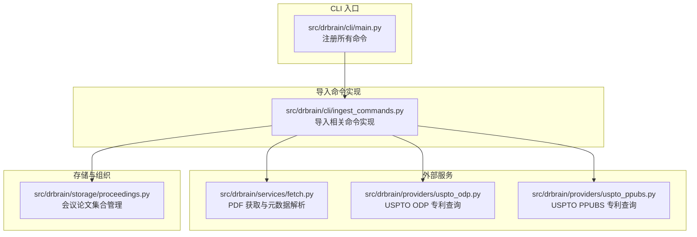
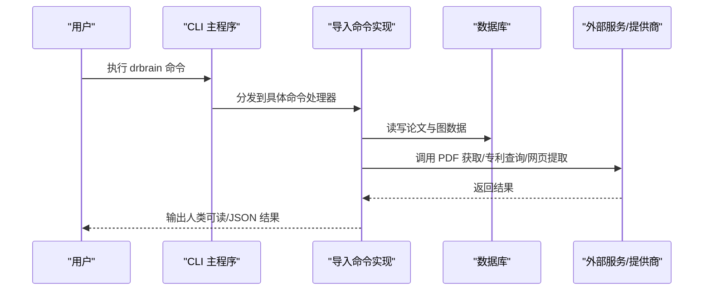
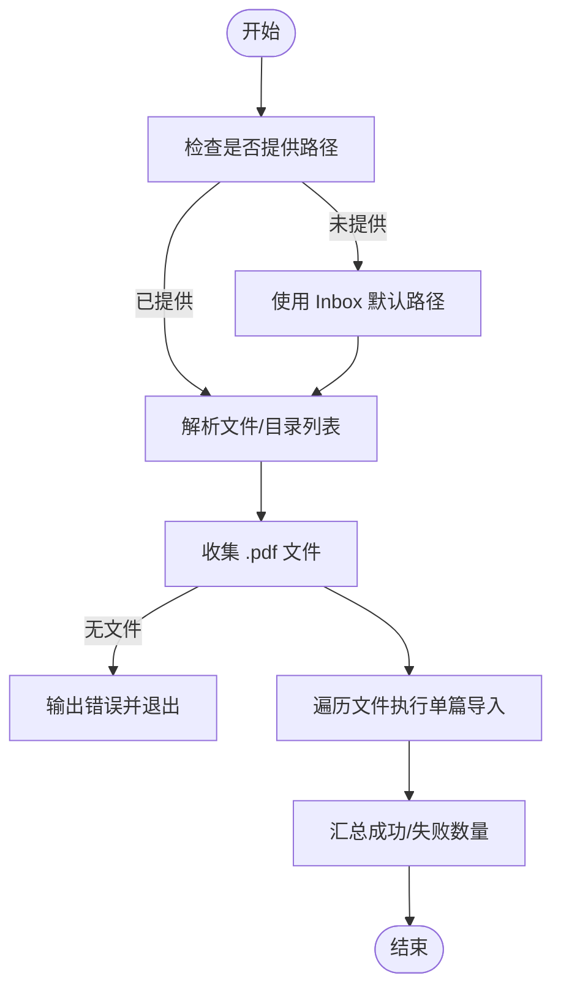
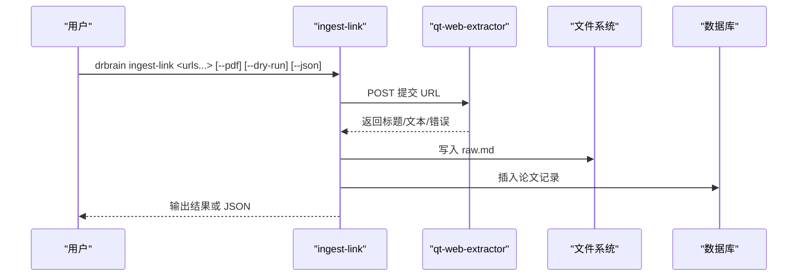
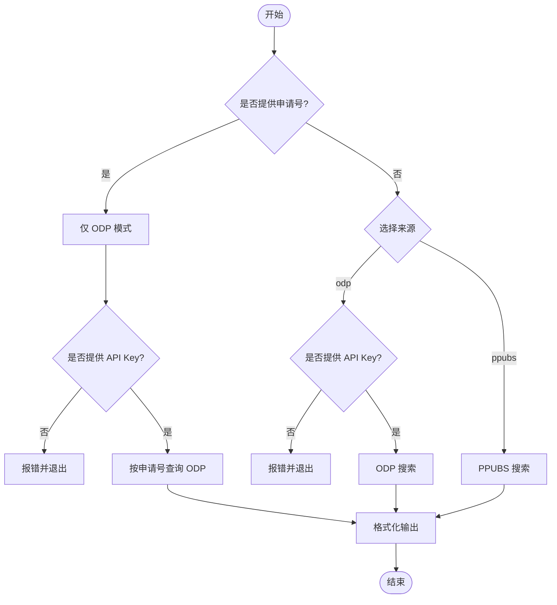
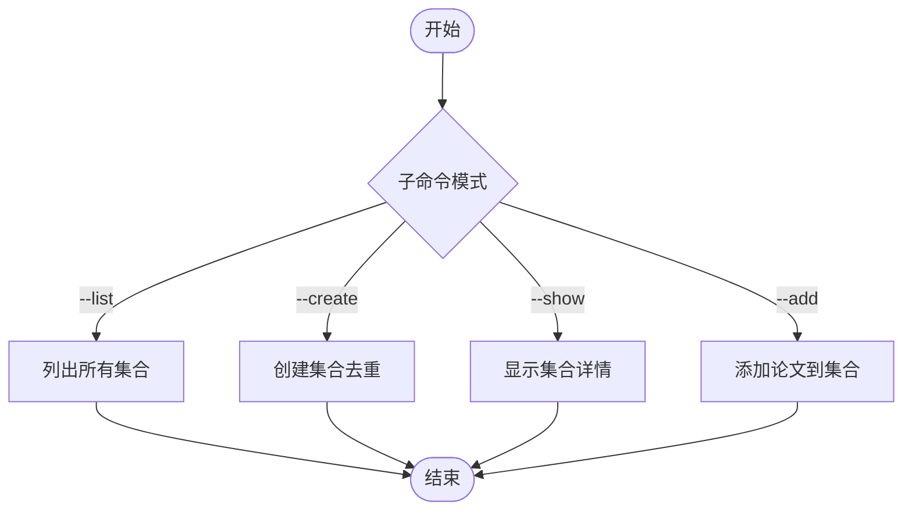
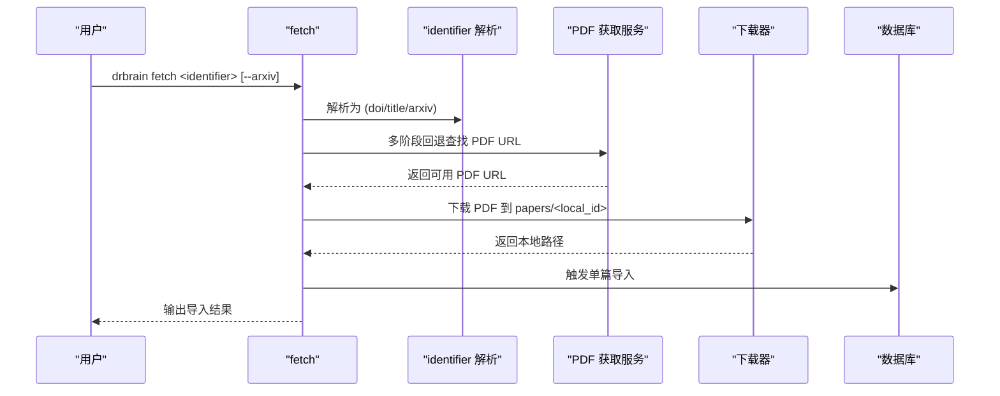
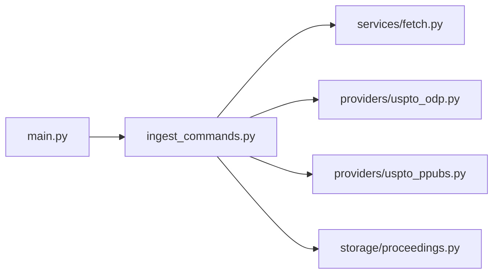

# 导入命令

<cite>
**本文引用的文件**
- [src/drbrain/cli/main.py](file://src/drbrain/cli/main.py)
- [src/drbrain/cli/ingest_commands.py](file://src/drbrain/cli/ingest_commands.py)
- [src/drbrain/services/fetch.py](file://src/drbrain/services/fetch.py)
- [src/drbrain/providers/uspto_odp.py](file://src/drbrain/providers/uspto_odp.py)
- [src/drbrain/providers/uspto_ppubs.py](file://src/drbrain/providers/uspto_ppubs.py)
- [src/drbrain/storage/proceedings.py](file://src/drbrain/storage/proceedings.py)
- [skills/paper-ingest/SKILL.md](file://skills/paper-ingest/SKILL.md)
- [skills/ingest-link/SKILL.md](file://skills/ingest-link/SKILL.md)
- [skills/proceedings/SKILL.md](file://skills/proceedings/SKILL.md)
- [skills/patent-search/SKILL.md](file://skills/patent-search/SKILL.md)
- [skills/citation-tracking/SKILL.md](file://skills/citation-tracking/SKILL.md)
- [scripts/batch_ingest.sh](file://scripts/batch_ingest.sh)
</cite>

## 目录
1. [简介](#简介)
2. [项目结构](#项目结构)
3. [核心组件](#核心组件)
4. [架构总览](#架构总览)
5. [详细组件分析](#详细组件分析)
6. [依赖分析](#依赖分析)
7. [性能考虑](#性能考虑)
8. [故障排查指南](#故障排查指南)
9. [结论](#结论)
10. [附录](#附录)

## 简介
本章节面向需要通过命令行批量或交互式导入学术资源（PDF、网页链接、专利、会议论文）到 DrBrain 知识图谱的用户与工程师，系统性梳理 ingest、ingest-link、patent-search、proceedings、explore、fetch、citations、check-citations、report、closure 等导入相关命令。内容覆盖参数与选项、输入格式、典型使用场景、批量导入最佳实践、错误处理与数据验证方法，并辅以可视化流程帮助理解端到端处理链路。

## 项目结构
DrBrain 的 CLI 入口集中于主模块，导入类命令在独立的 ingest_commands 模块中实现；部分外部服务（如专利检索、PDF 获取）由对应 provider 或 service 模块提供能力；会议论文集合管理由存储层模块维护。

**图表来源**
- [src/drbrain/cli/main.py:77-150](file://src/drbrain/cli/main.py#L77-L150)
- [src/drbrain/cli/ingest_commands.py:1-935](file://src/drbrain/cli/ingest_commands.py#L1-L935)
- [src/drbrain/services/fetch.py:1-345](file://src/drbrain/services/fetch.py#L1-L345)
- [src/drbrain/providers/uspto_odp.py:1-289](file://src/drbrain/providers/uspto_odp.py#L1-L289)
- [src/drbrain/providers/uspto_ppubs.py:1-350](file://src/drbrain/providers/uspto_ppubs.py#L1-L350)
- [src/drbrain/storage/proceedings.py:1-122](file://src/drbrain/storage/proceedings.py#L1-L122)

**章节来源**
- [src/drbrain/cli/main.py:77-150](file://src/drbrain/cli/main.py#L77-L150)
- [src/drbrain/cli/ingest_commands.py:1-935](file://src/drbrain/cli/ingest_commands.py#L1-L935)

## 核心组件
- CLI 主入口：集中注册并分发命令，加载配置与日志。
- 导入命令集：涵盖 PDF 批量导入、网页链接导入、专利搜索、会议论文集合管理、引用关系查询与校验、报告生成、图闭包推理等。
- 外部服务与提供商：PDF 获取与多阶段回退、USPTO 专利查询（ODP/PPUBS）、会议论文集合持久化。
- 技能文档：提供面向用户的快速开始与参考清单，便于理解命令用途与典型用法。

**章节来源**
- [src/drbrain/cli/main.py:77-150](file://src/drbrain/cli/main.py#L77-L150)
- [skills/paper-ingest/SKILL.md:1-98](file://skills/paper-ingest/SKILL.md#L1-L98)
- [skills/ingest-link/SKILL.md:1-45](file://skills/ingest-link/SKILL.md#L1-L45)
- [skills/proceedings/SKILL.md:1-39](file://skills/proceedings/SKILL.md#L1-L39)
- [skills/patent-search/SKILL.md:1-51](file://skills/patent-search/SKILL.md#L1-L51)
- [skills/citation-tracking/SKILL.md:1-88](file://skills/citation-tracking/SKILL.md#L1-L88)

## 架构总览
下图展示从 CLI 调用到具体处理逻辑与外部服务的整体流程，包括 PDF 批量导入、网页链接导入、专利搜索、会议论文集合管理、引用关系查询与报告生成的关键路径。

**图表来源**
- [src/drbrain/cli/main.py:77-150](file://src/drbrain/cli/main.py#L77-L150)
- [src/drbrain/cli/ingest_commands.py:1-935](file://src/drbrain/cli/ingest_commands.py#L1-L935)
- [src/drbrain/services/fetch.py:1-345](file://src/drbrain/services/fetch.py#L1-L345)
- [src/drbrain/providers/uspto_odp.py:1-289](file://src/drbrain/providers/uspto_odp.py#L1-L289)
- [src/drbrain/providers/uspto_ppubs.py:1-350](file://src/drbrain/providers/uspto_ppubs.py#L1-L350)
- [src/drbrain/storage/proceedings.py:1-122](file://src/drbrain/storage/proceedings.py#L1-L122)

## 详细组件分析

### ingest：PDF 批量导入
- 功能概述：解析 PDF、识别实体、构建文档树、抽取概念与论点、扩展引用网络、进行图闭包推理，最终入库。
- 输入与默认行为
  - 参数：PDF 文件或目录列表；若未提供则默认扫描 Inbox 目录。
  - 选项：--json 输出机器可读 JSON。
- 处理流程要点
  - 支持单文件、多文件、目录三种输入形式。
  - 遍历文件并逐个执行“单篇导入”流程。
  - 支持批量 JSON 输出统计摘要。
- 使用场景
  - 将下载的 PDF 放入 Inbox 后一键批量处理。
  - 直接指定目录或多个文件进行快速导入。
- 最佳实践
  - 建议先运行检查命令确认环境与依赖可用。
  - 对大量 PDF 可结合批处理脚本与断点续跑策略。
- 错误处理与数据验证
  - 未找到 PDF 时返回错误并退出。
  - 单篇失败不影响整体流程，支持汇总统计。
  - 失败项会进入待处理队列，便于后续诊断。

**图表来源**
- [src/drbrain/cli/ingest_commands.py:26-110](file://src/drbrain/cli/ingest_commands.py#L26-L110)

**章节来源**
- [src/drbrain/cli/ingest_commands.py:26-110](file://src/drbrain/cli/ingest_commands.py#L26-L110)
- [skills/paper-ingest/SKILL.md:20-98](file://skills/paper-ingest/SKILL.md#L20-L98)
- [scripts/batch_ingest.sh](file://scripts/batch_ingest.sh)

### ingest-link：网页链接导入
- 功能概述：通过外部 qt-web-extractor 服务抓取渲染后的内容，保存为 Markdown 并登记为上传状态的论文条目。
- 输入与选项
  - 参数：一个或多个 URL。
  - 选项：--pdf/--no-pdf 强制 PDF 提取模式；--dry-run 预览不保存；--json 输出 JSON。
- 处理流程要点
  - 检查外部服务可达性（默认 http://127.0.0.1:8766，可通过环境变量配置）。
  - 调用提取器获取标题、文本与元数据。
  - 写入 Markdown 到 papers/<slug>/raw.md，注册到数据库。
- 使用场景
  - 快速保存网页文章或在线 PDF。
  - 批量抓取研究主页、预印本站点或开放获取页面。
- 最佳实践
  - 在本地启动外部提取服务或配置正确的 WEBEXTRACT_URL。
  - 对长列表建议分批执行并开启 --dry-run 预览。
- 错误处理与数据验证
  - 服务不可达时报错并退出。
  - 提取失败时记录错误并跳过该条目。

**图表来源**
- [src/drbrain/cli/ingest_commands.py:464-567](file://src/drbrain/cli/ingest_commands.py#L464-L567)

**章节来源**
- [src/drbrain/cli/ingest_commands.py:464-567](file://src/drbrain/cli/ingest_commands.py#L464-L567)
- [skills/ingest-link/SKILL.md:1-45](file://skills/ingest-link/SKILL.md#L1-L45)

### patent-search：专利搜索
- 功能概述：支持两种来源：免费的 PPUBS（无需密钥）与需 API Key 的 ODP（更丰富元数据）。
- 输入与选项
  - 参数：搜索关键词列表。
  - 选项：--application/-a 按申请号查询（仅 ODP）；--limit/-n 限制结果数；--source/-s 指定来源（ppubs/odp）；--api-key 指定密钥；--json 输出 JSON。
- 处理流程要点
  - 若提供申请号：仅 ODP 支持，需 API Key。
  - 否则按来源调用对应搜索接口，解析为统一结果对象。
- 使用场景
  - 发现现有技术、寻找引证、评估专利布局。
- 最佳实践
  - 免费查询优先使用 PPUBS；需要更全元数据再切换 ODP。
  - 将 API Key 设置在环境变量中以便复用。
- 错误处理与数据验证
  - 缺少密钥时报错并提示注册地址。
  - API 请求异常转换为统一错误类型并输出。

**图表来源**
- [src/drbrain/cli/ingest_commands.py:569-672](file://src/drbrain/cli/ingest_commands.py#L569-L672)
- [src/drbrain/providers/uspto_odp.py:1-289](file://src/drbrain/providers/uspto_odp.py#L1-L289)
- [src/drbrain/providers/uspto_ppubs.py:1-350](file://src/drbrain/providers/uspto_ppubs.py#L1-L350)

**章节来源**
- [src/drbrain/cli/ingest_commands.py:569-672](file://src/drbrain/cli/ingest_commands.py#L569-L672)
- [src/drbrain/providers/uspto_odp.py:1-289](file://src/drbrain/providers/uspto_odp.py#L1-L289)
- [src/drbrain/providers/uspto_ppubs.py:1-350](file://src/drbrain/providers/uspto_ppubs.py#L1-L350)
- [skills/patent-search/SKILL.md:1-51](file://skills/patent-search/SKILL.md#L1-L51)

### proceedings：会议论文集合管理
- 功能概述：创建、列出、查看、添加论文至会议论文集合；支持 JSON 输出。
- 输入与选项
  - 选项：--list/-l 列出；--create 创建（名称+年份，可选地点）；--show 显示详情；--add 添加论文；--json 输出 JSON。
- 处理流程要点
  - 数据存储为 JSON 数组文件，默认路径 data/proceedings.json。
  - 支持重复创建检测与去重。
- 使用场景
  - 组织会议论文、跟踪某会议/期刊的收录情况。
- 最佳实践
  - 建议先 --list 查看已有集合，避免重复创建。
  - 添加论文前确保论文已入库并具备有效 local_id。
- 错误处理与数据验证
  - 未找到集合时抛出值错误并退出。

**图表来源**
- [src/drbrain/cli/ingest_commands.py:759-833](file://src/drbrain/cli/ingest_commands.py#L759-L833)
- [src/drbrain/storage/proceedings.py:1-122](file://src/drbrain/storage/proceedings.py#L1-L122)

**章节来源**
- [src/drbrain/cli/ingest_commands.py:759-833](file://src/drbrain/cli/ingest_commands.py#L759-L833)
- [src/drbrain/storage/proceedings.py:1-122](file://src/drbrain/storage/proceedings.py#L1-L122)
- [skills/proceedings/SKILL.md:1-39](file://skills/proceedings/SKILL.md#L1-L39)

### explore：探索型文库（轻量发现集合）
- 功能概述：管理轻量级探索集合，用于文献发现与主题阅读列表，支持 JSON 输出。
- 输入与选项
  - 选项：--list/-l 列表；--create 创建；--delete 删除；--name/-n 指定集合名；--search/-s 搜索；--show 显示；--json 输出 JSON。
- 处理流程要点
  - 存储在 data/explore 下，每集合为独立 JSONL 文件。
  - 支持关键字全文搜索与列表展示。
- 使用场景
  - 新领域探索、临时阅读清单、跨主题文献聚合。
- 最佳实践
  - 为不同主题建立独立集合，便于检索与复用。
- 错误处理与数据验证
  - 集合不存在或操作异常时输出错误并退出。

**章节来源**
- [src/drbrain/cli/ingest_commands.py:835-922](file://src/drbrain/cli/ingest_commands.py#L835-L922)

### fetch：从开放获取源获取 PDF 并导入
- 功能概述：根据 DOI/标题/arXiv ID，尝试多阶段回退获取 PDF，下载后自动触发导入流程。
- 输入与选项
  - 参数：identifier（DOI/标题/arXiv ID），--arxiv 明确标识为 arXiv ID。
  - 选项：--json 输出 JSON（当前实现主要面向人类可读输出）。
- 处理流程要点
  - 解析 identifier 类型，依次尝试 arXiv、OpenAlex OA、Unpaywall、直接 DOI、标题 arXiv 搜索。
  - 下载 PDF 至 papers/<local_id>/source.pdf，随后执行单篇导入。
- 使用场景
  - 已有 DOI/arXiv ID 的论文快速获取与入库。
- 最佳实践
  - 若缺少元数据，可先用 --arxiv 明确标识以提高成功率。
- 错误处理与数据验证
  - 无法获取 PDF 时返回错误并退出。
  - 下载失败或非 PDF 内容时记录警告并跳过。

**图表来源**
- [src/drbrain/cli/ingest_commands.py:112-150](file://src/drbrain/cli/ingest_commands.py#L112-L150)
- [src/drbrain/services/fetch.py:1-345](file://src/drbrain/services/fetch.py#L1-L345)

**章节来源**
- [src/drbrain/cli/ingest_commands.py:112-150](file://src/drbrain/cli/ingest_commands.py#L112-L150)
- [src/drbrain/services/fetch.py:1-345](file://src/drbrain/services/fetch.py#L1-L345)

### citations：引用关系查询与共享参考分析
- 功能概述：查询某论文的参考文献、被引论文、共享参考（知识前沿信号），支持工作区过滤与交互式抓取。
- 输入与选项
  - 参数：local_id。
  - 选项：--type/-t 查询类型（refs/citing/shared-refs/all）；--limit/-l 限制每类结果数；--sort/-s 排序方式；--workspace/-w 限定工作区；--json 输出 JSON；--fetch-interested 交互式选择并批量抓取占位论文。
- 处理流程要点
  - 若缓存为空，自动扩展引用（OpenAlex + S2 + CrossRef）。
  - 支持工作区过滤与交互式抓取。
- 使用场景
  - 发现未被直接引用但共享参考的潜在前沿论文。
  - 校验引用网络完整性与覆盖面。
- 最佳实践
  - 结合工作区筛选缩小范围，聚焦特定主题。
  - 使用 --fetch-interested 快速补齐缺失的占位论文。
- 错误处理与数据验证
  - 论文不存在时返回错误并退出。
  - 查询类型非法时提示并退出。

**章节来源**
- [src/drbrain/cli/ingest_commands.py:152-247](file://src/drbrain/cli/ingest_commands.py#L152-L247)
- [skills/citation-tracking/SKILL.md:1-88](file://skills/citation-tracking/SKILL.md#L1-L88)

### check-citations：文本内引用校验
- 功能概述：从给定文本或文件中提取引用并匹配本地库中的论文。
- 输入与选项
  - 参数：文本（可省略）；--file/-f 指定文件；--json 输出 JSON。
- 处理流程要点
  - 读取文本，提取引用，与本地库匹配。
  - 输出匹配/未匹配结果清单。
- 使用场景
  - 校对论文草稿中的参考文献，确保引用与库中条目一致。
- 最佳实践
  - 建议先完成论文入库与元数据修复，提升匹配准确率。
- 错误处理与数据验证
  - 未提供文本且未指定文件时返回错误并退出。

**章节来源**
- [src/drbrain/cli/ingest_commands.py:249-305](file://src/drbrain/cli/ingest_commands.py#L249-L305)
- [skills/citation-tracking/SKILL.md:47-88](file://skills/citation-tracking/SKILL.md#L47-L88)

### report：单篇报告展示
- 功能概述：展示某论文的完整报告（覆盖率、引用/参考统计、概念类别计数等）。
- 输入与选项
  - 参数：local_id；--json 输出完整报告 JSON。
- 处理流程要点
  - 从 reports/<local_id>.json 读取并渲染摘要。
- 使用场景
  - 审视单篇论文的抽取质量与图谱覆盖率。
- 最佳实践
  - 在完成构建与嵌入后查看报告，评估抽取效果。
- 错误处理与数据验证
  - 报告不存在时返回错误并退出。

**章节来源**
- [src/drbrain/cli/ingest_commands.py:307-349](file://src/drbrain/cli/ingest_commands.py#L307-L349)

### closure：规则闭包推理
- 功能概述：基于符号/混合模式运行规则闭包，可选嵌入驱动规则挖掘与规则落地。
- 输入与选项
  - 选项：--json 输出 JSON；--dry-run 预览推理边但不入库；--rule 只运行指定规则（可多次）；--workspace/-w 限定工作区；--mode 推理模式（symbolic/hybrid）；--mine-rules 开启嵌入驱动规则挖掘；--min-confidence 最低置信度；--ground 使用 t-norm 将规则实例化为具体三元组。
- 处理流程要点
  - 加载图谱数据，执行闭包推理。
  - 可选：嵌入驱动规则挖掘与规则落地。
  - 过滤指定规则后入库或仅输出。
- 使用场景
  - 自动推断隐含关系，增强知识图谱连通性与覆盖面。
- 最佳实践
  - 先运行 --dry-run 预览推理结果，再决定是否入库。
  - 结合工作区限定范围，减少噪声。
- 错误处理与数据验证
  - 无效规则名时提示并退出。

**章节来源**
- [src/drbrain/cli/ingest_commands.py:350-462](file://src/drbrain/cli/ingest_commands.py#L350-L462)

### pipeline：导入流水线编排
- 功能概述：串联 ingest → build → embed → closure 等步骤，支持预设与自定义步骤组合。
- 输入与选项
  - 选项：--preset/-p 预设（full/quick/embed）；--steps/-s 步骤串；--list 列出可用步骤与预设；--dry-run 预览不执行。
- 处理流程要点
  - 解析步骤序列，按顺序调用各命令。
- 使用场景
  - 一键完成从导入到闭包的完整处理链。
- 最佳实践
  - 使用 --list 查看步骤与预设，结合 --dry-run 验证流程。
- 错误处理与数据验证
  - 步骤解析失败时输出错误并退出。

**章节来源**
- [src/drbrain/cli/ingest_commands.py:703-757](file://src/drbrain/cli/ingest_commands.py#L703-L757)

## 依赖分析
- 命令注册与分发：主入口集中注册所有命令，导入相关命令位于 ingest_commands 模块。
- 外部依赖：PDF 获取依赖多阶段回退策略；专利搜索依赖 USPTO ODP/PPUBS；网页导入依赖外部 qt-web-extractor 服务。
- 存储依赖：会议论文集合采用 JSON 文件持久化；报告与论文数据由数据库与文件系统共同承载。

**图表来源**
- [src/drbrain/cli/main.py:77-150](file://src/drbrain/cli/main.py#L77-L150)
- [src/drbrain/cli/ingest_commands.py:1-935](file://src/drbrain/cli/ingest_commands.py#L1-L935)
- [src/drbrain/services/fetch.py:1-345](file://src/drbrain/services/fetch.py#L1-L345)
- [src/drbrain/providers/uspto_odp.py:1-289](file://src/drbrain/providers/uspto_odp.py#L1-L289)
- [src/drbrain/providers/uspto_ppubs.py:1-350](file://src/drbrain/providers/uspto_ppubs.py#L1-L350)
- [src/drbrain/storage/proceedings.py:1-122](file://src/drbrain/storage/proceedings.py#L1-L122)

**章节来源**
- [src/drbrain/cli/main.py:77-150](file://src/drbrain/cli/main.py#L77-L150)
- [src/drbrain/cli/ingest_commands.py:1-935](file://src/drbrain/cli/ingest_commands.py#L1-L935)

## 性能考虑
- 批量导入
  - 建议分批处理大目录，避免一次性占用过多内存与 I/O。
  - 使用 --json 汇总统计，便于监控进度与失败率。
- 外部服务
  - PDF 获取与专利查询存在网络延迟，建议合理设置超时与重试策略。
  - 网页提取依赖外部服务稳定性，必要时配置备用端点。
- 图闭包推理
  - 大规模图谱推理耗时较长，建议先 --dry-run 预览，再按需入库。
  - 规则挖掘与落地可能引入额外计算开销，应结合业务目标权衡。

## 故障排查指南
- PDF 批量导入
  - 症状：未找到 PDF 文件。
  - 处理：确认路径正确或使用默认 Inbox；检查文件权限与扩展名。
- 网页链接导入
  - 症状：外部提取服务不可达。
  - 处理：安装并启动 qt-web-extractor，或设置 WEBEXTRACT_URL 指向可用实例。
- 专利搜索
  - 症状：ODP 查询报错或无结果。
  - 处理：确认 API Key 设置；检查网络与服务状态；尝试 PPUBS 作为替代。
- 引用关系查询
  - 症状：论文不存在或查询类型非法。
  - 处理：核对 local_id；确认查询类型参数。
- fetch 命令
  - 症状：无法获取 PDF。
  - 处理：确认 identifier 类型与格式；检查网络与代理配置；尝试 --arxiv 模式。
- 闭包推理
  - 症状：规则名无效。
  - 处理：使用 --list 查看可用规则，修正参数。

**章节来源**
- [src/drbrain/cli/ingest_commands.py:26-110](file://src/drbrain/cli/ingest_commands.py#L26-L110)
- [src/drbrain/cli/ingest_commands.py:464-567](file://src/drbrain/cli/ingest_commands.py#L464-L567)
- [src/drbrain/cli/ingest_commands.py:569-672](file://src/drbrain/cli/ingest_commands.py#L569-L672)
- [src/drbrain/cli/ingest_commands.py:152-247](file://src/drbrain/cli/ingest_commands.py#L152-L247)
- [src/drbrain/services/fetch.py:1-345](file://src/drbrain/services/fetch.py#L1-L345)
- [src/drbrain/cli/ingest_commands.py:350-462](file://src/drbrain/cli/ingest_commands.py#L350-L462)

## 结论
本文系统梳理了 DrBrain 的导入命令族，覆盖 PDF 批量导入、网页链接导入、专利搜索、会议论文集合管理、引用关系分析与校验、报告生成与图闭包推理等关键环节。通过合理的参数与选项、最佳实践与故障排查建议，用户可以高效地将多源异构资源导入知识图谱，并在此基础上开展深入的检索、分析与推理。

## 附录
- 快速参考
  - ingest：批量处理 Inbox 中 PDF，支持 JSON 汇总。
  - ingest-link：抓取网页/在线 PDF，保存为 Markdown 并登记。
  - patent-search：PPUBS/ODP 专利搜索，支持申请号查询与 JSON 输出。
  - proceedings：创建/列出/查看/添加论文至会议集合。
  - explore：管理轻量探索集合，支持搜索与 JSON 输出。
  - fetch：多阶段回退获取 PDF 并导入。
  - citations/check-citations：引用关系查询与文本内引用校验。
  - report：展示单篇报告摘要。
  - closure：规则闭包推理，支持预览与规则挖掘。
  - pipeline：编排导入到闭包的完整流水线。