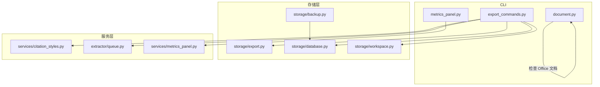
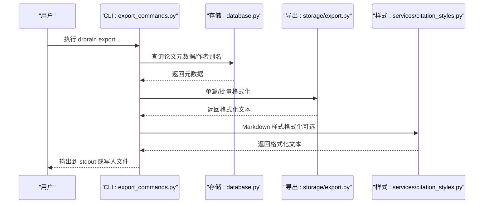
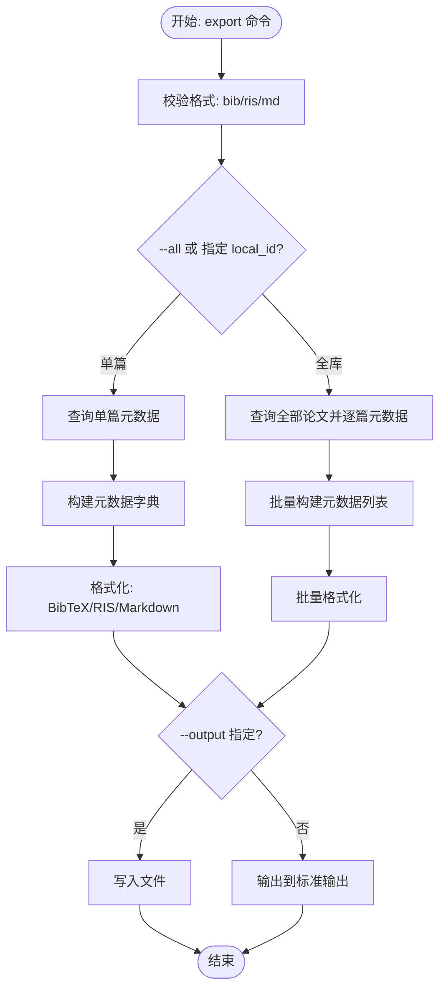
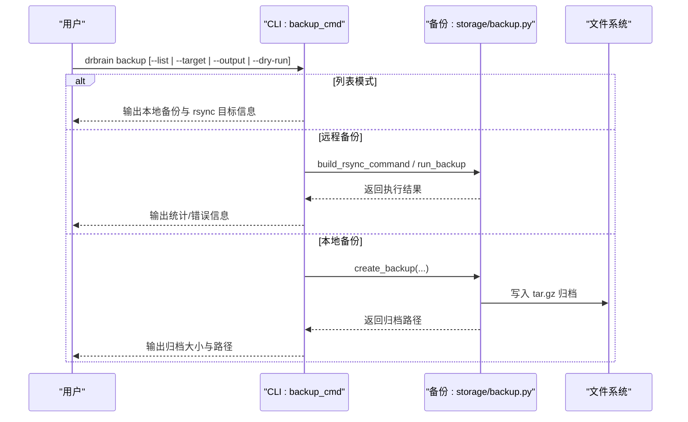
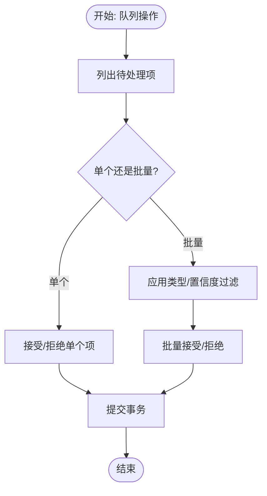
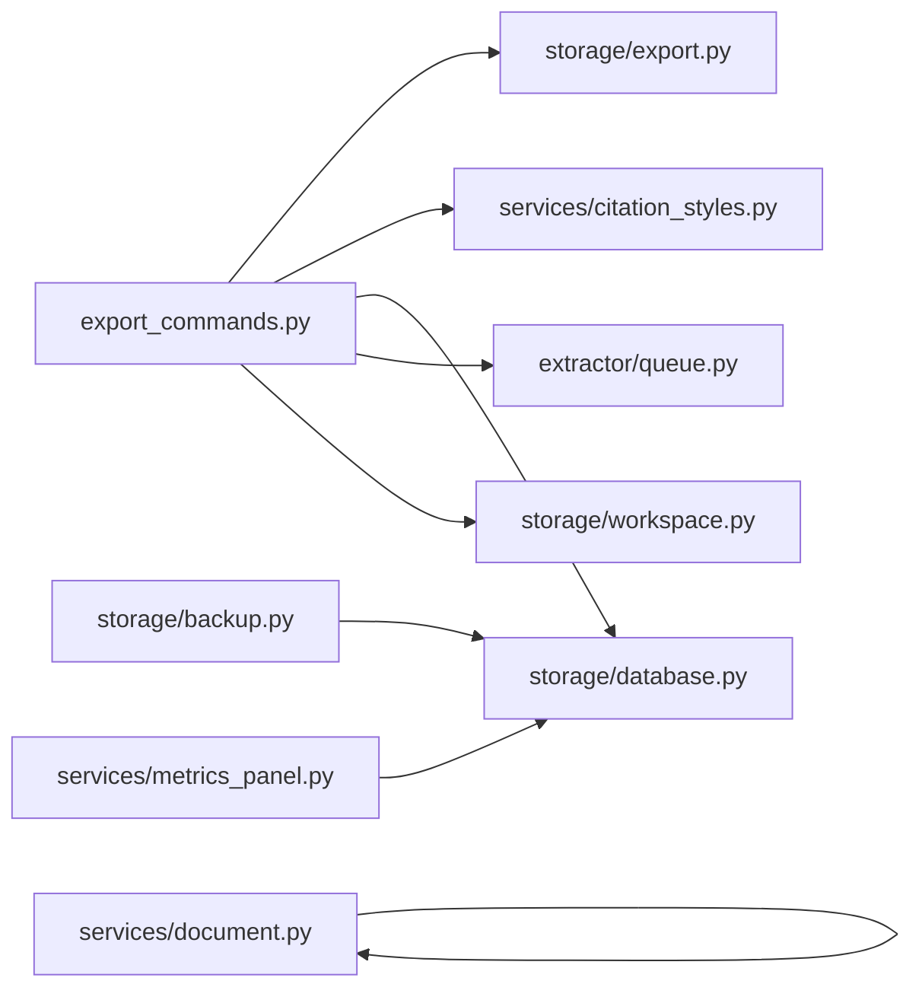

# 导出命令

<cite>
**本文引用的文件**
- [export_commands.py](file://src/drbrain/cli/export_commands.py)
- [export.py](file://src/drbrain/storage/export.py)
- [backup.py](file://src/drbrain/storage/backup.py)
- [queue.py](file://src/drbrain/extractor/queue.py)
- [database.py](file://src/drbrain/storage/database.py)
- [citation_styles.py](file://src/drbrain/services/citation_styles.py)
- [document.py](file://src/drbrain/services/document.py)
- [metrics_panel.py](file://src/drbrain/services/metrics_panel.py)
- [workspace.py](file://src/drbrain/storage/workspace.py)
- [test_export.py](file://tests/test_export.py)
- [test_backup.py](file://tests/test_backup.py)
- [SKILL.md（导出技能）](file://skills/export/SKILL.md)
- [SKILL.md（指标技能）](file://skills/metrics/SKILL.md)
</cite>

## 目录
1. [简介](#简介)
2. [项目结构](#项目结构)
3. [核心组件](#核心组件)
4. [架构总览](#架构总览)
5. [详细组件分析](#详细组件分析)
6. [依赖分析](#依赖分析)
7. [性能考虑](#性能考虑)
8. [故障排查指南](#故障排查指南)
9. [结论](#结论)
10. [附录](#附录)

## 简介
本文件面向 DrBrain 的导出与数据管理命令，系统性梳理以下 CLI 子命令的行为、参数、输出与最佳实践：
- 导出：export（单篇/全库 BibTeX/RIS/Markdown）
- 备份：backup（本地 tar.gz 与远程 rsync 同步）
- 清理：delete（删除论文及其关联图谱数据）
- 文档检查：document（Office 文档结构化检查）
- 血缘探索：lineage（基于 OpenAlex 的作者/研究血缘）
- 指标面板：metrics（用户行为分析）
- 队列：queue、queue resolve、queue resolve-all（置信度抽取结果的人工审核）
- 样式：style（Markdown 引文样式的管理与展示）

同时给出批量操作技巧、数据迁移方法、导出数据验证与恢复策略，帮助用户在不同场景下高效、安全地完成数据导出与维护。

## 项目结构
导出相关命令集中在 CLI 层，调用存储层与服务层实现具体功能：
- CLI 命令入口与解析：export_commands.py
- 导出格式化器：storage/export.py
- 备份打包与 rsync：storage/backup.py
- 队列路由与解析：extractor/queue.py
- 数据库接口：storage/database.py
- 引文样式管理：services/citation_styles.py
- Office 文档检查：services/document.py
- 指标面板：services/metrics_panel.py
- 工作区：storage/workspace.py

图表来源
- [export_commands.py:1-628](file://src/drbrain/cli/export_commands.py#L1-L628)
- [export.py:1-180](file://src/drbrain/storage/export.py#L1-L180)
- [backup.py:1-240](file://src/drbrain/storage/backup.py#L1-L240)
- [queue.py:1-106](file://src/drbrain/extractor/queue.py#L1-L106)
- [database.py:1-200](file://src/drbrain/storage/database.py#L1-L200)
- [citation_styles.py:1-389](file://src/drbrain/services/citation_styles.py#L1-L389)
- [document.py:1-395](file://src/drbrain/services/document.py#L1-L395)
- [metrics_panel.py:1-39](file://src/drbrain/services/metrics_panel.py#L1-L39)

章节来源
- [export_commands.py:1-628](file://src/drbrain/cli/export_commands.py#L1-L628)
- [export.py:1-180](file://src/drbrain/storage/export.py#L1-L180)
- [backup.py:1-240](file://src/drbrain/storage/backup.py#L1-L240)
- [queue.py:1-106](file://src/drbrain/extractor/queue.py#L1-L106)
- [database.py:1-200](file://src/drbrain/storage/database.py#L1-L200)
- [citation_styles.py:1-389](file://src/drbrain/services/citation_styles.py#L1-L389)
- [document.py:1-395](file://src/drbrain/services/document.py#L1-L395)
- [metrics_panel.py:1-39](file://src/drbrain/services/metrics_panel.py#L1-L39)

## 核心组件
- 导出命令（export）
  - 支持格式：BibTeX（.bib）、RIS（.ris）、Markdown（列表）
  - 支持对象：单篇论文或全库；可选输出到文件或标准输出；支持 JSON 包裹输出
  - Markdown 引文样式：通过 --style 指定（APA、Vancouver、Chicago、MLA 或自定义样式）
- 备份命令（backup）
  - 本地 tar.gz 备份：打包 papers、数据库、可选 workspace 与 reports
  - 远程 rsync 备份：按配置目标进行同步，支持压缩、排除模式、端口与密钥等
- 删除命令（delete）
  - 删除论文及其概念、论点、边、队列项等；可选同时删除本地论文目录
- 队列命令（queue、queue resolve、queue resolve-all）
  - 查看待处理抽取项；人工接受/拒绝；批量接受/拒绝并支持类型与置信度过滤
- 文档检查（document）
  - 对 .docx/.pptx/.xlsx 提供结构化检查报告，辅助验证内容与布局
- 血缘探索（lineage）
  - 基于 OpenAlex 去重 ID 探索作者与其论文数量，支持按显示名搜索
- 指标面板（metrics）
  - 用户行为分析：周趋势、热门关键词、最常阅读论文
- 样式管理（style）
  - 列举可用引文样式；查看内置与自定义样式源码

章节来源
- [export_commands.py:21-78](file://src/drbrain/cli/export_commands.py#L21-L78)
- [export_commands.py:283-427](file://src/drbrain/cli/export_commands.py#L283-L427)
- [export_commands.py:227-281](file://src/drbrain/cli/export_commands.py#L227-L281)
- [export_commands.py:80-120](file://src/drbrain/cli/export_commands.py#L80-L120)
- [export_commands.py:122-164](file://src/drbrain/cli/export_commands.py#L122-L164)
- [export_commands.py:166-225](file://src/drbrain/cli/export_commands.py#L166-L225)
- [export_commands.py:554-574](file://src/drbrain/cli/export_commands.py#L554-L574)
- [export_commands.py:480-552](file://src/drbrain/cli/export_commands.py#L480-L552)
- [export_commands.py:576-628](file://src/drbrain/cli/export_commands.py#L576-L628)
- [export_commands.py:429-479](file://src/drbrain/cli/export_commands.py#L429-L479)

## 架构总览
下图展示了导出命令从 CLI 到存储与服务层的调用链路，以及与数据库、备份、队列、样式系统的交互。

图表来源
- [export_commands.py:21-78](file://src/drbrain/cli/export_commands.py#L21-L78)
- [export.py:68-179](file://src/drbrain/storage/export.py#L68-L179)
- [citation_styles.py:367-389](file://src/drbrain/services/citation_styles.py#L367-L389)
- [database.py:712-747](file://src/drbrain/storage/database.py#L712-L747)

## 详细组件分析

### 导出命令（export）
- 功能要点
  - 单篇导出：根据 local_id 获取元数据，转换为指定格式
  - 全库导出：遍历所有论文，批量格式化后合并
  - 输出控制：stdout 或写入文件；可包裹 JSON 输出
  - 样式控制：Markdown 导出时通过 --style 指定（默认 APA）
- 关键流程
  - 参数校验与格式选择
  - 数据库连接与查询
  - 元数据构建与格式化
  - 结果输出或写文件
- 导出格式细节
  - BibTeX：自动构造条目类型、作者转义、页码/卷号/DOI 等字段
  - RIS：映射条目类型与标签，拆分作者，处理页码起止
  - Markdown：内置样式（APA/Vancouver/Chicago/MLA），或自定义样式文件
- 最佳实践
  - 导出前先审计与修复元数据，确保作者、年份、DOI 等字段完整
  - 使用 --output 将结果保存为 .bib/.ris/.md 文件，便于导入参考管理器或写作工具
  - 批量导出时建议先在内存中拼接，再一次性写入文件，避免频繁 IO
- 参考路径
  - [export_cmd 实现:21-78](file://src/drbrain/cli/export_commands.py#L21-L78)
  - [BibTeX/RIS/Markdown 转换:68-179](file://src/drbrain/storage/export.py#L68-L179)
  - [样式加载与格式化:268-389](file://src/drbrain/services/citation_styles.py#L268-L389)
  - [元数据提取:712-747](file://src/drbrain/cli/_common.py#L712-L747)

图表来源
- [export_commands.py:21-78](file://src/drbrain/cli/export_commands.py#L21-L78)
- [export.py:68-179](file://src/drbrain/storage/export.py#L68-L179)

章节来源
- [export_commands.py:21-78](file://src/drbrain/cli/export_commands.py#L21-L78)
- [export.py:68-179](file://src/drbrain/storage/export.py#L68-L179)
- [citation_styles.py:268-389](file://src/drbrain/services/citation_styles.py#L268-L389)
- [test_export.py:1-98](file://tests/test_export.py#L1-L98)

### 备份命令（backup）
- 功能要点
  - 本地 tar.gz 备份：打包 papers、drbrain.db、可选 workspace 与 reports
  - 远程 rsync 备份：按配置目标执行同步，支持压缩、追加模式、排除规则、SSH 密钥与端口
  - 列表模式：列出现有备份与已配置的 rsync 目标
- 关键流程
  - 解析参数：输出路径、是否列出、目标名称、dry-run
  - 本地备份：创建归档文件，包含指定目录
  - 远程备份：构建 rsync 命令，执行并返回状态
- 最佳实践
  - 定期本地备份作为快照；结合 rsync 目标进行增量/追加备份
  - 使用 --dry-run 预演远程备份，确认传输计划
  - 在配置中设置排除规则，避免传输临时文件或缓存
- 参考路径
  - [backup_cmd 实现:283-427](file://src/drbrain/cli/export_commands.py#L283-L427)
  - [本地备份与归档:26-64](file://src/drbrain/storage/backup.py#L26-L64)
  - [rsync 命令构建与执行:171-240](file://src/drbrain/storage/backup.py#L171-L240)
  - [测试用例:1-390](file://tests/test_backup.py#L1-L390)

图表来源
- [export_commands.py:283-427](file://src/drbrain/cli/export_commands.py#L283-L427)
- [backup.py:26-240](file://src/drbrain/storage/backup.py#L26-L240)

章节来源
- [export_commands.py:283-427](file://src/drbrain/cli/export_commands.py#L283-L427)
- [backup.py:26-240](file://src/drbrain/storage/backup.py#L26-L240)
- [test_backup.py:1-390](file://tests/test_backup.py#L1-L390)

### 删除命令（delete）
- 功能要点
  - 删除指定论文及其概念、论点、边、队列项等
  - 可选删除本地论文目录（data/papers/<id>）
  - 支持 --force 跳过确认提示
- 关键流程
  - 校验论文存在性
  - 删除论文与关联数据
  - 可选删除文件目录
  - 输出删除统计
- 最佳实践
  - 删除前先备份，或仅在测试/开发环境使用
  - 如需彻底清理，启用 --rm-files 以移除本地文件
- 参考路径
  - [delete_cmd 实现:227-281](file://src/drbrain/cli/export_commands.py#L227-L281)
  - [数据库删除逻辑:1-200](file://src/drbrain/storage/database.py#L1-L200)

章节来源
- [export_commands.py:227-281](file://src/drbrain/cli/export_commands.py#L227-L281)
- [database.py:1-200](file://src/drbrain/storage/database.py#L1-L200)

### 队列命令（queue、queue resolve、queue resolve-all）
- 功能要点
  - queue：列出待处理抽取项（含类型、置信度、来源论文）
  - queue resolve：接受或拒绝单个队列项；互斥参数校验
  - queue resolve-all：批量接受/拒绝，支持按类型与最大置信度过滤
- 关键流程
  - 读取待处理队列项
  - 接受/拒绝并提交事务
  - 批量解析时应用过滤条件
- 最佳实践
  - 优先处理高置信度项，低置信度项进入队列等待人工复核
  - 使用 resolve-all 时配合 --type 与 --max-conf 精准筛选
- 参考路径
  - [queue/resolve/resolve-all 实现:80-225](file://src/drbrain/cli/export_commands.py#L80-L225)
  - [队列路由与解析:10-106](file://src/drbrain/extractor/queue.py#L10-L106)

图表来源
- [export_commands.py:80-225](file://src/drbrain/cli/export_commands.py#L80-L225)
- [queue.py:10-106](file://src/drbrain/extractor/queue.py#L10-L106)

章节来源
- [export_commands.py:80-225](file://src/drbrain/cli/export_commands.py#L80-L225)
- [queue.py:10-106](file://src/drbrain/extractor/queue.py#L10-L106)

### 文档检查（document）
- 功能要点
  - 对 .docx/.pptx/.xlsx 提供结构化检查报告，包括页面/段落/表格/图片等信息
  - 自动检测布局溢出、字体信息、页眉页脚等潜在问题
- 最佳实践
  - 在导入/导出前对 Office 文档进行检查，提前发现布局与内容问题
  - 依赖安装：根据缺失模块提示安装相应可选依赖
- 参考路径
  - [document_cmd 实现:554-574](file://src/drbrain/cli/export_commands.py#L554-L574)
  - [文档检查服务:17-395](file://src/drbrain/services/document.py#L17-L395)

章节来源
- [export_commands.py:554-574](file://src/drbrain/cli/export_commands.py#L554-L574)
- [document.py:17-395](file://src/drbrain/services/document.py#L17-L395)

### 血缘探索（lineage）
- 功能要点
  - 列出作者（Actor）及其论文数，支持按显示名搜索
  - 展示作者去重 ID 与别名信息
- 最佳实践
  - 用于跨论文识别同一作者的不同署名方式
  - 与 OpenAlex 数据源联动，提升作者识别准确性
- 参考路径
  - [lineage_cmd 实现:480-552](file://src/drbrain/cli/export_commands.py#L480-L552)
  - [数据库查询与展示:777-800](file://src/drbrain/cli/_common.py#L777-L800)

章节来源
- [export_commands.py:480-552](file://src/drbrain/cli/export_commands.py#L480-L552)
- [_common.py:777-800](file://src/drbrain/cli/_common.py#L777-L800)

### 指标面板（metrics）
- 功能要点
  - 统计周趋势、热门关键词、最常阅读论文
  - 分离存储于 data/metrics.db
- 最佳实践
  - 通过 metrics 了解使用习惯，优化检索与阅读流程
  - 结合查询与阅读事件，持续完善元数据质量
- 参考路径
  - [metrics_cmd 实现:576-628](file://src/drbrain/cli/export_commands.py#L576-L628)
  - [指标数据库初始化与查询:13-39](file://src/drbrain/services/metrics_panel.py#L13-L39)

章节来源
- [export_commands.py:576-628](file://src/drbrain/cli/export_commands.py#L576-L628)
- [metrics_panel.py:13-39](file://src/drbrain/services/metrics_panel.py#L13-L39)

### 样式管理（style）
- 功能要点
  - 列举可用引文样式（内置与自定义）
  - 显示指定样式的源码（内置样式显示描述）
- 最佳实践
  - 在 Markdown 导出时明确指定样式，确保与目标工具兼容
  - 自定义样式需提供 format_ref 函数，并放置于 data/citation_styles 目录
- 参考路径
  - [style_cmd 实现:429-479](file://src/drbrain/cli/export_commands.py#L429-L479)
  - [样式加载与格式化:234-389](file://src/drbrain/services/citation_styles.py#L234-L389)

章节来源
- [export_commands.py:429-479](file://src/drbrain/cli/export_commands.py#L429-L479)
- [citation_styles.py:234-389](file://src/drbrain/services/citation_styles.py#L234-L389)

## 依赖分析
- 组件耦合
  - export_commands 依赖 storage/export、services/citation_styles、storage/database、extractor/queue、storage/workspace
  - backup 依赖 storage/backup 与外部 rsync/ssh
  - delete 依赖 storage/database
  - queue/resolve/resolve-all 依赖 extractor/queue 与 storage/database
  - metrics 依赖 services/metrics_panel
  - document 依赖 services/document
- 外部依赖
  - rsync/ssh：远程备份
  - Office 库：python-docx/python-pptx/openpyxl（可选）
- 循环依赖
  - 未见循环依赖

图表来源
- [export_commands.py:1-628](file://src/drbrain/cli/export_commands.py#L1-L628)
- [export.py:1-180](file://src/drbrain/storage/export.py#L1-L180)
- [backup.py:1-240](file://src/drbrain/storage/backup.py#L1-L240)
- [queue.py:1-106](file://src/drbrain/extractor/queue.py#L1-L106)
- [database.py:1-200](file://src/drbrain/storage/database.py#L1-L200)
- [citation_styles.py:1-389](file://src/drbrain/services/citation_styles.py#L1-L389)
- [metrics_panel.py:1-39](file://src/drbrain/services/metrics_panel.py#L1-L39)
- [document.py:1-395](file://src/drbrain/services/document.py#L1-L395)

章节来源
- [export_commands.py:1-628](file://src/drbrain/cli/export_commands.py#L1-L628)
- [backup.py:1-240](file://src/drbrain/storage/backup.py#L1-L240)
- [queue.py:1-106](file://src/drbrain/extractor/queue.py#L1-L106)
- [database.py:1-200](file://src/drbrain/storage/database.py#L1-L200)
- [citation_styles.py:1-389](file://src/drbrain/services/citation_styles.py#L1-L389)
- [metrics_panel.py:1-39](file://src/drbrain/services/metrics_panel.py#L1-L39)
- [document.py:1-395](file://src/drbrain/services/document.py#L1-L395)

## 性能考虑
- 导出
  - 全库导出采用批量格式化，减少多次 I/O；建议在内存中拼接后再写入文件
  - BibTeX/RIS 字段较多时，注意字符串转义与长度控制
- 备份
  - 本地 tar.gz：合理组织目录结构，避免打包无关文件
  - rsync：开启压缩与追加模式可降低带宽与重复传输；排除规则减少传输量
- 队列
  - 批量解析时先过滤再遍历，减少数据库扫描
- 文档检查
  - 大型 Office 文档检查可能耗时较长，建议异步执行或分批处理

## 故障排查指南
- 导出
  - 未知格式：确认 --format 为 bib/ris/md
  - 论文不存在：检查 local_id 是否正确
  - JSON 输出：使用 --json 获取结构化结果，便于自动化处理
  - 参考测试：验证 BibTeX/RIS/Markdown 输出格式
- 备份
  - rsync 二进制缺失：修正配置中的 rsync_bin/ssh_bin
  - 目标不可用/禁用：检查配置中的 host/path/enabled
  - dry-run：预演确认传输计划
- 删除
  - 论文不存在：确认 ID 正确；如需彻底清理，启用 --rm-files
- 队列
  - 同时接受/拒绝：参数互斥，需二选一
  - 批量解析：检查 --type 与 --max-conf 过滤条件
- 文档检查
  - 缺少依赖：根据报错安装对应可选包
- 指标面板
  - 首次运行：自动创建 metrics.db 并建立索引
- 样式管理
  - 自定义样式：确保文件名合法且包含 format_ref 函数

章节来源
- [export_commands.py:21-78](file://src/drbrain/cli/export_commands.py#L21-L78)
- [export_commands.py:283-427](file://src/drbrain/cli/export_commands.py#L283-L427)
- [export_commands.py:227-281](file://src/drbrain/cli/export_commands.py#L227-L281)
- [export_commands.py:80-225](file://src/drbrain/cli/export_commands.py#L80-L225)
- [export_commands.py:554-574](file://src/drbrain/cli/export_commands.py#L554-L574)
- [export_commands.py:576-628](file://src/drbrain/cli/export_commands.py#L576-L628)
- [export_commands.py:429-479](file://src/drbrain/cli/export_commands.py#L429-L479)
- [test_export.py:1-98](file://tests/test_export.py#L1-L98)
- [test_backup.py:1-390](file://tests/test_backup.py#L1-L390)

## 结论
DrBrain 的导出与数据管理命令覆盖了从元数据导出、备份归档、人工审核队列到文档检查与用户行为分析的完整链路。通过合理的参数组合与最佳实践，用户可以在保证数据完整性的同时，高效完成数据迁移、备份与维护任务。建议在生产环境中定期执行备份与审计，导出前完善元数据，并使用 JSON 输出便于自动化集成。

## 附录
- 常用命令速查
  - 导出全库 BibTeX：drbrain export --all --format bib --output references.bib
  - 导出为 RIS：drbrain export --all --format ris --output library.ris
  - Markdown 读列表：drbrain export --all --format md --output reading-list.md
  - 备份到本地：drbrain backup --output drbrain-backup.tar.gz
  - 远程备份：drbrain backup --target <name> [--dry-run]
  - 删除论文：drbrain delete <id> [--rm-files]
  - 查看队列：drbrain queue [--json]
  - 批量解析：drbrain queue resolve-all --accept --type concept --max-conf 0.8
  - 文档检查：drbrain document <file.docx|pptx|xlsx>
  - 血缘探索：drbrain lineage --list 或 --name "<姓名>"
  - 指标面板：drbrain metrics [--json]
  - 样式管理：drbrain style --list 或 --show <样式名>

- 数据迁移建议
  - 从其他参考管理器导入后，先 repair 元数据，再导出 .bib/.ris
  - 使用 --workspace 限定范围导出特定子集
  - 导出后在目标工具中验证 DOI、作者与标题一致性

- 导出数据验证
  - BibTeX：检查条目类型、作者转义、页码/卷号/DOI
  - RIS：检查 TY/JF/VL/SP/EP/DO 等标签
  - Markdown：核对样式渲染与链接有效性

- 恢复策略
  - 本地备份：解压 tar.gz 至原位置，恢复 papers 与数据库
  - 远程备份：确认 rsync 目标路径与权限，必要时回滚到最近一次成功同步
  - 删除误删：从备份中恢复数据库与论文目录