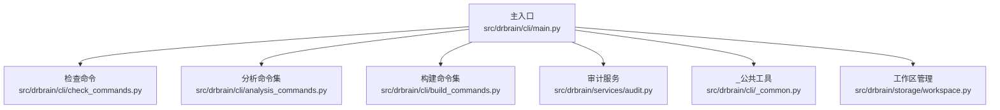
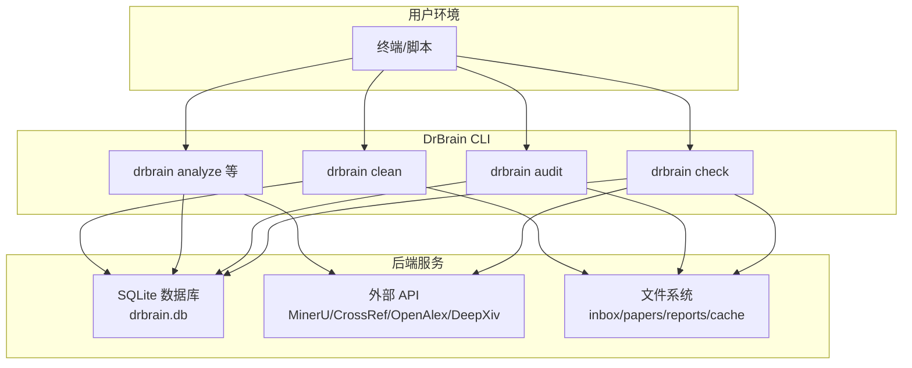
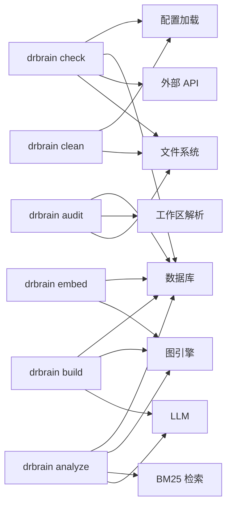

# 工具命令

<cite>
**本文引用的文件列表**
- [main.py](file://src/drbrain/cli/main.py)
- [check_commands.py](file://src/drbrain/cli/check_commands.py)
- [analysis_commands.py](file://src/drbrain/cli/analysis_commands.py)
- [build_commands.py](file://src/drbrain/cli/build_commands.py)
- [audit.py](file://src/drbrain/services/audit.py)
- [_common.py](file://src/drbrain/cli/_common.py)
- [workspace.py](file://src/drbrain/storage/workspace.py)
- [cli-reference.md](file://docs/cli-reference.md)
- [getting-started.md](file://docs/getting-started.md)
- [configuration.md](file://docs/configuration.md)
</cite>

## 目录
1. [简介](#简介)
2. [项目结构与入口](#项目结构与入口)
3. [核心命令总览](#核心命令总览)
4. [架构概览](#架构概览)
5. [详细命令解析](#详细命令解析)
6. [依赖关系分析](#依赖关系分析)
7. [性能与资源考量](#性能与资源考量)
8. [故障排查指南](#故障排查指南)
9. [结论](#结论)
10. [附录：最佳实践与自动化脚本](#附录最佳实践与自动化脚本)

## 简介
本文件面向使用 DrBrain 的用户与自动化脚本作者，系统化梳理与解释工具命令，重点覆盖以下主题：
- 系统健康检查（drbrain check）
- 数据质量审计（drbrain audit）
- 数据分析与知识前沿探索（drbrain analyze 及相关分析命令）
- 清理与维护（drbrain clean）

同时给出参数选项、典型用法、错误处理与性能建议，并提供自动化脚本编写方法与最佳实践。

## 项目结构与入口
DrBrain CLI 通过主入口集中注册所有命令，并按功能模块拆分实现。核心入口与命令注册如下：
- 主入口：在主程序中导入各命令模块并注册为 typer 命令
- 模块划分：check_commands、analysis_commands、build_commands、audit 等分别承载对应功能域的命令实现
- 公共工具：_common 提供跨命令复用的通用逻辑（如工作区解析、PDF 解析、DOI 补全等）

图表来源
- [main.py:100-146](file://src/drbrain/cli/main.py#L100-L146)
- [check_commands.py:24-427](file://src/drbrain/cli/check_commands.py#L24-L427)
- [analysis_commands.py:54-678](file://src/drbrain/cli/analysis_commands.py#L54-L678)
- [build_commands.py:97-361](file://src/drbrain/cli/build_commands.py#L97-L361)
- [audit.py:312-396](file://src/drbrain/services/audit.py#L312-L396)
- [_common.py:370-381](file://src/drbrain/cli/_common.py#L370-L381)
- [workspace.py:165-169](file://src/drbrain/storage/workspace.py#L165-L169)

章节来源
- [main.py:100-146](file://src/drbrain/cli/main.py#L100-L146)

## 核心命令总览
- 系统检查：drbrain check
- 数据审计：drbrain audit
- 数据分析：drbrain analyze、drbrain evolve、drbrain descendants、drbrain frontier、drbrain paradigm、drbrain transfers、drbrain isomorphism、drbrain difficulty
- 清理维护：drbrain clean
- 构建与嵌入：drbrain build、drbrain embed（用于后续查询与检索）
- 其他常用：drbrain setup、drbrain ingest、drbrain query、drbrain reason 等（详见 CLI 参考）

章节来源
- [cli-reference.md:23-106](file://docs/cli-reference.md#L23-L106)
- [cli-reference.md:485-511](file://docs/cli-reference.md#L485-L511)
- [cli-reference.md:358-483](file://docs/cli-reference.md#L358-L483)

## 架构概览
下图展示“检查—审计—分析—清理”的典型工作流，以及与数据库、外部 API、PDF 解析器的关系。

图表来源
- [check_commands.py:24-427](file://src/drbrain/cli/check_commands.py#L24-L427)
- [audit.py:312-396](file://src/drbrain/services/audit.py#L312-L396)
- [analysis_commands.py:54-678](file://src/drbrain/cli/analysis_commands.py#L54-L678)
- [build_commands.py:97-361](file://src/drbrain/cli/build_commands.py#L97-L361)

## 详细命令解析

### 系统检查：drbrain check
用途：检查依赖包、外部工具、配置项、目录、数据库、库规模、磁盘空间、API 连通性等，输出汇总与警告/错误提示。

- 关键检查点
  - Python 包与版本
  - 外部 CLI 工具（MinerU、PyMuPDF）
  - 配置文件存在性与关键字段（LLM、MinerU、CrossRef、OpenAlex、Embedding）
  - 目录存在性与自动创建
  - 数据库文件存在性
  - 库规模统计（论文数、概念数）
  - 磁盘空间
  - API 连通性（MinerU、DeepXiv、LLM）
- 输出：富文本表格与总结，错误时退出码非零

参数与行为要点
- 不接收位置参数
- 通过上下文加载配置，逐项验证并汇总
- 若存在错误，直接返回非零退出码；仅警告时不退出

章节来源
- [check_commands.py:24-427](file://src/drbrain/cli/check_commands.py#L24-L427)
- [cli-reference.md:23-29](file://docs/cli-reference.md#L23-L29)

### 数据审计：drbrain audit
用途：对整库或指定工作区执行 15 条规则的数据质量扫描，支持按严重级别过滤与 JSON 输出。

- 规则类别与示例
  - 错误级：缺少标题、缺少原始 Markdown、缺失 DOI/ArXiv/S2 ID 等
  - 警告级：摘要为空、年份缺失、期刊缺失、作者概念缺失、原始 Markdown 过短、树文件缺失/空、概念数量过少、未解析的环境变量占位符
  - 信息级：无边关系、状态为占位符、占位符超过阈值天数、重复标题（归一化后）
- 参数
  - --severity/-s：error/warning/info（默认 warning）
  - --workspace/-w：限制到工作区
  - --json/-j：JSON 输出
- 输出
  - 控制台表格（严重级别着色）或 JSON
  - 统计汇总（各类别计数）

章节来源
- [audit.py:312-396](file://src/drbrain/services/audit.py#L312-L396)
- [cli-reference.md:31-45](file://docs/cli-reference.md#L31-L45)

### 数据分析：drbrain analyze 及相关命令
用途：对单篇或多篇论文进行知识前沿分析，生成报告；并提供概念演化、后代追踪、领域全景、范式转移、跨域迁移、同构模式、难度地图、知识前沿等专项分析能力。

- drbrain analyze
  - 论文选择策略（互斥优先级）：本地 ID、--papers、--query、--discover、--workspace
  - 选项
    - --papers：逗号分隔的论文 ID 列表
    - --query：BM25 搜索后分析匹配结果
    - --discover：LLM 图探索问题，自动发现相关论文
    - --workspace/-w：工作区边界扫描
    - --full/-f：完整分析（更慢但更全面）
    - --json：JSON 输出
  - 行为：根据选择加载论文，构建图谱，运行分析，输出报告或 JSON

- drbrain evolve
  - 展示概念的祖先/后代/双向演化路径，可输出 Mermaid 或统计信号（新兴/确立/衰落/争议/复苏）及年度分布

- drbrain descendants
  - 追踪论文的学术后代（谁引用/扩展/改进/挑战它），可显示章节溯源

- drbrain frontier
  - 综合报告：研究种子、辩论区、技术悬崖、难度评分、信心崩溃等

- drbrain paradigm
  - 检测范式转移：替换、爆炸、跨域入侵

- drbrain transfers
  - 发现跨域方法迁移机会：显式工作区或自动聚类；可查看历史迁移时间线与章节溯源

- drbrain isomorphism
  - 寻找结构同构子图（相似关系模式），可输出 RAPTOR 上下文

- drbrain difficulty
  - 按章节语义分类知识缺口，计算复合难度分数

章节来源
- [check_commands.py:428-563](file://src/drbrain/cli/check_commands.py#L428-L563)
- [analysis_commands.py:214-678](file://src/drbrain/cli/analysis_commands.py#L214-L678)
- [cli-reference.md:485-511](file://docs/cli-reference.md#L485-L511)
- [cli-reference.md:360-483](file://docs/cli-reference.md#L360-L483)

### 清理与维护：drbrain clean
用途：清空数据库、缓存、日志、论文、报告等目录，保留 inbox（PDF）不变；支持强制模式与管理员口令校验。

- 选项
  - --force/-f：跳过确认
  - --config/-c：指定配置文件路径（默认 config.yaml）
- 强制模式流程
  - 若配置了管理员口令，要求输入口令校验
  - 对目标目录进行文件/目录清理，随后重建目录（跳过文件路径）
- 安全性
  - 保留 inbox，避免误删待处理 PDF
  - 强制模式下进行口令校验

章节来源
- [check_commands.py:565-626](file://src/drbrain/cli/check_commands.py#L565-L626)
- [cli-reference.md:95-106](file://docs/cli-reference.md#L95-L106)

### 构建与嵌入：drbrain build、drbrain embed
用途：从已入库论文提取知识图谱（概念/关系），训练图嵌入以支持检索与推理。

- drbrain build
  - 默认处理状态为 uploaded 的论文；可选 --all 全量处理
  - 支持 --skip-refine 跳过迭代精炼以节省成本
  - 输出 JSON（可选）与统计信息
- drbrain embed
  - 训练 TransE 图嵌入；可选 --tree 生成 PageIndex+RAPTOR 的树节点文本向量
  - 支持维度、轮次、重训、增量训练等

章节来源
- [build_commands.py:97-361](file://src/drbrain/cli/build_commands.py#L97-L361)
- [cli-reference.md:128-145](file://docs/cli-reference.md#L128-L145)
- [cli-reference.md:566-586](file://docs/cli-reference.md#L566-L586)

## 依赖关系分析
- 命令到服务的依赖
  - drbrain check：依赖配置加载、数据库连接、外部 API 可达性探测、目录与磁盘空间检测
  - drbrain audit：依赖数据库、论文目录、工作区解析
  - drbrain analyze：依赖数据库、图引擎、BM25 检索、LLM 探索
  - drbrain clean：依赖配置、文件系统路径、管理员口令校验
  - drbrain build/embed：依赖数据库、图引擎、LLM、PDF 解析链路

图表来源
- [check_commands.py:24-427](file://src/drbrain/cli/check_commands.py#L24-L427)
- [audit.py:312-396](file://src/drbrain/services/audit.py#L312-L396)
- [analysis_commands.py:54-678](file://src/drbrain/cli/analysis_commands.py#L54-L678)
- [build_commands.py:97-361](file://src/drbrain/cli/build_commands.py#L97-L361)
- [_common.py:370-381](file://src/drbrain/cli/_common.py#L370-L381)

章节来源
- [check_commands.py:24-427](file://src/drbrain/cli/check_commands.py#L24-L427)
- [audit.py:312-396](file://src/drbrain/services/audit.py#L312-L396)
- [analysis_commands.py:54-678](file://src/drbrain/cli/analysis_commands.py#L54-L678)
- [build_commands.py:97-361](file://src/drbrain/cli/build_commands.py#L97-L361)
- [_common.py:370-381](file://src/drbrain/cli/_common.py#L370-L381)

## 性能与资源考量
- drbrain check
  - 外部 API 调用可能耗时，建议在网络稳定时运行；关注超时与重试策略
  - 目录与磁盘检测为本地 IO，通常快速
- drbrain audit
  - 扫描全库或工作区，复杂度与论文数、概念数成正比；建议在低峰期运行
  - 可通过 --severity 控制扫描粒度
- drbrain analyze
  - LLM 调用成本较高；可使用 --skip-refine（在 build 阶段）或 --full 控制分析深度
  - BM25 查询与图遍历的成本与图规模相关
- drbrain build
  - 并发度与 LLM 调用次数影响吞吐与费用；可通过配置调整
  - 跳过迭代精炼可显著降低成本
- drbrain embed
  - 训练轮次与维度影响耗时；增量训练可减少重算成本

[本节为通用指导，不直接分析具体文件]

## 故障排查指南
- drbrain check 常见问题
  - 缺失外部工具：MinerU CLI 未安装或不可用时回退至 PyMuPDF；若两者均不可用，PDF 解析失败
  - API 不可达：MinerU、DeepXiv、LLM 等接口异常；检查令牌与网络
  - 配置缺失：LLM、MinerU、CrossRef、OpenAlex 等密钥未配置或未解析
  - 目录权限：无法创建或写入数据目录
- drbrain audit 常见问题
  - 规则触发频繁：说明库中存在较多低质量条目，建议先修复元数据再运行
  - 工作区过滤无效：确认工作区名称有效且存在
- drbrain analyze 常见问题
  - LLM 不可用：检查模型列表与密钥；必要时切换到备用模型
  - BM25/图为空：先运行 drbrain build 与 drbrain embed
- drbrain clean
  - 强制模式口令错误：确认管理员口令配置正确
  - 目标目录不存在：确认配置中的目录路径正确

章节来源
- [check_commands.py:24-427](file://src/drbrain/cli/check_commands.py#L24-L427)
- [audit.py:312-396](file://src/drbrain/services/audit.py#L312-L396)
- [analysis_commands.py:54-678](file://src/drbrain/cli/analysis_commands.py#L54-L678)
- [build_commands.py:97-361](file://src/drbrain/cli/build_commands.py#L97-L361)

## 结论
- drbrain check 提供系统级健康检查，是日常运维与部署验证的关键步骤
- drbrain audit 以规则驱动的方式持续监控数据质量，建议纳入 CI/CD 或定期巡检
- drbrain analyze 与相关命令构成知识发现与前沿探索的核心工具链
- drbrain clean 提供安全可控的清理能力，配合备份策略使用更稳妥

[本节为总结性内容，不直接分析具体文件]

## 附录：最佳实践与自动化脚本

### 最佳实践
- 在执行任何大规模操作前，先运行 drbrain check 与 drbrain audit，确保环境与数据质量达标
- 使用工作区（workspace）隔离不同任务域，便于审计与分析范围控制
- 对 LLM 调用密集的任务（如 analyze、build、embed），合理设置并发与跳过精炼以平衡成本与效果
- 定期运行 drbrain clean 清理缓存与日志，避免磁盘压力累积

章节来源
- [cli-reference.md:31-45](file://docs/cli-reference.md#L31-L45)
- [cli-reference.md:95-106](file://docs/cli-reference.md#L95-L106)
- [cli-reference.md:485-511](file://docs/cli-reference.md#L485-L511)
- [workspace.py:165-169](file://src/drbrain/storage/workspace.py#L165-L169)

### 自动化脚本编写方法
- 基础流程模板（伪代码思路）
  - 步骤 1：drbrain check
  - 步骤 2：drbrain audit --severity warning --json
  - 步骤 3：drbrain build --all 或针对特定论文
  - 步骤 4：drbrain embed
  - 步骤 5：drbrain analyze --workspace <ws> --full --json
  - 步骤 6：drbrain clean --force（可选，生产前清理缓存/日志）
- 关键注意
  - 将 --json 输出重定向到文件，便于后续处理
  - 对需要交互确认的命令（如 clean）使用 --force，并在 CI 中预置管理员口令
  - 对 LLM 成本敏感的任务，优先使用 --skip-refine 与 --full 的权衡
  - 使用工作区过滤审计与分析范围，提升可重复性与可追溯性

章节来源
- [cli-reference.md:23-29](file://docs/cli-reference.md#L23-L29)
- [cli-reference.md:31-45](file://docs/cli-reference.md#L31-L45)
- [cli-reference.md:95-106](file://docs/cli-reference.md#L95-L106)
- [cli-reference.md:128-145](file://docs/cli-reference.md#L128-L145)
- [cli-reference.md:485-511](file://docs/cli-reference.md#L485-L511)
- [workspace.py:165-169](file://src/drbrain/storage/workspace.py#L165-L169)