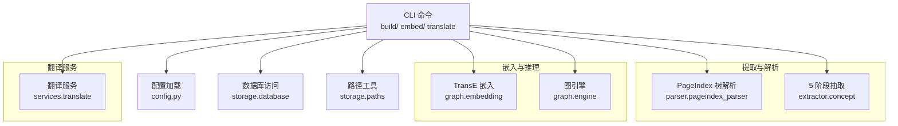
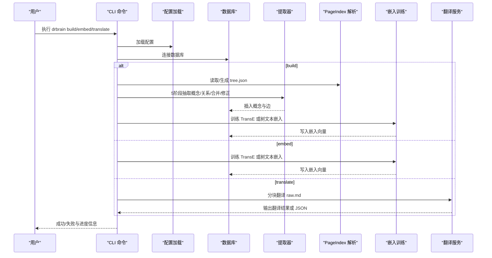
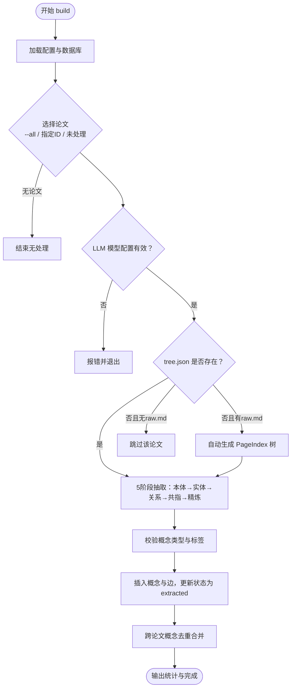
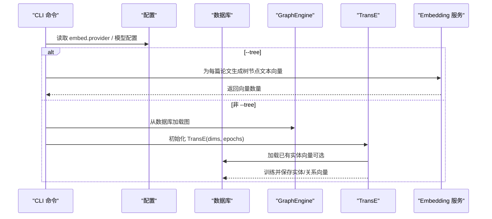
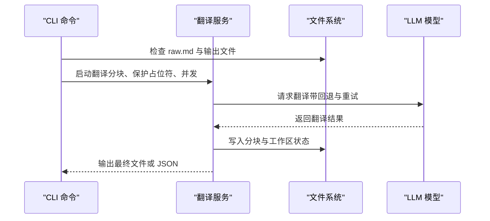
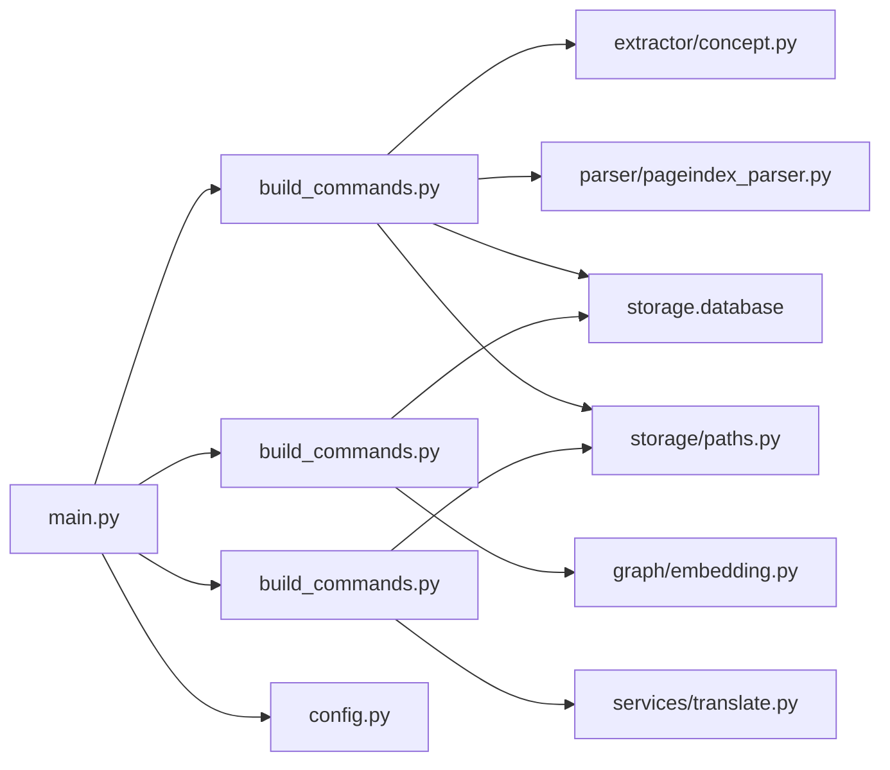

# 构建命令

<cite>
**本文引用的文件**
- [build_commands.py](file://src/drbrain/cli/build_commands.py)
- [main.py](file://src/drbrain/cli/main.py)
- [concept.py](file://src/drbrain/extractor/concept.py)
- [pageindex_parser.py](file://src/drbrain/parser/pageindex_parser.py)
- [embedding.py](file://src/drbrain/graph/embedding.py)
- [translate.py](file://src/drbrain/services/translate.py)
- [paths.py](file://src/drbrain/storage/paths.py)
- [config.py](file://src/drbrain/config.py)
- [SKILL.md（kg-build）](file://skills/kg-build/SKILL.md)
- [SKILL.md（translate）](file://skills/translate/SKILL.md)
- [cli-reference.md](file://docs/cli-reference.md)
- [getting-started.md](file://docs/getting-started.md)
- [architecture.md](file://docs/architecture.md)
</cite>

## 目录
1. [简介](#简介)
2. [项目结构](#项目结构)
3. [核心组件](#核心组件)
4. [架构总览](#架构总览)
5. [详细组件分析](#详细组件分析)
6. [依赖分析](#依赖分析)
7. [性能考量](#性能考量)
8. [故障排查指南](#故障排查指南)
9. [结论](#结论)
10. [附录](#附录)

## 简介
本章节面向 DrBrain 的“构建命令”，系统性梳理与文档化 build、embed、translate 三大构建相关命令的使用方法、内部流程、参数配置与性能优化策略。重点覆盖：
- 知识图谱构建（5 阶段 LLM 提取）：从 ingested paper 的 tree.json 出发，逐步完成本体扩展、实体抽取、关系抽取、共指消解、迭代精炼。
- 嵌入向量训练：TransE 图嵌入与树节点文本嵌入（PageIndex + RAPTOR），支持增量训练与重训。
- 文本翻译：基于分块保护占位符的并发翻译，支持断点续传与多模型回退链路。
- 质量评估与性能调优：通过状态检查、日志与指标，定位瓶颈并优化资源消耗。

## 项目结构
DrBrain 的构建命令位于 CLI 子模块中，围绕数据库、解析器、提取器与服务层协同工作：
- CLI 层：注册 build、embed、translate 命令入口，统一上下文加载配置。
- 提取层：基于 PageIndex 树结构进行 5 阶段 LLM 抽取，产出概念、关系与合并信息。
- 图嵌入层：实现 TransE 训练与持久化，支持增量与重训。
- 翻译服务层：分块保护、并发翻译、工作区管理与重试机制。
- 存储与路径：统一 paper 目录、raw.md、tree.json 等文件路径访问。
- 配置层：类型化配置（LLM、Embed、Dirs、DB 等），支持环境变量与本地覆盖。

图表来源
- [build_commands.py:1-361](file://src/drbrain/cli/build_commands.py#L1-L361)
- [main.py:1-150](file://src/drbrain/cli/main.py#L1-L150)
- [config.py:182-292](file://src/drbrain/config.py#L182-L292)
- [paths.py:1-29](file://src/drbrain/storage/paths.py#L1-L29)

章节来源
- [main.py:77-150](file://src/drbrain/cli/main.py#L77-L150)
- [build_commands.py:1-361](file://src/drbrain/cli/build_commands.py#L1-L361)
- [config.py:182-292](file://src/drbrain/config.py#L182-L292)
- [paths.py:1-29](file://src/drbrain/storage/paths.py#L1-L29)

## 核心组件
- build 命令：执行 5 阶段 LLM 抽取，写入数据库，支持全量重建与跳过精炼。
- embed 命令：训练 TransE 图嵌入；支持 --tree 生成树节点文本嵌入；支持增量与重训。
- translate 命令：将 raw.md 分块翻译为目标语言，支持并发、断点续传与强制重翻。

章节来源
- [build_commands.py:97-278](file://src/drbrain/cli/build_commands.py#L97-L278)
- [build_commands.py:280-361](file://src/drbrain/cli/build_commands.py#L280-L361)
- [translate.py:562-726](file://src/drbrain/services/translate.py#L562-L726)

## 架构总览
下图展示从命令到数据流的关键路径：CLI → 配置与数据库 → 解析与抽取 → 嵌入训练 → 持久化与输出。

图表来源
- [build_commands.py:97-361](file://src/drbrain/cli/build_commands.py#L97-L361)
- [concept.py:419-496](file://src/drbrain/extractor/concept.py#L419-L496)
- [pageindex_parser.py:412-487](file://src/drbrain/parser/pageindex_parser.py#L412-L487)
- [embedding.py:20-117](file://src/drbrain/graph/embedding.py#L20-L117)
- [translate.py:562-726](file://src/drbrain/services/translate.py#L562-L726)

## 详细组件分析

### build 命令：知识图谱构建
- 功能概述
  - 默认处理状态为 uploaded 的论文；可指定特定 paper_id 或 --all 全量重建。
  - 支持 --skip-refine 跳过迭代精炼以节省成本。
  - 自动补全缺失的 tree.json（基于 raw.md 重新生成 PageIndex 树）。
  - 5 阶段抽取：本体扩展 → 实体抽取（并发）→ 关系抽取 → 共指消解 → 精炼（可选）。
  - 数据校验与入库：过滤无效概念，插入边并标记状态为 extracted。
  - 最终统计：跨论文去重合并后输出汇总结果。

- 参数与行为
  - 参数
    - paper_id: list[str]（可选）：目标论文 ID 列表
    - --all：对数据库中全部论文执行
    - --skip-refine：跳过迭代精炼
    - --json：以 JSON 输出
  - 行为细节
    - 若未配置 LLM 模型，直接报错退出。
    - 若缺少 raw.md，提示先执行 ingest。
    - 若 tree.json 缺失但存在 raw.md，自动尝试重新生成树。
    - 概念类型限定在 Problem/Method/Conclusion/Gap/Debate/Actor；拒绝空标签或非法类型。
    - 边插入时忽略重复或无效引用。
    - 统计阶段结束后执行跨论文概念去重合并。

- 性能与资源
  - 实体抽取阶段采用并发（默认 10），提升吞吐。
  - 可通过 --skip-refine 降低 LLM 调用次数，缩短耗时。
  - 建议在大规模运行前确保 LLM 模型可用且网络稳定。

- 使用示例
  - 构建所有未处理论文：drbrain build
  - 指定论文构建：drbrain build p3f8a2 p7b1c4
  - 全量重建：drbrain build --all
  - 跳过精炼：drbrain build --skip-refine

图表来源
- [build_commands.py:97-278](file://src/drbrain/cli/build_commands.py#L97-L278)
- [concept.py:419-496](file://src/drbrain/extractor/concept.py#L419-L496)
- [paths.py:11-18](file://src/drbrain/storage/paths.py#L11-L18)

章节来源
- [build_commands.py:97-278](file://src/drbrain/cli/build_commands.py#L97-L278)
- [SKILL.md（kg-build）:31-41](file://skills/kg-build/SKILL.md#L31-L41)
- [cli-reference.md:128-145](file://docs/cli-reference.md#L128-L145)
- [getting-started.md:116-134](file://docs/getting-started.md#L116-L134)

### embed 命令：嵌入向量生成
- 功能概述
  - 训练 TransE 图嵌入：基于已构建的知识图谱，训练实体与关系的向量表示，用于链接预测与复杂查询。
  - 树文本嵌入：为 PageIndex 树节点与 RAPTOR 递归摘要生成文本向量，支持按论文检索。
  - 增量训练：若已有嵌入，可仅重训练关系或基于现有实体初始化。
  - 重训模式：--retrain 强制从头训练。

- 参数与行为
  - 参数
    - --dim：嵌入维度，默认 128
    - --epochs：训练轮数，默认 100
    - --retrain：强制重训
    - --tree：生成树节点文本嵌入（PageIndex + RAPTOR）
  - 行为细节
    - --tree 模式：读取配置中的 embed.provider，若为 none 则禁用树向量生成。
    - 非树模式：加载数据库中的图，训练 TransE 并保存实体与关系向量。
    - 增量训练：加载已有实体向量作为初始值，关系向量每次重训。

- 性能与资源
  - 增量训练显著减少重训成本，适合新增论文后的更新。
  - --tree 模式会引入额外的 LLM 调用与磁盘 IO，建议在论文数量较多时谨慎使用。
  - 可通过 --dim 与 --epochs 调整内存与计算开销。

- 使用示例
  - 训练图嵌入：drbrain embed
  - 自定义维度与轮数：drbrain embed --dim 256 --epochs 200
  - 强制重训：drbrain embed --retrain
  - 生成树文本嵌入：drbrain embed --tree

图表来源
- [build_commands.py:280-361](file://src/drbrain/cli/build_commands.py#L280-L361)
- [embedding.py:20-117](file://src/drbrain/graph/embedding.py#L20-L117)
- [config.py:114-141](file://src/drbrain/config.py#L114-L141)

章节来源
- [build_commands.py:280-361](file://src/drbrain/cli/build_commands.py#L280-L361)
- [SKILL.md（kg-build）:45-65](file://skills/kg-build/SKILL.md#L45-L65)
- [cli-reference.md:566-586](file://docs/cli-reference.md#L566-L586)

### translate 命令：文本翻译
- 功能概述
  - 将 ingested paper 的 raw.md 翻译为目标语言，保持代码块、公式、图片等结构不变。
  - 分块保护占位符，避免翻译破坏非语言内容。
  - 并发翻译多个分块，支持指数回退重试与断点续传。
  - 支持 --force 强制重翻，支持 --json 输出进度信息。

- 参数与行为
  - 参数
    - --lang/-l：目标语言代码（如 zh、en、ja），默认 zh
    - --force/-f：强制重翻译，即使输出已存在
    - --json：JSON 输出，包含错误、部分完成与跳过原因
  - 行为细节
    - 若源语言与目标语言相同，直接跳过。
    - 若 raw.md 不存在，返回“无源文件”跳过原因。
    - 使用工作区目录保存中间状态与分块，支持中断后恢复。
    - 多模型回退链路与并发线程池提升成功率与吞吐。

- 性能与资源
  - CHUNK_SIZE 控制分块大小，过大可能触发超时或回退拆分。
  - chunk_workers 控制并发度，过高可能导致 API 限流或资源争用。
  - 断点续传避免重复翻译，提高大规模任务的稳定性。

- 使用示例
  - 翻译到中文：drbrain translate p3f8a2 --lang zh
  - 强制重翻：drbrain translate p3f8a2 --lang en --force
  - JSON 输出：drbrain translate p3f8a2 --lang ja --json

图表来源
- [translate.py:562-726](file://src/drbrain/services/translate.py#L562-L726)
- [paths.py:11-18](file://src/drbrain/storage/paths.py#L11-L18)

章节来源
- [translate.py:562-726](file://src/drbrain/services/translate.py#L562-L726)
- [SKILL.md（translate）:28-58](file://skills/translate/SKILL.md#L28-L58)
- [cli-reference.md:743-757](file://docs/cli-reference.md#L743-L757)

## 依赖分析
- 命令注册与入口
  - CLI 在主入口集中注册 build、embed、translate 等命令，并在回调中加载配置与设置日志。
- 提取与解析
  - build 命令依赖 PageIndex 解析器生成/验证树结构，再由概念提取器执行 5 阶段抽取。
- 嵌入训练
  - embed 命令依赖图引擎加载图数据，TransE 训练后写入数据库。
- 翻译服务
  - translate 命令依赖翻译服务模块，包含分块、占位符保护、并发与工作区管理。
- 配置与路径
  - 配置类型化定义，路径工具统一 paper 目录与文件名。

图表来源
- [main.py:100-133](file://src/drbrain/cli/main.py#L100-L133)
- [build_commands.py:11-14](file://src/drbrain/cli/build_commands.py#L11-L14)
- [config.py:182-292](file://src/drbrain/config.py#L182-L292)
- [paths.py:1-29](file://src/drbrain/storage/paths.py#L1-L29)

章节来源
- [main.py:100-133](file://src/drbrain/cli/main.py#L100-L133)
- [build_commands.py:11-14](file://src/drbrain/cli/build_commands.py#L11-L14)

## 性能考量
- 并发与吞吐
  - 实体抽取阶段默认并发 10，可根据硬件与 LLM 速率调整。
  - 翻译阶段默认并发 3，可通过 chunk_workers 调整；注意 API 限流与资源占用。
- 资源控制
  - --skip-refine 可显著降低 LLM 调用次数，适合快速迭代。
  - --tree 模式引入额外 LLM 调用与磁盘 IO，建议在论文规模较大时谨慎启用。
  - 增量训练（--retrain 不启用）可减少重训成本。
- 模型与设备
  - 配置中 embed.provider 可切换本地或云模型；设备选择影响速度与显存占用。
  - 适当调整 --dim 与 --epochs 在精度与资源间取得平衡。

[本节为通用指导，无需特定文件引用]

## 故障排查指南
- 常见问题与定位
  - 无 LLM 模型配置：build/translate 命令会直接报错并退出，请先执行 setup 初始化配置。
  - 无 raw.md：build 会提示先执行 ingest；translate 会返回“无源文件”跳过原因。
  - 无图数据：embed 需要先执行 build，否则提示先执行 build。
  - 树缺失：build 会在存在 raw.md 时尝试自动生成 tree.json；若失败请检查 LLM 可用性与 token 数量。
- 日志与输出
  - CLI 回调中记录命令与会话 ID，便于审计与复现。
  - --json 输出可结合日志进行自动化分析。
- 资源与限流
  - 翻译阶段若频繁超时，考虑减小分块大小或降低并发；同时启用指数回退重试。
  - 增量训练可减少重训时间，避免大规模重算。

章节来源
- [build_commands.py:142-146](file://src/drbrain/cli/build_commands.py#L142-L146)
- [build_commands.py:182-184](file://src/drbrain/cli/build_commands.py#L182-L184)
- [build_commands.py:333-336](file://src/drbrain/cli/build_commands.py#L333-L336)
- [translate.py:590-600](file://src/drbrain/services/translate.py#L590-L600)
- [main.py:80-92](file://src/drbrain/cli/main.py#L80-L92)

## 结论
- build 命令提供了完整的知识图谱构建流水线，从树结构出发，通过 5 阶段 LLM 抽取形成结构化知识，并入库校验与去重。
- embed 命令支持图嵌入与树文本嵌入，满足链接预测与检索增强需求，具备增量与重训能力。
- translate 命令提供鲁棒的翻译能力，兼顾并发、断点续传与占位符保护。
- 建议在生产环境中结合 --skip-refine、增量训练与合理的并发配置，以获得最佳的成本与性能平衡。

[本节为总结性内容，无需特定文件引用]

## 附录
- 相关技能说明与参考
  - kg-build 技能：涵盖 build、embed、closure 的完整工作流与示例。
  - translate 技能：涵盖翻译前置条件、常见模式与 CLI 参考。
- 参考文档
  - CLI 参考：包含各命令的参数与示例。
  - 快速入门：分步骤介绍 ingest → build → embed → closure 的典型流程。
  - 架构文档：阐述两阶段流水线与 5 阶段抽取的设计思想。

章节来源
- [SKILL.md（kg-build）:120-139](file://skills/kg-build/SKILL.md#L120-L139)
- [SKILL.md（translate）:77-86](file://skills/translate/SKILL.md#L77-L86)
- [cli-reference.md:128-145](file://docs/cli-reference.md#L128-L145)
- [getting-started.md:116-164](file://docs/getting-started.md#L116-L164)
- [architecture.md:38-71](file://docs/architecture.md#L38-L71)