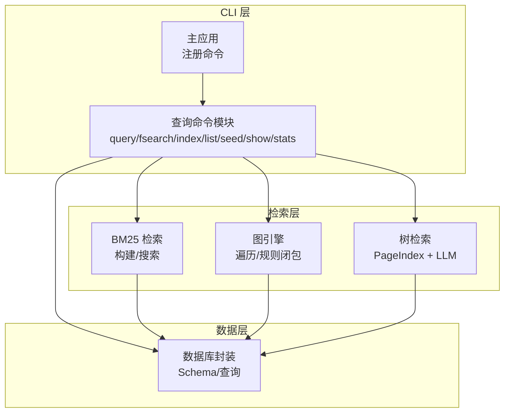
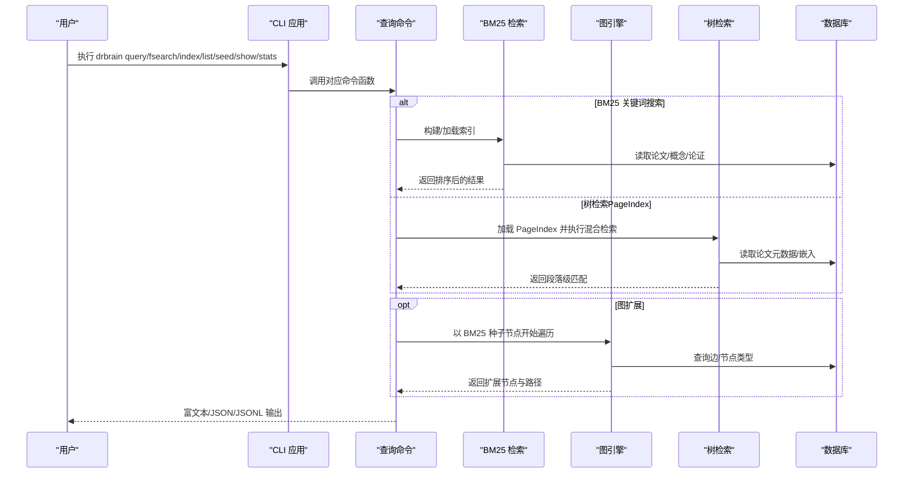
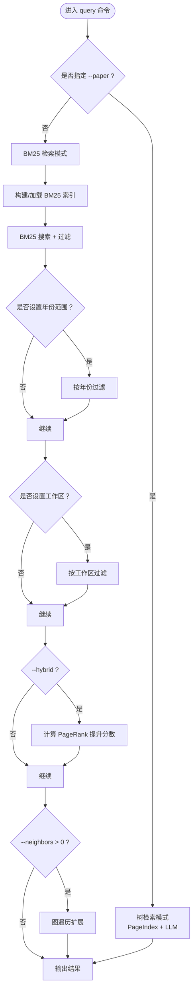
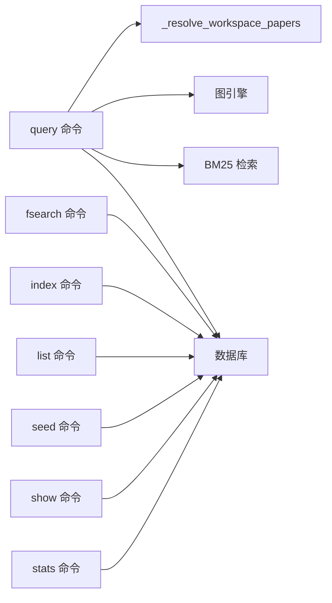

# 查询命令

<cite>
**本文引用的文件**
- [src/drbrain/cli/query_commands.py](file://src/drbrain/cli/query_commands.py)
- [src/drbrain/cli/main.py](file://src/drbrain/cli/main.py)
- [src/drbrain/query/bm25.py](file://src/drbrain/query/bm25.py)
- [src/drbrain/graph/engine.py](file://src/drbrain/graph/engine.py)
- [src/drbrain/storage/database.py](file://src/drbrain/storage/database.py)
- [src/drbrain/cli/_common.py](file://src/drbrain/cli/_common.py)
- [skills/paper-query/SKILL.md](file://skills/paper-query/SKILL.md)
- [skills/fsearch/SKILL.md](file://skills/fsearch/SKILL.md)
- [skills/index/SKILL.md](file://skills/index/SKILL.md)
- [skills/show/SKILL.md](file://skills/show/SKILL.md)
- [tests/test_json_output.py](file://tests/test_json_output.py)
</cite>

## 目录
1. [简介](#简介)
2. [项目结构](#项目结构)
3. [核心组件](#核心组件)
4. [架构总览](#架构总览)
5. [详细组件分析](#详细组件分析)
6. [依赖分析](#依赖分析)
7. [性能考虑](#性能考虑)
8. [故障排查指南](#故障排查指南)
9. [结论](#结论)
10. [附录](#附录)

## 简介
本文件面向 DrBrain 的查询命令，系统化梳理与查询相关的核心 CLI 命令：query、fsearch、index、list、seed、show、stats。内容覆盖搜索语法、过滤条件、排序选项、结果格式、关键词搜索、高级查询（图扩展、混合排序）、统计信息展示、查询优化技巧、结果筛选方法以及批量查询示例。目标是帮助用户高效地在 DrBrain 知识库中检索论文、概念与论证，并进行深度探索与分析。

## 项目结构
查询命令位于 CLI 子模块中，围绕数据库、BM25 检索、图引擎与树检索等能力组织。命令注册入口集中于主应用，具体实现分布在独立命令模块；检索逻辑由 BM25 模块与图引擎协同完成；数据访问通过数据库封装类统一管理。

图表来源
- [src/drbrain/cli/main.py:106-112](file://src/drbrain/cli/main.py#L106-L112)
- [src/drbrain/cli/query_commands.py:24-738](file://src/drbrain/cli/query_commands.py#L24-L738)
- [src/drbrain/query/bm25.py:17-135](file://src/drbrain/query/bm25.py#L17-L135)
- [src/drbrain/graph/engine.py:33-122](file://src/drbrain/graph/engine.py#L33-L122)
- [src/drbrain/storage/database.py:10-156](file://src/drbrain/storage/database.py#L10-L156)

章节来源
- [src/drbrain/cli/main.py:106-112](file://src/drbrain/cli/main.py#L106-L112)
- [src/drbrain/cli/query_commands.py:24-738](file://src/drbrain/cli/query_commands.py#L24-L738)

## 核心组件
- 查询命令模块：提供 query、fsearch、index、list、seed、show、stats 等命令的具体实现与参数解析。
- BM25 检索：基于概念标签、论文标题与摘要、论证声明构建倒排索引，支持类型过滤、置信度阈值与限制返回数量。
- 图引擎：支持从种子节点出发按关系类型与方向进行多跳遍历，生成路径与距离信息，用于扩展检索结果。
- 树检索：基于 PageIndex 结构与嵌入向量，对单篇论文进行段落级检索与匹配。
- 数据库封装：统一的 SQLite 访问接口，提供论文、概念、论证、边等表的读写与统计查询。

章节来源
- [src/drbrain/cli/query_commands.py:24-738](file://src/drbrain/cli/query_commands.py#L24-L738)
- [src/drbrain/query/bm25.py:17-135](file://src/drbrain/query/bm25.py#L17-L135)
- [src/drbrain/graph/engine.py:33-122](file://src/drbrain/graph/engine.py#L33-L122)
- [src/drbrain/storage/database.py:10-156](file://src/drbrain/storage/database.py#L10-L156)

## 架构总览
下图展示了查询命令的典型调用链：CLI 解析参数后，根据模式选择 BM25 检索或树检索；若启用图扩展，则通过图引擎进行多跳遍历；最终输出富文本或 JSON/JSONL。

图表来源
- [src/drbrain/cli/query_commands.py:283-631](file://src/drbrain/cli/query_commands.py#L283-L631)
- [src/drbrain/query/bm25.py:93-135](file://src/drbrain/query/bm25.py#L93-L135)
- [src/drbrain/graph/engine.py:62-122](file://src/drbrain/graph/engine.py#L62-L122)

## 详细组件分析

### 命令：query（关键词搜索与树检索）
- 功能概述
  - 关键词搜索：基于 BM25 对论文标题、概念标签、论证声明进行全文检索，支持类型过滤、论证类型过滤、年份范围、最小置信度、结果上限等。
  - 图扩展：在 BM25 结果基础上，按关系类型与方向进行 N 跳遍历，补充相关节点并附带路径信息。
  - 混合排序：可选 PageRank 中心性提升 BM25 分数，提高重要节点权重。
  - 树检索：当指定论文 ID 时，绕过 BM25，直接基于 PageIndex 结构与嵌入向量进行段落级检索。
  - 输出格式：富文本表格、JSON 数组、JSONL 流。
- 搜索语法与过滤条件
  - 文本查询：自由短语，支持空格分词。
  - 类型过滤：--type-filter，支持 Problem、Method、Conclusion、Debate、Gap、Actor。
  - 论证类型过滤：--arg-type，支持 supports、challenges、extends、limits、solves、proposes。
  - 年份范围：--year-start/--year-end。
  - 最小置信度：--min-confidence。
  - 结果上限：--limit。
  - 图扩展：--neighbors/-n，--relation/-R（逗号分隔的关系类型集合），--direction/-D（forward/backward/both）。
  - 混合排序：--hybrid。
  - 单论文检索：--paper <local_id>。
  - 工作区限定：--workspace/-w。
  - 输出控制：--json、--jsonl。
- 排序与结果格式
  - 默认按 BM25 分数降序；启用 --hybrid 后按混合分数降序；图扩展节点分数设为 0 并追加路径与距离字段。
  - JSON 字段示例：local_id、type、label、text、year、score、confidence、_via_graph、_source_seed、_distance、_path。
- 使用示例
  - 关键词搜索与类型过滤：drbrain query "graph neural networks" --type-filter Method --limit 20
  - 图扩展搜索：drbrain query "attention mechanism" --neighbors 2 --json | jq '.[]._distance'
  - 单论文段落检索：drbrain query "regularization strategy" --paper p3f8a2
  - 混合排序：drbrain query "graph attention" --hybrid
  - 工作区限定：drbrain query "knowledge distillation" --workspace my-workspace --limit 10

图表来源
- [src/drbrain/cli/query_commands.py:283-631](file://src/drbrain/cli/query_commands.py#L283-L631)
- [src/drbrain/query/bm25.py:56-91](file://src/drbrain/query/bm25.py#L56-L91)
- [src/drbrain/graph/engine.py:62-122](file://src/drbrain/graph/engine.py#L62-L122)

章节来源
- [src/drbrain/cli/query_commands.py:283-631](file://src/drbrain/cli/query_commands.py#L283-L631)
- [src/drbrain/query/bm25.py:56-91](file://src/drbrain/query/bm25.py#L56-L91)
- [skills/paper-query/SKILL.md:24-84](file://skills/paper-query/SKILL.md#L24-L84)
- [tests/test_json_output.py:142-194](file://tests/test_json_output.py#L142-L194)

### 命令：fsearch（联合搜索本地库与 arXiv）
- 功能概述
  - 在本地库与 arXiv 之间进行联合搜索，自动标注已入库状态。
  - 支持仅本地搜索、仅 arXiv 搜索、本地+arXiv 组合搜索。
- 参数
  - --arxiv：同时搜索 arXiv。
  - --arxiv-only：仅搜索 arXiv。
  - --limit/-n：每源最大结果数。
  - --json：JSON 输出。
- 结果字段
  - 本地：title、authors、year、status（如已入库）。
  - arXiv：title、authors、year、doi、arxiv_id、ingested（是否已入库）。
- 使用示例
  - 仅本地：drbrain fsearch "attention mechanism"
  - 本地+arXiv：drbrain fsearch "graph neural network" --arxiv
  - 仅 arXiv：drbrain fsearch "transformer" --arxiv-only

章节来源
- [src/drbrain/cli/query_commands.py:633-738](file://src/drbrain/cli/query_commands.py#L633-L738)
- [skills/fsearch/SKILL.md:17-39](file://skills/fsearch/SKILL.md#L17-L39)

### 命令：index（重建 BM25 检索索引）
- 功能概述
  - 重新构建 BM25 全文检索索引，覆盖论文元数据、概念标签与论证声明。
  - 可选择强制重建或加载现有索引。
- 参数
  - --rebuild：强制全量重建。
  - --json：输出文档计数验证。
- 使用场景
  - 新增论文后未出现在搜索结果中。
  - 概念或元数据更新后需要刷新索引。
- 示例
  - drbrain index --rebuild
  - drbrain index --rebuild --json

章节来源
- [src/drbrain/cli/query_commands.py:263-281](file://src/drbrain/cli/query_commands.py#L263-L281)
- [skills/index/SKILL.md:21-69](file://skills/index/SKILL.md#L21-L69)

### 命令：list（列出数据库中的所有论文）
- 功能概述
  - 列出数据库中的全部论文，支持 JSON 输出。
- 输出
  - 富文本表格：ID、标题、年份、状态。
  - JSON：完整论文列表。
- 使用示例
  - drbrain list
  - drbrain list --json

章节来源
- [src/drbrain/cli/query_commands.py:49-75](file://src/drbrain/cli/query_commands.py#L49-L75)

### 命令：seed（检测研究种子）
- 功能概述
  - 基于图模式识别研究种子（概念与关系组合），可用于知识前沿发现。
- 参数
  - --workspace/-w：限定工作区。
  - --json：JSON 输出。
- 使用示例
  - drbrain seed
  - drbrain seed --workspace my-workspace --json

章节来源
- [src/drbrain/cli/query_commands.py:24-47](file://src/drbrain/cli/query_commands.py#L24-L47)

### 命令：show（查看单篇论文详情）
- 功能概述
  - 查看论文元数据、概念（按类型分组）、论证（含目标与机制）、出入边关系。
- 参数
  - --json：JSON 输出。
- 使用示例
  - drbrain show p3f8a2
  - drbrain show p3f8a2 --json | jq '.concepts | group_by(.type) | map({type: .[0].type, count: length})'

章节来源
- [src/drbrain/cli/query_commands.py:180-261](file://src/drbrain/cli/query_commands.py#L180-L261)
- [skills/show/SKILL.md:25-74](file://skills/show/SKILL.md#L25-L74)

### 命令：stats（数据库统计）
- 功能概述
  - 显示论文总数、上传数、占位符数、概念数、论证数、边数、别名数、研究种子数、置信队列待处理数等。
- 参数
  - --workspace/-w：限定工作区。
  - --json：JSON 输出。
- 使用示例
  - drbrain stats
  - drbrain stats --workspace my-workspace --json

章节来源
- [src/drbrain/cli/query_commands.py:77-178](file://src/drbrain/cli/query_commands.py#L77-L178)

## 依赖分析
- 命令注册：主应用将命令注册到 Typer，query、fsearch、index、list、seed、show、stats 通过 app.command(...) 注册。
- 查询命令依赖：
  - BM25 检索：依赖数据库读取论文、概念、论证数据，构建倒排索引并执行搜索。
  - 图扩展：依赖图引擎的遍历功能，按关系类型与方向扩展节点，附加路径与距离信息。
  - 树检索：依赖 PageIndex 结构与嵌入，针对单篇论文进行段落级检索。
  - 工作区解析：通过公共工具函数将工作区名称解析为论文 ID 集合，用于过滤结果。
- 数据模型：数据库 Schema 定义了 papers、concepts、arguments、edges、aliases、research_seeds 等表及其索引。

图表来源
- [src/drbrain/cli/main.py:106-112](file://src/drbrain/cli/main.py#L106-L112)
- [src/drbrain/cli/query_commands.py:24-738](file://src/drbrain/cli/query_commands.py#L24-L738)
- [src/drbrain/cli/_common.py:370-381](file://src/drbrain/cli/_common.py#L370-L381)
- [src/drbrain/storage/database.py:10-156](file://src/drbrain/storage/database.py#L10-L156)

章节来源
- [src/drbrain/cli/main.py:106-112](file://src/drbrain/cli/main.py#L106-L112)
- [src/drbrain/cli/query_commands.py:24-738](file://src/drbrain/cli/query_commands.py#L24-L738)
- [src/drbrain/cli/_common.py:370-381](file://src/drbrain/cli/_common.py#L370-L381)
- [src/drbrain/storage/database.py:10-156](file://src/drbrain/storage/database.py#L10-L156)

## 性能考虑
- BM25 索引维护
  - 新增论文或更新元数据后需重建索引，确保搜索召回质量。
  - 使用 --json 验证索引文档数量，确认索引已正确加载。
- 混合排序（--hybrid）
  - 基于 PageRank 的中心性提升会增加计算开销，建议在结果集较小或需要强调重要节点时使用。
- 图扩展（--neighbors）
  - 遍历深度越大、关系类型越多，扩展节点数量增长越快，建议先用少量邻居观察效果再逐步增加。
- 年份与置信度过滤
  - 在 BM25 搜索后进行二次过滤，减少后续处理的数据量。
- 输出模式
  - JSON/JSONL 适合程序化处理，富文本更适合人工阅读；在大规模结果导出时优先选择 JSON/JSONL。

## 故障排查指南
- 搜索结果为空或不相关
  - 确认索引是否最新：drbrain index --rebuild --json
  - 检查关键词拼写与过滤条件是否过于严格。
- 指定论文无法检索
  - 确认 --paper 对应的论文目录存在且包含 tree.json。
  - 确认已运行树结构化与嵌入构建流程。
- 图扩展报错或无效
  - 检查关系类型是否在允许集合内：addresses、leaves_open、points_to、proposes、extends、replaces、solves、supports、challenges、limits、constrains、affiliated_with。
  - 方向参数必须为 forward、backward 或 both。
- JSON 输出校验
  - 使用测试用例思路：drbrain query "term" --json | jq '.' 验证输出为合法 JSON；drbrain query "term" --jsonl | head -n 10 验证逐行 JSONL。
- 统计信息异常
  - 使用 drbrain stats --json 校验关键指标（papers、concepts、edges、aliases、research_seeds、queue_pending）是否符合预期。

章节来源
- [src/drbrain/cli/query_commands.py:424-435](file://src/drbrain/cli/query_commands.py#L424-L435)
- [src/drbrain/cli/query_commands.py:340-347](file://src/drbrain/cli/query_commands.py#L340-L347)
- [tests/test_json_output.py:142-194](file://tests/test_json_output.py#L142-L194)

## 结论
DrBrain 的查询命令体系以 BM25 全文检索为核心，结合图扩展与树检索，形成“关键词搜索—图扩展—深度段落检索”的多层次查询能力。配合工作区限定、过滤与混合排序，用户可以高效定位相关论文与概念，并深入理解其论证结构与知识网络。建议在新增数据后及时重建索引，合理使用过滤与扩展参数，以获得更精准、高效的查询体验。

## 附录
- 常用操作清单
  - 关键词搜索：drbrain query "topic" --type-filter Method --limit 20
  - 图扩展：drbrain query "topic" --neighbors 2 --relation supports,extends
  - 单论文段落检索：drbrain query "section content" --paper p3f8a2
  - 联合搜索：drbrain fsearch "attention" --arxiv
  - 重建索引：drbrain index --rebuild
  - 查看论文：drbrain show p3f8a2 --json | jq '.edges | length'
  - 统计信息：drbrain stats --workspace my-ws --json