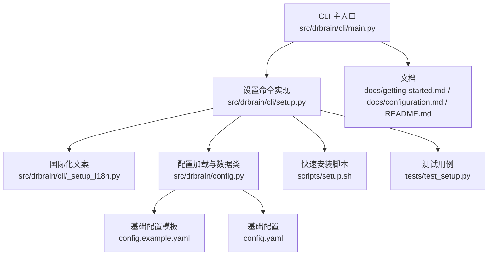
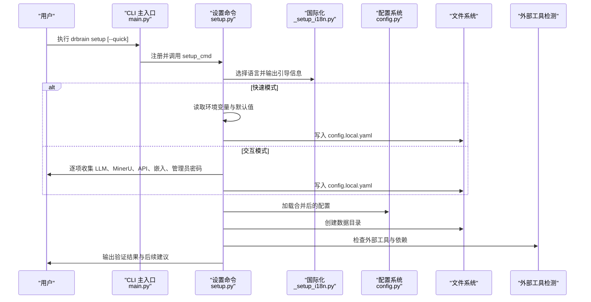
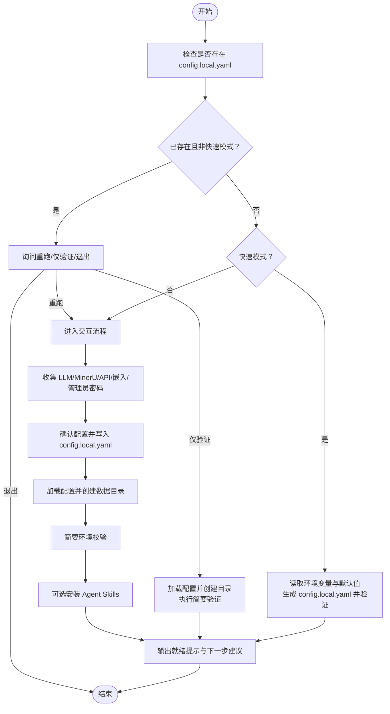
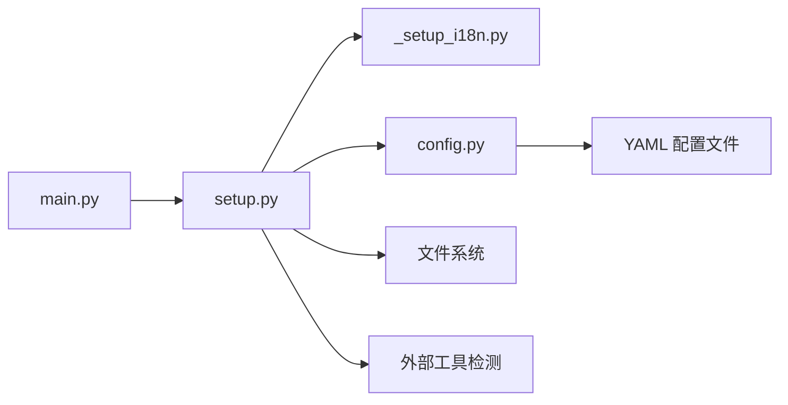

# 设置命令

<cite>
**本文引用的文件**
- [setup.py](file://src/drbrain/cli/setup.py)
- [main.py](file://src/drbrain/cli/main.py)
- [_setup_i18n.py](file://src/drbrain/cli/_setup_i18n.py)
- [config.py](file://src/drbrain/config.py)
- [config.example.yaml](file://config.example.yaml)
- [config.yaml](file://config.yaml)
- [setup.sh](file://scripts/setup.sh)
- [test_setup.py](file://tests/test_setup.py)
- [getting-started.md](file://docs/getting-started.md)
- [configuration.md](file://docs/configuration.md)
- [README.md](file://README.md)
</cite>

## 目录
1. [简介](#简介)
2. [项目结构](#项目结构)
3. [核心组件](#核心组件)
4. [架构总览](#架构总览)
5. [详细组件分析](#详细组件分析)
6. [依赖分析](#依赖分析)
7. [性能考虑](#性能考虑)
8. [故障排除指南](#故障排除指南)
9. [结论](#结论)
10. [附录](#附录)

## 简介
本章节面向首次安装与日常维护 DrBrain 的用户，系统化介绍“设置”命令（drbrain setup）的工作原理、交互流程、配置生成策略与环境初始化步骤。文档同时覆盖快速模式（--quick）、交互模式、配置文件优先级、默认值覆盖、环境变量注入、依赖检查与常见问题排查，帮助你从零到一完成 DrBrain 的本地部署与优化配置。

## 项目结构
与“设置”命令直接相关的模块与文件：
- CLI 入口与命令注册：src/drbrain/cli/main.py
- 设置命令实现：src/drbrain/cli/setup.py
- 国际化文案：src/drbrain/cli/_setup_i18n.py
- 配置加载与数据类：src/drbrain/config.py
- 配置模板与示例：config.yaml、config.example.yaml
- 快速安装脚本：scripts/setup.sh
- 测试用例：tests/test_setup.py
- 文档：docs/getting-started.md、docs/configuration.md、README.md

图表来源
- [main.py:72-94](file://src/drbrain/cli/main.py#L72-L94)
- [setup.py:207-588](file://src/drbrain/cli/setup.py#L207-L588)
- [_setup_i18n.py:1-342](file://src/drbrain/cli/_setup_i18n.py#L1-L342)
- [config.py:182-194](file://src/drbrain/config.py#L182-L194)
- [config.example.yaml:1-145](file://config.example.yaml#L1-L145)
- [config.yaml:1-72](file://config.yaml#L1-L72)
- [setup.sh:1-24](file://scripts/setup.sh#L1-L24)
- [test_setup.py:1-159](file://tests/test_setup.py#L1-L159)
- [getting-started.md:72-86](file://docs/getting-started.md#L72-L86)
- [configuration.md:5-18](file://docs/configuration.md#L5-L18)
- [README.md:24-36](file://README.md#L24-L36)

章节来源
- [main.py:72-94](file://src/drbrain/cli/main.py#L72-L94)
- [setup.py:207-588](file://src/drbrain/cli/setup.py#L207-L588)
- [_setup_i18n.py:1-342](file://src/drbrain/cli/_setup_i18n.py#L1-L342)
- [config.py:182-194](file://src/drbrain/config.py#L182-L194)
- [config.example.yaml:1-145](file://config.example.yaml#L1-L145)
- [config.yaml:1-72](file://config.yaml#L1-L72)
- [setup.sh:1-24](file://scripts/setup.sh#L1-L24)
- [test_setup.py:1-159](file://tests/test_setup.py#L1-L159)
- [getting-started.md:72-86](file://docs/getting-started.md#L72-L86)
- [configuration.md:5-18](file://docs/configuration.md#L5-L18)
- [README.md:24-36](file://README.md#L24-L36)

## 核心组件
- 设置命令（setup_cmd）
  - 支持交互式与快速模式（--quick），根据是否已有 config.local.yaml 决定重跑或仅验证环境。
  - 生成 config.local.yaml，覆盖 LLM、MinerU、API、嵌入、管理员密码等关键配置。
  - 初始化数据目录（如 data/spool/inbox、data/papers 等），并进行简要环境校验（包、外部工具、配置、目录）。
  - 可选安装 Agent Skills（npx skills add）。
- 国际化（_setup_i18n）
  - 提供英文/中文双语提示与文案，贯穿整个设置流程。
- 配置系统（config.py）
  - 定义各子配置的数据类（LLM、MinerU、API、Dirs、DB、Embed 等），支持属性访问与字典兼容。
  - 加载顺序：config.yaml（基础模板）→ config.local.yaml（本地覆盖与密钥）→ 环境变量（${VAR} 占位符解析）。
- 模板与示例（config.example.yaml、config.yaml）
  - 提供字段说明、默认值与可用提供商模板，指导用户正确填写密钥与路径。
- 快速安装脚本（setup.sh）
  - 自动安装 Python 依赖与 MinerU CLI，便于首次环境准备。

章节来源
- [setup.py:207-588](file://src/drbrain/cli/setup.py#L207-L588)
- [_setup_i18n.py:1-342](file://src/drbrain/cli/_setup_i18n.py#L1-L342)
- [config.py:182-194](file://src/drbrain/config.py#L182-L194)
- [config.example.yaml:1-145](file://config.example.yaml#L1-L145)
- [config.yaml:1-72](file://config.yaml#L1-L72)
- [setup.sh:1-24](file://scripts/setup.sh#L1-L24)

## 架构总览
下图展示“设置”命令从 CLI 调用到配置生成与环境初始化的整体流程。

图表来源
- [main.py:72-94](file://src/drbrain/cli/main.py#L72-L94)
- [setup.py:207-588](file://src/drbrain/cli/setup.py#L207-L588)
- [_setup_i18n.py:1-342](file://src/drbrain/cli/_setup_i18n.py#L1-L342)
- [config.py:182-194](file://src/drbrain/config.py#L182-L194)

## 详细组件分析

### 设置命令（setup_cmd）工作流
- 参数与行为
  - --quick：跳过交互，按环境变量与默认值生成 config.local.yaml，并创建必要目录、执行简要验证。
  - --change-password：在已有 config.local.yaml 的前提下，验证旧密码并更新管理员密码哈希。
- 交互流程（非快速模式）
  - 语言选择（中/英）
  - LLM 配置（主模型与可选回退模型）
  - MinerU 配置（token 模式/免费模式、高级参数）
  - API 密钥（DeepXiv、Semantic Scholar、CrossRef、OpenAlex）
  - 嵌入配置（local/openai-compat/none）
  - 管理员密码（可选）
  - 最终确认并写入 config.local.yaml
- 环境初始化
  - 加载合并后的配置，确保数据目录存在
  - 进行简要环境校验（Python 包、外部工具、配置文件、目录）
  - 可选安装 Agent Skills（npx skills add）

图表来源
- [setup.py:207-588](file://src/drbrain/cli/setup.py#L207-L588)

章节来源
- [setup.py:207-588](file://src/drbrain/cli/setup.py#L207-L588)

### 配置生成与覆盖机制
- 生成目标：config.local.yaml（本地覆盖与密钥，git 忽略）
- 覆盖顺序：config.yaml（基础模板）→ config.local.yaml（本地覆盖）→ 环境变量（${VAR} 占位符解析）
- 关键字段（示例）
  - LLM：provider、model、api_key、base_url（支持多模型回退链）
  - MinerU：token、model、is_ocr、enable_formula、enable_table、max_pages
  - API：deepxiv_token、s2_api_key、s2_rate_limit、crossref_email、openalex_token
  - 嵌入：provider、model、device、api_base、api_key、batch_size、top_k 等
  - 数据目录：dirs.inbox、dirs.pending、dirs.papers、dirs.reports、dirs.cache、dirs.logs
  - 管理员密码：admin.password_hash（可选）

章节来源
- [config.py:182-194](file://src/drbrain/config.py#L182-L194)
- [config.example.yaml:1-145](file://config.example.yaml#L1-L145)
- [config.yaml:1-72](file://config.yaml#L1-L72)
- [configuration.md:5-18](file://docs/configuration.md#L5-L18)

### 国际化与提示文案
- 支持英文/中文双语，贯穿引导、提示、确认与最终提示。
- 语言选择在交互开始时进行；快速模式下使用英文文案。

章节来源
- [_setup_i18n.py:1-342](file://src/drbrain/cli/_setup_i18n.py#L1-L342)
- [setup.py:278-283](file://src/drbrain/cli/setup.py#L278-L283)

### 环境初始化与依赖检查
- 目录创建：确保 data/spool/inbox、data/spool/pending、data/papers、data/reports、data/cache、data/logs 等存在
- 依赖检查：Python 包（pymupdf、litellm、typer、rich、pyyaml、pydantic、pyalex、arxiv、pymupdf4llm）与外部工具（mineru-open-api）
- 配置检查：config.yaml 是否存在、config.local.yaml 是否存在
- 目录检查：dirs 配置或默认路径下的目录是否齐全

章节来源
- [setup.py:94-188](file://src/drbrain/cli/setup.py#L94-L188)

### 快速安装脚本（可选）
- 自动安装 Python 依赖（uv sync）
- 自动安装 MinerU CLI（mineru-open-api），若已存在则显示版本信息
- 输出下一步建议（复制示例配置、运行 ingest）

章节来源
- [setup.sh:1-24](file://scripts/setup.sh#L1-L24)

## 依赖分析
- CLI 注册
  - main.py 将 setup_cmd 注册为命令入口，统一由 Typer 管理。
- 设置命令内部依赖
  - 与国际化模块配合输出双语提示
  - 与配置系统协作加载合并后的配置
  - 与文件系统交互生成 config.local.yaml 与数据目录
  - 与外部工具检测函数协作判断 MinerU CLI 是否可用
- 配置系统
  - 以数据类形式定义各子配置，支持属性与字典两种访问方式
  - 加载顺序与占位符解析逻辑清晰，便于调试与扩展

图表来源
- [main.py:72-94](file://src/drbrain/cli/main.py#L72-L94)
- [setup.py:1-588](file://src/drbrain/cli/setup.py#L1-L588)
- [_setup_i18n.py:1-342](file://src/drbrain/cli/_setup_i18n.py#L1-L342)
- [config.py:182-194](file://src/drbrain/config.py#L182-L194)

章节来源
- [main.py:72-94](file://src/drbrain/cli/main.py#L72-L94)
- [setup.py:1-588](file://src/drbrain/cli/setup.py#L1-L588)
- [_setup_i18n.py:1-342](file://src/drbrain/cli/_setup_i18n.py#L1-L342)
- [config.py:182-194](file://src/drbrain/config.py#L182-L194)

## 性能考虑
- 快速模式适合 CI/CD 或自动化部署，避免交互等待，减少 IO 次数。
- 目录创建与验证采用一次性批量处理，降低重复 IO。
- 嵌入配置的 provider 选择直接影响推理吞吐与成本：local 适合离线与隐私场景，openai-compat 适合高并发与弹性资源，none 则关闭文本嵌入功能。
- 建议在生产环境使用 --quick 并结合环境变量注入，减少交互与错误输入带来的风险。

## 故障排除指南
- 无法找到 config.local.yaml
  - 使用 drbrain setup 生成；或手动复制 config.example.yaml 为 config.local.yaml 并填入密钥。
- 环境变量未生效
  - 确认环境变量名与占位符一致（如 ${OPENAI_API_KEY}），并在生成 config.local.yaml 后重新加载配置。
- 外部工具缺失（MinerU CLI）
  - 安装 mineru-open-api；若不可用，系统会回退至 PyMuPDF，但解析质量可能下降。
- 目录权限不足
  - 确保当前用户对 data/* 目录具有读写权限；必要时手动创建或调整权限。
- Python 包缺失
  - 使用 uv sync 或 pip 安装缺失的包；参考依赖提示与安装建议。
- 验证阶段出现警告
  - 运行 drbrain check 获取详细诊断；根据提示修复网络、密钥或路径问题。
- Agent Skills 安装失败
  - 确保已安装 Node.js 与 npx；若失败，按提示手动执行安装命令。

章节来源
- [setup.py:119-188](file://src/drbrain/cli/setup.py#L119-L188)
- [configuration.md:5-18](file://docs/configuration.md#L5-L18)
- [getting-started.md:217-222](file://docs/getting-started.md#L217-L222)

## 结论
“设置”命令为 DrBrain 的首次安装与日常维护提供了清晰、可定制的自动化流程。通过交互或快速模式，用户可以便捷地生成 config.local.yaml、初始化数据目录、校验环境并安装 Agent Skills。配合配置系统与文档，你可以灵活覆盖默认值、注入环境变量，并针对不同场景（本地/云端/禁用嵌入）选择最优配置方案。

## 附录

### 常用设置流程指南
- 首次安装（源码安装）
  - 克隆仓库并安装依赖
  - 运行 drbrain setup 生成 config.local.yaml
  - 准备数据目录与 API 密钥
  - 运行 drbrain check 验证环境
- 快速模式（CI/CD）
  - 通过环境变量注入 LLM、MinerU、API、嵌入等配置
  - 运行 drbrain setup --quick 自动生成配置并验证
- 日常维护
  - 修改 config.local.yaml 后，重新加载配置并运行 drbrain check
  - 如需重置管理员密码，使用 --change-password

章节来源
- [README.md:24-36](file://README.md#L24-L36)
- [getting-started.md:72-86](file://docs/getting-started.md#L72-L86)
- [setup.py:217-250](file://src/drbrain/cli/setup.py#L217-L250)

### 参数与默认值速览（基于实现与模板）
- LLM
  - provider：默认 openai；支持 openai/anthropic/ollama 等
  - model：默认 gpt-4o（openai）或 qwen2.5:7b（ollama）
  - api_key/base_url：可通过环境变量注入
- MinerU
  - token：默认空（免费版），可选 token（付费）
  - model：默认 vlm；可选 pipeline/MinerU-HTML
  - is_ocr、enable_formula、enable_table：默认 false/true/true
- API
  - deepxiv_token、s2_api_key、crossref_email、openalex_token：可选
  - s2_rate_limit：默认 100
- 嵌入
  - provider：local/openai-compat/none，默认 local
  - model/device/api_base/api_key/batch_size/top_k：按 provider 与默认值配置
- 数据目录
  - 默认路径：data/spool/inbox、data/spool/pending、data/papers、data/reports、data/cache、data/logs

章节来源
- [setup.py:31-91](file://src/drbrain/cli/setup.py#L31-L91)
- [config.example.yaml:1-145](file://config.example.yaml#L1-L145)
- [config.yaml:1-72](file://config.yaml#L1-L72)
- [configuration.md:21-342](file://docs/configuration.md#L21-L342)