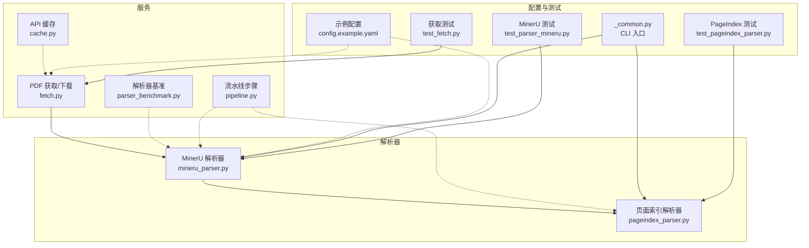
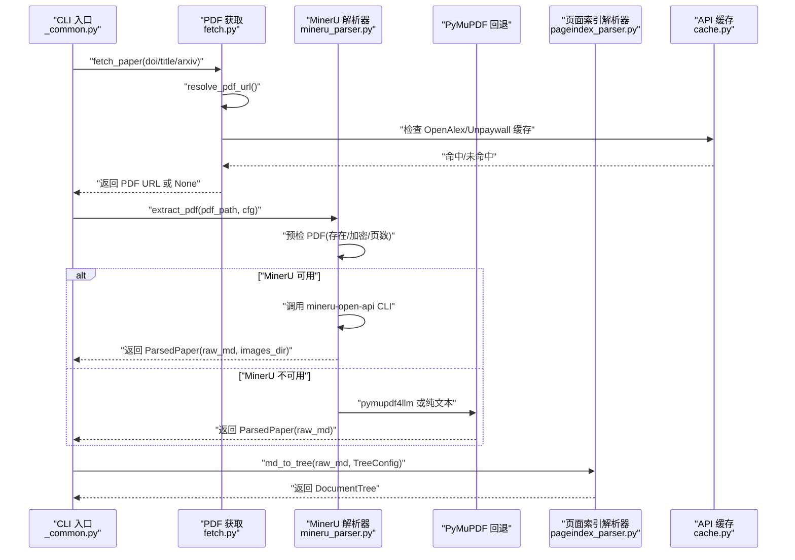
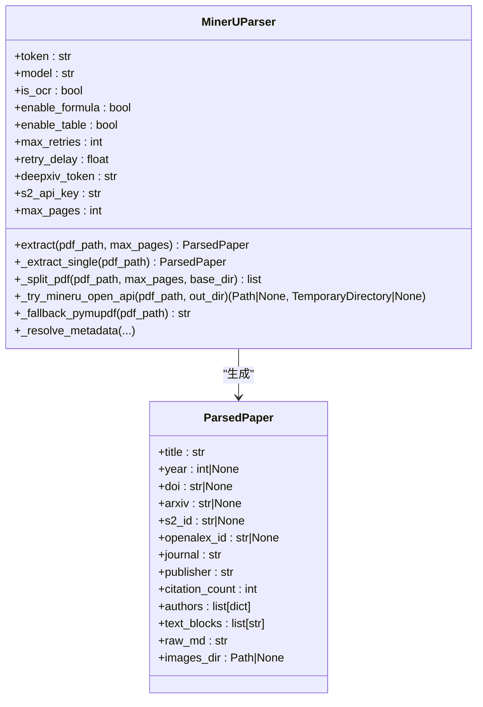
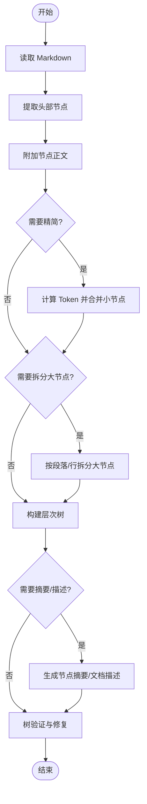
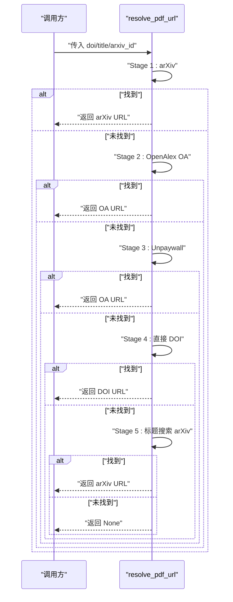
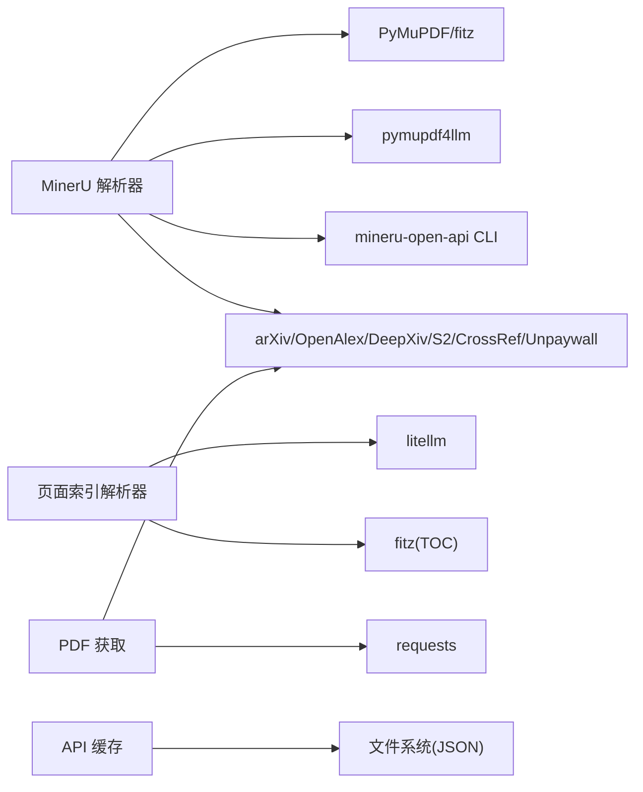

# PDF 解析服务

<cite>
**本文引用的文件**
- [mineru_parser.py](file://src/drbrain/parser/mineru_parser.py)
- [pageindex_parser.py](file://src/drbrain/parser/pageindex_parser.py)
- [fetch.py](file://src/drbrain/services/fetch.py)
- [cache.py](file://src/drbrain/extractor/cache.py)
- [parser_benchmark.py](file://src/drbrain/services/parser_benchmark.py)
- [pipeline.py](file://src/drbrain/services/pipeline.py)
- [__init__.py](file://src/drbrain/parser/__init__.py)
- [config.example.yaml](file://config.example.yaml)
- [test_parser_mineru.py](file://tests/test_parser_mineru.py)
- [test_pageindex_parser.py](file://tests/test_pageindex_parser.py)
- [test_fetch.py](file://tests/test_fetch.py)
- [_common.py](file://src/drbrain/cli/_common.py)
- [SKILL.md](file://skills/paper-ingest/SKILL.md)
</cite>

## 目录
1. [简介](#简介)
2. [项目结构](#项目结构)
3. [核心组件](#核心组件)
4. [架构总览](#架构总览)
5. [详细组件分析](#详细组件分析)
6. [依赖分析](#依赖分析)
7. [性能考虑](#性能考虑)
8. [故障排查指南](#故障排查指南)
9. [结论](#结论)
10. [附录](#附录)

## 简介
本文件面向 PDF 解析服务，系统性梳理“PDF 获取 → 解析 → 结构化处理”的完整流程，重点覆盖以下能力：
- MinerU 解析器：通过外部 mineru-open-api CLI 进行高质量解析，并在不可用时回退至 PyMuPDF（pymupdf4llm）。
- 页面索引解析器（PageIndex）：基于 Markdown 头部与 Token 计数，构建文档树结构；支持 TOC 回退与 LLM 段落分割。
- PDF 下载与缓存：多阶段 PDF 获取策略（arXiv → OpenAlex OA → Unpaywall → 直接 DOI → 标题搜索），并提供 API 响应缓存。
- 解析参数配置：MinerU 模型选择、OCR、公式/表格解析开关、分页阈值等。
- 错误处理与健壮性：CLI 调用失败重试、超时处理、加密/空页检测、回退策略。
- 结果数据结构：解析产物（ParsedPaper）、树结构（DocumentTree）、元数据与页面布局信息。
- 性能优化与常见问题：基准测试、分页拆分、LLM 摘要阈值、缓存 TTL、代理配置。

## 项目结构
围绕 PDF 解析的关键模块如下：
- 解析器
  - MinerU 解析器：src/drbrain/parser/mineru_parser.py
  - 页面索引解析器：src/drbrain/parser/pageindex_parser.py
- 服务与工具
  - PDF 获取与下载：src/drbrain/services/fetch.py
  - API 缓存：src/drbrain/extractor/cache.py
  - 解析器基准：src/drbrain/services/parser_benchmark.py
  - 流水线步骤定义：src/drbrain/services/pipeline.py
  - 解析器导出入口：src/drbrain/parser/__init__.py
- 配置与测试
  - 示例配置：config.example.yaml
  - 单元测试：tests/test_parser_mineru.py、tests/test_pageindex_parser.py、tests/test_fetch.py
  - CLI 入口与流程：src/drbrain/cli/_common.py
  - 技能文档：skills/paper-ingest/SKILL.md

图表来源
- [mineru_parser.py:1-120](file://src/drbrain/parser/mineru_parser.py#L1-L120)
- [pageindex_parser.py:1-120](file://src/drbrain/parser/pageindex_parser.py#L1-L120)
- [fetch.py:1-120](file://src/drbrain/services/fetch.py#L1-L120)
- [cache.py:1-65](file://src/drbrain/extractor/cache.py#L1-L65)
- [parser_benchmark.py:1-120](file://src/drbrain/services/parser_benchmark.py#L1-L120)
- [pipeline.py:1-109](file://src/drbrain/services/pipeline.py#L1-L109)
- [config.example.yaml:67-98](file://config.example.yaml#L67-L98)
- [test_parser_mineru.py:1-172](file://tests/test_parser_mineru.py#L1-L172)
- [test_pageindex_parser.py:1-517](file://tests/test_pageindex_parser.py#L1-L517)
- [test_fetch.py:1-43](file://tests/test_fetch.py#L1-L43)
- [_common.py:26-209](file://src/drbrain/cli/_common.py#L26-L209)

章节来源
- [mineru_parser.py:1-120](file://src/drbrain/parser/mineru_parser.py#L1-L120)
- [pageindex_parser.py:1-120](file://src/drbrain/parser/pageindex_parser.py#L1-L120)
- [fetch.py:1-120](file://src/drbrain/services/fetch.py#L1-L120)
- [cache.py:1-65](file://src/drbrain/extractor/cache.py#L1-L65)
- [parser_benchmark.py:1-120](file://src/drbrain/services/parser_benchmark.py#L1-L120)
- [pipeline.py:1-109](file://src/drbrain/services/pipeline.py#L1-L109)
- [config.example.yaml:67-98](file://config.example.yaml#L67-L98)
- [test_parser_mineru.py:1-172](file://tests/test_parser_mineru.py#L1-L172)
- [test_pageindex_parser.py:1-517](file://tests/test_pageindex_parser.py#L1-L517)
- [test_fetch.py:1-43](file://tests/test_fetch.py#L1-L43)
- [_common.py:26-209](file://src/drbrain/cli/_common.py#L26-L209)

## 核心组件
- MinerU 解析器（MinerUParser）
  - 功能：调用 mineru-open-api CLI 执行解析；若失败则回退至 PyMuPDF（pymupdf4llm）；支持分页拆分、合并、元数据交叉验证。
  - 关键参数：token、model、is_ocr、enable_formula、enable_table、max_retries、retry_delay、deepxiv_token、s2_api_key、max_pages。
  - 输出：ParsedPaper（标题、年份、DOI、arXiv、作者、文本块、原始 Markdown、图片目录等）。
- 页面索引解析器（md_to_tree）
  - 功能：从 Markdown 提取头部节点，构建层次化文档树；支持节点精简、大节点递归拆分、节点摘要与文档描述生成、TOC 回退、LLM 段落分割。
  - 关键参数：TreeConfig（是否精简、最小 Token 阈值、是否添加节点摘要/文档描述/节点文本/节点 ID、最大节点 Token 数）。
  - 输出：DocumentTree（文档名、行数、结构、可选文档描述）。
- PDF 获取与下载（fetch）
  - 功能：多阶段 PDF URL 解析（arXiv → OpenAlex OA → Unpaywall → 直接 DOI → 标题搜索 arXiv），下载 PDF 并写入本地目录。
  - 关键参数：unpaywall_email、institutional_proxy、proxy_type、user_agent、timeout_per_fetch、papers_root。
  - 输出：元数据字典（local_id、title、year、doi、arxiv、pdf_path）。
- API 缓存（ApiCache）
  - 功能：基于文件系统的 JSON 缓存，带 TTL 过期控制。
  - 关键参数：cache_dir、ttl。
  - 输出：命中返回缓存数据，过期或不存在返回 None。

章节来源
- [mineru_parser.py:95-315](file://src/drbrain/parser/mineru_parser.py#L95-L315)
- [pageindex_parser.py:21-487](file://src/drbrain/parser/pageindex_parser.py#L21-L487)
- [fetch.py:13-265](file://src/drbrain/services/fetch.py#L13-L265)
- [cache.py:14-65](file://src/drbrain/extractor/cache.py#L14-L65)

## 架构总览
下图展示从 PDF 获取到结构化输出的端到端流程，以及关键组件之间的交互。

图表来源
- [_common.py:26-209](file://src/drbrain/cli/_common.py#L26-L209)
- [fetch.py:13-265](file://src/drbrain/services/fetch.py#L13-L265)
- [mineru_parser.py:95-315](file://src/drbrain/parser/mineru_parser.py#L95-L315)
- [pageindex_parser.py:412-487](file://src/drbrain/parser/pageindex_parser.py#L412-L487)
- [cache.py:14-65](file://src/drbrain/extractor/cache.py#L14-L65)

## 详细组件分析

### MinerU 解析器（MinerUParser）
- 接口规范
  - 初始化参数
    - token：MinerU API token（可为空）
    - model：解析模型（pipeline/vlm/MinerU-HTML）
    - is_ocr：是否强制 OCR
    - enable_formula：是否解析公式
    - enable_table：是否解析表格
    - max_retries/retry_delay：CLI 调用重试次数与指数退避
    - deepxiv_token/s2_api_key：外部元数据服务凭据
    - max_pages：单次解析页数阈值（超过则拆分）
  - 方法
    - extract(pdf_path, max_pages)：主入口，返回 ParsedPaper
    - _extract_single/pdf_path)：单次解析
    - _split_pdf/pdf_path, max_pages, base_dir)：按页数拆分 PDF
    - _try_mineru_open_api/pdf_path, out_dir)：调用 CLI，含重试与超时
    - _fallback_pymupdf/pdf_path)：回退到 PyMuPDF
    - _resolve_metadata(...)：跨源元数据校验（arXiv/CrossRef/OpenAlex/S2/DeepXiv）
    - _extract_title/_extract_year/_extract_ids：从 Markdown 提取标题/年份/标识符
- 数据结构
  - ParsedPaper：包含 title/year/doi/arxiv/s2_id/openalex_id/journal/publisher/citation_count/authors/text_blocks/raw_md/images_dir
- 错误处理
  - 预检失败（文件不存在/加密/0 页）直接回退
  - CLI 超时/非零退出进行指数退避重试
  - 无输出目录或图片目录缺失时等待并重试
  - 最终回退到 PyMuPDF（优先 pymupdf4llm，否则纯文本）

图表来源
- [mineru_parser.py:95-315](file://src/drbrain/parser/mineru_parser.py#L95-L315)
- [mineru_parser.py:76-93](file://src/drbrain/parser/mineru_parser.py#L76-L93)

章节来源
- [mineru_parser.py:95-315](file://src/drbrain/parser/mineru_parser.py#L95-L315)
- [mineru_parser.py:76-93](file://src/drbrain/parser/mineru_parser.py#L76-L93)
- [test_parser_mineru.py:46-172](file://tests/test_parser_mineru.py#L46-L172)

### 页面索引解析器（md_to_tree）
- 接口规范
  - 输入：Markdown 文件路径
  - 配置：TreeConfig（是否精简、最小 Token 阈值、是否添加摘要/文档描述/节点文本/节点 ID、最大节点 Token 数）
  - 方法
    - md_to_tree(md_path, config, models)：主入口，返回 DocumentTree
    - _extract_nodes_from_markdown/markdown_content：提取头部节点
    - _extract_node_text_content/nodes/markdown_lines：为每个节点附加正文
    - _tree_thinning_for_index/node_list,min_token,model：小节点合并
    - _recursive_split_large_nodes/nodes,max_node_tokens,model：大节点递归拆分
    - _build_tree_from_nodes/node_list：构建层次树
    - _generate_node_summary/_generate_doc_description：LLM 摘要与文档描述
    - validate_and_fix_tree/structure：树验证与修复（去空叶/扁平化/限深/单叶拆分）
    - _build_tree_from_outline/pdf_path/md_path：PDF TOC 回退
    - _llm_segment_document/md_path,config,models：LLM 段落分割回退
- 数据结构
  - DocumentTree：doc_name、line_count、structure、doc_description
  - 结构体字段：title、node_id、line_num、text、summary、prefix_summary、nodes
- LLM 摘要与文档描述
  - 使用 acall_text_with_fallback（来自 LLM 客户端）生成摘要与描述
  - 摘要阈值：当节点文本 Token 数低于阈值时直接使用原文，否则调用 LLM

图表来源
- [pageindex_parser.py:412-487](file://src/drbrain/parser/pageindex_parser.py#L412-L487)
- [pageindex_parser.py:61-276](file://src/drbrain/parser/pageindex_parser.py#L61-L276)

章节来源
- [pageindex_parser.py:21-487](file://src/drbrain/parser/pageindex_parser.py#L21-L487)
- [test_pageindex_parser.py:24-517](file://tests/test_pageindex_parser.py#L24-L517)

### PDF 获取与下载（fetch）
- 接口规范
  - resolve_pdf_url(doi,title,arxiv_id,fetch_config)：多阶段解析 PDF URL
  - download_pdf(url,paper_dir,fetch_config)：下载 PDF 至指定目录
  - fetch_paper(doi,title,arxiv_id,fetch_config)：获取 PDF 并返回元数据
  - _proxy_url/url,cfg：应用机构代理（ezproxy/url_prefix）
  - _resolve_metadata(doi,title,arxiv_id)：快速元数据解析
- 多阶段策略
  - arXiv（最可靠）
  - OpenAlex OA
  - Unpaywall（需邮箱）
  - 直接 DOI（Accept: application/pdf）
  - 标题搜索 arXiv
- 下载校验
  - HEAD/Content-Type/文件头校验（%PDF-）
  - 流式下载与完整性检查
- 配置项
  - unpaywall_email、institutional_proxy、proxy_type、user_agent、timeout_per_fetch、papers_root

图表来源
- [fetch.py:13-265](file://src/drbrain/services/fetch.py#L13-L265)

章节来源
- [fetch.py:13-265](file://src/drbrain/services/fetch.py#L13-L265)
- [test_fetch.py:10-43](file://tests/test_fetch.py#L10-L43)

### API 缓存（ApiCache）
- 接口规范
  - get(key)：命中且未过期返回数据，否则 None
  - set(key,data)：写入带时间戳的 JSON
  - delete(key)/clear()：删除单条/清空
- TTL 控制
  - 默认 24 小时（86400 秒）
- 存储
  - 以 MD5(key) 命名的 JSON 文件，包含 cached_at 与 data

章节来源
- [cache.py:14-65](file://src/drbrain/extractor/cache.py#L14-L65)

### 解析器基准（parser_benchmark）
- 接口规范
  - run_single_benchmark(parser_name,pdf_path)：对单个 PDF 运行单个解析器
  - run_benchmark(pdf_paths,parsers)：批量运行
  - format_results_table(results)：格式化输出
- 支持解析器
  - pymupdf、mineru、pymupdf4llm
- 输出
  - parser、pdf_path、elapsed_sec、output_size_bytes、success、error

章节来源
- [parser_benchmark.py:1-154](file://src/drbrain/services/parser_benchmark.py#L1-L154)

### 流水线步骤（pipeline）
- 步骤定义
  - ingest：解析 PDF、识别、树结构化、注册
  - build：5 阶段 LLM 提取（本体/实体/关系/共指/精炼）
  - embed：训练 TransE 图嵌入 + 树文本嵌入
  - closure：规则推理（8 符号 + 4 嵌入规则）
- 预设
  - full：ingest → build → embed → closure
  - quick：build → embed → closure
  - embed：embed → closure

章节来源
- [pipeline.py:14-109](file://src/drbrain/services/pipeline.py#L14-L109)

## 依赖分析
- 组件耦合
  - MinerU 解析器依赖 PyMuPDF（fitz）、pymupdf4llm、外部 CLI（mineru-open-api）、外部 API（arxiv/pyalex/deepxiv/s2/crossref/unpaywall）。
  - 页面索引解析器依赖 litellm 的 token 计数、异步 LLM 客户端、PDF TOC（fitz）。
  - PDF 获取服务依赖 requests、OpenAlex/Unpaywall 接口、arXiv API。
  - CLI 入口依赖解析器与树构建器，负责编排与日志。
- 外部依赖
  - PyMuPDF（fitz/pymupdf4llm）：文本/图像提取与 PDF 操作
  - litellm：Token 计数与 LLM 调用
  - requests：HTTP 请求与 PDF 下载
  - arxiv/pyalex/deepxiv_sdk/urllib：元数据与 OA 服务
- 循环依赖
  - 未发现循环依赖；各模块职责清晰，接口边界明确。

图表来源
- [mineru_parser.py:33-41](file://src/drbrain/parser/mineru_parser.py#L33-L41)
- [pageindex_parser.py:15-16](file://src/drbrain/parser/pageindex_parser.py#L15-L16)
- [fetch.py:9-10](file://src/drbrain/services/fetch.py#L9-L10)
- [cache.py:21-24](file://src/drbrain/extractor/cache.py#L21-L24)

章节来源
- [mineru_parser.py:33-51](file://src/drbrain/parser/mineru_parser.py#L33-L51)
- [pageindex_parser.py:15-16](file://src/drbrain/parser/pageindex_parser.py#L15-L16)
- [fetch.py:9-10](file://src/drbrain/services/fetch.py#L9-L10)
- [cache.py:21-24](file://src/drbrain/extractor/cache.py#L21-L24)

## 性能考虑
- 解析器选择与分页
  - MinerU 对于大文档自动拆分（默认阈值 150 页），避免单次解析超限；拆分后合并 Markdown 与图片目录。
  - PyMuPDF 回退适合扫描版/加密版 PDF，但速度较慢。
- Token 与摘要
  - PageIndex 的摘要阈值（默认 200）与节点 Token 上限（默认 10000）影响 LLM 调用频率与成本。
  - 精简（if_thinning）可减少树深度，降低后续检索与推理开销。
- 缓存与网络
  - OpenAlex/Unpaywall/DeepXiv 等 API 建议开启缓存（TTL 默认 24h），减少重复请求。
  - 机构代理（ezproxy/url_prefix）可能增加延迟，需合理配置。
- 基准测试
  - 使用 parser_benchmark 对比不同解析器耗时与输出大小，指导生产选择。
- I/O 与并发
  - 下载 PDF 采用流式写入，避免内存峰值；并发控制由上层调用者管理。

章节来源
- [mineru_parser.py:120-227](file://src/drbrain/parser/mineru_parser.py#L120-L227)
- [pageindex_parser.py:21-33](file://src/drbrain/parser/pageindex_parser.py#L21-L33)
- [parser_benchmark.py:39-120](file://src/drbrain/services/parser_benchmark.py#L39-L120)
- [config.example.yaml:95-96](file://config.example.yaml#L95-L96)

## 故障排查指南
- PDF 获取失败
  - 症状：resolve_pdf_url 返回 None
  - 排查：确认 DOI/arXiv 是否正确；检查 Unpaywall 邮箱配置；确认网络可达；必要时启用代理。
  - 参考：[fetch.py:13-49](file://src/drbrain/services/fetch.py#L13-L49)
- CLI 调用失败（MinerU）
  - 症状：mineru-open-api 返回非零码或超时
  - 排查：检查 token/model/OCR/公式/表格参数；查看重试日志；确认 CLI 可执行；尝试回退到 PyMuPDF。
  - 参考：[mineru_parser.py:347-423](file://src/drbrain/parser/mineru_parser.py#L347-L423)、[test_parser_mineru.py:46-86](file://tests/test_parser_mineru.py#L46-L86)
- 加密/空页 PDF
  - 症状：预检失败（加密/0 页）
  - 排查：确认 PDF 来源；尝试扫描版 OCR；或改用 PyMuPDF 回退。
  - 参考：[mineru_parser.py:28-51](file://src/drbrain/parser/mineru_parser.py#L28-L51)
- LLM 摘要失败
  - 症状：摘要生成为空或报错
  - 排查：检查 LLM 模型配置与可用性；适当提高摘要阈值；关闭摘要以降低开销。
  - 参考：[pageindex_parser.py:356-379](file://src/drbrain/parser/pageindex_parser.py#L356-L379)
- 树结构异常
  - 症状：树过深/空叶/单链
  - 排查：启用 validate_and_fix_tree；调整精简阈值与最大深度；确保 Markdown 有有效头部。
  - 参考：[pageindex_parser.py:619-654](file://src/drbrain/parser/pageindex_parser.py#L619-L654)
- CLI 失败定位
  - 症状：ingest 失败并移动到 pending
  - 排查：查看 pending.jsonl 日志；确认 PDF 可读性与解析器可用性。
  - 参考：[SKILL.md:60-64](file://skills/paper-ingest/SKILL.md#L60-L64)、[_common.py:399-401](file://src/drbrain/cli/_common.py#L399-L401)

章节来源
- [fetch.py:13-49](file://src/drbrain/services/fetch.py#L13-L49)
- [mineru_parser.py:28-51](file://src/drbrain/parser/mineru_parser.py#L28-L51)
- [mineru_parser.py:347-423](file://src/drbrain/parser/mineru_parser.py#L347-L423)
- [pageindex_parser.py:356-379](file://src/drbrain/parser/pageindex_parser.py#L356-L379)
- [pageindex_parser.py:619-654](file://src/drbrain/parser/pageindex_parser.py#L619-L654)
- [SKILL.md:60-64](file://skills/paper-ingest/SKILL.md#L60-L64)
- [_common.py:399-401](file://src/drbrain/cli/_common.py#L399-L401)

## 结论
本 PDF 解析服务通过“MinerU + PyMuPDF 回退”与“PageIndex 文档树构建”形成高鲁棒性的解析链路；结合多阶段 PDF 获取与 API 缓存，可在复杂网络环境下稳定产出结构化结果。建议在生产中：
- 合理设置分页阈值与摘要阈值，平衡质量与成本；
- 开启 API 缓存并配置合适的 TTL；
- 使用基准测试持续评估解析器性能；
- 针对扫描版/加密版 PDF 明确回退策略与人工干预流程。

## 附录
- 配置参考
  - MinerU 解析器配置：token、model、is_ocr、enable_formula、enable_table、max_pages
  - PDF 获取配置：unpaywall_email、institutional_proxy、proxy_type、user_agent、timeout_per_fetch、papers_root
  - API 缓存配置：cache_ttl
  - 参考：[config.example.yaml:67-98](file://config.example.yaml#L67-L98)、[config.example.yaml:90-98](file://config.example.yaml#L90-L98)

章节来源
- [config.example.yaml:67-98](file://config.example.yaml#L67-L98)
- [config.example.yaml:90-98](file://config.example.yaml#L90-L98)