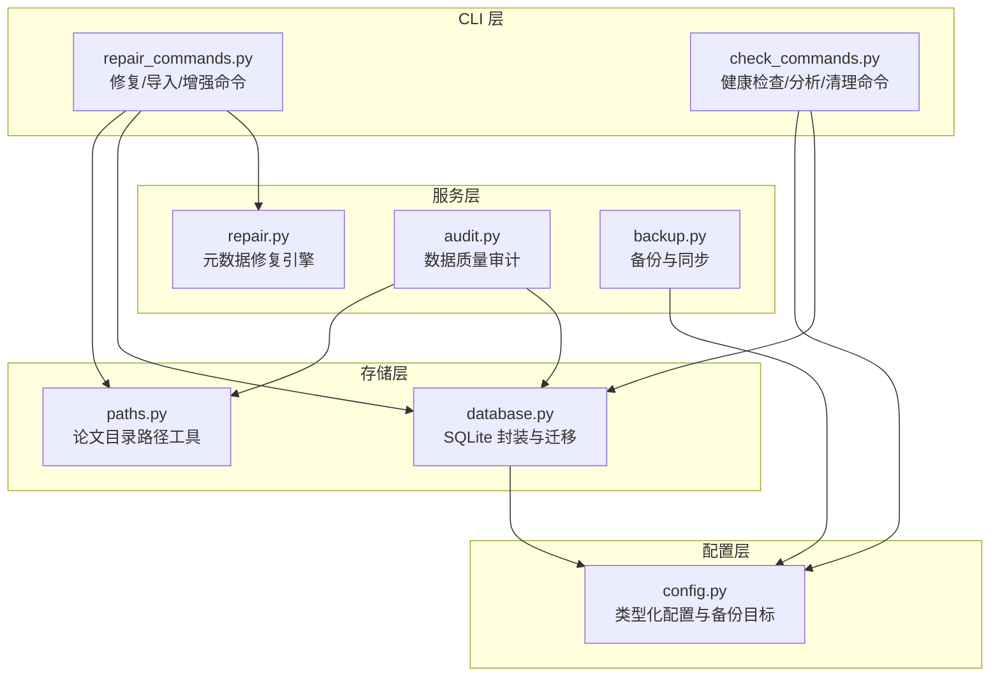
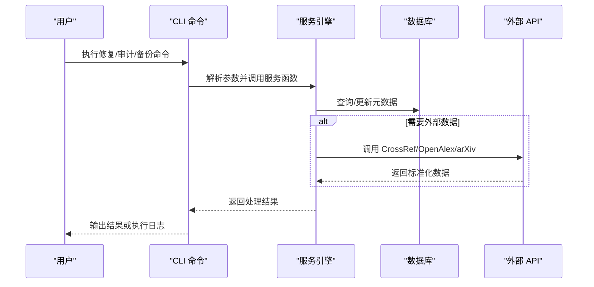
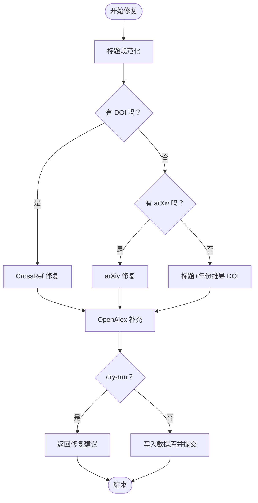
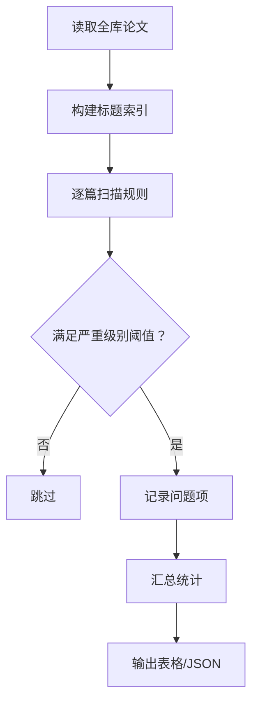
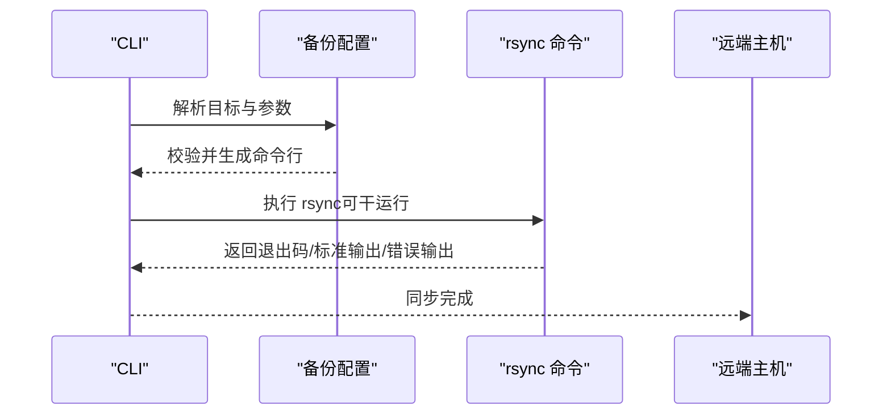
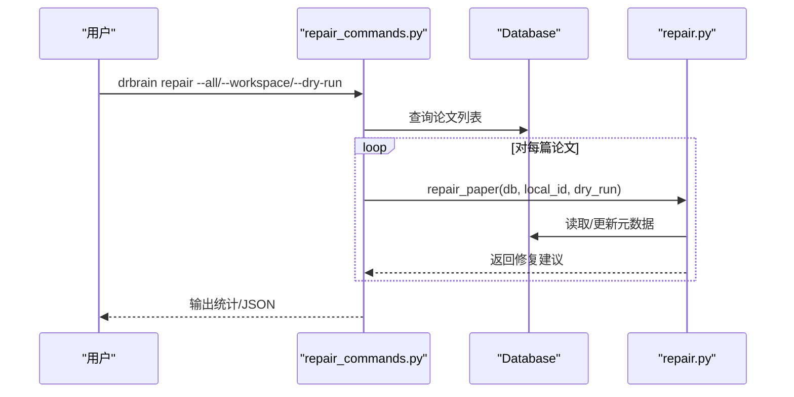
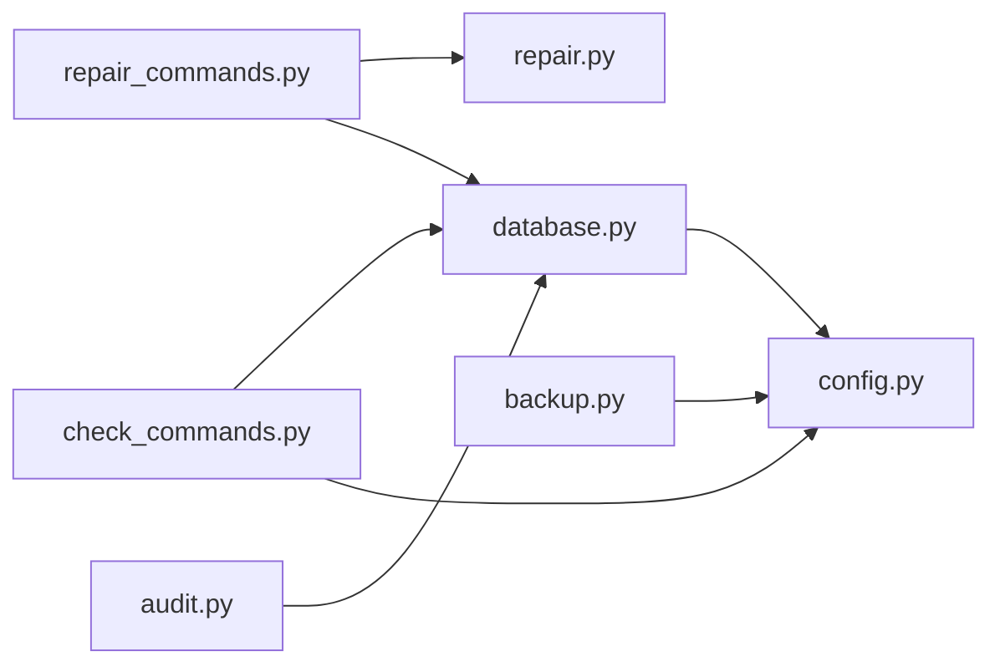
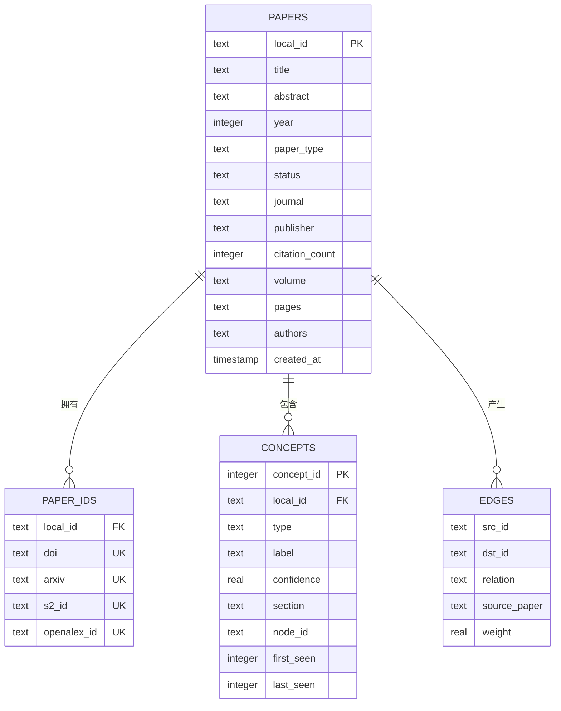

# 修复与维护服务

<cite>
**本文档引用的文件**
- [repair_commands.py](file://src/drbrain/cli/repair_commands.py)
- [repair.py](file://src/drbrain/services/repair.py)
- [backup.py](file://src/drbrain/storage/backup.py)
- [audit.py](file://src/drbrain/services/audit.py)
- [database.py](file://src/drbrain/storage/database.py)
- [config.py](file://src/drbrain/config.py)
- [check_commands.py](file://src/drbrain/cli/check_commands.py)
- [paths.py](file://src/drbrain/storage/paths.py)
- [README.md](file://README.md)
- [troubleshooting.md](file://docs/troubleshooting.md)
- [test_repair.py](file://tests/test_repair.py)
- [test_audit.py](file://tests/test_audit.py)
</cite>

## 目录
1. [简介](#简介)
2. [项目结构](#项目结构)
3. [核心组件](#核心组件)
4. [架构总览](#架构总览)
5. [详细组件分析](#详细组件分析)
6. [依赖关系分析](#依赖关系分析)
7. [性能考虑](#性能考虑)
8. [故障排除指南](#故障排除指南)
9. [结论](#结论)
10. [附录](#附录)

## 简介
本文件面向修复与维护服务，系统化梳理数据修复、系统维护与错误恢复的接口规范与实现机制。内容覆盖：
- 元数据修复策略：基于 CrossRef、arXiv、OpenAlex 的多源校验与回填
- 数据完整性检查：15条规则的分级审计（错误/警告/提示）
- 自动修复机制：标题规范化、缺失字段回填、DOI 推断
- 维护模式与备份恢复：本地归档与远程 rsync 同步
- 健康检查与诊断：环境依赖、配置、API 连通性、磁盘空间
- 故障排除与预防性维护：常见问题定位与恢复流程

## 项目结构
围绕修复与维护能力，核心模块分布如下：
- CLI 层：命令入口与参数解析（修复、导入、审计、清理、备份等）
- 服务层：修复引擎、审计引擎、备份引擎
- 存储层：SQLite 数据库、路径工具、备份归档
- 配置层：类型化配置与目标配置

**图表来源**
- [repair_commands.py:1-438](file://src/drbrain/cli/repair_commands.py#L1-L438)
- [repair.py:1-337](file://src/drbrain/services/repair.py#L1-L337)
- [backup.py:1-240](file://src/drbrain/storage/backup.py#L1-L240)
- [audit.py:1-396](file://src/drbrain/services/audit.py#L1-L396)
- [database.py:1-775](file://src/drbrain/storage/database.py#L1-L775)
- [config.py:144-179](file://src/drbrain/config.py#L144-L179)
- [check_commands.py:1-629](file://src/drbrain/cli/check_commands.py#L1-L629)
- [paths.py:1-29](file://src/drbrain/storage/paths.py#L1-L29)

**章节来源**
- [repair_commands.py:1-438](file://src/drbrain/cli/repair_commands.py#L1-L438)
- [repair.py:1-337](file://src/drbrain/services/repair.py#L1-L337)
- [backup.py:1-240](file://src/drbrain/storage/backup.py#L1-L240)
- [audit.py:1-396](file://src/drbrain/services/audit.py#L1-L396)
- [database.py:1-775](file://src/drbrain/storage/database.py#L1-L775)
- [config.py:144-179](file://src/drbrain/config.py#L144-L179)
- [check_commands.py:1-629](file://src/drbrain/cli/check_commands.py#L1-L629)
- [paths.py:1-29](file://src/drbrain/storage/paths.py#L1-L29)

## 核心组件
- 修复引擎（repair.py）：统一执行标题规范化、CrossRef/arXiv/OpenAlex 多源修复，并按 dry-run 模式决定是否写入数据库
- 审计引擎（audit.py）：扫描全库，按严重级别输出 15 条规则检测结果
- 备份引擎（backup.py）：本地 tar.gz 归档与远程 rsync 同步，支持目标配置与干运行
- 数据库封装（database.py）：Schema 初始化与迁移、查询/插入/更新/删除、统计分析
- 健康检查（check_commands.py）：依赖包、外部工具、配置项、API 连通性、磁盘空间、库规模
- 路径工具（paths.py）：论文目录、raw.md、tree.json、PDF、图片等路径访问器

**章节来源**
- [repair.py:265-337](file://src/drbrain/services/repair.py#L265-L337)
- [audit.py:30-309](file://src/drbrain/services/audit.py#L30-L309)
- [backup.py:26-63](file://src/drbrain/storage/backup.py#L26-L63)
- [database.py:159-201](file://src/drbrain/storage/database.py#L159-L201)
- [check_commands.py:24-426](file://src/drbrain/cli/check_commands.py#L24-L426)
- [paths.py:6-29](file://src/drbrain/storage/paths.py#L6-L29)

## 架构总览
修复与维护服务采用“CLI → 服务 → 存储”的分层设计，通过配置驱动备份目标，通过数据库抽象屏蔽底层迁移细节。

**图表来源**
- [repair_commands.py:14-75](file://src/drbrain/cli/repair_commands.py#L14-L75)
- [repair.py:265-337](file://src/drbrain/services/repair.py#L265-L337)
- [audit.py:30-309](file://src/drbrain/services/audit.py#L30-L309)
- [backup.py:199-240](file://src/drbrain/storage/backup.py#L199-L240)
- [database.py:259-478](file://src/drbrain/storage/database.py#L259-L478)

## 详细组件分析

### 修复引擎（repair.py）
- 修复策略
  - 标题规范化：去除 arXiv 前缀、纠正全大写标题大小写
  - 多源修复：
    - CrossRef：按 DOI 获取标题/作者/年份/期刊/摘要/被引数
    - arXiv：按 arXiv ID 获取标题/年份
    - OpenAlex：补充摘要、被引数、作者、卷期页码
    - 标题+年份推导 DOI（当无 DOI/arXiv）
- 自动修复机制
  - 支持 dry-run：仅返回修复建议，不写入数据库
  - 非 dry-run：逐条应用修复并提交事务
- 错误处理
  - 各修复函数异常捕获，不影响其他修复链路
  - 记录日志便于排障

**图表来源**
- [repair.py:16-337](file://src/drbrain/services/repair.py#L16-L337)

**章节来源**
- [repair.py:9-337](file://src/drbrain/services/repair.py#L9-L337)

### 审计引擎（audit.py）
- 规则体系（严重级别：error/warning/info）
  - 缺失类：标题为空、raw.md 缺失、无外部 ID、摘要为空、年份为空、期刊为空、无作者概念、raw.md 过短、tree.json 缺失或空、概念数量过少
  - 环境类：标题含未解析变量
  - 状态类：无边、占位状态、超过阈值的占位时间
  - 重复类：标准化标题重复
- 输出与过滤
  - 可按严重级别过滤
  - 支持工作区过滤
  - 支持 JSON 输出

**图表来源**
- [audit.py:30-309](file://src/drbrain/services/audit.py#L30-L309)

**章节来源**
- [audit.py:30-396](file://src/drbrain/services/audit.py#L30-L396)

### 备份引擎（backup.py）
- 本地备份
  - 创建 tar.gz 归档，包含 papers、drbrain.db、可选 workspace、reports
  - 记录归档大小与路径
- 远程同步
  - 基于 rsync + ssh，支持压缩、追加模式、排除规则
  - 支持密码认证与密钥认证
  - 提供干运行模式验证命令行
- 配置与校验
  - 类型化备份目标配置（host/user/path/port/identity/password/mode/compress/exclude/enabled）
  - 参数合法性校验与错误类型化

**图表来源**
- [backup.py:171-240](file://src/drbrain/storage/backup.py#L171-L240)
- [config.py:144-179](file://src/drbrain/config.py#L144-L179)

**章节来源**
- [backup.py:26-240](file://src/drbrain/storage/backup.py#L26-L240)
- [config.py:144-179](file://src/drbrain/config.py#L144-L179)

### 健康检查（check_commands.py）
- 依赖与工具
  - Python 包、外部 CLI（MinerU、PyMuPDF）、解析器路径选择
- 配置与令牌
  - LLM 模型、MinerU Token、CrossRef 邮箱、OpenAlex Token、嵌入模型与密钥
- 目录与数据库
  - 目录存在性与创建、数据库存在性
- 库规模与磁盘空间
  - 论文/概念计数、data/ 分区剩余空间
- API 连通性
  - MinerU API/CLI、DeepXiv、LLM Provider
- 总结与退出码

**章节来源**
- [check_commands.py:24-426](file://src/drbrain/cli/check_commands.py#L24-L426)

### CLI 修复与导入命令（repair_commands.py）
- 修复命令
  - 支持单篇、全库、工作区过滤
  - 支持 dry-run 与 JSON 输出
  - 逐篇调用修复引擎，聚合结果并输出
- 导入命令
  - 支持 Zotero（本地/Web API）、BibTeX、Endnote（.ris/.xml）
  - 支持集合列表（Zotero Web API 本地模式）
  - 干运行模式预览、去重（按 DOI）、PDF 复制、入库
- 增强命令
  - 基于 CrossRef 回填缺失元数据，检测可疑记录

**图表来源**
- [repair_commands.py:14-75](file://src/drbrain/cli/repair_commands.py#L14-L75)
- [repair.py:265-337](file://src/drbrain/services/repair.py#L265-L337)
- [database.py:419-478](file://src/drbrain/storage/database.py#L419-L478)

**章节来源**
- [repair_commands.py:14-438](file://src/drbrain/cli/repair_commands.py#L14-L438)

## 依赖关系分析
- 低耦合高内聚
  - 修复/审计/备份各自独立模块，通过数据库与配置进行交互
- 外部依赖
  - CrossRef、OpenAlex、arXiv、MinerU、DeepXiv、rsync/ssh
- 数据一致性
  - 数据库 WAL 模式、外键约束、迁移版本表保障一致性

**图表来源**
- [repair_commands.py:1-438](file://src/drbrain/cli/repair_commands.py#L1-L438)
- [repair.py:1-337](file://src/drbrain/services/repair.py#L1-L337)
- [audit.py:1-396](file://src/drbrain/services/audit.py#L1-L396)
- [backup.py:1-240](file://src/drbrain/storage/backup.py#L1-L240)
- [check_commands.py:1-629](file://src/drbrain/cli/check_commands.py#L1-L629)
- [database.py:1-775](file://src/drbrain/storage/database.py#L1-L775)
- [config.py:1-292](file://src/drbrain/config.py#L1-L292)

**章节来源**
- [database.py:159-201](file://src/drbrain/storage/database.py#L159-L201)

## 性能考虑
- 修复链路
  - 多源 API 调用存在网络延迟，建议批量处理时控制并发与重试
  - 标题规范化与正则处理为常量时间，对大数据集影响有限
- 审计扫描
  - 全库扫描 O(n)，建议按工作区或严重级别过滤
  - 标题索引降低重复检测成本
- 备份同步
  - rsync 增量传输，结合压缩与排除规则提升效率
  - 干运行先评估传输量与变更项
- 数据库
  - WAL 模式减少锁竞争；索引覆盖常用查询列

[本节为通用指导，无需具体文件分析]

## 故障排除指南
- 修复失败
  - 检查 CrossRef/OpenAlex/arXiv 可达性与凭据
  - 使用 dry-run 预览修复建议，确认后再写入
  - 查看日志定位异常函数（CrossRef/arXiv/OpenAlex/标题规范化）
- 审计结果异常
  - 确认严重级别阈值设置
  - 检查 raw.md、tree.json 是否存在且非空
  - 工作区过滤是否正确
- 备份失败
  - 校验备份目标配置（host/user/path/port/identity/password）
  - 使用干运行模式验证命令行
  - 检查远端磁盘空间与权限
- 健康检查告警
  - 缺少外部工具：安装 MinerU CLI 或启用 PyMuPDF
  - API 不可达：检查令牌、网络、Provider 配置
  - 磁盘不足：清理缓存/日志或扩容
- 恢复与重建
  - 使用本地归档恢复（tar.gz）
  - 清理后重新初始化（clean + setup + index）

**章节来源**
- [troubleshooting.md:1-198](file://docs/troubleshooting.md#L1-L198)
- [check_commands.py:24-426](file://src/drbrain/cli/check_commands.py#L24-L426)
- [backup.py:199-240](file://src/drbrain/storage/backup.py#L199-L240)

## 结论
修复与维护服务以“可验证、可回滚、可审计”为核心设计原则：修复与导入支持 dry-run 与 JSON 输出；审计提供分级规则与工作区过滤；备份提供本地归档与远程同步；健康检查覆盖环境、配置与 API 连通性。配合完善的故障排除与恢复流程，可有效保障知识图谱系统的数据质量与运行稳定性。

[本节为总结，无需具体文件分析]

## 附录

### API 一览（命令与用途）
- 修复
  - drbrain repair [--all | --workspace | local_id] [--dry-run] [--json]
- 导入
  - drbrain import <zotero|bibtex|endnote> <path> [--dry-run] [--json] [--list-collections] [--collection] [--api-key] [--library-id] [--library-type] [--no-pdf] [--import-collections]
- 增强
  - drbrain enrich [--all | local_id] [--dry-run] [--json]
- 审计
  - drbrain audit [--severity error|warning|info] [--workspace] [--json]
- 健康检查
  - drbrain check
- 清理
  - drbrain clean [--force] [--config]
- 备份
  - drbrain backup [--list] [--json]

**章节来源**
- [repair_commands.py:14-438](file://src/drbrain/cli/repair_commands.py#L14-L438)
- [check_commands.py:24-629](file://src/drbrain/cli/check_commands.py#L24-L629)

### 关键数据模型（简化）

**图表来源**
- [database.py:10-156](file://src/drbrain/storage/database.py#L10-L156)