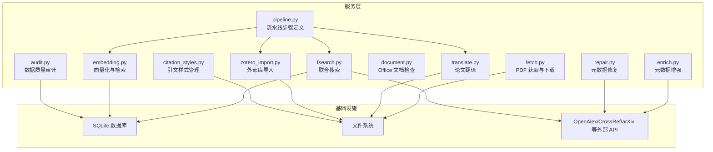
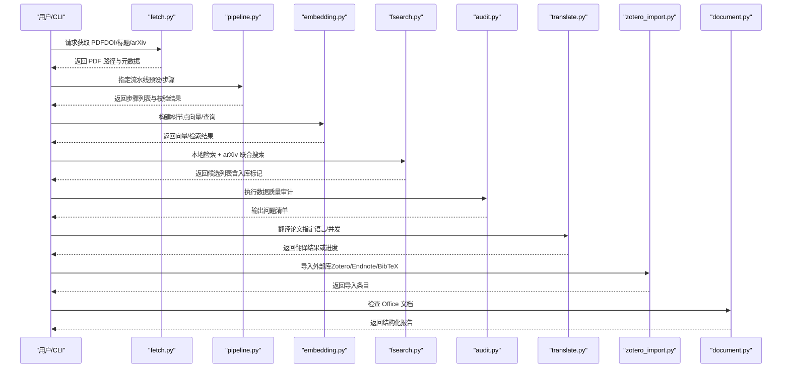
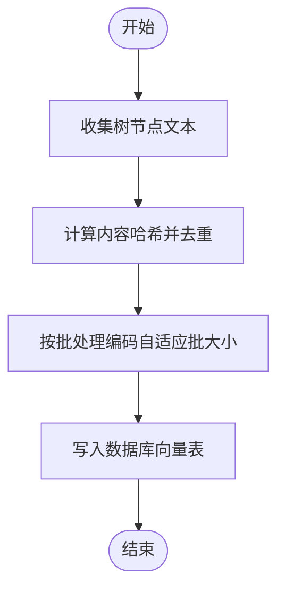
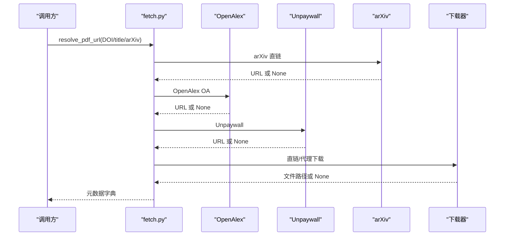
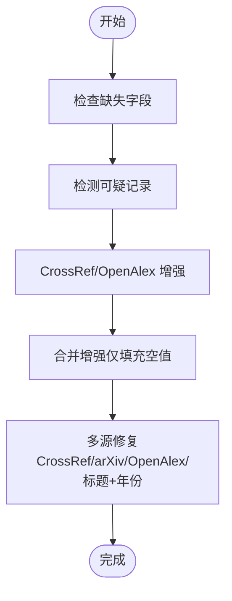
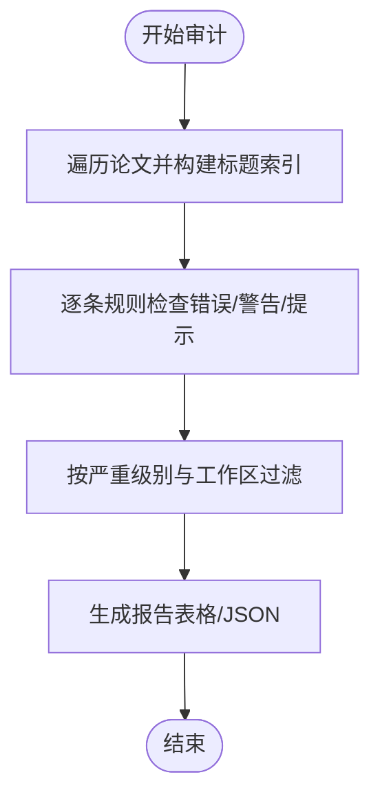
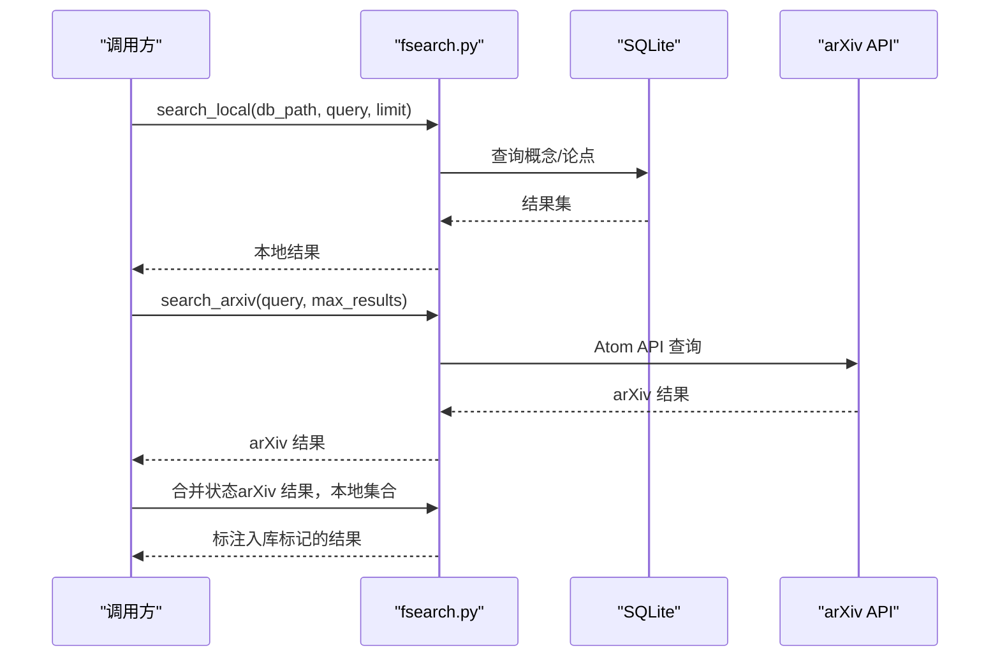
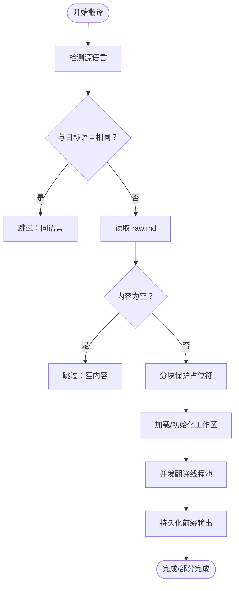
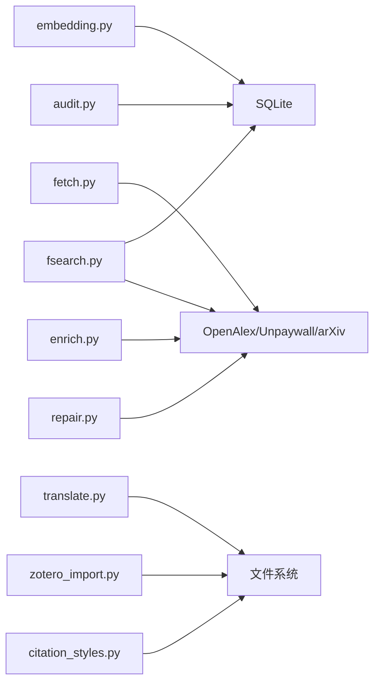

# 内部服务 API

<cite>
**本文档引用的文件**
- [embedding.py](file://src/drbrain/services/embedding.py)
- [pipeline.py](file://src/drbrain/services/pipeline.py)
- [fetch.py](file://src/drbrain/services/fetch.py)
- [enrich.py](file://src/drbrain/services/enrich.py)
- [audit.py](file://src/drbrain/services/audit.py)
- [repair.py](file://src/drbrain/services/repair.py)
- [document.py](file://src/drbrain/services/document.py)
- [fsearch.py](file://src/drbrain/services/fsearch.py)
- [translate.py](file://src/drbrain/services/translate.py)
- [zotero_import.py](file://src/drbrain/services/zotero_import.py)
- [citation_styles.py](file://src/drbrain/services/citation_styles.py)
</cite>

## 目录
1. [简介](#简介)
2. [项目结构](#项目结构)
3. [核心组件](#核心组件)
4. [架构总览](#架构总览)
5. [详细组件分析](#详细组件分析)
6. [依赖分析](#依赖分析)
7. [性能考虑](#性能考虑)
8. [故障排查指南](#故障排查指南)
9. [结论](#结论)
10. [附录](#附录)

## 简介
本文件面向 DrBrain 内部服务 API 的使用者与维护者，系统性梳理并说明以下核心服务模块的职责、接口、输入输出、异常处理与调用示例，并给出服务间依赖关系、数据流转与性能优化建议：
- 文本向量化与检索服务（embedding/search）
- 纸件获取与下载服务（fetch）
- 元数据增强与清洗服务（enrich/repair）
- 数据质量审计服务（audit）
- 办公文档检查服务（document）
- 联合搜索服务（fsearch）
- 论文翻译服务（translate）
- 引文样式管理服务（citation_styles）
- 外部库导入服务（zotero_import）

## 项目结构
DrBrain 的内部服务集中于 src/drbrain/services 目录，按功能域划分模块，彼此通过数据库、文件系统与外部 API 协作，形成“采集-解析-抽取-嵌入-检索-审计-导出”的完整链路。

图表来源
- [embedding.py](file://src/drbrain/services/embedding.py)
- [fetch.py](file://src/drbrain/services/fetch.py)
- [enrich.py](file://src/drbrain/services/enrich.py)
- [repair.py](file://src/drbrain/services/repair.py)
- [audit.py](file://src/drbrain/services/audit.py)
- [document.py](file://src/drbrain/services/document.py)
- [fsearch.py](file://src/drbrain/services/fsearch.py)
- [translate.py](file://src/drbrain/services/translate.py)
- [zotero_import.py](file://src/drbrain/services/zotero_import.py)
- [citation_styles.py](file://src/drbrain/services/citation_styles.py)
- [pipeline.py](file://src/drbrain/services/pipeline.py)

章节来源
- [embedding.py](file://src/drbrain/services/embedding.py)
- [fetch.py](file://src/drbrain/services/fetch.py)
- [enrich.py](file://src/drbrain/services/enrich.py)
- [repair.py](file://src/drbrain/services/repair.py)
- [audit.py](file://src/drbrain/services/audit.py)
- [document.py](file://src/drbrain/services/document.py)
- [fsearch.py](file://src/drbrain/services/fsearch.py)
- [translate.py](file://src/drbrain/services/translate.py)
- [zotero_import.py](file://src/drbrain/services/zotero_import.py)
- [citation_styles.py](file://src/drbrain/services/citation_styles.py)
- [pipeline.py](file://src/drbrain/services/pipeline.py)

## 核心组件
本节概览各服务模块的关键职责与典型调用场景，便于快速定位所需能力。

- 向量化与检索服务（embedding/search）
  - 负责树节点向量化、增量更新、查询向量相似度检索、后过滤与批量适配。
  - 关键接口：构建向量、查询检索、后处理过滤。
- 纸件获取与下载服务（fetch）
  - 提供多阶段回退的 PDF 获取策略（arXiv、OpenAlex、Unpaywall、直链、标题搜索），并下载到本地目录。
  - 关键接口：解析 URL、下载 PDF、统一元数据结构。
- 元数据增强与清洗服务（enrich/repair）
  - 增强：从 CrossRef 拉取缺失字段；清洗：检测可疑记录与缺失项。
  - 修复：基于 CrossRef、arXiv、OpenAlex 等源修复字段。
  - 关键接口：检查完整性、检测可疑、合并增强、修复单篇。
- 数据质量审计服务（audit）
  - 扫描全库，按规则集输出问题清单（错误/警告/提示）。
  - 关键接口：扫描全库、命令行输出。
- 办公文档检查服务（document）
  - 无 GUI 检查 DOCX/PPTX/XLSX 结构与内容，辅助验证布局与常见问题。
  - 关键接口：inspect。
- 联合搜索服务（fsearch）
  - 本地 BM25 风格检索 + arXiv 联合搜索，标注是否已入库。
  - 关键接口：arXiv 查询、本地检索、合并状态。
- 论文翻译服务（translate）
  - 基于 LLM 的分块翻译，支持占位符保护、断点续传、并发与重试。
  - 关键接口：语言检测、分块拆分、翻译执行、结果持久化。
- 引文样式管理服务（citation_styles）
  - 内置多种样式，支持动态加载自定义样式文件，统一输出 Markdown 引文。
  - 关键接口：列出样式、获取格式化器、格式化引用。
- 外部库导入服务（zotero_import）
  - 支持 Zotero 本地库、Web API、Endnote XML/RIS、BibTeX 导入。
  - 关键接口：本地库导入、Web API 导入、RIS/BibTeX 解析。
- 流水线步骤定义（pipeline）
  - 定义 ingest/build/embed/closure 步骤与预设组合，提供解析与校验逻辑。
  - 关键接口：解析步骤、列出信息。

章节来源
- [embedding.py](file://src/drbrain/services/embedding.py)
- [fetch.py](file://src/drbrain/services/fetch.py)
- [enrich.py](file://src/drbrain/services/enrich.py)
- [repair.py](file://src/drbrain/services/repair.py)
- [audit.py](file://src/drbrain/services/audit.py)
- [document.py](file://src/drbrain/services/document.py)
- [fsearch.py](file://src/drbrain/services/fsearch.py)
- [translate.py](file://src/drbrain/services/translate.py)
- [zotero_import.py](file://src/drbrain/services/zotero_import.py)
- [citation_styles.py](file://src/drbrain/services/citation_styles.py)
- [pipeline.py](file://src/drbrain/services/pipeline.py)

## 架构总览
下图展示 DrBrain 内部服务的整体交互与数据流，强调“采集-解析-抽取-嵌入-检索-审计-导出”闭环。

图表来源
- [fetch.py](file://src/drbrain/services/fetch.py)
- [pipeline.py](file://src/drbrain/services/pipeline.py)
- [embedding.py](file://src/drbrain/services/embedding.py)
- [fsearch.py](file://src/drbrain/services/fsearch.py)
- [audit.py](file://src/drbrain/services/audit.py)
- [translate.py](file://src/drbrain/services/translate.py)
- [zotero_import.py](file://src/drbrain/services/zotero_import.py)
- [document.py](file://src/drbrain/services/document.py)

## 详细组件分析

### 向量化与检索服务（embedding/search）
- 职责
  - 加载本地或远端模型，进行自适应批处理与 GPU 内存配置。
  - 收集树节点文本，增量计算内容哈希，避免重复向量化。
  - 提供查询向量与存储向量的余弦相似度检索，支持后过滤与维度校验。
- 输入输出
  - 构建向量：输入（数据库路径、论文目录、配置）、输出（写入数量）。
  - 查询检索：输入（查询语句、数据库路径、top_k、配置）、输出（排序后的匹配项列表）。
- 异常处理
  - 模型加载失败、GPU 适配失败、数据库不可用、维度不一致等均进行日志记录与安全返回空结果。
- 调用示例
  - 构建向量：参考 [build_tree_vectors](file://src/drbrain/services/embedding.py)
  - 查询检索：参考 [search_tree](file://src/drbrain/services/embedding.py)

图表来源
- [embedding.py](file://src/drbrain/services/embedding.py)

章节来源
- [embedding.py](file://src/drbrain/services/embedding.py)

### 纸件获取与下载服务（fetch）
- 职责
  - 多阶段回退解析 PDF URL（arXiv、OpenAlex、Unpaywall、直链、标题搜索），应用机构代理，下载并校验 PDF。
  - 统一元数据结构（标题、年份、DOI、arXiv、本地 ID、PDF 路径）。
- 输入输出
  - 解析 URL：输入（DOI/标题/arXiv）、输出（PDF URL 或 None）。
  - 下载 PDF：输入（URL、目标目录、配置）、输出（文件路径或 None）。
  - 获取纸件：输入（DOI/标题/arXiv、配置）、输出（元数据字典或 None）。
- 异常处理
  - URL 不可达、HTTP 错误、内容类型不符、下载失败等均记录警告并返回 None。
- 调用示例
  - 参考 [resolve_pdf_url](file://src/drbrain/services/fetch.py)、[download_pdf](file://src/drbrain/services/fetch.py)、[fetch_paper](file://src/drbrain/services/fetch.py)

图表来源
- [fetch.py](file://src/drbrain/services/fetch.py)

章节来源
- [fetch.py](file://src/drbrain/services/fetch.py)

### 元数据增强与清洗服务（enrich/repair）
- 职责
  - 增强：从 CrossRef 拉取缺失字段，合并到现有元数据。
  - 清洗：检测标题为空/过短、作者为空/未知、年份异常、标题像文件名等。
  - 修复：多源回退修复（CrossRef、arXiv、OpenAlex、标题+年份）。
- 输入输出
  - 检查完整性：输入（元数据字典）、输出（缺失字段列表）。
  - 检测可疑：输入（元数据字典）、输出（问题描述列表）。
  - 增强：输入（DOI、超时）、输出（增强字典或 None）。
  - 合并增强：输入（原字典、增强字典）、输出（新字典）。
  - 修复单篇：输入（数据库、本地 ID、dry_run）、输出（修复记录列表）。
- 异常处理
  - API 调用失败、解析异常、数据库访问异常均记录日志并返回空结果或错误记录。
- 调用示例
  - 参考 [check_metadata_completeness](file://src/drbrain/services/enrich.py)、[detect_scrub_suspects](file://src/drbrain/services/enrich.py)、[fetch_crossref_metadata](file://src/drbrain/services/enrich.py)、[merge_enrichment](file://src/drbrain/services/enrich.py)、[repair_paper](file://src/drbrain/services/repair.py)

图表来源
- [enrich.py](file://src/drbrain/services/enrich.py)
- [repair.py](file://src/drbrain/services/repair.py)

章节来源
- [enrich.py](file://src/drbrain/services/enrich.py)
- [repair.py](file://src/drbrain/services/repair.py)

### 数据质量审计服务（audit）
- 职责
  - 扫描全库，按 15 条规则与 3 个严重级别（错误/警告/提示）输出问题清单。
  - 支持工作区过滤与 JSON 输出。
- 输入输出
  - 扫描：输入（数据库实例、论文根目录、严重级别）、输出（问题列表）。
  - 命令行：输入（严重级别、工作区、JSON 模式）、输出（控制台表格或 JSON）。
- 异常处理
  - 参数无效、数据库连接失败、文件系统异常等均进行错误提示与退出。
- 调用示例
  - 参考 [audit_papers](file://src/drbrain/services/audit.py)、[audit_cmd](file://src/drbrain/services/audit.py)

图表来源
- [audit.py](file://src/drbrain/services/audit.py)

章节来源
- [audit.py](file://src/drbrain/services/audit.py)

### 办公文档检查服务（document）
- 职责
  - 无 GUI 检查 DOCX/PPTX/XLSX，输出结构化报告，辅助发现布局与内容问题。
- 输入输出
  - inspect：输入（文件路径、可选格式）、输出（人类可读报告）。
  - PPTX：统计幻灯片、图片、表格、溢出警告等。
  - DOCX：统计段落、表格、图片、样式与标题层级。
  - XLSX：统计工作表、冻结窗格、自动筛选、合并单元格、图表等。
- 异常处理
  - 不支持的格式、未安装依赖、文件不存在/非文件等抛出异常。
- 调用示例
  - 参考 [inspect](file://src/drbrain/services/document.py)、[inspect_pptx](file://src/drbrain/services/document.py)、[inspect_docx](file://src/drbrain/services/document.py)、[inspect_xlsx](file://src/drbrain/services/document.py)

章节来源
- [document.py](file://src/drbrain/services/document.py)

### 联合搜索服务（fsearch）
- 职责
  - 本地基于概念/论点的 BM25 风格检索；同时调用 arXiv Atom API 获取外部结果，并标注是否已入库。
- 输入输出
  - arXiv 查询：输入（查询词、最大结果数）、输出（简化论文列表）。
  - 本地检索：输入（数据库路径、查询词、限制）、输出（论文列表）。
  - 合并状态：输入（arXiv 结果、本地 DOI/ID 集合）、输出（带入库标记的结果）。
- 异常处理
  - 网络请求失败、解析异常、数据库不可用等返回空结果。
- 调用示例
  - 参考 [search_arxiv](file://src/drbrain/services/fsearch.py)、[search_local](file://src/drbrain/services/fsearch.py)

图表来源
- [fsearch.py](file://src/drbrain/services/fsearch.py)

章节来源
- [fsearch.py](file://src/drbrain/services/fsearch.py)

### 论文翻译服务（translate）
- 职责
  - 将 raw.md 分块翻译为目标语言，保护代码、公式、图片等占位符，支持断点续传、并发与指数退避重试。
- 输入输出
  - 语言检测：输入（文本）、输出（语言代码）。
  - 分块拆分：输入（文本、块大小）、输出（块列表）。
  - 翻译执行：输入（块、模型列表、参数）、输出（翻译文本或异常）。
  - 主流程：输入（论文目录、模型列表、目标语言、并发、回调）、输出（翻译结果对象）。
- 异常处理
  - 源文件不存在、空文本、同语言跳过、全部块失败等返回特定跳过原因。
- 调用示例
  - 参考 [detect_language](file://src/drbrain/services/translate.py)、[_split_into_chunks](file://src/drbrain/services/translate.py)、[translate_paper](file://src/drbrain/services/translate.py)

图表来源
- [translate.py](file://src/drbrain/services/translate.py)

章节来源
- [translate.py](file://src/drbrain/services/translate.py)

### 引文样式管理服务（citation_styles）
- 职责
  - 内置 APA/Vancouver/Chicago-17/MLA 等样式；支持自定义样式文件动态加载；统一输出 Markdown 引文。
- 输入输出
  - 列出样式：输入（样式目录）、输出（样式清单）。
  - 获取格式化器：输入（样式名、目录）、输出（格式化函数）。
  - 格式化引用：输入（元数据列表、样式名、目录）、输出（多行引用字符串）。
- 异常处理
  - 名称非法、路径穿越、文件不存在、模块加载失败、缺少 format_ref 函数等抛出异常。
- 调用示例
  - 参考 [list_styles](file://src/drbrain/services/citation_styles.py)、[get_formatter](file://src/drbrain/services/citation_styles.py)、[format_refs](file://src/drbrain/services/citation_styles.py)

章节来源
- [citation_styles.py](file://src/drbrain/services/citation_styles.py)

### 外部库导入服务（zotero_import）
- 职责
  - 支持 Zotero 本地 SQLite、Web API、Endnote XML/RIS、BibTeX 导入，统一为内部元数据结构。
- 输入输出
  - 本地库导入：输入（连接、集合键、存储目录）、输出（论文列表）。
  - Web API 导入：输入（库 ID/API Key、库类型、集合键）、输出（论文列表）。
  - Endnote XML：输入（文件路径）、输出（论文列表）。
  - Endnote RIS：输入（文件路径）、输出（论文列表）。
  - BibTeX：输入（文件路径）、输出（论文列表）。
- 异常处理
  - 缺少依赖包、数据库不可用、文件读取异常、解析失败等抛出异常或返回空列表。
- 调用示例
  - 参考 [import_zotero_db](file://src/drbrain/services/zotero_import.py)、[fetch_zotero_api](file://src/drbrain/services/zotero_import.py)、[parse_endnote_xml](file://src/drbrain/services/zotero_import.py)、[parse_endnote_ris](file://src/drbrain/services/zotero_import.py)、[import_bibtex_file](file://src/drbrain/services/zotero_import.py)

章节来源
- [zotero_import.py](file://src/drbrain/services/zotero_import.py)

### 流水线步骤定义（pipeline）
- 职责
  - 定义 ingest/build/embed/closure 步骤与预设（full/quick/embed），提供解析与校验逻辑。
- 输入输出
  - 解析步骤：输入（预设名/逗号分隔步骤串）、输出（有序步骤名列表）。
  - 列出信息：输出（步骤与预设的结构化信息）。
- 异常处理
  - 未知预设或步骤名、未提供参数等抛出异常。
- 调用示例
  - 参考 [resolve_steps](file://src/drbrain/services/pipeline.py)、[list_steps_info](file://src/drbrain/services/pipeline.py)

章节来源
- [pipeline.py](file://src/drbrain/services/pipeline.py)

## 依赖分析
- 模块内聚与耦合
  - embedding 与数据库紧密耦合（tree_vectors 表），与抽取模块（RAPTOR）存在间接协作。
  - fetch 依赖外部 OA/Unpaywall/arXiv，与存储路径模块协作。
  - enrich/repair 依赖 Crossref/OpenAlex，与数据库协作。
  - fsearch 依赖 SQLite 与 arXiv API。
  - translate 依赖 LLM 客户端与文件系统。
  - zotero_import 依赖 pyzotero、endnote_utils 等可选依赖。
- 外部依赖
  - requests、defusedxml、pyzotero、openpyxl、python-docx、python-pptx 等。
- 循环依赖
  - 当前模块间无明显循环依赖，主要通过数据库与文件系统解耦。

图表来源
- [embedding.py](file://src/drbrain/services/embedding.py)
- [fetch.py](file://src/drbrain/services/fetch.py)
- [enrich.py](file://src/drbrain/services/enrich.py)
- [repair.py](file://src/drbrain/services/repair.py)
- [fsearch.py](file://src/drbrain/services/fsearch.py)
- [translate.py](file://src/drbrain/services/translate.py)
- [zotero_import.py](file://src/drbrain/services/zotero_import.py)
- [audit.py](file://src/drbrain/services/audit.py)
- [citation_styles.py](file://src/drbrain/services/citation_styles.py)

章节来源
- [embedding.py](file://src/drbrain/services/embedding.py)
- [fetch.py](file://src/drbrain/services/fetch.py)
- [enrich.py](file://src/drbrain/services/enrich.py)
- [repair.py](file://src/drbrain/services/repair.py)
- [fsearch.py](file://src/drbrain/services/fsearch.py)
- [translate.py](file://src/drbrain/services/translate.py)
- [zotero_import.py](file://src/drbrain/services/zotero_import.py)
- [audit.py](file://src/drbrain/services/audit.py)
- [citation_styles.py](file://src/drbrain/services/citation_styles.py)

## 性能考虑
- 向量化与检索
  - 使用 GPU 自适应批大小与内存配置，避免 OOM；对大文本采用分块编码与后过滤降低无效匹配。
- 网络请求
  - fetch 与 fsearch 对外部 API 使用会话与重试策略；enrich/repair 对第三方 API 设置超时与降级。
- 并发与断点
  - translate 使用线程池并发翻译，支持工作区断点续传与部分完成输出。
- 存储与 IO
  - document 对大型 Excel/PPTX 进行只读加载与及时关闭，避免资源泄漏。
- 建议
  - 在高并发场景下合理设置批大小与并发数；对频繁调用的外部 API 增加缓存与限流；对大文件操作使用临时文件原子写入。

## 故障排查指南
- 常见问题与定位
  - fetch：URL 不可达、内容类型不符、下载失败。检查网络、代理与超时配置。
  - enrich/repair：API 返回空、解析异常。检查 DOI/标题有效性与第三方服务可用性。
  - embedding：GPU 内存不足、模型加载失败。调整批大小、切换设备或更换模型源。
  - fsearch：arXiv 接口异常、本地数据库不可用。检查网络与数据库文件权限。
  - translate：LLM 调用超时、分块过大。减小块大小、增加重试次数或切换模型。
  - zotero_import：缺少依赖包、数据库损坏。安装可选依赖、检查数据库一致性。
  - audit：严重级别参数错误、工作区过滤异常。确认参数与工作区 ID。
- 日志与输出
  - 各模块使用 loguru 记录关键事件与异常；audit 支持 JSON 输出便于自动化集成。
- 快速恢复
  - 对可断点任务（translate、embedding）清理工作区或强制重试；对外部依赖失败采用降级路径（如本地模型、本地数据库）。

章节来源
- [fetch.py](file://src/drbrain/services/fetch.py)
- [enrich.py](file://src/drbrain/services/enrich.py)
- [repair.py](file://src/drbrain/services/repair.py)
- [embedding.py](file://src/drbrain/services/embedding.py)
- [fsearch.py](file://src/drbrain/services/fsearch.py)
- [translate.py](file://src/drbrain/services/translate.py)
- [zotero_import.py](file://src/drbrain/services/zotero_import.py)
- [audit.py](file://src/drbrain/services/audit.py)

## 结论
DrBrain 内部服务 API 以模块化设计实现从纸件采集、元数据增强、知识抽取、向量化检索到审计导出的完整链路。通过清晰的接口、完善的异常处理与性能优化策略，既满足日常使用，也为扩展与定制提供了良好基础。建议在生产环境中结合缓存、限流与监控，持续优化外部依赖与资源利用效率。

## 附录
- 服务扩展与自定义指导
  - 新增引文样式：在样式目录创建 Python 文件并实现 format_ref 函数，配合 .json 描述文件。
  - 新增翻译模型：在模型列表中添加配置，translate 将自动轮询与重试。
  - 新增外部导入格式：参考 zotero_import 的解析模式，新增正则或解析器并返回统一元数据结构。
  - 新增流水线步骤：在 pipeline 中注册 StepDef，并在 resolve_steps 中加入校验逻辑。
  - 新增审计规则：在 audit 中追加规则分支，注意严重级别与过滤条件。