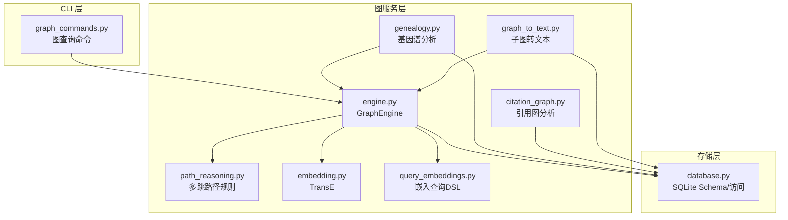
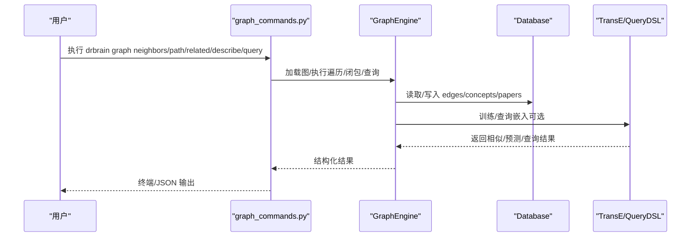
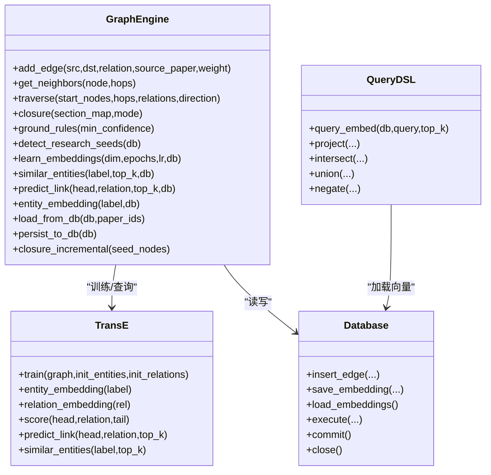

# 图计算服务

<cite>
**本文引用的文件列表**
- [engine.py](file://src/drbrain/graph/engine.py)
- [graph_commands.py](file://src/drbrain/cli/graph_commands.py)
- [graph_to_text.py](file://src/drbrain/services/graph_to_text.py)
- [citation_graph.py](file://src/drbrain/storage/citation_graph.py)
- [genealogy.py](file://src/drbrain/graph/genealogy.py)
- [embedding.py](file://src/drbrain/graph/embedding.py)
- [query_embeddings.py](file://src/drbrain/graph/query_embeddings.py)
- [database.py](file://src/drbrain/storage/database.py)
- [path_reasoning.py](file://src/drbrain/graph/path_reasoning.py)
- [cli-reference.md](file://docs/cli-reference.md)
- [README.md](file://README.md)
- [config.py](file://src/drbrain/config.py)
</cite>

## 目录
1. [简介](#简介)
2. [项目结构](#项目结构)
3. [核心组件](#核心组件)
4. [架构总览](#架构总览)
5. [详细组件分析](#详细组件分析)
6. [依赖关系分析](#依赖关系分析)
7. [性能与内存优化](#性能与内存优化)
8. [故障排查指南](#故障排查指南)
9. [结论](#结论)
10. [附录：API 使用指南](#附录api-使用指南)

## 简介
本文件面向“图计算服务”的使用者与维护者，系统化梳理知识图谱构建、图遍历、规则闭包、基因谱分析（概念演化与论文后代）、文本转换（子图自然语言描述）以及嵌入检索等能力的接口规范与实现要点。文档同时覆盖数据模型、节点与边关系处理、图算法实现、性能优化策略与内存管理建议，并提供查询接口、子图操作与分析工具的使用指南。

## 项目结构
- 图引擎与规则推理：GraphEngine 提供图构建、遍历、规则闭包、TransE 嵌入训练与查询、增量闭包等能力。
- CLI 图命令：提供 neighbors、path、related、describe、query、traverse-from 等直接图查询与分析命令。
- 文本转换：将图路径转换为自然语言描述，支持 LLM 摘要生成。
- 基因谱分析：概念演化树、论文后代追踪、范式转移检测、跨域迁移机会发现。
- 引用图：共享参考、共引、前后向引用与统计。
- 嵌入与检索：TransE 向量训练、投影/交并/否定等复杂查询 DSL。
- 数据库：SQLite Schema 定义与常用 CRUD/统计查询。

图表来源
- [graph_commands.py:1-756](file://src/drbrain/cli/graph_commands.py#L1-L756)
- [engine.py:1-1118](file://src/drbrain/graph/engine.py#L1-L1118)
- [path_reasoning.py:1-212](file://src/drbrain/graph/path_reasoning.py#L1-L212)
- [graph_to_text.py:1-145](file://src/drbrain/services/graph_to_text.py#L1-L145)
- [genealogy.py:1-1001](file://src/drbrain/graph/genealogy.py#L1-L1001)
- [citation_graph.py:1-129](file://src/drbrain/storage/citation_graph.py#L1-L129)
- [embedding.py:1-117](file://src/drbrain/graph/embedding.py#L1-L117)
- [query_embeddings.py:1-226](file://src/drbrain/graph/query_embeddings.py#L1-L226)
- [database.py:1-775](file://src/drbrain/storage/database.py#L1-L775)

章节来源
- [README.md:1-112](file://README.md#L1-L112)
- [cli-reference.md:1-981](file://docs/cli-reference.md#L1-L981)

## 核心组件
- GraphEngine：基于 NetworkX 的内存图，提供节点/边增删、N 跳邻居、BFS 遍历、规则闭包（含对称性检测、传递闭包、路径规则、符号/混合模式）、TransE 嵌入学习与相似度预测、从数据库加载/持久化、增量闭包等。
- 图命令：CLI 子命令 graph neighbors/path/related/describe/query/traverse-from，均通过 GraphEngine 执行图操作与结果展示。
- 子图转文本：将遍历得到的路径序列转换为自然语言描述，并可调用 LLM 生成摘要。
- 基因谱分析：概念演化树（祖先/后代 BFS）、论文后代追踪、范式转移检测（替换/爆炸/跨域入侵）、难度分类与知识前沿报告。
- 引用图：共享参考、共引统计、前后向引用查询与共享引用分析。
- 嵌入与检索：TransE 训练、实体向量查询、投影/交并/否定等 DSL 查询。
- 数据库：Schema 定义、CRUD、索引、迁移、统计信号检测等。

章节来源
- [engine.py:33-1118](file://src/drbrain/graph/engine.py#L33-L1118)
- [graph_commands.py:1-756](file://src/drbrain/cli/graph_commands.py#L1-L756)
- [graph_to_text.py:1-145](file://src/drbrain/services/graph_to_text.py#L1-L145)
- [genealogy.py:1-1001](file://src/drbrain/graph/genealogy.py#L1-L1001)
- [citation_graph.py:1-129](file://src/drbrain/storage/citation_graph.py#L1-L129)
- [embedding.py:1-117](file://src/drbrain/graph/embedding.py#L1-L117)
- [query_embeddings.py:1-226](file://src/drbrain/graph/query_embeddings.py#L1-L226)
- [database.py:1-775](file://src/drbrain/storage/database.py#L1-L775)

## 架构总览
下图展示了 CLI 命令如何驱动图引擎与数据库，以及嵌入模块在检索中的角色。

图表来源
- [graph_commands.py:1-756](file://src/drbrain/cli/graph_commands.py#L1-L756)
- [engine.py:1-1118](file://src/drbrain/graph/engine.py#L1-L1118)
- [database.py:1-775](file://src/drbrain/storage/database.py#L1-L775)
- [embedding.py:1-117](file://src/drbrain/graph/embedding.py#L1-L117)
- [query_embeddings.py:1-226](file://src/drbrain/graph/query_embeddings.py#L1-L226)

## 详细组件分析

### 图引擎 GraphEngine
- 数据结构
  - 使用 NetworkX MultiDiGraph 存储节点与有向边，边属性包含 relation、source_paper、weight、section 等。
  - 内置 TransE 实例缓存，用于嵌入学习与相似度查询。
- 关键方法
  - add_edge：添加带属性的边。
  - get_neighbors：N 跳邻居集合（包含起始节点）。
  - traverse：BFS 遍历，支持关系过滤与方向控制（前向/后向/双向），返回路径信息。
  - closure：规则闭包（符号/混合模式），包括挑战-支持辩论、缺口-解决、间接演进、缺口到辩论、共享作者网络、传递闭包、路径规则、对称性检测等；可结合 section 映射进行置信度衰减与混合模式重加权。
  - ground_rules：基于路径匹配的传递规则“落地”（t-范数）。
  - detect_research_seeds：研究种子检测（停滞问题、未解决缺口、辩论区、技术悬崖、跨域同构、置信度坍缩等）。
  - learn_embeddings/similar_entities/predict_link/entity_embedding/_ensure_embeddings：TransE 嵌入训练、相似实体检索、尾实体预测、向量查询与缓存。
  - load_from_db/persist_to_db：从数据库批量加载/持久化边。
  - closure_incremental：仅对种子节点邻域进行闭包。
- 复杂度与性能
  - 遍历与闭包复杂度与图规模、关系类型数量、规则数量相关；建议使用关系过滤与方向限制降低搜索空间。
  - 增量闭包通过构建 2 跳邻域子图显著减少全图扫描成本。
- 内存管理
  - 图对象在 CLI 命令中使用后及时置空，避免长期持有大图。
  - 嵌入缓存按需加载，支持从数据库恢复。

章节来源
- [engine.py:33-1118](file://src/drbrain/graph/engine.py#L33-L1118)

### 图命令与查询接口
- neighbors：从单个节点出发，按 hops、relation 过滤、direction 控制进行遍历，输出邻居与路径信息。
- path：在无向图上寻找两点间最短路径，回溯原图边方向与关系。
- related：多论文共享分析，支持三种模式：
  - concepts：SQL 交集标签计数与覆盖率。
  - graph：1 跳邻居交集与路径重建。
  - edges：共享关系-目标模式计数。
- describe：围绕中心节点生成子图描述，支持 LLM 摘要。
- query：嵌入式复杂查询（project/intersect/union/negate），需要已训练嵌入。
- traverse-from：从文档树节标题出发，定位概念并进行图遍历。

章节来源
- [graph_commands.py:1-756](file://src/drbrain/cli/graph_commands.py#L1-L756)
- [cli-reference.md:229-318](file://docs/cli-reference.md#L229-L318)

### 子图转文本与自然语言描述
- describe_path：将遍历路径转换为自然语言句子，支持链式连接。
- describe_subgraph：收集邻居实体与关系，构造提示词，调用 LLM 生成段落式描述。

章节来源
- [graph_to_text.py:1-145](file://src/drbrain/services/graph_to_text.py#L1-L145)

### 基因谱分析（概念演化与论文后代）
- evolve_concept：构建概念演化树（祖先/后代 BFS），支持 reroot 与时间信息。
- trace_descendants：追踪论文学术后代（扩展/精炼/应用/挑战/引用）。
- detect_paradigm_shifts：范式转移检测（替换、爆炸、跨域入侵）。
- analyze_frontier：知识前沿综合报告（活跃/陈旧缺口、辩论、范式转移、难度分类）。
- landscape_workspace：工作区领域全景（时间线、缺口、辩论）。

章节来源
- [genealogy.py:1-1001](file://src/drbrain/graph/genealogy.py#L1-L1001)

### 引用图分析
- find_shared_refs：共享参考分析，返回共享计数与状态（是否直连引用）。
- get_citation_counts：引用/被引计数。
- query_citation_graph：查询某论文的引用、被引、共享参考，并附统计。

章节来源
- [citation_graph.py:1-129](file://src/drbrain/storage/citation_graph.py#L1-L129)

### 嵌入与检索
- TransE：三元组 h + r ≈ t 的向量学习，支持训练、相似度、尾实体预测、评分。
- query_embeddings：嵌入查询 DSL（project/intersect/union/negate），支持从数据库加载向量。

章节来源
- [embedding.py:1-117](file://src/drbrain/graph/embedding.py#L1-L117)
- [query_embeddings.py:1-226](file://src/drbrain/graph/query_embeddings.py#L1-L226)

### 数据模型与数据库
- Schema：papers、paper_ids、concepts、arguments、edges、aliases、embeddings、citation_cache、build_stages、research_seeds 等。
- 常用操作：插入/更新/删除、索引、迁移、统计信号检测（新兴/稳定/衰落/争议/复苏）。

章节来源
- [database.py:1-775](file://src/drbrain/storage/database.py#L1-L775)

### 多跳路径规则与传递闭包
- get_builtin_rules：内置多跳路径规则集合。
- apply_path_rules/_match_pattern：在 GraphEngine 上匹配并推断新边。
- enforce_transitive：基于边列表执行传递闭包。

章节来源
- [path_reasoning.py:1-212](file://src/drbrain/graph/path_reasoning.py#L1-L212)
- [engine.py:124-280](file://src/drbrain/graph/engine.py#L124-L280)

## 依赖关系分析

图表来源
- [engine.py:33-1118](file://src/drbrain/graph/engine.py#L33-L1118)
- [embedding.py:1-117](file://src/drbrain/graph/embedding.py#L1-L117)
- [query_embeddings.py:1-226](file://src/drbrain/graph/query_embeddings.py#L1-L226)
- [database.py:1-775](file://src/drbrain/storage/database.py#L1-L775)

## 性能与内存优化
- 遍历与闭包
  - 使用关系过滤与方向限制缩小搜索空间。
  - 对于大规模图，优先使用 closure_incremental，仅针对种子节点邻域进行闭包。
- 嵌入
  - 增量训练：从数据库加载已有向量作为热启动，减少训练轮次。
  - 按需加载：_ensure_embeddings 在缓存为空时从数据库恢复，避免重复训练。
  - top_k 限制：相似度与预测查询使用 top_k 截断，降低排序成本。
- 内存
  - CLI 命令在使用完图后显式置空 graph，释放内存。
  - 大型图建议分批处理与增量闭包，避免一次性加载全图。
- 数据库
  - 合理使用索引（如 edges.relation、concepts.label/type 等）提升查询效率。
  - 批量插入/更新，减少事务开销。

章节来源
- [engine.py:760-786](file://src/drbrain/graph/engine.py#L760-L786)
- [engine.py:742-759](file://src/drbrain/graph/engine.py#L742-L759)
- [engine.py:787-800](file://src/drbrain/graph/engine.py#L787-L800)
- [query_embeddings.py:1-226](file://src/drbrain/graph/query_embeddings.py#L1-L226)
- [database.py:115-123](file://src/drbrain/storage/database.py#L115-L123)

## 故障排查指南
- 嵌入未训练导致查询为空
  - 确认已运行 drbrain embed 或从数据库加载已有嵌入。
  - 参考：similar_entities/predict_link/_ensure_embeddings。
- 节点不存在或无路径
  - neighbors/path 命令会检查节点存在性，不存在则报错。
  - path 命令在无路径或超过最大长度时给出提示。
- 闭包规则未生效
  - 确认关系类型与方向设置正确；必要时使用 closure_incremental 缩小范围。
- 引用图分析异常
  - 确认 citation_cache 是否存在对应条目；检查引用/被引计数逻辑。

章节来源
- [graph_commands.py:20-151](file://src/drbrain/cli/graph_commands.py#L20-L151)
- [graph_commands.py:153-264](file://src/drbrain/cli/graph_commands.py#L153-L264)
- [engine.py:124-139](file://src/drbrain/graph/engine.py#L124-L139)
- [engine.py:742-759](file://src/drbrain/graph/engine.py#L742-L759)

## 结论
本图计算服务以 GraphEngine 为核心，结合规则闭包、TransE 嵌入、基因谱分析与引用图，形成从“图构建—图遍历—规则推理—文本转换—知识前沿”的完整能力闭环。CLI 命令提供了直接可用的查询与分析入口，适合 AI Agent 与研究人员进行符号驱动的知识探索与推理。

## 附录：API 使用指南

### 图构建与基本操作
- 添加边
  - 接口：GraphEngine.add_edge
  - 参数：src、dst、relation、source_paper、weight
  - 用途：向图中添加一条有向边及其属性。
- 加载/持久化
  - 接口：GraphEngine.load_from_db、GraphEngine.persist_to_db
  - 用途：从数据库批量导入/导出边，支持按 paper_ids 过滤。

章节来源
- [engine.py:40-44](file://src/drbrain/graph/engine.py#L40-L44)
- [engine.py:760-786](file://src/drbrain/graph/engine.py#L760-L786)

### 图遍历与查询
- 邻居查询（neighbors）
  - CLI：drbrain graph neighbors <node_label> [--hops] [--relation] [--direction] [--workspace]
  - 行为：BFS 遍历，输出邻居与路径信息，支持 JSON 输出。
- 最短路径（path）
  - CLI：drbrain graph path <src> <dst> [--max-length] [--workspace]
  - 行为：在无向图上找最短路径，回溯原图方向与关系。
- 共享分析（related）
  - CLI：drbrain graph related <paper_id...> --mode concepts|graph|edges --min-shared
  - 行为：SQL 交集/图遍历/边模式计数，支持 JSON 输出。
- 子图描述（describe）
  - CLI：drbrain graph describe <node_label> [--depth] [--workspace]
  - 行为：遍历并生成自然语言描述，可调用 LLM 摘要。
- 嵌入查询（query）
  - CLI：drbrain graph query '<JSON DSL>' --top
  - DSL 类型：project、intersect、union、negate
  - 行为：基于 TransE 向量执行复杂查询。

章节来源
- [graph_commands.py:20-151](file://src/drbrain/cli/graph_commands.py#L20-L151)
- [graph_commands.py:153-264](file://src/drbrain/cli/graph_commands.py#L153-L264)
- [graph_commands.py:266-501](file://src/drbrain/cli/graph_commands.py#L266-L501)
- [graph_commands.py:503-574](file://src/drbrain/cli/graph_commands.py#L503-L574)
- [graph_commands.py:576-621](file://src/drbrain/cli/graph_commands.py#L576-L621)
- [query_embeddings.py:133-226](file://src/drbrain/graph/query_embeddings.py#L133-L226)

### 规则闭包与研究种子
- 规则闭包（closure）
  - CLI：drbrain closure [--mode symbolic|hybrid] [--rule ...] [--workspace] [--ground]
  - 行为：执行符号/混合闭包，支持增量闭包与规则选择。
- 研究种子（seed）
  - CLI：drbrain seed [--workspace]
  - 行为：检测停滞问题、未解决缺口、辩论区、技术悬崖、跨域同构、置信度坍缩等。

章节来源
- [engine.py:124-315](file://src/drbrain/graph/engine.py#L124-L315)
- [engine.py:354-454](file://src/drbrain/graph/engine.py#L354-L454)
- [cli-reference.md:513-526](file://docs/cli-reference.md#L513-L526)
- [cli-reference.md:527-550](file://docs/cli-reference.md#L527-L550)

### 基因谱分析
- 概念演化（evolve）
  - CLI：drbrain evolve <concept> [--direction] [--max-depth] [--mermaid|--stats]
- 论文后代（descendants）
  - CLI：drbrain descendants <paper_id> [--generations] [--mermaid|--sections]
- 知识前沿（frontier）
  - CLI：drbrain frontier
- 难度分类（difficulty）
  - CLI：drbrain difficulty

章节来源
- [cli-reference.md:360-377](file://docs/cli-reference.md#L360-L377)
- [cli-reference.md:379-394](file://docs/cli-reference.md#L379-L394)
- [cli-reference.md:472-483](file://docs/cli-reference.md#L472-L483)
- [cli-reference.md:597-611](file://docs/cli-reference.md#L597-L611)

### 引用图分析
- 引用查询（citations）
  - CLI：drbrain citations <paper_id> [--type] [--limit] [--sort] [--workspace]
- 共享参考（shared-refs）
  - 行为：返回共享参考论文、直接引用状态与共享论文清单。

章节来源
- [cli-reference.md:324-340](file://docs/cli-reference.md#L324-L340)
- [citation_graph.py:74-129](file://src/drbrain/storage/citation_graph.py#L74-L129)

### 嵌入训练与检索
- 训练嵌入（embed）
  - CLI：drbrain embed [--dim] [--epochs] [--retrain] [--tree]
- 嵌入查询（graph query）
  - CLI：drbrain graph query '<JSON DSL>' --top
  - 行为：project/intersect/union/negate 四类算子。

章节来源
- [cli-reference.md:566-587](file://docs/cli-reference.md#L566-L587)
- [cli-reference.md:295-309](file://docs/cli-reference.md#L295-L309)
- [query_embeddings.py:133-226](file://src/drbrain/graph/query_embeddings.py#L133-L226)

### 数据库与配置
- 配置加载
  - Config.from_yaml 支持本地覆盖与环境变量解析。
- Schema 与索引
  - 常用表：papers、concepts、edges、arguments、embeddings、citation_cache 等；常见索引：edges.relation、concepts.label/type 等。

章节来源
- [config.py:195-292](file://src/drbrain/config.py#L195-L292)
- [database.py:10-156](file://src/drbrain/storage/database.py#L10-L156)
- [database.py:115-123](file://src/drbrain/storage/database.py#L115-L123)