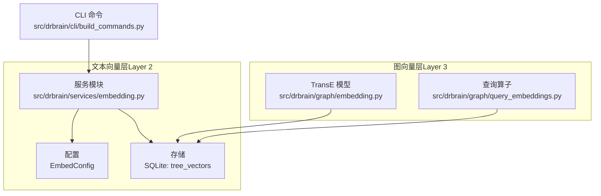
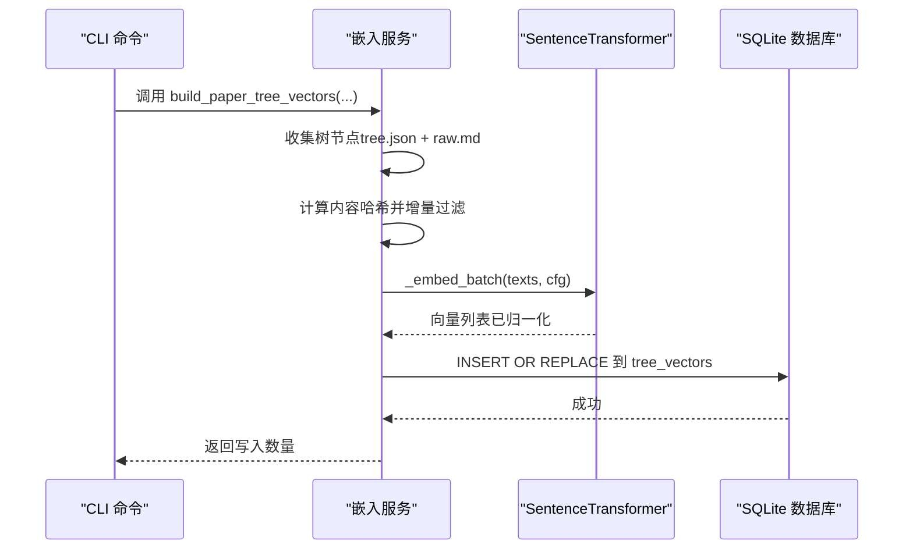
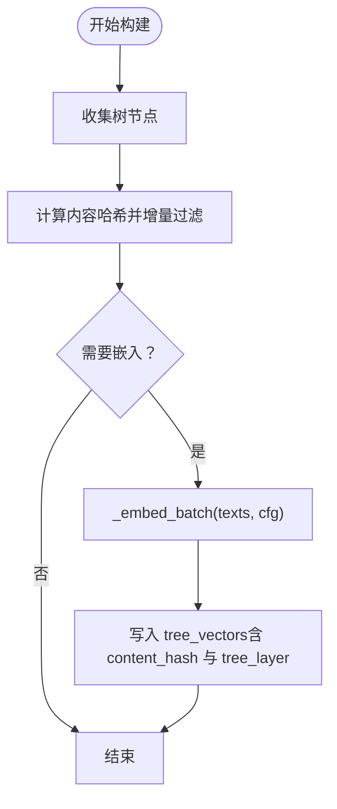
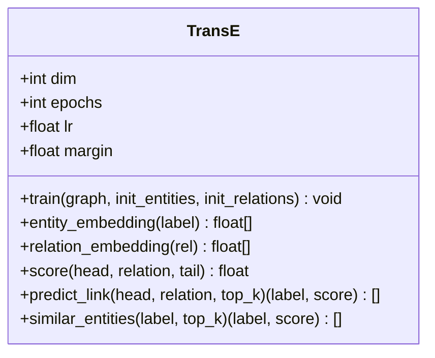
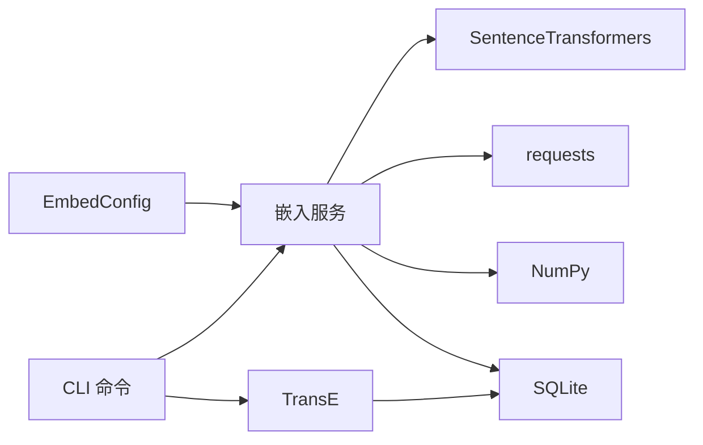

# 嵌入服务

<cite>
**本文引用的文件**
- [embedding.py](file://src/drbrain/services/embedding.py)
- [embedding.py（图嵌入）](file://src/drbrain/graph/embedding.py)
- [query_embeddings.py](file://src/drbrain/graph/query_embeddings.py)
- [embedding.md](file://docs/embedding.md)
- [config.py](file://src/drbrain/config.py)
- [database.py](file://src/drbrain/storage/database.py)
- [build_commands.py](file://src/drbrain/cli/build_commands.py)
- [test_services_embedding.py](file://tests/test_services_embedding.py)
- [test_embedding.py](file://tests/test_embedding.py)
- [architecture.md](file://docs/architecture.md)
</cite>

## 目录
1. [简介](#简介)
2. [项目结构](#项目结构)
3. [核心组件](#核心组件)
4. [架构总览](#架构总览)
5. [详细组件分析](#详细组件分析)
6. [依赖分析](#依赖分析)
7. [性能考虑](#性能考虑)
8. [故障排除指南](#故障排除指南)
9. [结论](#结论)
10. [附录](#附录)

## 简介
本文件为嵌入服务的详细 API 文档，覆盖以下方面：
- 向量嵌入生成：本地模型与 OpenAI 兼容 API 的批处理编码、增量更新与存储。
- 维度降维与归一化：统一使用单位向量进行余弦相似度检索。
- 嵌入管理：SQLite 存储、内容哈希校验、层标识（PageIndex/RAPTOR）。
- 模型配置：提供者选择、设备与下载源、批大小与重试策略。
- 批处理与缓存：GPU 内存档位自适应批大小、GPU 配置档缓存。
- 嵌入质量评估与相似度计算：后过滤阈值、维度一致性检查。
- 嵌入更新策略：基于内容哈希的增量构建、失败回退与部分结果返回。
- 性能优化与故障排除：GPU 自适应批大小、网络错误重试、常见问题定位。

## 项目结构
嵌入服务由三层组成：
- 文本向量层（Layer 2）：树节点文本嵌入（PageIndex 叶子节点 + RAPTOR 递归摘要），存储于 SQLite 的 tree_vectors 表。
- 图向量层（Layer 3）：TransE 实体/关系嵌入，用于知识图谱推理。
- 查询扩展层：基于向量的投影、交集、并集、否定等复合查询操作。

**图表来源**
- [embedding.py:598-704](file://src/drbrain/services/embedding.py#L598-L704)
- [embedding.py（图嵌入）:8-117](file://src/drbrain/graph/embedding.py#L8-L117)
- [query_embeddings.py:133-226](file://src/drbrain/graph/query_embeddings.py#L133-L226)
- [build_commands.py:280-361](file://src/drbrain/cli/build_commands.py#L280-L361)

**章节来源**
- [embedding.py:1-10](file://src/drbrain/services/embedding.py#L1-L10)
- [embedding.md:1-188](file://docs/embedding.md#L1-L188)
- [architecture.md:239-270](file://docs/architecture.md#L239-L270)

## 核心组件
- 文本嵌入服务（Layer 2）
  - 提供者路由：local/openai-compat/none
  - 模型加载与缓存：模块级缓存、ModelScope/HuggingFace 下载路径解析
  - GPU 自适应批大小：内存档位探测、安全系数、上限约束
  - 增量构建：内容哈希检测未变更节点，跳过重复嵌入
  - 存储：SQLite BLOB 存储向量，带层标识与内容哈希
  - 搜索：余弦相似度排序，后过滤与维度校验
- 图嵌入（Layer 3）
  - TransE 训练：实体/关系向量学习，支持增量训练保留已有实体
  - 查询算子：投影、交集、并集、否定，基于向量运算
- 配置
  - EmbedConfig：provider、model、device、source、hf_endpoint、api_base、api_key、batch_size、top_k

**章节来源**
- [embedding.py:42-786](file://src/drbrain/services/embedding.py#L42-L786)
- [embedding.py（图嵌入）:8-117](file://src/drbrain/graph/embedding.py#L8-L117)
- [query_embeddings.py:17-226](file://src/drbrain/graph/query_embeddings.py#L17-L226)
- [config.py:114-141](file://src/drbrain/config.py#L114-L141)

## 架构总览
文本嵌入服务通过 CLI 触发，按论文目录批量构建树节点向量，并写入 SQLite；搜索时对查询向量与存储向量做余弦相似度比较，返回带层标识的结果。

**图表来源**
- [build_commands.py:280-329](file://src/drbrain/cli/build_commands.py#L280-L329)
- [embedding.py:598-704](file://src/drbrain/services/embedding.py#L598-L704)
- [database.py:84-90](file://src/drbrain/storage/database.py#L84-L90)

## 详细组件分析

### 文本嵌入服务（Layer 2）
- 提供者与路由
  - provider: local/openai-compat/none
  - openai-compat：发送 POST /v1/embeddings，分块、指数退避重试、首块失败抛异常、后续块失败警告并返回已成功部分
- 模型加载与缓存
  - 模块级缓存键：(model_name, cache_dir, device)
  - ModelScope/HuggingFace 源解析，优先本地缓存命中
- GPU 自适应批大小
  - 一次性 GPU 内存档位探测，记录峰值增量
  - 基于可用显存与样本增量内存估算批大小，带安全系数与上限
- 增量构建
  - 使用内容哈希对比，仅对变更节点重新嵌入
  - 写入时同时保存 content_hash 与 tree_layer
- 存储与查询
  - 向量以 BLOB 存储，按维度一致性检查
  - 搜索返回 node_id、paper_id、score、tree_layer，并进行后过滤

**图表来源**
- [embedding.py:598-667](file://src/drbrain/services/embedding.py#L598-L667)

**章节来源**
- [embedding.py:42-786](file://src/drbrain/services/embedding.py#L42-L786)
- [database.py:84-90](file://src/drbrain/storage/database.py#L84-L90)

### 图嵌入与查询（Layer 3）
- TransE
  - 训练：随机初始化实体/关系向量，负采样，按边损失更新
  - 推理：链接预测、相似实体查找、三元组评分
- 复合查询算子
  - 投影：h + r ≈ t，返回最相似尾实体
  - 交集：多向量质心，返回最接近的实体
  - 并集：合并候选集合，取最高分
  - 否定：返回与给定向量最不相似的实体

**图表来源**
- [embedding.py（图嵌入）:8-117](file://src/drbrain/graph/embedding.py#L8-L117)

**章节来源**
- [embedding.py（图嵌入）:8-117](file://src/drbrain/graph/embedding.py#L8-L117)
- [query_embeddings.py:133-226](file://src/drbrain/graph/query_embeddings.py#L133-L226)

### 配置与 CLI
- 配置项（EmbedConfig）
  - provider、model、cache_dir、device、top_k、source、hf_endpoint、api_base、api_key、batch_size
- CLI 命令
  - embed --tree：调用 build_paper_tree_vectors，遍历论文目录构建向量与 RAPTOR 摘要
  - embed（无参数）：训练 TransE 图嵌入

**章节来源**
- [config.py:114-141](file://src/drbrain/config.py#L114-L141)
- [build_commands.py:280-361](file://src/drbrain/cli/build_commands.py#L280-L361)

## 依赖分析
- 组件耦合
  - 嵌入服务依赖配置与数据库；在 CLI 中被调用
  - 图嵌入独立于文本向量层，但共享数据库存储
- 外部依赖
  - SentenceTransformers（本地）、requests（openai-compat）
  - PyTorch（GPU 检测与内存档位）
  - NumPy（向量运算）

**图表来源**
- [embedding.py:155-209](file://src/drbrain/services/embedding.py#L155-L209)
- [build_commands.py:280-361](file://src/drbrain/cli/build_commands.py#L280-L361)
- [embedding.py（图嵌入）:8-117](file://src/drbrain/graph/embedding.py#L8-L117)

**章节来源**
- [embedding.py:155-209](file://src/drbrain/services/embedding.py#L155-L209)
- [build_commands.py:280-361](file://src/drbrain/cli/build_commands.py#L280-L361)

## 性能考虑
- GPU 自适应批大小
  - 通过一次性的内存档位探测，结合安全系数与上限，避免 OOM
  - 对超出档位范围的序列长度采用二次外推估算
- 本地模型缓存
  - 模块级缓存避免重复加载；ModelScope/HuggingFace 优先本地缓存
- 批处理与网络重试
  - openai-compat 分块提交，首块失败立即抛出，后续块失败记录警告并返回已成功部分
- 存储与索引
  - SQLite WAL 模式提升并发读写；tree_vectors 为主表，无额外向量数据库

**章节来源**
- [embedding.py:215-412](file://src/drbrain/services/embedding.py#L215-L412)
- [embedding.py:441-498](file://src/drbrain/services/embedding.py#L441-L498)
- [embedding.md:54-80](file://docs/embedding.md#L54-L80)

## 故障排除指南
- “首次运行模型找不到”
  - 检查网络与 source/hf_endpoint 设置；首次下载约 1.2 GB
- “CUDA 显存不足”
  - 设置 device: cpu 或降低 batch_size；下次运行会自动重新档位探测
- “openai-compat 返回空”
  - 确认 api_base 以 /v1 结尾；验证端点可 GET {api_base}/models
- “搜索出现维度不一致”
  - 切换嵌入模型后需重新运行 drbrain embed --tree 以重建所有向量

**章节来源**
- [embedding.md:172-188](file://docs/embedding.md#L172-L188)

## 结论
嵌入服务通过“文本向量层 + 图向量层”的双层设计，在保证检索效率的同时提供可扩展的知识图谱推理能力。其关键特性包括：
- 灵活的提供者选择与云端兼容性
- 增量构建与 GPU 自适应批大小
- 统一的 SQLite 存储与清晰的层标识
- 完备的测试覆盖与故障排除指引

## 附录

### API 规范（函数级）
- build_tree_vectors(db_path, paper_dir, cfg) -> int
  - 功能：为单篇论文的树节点生成向量并写入 SQLite
  - 输入：数据库路径、论文目录、嵌入配置
  - 输出：写入条数
  - 关键行为：增量更新、内容哈希去重、写入 content_hash 与 tree_layer
- build_paper_tree_vectors(paper_dir, db_path, embed_cfg, llm_models) -> int
  - 功能：组合 PageIndex 与 RAPTOR 的完整构建流程
  - 输入：论文目录、数据库路径、嵌入配置、LLM 模型列表
  - 输出：总向量与摘要数量
- search_tree(query, db_path, top_k, cfg) -> list[dict]
  - 功能：对 tree_vectors 进行余弦相似度检索
  - 输入：查询文本、数据库路径、返回条数、嵌入配置
  - 输出：包含 node_id、paper_id、score、tree_layer 的结果列表
  - 关键行为：维度一致性检查、后过滤、排序截断

**章节来源**
- [embedding.py:598-786](file://src/drbrain/services/embedding.py#L598-L786)
- [database.py:84-90](file://src/drbrain/storage/database.py#L84-L90)

### 配置参考（EmbedConfig）
- provider: "local" | "openai-compat" | "none"
- model: 模型名称或 HuggingFace ID
- cache_dir: 本地缓存目录
- device: "auto" | "cpu" | "cuda"
- top_k: 默认返回条数
- source: "modelscope" | "huggingface"
- hf_endpoint: HuggingFace 镜像地址
- api_base: OpenAI 兼容 API 基础地址
- api_key: API 密钥
- batch_size: 批大小

**章节来源**
- [config.py:114-141](file://src/drbrain/config.py#L114-L141)

### 测试要点
- GPU 自适应批大小与内存估计
- openai-compat 分块请求与重试策略
- 后过滤阈值与空 node_id 处理
- TransE 训练收敛与增量训练保持稳定性

**章节来源**
- [test_services_embedding.py:1-451](file://tests/test_services_embedding.py#L1-L451)
- [test_embedding.py:1-100](file://tests/test_embedding.py#L1-L100)