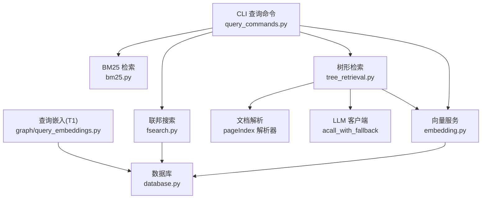
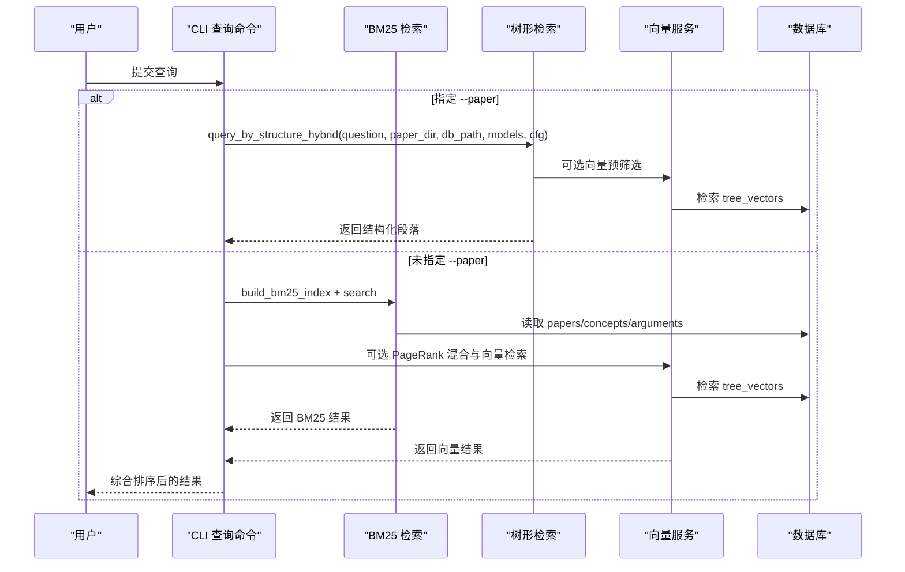
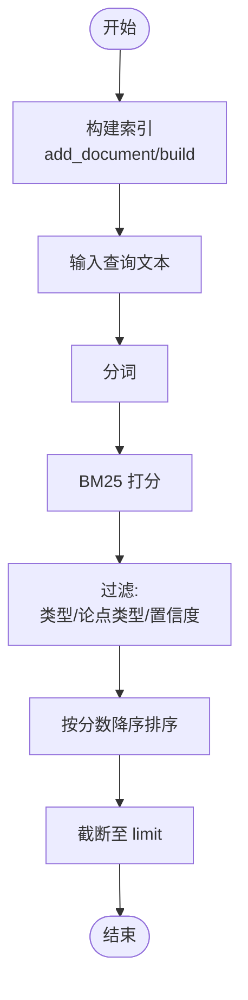
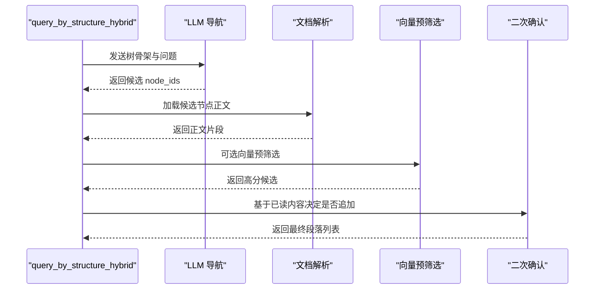
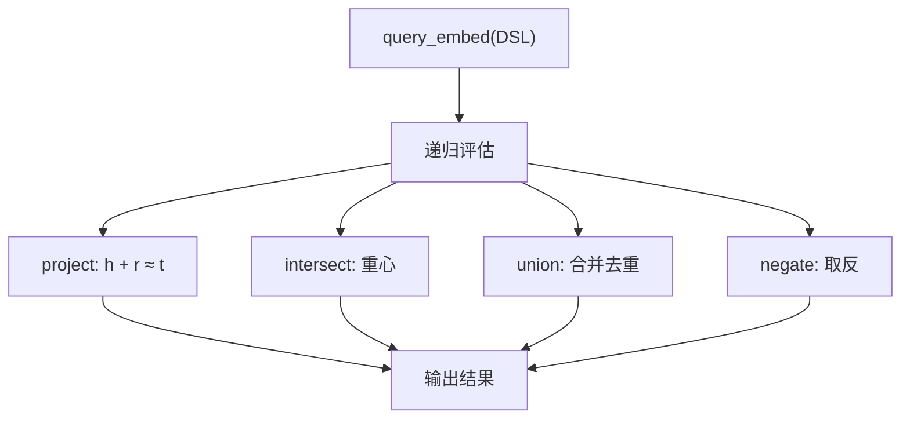
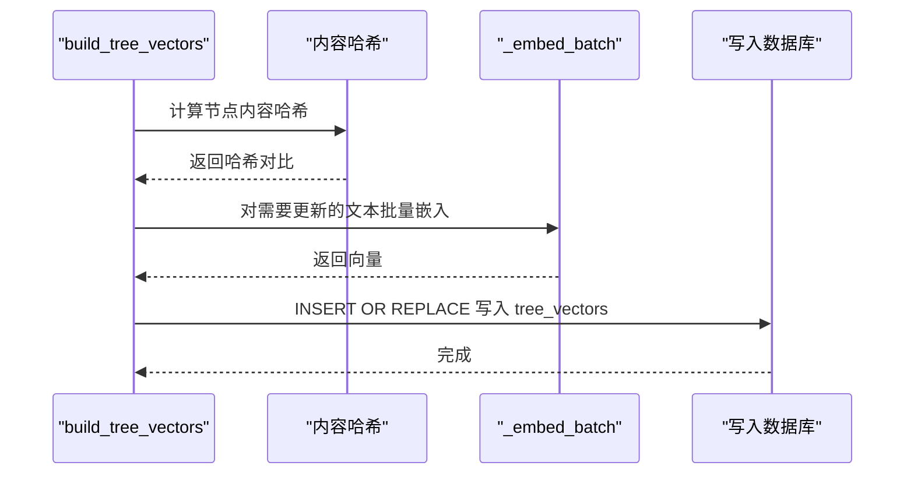
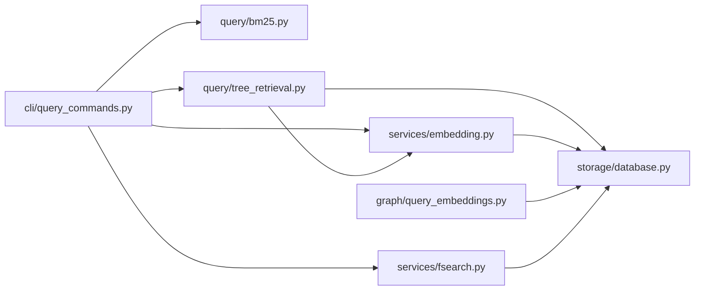

# 检索服务

<cite>
**本文引用的文件**
- [src/drbrain/query/bm25.py](file://src/drbrain/query/bm25.py)
- [src/drbrain/query/tree_retrieval.py](file://src/drbrain/query/tree_retrieval.py)
- [src/drbrain/graph/query_embeddings.py](file://src/drbrain/graph/query_embeddings.py)
- [src/drbrain/services/embedding.py](file://src/drbrain/services/embedding.py)
- [src/drbrain/services/fsearch.py](file://src/drbrain/services/fsearch.py)
- [src/drbrain/cli/query_commands.py](file://src/drbrain/cli/query_commands.py)
- [src/drbrain/storage/database.py](file://src/drbrain/storage/database.py)
- [tests/test_bm25.py](file://tests/test_bm25.py)
- [tests/test_tree_retrieval.py](file://tests/test_tree_retrieval.py)
- [tests/test_query_embeddings.py](file://tests/test_query_embeddings.py)
</cite>

## 目录
1. [简介](#简介)
2. [项目结构](#项目结构)
3. [核心组件](#核心组件)
4. [架构总览](#架构总览)
5. [详细组件分析](#详细组件分析)
6. [依赖分析](#依赖分析)
7. [性能考虑](#性能考虑)
8. [故障排查指南](#故障排查指南)
9. [结论](#结论)
10. [附录](#附录)

## 简介
本文件为检索服务的全面 API 文档，覆盖以下能力与接口：
- 全文检索：基于 BM25 的概念与论点检索，支持类型过滤、置信度阈值、时间范围与结果限制。
- 树形检索：基于 PageIndex 树的结构化检索，结合 LLM 进行分层导航与二次确认，支持向量预筛选与混合模式。
- 查询嵌入：基于 TransE 的复杂查询操作（投影、交集、并集、取反），支持 DSL 查询表达式。
- 多模态检索：向量检索与树节点向量存储，支持跨论文检索与 RAPTOR 层级遍历。
- 排序与融合：BM25 与向量检索的加权融合、RRF 融合；BM25 参数可调；置信度与年份过滤。
- 性能优化：向量化批处理自适应、GPU 内存档位估算、增量更新、索引重建；并发通过异步 LLM 调用实现。
- 缓存策略：模型与 GPU 配置缓存、内容哈希增量更新、数据库 WAL 模式与索引。
- 并发处理：CLI 查询命令中对图遍历与 LLM 调用采用异步与轻量内存管理。

## 项目结构
检索服务主要由以下模块组成：
- 查询入口与 CLI：命令行查询、统计、索引重建等。
- BM25 全文检索：构建与查询、过滤与排序。
- 树形检索：结构化导航、LLM 交互、向量预筛选、层级遍历与回退。
- 查询嵌入：TransE 操作与 DSL 查询执行。
- 向量服务：本地/远端嵌入、批量编码、GPU 自适应批大小、树节点向量构建与检索。
- 联邦搜索：本地库 + arXiv 联合检索与去重标注。
- 数据库：Schema 定义与表结构，包含 papers、concepts、arguments、edges、tree_vectors、tree_summaries 等。

图表来源
- [src/drbrain/cli/query_commands.py:283-631](file://src/drbrain/cli/query_commands.py#L283-L631)
- [src/drbrain/query/bm25.py:17-135](file://src/drbrain/query/bm25.py#L17-L135)
- [src/drbrain/query/tree_retrieval.py:214-800](file://src/drbrain/query/tree_retrieval.py#L214-L800)
- [src/drbrain/services/embedding.py:710-786](file://src/drbrain/services/embedding.py#L710-L786)
- [src/drbrain/services/fsearch.py:125-178](file://src/drbrain/services/fsearch.py#L125-L178)
- [src/drbrain/storage/database.py:10-156](file://src/drbrain/storage/database.py#L10-L156)
- [src/drbrain/graph/query_embeddings.py:133-226](file://src/drbrain/graph/query_embeddings.py#L133-L226)

章节来源
- [src/drbrain/cli/query_commands.py:283-631](file://src/drbrain/cli/query_commands.py#L283-L631)
- [src/drbrain/storage/database.py:10-156](file://src/drbrain/storage/database.py#L10-L156)

## 核心组件
- BM25Search：全文检索构建与查询，支持 k1、b 参数、类型过滤、论点类型过滤、最小置信度过滤、结果限制与降序排序。
- query_by_structure_hybrid：树形检索主流程，先 LLM 导航选择候选，再按需加载正文，支持向量预筛选与二次确认。
- tree_traversal_search：层级遍历检索，从 RAPTOR 根层向下剪枝，最终在 PageIndex 叶层进行向量匹配，不足时回退到折叠树检索。
- query_embed：TransE 嵌入查询 DSL，支持 project、intersect、union、negate 四类操作。
- search_tree：树节点向量检索，返回节点 ID、论文 ID、分数与层级。
- search_arxiv/search_local：联邦搜索的外部与本地检索模块。

章节来源
- [src/drbrain/query/bm25.py:17-135](file://src/drbrain/query/bm25.py#L17-L135)
- [src/drbrain/query/tree_retrieval.py:741-800](file://src/drbrain/query/tree_retrieval.py#L741-L800)
- [src/drbrain/graph/query_embeddings.py:133-226](file://src/drbrain/graph/query_embeddings.py#L133-L226)
- [src/drbrain/services/embedding.py:710-786](file://src/drbrain/services/embedding.py#L710-L786)
- [src/drbrain/services/fsearch.py:125-178](file://src/drbrain/services/fsearch.py#L125-L178)

## 架构总览
检索服务采用“多路径 + 多模态”的混合架构：
- 文本路径：BM25 全文检索，适合概念与论点的快速召回。
- 结构路径：树形检索，利用文档树骨架与 LLM 导航，减少上下文开销，提升定位精度。
- 向量路径：树节点与 RAPTOR 摘要向量检索，支持跨层遍历与折叠检索，提高语义召回质量。
- 复合路径：BM25 与向量检索的加权融合与 RRF 融合，提升综合排序效果。
- 外部路径：arXiv 联邦搜索，结合本地库去重标注。

图表来源
- [src/drbrain/cli/query_commands.py:283-631](file://src/drbrain/cli/query_commands.py#L283-L631)
- [src/drbrain/query/bm25.py:92-135](file://src/drbrain/query/bm25.py#L92-L135)
- [src/drbrain/query/tree_retrieval.py:741-800](file://src/drbrain/query/tree_retrieval.py#L741-L800)
- [src/drbrain/services/embedding.py:710-786](file://src/drbrain/services/embedding.py#L710-L786)

## 详细组件分析

### BM25 检索接口
- 构建索引
  - 输入：数据库连接、k1、b 参数。
  - 行为：从 papers、concepts、arguments 中收集文本，构建倒排索引。
  - 输出：BM25Search 实例。
- 搜索
  - 输入：查询文本、类型过滤、论点类型过滤、结果上限、最小置信度。
  - 行为：分词、BM25 打分、过滤、排序、截断。
  - 输出：按分数降序的结果列表，包含 label、type、local_id、year、confidence、score 等字段。

图表来源
- [src/drbrain/query/bm25.py:25-91](file://src/drbrain/query/bm25.py#L25-L91)

章节来源
- [src/drbrain/query/bm25.py:17-135](file://src/drbrain/query/bm25.py#L17-L135)
- [tests/test_bm25.py:10-207](file://tests/test_bm25.py#L10-L207)

### 树形检索接口
- query_by_structure_hybrid
  - 输入：问题、论文目录、数据库路径、LLM 模型列表、嵌入配置、top_k。
  - 行为：根据树骨架长度决定是否采用分层导航；LLM 选择候选节点；按需加载正文；二次确认阶段决定是否追加更多节点。
  - 输出：结构化段落列表（node_id、title、content、source）。
- tree_traversal_search
  - 输入：查询、数据库路径、每层保留数、最低结果数、嵌入配置。
  - 行为：从 RAPTOR 最高层开始，逐层剪枝，最终在 PageIndex 叶层进行向量匹配；若结果不足则回退到折叠树检索。
  - 输出：按分数降序的节点列表（node_id、paper_id、score、tree_layer）。
- _hybrid_score
  - 输入：BM25 结果、向量结果、BM25 字段名、权重 alpha。
  - 行为：归一化 BM25 分数与向量分数，加权求和，输出合并后的排序列表。
- _rrf_score
  - 输入：多个排序列表、融合参数 k。
  - 行为：RRF 融合，输出按倒数排名融合得分排序的列表。

图表来源
- [src/drbrain/query/tree_retrieval.py:741-800](file://src/drbrain/query/tree_retrieval.py#L741-L800)

章节来源
- [src/drbrain/query/tree_retrieval.py:214-800](file://src/drbrain/query/tree_retrieval.py#L214-L800)
- [tests/test_tree_retrieval.py:106-184](file://tests/test_tree_retrieval.py#L106-L184)

### 查询嵌入接口
- project(entity, relation, entity_vectors, top_k)
  - 输入：头实体向量、关系向量、实体向量集合、返回数量。
  - 行为：在 TransE 空间中计算 target = head + relation，返回最相似实体。
- intersect(vecs, entity_vectors, top_k)
  - 输入：向量列表、实体向量集合、返回数量。
  - 行为：计算向量均值作为中心，返回最接近的实体。
- union(candidates_list, top_k)
  - 输入：多个候选列表、返回数量。
  - 行为：合并候选并保留最高分数。
- negate(entity_vec, entity_vectors, top_k)
  - 输入：目标向量、实体向量集合、返回数量。
  - 行为：返回与目标向量最不相似的实体（分数经变换以保证直观排序）。
- query_embed(db, query, top_k)
  - 输入：数据库实例、DSL 查询、返回数量。
  - 行为：递归解析并执行 DSL，返回按分数降序的结果列表。

图表来源
- [src/drbrain/graph/query_embeddings.py:133-226](file://src/drbrain/graph/query_embeddings.py#L133-L226)

章节来源
- [src/drbrain/graph/query_embeddings.py:17-226](file://src/drbrain/graph/query_embeddings.py#L17-L226)
- [tests/test_query_embeddings.py:143-256](file://tests/test_query_embeddings.py#L143-L256)

### 向量服务接口
- search_tree(query, db_path, top_k, cfg)
  - 输入：查询文本、数据库路径、返回数量、嵌入配置。
  - 行为：对 tree_vectors 表执行向量检索，返回节点 ID、论文 ID、分数与层级，并进行后处理过滤。
- build_tree_vectors(paper_dir, db_path, cfg)
  - 输入：论文目录、数据库路径、嵌入配置。
  - 行为：收集树节点文本，计算内容哈希，增量更新未变更节点，批量嵌入并写入数据库。
- _embed_batch(texts, cfg)
  - 输入：文本列表、嵌入配置。
  - 行为：根据 provider 选择本地或远端嵌入，自动批大小适配 GPU 内存，返回向量列表。
- _compute_batch_size(est_tokens, profile, safety_factor)
  - 输入：估计最大 token 数、GPU 内存档位、安全系数。
  - 行为：基于档位数据估算单样本内存占用并计算最优批大小。

图表来源
- [src/drbrain/services/embedding.py:598-704](file://src/drbrain/services/embedding.py#L598-L704)

章节来源
- [src/drbrain/services/embedding.py:710-786](file://src/drbrain/services/embedding.py#L710-L786)
- [src/drbrain/services/embedding.py:598-704](file://src/drbrain/services/embedding.py#L598-L704)

### 联邦搜索接口
- search_local(db_path, query, limit)
  - 输入：数据库路径、查询字符串、最大结果数。
  - 行为：在本地库中按标题/概念标签/论点标签进行模糊匹配，按年份降序返回。
- search_arxiv(query, max_results)
  - 输入：查询字符串、最大结果数。
  - 行为：调用 arXiv Atom API，解析条目并标准化字段。
- _merge_with_local_status(arxiv_results, in_lib_dois, in_lib_arxiv_ids)
  - 输入：arXiv 结果、本地库 DOI 集、本地库 arXiv ID 集。
  - 行为：基于 DOI 与 arXiv ID 去重，添加 ingested 标记。

章节来源
- [src/drbrain/services/fsearch.py:125-178](file://src/drbrain/services/fsearch.py#L125-L178)

## 依赖分析
- 组件耦合
  - CLI 查询命令依赖 BM25、树形检索与向量服务，形成“文本/结构/向量”三通道。
  - 树形检索依赖向量服务与文档解析器，同时通过 LLM 客户端进行交互。
  - 查询嵌入依赖数据库中的实体与关系向量。
  - 联邦搜索依赖本地数据库与外部 arXiv API。
- 外部依赖
  - rank_bm25：BM25 打分。
  - SentenceTransformers：本地嵌入模型。
  - requests：远端嵌入 API。
  - sqlite3：数据库访问。
  - numpy：向量运算与相似度计算。
- 循环依赖
  - 未发现循环导入；模块职责清晰，接口边界明确。

图表来源
- [src/drbrain/cli/query_commands.py:283-631](file://src/drbrain/cli/query_commands.py#L283-L631)
- [src/drbrain/query/bm25.py:17-135](file://src/drbrain/query/bm25.py#L17-L135)
- [src/drbrain/query/tree_retrieval.py:214-800](file://src/drbrain/query/tree_retrieval.py#L214-L800)
- [src/drbrain/services/embedding.py:710-786](file://src/drbrain/services/embedding.py#L710-L786)
- [src/drbrain/services/fsearch.py:125-178](file://src/drbrain/services/fsearch.py#L125-L178)
- [src/drbrain/graph/query_embeddings.py:133-226](file://src/drbrain/graph/query_embeddings.py#L133-L226)
- [src/drbrain/storage/database.py:10-156](file://src/drbrain/storage/database.py#L10-L156)

## 性能考虑
- 向量批处理自适应
  - 基于 GPU 内存档位估算单样本增量内存，动态计算最优批大小，避免 OOM。
- 增量更新
  - 通过内容哈希判断树节点文本是否变化，仅对变更节点重新嵌入，降低写入成本。
- 索引与排序
  - BM25 使用分词与打分，过滤后再排序，减少无效比较。
  - 向量检索采用 cos 相似度，已归一化向量可直接点积。
- 并发与资源
  - 树形检索通过异步 LLM 调用与按需加载正文，减少一次性上下文压力。
  - 图遍历在 RAPTOR 层间剪枝，显著降低比较次数。
- 存储与 IO
  - 数据库存储向量为 float32 原生二进制，便于高效读取与相似度计算。
  - 使用 WAL 模式提升并发读写稳定性。

[本节为通用性能建议，无需特定文件引用]

## 故障排查指南
- BM25 检索无结果
  - 检查索引是否已构建（空数据库或未重建索引）。
  - 确认查询词是否被正确分词，必要时调整 k1、b 参数。
  - 检查类型/置信度/年份过滤条件是否过于严格。
- 树形检索无结果
  - 确认 paper 目录下存在 tree.json 与 raw.md。
  - 检查 LLM 返回是否为空或格式异常。
  - 若启用向量预筛选，确认 provider 非 none 且数据库中存在 tree_vectors。
- 向量检索无结果
  - 确认 provider 非 none，且数据库中存在 tree_vectors。
  - 检查维度不匹配日志，确保嵌入维度一致。
- 联邦搜索失败
  - 检查网络连通性与 arXiv API 可达性。
  - 确认本地库去重逻辑所需表存在且有数据。

章节来源
- [src/drbrain/cli/query_commands.py:328-401](file://src/drbrain/cli/query_commands.py#L328-L401)
- [src/drbrain/query/tree_retrieval.py:214-380](file://src/drbrain/query/tree_retrieval.py#L214-L380)
- [src/drbrain/services/embedding.py:710-786](file://src/drbrain/services/embedding.py#L710-L786)
- [src/drbrain/services/fsearch.py:32-95](file://src/drbrain/services/fsearch.py#L32-L95)

## 结论
检索服务通过“文本、结构、向量”三位一体的设计，兼顾了召回速度与定位精度。BM25 提供快速的全文召回，树形检索结合 LLM 与向量预筛选实现精准定位，查询嵌入支持复杂语义推理。通过增量更新、GPU 自适应批处理与层级遍历剪枝，系统在大规模文档场景下仍具备良好性能与可扩展性。

[本节为总结性内容，无需特定文件引用]

## 附录

### API 规范速查
- BM25
  - 构建：build_bm25_index(db, k1=1.5, b=0.75)
  - 查询：BM25Search.search(query, type_filter, arg_type_filter, limit, min_confidence)
- 树形检索
  - 主流程：query_by_structure_hybrid(question, paper_dir, db_path, models, cfg, top_k)
  - 层级遍历：tree_traversal_search(query, db_path, top_k, min_results, cfg)
  - 向量检索：search_tree(query, db_path, top_k, cfg)
  - 融合：_hybrid_score(bm25_results, vector_results, bm25_key, alpha)
  - RRF：_rrf_score(ranked_lists, k)
- 查询嵌入
  - DSL：query_embed(db, query, top_k)
  - 操作：project, intersect, union, negate
- 联邦搜索
  - 本地：search_local(db_path, query, limit)
  - 外部：search_arxiv(query, max_results)
  - 合并：_merge_with_local_status(arxiv_results, in_lib_dois, in_lib_arxiv_ids)

章节来源
- [src/drbrain/query/bm25.py:92-135](file://src/drbrain/query/bm25.py#L92-L135)
- [src/drbrain/query/tree_retrieval.py:741-800](file://src/drbrain/query/tree_retrieval.py#L741-L800)
- [src/drbrain/graph/query_embeddings.py:133-226](file://src/drbrain/graph/query_embeddings.py#L133-L226)
- [src/drbrain/services/fsearch.py:125-178](file://src/drbrain/services/fsearch.py#L125-L178)