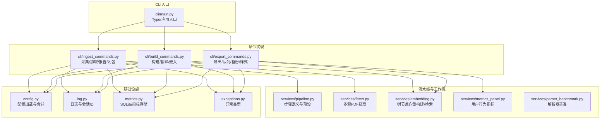
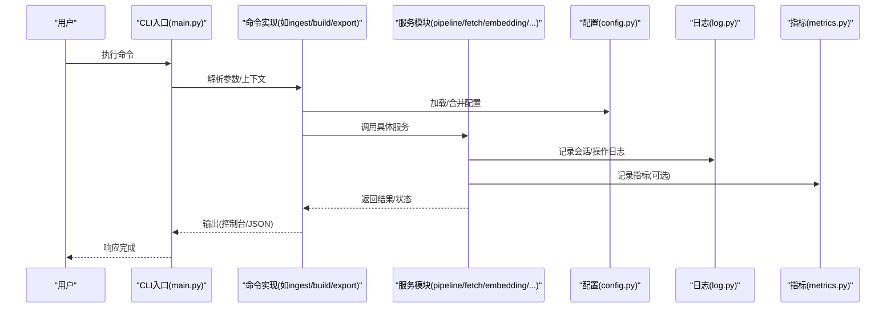
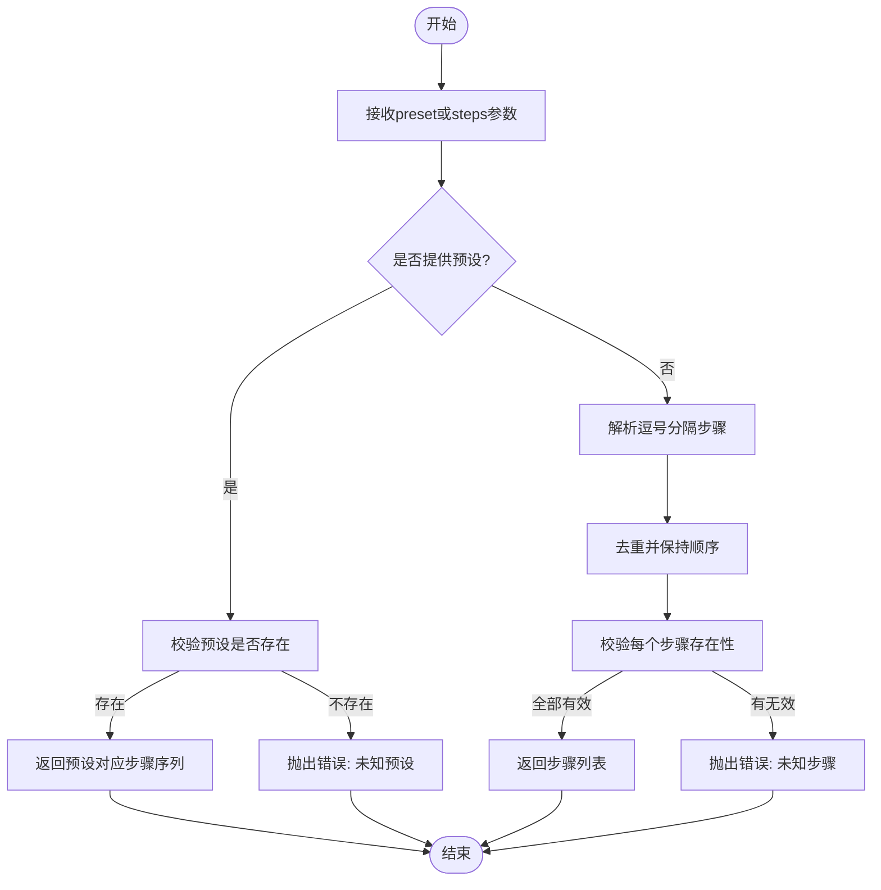
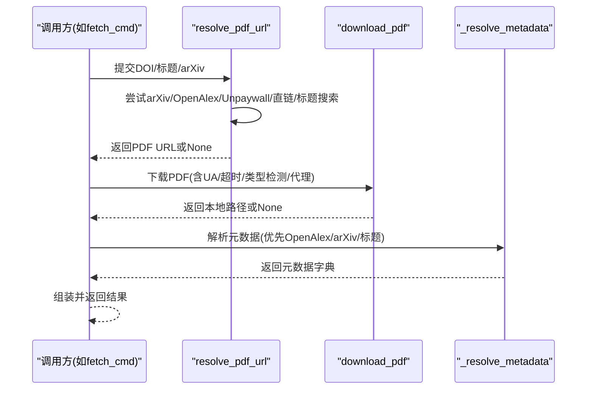
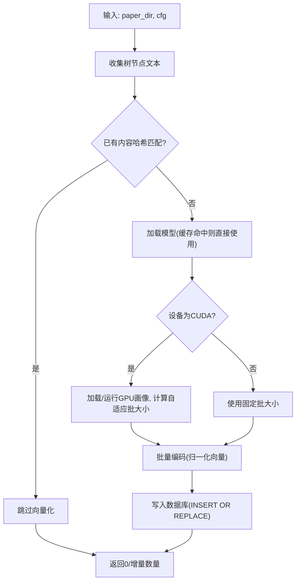
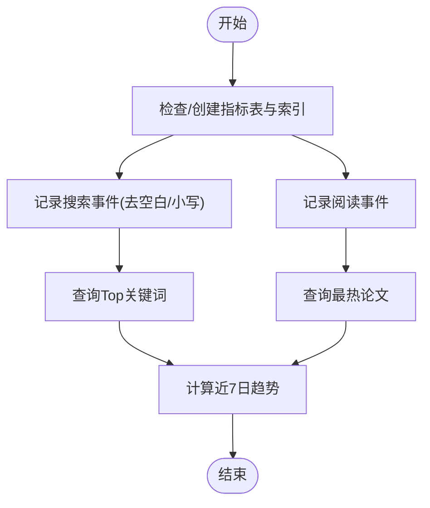
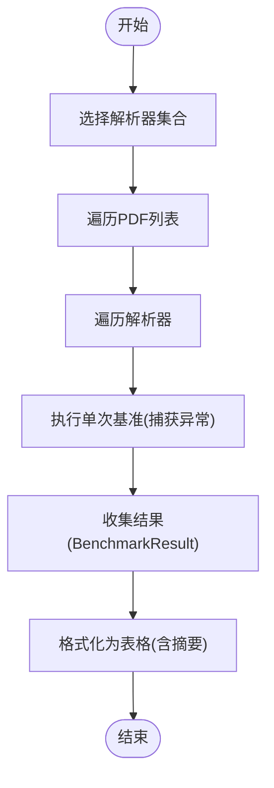
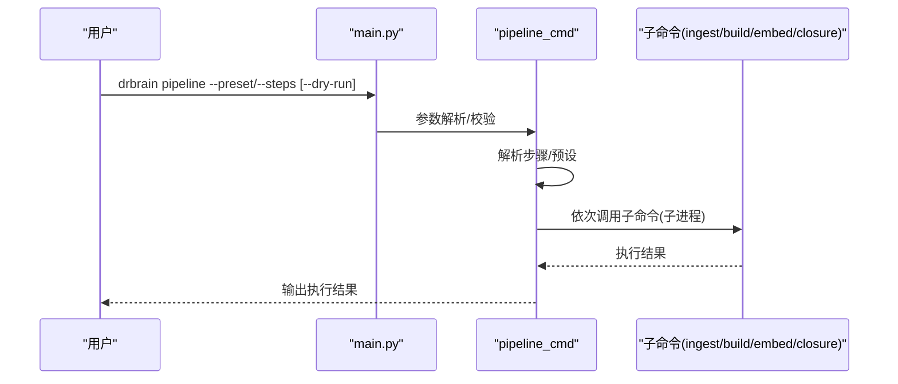
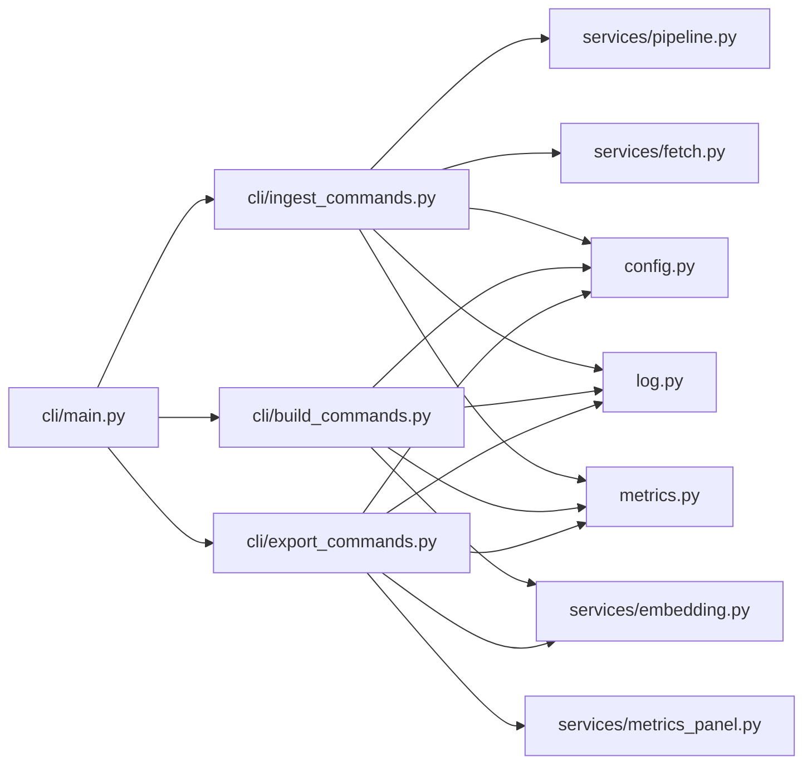

# 流水线与工作流服务

<cite>
**本文引用的文件**
- [src/drbrain/services/pipeline.py](file://src/drbrain/services/pipeline.py)
- [src/drbrain/services/metrics_panel.py](file://src/drbrain/services/metrics_panel.py)
- [src/drbrain/services/parser_benchmark.py](file://src/drbrain/services/parser_benchmark.py)
- [src/drbrain/services/embedding.py](file://src/drbrain/services/embedding.py)
- [src/drbrain/services/fetch.py](file://src/drbrain/services/fetch.py)
- [src/drbrain/cli/main.py](file://src/drbrain/cli/main.py)
- [src/drbrain/cli/ingest_commands.py](file://src/drbrain/cli/ingest_commands.py)
- [src/drbrain/cli/build_commands.py](file://src/drbrain/cli/build_commands.py)
- [src/drbrain/cli/export_commands.py](file://src/drbrain/cli/export_commands.py)
- [src/drbrain/config.py](file://src/drbrain/config.py)
- [src/drbrain/metrics.py](file://src/drbrain/metrics.py)
- [src/drbrain/log.py](file://src/drbrain/log.py)
- [src/drbrain/exceptions.py](file://src/drbrain/exceptions.py)
</cite>

## 目录
1. [简介](#简介)
2. [项目结构](#项目结构)
3. [核心组件](#核心组件)
4. [架构总览](#架构总览)
5. [详细组件分析](#详细组件分析)
6. [依赖分析](#依赖分析)
7. [性能考量](#性能考量)
8. [故障排查指南](#故障排查指南)
9. [结论](#结论)
10. [附录](#附录)

## 简介
本文件面向“流水线与工作流服务”的API文档，聚焦以下能力：
- 流水线编排：通过预设与步骤组合实现端到端处理链路（解析 → 构图 → 向量化 → 推理闭包）。
- 性能基准测试：对比多种PDF解析器在多份样本上的耗时与输出大小。
- 指标面板：用户行为分析（搜索关键词、最热论文、周趋势）。
- 任务调度与状态管理：命令式CLI入口、子命令分层、队列项接受/拒绝、持久化状态。
- 错误恢复机制：异常类型体系、日志与回退策略、JSON模式输出便于集成。
- 并行处理与资源监控：嵌入模型自适应批大小、GPU内存画像、WAL事务安全。

## 项目结构
围绕“流水线与工作流”，系统采用CLI入口聚合各子命令，服务模块提供可复用的业务能力，配置与日志贯穿运行期。

图表来源
- [src/drbrain/cli/main.py:77-146](file://src/drbrain/cli/main.py#L77-L146)
- [src/drbrain/services/pipeline.py:23-50](file://src/drbrain/services/pipeline.py#L23-L50)
- [src/drbrain/services/fetch.py:219-264](file://src/drbrain/services/fetch.py#L219-L264)
- [src/drbrain/services/embedding.py:598-704](file://src/drbrain/services/embedding.py#L598-L704)
- [src/drbrain/services/metrics_panel.py:101-138](file://src/drbrain/services/metrics_panel.py#L101-L138)
- [src/drbrain/services/parser_benchmark.py:104-153](file://src/drbrain/services/parser_benchmark.py#L104-L153)
- [src/drbrain/cli/ingest_commands.py:703-756](file://src/drbrain/cli/ingest_commands.py#L703-L756)
- [src/drbrain/cli/build_commands.py:280-360](file://src/drbrain/cli/build_commands.py#L280-L360)
- [src/drbrain/cli/export_commands.py:576-628](file://src/drbrain/cli/export_commands.py#L576-L628)
- [src/drbrain/config.py:195-291](file://src/drbrain/config.py#L195-L291)
- [src/drbrain/log.py:32-67](file://src/drbrain/log.py#L32-L67)
- [src/drbrain/metrics.py:49-202](file://src/drbrain/metrics.py#L49-L202)
- [src/drbrain/exceptions.py:6-27](file://src/drbrain/exceptions.py#L6-L27)

章节来源
- [src/drbrain/cli/main.py:77-146](file://src/drbrain/cli/main.py#L77-L146)
- [src/drbrain/config.py:195-291](file://src/drbrain/config.py#L195-L291)

## 核心组件
- 流水线步骤与预设：定义标准处理阶段与组合方式，支持校验与去重。
- 多源PDF抓取：按优先级与回退策略解析URL并下载。
- 树节点向量化：本地或云端嵌入，支持增量更新与GPU自适应批大小。
- 用户行为指标：轻量SQLite统计搜索/阅读事件并生成趋势。
- 基准测试：对比不同解析器在多PDF上的耗时与输出大小。
- CLI命令体系：采集、构建、导出、队列、备份等子命令统一入口。
- 配置系统：YAML加载、本地覆盖、环境变量解析、类型化配置。
- 日志与指标：会话ID、旋转日志、SQLite WAL写入、线程安全计时器。
- 异常体系：统一基类与细分类型，保障错误传播与回退。

章节来源
- [src/drbrain/services/pipeline.py:14-108](file://src/drbrain/services/pipeline.py#L14-L108)
- [src/drbrain/services/fetch.py:13-344](file://src/drbrain/services/fetch.py#L13-L344)
- [src/drbrain/services/embedding.py:504-786](file://src/drbrain/services/embedding.py#L504-L786)
- [src/drbrain/services/metrics_panel.py:13-138](file://src/drbrain/services/metrics_panel.py#L13-L138)
- [src/drbrain/services/parser_benchmark.py:39-153](file://src/drbrain/services/parser_benchmark.py#L39-L153)
- [src/drbrain/cli/ingest_commands.py:703-756](file://src/drbrain/cli/ingest_commands.py#L703-L756)
- [src/drbrain/cli/build_commands.py:280-360](file://src/drbrain/cli/build_commands.py#L280-L360)
- [src/drbrain/cli/export_commands.py:576-628](file://src/drbrain/cli/export_commands.py#L576-L628)
- [src/drbrain/config.py:195-291](file://src/drbrain/config.py#L195-L291)
- [src/drbrain/log.py:32-67](file://src/drbrain/log.py#L32-L67)
- [src/drbrain/metrics.py:49-202](file://src/drbrain/metrics.py#L49-L202)
- [src/drbrain/exceptions.py:6-27](file://src/drbrain/exceptions.py#L6-L27)

## 架构总览
下图展示从CLI到服务模块的关键调用路径与数据流。

图表来源
- [src/drbrain/cli/main.py:80-91](file://src/drbrain/cli/main.py#L80-L91)
- [src/drbrain/config.py:283-291](file://src/drbrain/config.py#L283-L291)
- [src/drbrain/log.py:32-67](file://src/drbrain/log.py#L32-L67)
- [src/drbrain/metrics.py:134-174](file://src/drbrain/metrics.py#L134-L174)

## 详细组件分析

### 组件A：流水线编排（pipeline）
- 功能要点
  - 步骤定义：包含名称、作用域（收件箱/论文/全局）、描述。
  - 预设组合：full/quick/embed三类常用链路。
  - 解析逻辑：支持按预设或逗号分隔步骤名解析，去重与校验。
  - 列表信息：返回步骤与预设的结构化信息用于展示。
- 关键流程
  - 输入：预设名或步骤字符串。
  - 校验：未知预设/步骤名抛出异常；两者皆未提供则报错。
  - 输出：有序且去重的步骤名列表。
- 并发与资源
  - 该模块本身为纯函数，不直接并发；实际执行由上层命令逐个触发外部子进程。

图表来源
- [src/drbrain/services/pipeline.py:53-89](file://src/drbrain/services/pipeline.py#L53-L89)

章节来源
- [src/drbrain/services/pipeline.py:14-108](file://src/drbrain/services/pipeline.py#L14-L108)

### 组件B：多源PDF抓取（fetch）
- 功能要点
  - URL解析：按arXiv/OpenAlex/Unpaywall/直链/标题搜索的顺序尝试。
  - 下载：带UA、超时、内容类型检测、代理转换。
  - 元数据解析：优先从OpenAlex/arXiv/标题搜索解析，生成临时local_id。
  - 组合：返回可用于后续入库的元数据字典。
- 错误与回退
  - 任一阶段失败均返回None，调用方需进行降级处理。
  - 外部API异常使用日志记录并返回空值，避免中断主流程。

图表来源
- [src/drbrain/services/fetch.py:13-344](file://src/drbrain/services/fetch.py#L13-L344)

章节来源
- [src/drbrain/services/fetch.py:13-344](file://src/drbrain/services/fetch.py#L13-L344)

### 组件C：树节点向量化（embedding）
- 功能要点
  - 模型加载：支持ModelScope/HuggingFace，自动选择设备，缓存模型实例。
  - GPU画像：一次性探测单样本峰值显存，缓存画像以跨会话复用。
  - 自适应批大小：基于画像估算可用显存，动态调整batch_size。
  - 增量更新：基于内容哈希判断是否需要重新向量化。
  - 搜索：查询向量与已存向量做余弦相似度排序。
- 并发与资源
  - 本地编码使用批处理；GPU画像仅在CUDA且首次启用时运行。
  - 线程安全：模块级缓存与锁保护。

图表来源
- [src/drbrain/services/embedding.py:598-704](file://src/drbrain/services/embedding.py#L598-L704)
- [src/drbrain/services/embedding.py:215-412](file://src/drbrain/services/embedding.py#L215-L412)

章节来源
- [src/drbrain/services/embedding.py:504-786](file://src/drbrain/services/embedding.py#L504-L786)

### 组件D：用户行为指标面板（metrics_panel）
- 功能要点
  - 数据库初始化：确保表与索引存在。
  - 事件记录：搜索/阅读事件写入。
  - 指标查询：Top关键词、最热论文、近7日趋势。
- 存储与性能
  - 使用轻量SQLite，独立于主数据库，降低耦合。
  - 建立索引提升查询效率。

图表来源
- [src/drbrain/services/metrics_panel.py:13-138](file://src/drbrain/services/metrics_panel.py#L13-L138)

章节来源
- [src/drbrain/services/metrics_panel.py:13-138](file://src/drbrain/services/metrics_panel.py#L13-L138)

### 组件E：解析器基准测试（parser_benchmark）
- 功能要点
  - 单次基准：对单一解析器与单PDF执行，记录耗时、输出大小、成功与否。
  - 多解析器/多PDF：遍历组合，汇总结果。
  - 结果格式化：表格形式，含每解析器成功率与平均耗时。
- 使用场景
  - 评估MinerU、PyMuPDF、PyMuPDF4LLM等解析器在真实数据集上的表现。

图表来源
- [src/drbrain/services/parser_benchmark.py:104-153](file://src/drbrain/services/parser_benchmark.py#L104-L153)

章节来源
- [src/drbrain/services/parser_benchmark.py:39-153](file://src/drbrain/services/parser_benchmark.py#L39-L153)

### 组件F：CLI命令与工作流（main/commands）
- CLI入口
  - Typer应用注册所有命令，统一回调中加载配置与设置日志。
- 命令分层
  - 采集/抓取/报告/闭包：处理PDF入库与知识图谱扩展。
  - 构建/翻译/嵌入：抽取概念/关系，生成向量，训练TransE。
  - 导出/队列/备份/样式：数据导出、置信度队列、备份与引用样式。
- 工作流
  - pipeline命令：解析步骤→子进程串行执行对应子命令。
  - 支持dry-run预览与--list列出可用步骤/预设。

图表来源
- [src/drbrain/cli/main.py:94-146](file://src/drbrain/cli/main.py#L94-L146)
- [src/drbrain/cli/ingest_commands.py:703-756](file://src/drbrain/cli/ingest_commands.py#L703-L756)

章节来源
- [src/drbrain/cli/main.py:77-146](file://src/drbrain/cli/main.py#L77-L146)
- [src/drbrain/cli/ingest_commands.py:703-756](file://src/drbrain/cli/ingest_commands.py#L703-L756)
- [src/drbrain/cli/build_commands.py:97-360](file://src/drbrain/cli/build_commands.py#L97-L360)
- [src/drbrain/cli/export_commands.py:21-628](file://src/drbrain/cli/export_commands.py#L21-L628)

## 依赖分析
- 组件内聚与耦合
  - pipeline模块低耦合，仅依赖数据类与内置校验。
  - fetch模块依赖外部API与网络请求，具备清晰的失败回退。
  - embedding模块与配置、日志、指标模块松耦合，通过参数注入。
  - CLI命令作为门面，依赖服务模块与配置。
- 外部依赖
  - requests、sqlite3、loguru、numpy、sentence_transformers(torch可选)。
- 循环依赖
  - 未见循环导入；服务模块之间通过函数调用解耦。

图表来源
- [src/drbrain/cli/main.py:77-146](file://src/drbrain/cli/main.py#L77-L146)
- [src/drbrain/services/pipeline.py:23-50](file://src/drbrain/services/pipeline.py#L23-L50)
- [src/drbrain/services/fetch.py:219-264](file://src/drbrain/services/fetch.py#L219-L264)
- [src/drbrain/services/embedding.py:598-704](file://src/drbrain/services/embedding.py#L598-L704)
- [src/drbrain/services/metrics_panel.py:101-138](file://src/drbrain/services/metrics_panel.py#L101-L138)
- [src/drbrain/cli/ingest_commands.py:703-756](file://src/drbrain/cli/ingest_commands.py#L703-L756)
- [src/drbrain/cli/build_commands.py:280-360](file://src/drbrain/cli/build_commands.py#L280-L360)
- [src/drbrain/cli/export_commands.py:576-628](file://src/drbrain/cli/export_commands.py#L576-L628)
- [src/drbrain/config.py:195-291](file://src/drbrain/config.py#L195-L291)
- [src/drbrain/log.py:32-67](file://src/drbrain/log.py#L32-L67)
- [src/drbrain/metrics.py:49-202](file://src/drbrain/metrics.py#L49-L202)

章节来源
- [src/drbrain/cli/main.py:77-146](file://src/drbrain/cli/main.py#L77-L146)
- [src/drbrain/config.py:195-291](file://src/drbrain/config.py#L195-L291)

## 性能考量
- 嵌入性能
  - GPU画像仅在首次启用时运行，后续复用缓存，避免重复探测。
  - 自适应批大小在CUDA上显著提升吞吐，CPU上回退到固定批。
  - 内容哈希驱动的增量更新减少重复计算。
- I/O与并发
  - SQLite WAL模式提升写入并发；指标存储使用锁保证线程安全。
  - 批量插入/替换减少往返次数。
- 网络与外部API
  - fetch模块采用多阶段回退与HEAD探测，降低失败成本。
  - 基准测试模块支持多解析器/多PDF组合，便于离线评估。
- 建议
  - 在GPU环境下启用自适应批大小；合理设置嵌入维度与batch_size。
  - 对高频查询建立索引（已内置），避免重复扫描。
  - 使用JSON输出模式便于CI/CD集成与自动化监控。

[本节为通用指导，无需特定文件引用]

## 故障排查指南
- 异常类型与处理
  - 统一异常基类与细分类型，外部API失败需记录异常并返回回退值。
  - CLI命令遇到用户错误时输出消息并退出（Exit 1）。
- 日志与会话
  - 会话ID贯穿日志，便于问题定位与关联。
  - 控制台与文件双通道输出，警告级别定向stderr。
- 指标与可观测性
  - 使用MetricsStore记录LLM调用与通用事件，支持装饰器与上下文计时。
- 常见问题
  - 无法找到PDF：检查DOI/标题/arXiv输入与网络访问；查看OpenAlex/Unpaywall邮箱配置。
  - 嵌入失败：确认模型缓存路径、网络可达性与GPU显存；必要时禁用provider=none。
  - 指标为空：首次运行后需有搜索/阅读事件才会产生统计数据。

章节来源
- [src/drbrain/exceptions.py:6-27](file://src/drbrain/exceptions.py#L6-L27)
- [src/drbrain/log.py:32-67](file://src/drbrain/log.py#L32-L67)
- [src/drbrain/metrics.py:49-202](file://src/drbrain/metrics.py#L49-L202)

## 结论
本服务通过CLI命令与服务模块的清晰分层，提供了从PDF采集、知识图谱构建、向量化到指标分析的完整流水线能力。其设计强调：
- 可组合的步骤与预设，便于快速迭代与定制；
- 多源抓取与回退策略，提升鲁棒性；
- 嵌入模块的GPU自适应与增量更新，兼顾性能与成本；
- 轻量指标与日志体系，支撑可观测与运维。

[本节为总结，无需特定文件引用]

## 附录
- 配置加载与合并
  - 支持基础配置与本地覆盖，环境变量占位符解析，类型化字段。
- 命令输出模式
  - 支持JSON输出，便于自动化与集成；错误时返回结构化错误对象并退出。
- 运维建议
  - 定期备份数据库与论文目录；监控日志与指标数据库容量；根据硬件条件调整嵌入配置。

章节来源
- [src/drbrain/config.py:195-291](file://src/drbrain/config.py#L195-L291)
- [src/drbrain/cli/export_commands.py:21-78](file://src/drbrain/cli/export_commands.py#L21-L78)