# 知识抽取服务

<cite>
**本文档引用的文件**
- [agent.py](file://src/drbrain/extractor/agent.py)
- [llm_client.py](file://src/drbrain/extractor/llm_client.py)
- [concept.py](file://src/drbrain/extractor/concept.py)
- [citation.py](file://src/drbrain/extractor/citation.py)
- [confidence_propagation.py](file://src/drbrain/extractor/confidence_propagation.py)
- [rule_miner.py](file://src/drbrain/extractor/rule_miner.py)
- [reasoner.py](file://src/drbrain/extractor/reasoner.py)
- [schema.py](file://src/drbrain/validator/schema.py)
- [config.py](file://src/drbrain/config.py)
- [entities.txt](file://prompts/entities.txt)
- [relations.txt](file://prompts/relations.txt)
- [main.py](file://src/drbrain/cli/main.py)
- [config.example.yaml](file://config.example.yaml)
- [agent_tools.py](file://src/drbrain/extractor/agent_tools.py)
- [session_agent.py](file://src/drbrain/extractor/session_agent.py)
- [test_bidirectional_reasoning.py](file://tests/test_bidirectional_reasoning.py)
</cite>

## 目录
1. [简介](#简介)
2. [项目结构](#项目结构)
3. [核心组件](#核心组件)
4. [架构总览](#架构总览)
5. [详细组件分析](#详细组件分析)
6. [依赖分析](#依赖分析)
7. [性能考虑](#性能考虑)
8. [故障排除指南](#故障排除指南)
9. [结论](#结论)
10. [附录](#附录)

## 简介
本文件为知识抽取服务的全面API文档，覆盖实体抽取、关系抽取、引用处理与知识增强等能力。文档详细说明了LLM客户端集成、抽取参数配置、输出格式规范，并给出概念实体、引用条目与关系边的数据模型定义。同时提供抽取质量评估、置信度处理与批量处理的最佳实践。

**更新** 本版本新增了kg_validate函数的重构和共享机制说明，现在SessionAgent和ReasonerAgent都可以使用相同的验证逻辑。

## 项目结构
知识抽取服务位于 `src/drbrain/extractor/` 目录下，围绕"构建阶段代理（BuildAgent）"、"推理代理（ReasonerAgent）"与"会话代理（SessionAgent）"三条主线组织：
- 构建阶段代理：按顺序执行"本体扩展 → 实体抽取 → 关系抽取 → 共指消解 → 自我精炼"的五阶段流水线
- 推理代理：基于工具调用的双向推理循环，支持kg_validate验证
- 会话代理：持久化的多轮对话代理，支持kg_validate验证
- LLM客户端：支持多模型回退链、令牌计数与指标记录
- 引用处理：基于S2/OpenAlex/CrossRef的跨源引用网络扩展
- 质量控制：TBox/RBox约束验证、置信度传播与规则挖掘

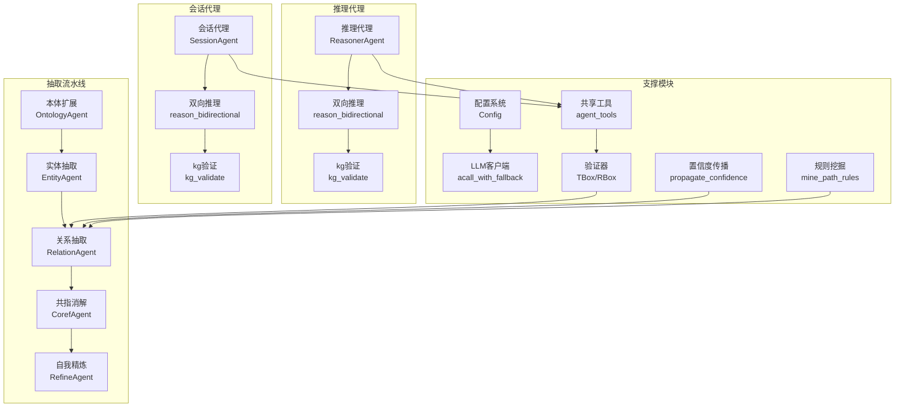

**图表来源**
- [agent.py:53-136](file://src/drbrain/extractor/agent.py#L53-L136)
- [llm_client.py:92-114](file://src/drbrain/extractor/llm_client.py#L92-L114)
- [concept.py:498-495](file://src/drbrain/extractor/concept.py#L498-L495)
- [schema.py:7-51](file://src/drbrain/validator/schema.py#L7-L51)
- [confidence_propagation.py:31-87](file://src/drbrain/extractor/confidence_propagation.py#L31-L87)
- [rule_miner.py:33-105](file://src/drbrain/extractor/rule_miner.py#L33-L105)
- [reasoner.py:227-232](file://src/drbrain/extractor/reasoner.py#L227-L232)
- [session_agent.py:431](file://src/drbrain/extractor/session_agent.py#L431)

**章节来源**
- [agent.py:1-368](file://src/drbrain/extractor/agent.py#L1-L368)
- [llm_client.py:1-154](file://src/drbrain/extractor/llm_client.py#L1-L154)
- [concept.py:1-901](file://src/drbrain/extractor/concept.py#L1-L901)
- [schema.py:1-211](file://src/drbrain/validator/schema.py#L1-L211)
- [confidence_propagation.py:1-87](file://src/drbrain/extractor/confidence_propagation.py#L1-L87)
- [rule_miner.py:1-290](file://src/drbrain/extractor/rule_miner.py#L1-L290)
- [reasoner.py:1-328](file://src/drbrain/extractor/reasoner.py#L1-L328)
- [session_agent.py:1-582](file://src/drbrain/extractor/session_agent.py#L1-L582)

## 核心组件
- 构建阶段代理（BuildAgent）
  - 统一的输入/输出契约、幂等性保障、重试与状态持久化
  - 支持"本体扩展（ontology）→ 实体（entities）→ 关系（relations）→ 共指（coreference）→ 精炼（refine）"
- 推理代理（ReasonerAgent）
  - 基于工具调用的推理循环，支持双向验证
  - 内置kg_validate方法，委托给共享的agent_tools.kg_validate函数
- 会话代理（SessionAgent）
  - 持久化的多轮对话，支持kg_validate验证
  - 内置kg_validate方法，直接调用共享的agent_tools.kg_validate函数
- LLM客户端（acall_with_fallback）
  - 多模型回退链、JSON响应解析、指标记录
- 抽取器（extract_concepts / build_graph_from_tree）
  - 基于树结构的分段抽取、置信度加权、跨节论证链接
- 引用扩展（expand_citations / expand_citations_multi）
  - S2/OpenAlex/CrossRef多源融合、缓存与占位节点插入
- 验证器（TBox/RBox）
  - 类型约束与关系约束校验、传递闭包补全、反身性/反对称性检测
- 置信度传播（propagate_confidence）
  - 按路径衰减与多路径合并策略
- 规则挖掘（mine_path_rules / mine_from_graph_walks）
  - 嵌入空间向量合成与图遍历发现路径规则

**更新** 新增了kg_validate函数的共享机制说明，SessionAgent和ReasonerAgent都可使用相同的验证逻辑。

**章节来源**
- [agent.py:53-368](file://src/drbrain/extractor/agent.py#L53-L368)
- [llm_client.py:92-154](file://src/drbrain/extractor/llm_client.py#L92-L154)
- [concept.py:54-495](file://src/drbrain/extractor/concept.py#L54-L495)
- [citation.py:231-710](file://src/drbrain/extractor/citation.py#L231-L710)
- [schema.py:63-211](file://src/drbrain/validator/schema.py#L63-L211)
- [confidence_propagation.py:31-87](file://src/drbrain/extractor/confidence_propagation.py#L31-L87)
- [rule_miner.py:33-290](file://src/drbrain/extractor/rule_miner.py#L33-L290)
- [reasoner.py:227-232](file://src/drbrain/extractor/reasoner.py#L227-L232)
- [session_agent.py:431](file://src/drbrain/extractor/session_agent.py#L431)

## 架构总览
抽取流程采用"阶段化代理 + LLM回退链 + 数据验证"的架构模式，确保可扩展、可观测与可修复。

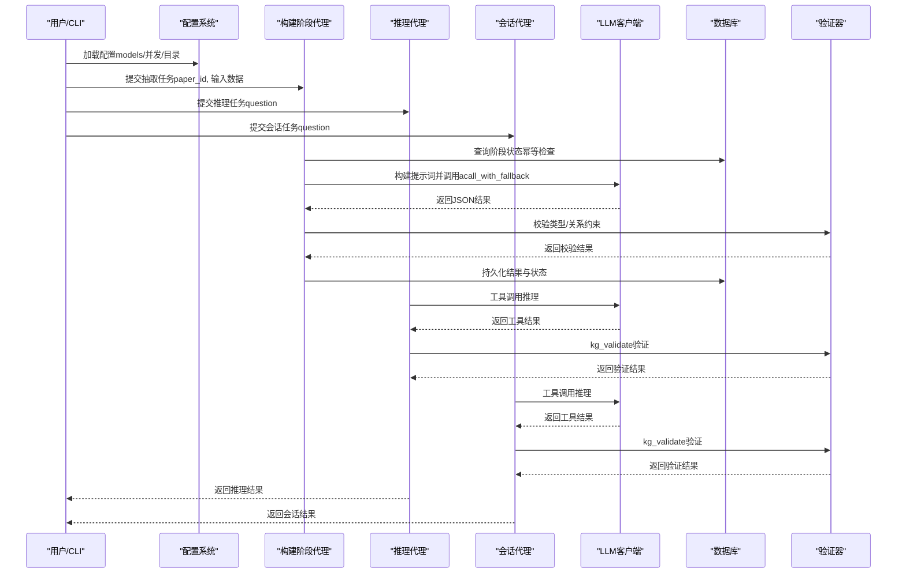

**图表来源**
- [agent.py:73-135](file://src/drbrain/extractor/agent.py#L73-L135)
- [llm_client.py:92-114](file://src/drbrain/extractor/llm_client.py#L92-L114)
- [schema.py:63-94](file://src/drbrain/validator/schema.py#L63-L94)
- [reasoner.py:227-232](file://src/drbrain/extractor/reasoner.py#L227-L232)
- [session_agent.py:431](file://src/drbrain/extractor/session_agent.py#L431)

## 详细组件分析

### 构建阶段代理（BuildAgent）
- 统一契约
  - 输入：paper_id、stage、data
  - 输出：paper_id、stage、status、data、diff
- 幂等性与状态管理
  - 通过数据库表 build_stages 记录状态与缓存结果
- 阶段实现
  - OntologyAgent：从树状TOC映射到TBox六类子类别
  - EntityAgent：抽取概念列表（标签、类型、置信度、来源章节/节点）
  - RelationAgent：在概念间建立关系边（继承来源概念的node_id/section）
  - CorefAgent：合并重复标签
  - RefineAgent：自我审查并输出修正前后对比

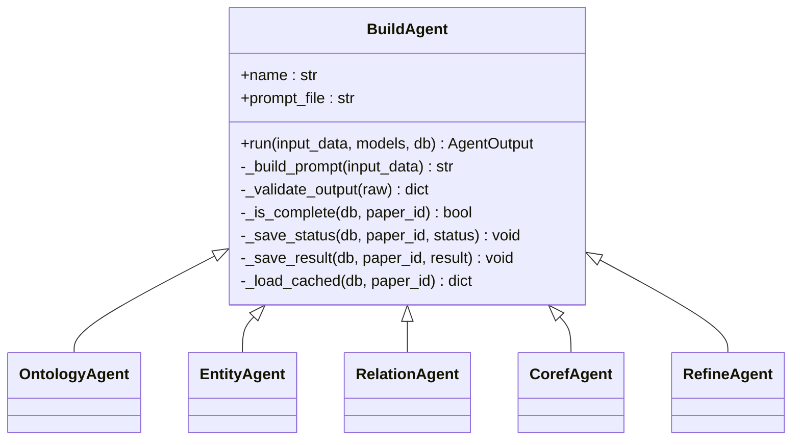

**图表来源**
- [agent.py:53-368](file://src/drbrain/extractor/agent.py#L53-L368)

**章节来源**
- [agent.py:33-196](file://src/drbrain/extractor/agent.py#L33-L196)
- [agent.py:198-368](file://src/drbrain/extractor/agent.py#L198-L368)

### 推理代理（ReasonerAgent）
- 推理循环
  - 基于工具调用的迭代推理，支持最多5轮对话
  - 内置kg_validate方法，委托给共享的agent_tools.kg_validate函数
- 双向推理循环
  - LLM提出假设 → KG验证（TBox/RBox/模式）→ 反馈修订 → 最终答案
  - 每轮根据上一轮的验证结果调整提示词

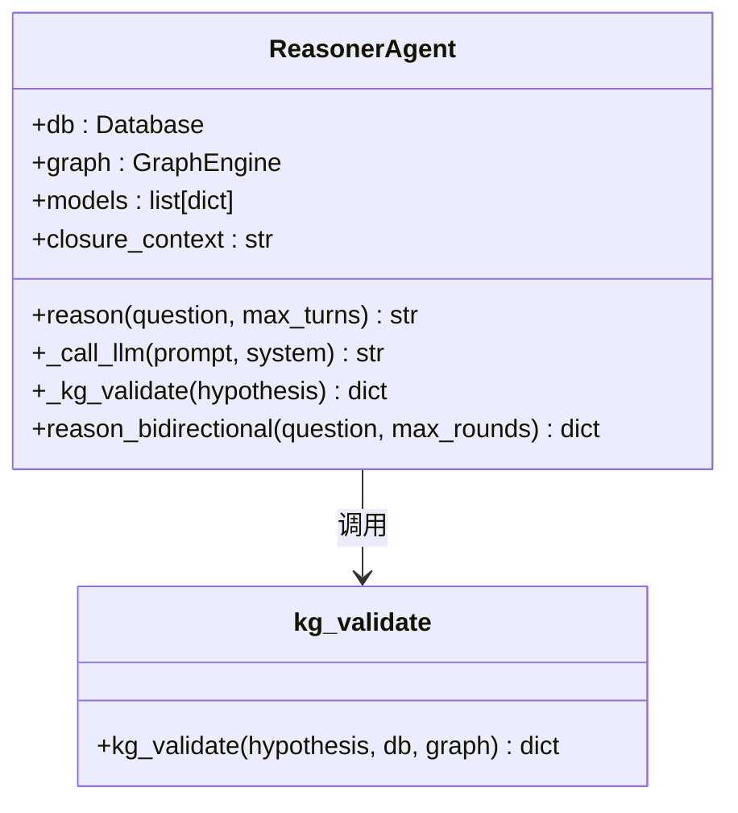

**图表来源**
- [reasoner.py:28-328](file://src/drbrain/extractor/reasoner.py#L28-L328)
- [agent_tools.py:269-408](file://src/drbrain/extractor/agent_tools.py#L269-L408)

**章节来源**
- [reasoner.py:28-328](file://src/drbrain/extractor/reasoner.py#L28-L328)

### 会话代理（SessionAgent）
- 会话生命周期
  - 创建、加载、删除持久化会话
  - 支持跨CLI调用的上下文连续性
- 推理循环
  - 基于工具调用的迭代推理，支持最多8轮对话
  - 内置kg_validate方法，直接调用共享的agent_tools.kg_validate函数
- 上下文管理
  - 自动压缩超过令牌预算的历史消息
  - 支持结构化上下文注入

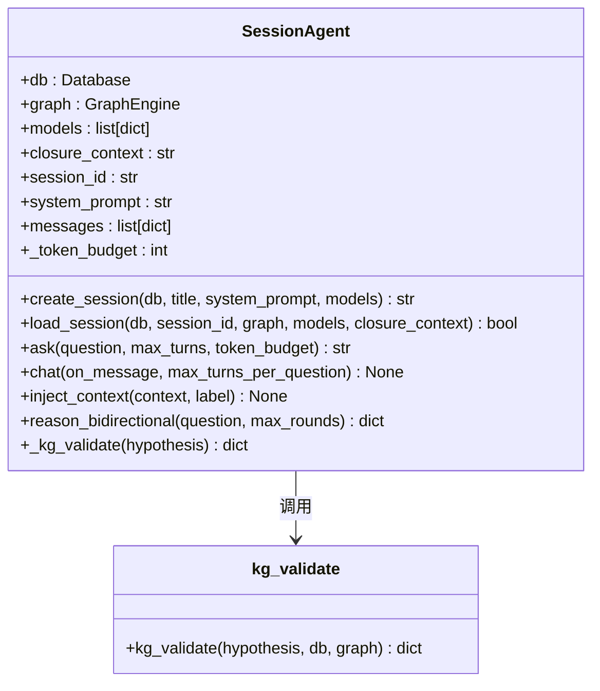

**图表来源**
- [session_agent.py:38-582](file://src/drbrain/extractor/session_agent.py#L38-L582)
- [agent_tools.py:269-408](file://src/drbrain/extractor/agent_tools.py#L269-L408)

**章节来源**
- [session_agent.py:38-582](file://src/drbrain/extractor/session_agent.py#L38-L582)

### LLM客户端（acall_with_fallback）
- 功能
  - 多模型回退链、超时与异常处理、指标记录
  - 支持同步/异步调用，返回JSON或纯文本
- 参数
  - models：模型配置数组（provider/model/api_key/base_url）
  - system_prompt/max_tokens：提示词与上下文长度
- 性能
  - 使用日志记录耗时与令牌用量，便于成本控制

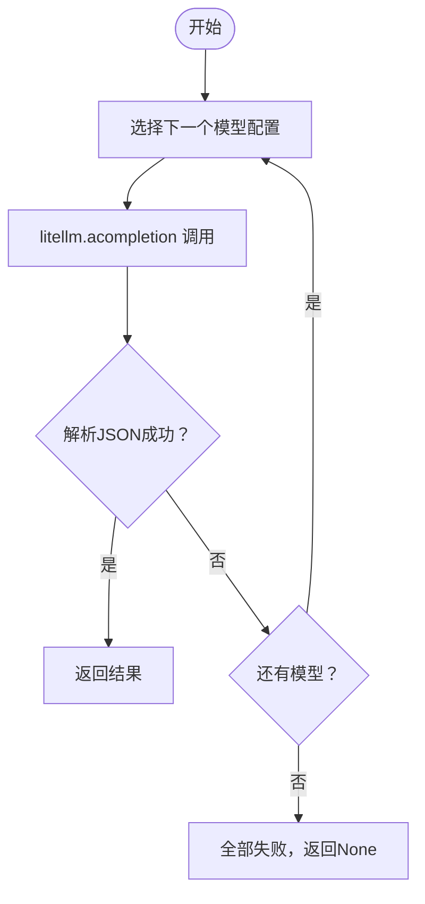

**图表来源**
- [llm_client.py:92-114](file://src/drbrain/extractor/llm_client.py#L92-L114)

**章节来源**
- [llm_client.py:12-154](file://src/drbrain/extractor/llm_client.py#L12-L154)

### 抽取器（extract_concepts / build_graph_from_tree）
- 单段抽取
  - extract_concepts：对整段文本进行一次性抽取
  - extract_section_concepts：结合树结构与段落内容抽取
- 树驱动抽取
  - build_graph_from_tree：五阶段流水线（本体→实体→关系→共指→精炼）
  - 叶节点优先、质量过滤、置信度加权、跨节论证链接
- 合并与去重
  - 概念按标签去重，保留更高置信度；关系按三元组去重；论证按主张-目标去重

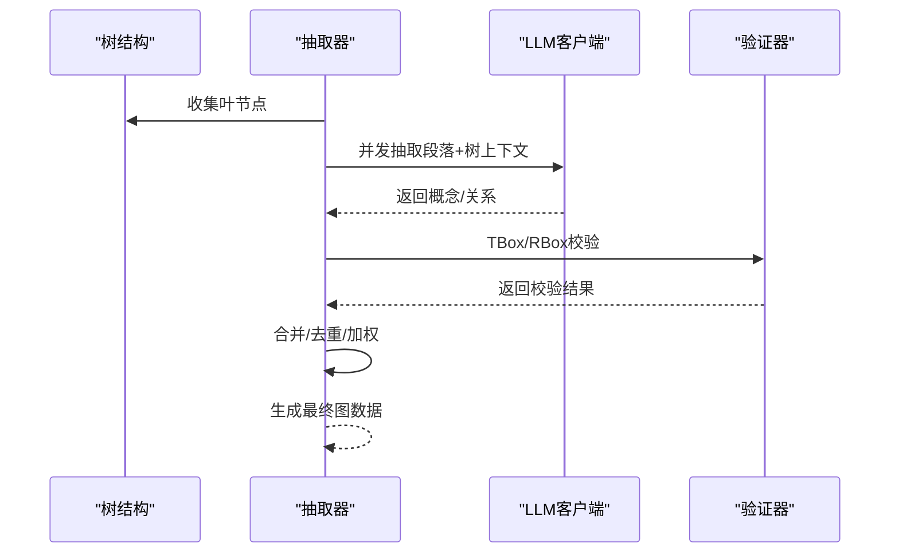

**图表来源**
- [concept.py:284-495](file://src/drbrain/extractor/concept.py#L284-L495)
- [schema.py:63-120](file://src/drbrain/validator/schema.py#L63-L120)

**章节来源**
- [concept.py:54-341](file://src/drbrain/extractor/concept.py#L54-L341)
- [concept.py:343-495](file://src/drbrain/extractor/concept.py#L343-L495)

### 引用处理（expand_citations / expand_citations_multi）
- 单源扩展
  - S2：优先，支持速率限制与重试
  - CrossRef：DOI补充（Spec §11 阶段6.5）
  - OpenAlex：降级回退
- 多源扩展
  - 合并三源结果，去重（标题前缀），写入缓存与占位论文
- 匹配策略
  - DOI/arXiv/S2/OpenAlex/标题+年份多维度匹配本地图

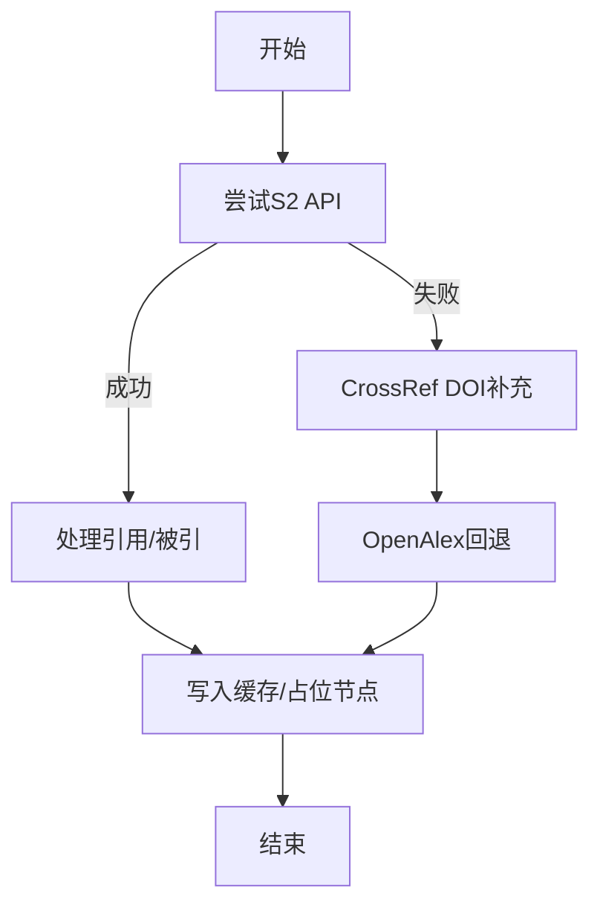

**图表来源**
- [citation.py:231-710](file://src/drbrain/extractor/citation.py#L231-L710)

**章节来源**
- [citation.py:231-710](file://src/drbrain/extractor/citation.py#L231-L710)

### 质量控制与置信度传播
- TBox/RBox验证
  - TBox：类型允许的关系集合
  - RBox：传递性/反对称性/反身性约束
- 置信度传播
  - 单跳衰减（默认0.85），按章节调整衰减因子
  - 多路径合并采用概率并集（1-∏(1-p_i)）

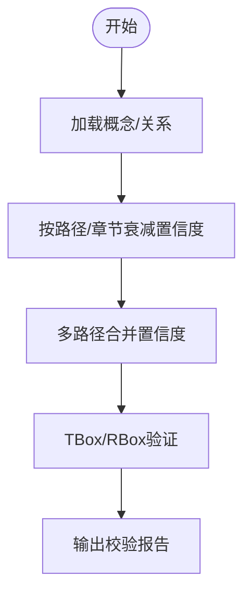

**图表来源**
- [schema.py:63-211](file://src/drbrain/validator/schema.py#L63-L211)
- [confidence_propagation.py:31-87](file://src/drbrain/extractor/confidence_propagation.py#L31-L87)

**章节来源**
- [schema.py:63-211](file://src/drbrain/validator/schema.py#L63-L211)
- [confidence_propagation.py:31-87](file://src/drbrain/extractor/confidence_propagation.py#L31-L87)

### 规则挖掘（mine_path_rules / mine_from_graph_walks）
- 嵌入空间规则
  - TransE向量合成（r1+r2≈r）作为路径组合评分
- 图遍历规则
  - 计数常见二跳路径模式，必要时映射到最接近的关系向量
- 输出
  - 规则头、体路径、置信度、支持度

**章节来源**
- [rule_miner.py:33-290](file://src/drbrain/extractor/rule_miner.py#L33-L290)

### kg验证（kg_validate）共享机制
- 函数重构
  - 从ReasonerAgent中提取到agent_tools模块
  - 独立的kg_validate函数，支持直接调用
- 共享机制
  - SessionAgent和ReasonerAgent都可使用相同的验证逻辑
  - ReasonerAgent通过内部方法委托到kg_validate
  - SessionAgent直接调用kg_validate函数
- 验证内容
  - 实体提及识别：匹配DB中的概念标签
  - TBox验证：检查类型与关系的合法性
  - RBox验证：检查反对称性、反身性等关系约束
  - 图模式检测：识别争议、缺口等模式

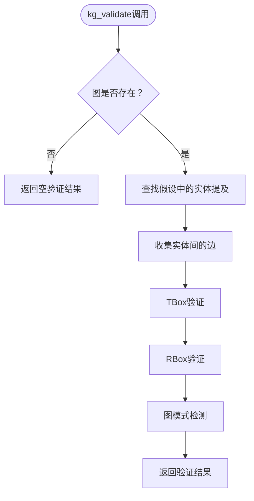

**图表来源**
- [agent_tools.py:269-408](file://src/drbrain/extractor/agent_tools.py#L269-L408)
- [reasoner.py:227-232](file://src/drbrain/extractor/reasoner.py#L227-L232)
- [session_agent.py:431](file://src/drbrain/extractor/session_agent.py#L431)

**章节来源**
- [agent_tools.py:269-408](file://src/drbrain/extractor/agent_tools.py#L269-L408)
- [reasoner.py:227-232](file://src/drbrain/extractor/reasoner.py#L227-L232)
- [session_agent.py:431](file://src/drbrain/extractor/session_agent.py#L431)

## 依赖分析
- 组件耦合
  - BuildAgent依赖LLM客户端与数据库状态表
  - ReasonerAgent依赖LLM客户端、共享工具和kg_validate
  - SessionAgent依赖LLM客户端、共享工具和kg_validate
  - 抽取器依赖提示模板与验证器
  - 引用扩展依赖外部API与缓存
- 外部依赖
  - litellm：统一LLM调用
  - requests：HTTP请求（S2/CrossRef/OpenAlex）
  - loguru：日志记录
  - networkx：图算法（推理工具）

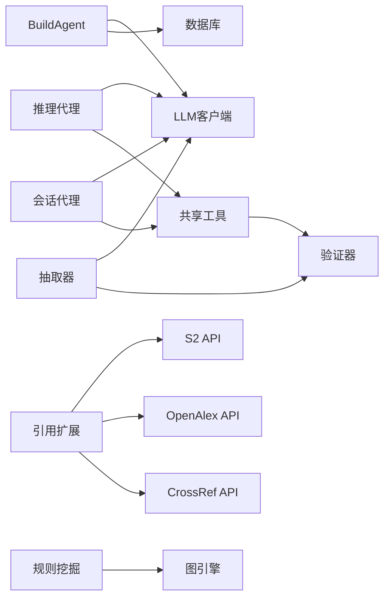

**图表来源**
- [agent.py:83-135](file://src/drbrain/extractor/agent.py#L83-L135)
- [llm_client.py:92-114](file://src/drbrain/extractor/llm_client.py#L92-L114)
- [concept.py:498-495](file://src/drbrain/extractor/concept.py#L498-L495)
- [citation.py:231-710](file://src/drbrain/extractor/citation.py#L231-L710)
- [rule_miner.py:33-105](file://src/drbrain/extractor/rule_miner.py#L33-L105)
- [reasoner.py:28-328](file://src/drbrain/extractor/reasoner.py#L28-L328)
- [session_agent.py:38-582](file://src/drbrain/extractor/session_agent.py#L38-L582)

**章节来源**
- [agent.py:83-135](file://src/drbrain/extractor/agent.py#L83-L135)
- [llm_client.py:92-114](file://src/drbrain/extractor/llm_client.py#L92-L114)
- [concept.py:498-495](file://src/drbrain/extractor/concept.py#L498-L495)
- [citation.py:231-710](file://src/drbrain/extractor/citation.py#L231-L710)
- [rule_miner.py:33-105](file://src/drbrain/extractor/rule_miner.py#L33-L105)
- [reasoner.py:28-328](file://src/drbrain/extractor/reasoner.py#L28-L328)
- [session_agent.py:38-582](file://src/drbrain/extractor/session_agent.py#L38-L582)

## 性能考虑
- 并发控制
  - 抽取阶段使用信号量限制并发（默认10），避免LLM/IO过载
- 缓存与重试
  - 引用扩展使用缓存与指数退避，降低外部API压力
- 指标监控
  - LLM调用记录令牌用量与耗时，便于成本与性能优化
- 质量前置
  - 内容质量过滤（短文本/参考列表/字母占比）减少无效调用
- kg验证优化
  - 实体提及识别使用DB索引，避免全表扫描
  - 边收集使用图遍历，避免重复计算

## 故障排除指南
- LLM调用失败
  - 检查模型配置（provider/model/api_key/base_url）
  - 查看回退链是否正常工作
  - 关注日志中的警告/错误信息
- 抽取结果为空
  - 确认输入文本质量与长度
  - 检查提示模板是否正确注入（树结构/段落内容）
- 引用扩展异常
  - 检查S2/OpenAlex/CrossRef的凭据与速率限制
  - 清理缓存后重试
- 校验不通过
  - 根据TBox/RBox报错调整关系或类型
  - 使用传递闭包补全缺失边
- kg验证问题
  - 检查图引擎是否正确初始化
  - 确认DB连接正常且有概念数据
  - 验证实体标签匹配逻辑

**章节来源**
- [llm_client.py:92-114](file://src/drbrain/extractor/llm_client.py#L92-L114)
- [concept.py:92-146](file://src/drbrain/extractor/concept.py#L92-L146)
- [citation.py:93-147](file://src/drbrain/extractor/citation.py#L93-L147)
- [schema.py:63-211](file://src/drbrain/validator/schema.py#L63-L211)
- [agent_tools.py:269-408](file://src/drbrain/extractor/agent_tools.py#L269-L408)

## 结论
本知识抽取服务以阶段化代理为核心，结合LLM回退链、严格的数据验证与置信度传播机制，实现了从学术论文中抽取概念、关系与引用的完整闭环。通过kg_validate函数的重构和共享机制，SessionAgent和ReasonerAgent都能使用相同的验证逻辑，提高了代码复用性和一致性。通过多源引用扩展与规则挖掘，进一步增强了知识图谱的完整性与可解释性。建议在生产环境中合理配置并发与缓存策略，并持续监控LLM指标与校验结果，以获得稳定可靠的抽取效果。

## 附录

### API与数据模型定义

- 构建阶段代理输入/输出契约
  - 输入：paper_id（字符串）、stage（字符串）、data（字典）
  - 输出：paper_id、stage、status（枚举：pending/in_progress/complete/failed）、data（字典）、diff（可选）
- 实体抽取输出
  - 概念列表：label（字符串）、type（Problem/Method/Conclusion/Gap/Debate/Actor）、confidence（0~1）、section（可选）、node_id（可选）
- 关系抽取输出
  - 关系列表：head/tail（概念标签）、rel（关系类型）、confidence（0~1）、node_id/section（继承自head）
- 共指消解输出
  - 合并列表：canonical（规范标签）、variants（变体列表）
- 自我精炼输出
  - 修正列表：corrections（字典列表）、diff（before/after统计）
- 引用条目
  - 标准字段：title、year、ids（doi/arxiv/s2_id/openalex_id）、in_graph（布尔）、local_id（可选）
- 关系边
  - 字段：head、rel、tail、weight（数值）、node_id/section（可选）
- kg验证输出
  - consistent（布尔）：验证是否通过
  - violations（列表）：违反的约束
  - patterns（列表）：发现的图模式

**更新** 新增了kg验证输出的数据模型定义。

**章节来源**
- [agent.py:33-51](file://src/drbrain/extractor/agent.py#L33-L51)
- [agent.py:227-248](file://src/drbrain/extractor/agent.py#L227-L248)
- [agent.py:261-283](file://src/drbrain/extractor/agent.py#L261-L283)
- [agent.py:296-314](file://src/drbrain/extractor/agent.py#L296-L314)
- [agent.py:339-349](file://src/drbrain/extractor/agent.py#L339-L349)
- [citation.py:164-228](file://src/drbrain/extractor/citation.py#L164-L228)
- [agent_tools.py:269-284](file://src/drbrain/extractor/agent_tools.py#L269-L284)

### 抽取参数配置
- LLM模型配置（config.yaml）
  - llm.models：数组，每个元素含provider/model/api_key/base_url
  - 示例见配置模板
- 抽取并发
  - extract.max_concurrent：默认10
- 外部API
  - api.s2_api_key、api.s2_rate_limit、api.crossref_email、api.openalex_token
- 目录与数据库
  - dirs.*、db.path

**章节来源**
- [config.example.yaml:12-106](file://config.example.yaml#L12-L106)
- [config.py:44-193](file://src/drbrain/config.py#L44-L193)

### 输出格式规范
- JSON对象键名
  - entities：概念列表
  - relations：关系列表
  - merges：共指合并
  - corrections：精炼修正
- 严格JSON输出
  - LLM提示模板要求输出严格JSON，禁止Markdown与额外文本

**章节来源**
- [concept.py:498-495](file://src/drbrain/extractor/concept.py#L498-L495)
- [entities.txt:17-18](file://prompts/entities.txt#L17-L18)
- [relations.txt:22-23](file://prompts/relations.txt#L22-L23)

### 批量处理最佳实践
- 分段抽取
  - 使用树结构收集叶节点，按优先级排序并发抽取
- 质量过滤
  - 过滤短文本、参考列表与低字母占比内容
- 置信度加权
  - 按树深度与章节类型调整置信度权重
- 去重与合并
  - 概念按标签去重，关系按三元组去重，论证按主张-目标去重

**章节来源**
- [concept.py:73-107](file://src/drbrain/extractor/concept.py#L73-L107)
- [concept.py:343-392](file://src/drbrain/extractor/concept.py#L343-L392)
- [concept.py:191-258](file://src/drbrain/extractor/concept.py#L191-L258)

### 推理与知识增强
- 推理工具
  - 搜索概念、邻居、最短路径、文档结构、段落内容、跨纸树检索、RAPTOR摘要
- 双向推理循环
  - LLM提出假设 → KG验证（TBox/RBox/模式）→ 反馈修订 → 最终答案
- 规则增强
  - 嵌入空间与图遍历发现路径规则，提升关系补全能力

**章节来源**
- [reasoner.py:16-390](file://src/drbrain/extractor/reasoner.py#L16-L390)
- [reasoner.py:583-677](file://src/drbrain/extractor/reasoner.py#L583-L677)
- [rule_miner.py:137-290](file://src/drbrain/extractor/rule_miner.py#L137-L290)

### kg验证功能详解
- 实体提及识别
  - 从假设文本中提取实体标签
  - 支持DB查询和图节点匹配
- TBox验证
  - 检查概念类型与关系的合法性
  - 基于预定义的TBox约束表
- RBox验证
  - 检查关系的反对称性、反身性等约束
  - 发现反对称关系的冲突
- 图模式检测
  - 识别实体间的争议关系
  - 发现实体间的缺口模式

**章节来源**
- [agent_tools.py:269-408](file://src/drbrain/extractor/agent_tools.py#L269-L408)
- [schema.py:63-211](file://src/drbrain/validator/schema.py#L63-L211)