# 翻译与审计服务

<cite>
**本文档引用的文件**
- [src/drbrain/services/translate.py](file://src/drbrain/services/translate.py)
- [src/drbrain/services/audit.py](file://src/drbrain/services/audit.py)
- [src/drbrain/services/citation_styles.py](file://src/drbrain/services/citation_styles.py)
- [src/drbrain/cli/build_commands.py](file://src/drbrain/cli/build_commands.py)
- [src/drbrain/cli/export_commands.py](file://src/drbrain/cli/export_commands.py)
- [src/drbrain/cli/_common.py](file://src/drbrain/cli/_common.py)
- [config.example.yaml](file://config.example.yaml)
- [skills/translate/SKILL.md](file://skills/translate/SKILL.md)
- [skills/audit/SKILL.md](file://skills/audit/SKILL.md)
- [skills/citation-styles/SKILL.md](file://skills/citation-styles/SKILL.md)
- [tests/test_translate.py](file://tests/test_translate.py)
- [tests/test_audit.py](file://tests/test_audit.py)
- [tests/test_citation_styles.py](file://tests/test_citation_styles.py)
</cite>

## 目录
1. [简介](#简介)
2. [项目结构](#项目结构)
3. [核心组件](#核心组件)
4. [架构概览](#架构概览)
5. [详细组件分析](#详细组件分析)
6. [依赖关系分析](#依赖关系分析)
7. [性能考虑](#性能考虑)
8. [故障排除指南](#故障排除指南)
9. [结论](#结论)
10. [附录](#附录)

## 简介

翻译与审计服务是 DrBrain 知识图谱系统中的两个关键功能模块，负责处理学术论文的多语言翻译和数据质量审计。该服务集成了先进的自然语言处理技术，提供了完整的翻译工作流管理、引用样式标准化和全面的数据质量监控能力。

翻译服务基于大型语言模型（LLM）实现，支持多种目标语言的学术论文翻译，具备断点续传、并发处理和错误恢复机制。审计服务通过15条规则对整个知识库进行全面的质量检查，识别潜在问题并提供修复建议。引用样式管理服务提供了灵活的参考文献格式化功能，支持多种国际标准格式。

## 项目结构

DrBrain 系统采用模块化架构设计，翻译与审计服务位于核心服务层：

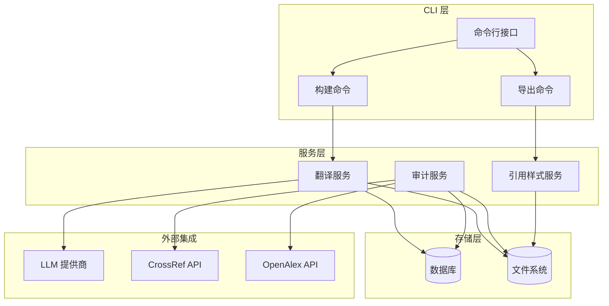

**图表来源**
- [src/drbrain/cli/build_commands.py:16-95](file://src/drbrain/cli/build_commands.py#L16-L95)
- [src/drbrain/cli/export_commands.py:429-478](file://src/drbrain/cli/export_commands.py#L429-L478)

**章节来源**
- [src/drbrain/services/translate.py:1-726](file://src/drbrain/services/translate.py#L1-L726)
- [src/drbrain/services/audit.py:1-396](file://src/drbrain/services/audit.py#L1-L396)
- [src/drbrain/services/citation_styles.py:1-389](file://src/drbrain/services/citation_styles.py#L1-L389)

## 核心组件

### 翻译服务组件

翻译服务是系统的核心功能之一，提供了完整的学术论文翻译解决方案：

#### 主要特性
- **智能语言检测**：自动识别源文本语言，支持中日韩文字母表混合文本
- **占位符保护**：确保代码块、数学公式和图像引用在翻译过程中保持完整
- **断点续传**：支持翻译过程的中断恢复，避免重复工作
- **并发处理**：多线程并行翻译，提高处理效率
- **错误恢复**：指数退避重试机制，处理网络异常和API限制

#### 翻译工作流
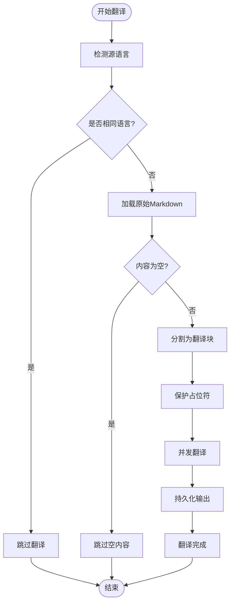

**图表来源**
- [src/drbrain/services/translate.py:562-726](file://src/drbrain/services/translate.py#L562-L726)

#### 支持的语言和格式
- **目标语言**：中文（zh）、英语（en）、日语（ja）、韩语（ko）
- **保护内容**：代码块、显示/内联数学公式、图像引用、URL链接
- **输出格式**：Markdown 格式，保持原有结构和样式

**章节来源**
- [src/drbrain/services/translate.py:95-142](file://src/drbrain/services/translate.py#L95-L142)
- [src/drbrain/services/translate.py:403-470](file://src/drbrain/services/translate.py#L403-L470)
- [src/drbrain/services/translate.py:562-726](file://src/drbrain/services/translate.py#L562-L726)

### 审计服务组件

审计服务提供了全面的数据质量监控和问题诊断功能：

#### 审计规则体系
审计服务包含15条规则，按严重程度分为三个等级：

**错误级别（2条）**
- `missing_title`：缺少标题或标题为空
- `missing_md`：缺少原始Markdown文件

**警告级别（8条）**
- `missing_doi`：缺少DOI、arXiv或S2 ID
- `missing_abstract`：摘要为空
- `missing_year`：年份为NULL
- `missing_journal`：期刊名称为空
- `missing_authors`：缺少作者概念
- `short_md`：原始文件过短（<200字符）
- `empty_tree`：树结构缺失或为空
- `low_concept_count`：概念数量过少（<3个）

**信息级别（4条）**
- `no_edges`：有概念但无关系边
- `placeholder_status`：占位符状态
- `old_placeholder`：超过30天的旧占位符
- `duplicate_title`：重复标题检测

#### 审计流程
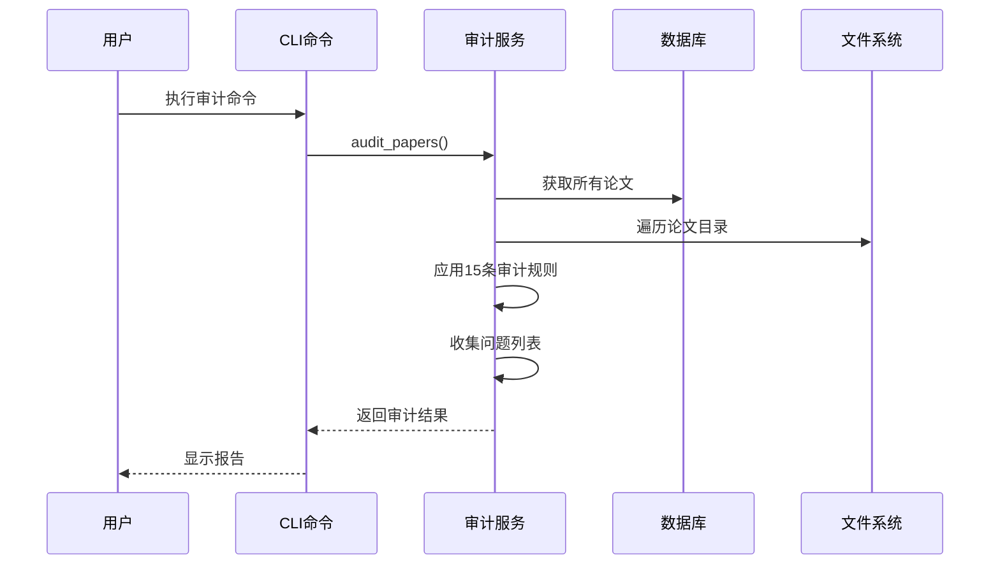

**图表来源**
- [src/drbrain/services/audit.py:30-309](file://src/drbrain/services/audit.py#L30-L309)

**章节来源**
- [src/drbrain/services/audit.py:30-309](file://src/drbrain/services/audit.py#L30-L309)

### 引用样式服务组件

引用样式服务提供了灵活的参考文献格式化功能：

#### 支持的样式
- **APA 7th Edition**：作者-年份格式，用于社会科学领域
- **Vancouver/IJMJE**：数字编号格式，用于生物医学期刊
- **Chicago Author-Date**：芝加哥格式作者-日期变体
- **MLA 9th Edition**：现代语言协会格式

#### 自定义样式支持
用户可以通过创建Python文件实现自定义引用格式，文件需要包含 `format_ref(meta, idx)` 函数，该函数接受论文元数据和索引参数，返回格式化的引用字符串。

**章节来源**
- [src/drbrain/services/citation_styles.py:32-219](file://src/drbrain/services/citation_styles.py#L32-L219)
- [src/drbrain/services/citation_styles.py:268-325](file://src/drbrain/services/citation_styles.py#L268-L325)

## 架构概览

DrBrain 的翻译与审计服务采用分层架构设计，确保了系统的可扩展性和维护性：

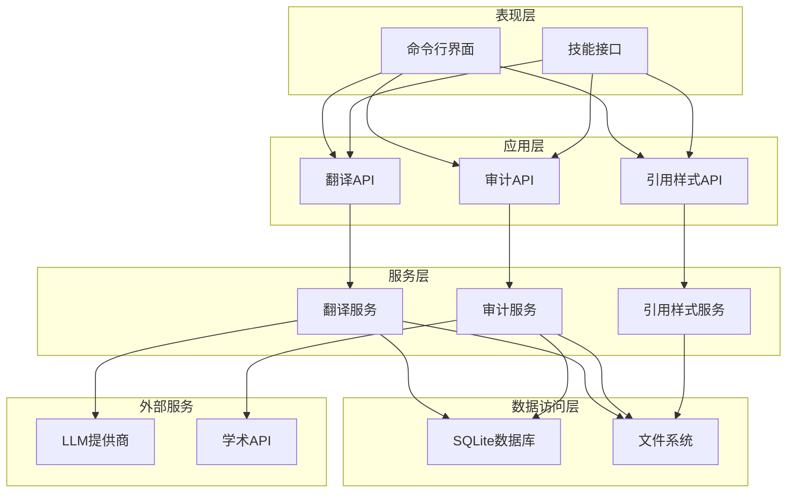

**图表来源**
- [src/drbrain/cli/build_commands.py:16-95](file://src/drbrain/cli/build_commands.py#L16-L95)
- [src/drbrain/cli/export_commands.py:429-478](file://src/drbrain/cli/export_commands.py#L429-L478)

### 组件交互模式

系统采用事件驱动的异步处理模式，各组件之间通过清晰的接口进行通信：

#### 翻译组件交互
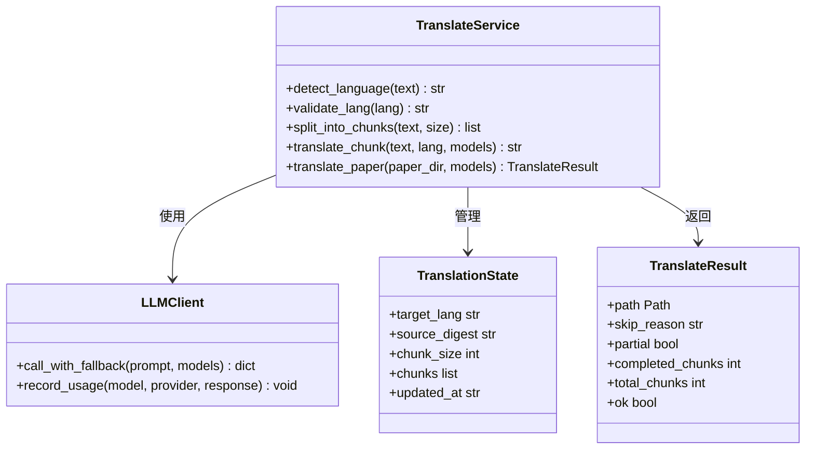

**图表来源**
- [src/drbrain/services/translate.py:35-46](file://src/drbrain/services/translate.py#L35-L46)
- [src/drbrain/services/translate.py:16-18](file://src/drbrain/services/translate.py#L16-L18)

**章节来源**
- [src/drbrain/services/translate.py:1-726](file://src/drbrain/services/translate.py#L1-L726)

## 详细组件分析

### 翻译服务深度分析

#### 语言检测算法
翻译服务实现了多语言检测算法，能够准确识别不同语言的混合文本：

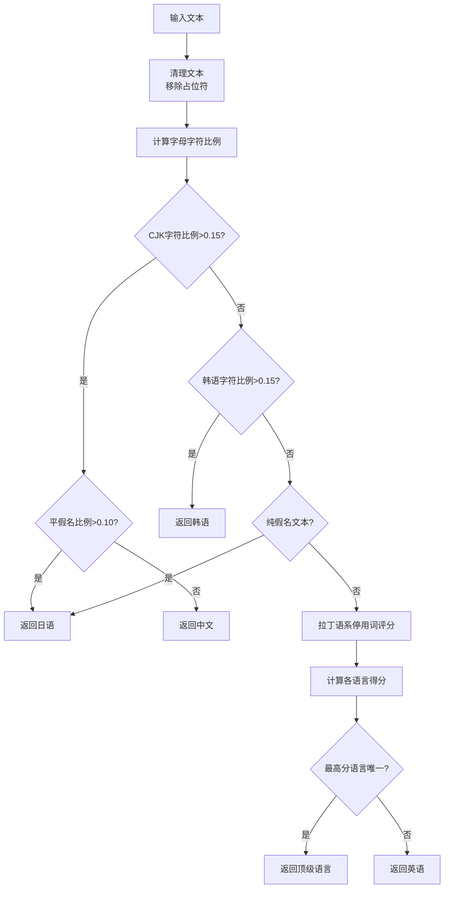

**图表来源**
- [src/drbrain/services/translate.py:95-142](file://src/drbrain/services/translate.py#L95-L142)

#### 占位符保护机制
为了确保翻译质量，系统实现了复杂的占位符保护机制：

| 占位符类型 | 正则表达式模式 | 保护策略 |
|-----------|---------------|----------|
| 代码块 | ```[\s\S]*?``` | 完整保留，不进行翻译 |
| 显示数学公式 | $$[\s\S]*?\$\$ | 完整保留，不进行翻译 |
| 内联数学公式 | (?<!\$)\$(?!\$)(?:[^\$\\]|\\.)+\$(?!\$) | 完整保留，不进行翻译 |
| 图像引用 | !\[.*?\]\(.*?\) | 完整保留，不进行翻译 |

**章节来源**
- [src/drbrain/services/translate.py](file://src/drbrain/services/translate.py#L48-L57)
- [src/drbrain/services/translate.py](file://src/drbrain/services/translate.py#L418-L469)

#### 并发翻译架构
翻译服务采用线程池并发处理多个翻译块：

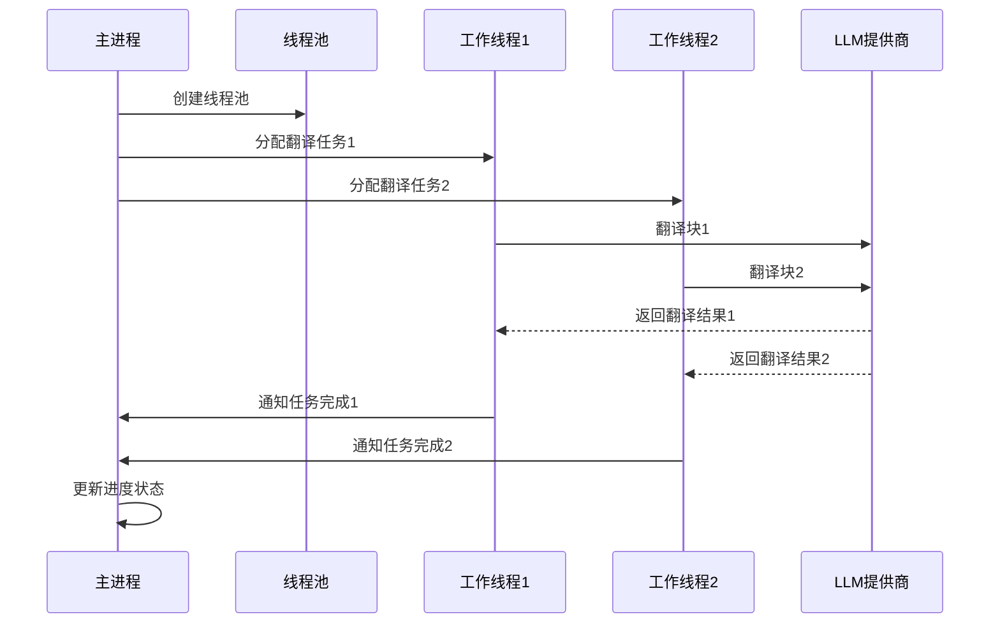

**图表来源**
- [src/drbrain/services/translate.py](file://src/drbrain/services/translate.py#L650-L692)

**章节来源**
- [src/drbrain/services/translate.py](file://src/drbrain/services/translate.py#L522-L560)
- [src/drbrain/services/translate.py](file://src/drbrain/services/translate.py#L650-L692)

### 审计服务深度分析

#### 规则执行引擎
审计服务实现了规则驱动的检查机制：

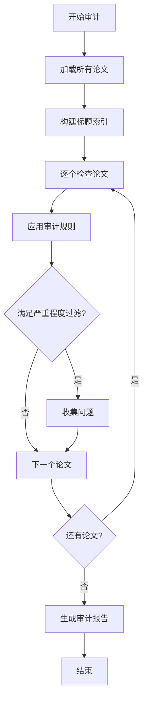

**图表来源**
- [src/drbrain/services/audit.py](file://src/drbrain/services/audit.py#L30-L309)

#### 问题分类和严重程度
审计服务将发现的问题按照严重程度进行分类：

| 严重程度 | 规则数量 | 描述 | 建议操作 |
|---------|---------|------|---------|
| 错误 | 2 | 必须立即修复的问题 | 立即修复，阻止进一步处理 |
| 警告 | 8 | 应该修复的问题 | 优先修复，影响数据质量 |
| 信息 | 4 | 可以忽略的问题 | 了解即可，不影响核心功能 |

**章节来源**
- [src/drbrain/services/audit.py](file://src/drbrain/services/audit.py#L17-L309)

### 引用样式服务深度分析

#### 样式加载机制
引用样式服务支持内置样式和自定义样式的动态加载：

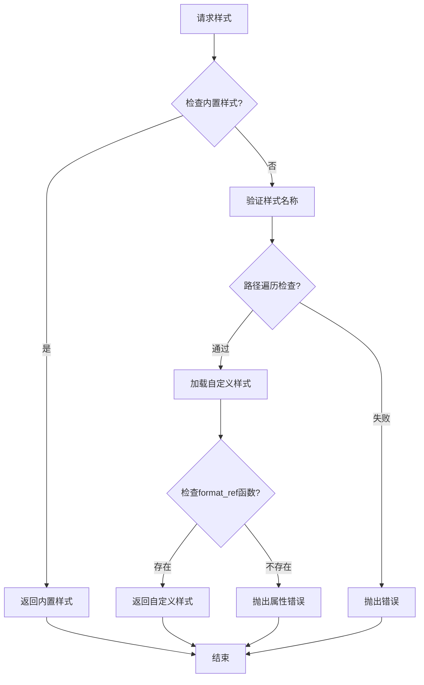

**图表来源**
- [src/drbrain/services/citation_styles.py](file://src/drbrain/services/citation_styles.py#L268-L325)

#### 样式格式化算法
不同引用样式的格式化遵循特定的规则：

**APA格式规则**：
- 作者：最多3个作者用逗号分隔，超过3个用"et al."
- 年份：括号包围
- 标题：原文标题
- 期刊：斜体，卷号斜体，期号括号，页码范围
- DOI：URL链接

**Vancouver格式规则**：
- 数字编号格式
- 作者：最多6个作者全名，超过6个用"et al."
- 期刊：斜体
- 年份：直接跟在期刊后
- 卷号：分号分隔
- 期号：括号
- 页码：冒号分隔
- DOI：以"doi:"前缀

**章节来源**
- [src/drbrain/services/citation_styles.py](file://src/drbrain/services/citation_styles.py#L32-L219)

## 依赖关系分析

### 外部依赖

系统对外部服务的依赖关系如下：

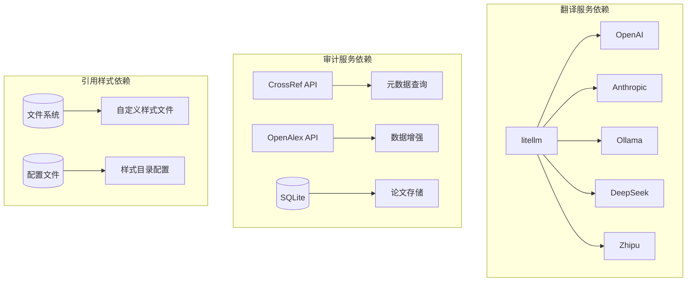

**图表来源**
- [config.example.yaml](file://config.example.yaml#L12-L66)
- [src/drbrain/services/audit.py](file://src/drbrain/services/audit.py#L14-L16)

### 内部组件依赖

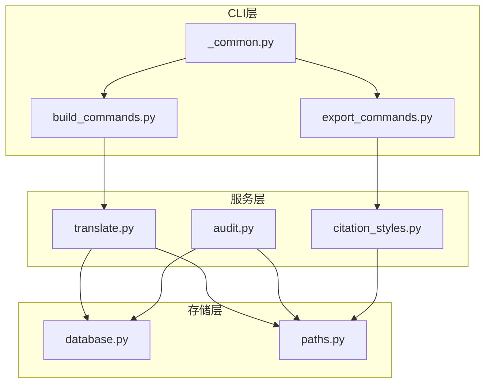

**图表来源**
- [src/drbrain/cli/build_commands.py](file://src/drbrain/cli/build_commands.py#L16-L95)
- [src/drbrain/cli/export_commands.py](file://src/drbrain/cli/export_commands.py#L429-L478)

**章节来源**
- [src/drbrain/cli/build_commands.py](file://src/drbrain/cli/build_commands.py#L1-L214)
- [src/drbrain/cli/export_commands.py](file://src/drbrain/cli/export_commands.py#L429-L501)

## 性能考虑

### 翻译性能优化

翻译服务采用了多项性能优化策略：

#### 内存管理
- **增量写入**：翻译结果采用临时文件写入，完成后原子性重命名
- **工作目录隔离**：每个翻译任务使用独立的工作目录，避免文件竞争
- **状态持久化**：定期保存翻译状态，支持断点续传

#### 网络优化
- **模型回退链**：配置多个LLM提供商，自动切换失败的模型
- **指数退避**：API调用失败时采用指数退避策略
- **并发控制**：通过线程池限制并发数量，避免资源耗尽

#### 存储优化
- **分块处理**：大文件分割为固定大小的块进行处理
- **占位符保护**：避免在翻译过程中修改代码和公式
- **缓存机制**：利用API响应缓存减少重复请求

### 审计性能优化

审计服务针对大数据量进行了专门优化：

#### 查询优化
- **批量处理**：数据库查询采用批量方式执行
- **索引利用**：合理使用数据库索引提高查询速度
- **内存管理**：使用生成器模式处理大量数据

#### 计算优化
- **并行执行**：支持多线程并行处理不同论文
- **智能跳过**：跳过不需要检查的论文
- **增量更新**：只检查发生变化的数据

### 引用样式性能优化

引用样式服务的性能特点：

#### 动态加载
- **按需加载**：只在需要时加载样式文件
- **缓存机制**：已加载的样式文件进行缓存
- **路径安全**：严格的路径遍历检查

#### 格式化优化
- **批量处理**：支持批量格式化多个引用
- **内存效率**：使用生成器减少内存占用
- **字符串优化**：高效的字符串拼接和格式化

## 故障排除指南

### 翻译服务故障排除

#### 常见问题及解决方案

**问题1：翻译失败**
- **症状**：翻译过程中出现错误，无法完成
- **原因**：LLM API调用失败、网络连接问题
- **解决方案**：检查配置文件中的API密钥，确认网络连接，查看日志文件

**问题2：翻译卡住**
- **症状**：翻译进度停止，长时间无响应
- **原因**：某个翻译块处理时间过长
- **解决方案**：增加超时设置，检查LLM提供商状态

**问题3：输出文件损坏**
- **症状**：生成的翻译文件内容不完整
- **原因**：文件写入过程中断
- **解决方案**：重新运行翻译命令，检查磁盘空间

#### 调试技巧
- **启用详细日志**：使用 `--json` 选项获取详细的进度信息
- **检查中间文件**：查看 `.translate_{lang}` 目录中的临时文件
- **验证配置**：确认 `config.yaml` 中的LLM配置正确

**章节来源**
- [src/drbrain/services/translate.py](file://src/drbrain/services/translate.py#L680-L726)

### 审计服务故障排除

#### 常见问题及解决方案

**问题1：审计结果不完整**
- **症状**：某些规则没有产生结果
- **原因**：论文数据不完整或规则条件不满足
- **解决方案**：检查论文元数据完整性，确认规则适用性

**问题2：性能问题**
- **症状**：审计过程执行缓慢
- **原因**：数据库查询效率低
- **解决方案**：优化数据库索引，分批处理大量数据

**问题3：权限问题**
- **症状**：无法访问某些论文目录
- **原因**：文件系统权限不足
- **解决方案**：检查目录权限设置

#### 调试技巧
- **降低严重程度**：使用 `--severity error` 只检查关键问题
- **分区域审计**：使用 `--workspace` 参数限制审计范围
- **JSON输出**：使用 `--json` 选项获取机器可读的输出

**章节来源**
- [src/drbrain/services/audit.py](file://src/drbrain/services/audit.py#L312-L396)

### 引用样式故障排除

#### 常见问题及解决方案

**问题1：样式加载失败**
- **症状**：自定义样式文件无法加载
- **原因**：Python语法错误、缺少必需函数
- **解决方案**：检查Python文件语法，确认包含 `format_ref` 函数

**问题2：格式化结果异常**
- **症状**：生成的引用格式不符合预期
- **原因**：元数据字段缺失或格式不正确
- **解决方案**：检查论文元数据完整性，确认字段命名

**问题3：性能问题**
- **症状**：大量引用格式化时响应缓慢
- **原因**：样式文件过大或复杂度高
- **解决方案**：优化样式文件，考虑缓存机制

**章节来源**
- [src/drbrain/services/citation_styles.py](file://src/drbrain/services/citation_styles.py#L268-L325)

## 结论

翻译与审计服务为 DrBrain 系统提供了强大的内容处理和质量保证能力。翻译服务通过智能的语言检测、占位符保护和并发处理机制，确保了学术论文翻译的高质量和高效率。审计服务通过全面的规则检查和分级报告，帮助用户及时发现和解决数据质量问题。引用样式服务提供了灵活的格式化功能，满足了不同学术领域的引用需求。

这些服务的设计充分考虑了可扩展性、性能和用户体验，为构建大规模知识图谱系统奠定了坚实的基础。通过持续的优化和改进，这些服务将继续为学术研究和知识管理提供强有力的支持。

## 附录

### 配置示例

#### LLM配置
```yaml
llm:
  models:
    - provider: openai
      model: gpt-4o
      api_key: "${OPENAI_API_KEY}"
      base_url: null
```

#### 数据目录配置
```yaml
dirs:
  papers: "data/papers"
  reports: "data/reports"
  cache: "data/cache"
  logs: "data/logs"
```

### 测试覆盖

系统提供了全面的测试覆盖，包括单元测试和集成测试：

- **翻译服务测试**：覆盖语言检测、分块处理、并发翻译等核心功能
- **审计服务测试**：覆盖15条审计规则的正确性和性能
- **引用样式测试**：覆盖内置样式和自定义样式的格式化功能

**章节来源**
- [tests/test_translate.py:1-200](file://tests/test_translate.py#L1-L200)
- [tests/test_audit.py:1-200](file://tests/test_audit.py#L1-L200)
- [tests/test_citation_styles.py:1-62](file://tests/test_citation_styles.py#L1-L62)