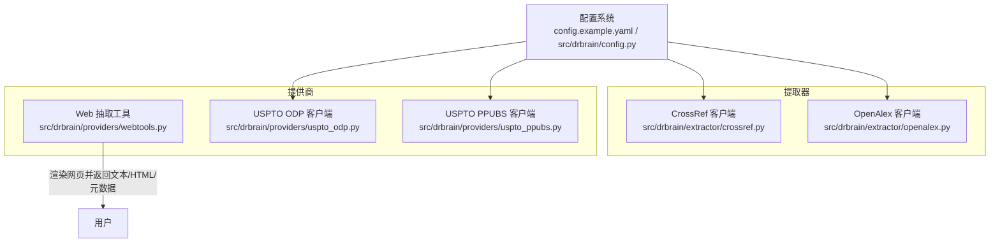
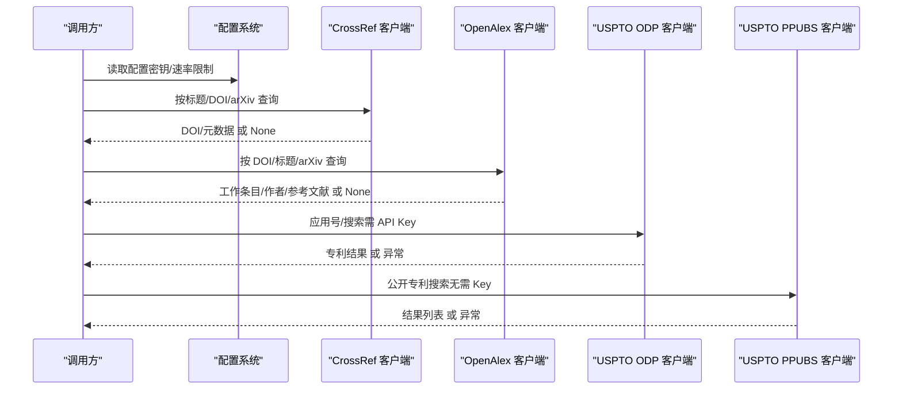
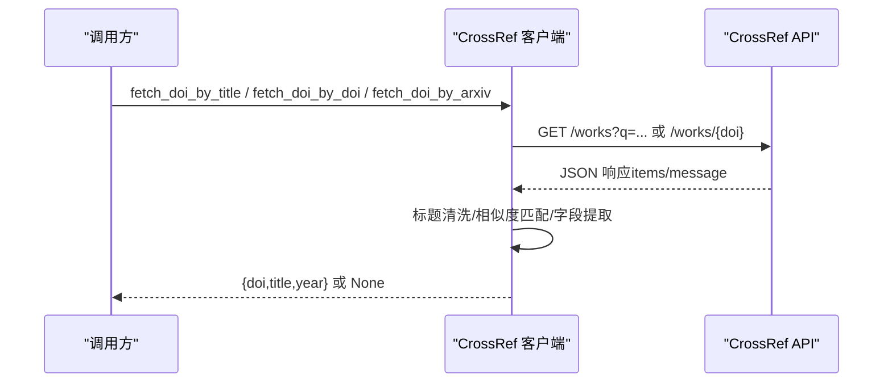
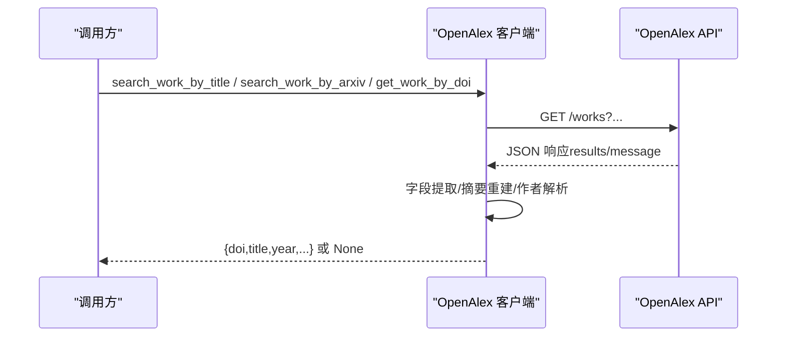
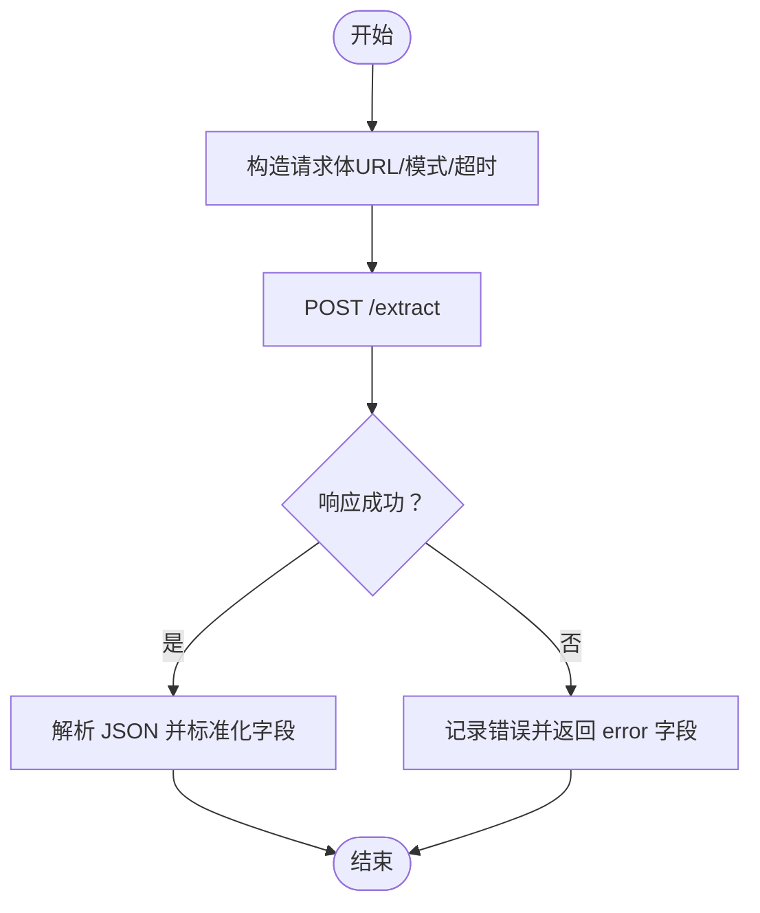
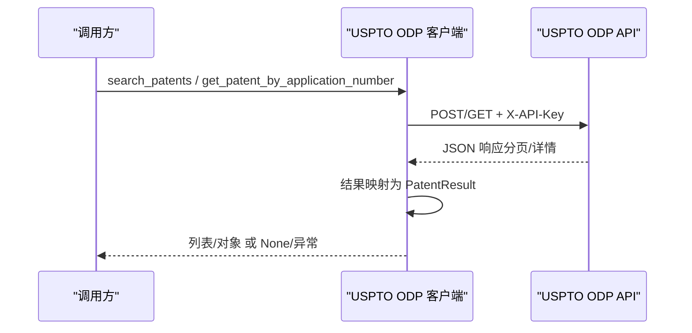
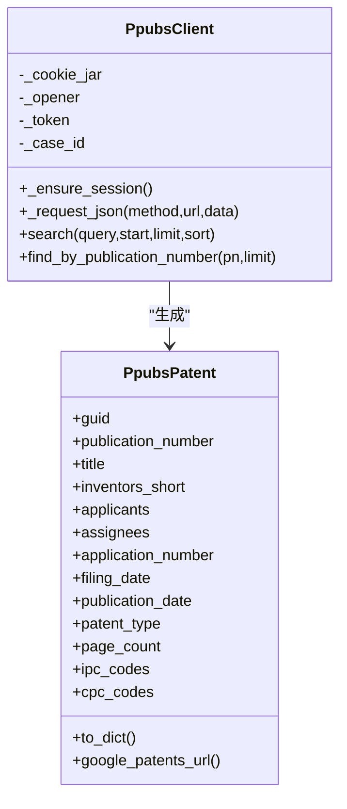
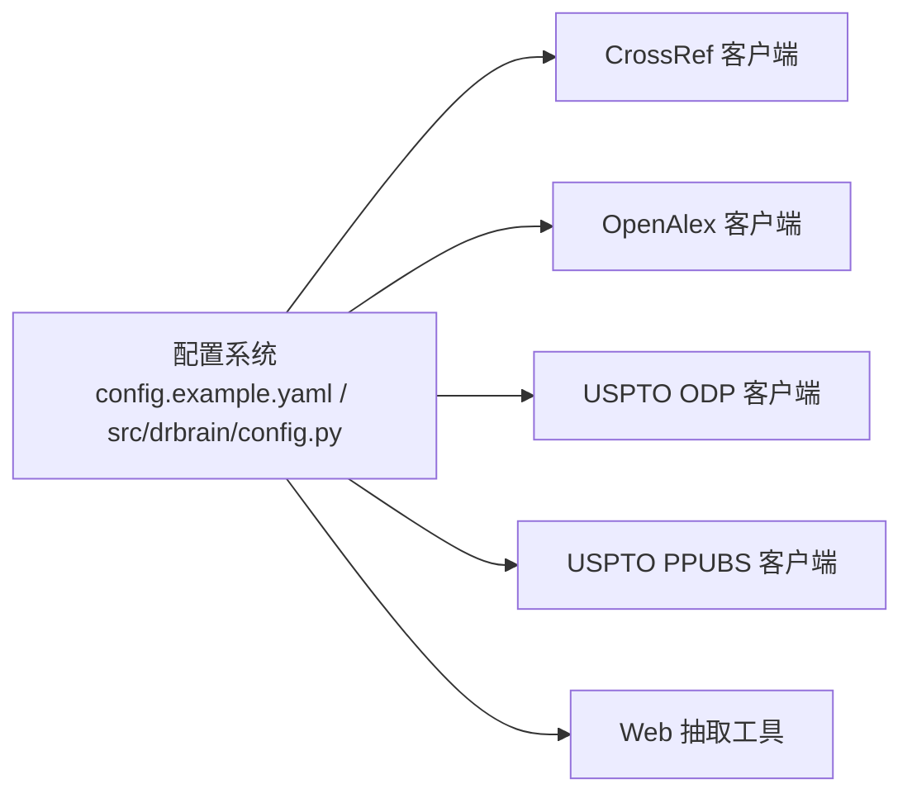

# 外部集成 API

<cite>
**本文引用的文件**
- [src/drbrain/extractor/crossref.py](file://src/drbrain/extractor/crossref.py)
- [src/drbrain/extractor/openalex.py](file://src/drbrain/extractor/openalex.py)
- [src/drbrain/providers/webtools.py](file://src/drbrain/providers/webtools.py)
- [src/drbrain/providers/uspto_odp.py](file://src/drbrain/providers/uspto_odp.py)
- [src/drbrain/providers/uspto_ppubs.py](file://src/drbrain/providers/uspto_ppubs.py)
- [config.example.yaml](file://config.example.yaml)
- [src/drbrain/config.py](file://src/drbrain/config.py)
- [tests/test_crossref.py](file://tests/test_crossref.py)
- [tests/test_openalex.py](file://tests/test_openalex.py)
- [README.md](file://README.md)
</cite>

## 目录
1. [简介](#简介)
2. [项目结构](#项目结构)
3. [核心组件](#核心组件)
4. [架构总览](#架构总览)
5. [详细组件分析](#详细组件分析)
6. [依赖分析](#依赖分析)
7. [性能考虑](#性能考虑)
8. [故障排除指南](#故障排除指南)
9. [结论](#结论)
10. [附录](#附录)

## 简介
本文件面向 DrBrain 的外部集成 API，系统性记录与以下外部服务的对接能力与使用规范：
- CrossRef：基于标题/DOI/arXiv 查询 DOI 及元数据
- OpenAlex：工作条目查询、作者信息、参考文献、批量检索
- Semantic Scholar：通过配置项支持（速率限制与密钥在配置中定义）
- USPTO：ODP（需 API Key）与 PPUBS（无需 Key）专利检索与详情查询

文档覆盖请求格式、认证方法、响应数据结构、错误处理策略、API 限制与速率限制、使用配额建议、最佳实践与故障排除。

## 项目结构
DrBrain 将外部服务集成以“提取器”和“提供商”两类模块组织：
- 提取器（extractor）：封装学术元数据 API（CrossRef、OpenAlex），提供统一的查询与增强接口
- 提供商（providers）：封装网页抽取服务与专利数据库（USPTO ODP/PPUBS）

图表来源
- [src/drbrain/extractor/crossref.py:1-180](file://src/drbrain/extractor/crossref.py#L1-L180)
- [src/drbrain/extractor/openalex.py:1-421](file://src/drbrain/extractor/openalex.py#L1-L421)
- [src/drbrain/providers/webtools.py:1-135](file://src/drbrain/providers/webtools.py#L1-L135)
- [src/drbrain/providers/uspto_odp.py:1-289](file://src/drbrain/providers/uspto_odp.py#L1-L289)
- [src/drbrain/providers/uspto_ppubs.py:1-350](file://src/drbrain/providers/uspto_ppubs.py#L1-L350)
- [config.example.yaml:90-98](file://config.example.yaml#L90-L98)
- [src/drbrain/config.py:60-67](file://src/drbrain/config.py#L60-L67)

章节来源
- [README.md:45-58](file://README.md#L45-L58)

## 核心组件
- CrossRef 客户端：支持按标题、DOI、arXiv 查找 DOI 与基础元数据；内置会话重试与标题相似度匹配
- OpenAlex 客户端：支持按标题/DOI/arXiv 查询工作条目，获取作者、摘要重建、参考文献、批量检索
- Web 抽取工具：调用本地或自建的 qt-web-extractor 服务，返回页面文本、HTML、图片等
- USPTO ODP 客户端：需 API Key，支持应用号检索与分页搜索
- USPTO PPUBS 客户端：无需 API Key，自动维护会话与令牌刷新，支持公开专利检索

章节来源
- [src/drbrain/extractor/crossref.py:17-180](file://src/drbrain/extractor/crossref.py#L17-L180)
- [src/drbrain/extractor/openalex.py:17-421](file://src/drbrain/extractor/openalex.py#L17-L421)
- [src/drbrain/providers/webtools.py:21-135](file://src/drbrain/providers/webtools.py#L21-L135)
- [src/drbrain/providers/uspto_odp.py:185-289](file://src/drbrain/providers/uspto_odp.py#L185-L289)
- [src/drbrain/providers/uspto_ppubs.py:87-350](file://src/drbrain/providers/uspto_ppubs.py#L87-L350)

## 架构总览
DrBrain 在配置层集中管理外部 API 的密钥与速率限制参数，并在各客户端内部实现请求构建、重试与错误处理。对外暴露统一的函数式接口，便于上层服务编排。

图表来源
- [config.example.yaml:90-98](file://config.example.yaml#L90-L98)
- [src/drbrain/config.py:60-67](file://src/drbrain/config.py#L60-L67)
- [src/drbrain/extractor/crossref.py:49-180](file://src/drbrain/extractor/crossref.py#L49-L180)
- [src/drbrain/extractor/openalex.py:47-421](file://src/drbrain/extractor/openalex.py#L47-L421)
- [src/drbrain/providers/uspto_odp.py:221-289](file://src/drbrain/providers/uspto_odp.py#L221-L289)
- [src/drbrain/providers/uspto_ppubs.py:331-350](file://src/drbrain/providers/uspto_ppubs.py#L331-L350)

## 详细组件分析

### CrossRef 集成
- 功能要点
  - 支持按标题、DOI、arXiv 查询 DOI 与基础元数据
  - 标题匹配采用清洗与相似度阈值策略，避免误匹配
  - 使用会话与指数回退重试，提升稳定性
- 认证与请求头
  - 支持可选的邮件头（用于 Polite Pool）
  - 使用标准 JSON 响应头
- 响应数据结构
  - 成功时返回：doi、title、year
  - 失败时返回 None（内部捕获异常并记录日志）
- 错误处理
  - 网络/超时/HTTP 异常统一捕获并返回 None
  - 标题为空或无匹配时返回 None
- 速率限制与配额
  - 未在客户端内硬编码速率限制；可通过配置中的邮件头进入 Polite Pool
- 最佳实践
  - 优先使用 DOI 直查，减少标题模糊匹配
  - 对 arXiv ID 建议去除版本后缀再查询
  - 合理设置超时与重试次数，避免阻塞

图表来源
- [src/drbrain/extractor/crossref.py:49-180](file://src/drbrain/extractor/crossref.py#L49-L180)

章节来源
- [src/drbrain/extractor/crossref.py:17-180](file://src/drbrain/extractor/crossref.py#L17-L180)
- [tests/test_crossref.py:16-279](file://tests/test_crossref.py#L16-L279)
- [config.example.yaml](file://config.example.yaml#L96)

### OpenAlex 集成
- 功能要点
  - 支持按标题、arXiv、DOI 查询工作条目
  - 获取作者信息（含短 ID、显示名、ORCID、机构）
  - 参考文献获取与批量检索（最多 50 条）
  - 摘要重建：从倒排索引还原纯文本摘要
- 认证与请求头
  - 可选 Token，用于提升速率限制
  - 当提供 Token 时设置 User-Agent（mailto）
- 响应数据结构
  - 基础查询：doi、title、year、openalex_id
  - 丰富查询：abstract、cited_by_count、journal、authors、volume、pages
  - 作者查询：author_id、display_name、orcid、raw_affiliation
- 错误处理
  - 网络/超时/HTTP 异常统一捕获并返回 None/空列表
  - 对返回包含 error 字段的响应直接判定失败
- 速率限制与配额
  - 客户端未内置速率限制；通过 Token 与合理的并发控制降低被限风险
- 最佳实践
  - 优先使用 DOI 查询作者信息，失败时回退到标题
  - 批量检索时注意上限（50 条）
  - 摘要重建仅在需要完整文本摘要时启用

图表来源
- [src/drbrain/extractor/openalex.py:47-421](file://src/drbrain/extractor/openalex.py#L47-L421)

章节来源
- [src/drbrain/extractor/openalex.py:17-421](file://src/drbrain/extractor/openalex.py#L17-L421)
- [tests/test_openalex.py:19-561](file://tests/test_openalex.py#L19-L561)
- [config.example.yaml:94-97](file://config.example.yaml#L94-L97)

### Semantic Scholar 集成
- 配置项
  - s2_api_key：API 密钥
  - s2_rate_limit：每分钟请求数（默认 100）
- 使用建议
  - 在高并发场景下，结合速率限制配置进行节流
  - 优先使用其他更稳定的学术元数据源作为主通道
- 注意
  - 本节为配置与使用建议，不涉及具体实现细节

章节来源
- [config.example.yaml:93-94](file://config.example.yaml#L93-L94)

### Web 抽取服务（qt-web-extractor）
- 功能要点
  - 调用外部渲染服务，返回页面文本、HTML、图片、提取时间戳
  - 支持强制 PDF 模式与超时控制
  - 健康检查接口用于探测服务可用性
- 环境变量
  - WEBEXTRACT_URL 或 QT_WEB_EXTRACTOR_URL：服务地址
  - WEBEXTRACT_TIMEOUT：请求超时（秒，默认 60）
- 响应数据结构
  - 成功：url、title、text/markdown、html、images、extracted_at
  - 失败：error 字段描述错误原因
- 错误处理
  - HTTPError/URLError/OSError/ValueError 统一转换为包含 error 的字典
- 最佳实践
  - 保证服务可达性，定期健康检查
  - 控制超时与并发，避免阻塞

图表来源
- [src/drbrain/providers/webtools.py:35-116](file://src/drbrain/providers/webtools.py#L35-L116)

章节来源
- [src/drbrain/providers/webtools.py:21-135](file://src/drbrain/providers/webtools.py#L21-L135)

### USPTO ODP 集成（需 API Key）
- 功能要点
  - 分页搜索应用号（OpenSearch 语法）
  - 按应用号查询专利详情
  - 结果对象包含发明人、申请人、申请/授权/公开日期、专利号等
- 认证与请求头
  - X-API-Key：API Key
  - User-Agent：固定值
- 响应数据结构
  - 列表：PatentResult（包含多个元数据字段）
  - 单个：PatentResult 或 None（404）
- 错误处理
  - HTTPError/URLError/JSON 解析异常统一包装为 USPTOAPIError
- 速率限制与配额
  - 未在客户端内硬编码；注册后按官方配额使用
- 最佳实践
  - 合理设置 limit（1-100）与 offset
  - 对 404 返回进行显式 None 处理

图表来源
- [src/drbrain/providers/uspto_odp.py:185-289](file://src/drbrain/providers/uspto_odp.py#L185-L289)

章节来源
- [src/drbrain/providers/uspto_odp.py:1-289](file://src/drbrain/providers/uspto_odp.py#L1-L289)

### USPTO PPUBS 集成（无需 API Key）
- 功能要点
  - 自动建立会话并维护令牌，支持 403 自动刷新
  - 支持按查询词搜索与按公开号精确查找
  - 结果对象包含发明人、申请人、IPC/CPC 分类、页数等
- 认证与请求头
  - 通过会话 API 获取 X-Access-Token
  - 固定 User-Agent 与 referer/origin 等头部
- 响应数据结构
  - 搜索：总数与 PpubsPatent 列表
  - 单个：PpubsPatent 或 None
- 错误处理
  - 403 自动刷新令牌并重试
  - 其他 HTTPError/URLError/JSON 解析异常统一包装为 PpubsError
- 速率限制与配额
  - 未在客户端内硬编码；建议控制并发与重试次数
- 最佳实践
  - 合理设置 limit（1-100）
  - 对公开号进行规范化后再查询

图表来源
- [src/drbrain/providers/uspto_ppubs.py:87-350](file://src/drbrain/providers/uspto_ppubs.py#L87-L350)

章节来源
- [src/drbrain/providers/uspto_ppubs.py:1-350](file://src/drbrain/providers/uspto_ppubs.py#L1-L350)

## 依赖分析
- 配置系统
  - 通过 config.example.yaml 与 src/drbrain/config.py 提供统一的键值访问与环境变量解析
  - 关键键包括：s2_api_key、s2_rate_limit、crossref_email、openalex_token、cache_ttl 等
- 外部依赖
  - requests + urllib3 Retry：跨服务通用的稳定连接与重试机制
  - loguru：统一日志输出，便于问题定位

图表来源
- [config.example.yaml:90-98](file://config.example.yaml#L90-L98)
- [src/drbrain/config.py:60-67](file://src/drbrain/config.py#L60-L67)

章节来源
- [config.example.yaml:90-98](file://config.example.yaml#L90-L98)
- [src/drbrain/config.py:60-67](file://src/drbrain/config.py#L60-L67)

## 性能考虑
- 重试与超时
  - CrossRef 与 OpenAlex 客户端均使用会话级重试适配器，对 429/5xx 自动重试
  - 建议根据网络状况调整超时与重试参数
- 并发与限速
  - Semantic Scholar 通过 s2_rate_limit 进行速率限制
  - USPTO PPUBS 内置会话刷新与有限重试，避免频繁 403
- 缓存
  - 配置项 cache_ttl 控制 API 响应缓存时长（秒），建议在高频查询场景开启

章节来源
- [src/drbrain/extractor/crossref.py:17-29](file://src/drbrain/extractor/crossref.py#L17-L29)
- [src/drbrain/extractor/openalex.py:17-29](file://src/drbrain/extractor/openalex.py#L17-L29)
- [config.example.yaml](file://config.example.yaml#L95)

## 故障排除指南
- 常见错误与处理
  - 网络/超时：检查代理、防火墙与超时设置；适当增加重试次数
  - HTTP 401/403：确认密钥是否正确（OpenAlex Token、USPTO API Key）
  - HTTP 429：触发重试或降低并发；必要时使用更高配额的 Token
  - JSON 解析失败：检查响应体是否完整，关注服务端变更
  - Web 抽取服务不可达：检查 WEBEXTRACT_URL/WEBEXTRACT_TIMEOUT，执行健康检查
- 日志与可观测性
  - 客户端均使用 loguru 输出关键事件与错误详情，便于定位问题
- 测试参考
  - 通过单元测试验证行为边界（如空输入、错误响应、标题匹配等）

章节来源
- [src/drbrain/extractor/crossref.py:82-84](file://src/drbrain/extractor/crossref.py#L82-L84)
- [src/drbrain/extractor/openalex.py:146-148](file://src/drbrain/extractor/openalex.py#L146-L148)
- [src/drbrain/providers/webtools.py:42-51](file://src/drbrain/providers/webtools.py#L42-L51)
- [tests/test_crossref.py:108-116](file://tests/test_crossref.py#L108-L116)
- [tests/test_openalex.py:262-280](file://tests/test_openalex.py#L262-L280)

## 结论
DrBrain 的外部集成 API 通过统一的客户端与配置体系，实现了对 CrossRef、OpenAlex、Semantic Scholar、USPTO 等服务的稳健接入。建议在生产环境中：
- 明确配置密钥与速率限制
- 合理设置超时与重试策略
- 使用缓存与并发控制平衡吞吐与成本
- 借助日志与测试持续监控与优化

## 附录
- 配置键说明（摘自配置模板）
  - s2_api_key：Semantic Scholar API 密钥
  - s2_rate_limit：每分钟请求数
  - crossref_email：CrossRef Polite Pool 邮件头
  - openalex_token：OpenAlex Token（提升速率限制）
  - cache_ttl：API 响应缓存 TTL（秒）

章节来源
- [config.example.yaml:90-98](file://config.example.yaml#L90-L98)
- [src/drbrain/config.py:60-67](file://src/drbrain/config.py#L60-L67)