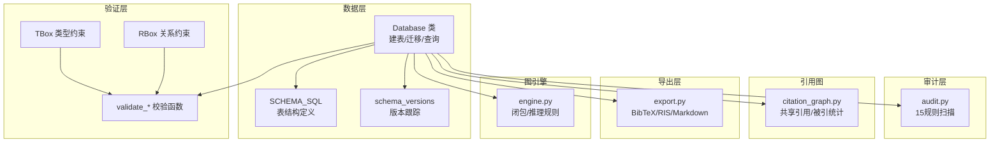
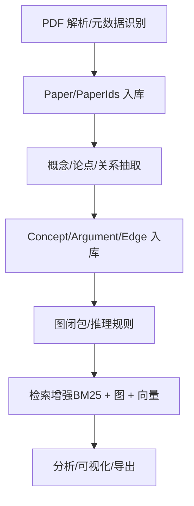
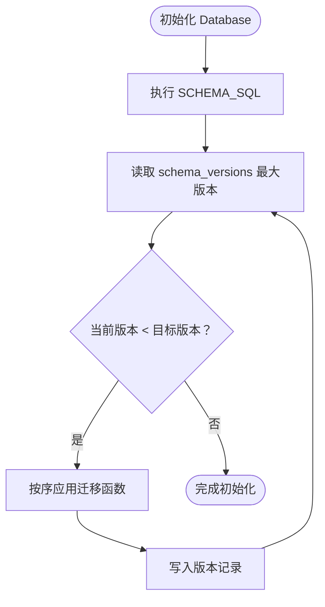
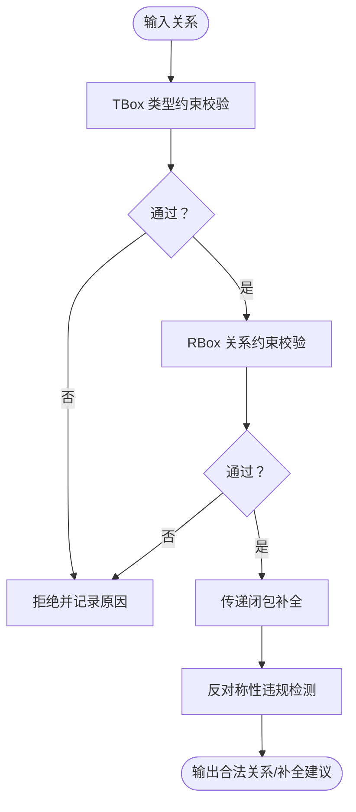
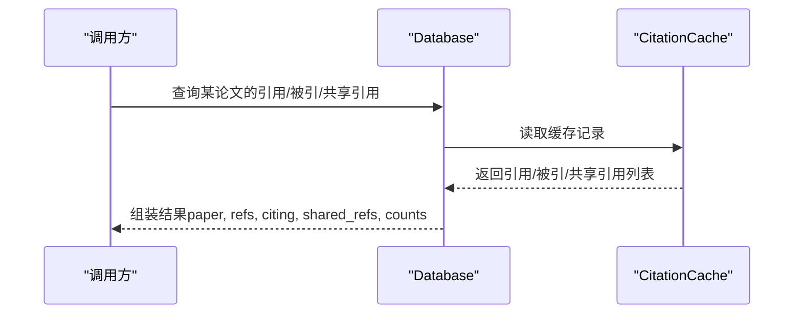
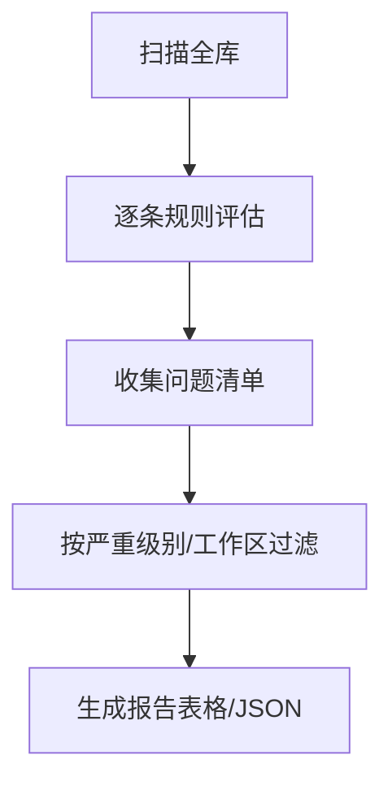

# 数据模型与架构

<cite>
**本文引用的文件**
- [database.py](file://src/drbrain/storage/database.py)
- [architecture.md](file://docs/architecture.md)
- [schema.py](file://src/drbrain/validator/schema.py)
- [audit.py](file://src/drbrain/services/audit.py)
- [citation_graph.py](file://src/drbrain/storage/citation_graph.py)
- [export.py](file://src/drbrain/storage/export.py)
- [engine.py](file://src/drbrain/graph/engine.py)
- [database-guidelines.md](file://.trellis/spec/backend/database-guidelines.md)
- [test_layer1_db_schema.py](file://tests/test_layer1_db_schema.py)
- [test_genealogy.py](file://tests/test_genealogy.py)
- [test_concept.py](file://tests/test_concept.py)
- [test_validator_schema.py](file://tests/test_validator_schema.py)
</cite>

## 目录
1. [简介](#简介)
2. [项目结构](#项目结构)
3. [核心组件](#核心组件)
4. [架构总览](#架构总览)
5. [详细组件分析](#详细组件分析)
6. [依赖分析](#依赖分析)
7. [性能考虑](#性能考虑)
8. [故障排查指南](#故障排查指南)
9. [结论](#结论)
10. [附录](#附录)

## 简介
本文件系统化梳理 DrBrain 的数据模型与架构，聚焦核心数据实体（Paper、Concept、Edge、Argument 等）的字段定义、关系约束与数据类型；记录数据库表结构、索引设计与查询模式；总结数据验证规则、业务规则与数据生命周期管理；并提供数据迁移指南与版本兼容性说明。目标是帮助开发者与使用者在理解知识图谱构建流程的同时，掌握底层数据层的设计原则与演进路径。

## 项目结构
DrBrain 的数据层以 SQLite 为核心，采用 WAL 模式提升并发读写能力，并通过内嵌的自动迁移机制保证模式演进的向后兼容。关键模块包括：
- 存储层：统一的数据库类负责建表、迁移、增删改查与批量操作
- 验证层：基于 TBox/RBox 的类型与关系约束校验
- 审计层：全库质量扫描与问题报告
- 引用图：论文引用网络的统计与查询
- 导出层：元数据导出到多种格式
- 图引擎：基于规则的闭包推理与图遍历



**图表来源**
- [database.py:10-156](file://src/drbrain/storage/database.py#L10-L156)
- [schema.py:7-51](file://src/drbrain/validator/schema.py#L7-L51)
- [audit.py:30-309](file://src/drbrain/services/audit.py#L30-L309)
- [citation_graph.py:8-128](file://src/drbrain/storage/citation_graph.py#L8-L128)
- [export.py:68-179](file://src/drbrain/storage/export.py#L68-L179)
- [engine.py:165-922](file://src/drbrain/graph/engine.py#L165-L922)

**章节来源**
- [database.py:10-156](file://src/drbrain/storage/database.py#L10-L156)
- [architecture.md:239-256](file://docs/architecture.md#L239-L256)

## 核心组件
本节从“实体-关系-属性”的角度，系统描述 DrBrain 的核心数据模型。

- Paper（论文）
  - 字段：local_id（主键）、title、abstract、year、paper_type、status、journal、publisher、citation_count、volume、pages、authors、created_at
  - 约束：paper_type ∈ {paper, review, thesis, preprint, book, document}；status ∈ {uploaded, placeholder, merged, extracted}
  - 用途：承载论文元数据与状态流转，支持外部 ID 映射（paper_ids）

- PaperIds（外部 ID 映射）
  - 字段：local_id（外键，级联删除）、doi、arxiv、s2_id、openalex_id（唯一）
  - 用途：跨源标识符去重与快速查找

- Concept（概念）
  - 字段：concept_id（自增主键）、local_id（外键）、type、label、confidence、section、node_id、first_seen、last_seen
  - 约束：type ∈ {Problem, Method, Conclusion, Debate, Gap, Actor}
  - 用途：抽取的语义单元，携带置信度与树节点溯源（node_id），用于时间演化分析

- Argument（论点）
  - 字段：arg_id（自增主键）、source_paper（外键）、claim、claim_type、target_label、target_type、evidence_type、evidence_detail、mechanism、section、node_id、confidence、created_at
  - 约束：claim_type ∈ {supports, challenges, extends, limits, solves, proposes}；target_type ∈ {Method, Problem, Conclusion, Gap, Debate, Argument}

- Edge（关系边）
  - 字段：src_id、dst_id、relation、source_paper、weight；主键（src_id, dst_id, relation, source_paper）
  - 用途：连接概念之间的有向关系，支持权重与溯源（source_paper）

- Alias（别名）
  - 字段：variant（主键）、canonical_id
  - 用途：同义词/别名消歧

- Embedding（嵌入）
  - 字段：entity（主键）、vec（二进制向量）、dim
  - 用途：TransE 实体/关系向量，存储于 SQLite

- TreeVector（树向量）
  - 字段：node_id（主键）、paper_id、embedding（二进制向量）、content_hash、tree_layer
  - 用途：PageIndex 节点与 RAPTOR 摘要的向量表示

- TreeSummary（树摘要）
  - 字段：node_id（主键）、paper_id、summary_text、source_node_ids、tree_layer
  - 用途：递归摘要树的文本与来源节点链

- VectorMetadata（向量元数据）
  - 字段：key（主键）、value
  - 用途：向量签名与配置跟踪

- CitationCache（引用缓存）
  - 字段：source_paper、target_title、target_year、relation ∈ {references, citing}、target_doi、target_s2_id、cached_at
  - 主键：(source_paper, target_title)

- ConfidenceQueue（置信度队列）
  - 字段：queue_id（自增主键）、source_paper、item_type ∈ {concept, alias, relation}、item_data、confidence、status ∈ {pending, accepted, rejected}、created_at
  - 用途：低置信度项的人工复核流程

- BuildStages（构建阶段）
  - 字段：paper_id、stage、status ∈ {pending}、result_json、updated_at
  - 主键：(paper_id, stage)
  - 用途：构建流水线幂等性与结果追踪

- SchemaVersions（模式版本）
  - 字段：version（主键）、applied_at
  - 用途：迁移版本跟踪

**章节来源**
- [database.py:10-156](file://src/drbrain/storage/database.py#L10-L156)
- [architecture.md:239-256](file://docs/architecture.md#L239-L256)

## 架构总览
DrBrain 的数据层遵循“知识图谱即真相”的理念：符号推理与检索增强为主，向量仅用于语义完整节点的检索加速。数据库采用 WAL 模式，所有文件写入使用临时文件 + 原子重命名策略，确保崩溃安全。



**图表来源**
- [architecture.md:25-72](file://docs/architecture.md#L25-L72)
- [database.py:279-381](file://src/drbrain/storage/database.py#L279-L381)

**章节来源**
- [architecture.md:1-314](file://docs/architecture.md#L1-L314)

## 详细组件分析

### 数据库类与模式管理
- 初始化与迁移
  - 在初始化时执行 SCHEMA_SQL 并读取 schema_versions 决定是否应用后续迁移
  - 迁移顺序固定，按版本号升序执行，每个迁移完成后写入版本记录
- 自动迁移清单
  - v1：添加 paper_type
  - v2：添加 venue 相关列（journal、publisher、citation_count、volume、pages）
  - v3：添加 authors
  - v4：为 concepts/arguments 添加 node_id
  - v5：为 edges 添加 node_id 与 section
- 查询与批处理
  - 统一封装 execute/executemany，返回字典列表的查询模式
  - 批量插入使用 executemany，参数化 SQL 防注入
- 文件写入原子性
  - 所有文件写入先写 tmp，再 rename 到最终路径，避免部分写入导致状态损坏



**图表来源**
- [database.py:170-200](file://src/drbrain/storage/database.py#L170-L200)
- [database.py:202-246](file://src/drbrain/storage/database.py#L202-L246)

**章节来源**
- [database.py:170-246](file://src/drbrain/storage/database.py#L170-L246)
- [database-guidelines.md:22-34](file://.trellis/spec/backend/database-guidelines.md#L22-L34)

### TBox/RBox 验证与推理
- TBox（类型级）
  - 不同概念类型允许的关系集合由常量映射定义，用于抽取阶段与构建阶段的合法性检查
- RBox（关系级）
  - 包含传递性、反对称性、非自反性等规则，用于检测与推断
- 校验流程
  - validate_tbox：检查关系是否属于给定类型的允许集
  - validate_rbox：检查非自反性等约束
  - enforce_transitive：对传递关系进行闭包补全
  - detect_asymmetric_violations：检测反对称关系的对称违反



**图表来源**
- [schema.py:63-95](file://src/drbrain/validator/schema.py#L63-L95)
- [schema.py:140-211](file://src/drbrain/validator/schema.py#L140-L211)

**章节来源**
- [schema.py:7-51](file://src/drbrain/validator/schema.py#L7-L51)
- [schema.py:63-95](file://src/drbrain/validator/schema.py#L63-L95)
- [schema.py:140-211](file://src/drbrain/validator/schema.py#L140-L211)

### 引用图与引用缓存
- 引用缓存（CitationCache）
  - 记录每篇论文的参考文献与被引关系，支持跨 API 扩展
  - 提供引用计数与被引计数查询
- 共享引用发现
  - 基于共同参考文献的论文关联，区分“已直接建立引用边”与“未建立但共享引用”
- 查询接口
  - 支持按类型（refs/citing/shared-refs/all）查询



**图表来源**
- [citation_graph.py:74-128](file://src/drbrain/storage/citation_graph.py#L74-L128)
- [database.py:132-141](file://src/drbrain/storage/database.py#L132-L141)

**章节来源**
- [citation_graph.py:8-128](file://src/drbrain/storage/citation_graph.py#L8-L128)
- [database.py:132-141](file://src/drbrain/storage/database.py#L132-L141)

### 数据质量与审计
- 规则覆盖范围
  - 缺失标题/元数据、空 Markdown、空树、概念数量过少、无引用边、占位状态、旧占位、重复标题等
- 输出形式
  - 控制台表格或 JSON，支持按严重级别过滤与工作区筛选
- 与抽取/构建流程的衔接
  - 在抽取完成后进行质量评估，指导后续修复与迭代



**图表来源**
- [audit.py:30-309](file://src/drbrain/services/audit.py#L30-L309)

**章节来源**
- [audit.py:30-396](file://src/drbrain/services/audit.py#L30-L396)

### 导出与格式化
- 支持导出格式
  - BibTeX：基于标题、作者、年份、期刊、卷页、DOI 等字段生成条目
  - RIS：标准学术格式，支持多作者拆分
  - Markdown：APA 风格摘要，支持链接 DOI
- 作者姓名处理
  - 中文姓名首字、粒子姓氏、缩写处理等逻辑

**章节来源**
- [export.py:68-179](file://src/drbrain/storage/export.py#L68-L179)

### 图引擎与推理规则
- 闭包与推理
  - 传递闭包、争议生成、缺口解决、代际演化、跨域关联、共享参与者等规则
  - 反对称性违规检测（日志记录，不自动推断）
- 与验证层协作
  - 在启用数据库时可进行 TBox 校验与异步关系检测

**章节来源**
- [engine.py:165-922](file://src/drbrain/graph/engine.py#L165-L922)
- [schema.py:192-211](file://src/drbrain/validator/schema.py#L192-L211)

## 依赖分析
- 表间依赖
  - paper_ids 外键引用 papers.local_id（级联删除）
  - concepts.source_paper 引用 papers.local_id
  - arguments.source_paper 引用 papers.local_id
  - edges.source_paper 引用 papers.local_id
- 索引与查询
  - 概念：type、label、first_seen
  - 论点：source_paper、target_label
  - 边：relation、src_id
  - 队列：status
- 查询模式
  - 参数化查询、批量插入、字典化返回（列名映射）

```mermaid
erDiagram
PAPERS {
text local_id PK
text title
text abstract
integer year
text paper_type
text status
text journal
text publisher
integer citation_count
text volume
text pages
text authors
timestamp created_at
}
PAPER_IDS {
text local_id FK
text doi UK
text arxiv UK
text s2_id UK
text openalex_id UK
}
CONCEPTS {
integer concept_id PK
text local_id FK
text type
text label
real confidence
text section
text node_id
integer first_seen
integer last_seen
}
ARGUMENTS {
integer arg_id PK
text source_paper FK
text claim
text claim_type
text target_label
text target_type
text evidence_type
text evidence_detail
text mechanism
text section
text node_id
real confidence
timestamp created_at
}
EDGES {
text src_id
text dst_id
text relation
text source_paper
real weight
PK src_id,dst_id,relation,source_paper
}
ALIASES {
text variant PK
text canonical_id
}
CITATION_CACHE {
text source_paper
text target_title
integer target_year
text relation
text target_doi
text target_s2_id
timestamp cached_at
PK source_paper,target_title
}
CONFIDENCE_QUEUE {
integer queue_id PK
text source_paper
text item_type
text item_data
real confidence
text status
timestamp created_at
}
BUILD_STAGES {
text paper_id
text stage
text status
text result_json
timestamp updated_at
PK paper_id,stage
}
SCHEMA_VERSIONS {
integer version PK
timestamp applied_at
}
PAPERS ||--o{ PAPER_IDS : "映射"
PAPERS ||--o{ CONCEPTS : "拥有"
PAPERS ||--o{ ARGUMENTS : "产生"
PAPERS ||--o{ EDGES : "作为来源"
```

**图表来源**
- [database.py:10-156](file://src/drbrain/storage/database.py#L10-L156)

**章节来源**
- [database.py:115-122](file://src/drbrain/storage/database.py#L115-L122)

## 性能考虑
- 索引策略
  - 针对高频查询字段建立索引，减少扫描成本
- 批量操作
  - 使用 executemany 进行批量插入，降低事务开销
- WAL 模式
  - 提升并发读写吞吐，适合个人研究工具场景
- 向量使用边界
  - 仅对语义完整的树节点（PageIndex 节点、RAPTOR 摘要）使用向量，避免对任意文本块向量化带来的性能与内存压力

**章节来源**
- [database-guidelines.md:10-21](file://.trellis/spec/backend/database-guidelines.md#L10-L21)
- [architecture.md:269-270](file://docs/architecture.md#L269-L270)

## 故障排查指南
- 数据库初始化失败
  - 检查 schema_versions 是否存在且可写；确认迁移函数是否成功执行
- 查询异常
  - 确认 SQL 使用参数化占位符；检查返回值是否按列名映射为字典
- 迁移问题
  - 查看迁移日志与版本记录；必要时手动回滚至上一个稳定版本
- 数据质量告警
  - 使用 audit 命令查看问题清单，按严重级别优先修复
- 引用图异常
  - 清理/重建 citation_cache；检查 API 返回与缓存一致性

**章节来源**
- [database.py:170-200](file://src/drbrain/storage/database.py#L170-L200)
- [audit.py:312-396](file://src/drbrain/services/audit.py#L312-L396)
- [citation_graph.py:74-128](file://src/drbrain/storage/citation_graph.py#L74-L128)

## 结论
DrBrain 的数据模型以“知识图谱即真相”为核心，通过严格的 TBox/RBox 约束与规则驱动的推理实现可解释的知识发现。数据库层采用 SQLite+WAL+自动迁移+原子写入策略，在保证可靠性的同时兼顾易用性与可维护性。配合审计与导出能力，形成从抽取、构建、推理到检索与可视化的完整闭环。

## 附录

### 数据验证规则与业务规则
- 抽取阶段
  - TBox：关系合法性检查
  - RBox：传递性、反对称性、非自反性检查
  - 低置信度项进入队列等待人工复核
- 构建阶段
  - 占位状态升级、元数据补全、引用缓存扩展
- 运行阶段
  - 定期审计、引用统计、导出与报告

**章节来源**
- [schema.py:63-95](file://src/drbrain/validator/schema.py#L63-L95)
- [schema.py:140-211](file://src/drbrain/validator/schema.py#L140-L211)
- [audit.py:30-309](file://src/drbrain/services/audit.py#L30-L309)

### 数据迁移指南与版本兼容性
- 版本演进
  - 通过 schema_versions 记录已应用版本；新增字段前先检查是否存在，避免重复迁移
  - 新增列默认值与约束需与现有数据兼容
- 兼容性建议
  - 升级前备份数据库；在测试环境验证迁移脚本
  - 对历史数据，缺失字段使用默认值填充，保持查询稳定性

**章节来源**
- [database.py:175-200](file://src/drbrain/storage/database.py#L175-L200)
- [database.py:202-246](file://src/drbrain/storage/database.py#L202-L246)
- [test_layer1_db_schema.py:103-178](file://tests/test_layer1_db_schema.py#L103-L178)

### 查询模式与索引设计
- 常见查询
  - 按外部 ID 查找本地 ID、按标题+年份模糊匹配、获取论文详情、按论文列出概念/论点/边
- 索引
  - 概念：type、label、first_seen
  - 论点：source_paper、target_label
  - 边：relation、src_id
  - 队列：status

**章节来源**
- [database.py:261-277](file://src/drbrain/storage/database.py#L261-L277)
- [database.py:419-585](file://src/drbrain/storage/database.py#L419-L585)
- [database.py:115-122](file://src/drbrain/storage/database.py#L115-L122)