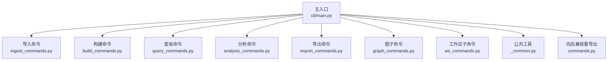
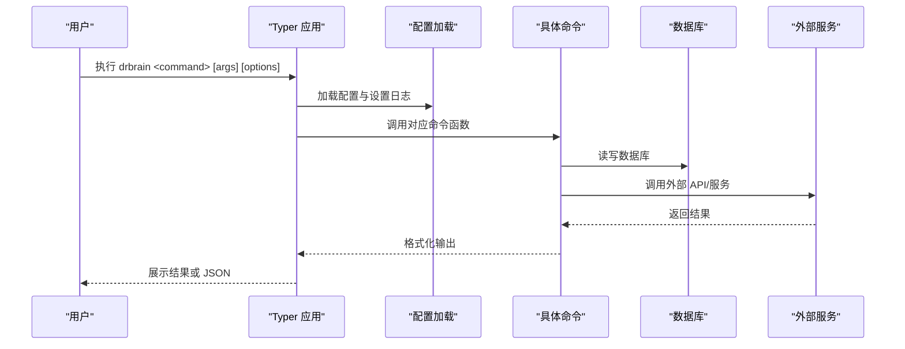
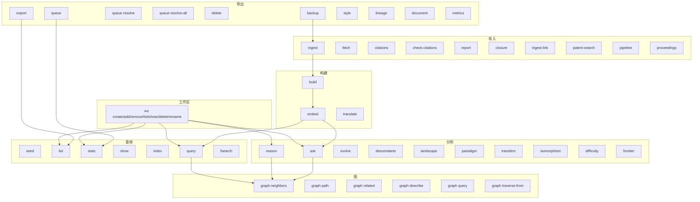

# CLI 命令参考

<cite>
**本文档引用的文件**
- [src/drbrain/cli/main.py](file://src/drbrain/cli/main.py)
- [src/drbrain/cli/commands.py](file://src/drbrain/cli/commands.py)
- [src/drbrain/cli/ingest_commands.py](file://src/drbrain/cli/ingest_commands.py)
- [src/drbrain/cli/build_commands.py](file://src/drbrain/cli/build_commands.py)
- [src/drbrain/cli/query_commands.py](file://src/drbrain/cli/query_commands.py)
- [src/drbrain/cli/analysis_commands.py](file://src/drbrain/cli/analysis_commands.py)
- [src/drbrain/cli/export_commands.py](file://src/drbrain/cli/export_commands.py)
- [src/drbrain/cli/graph_commands.py](file://src/drbrain/cli/graph_commands.py)
- [src/drbrain/cli/ws_commands.py](file://src/drbrain/cli/ws_commands.py)
- [src/drbrain/cli/_common.py](file://src/drbrain/cli/_common.py)
</cite>

## 目录
1. [简介](#简介)
2. [项目结构](#项目结构)
3. [核心组件](#核心组件)
4. [架构总览](#架构总览)
5. [详细组件分析](#详细组件分析)
6. [依赖分析](#依赖分析)
7. [性能考虑](#性能考虑)
8. [故障排除指南](#故障排除指南)
9. [结论](#结论)
10. [附录](#附录)

## 简介
本文件为 DrBrain CLI 的全面命令参考，覆盖 60+ 子命令，按功能分为导入（ingest）、构建（build）、查询（query）、分析（analysis）、导出（export）、修复与导入（repair/import）、管道（pipeline）等主要命令组。文档提供每个命令的语法、参数、选项、默认值、使用场景、实际示例与预期输出、命令间依赖关系与执行顺序、最佳实践与常见错误处理方法。

## 项目结构
DrBrain CLI 采用模块化设计，主入口集中注册各功能模块命令；同时提供子应用（graph、ws）用于更细粒度的图查询与工作区管理。

图表来源
- [src/drbrain/cli/main.py:1-150](file://src/drbrain/cli/main.py#L1-L150)
- [src/drbrain/cli/ingest_commands.py:1-935](file://src/drbrain/cli/ingest_commands.py#L1-L935)
- [src/drbrain/cli/build_commands.py:1-361](file://src/drbrain/cli/build_commands.py#L1-L361)
- [src/drbrain/cli/query_commands.py:1-738](file://src/drbrain/cli/query_commands.py#L1-L738)
- [src/drbrain/cli/analysis_commands.py:1-678](file://src/drbrain/cli/analysis_commands.py#L1-L678)
- [src/drbrain/cli/export_commands.py:1-628](file://src/drbrain/cli/export_commands.py#L1-L628)
- [src/drbrain/cli/graph_commands.py:1-756](file://src/drbrain/cli/graph_commands.py#L1-L756)
- [src/drbrain/cli/ws_commands.py:1-171](file://src/drbrain/cli/ws_commands.py#L1-L171)
- [src/drbrain/cli/_common.py:1-988](file://src/drbrain/cli/_common.py#L1-L988)
- [src/drbrain/cli/commands.py:1-88](file://src/drbrain/cli/commands.py#L1-L88)

章节来源
- [src/drbrain/cli/main.py:1-150](file://src/drbrain/cli/main.py#L1-L150)

## 核心组件
- 主入口 Typer 应用：集中注册所有命令与子应用，统一初始化日志与配置加载。
- 命令模块：按功能拆分到独立模块，便于维护与扩展。
- 公共工具：提供跨命令复用的通用逻辑（如解析工作区、DOI 丰富、批量导出、树匹配等）。
- 向后兼容：commands.py 提供旧版命令函数的重导出，确保历史调用可用。

章节来源
- [src/drbrain/cli/main.py:77-146](file://src/drbrain/cli/main.py#L77-L146)
- [src/drbrain/cli/commands.py:1-88](file://src/drbrain/cli/commands.py#L1-L88)
- [src/drbrain/cli/_common.py:1-988](file://src/drbrain/cli/_common.py#L1-L988)

## 架构总览
DrBrain CLI 的命令执行流程通常遵循“配置加载 → 参数解析 → 业务处理 → 数据库/外部服务交互 → 输出结果”。导入链路从 PDF 解析到去重识别再到知识图谱构建；查询链路由 BM25 文本检索结合图遍历与混合排序；分析链路由推理与模式发现组成；导出链路由元数据提取与格式化输出构成。

图表来源
- [src/drbrain/cli/main.py:80-92](file://src/drbrain/cli/main.py#L80-L92)
- [src/drbrain/cli/ingest_commands.py:26-110](file://src/drbrain/cli/ingest_commands.py#L26-L110)
- [src/drbrain/cli/build_commands.py:97-277](file://src/drbrain/cli/build_commands.py#L97-L277)
- [src/drbrain/cli/query_commands.py:283-631](file://src/drbrain/cli/query_commands.py#L283-L631)
- [src/drbrain/cli/analysis_commands.py:54-116](file://src/drbrain/cli/analysis_commands.py#L54-L116)
- [src/drbrain/cli/export_commands.py:21-78](file://src/drbrain/cli/export_commands.py#L21-L78)

## 详细组件分析

### 导入（ingest）命令组
- ingest：批量解析 PDF，进行去重识别、结构化树生成、DOI 丰富与质量门控，支持 JSON 输出。
- fetch：通过 DOI/标题/arXiv 搜索公开资源下载 PDF 并自动入库。
- citations：查询某论文的参考文献、被引、共享引用，支持交互式选择并批量抓取占位论文。
- check-citations：在文本中校验内文引用是否能在本地库匹配。
- report：展示单篇报告摘要与概念统计。
- closure：对全图运行基于规则的闭包推理，支持嵌入驱动的路径规则挖掘与 t-norm 规则实例化。
- ingest-link：从网页链接抽取内容并入库，依赖外部 webextract 服务。
- patent-search：检索 USPTO 专利（ppubs 或 odp），支持应用号查询与 JSON 输出。
- pipeline：编排多步骤流水线（ingest → build → embed → closure）。
- proceedings：会议论文集的创建、添加与展示。

章节来源
- [src/drbrain/cli/ingest_commands.py:26-110](file://src/drbrain/cli/ingest_commands.py#L26-L110)
- [src/drbrain/cli/ingest_commands.py:112-150](file://src/drbrain/cli/ingest_commands.py#L112-L150)
- [src/drbrain/cli/ingest_commands.py:152-247](file://src/drbrain/cli/ingest_commands.py#L152-L247)
- [src/drbrain/cli/ingest_commands.py:249-305](file://src/drbrain/cli/ingest_commands.py#L249-L305)
- [src/drbrain/cli/ingest_commands.py:307-349](file://src/drbrain/cli/ingest_commands.py#L307-L349)
- [src/drbrain/cli/ingest_commands.py:350-462](file://src/drbrain/cli/ingest_commands.py#L350-L462)
- [src/drbrain/cli/ingest_commands.py:464-567](file://src/drbrain/cli/ingest_commands.py#L464-L567)
- [src/drbrain/cli/ingest_commands.py:569-701](file://src/drbrain/cli/ingest_commands.py#L569-L701)
- [src/drbrain/cli/ingest_commands.py:703-757](file://src/drbrain/cli/ingest_commands.py#L703-L757)
- [src/drbrain/cli/ingest_commands.py:759-800](file://src/drbrain/cli/ingest_commands.py#L759-L800)

#### 命令语法与参数要点（示例）
- drbrain ingest [paths...] [--json]
  - 功能：解析 PDF 并入库；未提供路径时默认扫描 inbox 目录。
  - 选项：--json 输出机器可读 JSON。
- drbrain fetch <identifier> [--arxiv]
  - 功能：根据 DOI/标题/arXiv 获取 PDF 并入库。
  - 选项：--arxiv 将标识符视为 arXiv ID。
- drbrain citations <local_id> [--type all|refs|citing|shared-refs] [--limit 200] [--sort ...] [--workspace] [--json] [--fetch-interested]
  - 功能：查询参考文献/被引/共享引用；可交互选择并抓取占位论文。
- drbrain check-citations [--file] [--json]
  - 功能：在文本或文件中校验引用匹配。
- drbrain report <local_id> [--json]
  - 功能：显示单篇报告摘要。
- drbrain closure [--json] [--dry-run] [--rule] [--workspace] [--mode symbolic|hybrid] [--mine-rules] [--min-confidence 0.6] [--ground]
  - 功能：运行闭包推理；可仅运行指定规则、挖掘路径规则并 t-norm 实例化。
- drbrain ingest-link <urls...> [--pdf/--no-pdf] [--dry-run] [--json]
  - 功能：从网页链接抽取内容入库；依赖外部 webextract 服务。
- drbrain patent-search <query...> [--application] [--limit 10] [--source ppubs|odp] [--api-key] [--json]
  - 功能：检索 USPTO 专利；--source odp 需要 API Key。
- drbrain pipeline [--preset full|quick|embed] [--steps] [--list] [--dry-run]
  - 功能：编排流水线步骤。
- drbrain proceedings [--list|--create|--show|--add|--json]
  - 功能：会议论文集管理。

#### 依赖与执行顺序
- ingest → build → embed → closure 是推荐的完整流水线。
- fetch 会触发 ingest 流程中的单篇入库。
- citations 可能触发外部 API 扩展引用缓存。
- pipeline 内部通过子进程调用各命令实现串联。

章节来源
- [src/drbrain/cli/ingest_commands.py:26-110](file://src/drbrain/cli/ingest_commands.py#L26-L110)
- [src/drbrain/cli/ingest_commands.py:112-150](file://src/drbrain/cli/ingest_commands.py#L112-L150)
- [src/drbrain/cli/ingest_commands.py:152-247](file://src/drbrain/cli/ingest_commands.py#L152-L247)
- [src/drbrain/cli/ingest_commands.py:249-305](file://src/drbrain/cli/ingest_commands.py#L249-L305)
- [src/drbrain/cli/ingest_commands.py:307-349](file://src/drbrain/cli/ingest_commands.py#L307-L349)
- [src/drbrain/cli/ingest_commands.py:350-462](file://src/drbrain/cli/ingest_commands.py#L350-L462)
- [src/drbrain/cli/ingest_commands.py:464-567](file://src/drbrain/cli/ingest_commands.py#L464-L567)
- [src/drbrain/cli/ingest_commands.py:569-701](file://src/drbrain/cli/ingest_commands.py#L569-L701)
- [src/drbrain/cli/ingest_commands.py:703-757](file://src/drbrain/cli/ingest_commands.py#L703-L757)
- [src/drbrain/cli/ingest_commands.py:759-800](file://src/drbrain/cli/ingest_commands.py#L759-L800)

### 构建（build）命令组
- build：对上传状态的论文执行 5 阶段抽取（概念/关系/共指消解/迭代精炼），支持 --all 与 --skip-refine。
- embed：训练 TransE 图嵌入；--tree 使用 LLM 生成树节点向量。
- translate：将论文原始 Markdown 翻译为目标语言，支持断点续传与强制重翻。

章节来源
- [src/drbrain/cli/build_commands.py:97-277](file://src/drbrain/cli/build_commands.py#L97-L277)
- [src/drbrain/cli/build_commands.py:280-361](file://src/drbrain/cli/build_commands.py#L280-L361)
- [src/drbrain/cli/build_commands.py:16-95](file://src/drbrain/cli/build_commands.py#L16-L95)

#### 命令语法与参数要点（示例）
- drbrain build [--all] [--skip-refine] [--json]
  - 功能：构建知识图谱；可对全部论文或仅上传状态论文执行。
- drbrain embed [--dim 128] [--epochs 100] [--retrain] [--tree]
  - 功能：训练实体/关系嵌入；--tree 生成树节点向量。
- drbrain translate <local_id> [--lang zh|en|ja] [--force] [--json]
  - 功能：翻译论文 Markdown。

#### 依赖与执行顺序
- build 依赖 ingest 完成的树结构与元数据。
- embed 依赖 build 生成的概念/边数据。
- translate 依赖存在 raw.md 文件。

章节来源
- [src/drbrain/cli/build_commands.py:97-277](file://src/drbrain/cli/build_commands.py#L97-L277)
- [src/drbrain/cli/build_commands.py:280-361](file://src/drbrain/cli/build_commands.py#L280-L361)
- [src/drbrain/cli/build_commands.py:16-95](file://src/drbrain/cli/build_commands.py#L16-L95)

### 查询（query）命令组
- seed：检测研究种子（高价值概念）。
- list：列出数据库中所有论文。
- stats：显示数据库统计信息（论文、概念、边、别名、研究种子、队列待处理等）。
- show：展示单篇论文的详细视图（概念、论点、出入边）。
- index：重建 BM25 检索索引。
- query：BM25 文本检索 + 过滤器 + 图遍历 + 混合排序（PageRank 加权）。
- fsearch：联邦搜索（本地库 + arXiv），支持交叉引用标注。

章节来源
- [src/drbrain/cli/query_commands.py:24-47](file://src/drbrain/cli/query_commands.py#L24-L47)
- [src/drbrain/cli/query_commands.py:49-75](file://src/drbrain/cli/query_commands.py#L49-L75)
- [src/drbrain/cli/query_commands.py:77-178](file://src/drbrain/cli/query_commands.py#L77-L178)
- [src/drbrain/cli/query_commands.py:180-261](file://src/drbrain/cli/query_commands.py#L180-L261)
- [src/drbrain/cli/query_commands.py:263-281](file://src/drbrain/cli/query_commands.py#L263-L281)
- [src/drbrain/cli/query_commands.py:283-631](file://src/drbrain/cli/query_commands.py#L283-L631)
- [src/drbrain/cli/query_commands.py:633-738](file://src/drbrain/cli/query_commands.py#L633-L738)

#### 命令语法与参数要点（示例）
- drbrain seed [--json] [--workspace]
  - 功能：检测研究种子。
- drbrain list [--json]
  - 功能：列出所有论文。
- drbrain stats [--json] [--workspace]
  - 功能：显示统计。
- drbrain show <local_id> [--json]
  - 功能：展示论文详情。
- drbrain index [--rebuild] [--json]
  - 功能：重建 BM25 索引。
- drbrain query "<text>" [--type-filter] [--arg-type] [--year-start] [--year-end] [--min-confidence] [--limit 20] [--neighbors 0] [--relation] [--direction forward|backward|both] [--hybrid] [--json|--jsonl] [--paper] [--workspace]
  - 功能：文本检索 + 图遍历 + 混合排序。
- drbrain fsearch <query...> [--arxiv|--arxiv-only] [--limit 20] [--json]
  - 功能：本地库 + arXiv 联邦搜索。

#### 依赖与执行顺序
- query 可直接走 BM25，也可通过 --paper 走 PageIndex 树检索。
- hybrid 模式需要已训练的图嵌入（embed）。

章节来源
- [src/drbrain/cli/query_commands.py:283-631](file://src/drbrain/cli/query_commands.py#L283-L631)
- [src/drbrain/cli/query_commands.py:633-738](file://src/drbrain/cli/query_commands.py#L633-L738)

### 分析（analysis）命令组
- ask：自然语言问答，结合 BM25 检索与闭包上下文。
- reason：LLM 推理代理，支持双向迭代验证。
- evolve：追踪概念的祖先/后代演化，支持时间信号与年表可视化。
- descendants：追踪论文的学术后代（被引/扩展/改进）。
- landscape：绘制领域景观（时间线、持久缺口、争议）。
- paradigm：检测范式转移（替换、爆炸、跨域入侵）。
- transfers：跨域方法迁移机会发现，支持自动检测与历史时间线。
- isomorphism：寻找结构同构子图。
- difficulty：难度图（缺口按来源节类型分类）。
- frontier：知识前沿（活跃缺口、争议、范式转移）。

章节来源
- [src/drbrain/cli/analysis_commands.py:118-212](file://src/drbrain/cli/analysis_commands.py#L118-L212)
- [src/drbrain/cli/analysis_commands.py:54-116](file://src/drbrain/cli/analysis_commands.py#L54-L116)
- [src/drbrain/cli/analysis_commands.py:214-266](file://src/drbrain/cli/analysis_commands.py#L214-L266)
- [src/drbrain/cli/analysis_commands.py:268-307](file://src/drbrain/cli/analysis_commands.py#L268-L307)
- [src/drbrain/cli/analysis_commands.py:309-343](file://src/drbrain/cli/analysis_commands.py#L309-L343)
- [src/drbrain/cli/analysis_commands.py:345-396](file://src/drbrain/cli/analysis_commands.py#L345-L396)
- [src/drbrain/cli/analysis_commands.py:398-547](file://src/drbrain/cli/analysis_commands.py#L398-L547)
- [src/drbrain/cli/analysis_commands.py:550-602](file://src/drbrain/cli/analysis_commands.py#L550-L602)
- [src/drbrain/cli/analysis_commands.py:604-638](file://src/drbrain/cli/analysis_commands.py#L604-L638)
- [src/drbrain/cli/analysis_commands.py:640-678](file://src/drbrain/cli/analysis_commands.py#L640-L678)

#### 命令语法与参数要点（示例）
- drbrain ask "<question>" [--top 5] [--json]
  - 功能：自然语言问答。
- drbrain reason "<question>" [--bidirectional] [--max-rounds 3]
  - 功能：图驱动的 LLM 推理。
- drbrain evolve <concept> [--direction ancestors|descendants|both] [--max-depth 3] [--mermaid|--json] [--stats]
  - 功能：概念演化追踪。
- drbrain descendants <paper_id> [--generations 3] [--mermaid|--json] [--sections]
  - 功能：论文后代追踪。
- drbrain landscape [--top-n 5] [--json]
  - 功能：领域景观。
- drbrain paradigm [--workspace] [--json]
  - 功能：范式转移检测。
- drbrain transfers [--from] [--to] [--auto] [--min-confidence 0.3] [--json|--history|--sections]
  - 功能：跨域迁移机会。
- drbrain isomorphism <concept?> [--min-confidence 0.5] [--json]
  - 功能：同构模式发现。
- drbrain difficulty [--json]
  - 功能：难度图。
- drbrain frontier [--json]
  - 功能：知识前沿。

#### 依赖与执行顺序
- ask/reason 依赖 BM25 与闭包上下文；需要已构建的图。
- evolve/descendants 依赖图引擎与基因谱分析。
- transfers/paradigm/frontier 依赖图遍历与领域知识。

章节来源
- [src/drbrain/cli/analysis_commands.py:54-116](file://src/drbrain/cli/analysis_commands.py#L54-L116)
- [src/drbrain/cli/analysis_commands.py:118-212](file://src/drbrain/cli/analysis_commands.py#L118-L212)
- [src/drbrain/cli/analysis_commands.py:214-266](file://src/drbrain/cli/analysis_commands.py#L214-L266)
- [src/drbrain/cli/analysis_commands.py:268-307](file://src/drbrain/cli/analysis_commands.py#L268-L307)
- [src/drbrain/cli/analysis_commands.py:309-343](file://src/drbrain/cli/analysis_commands.py#L309-L343)
- [src/drbrain/cli/analysis_commands.py:345-396](file://src/drbrain/cli/analysis_commands.py#L345-L396)
- [src/drbrain/cli/analysis_commands.py:398-547](file://src/drbrain/cli/analysis_commands.py#L398-L547)
- [src/drbrain/cli/analysis_commands.py:550-602](file://src/drbrain/cli/analysis_commands.py#L550-L602)
- [src/drbrain/cli/analysis_commands.py:604-638](file://src/drbrain/cli/analysis_commands.py#L604-L638)
- [src/drbrain/cli/analysis_commands.py:640-678](file://src/drbrain/cli/analysis_commands.py#L640-L678)

### 导出（export）命令组
- export：导出论文元数据为 BibTeX/RIS/Markdown，支持 --all 与样式定制。
- queue：列出置信队列待处理项。
- queue resolve：接受或拒绝单个队列项。
- queue resolve-all：批量接受或拒绝队列项。
- delete：删除论文及其关联数据，可选删除文件目录。
- backup：创建 tar.gz 备份或同步到 rsync 目标。
- style：管理 Markdown 导出样式（APA/Vancouver/Chicago/MLA/自定义）。
- lineage：探索作者/研究者谱系（OpenAlex 去重 ID）。
- document：检查 Office 文档（DOCX/PPTX/XLSX）结构化摘要。
- metrics：展示用户行为分析（关键词、最读论文、周趋势）。

章节来源
- [src/drbrain/cli/export_commands.py:21-78](file://src/drbrain/cli/export_commands.py#L21-L78)
- [src/drbrain/cli/export_commands.py:80-120](file://src/drbrain/cli/export_commands.py#L80-L120)
- [src/drbrain/cli/export_commands.py:122-225](file://src/drbrain/cli/export_commands.py#L122-L225)
- [src/drbrain/cli/export_commands.py:227-282](file://src/drbrain/cli/export_commands.py#L227-L282)
- [src/drbrain/cli/export_commands.py:283-427](file://src/drbrain/cli/export_commands.py#L283-L427)
- [src/drbrain/cli/export_commands.py:429-479](file://src/drbrain/cli/export_commands.py#L429-L479)
- [src/drbrain/cli/export_commands.py:480-552](file://src/drbrain/cli/export_commands.py#L480-L552)
- [src/drbrain/cli/export_commands.py:554-574](file://src/drbrain/cli/export_commands.py#L554-L574)
- [src/drbrain/cli/export_commands.py:576-628](file://src/drbrain/cli/export_commands.py#L576-L628)

#### 命令语法与参数要点（示例）
- drbrain export <local_id|all> [--format bib|ris|md] [--all] [--output] [--style apa] [--json]
  - 功能：导出元数据。
- drbrain queue [--json]
  - 功能：查看置信队列。
- drbrain queue resolve <queue_id> [--accept|--reject] [--json]
  - 功能：处理单个队列项。
- drbrain queue resolve-all [--accept|--reject] [--type] [--max-conf] [--json]
  - 功能：批量处理。
- drbrain delete <local_id> [--force] [--rm-files] [--json]
  - 功能：删除论文及文件。
- drbrain backup [--output] [--list] [--target] [--dry-run] [--json]
  - 功能：备份或 rsync 同步。
- drbrain style [--list|--show] [--json]
  - 功能：样式管理。
- drbrain lineage <author_id|> [--list|--name] [--json]
  - 功能：作者谱系。
- drbrain document <file> [--format]
  - 功能：Office 文档检查。
- drbrain metrics [--json]
  - 功能：用户行为分析。

#### 依赖与执行顺序
- export 依赖数据库中的元数据与作者别名。
- backup 依赖配置中的备份目标与数据目录。
- metrics 依赖独立的 metrics.db。

章节来源
- [src/drbrain/cli/export_commands.py:21-78](file://src/drbrain/cli/export_commands.py#L21-L78)
- [src/drbrain/cli/export_commands.py:80-120](file://src/drbrain/cli/export_commands.py#L80-L120)
- [src/drbrain/cli/export_commands.py:122-225](file://src/drbrain/cli/export_commands.py#L122-L225)
- [src/drbrain/cli/export_commands.py:227-282](file://src/drbrain/cli/export_commands.py#L227-L282)
- [src/drbrain/cli/export_commands.py:283-427](file://src/drbrain/cli/export_commands.py#L283-L427)
- [src/drbrain/cli/export_commands.py:429-479](file://src/drbrain/cli/export_commands.py#L429-L479)
- [src/drbrain/cli/export_commands.py:480-552](file://src/drbrain/cli/export_commands.py#L480-L552)
- [src/drbrain/cli/export_commands.py:554-574](file://src/drbrain/cli/export_commands.py#L554-L574)
- [src/drbrain/cli/export_commands.py:576-628](file://src/drbrain/cli/export_commands.py#L576-L628)

### 修复与导入（repair/import）命令组
- repair：修复图谱问题（概念/关系/别名）。
- import：从外部源导入数据（如 Zotero）。

章节来源
- [src/drbrain/cli/main.py:67-71](file://src/drbrain/cli/main.py#L67-L71)

### 管道（pipeline）命令组
- pipeline：编排 ingest → build → embed → closure 的流水线，支持预设与步骤列表。

章节来源
- [src/drbrain/cli/ingest_commands.py:703-757](file://src/drbrain/cli/ingest_commands.py#L703-L757)

### 图子命令（graph）
- graph neighbors：从节点出发按关系与方向遍历邻居，支持工作区过滤。
- graph path：查找两点间最短路径，支持最大长度限制。
- graph related：分析多论文共享概念/图连接/边模式。
- graph describe：生成子图自然语言描述。
- graph query：基于嵌入的复杂查询 DSL。
- graph traverse-from：从文档树节出发，结合图遍历。

章节来源
- [src/drbrain/cli/graph_commands.py:20-152](file://src/drbrain/cli/graph_commands.py#L20-L152)
- [src/drbrain/cli/graph_commands.py:153-264](file://src/drbrain/cli/graph_commands.py#L153-L264)
- [src/drbrain/cli/graph_commands.py:266-501](file://src/drbrain/cli/graph_commands.py#L266-L501)
- [src/drbrain/cli/graph_commands.py:503-574](file://src/drbrain/cli/graph_commands.py#L503-L574)
- [src/drbrain/cli/graph_commands.py:576-621](file://src/drbrain/cli/graph_commands.py#L576-L621)
- [src/drbrain/cli/graph_commands.py:623-756](file://src/drbrain/cli/graph_commands.py#L623-L756)

#### 命令语法与参数要点（示例）
- drbrain graph neighbors <node_label> [--hops 1] [--relation] [--direction forward|backward|both] [--json] [--workspace]
  - 功能：邻居遍历。
- drbrain graph path <src> <dst> [--max-length 6] [--json] [--workspace]
  - 功能：最短路径。
- drbrain graph related <paper_ids...> [--mode concepts|graph|edges] [--min-shared 2] [--json] [--workspace]
  - 功能：共享分析。
- drbrain graph describe <node_label> [--depth 1] [--json] [--workspace]
  - 功能：子图描述。
- drbrain graph query '<json>' [--top 10] [--json]
  - 功能：嵌入查询 DSL。
- drbrain graph traverse-from <section> [--depth 2] [--direction] [--json] [--workspace]
  - 功能：树+图混合遍历。

#### 依赖与执行顺序
- neighbors/path/related/describe/query/traverse-from 依赖图引擎与数据库。
- query 需要已训练的嵌入。

章节来源
- [src/drbrain/cli/graph_commands.py:20-152](file://src/drbrain/cli/graph_commands.py#L20-L152)
- [src/drbrain/cli/graph_commands.py:153-264](file://src/drbrain/cli/graph_commands.py#L153-L264)
- [src/drbrain/cli/graph_commands.py:266-501](file://src/drbrain/cli/graph_commands.py#L266-L501)
- [src/drbrain/cli/graph_commands.py:503-574](file://src/drbrain/cli/graph_commands.py#L503-L574)
- [src/drbrain/cli/graph_commands.py:576-621](file://src/drbrain/cli/graph_commands.py#L576-L621)
- [src/drbrain/cli/graph_commands.py:623-756](file://src/drbrain/cli/graph_commands.py#L623-L756)

### 工作区（ws）命令组
- ws create：创建工作区。
- ws add/remove：增删论文。
- ws list/show/delete/rename：管理与查看工作区。

章节来源
- [src/drbrain/cli/ws_commands.py:12-171](file://src/drbrain/cli/ws_commands.py#L12-L171)

## 依赖分析
- 命令耦合：各命令模块相对独立，通过公共工具与数据库接口耦合。
- 外部依赖：webextract 服务、USPTO API、CrossRef/OpenAlex API、arXiv、LLM 模型等。
- 数据依赖：导入阶段依赖 PDF 解析与去重；构建阶段依赖树结构；查询/分析阶段依赖图数据；导出阶段依赖元数据与别名。

图表来源
- [src/drbrain/cli/main.py:94-146](file://src/drbrain/cli/main.py#L94-L146)
- [src/drbrain/cli/ingest_commands.py:26-110](file://src/drbrain/cli/ingest_commands.py#L26-L110)
- [src/drbrain/cli/build_commands.py:97-277](file://src/drbrain/cli/build_commands.py#L97-L277)
- [src/drbrain/cli/query_commands.py:283-631](file://src/drbrain/cli/query_commands.py#L283-L631)
- [src/drbrain/cli/analysis_commands.py:54-116](file://src/drbrain/cli/analysis_commands.py#L54-L116)
- [src/drbrain/cli/export_commands.py:21-78](file://src/drbrain/cli/export_commands.py#L21-L78)
- [src/drbrain/cli/graph_commands.py:20-152](file://src/drbrain/cli/graph_commands.py#L20-L152)
- [src/drbrain/cli/ws_commands.py:12-171](file://src/drbrain/cli/ws_commands.py#L12-L171)

## 性能考虑
- 批量导入：建议分批处理 PDF，避免一次性占用过多内存；合理设置并发抓取数量。
- 构建阶段：5 阶段抽取耗时较长，建议在充足 LLM 资源下执行；可使用 --skip-refine 快速迭代。
- 嵌入训练：TransE 训练时间与节点规模相关，增量训练可减少重复计算；--tree 模式生成树向量需大量 I/O。
- 查询优化：BM25 索引重建成本较高，建议按需重建；混合排序依赖图中心性计算，注意内存占用。
- 图分析：大规模图遍历与路径查找可能较慢，建议限制 --neighbors 与 --max-length，使用工作区缩小范围。

## 故障排除指南
- 配置缺失
  - 现象：提示“无 LLM 模型配置”或“无嵌入提供程序”。
  - 处理：先执行 drbrain setup 完成配置；检查配置文件中的 llm.embed 字段。
- 外部服务不可达
  - 现象：webextract 服务不可达、USPTO API Key 缺失、CrossRef/OpenAlex 请求失败。
  - 处理：确认服务地址与网络连通；设置环境变量或配置项；检查 API Key 有效期。
- 数据库异常
  - 现象：查询报错、索引重建失败、导出为空。
  - 处理：检查数据库路径与权限；必要时重建索引（drbrain index --rebuild）；确认论文状态。
- 权限与路径
  - 现象：无法写入 papers 目录、备份失败。
  - 处理：确保用户对 data/ 目录有读写权限；检查 rsync/ssh 配置。

章节来源
- [src/drbrain/cli/build_commands.py:142-147](file://src/drbrain/cli/build_commands.py#L142-L147)
- [src/drbrain/cli/ingest_commands.py:489-496](file://src/drbrain/cli/ingest_commands.py#L489-L496)
- [src/drbrain/cli/ingest_commands.py:593-599](file://src/drbrain/cli/ingest_commands.py#L593-L599)
- [src/drbrain/cli/export_commands.py:334-392](file://src/drbrain/cli/export_commands.py#L334-L392)

## 结论
DrBrain CLI 提供了从数据导入、知识图谱构建、检索查询、深度分析到导出备份的完整链路。通过模块化的命令设计与强大的图引擎，用户可以高效地完成学术知识管理与探索任务。建议遵循“导入 → 构建 → 嵌入 → 查询/分析”的标准流程，并结合工作区与管道命令提升效率。

## 附录
- 常用最佳实践
  - 使用 --workspace 限定分析范围，提高性能与准确性。
  - 在执行 heavy 操作前先运行 stats 了解数据规模。
  - 对外网 API 调用设置合理的超时与重试策略。
  - 定期执行 backup 与 metrics，保障数据安全与使用洞察。
- 常见错误与解决
  - “Paper not found”：确认 local_id 正确且论文已入库。
  - “No graph data”：先执行 build 与 embed。
  - “Invalid relation(s)”：检查关系类型是否在允许集合内。
  - “No results”：放宽过滤条件或检查索引状态。