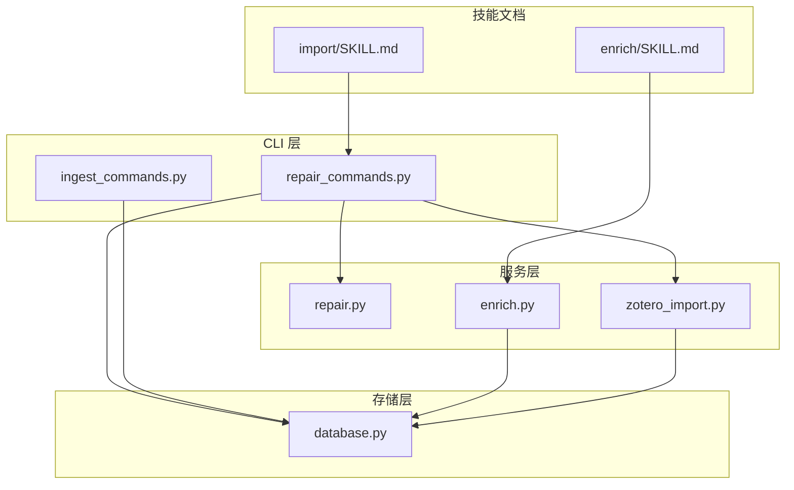
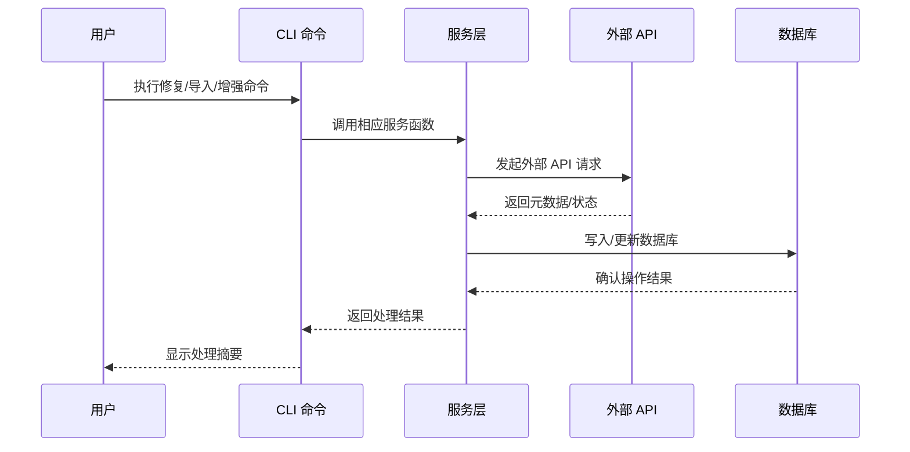
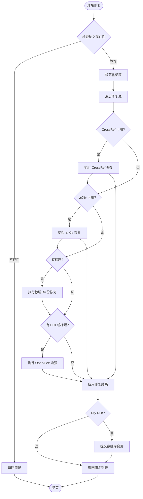
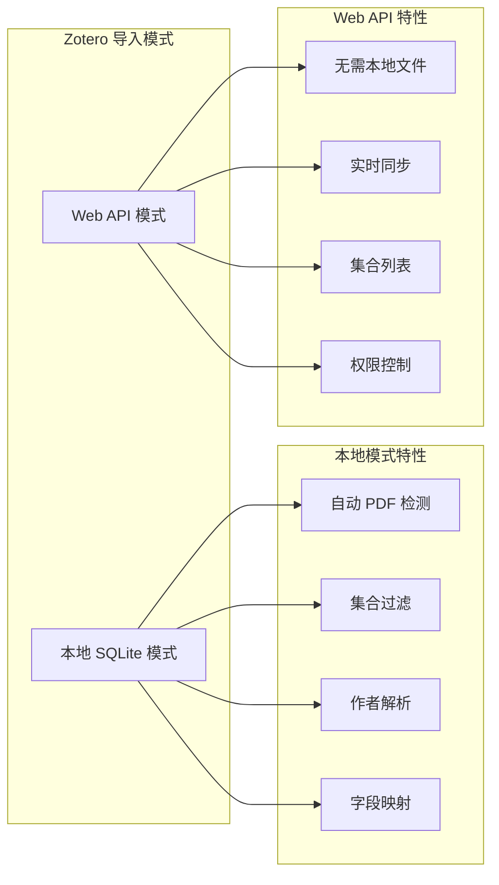
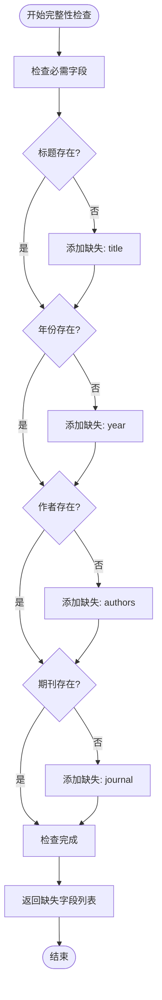
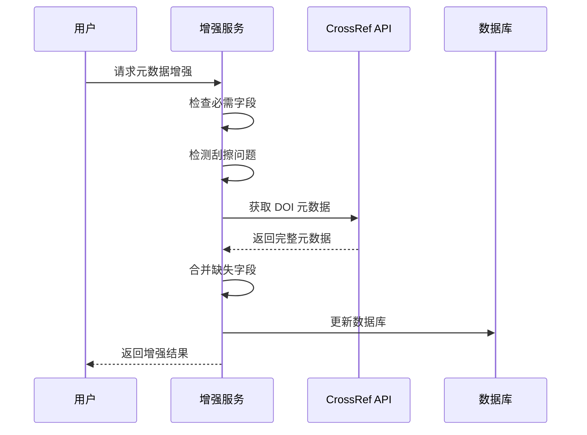
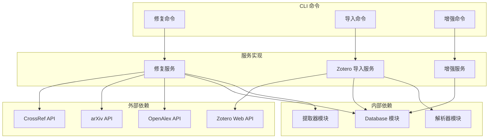

# 修复导入命令

<cite>
**本文档引用的文件**
- [repair_commands.py](file://src/drbrain/cli/repair_commands.py)
- [ingest_commands.py](file://src/drbrain/cli/ingest_commands.py)
- [repair.py](file://src/drbrain/services/repair.py)
- [enrich.py](file://src/drbrain/services/enrich.py)
- [zotero_import.py](file://src/drbrain/services/zotero_import.py)
- [database.py](file://src/drbrain/storage/database.py)
- [SKILL.md（导入）](file://skills/import/SKILL.md)
- [SKILL.md（增强）](file://skills/enrich/SKILL.md)
- [README.md](file://README.md)
- [test_repair.py](file://tests/test_repair.py)
- [test_enrich.py](file://tests/test_enrich.py)
- [test_zotero_import.py](file://tests/test_zotero_import.py)
</cite>

## 目录
1. [简介](#简介)
2. [项目结构](#项目结构)
3. [核心组件](#核心组件)
4. [架构概览](#架构概览)
5. [详细组件分析](#详细组件分析)
6. [依赖关系分析](#依赖关系分析)
7. [性能考虑](#性能考虑)
8. [故障排除指南](#故障排除指南)
9. [结论](#结论)
10. [附录](#附录)

## 简介

DrBrain 是一个面向 AI 代理的学术知识图谱系统，提供了完整的论文导入、修复和增强功能。本文档专注于修复导入相关命令的详细使用指南，包括 repair、import、enrich 等命令的功能说明、配置参数、使用方法以及最佳实践。

这些命令构成了 DrBrain 数据质量保证的核心工具链，确保用户从各种来源导入的论文数据能够保持高质量和一致性。通过这些工具，用户可以：
- 修复元数据不一致问题
- 从外部参考管理器导入论文
- 增强现有元数据的完整性
- 执行批量数据质量检查

## 项目结构

DrBrain 的修复导入功能主要分布在以下模块中：

**图表来源**
- [repair_commands.py:1-438](file://src/drbrain/cli/repair_commands.py#L1-L438)
- [ingest_commands.py:1-935](file://src/drbrain/cli/ingest_commands.py#L1-L935)
- [repair.py:1-337](file://src/drbrain/services/repair.py#L1-L337)
- [enrich.py:1-171](file://src/drbrain/services/enrich.py#L1-L171)
- [zotero_import.py:1-719](file://src/drbrain/services/zotero_import.py#L1-L719)
- [database.py:1-775](file://src/drbrain/storage/database.py#L1-L775)

**章节来源**
- [repair_commands.py:1-438](file://src/drbrain/cli/repair_commands.py#L1-L438)
- [ingest_commands.py:1-935](file://src/drbrain/cli/ingest_commands.py#L1-L935)

## 核心组件

### 修复命令 (repair)

修复命令负责通过多种外部源自动修复论文元数据问题：

- **CrossRef API 集成**：获取权威的学术元数据
- **arXiv 元数据提取**：处理预印本论文信息
- **OpenAlex 增强**：提供额外的学术指标和作者信息
- **标题规范化**：统一标题格式和大小写

### 导入命令 (import)

导入命令支持从多种外部参考管理器导入论文：

- **Zotero 支持**：本地数据库和 Web API 模式
- **BibTeX 文件**：标准学术引用格式
- **Endnote 支持**：XML 和 RIS 格式导出
- **PDF 自动检测**：从 Zotero 本地模式自动发现关联 PDF

### 增强命令 (enrich)

增强命令专注于元数据完整性检查和缺失字段填充：

- **完整性检查**：验证必需字段是否完整
- **刮擦检测**：识别需要清理的可疑记录
- **CrossRef 后填**：基于 DOI 填充缺失元数据
- **JSON 输出**：支持机器可读输出格式

**章节来源**
- [repair_commands.py:14-75](file://src/drbrain/cli/repair_commands.py#L14-L75)
- [repair_commands.py:77-341](file://src/drbrain/cli/repair_commands.py#L77-L341)
- [repair_commands.py:343-438](file://src/drbrain/cli/repair_commands.py#L343-L438)

## 架构概览

修复导入命令的系统架构采用分层设计，确保功能模块的清晰分离和高内聚低耦合：

**图表来源**
- [repair_commands.py:23-59](file://src/drbrain/cli/repair_commands.py#L23-L59)
- [repair.py:265-336](file://src/drbrain/services/repair.py#L265-L336)
- [enrich.py:128-148](file://src/drbrain/services/enrich.py#L128-L148)

### 数据流分析

每个命令都遵循相似的数据处理流程：

1. **输入验证**：检查参数有效性和必需条件
2. **外部集成**：调用相应的 API 或解析器
3. **数据转换**：标准化和规范化处理
4. **持久化**：写入数据库并维护一致性
5. **输出生成**：提供人类可读或机器可读的结果

**章节来源**
- [repair.py:58-122](file://src/drbrain/services/repair.py#L58-L122)
- [enrich.py:14-28](file://src/drbrain/services/enrich.py#L14-L28)
- [zotero_import.py:118-281](file://src/drbrain/services/zotero_import.py#L118-L281)

## 详细组件分析

### 修复命令详细分析

修复命令是 DrBrain 数据质量保证的核心组件，支持多种修复策略：

#### 修复策略矩阵

| 修复源 | 支持字段 | 数据来源 | 使用场景 |
|--------|----------|----------|----------|
| CrossRef | 标题、作者、年份、期刊 | 学术元数据API | DOI 完整的论文 |
| arXiv | 标题、年份 | 预印本服务器 | arXiv ID 存在的论文 |
| 标题+年份 | DOI | CrossRef 查询 | 缺少 DOI 的论文 |
| OpenAlex | 抽象、引用计数、作者、卷号、页码 | 学术搜索引擎 | 综合元数据增强 |

#### 修复算法流程

**图表来源**
- [repair.py:265-336](file://src/drbrain/services/repair.py#L265-L336)

#### 标题规范化机制

修复命令包含智能的标题规范化功能：

- **全大写处理**：自动转换为标题格式
- **arXiv ID 移除**：清理嵌入在标题中的 arXiv 标识符
- **大小写规则**：应用英语标题大小写规范

**章节来源**
- [repair.py:16-55](file://src/drbrain/services/repair.py#L16-L55)
- [repair.py:265-336](file://src/drbrain/services/repair.py#L265-L336)

### 导入命令详细分析

导入命令支持三种主要的外部数据源：

#### Zotero 导入模式

**图表来源**
- [repair_commands.py:154-194](file://src/drbrain/cli/repair_commands.py#L154-L194)
- [zotero_import.py:118-281](file://src/drbrain/services/zotero_import.py#L118-L281)

##### 字段映射表

| Zotero 字段 | DrBrain 字段 | 处理方式 |
|-------------|--------------|----------|
| itemType | paper_type | 类型映射转换 |
| title | title | 直接映射 |
| date | year | 年份提取 |
| DOI | doi | 清理 URL 前缀 |
| publicationTitle | journal | 字段重命名 |
| volume | volume | 直接映射 |
| pages | pages | 直接映射 |
| url | url | 直接映射 |
| creators | authors | 多作者合并 |

#### BibTeX 导入处理

BibTeX 导入支持标准的学术引用格式：

- **条目类型映射**：article、inproceedings、phdthesis 等
- **字段解析**：自动提取标题、作者、年份、期刊等
- **作者格式处理**：支持 "Last, First" 和 "First Last" 格式

#### Endnote 导入支持

Endnote 支持两种格式：

- **RIS 格式**：纯文本标记格式，无需额外依赖
- **XML 格式**：结构化 XML 导出，需要额外包支持

**章节来源**
- [repair_commands.py:151-250](file://src/drbrain/cli/repair_commands.py#L151-L250)
- [zotero_import.py:665-718](file://src/drbrain/services/zotero_import.py#L665-L718)

### 增强命令详细分析

增强命令专注于元数据完整性检查和质量评估：

#### 完整性检查算法

**图表来源**
- [enrich.py:14-28](file://src/drbrain/services/enrich.py#L14-L28)

#### 刮擦检测机制

增强命令包含智能的可疑记录检测：

- **空标题检测**：识别完全空白的论文标题
- **短标题检测**：识别过短的标题（少于 5 个字符）
- **文件名标题检测**：识别看起来像文件名的标题
- **空作者检测**：识别缺少作者信息的记录
- **异常年份检测**：识别未来年份或异常年份
- **DOI 验证**：检查 DOI 格式有效性

#### CrossRef 后填流程

**图表来源**
- [enrich.py:128-148](file://src/drbrain/services/enrich.py#L128-L148)
- [enrich.py:151-170](file://src/drbrain/services/enrich.py#L151-L170)

**章节来源**
- [enrich.py:31-69](file://src/drbrain/services/enrich.py#L31-L69)
- [enrich.py:128-170](file://src/drbrain/services/enrich.py#L128-L170)

## 依赖关系分析

修复导入命令的依赖关系体现了清晰的分层架构：

**图表来源**
- [repair.py:63-121](file://src/drbrain/services/repair.py#L63-L121)
- [zotero_import.py:348-435](file://src/drbrain/services/zotero_import.py#L348-L435)
- [enrich.py:128-148](file://src/drbrain/services/enrich.py#L128-L148)

### 关键依赖点

1. **API 依赖**：修复和增强功能依赖多个外部学术数据库
2. **数据库依赖**：所有命令都需要访问 SQLite 数据库存储
3. **解析器依赖**：导入功能需要处理多种文件格式
4. **外部工具依赖**：某些功能需要额外的 Python 包支持

**章节来源**
- [repair.py:1-337](file://src/drbrain/services/repair.py#L1-L337)
- [zotero_import.py:1-719](file://src/drbrain/services/zotero_import.py#L1-L719)
- [enrich.py:1-171](file://src/drbrain/services/enrich.py#L1-L171)

## 性能考虑

### 批量处理优化

修复导入命令在设计时充分考虑了性能优化：

- **并发处理**：导入命令支持批量处理多个论文
- **数据库事务**：批量操作使用事务确保原子性
- **缓存机制**：重复查询使用缓存减少 API 调用
- **内存管理**：大型数据集处理时注意内存使用

### API 限制处理

- **速率限制**：合理处理外部 API 的速率限制
- **重试机制**：网络异常时自动重试
- **超时控制**：设置合理的请求超时时间
- **降级策略**：API 不可用时提供降级功能

### 内存优化策略

- **流式处理**：大文件处理时采用流式读取
- **分批处理**：大数据集分批处理避免内存溢出
- **及时释放**：处理完成后及时释放资源

## 故障排除指南

### 常见问题诊断

#### 修复命令问题

| 问题症状 | 可能原因 | 解决方案 |
|----------|----------|----------|
| 修复失败 | 外部 API 不可用 | 检查网络连接，稍后重试 |
| 无修复建议 | 论文信息完整 | 检查论文元数据是否正确 |
| 标题被修改 | 规范化规则触发 | 检查标题格式是否符合要求 |
| DOI 未更新 | 数据库连接问题 | 检查数据库权限和连接 |

#### 导入命令问题

| 问题症状 | 可能原因 | 解决方案 |
|----------|----------|----------|
| 文件找不到 | 路径错误 | 检查文件路径是否正确 |
| Zotero 连接失败 | 库密钥错误 | 验证 API 密钥和库 ID |
| PDF 未复制 | 权限问题 | 检查目标目录权限 |
| 重复记录 | DOI 已存在 | 检查去重逻辑 |

#### 增强命令问题

| 问题症状 | 可能原因 | 解决方案 |
|----------|----------|----------|
| 缺失字段为空 | CrossRef API 无数据 | 检查 DOI 是否正确 |
| 刮擦检测误报 | 数据质量问题 | 手动审核可疑记录 |
| JSON 输出格式错误 | 参数配置问题 | 检查 --json 参数使用

### 调试技巧

1. **启用详细日志**：使用 `--verbose` 参数获取详细信息
2. **Dry Run 模式**：先运行预览模式检查结果
3. **逐步执行**：将复杂任务分解为简单步骤
4. **备份数据**：重要操作前备份数据库

### 错误处理机制

所有命令都实现了完善的错误处理：

- **异常捕获**：外部 API 调用异常被捕获
- **回滚机制**：数据库操作失败时自动回滚
- **用户友好提示**：提供清晰的错误信息
- **恢复策略**：部分失败时提供恢复选项

**章节来源**
- [repair_commands.py:37-43](file://src/drbrain/cli/repair_commands.py#L37-L43)
- [repair_commands.py:113-137](file://src/drbrain/cli/repair_commands.py#L113-L137)
- [repair.py:62-71](file://src/drbrain/services/repair.py#L62-L71)

## 结论

DrBrain 的修复导入命令提供了完整的学术论文数据质量管理解决方案。通过精心设计的架构和丰富的功能特性，这些命令能够：

- **自动化数据修复**：减少手动干预，提高数据质量
- **多源数据集成**：支持从各种参考管理器导入
- **智能质量检查**：自动识别和报告数据问题
- **批量处理能力**：支持大规模数据集的高效处理

建议用户根据具体需求选择合适的命令组合，并定期执行数据质量检查以维持知识图谱的准确性。通过合理使用这些工具，用户可以建立高质量的学术知识库，为后续的分析和推理提供可靠的基础。

## 附录

### 命令参考表

#### 修复命令 (drbrain repair)

| 参数 | 类型 | 默认值 | 描述 |
|------|------|--------|------|
| local_id | 位置参数 | 必需 | 论文本地 ID |
| --all | 标志 | False | 修复所有论文 |
| --workspace | 选项 | None | 限制到工作空间 |
| --dry-run | 标志 | False | 预览模式，不进行实际更改 |
| --json | 标志 | False | 输出 JSON 格式 |

#### 导入命令 (drbrain import)

| 参数 | 类型 | 默认值 | 描述 |
|------|------|--------|------|
| source | 位置参数 | 必需 | 源类型: zotero, bibtex, endnote |
| path | 位置参数 | 必需 | 文件路径或数据库路径 |
| --dry-run | 标志 | False | 预览模式 |
| --json | 标志 | False | JSON 输出 |
| --list-collections | 标志 | False | 列出集合 |
| --collection | 选项 | None | 按集合过滤 |
| --api-key | 选项 | None | Zotero API 密钥 |
| --library-id | 选项 | None | Zotero 库 ID |
| --library-type | 选项 | user | 库类型: user/group |
| --no-pdf | 标志 | False | 跳过 PDF 检测/下载 |
| --import-collections | 标志 | False | 按集合创建工作空间 |

#### 增强命令 (drbrain enrich)

| 参数 | 类型 | 默认值 | 描述 |
|------|------|--------|------|
| local_id | 位置参数 | 可选 | 论文本地 ID |
| --all | 标志 | False | 增强所有论文 |
| --dry-run | 标志 | False | 检查但不回填 |
| --json | 标志 | False | JSON 输出 |

### 最佳实践建议

1. **定期执行修复**：建议每月执行一次全面修复
2. **批量导入策略**：大量导入时分批处理，避免系统过载
3. **数据验证**：导入后立即执行增强命令检查数据质量
4. **备份策略**：重要操作前备份数据库
5. **监控指标**：关注 API 使用率和错误率指标