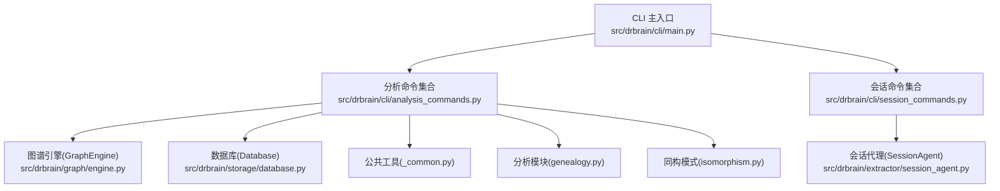
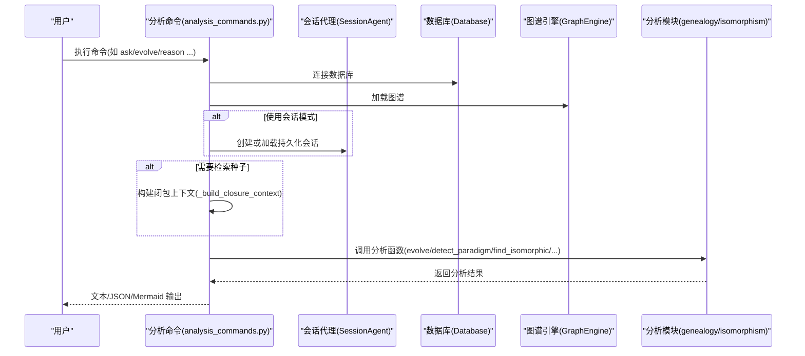
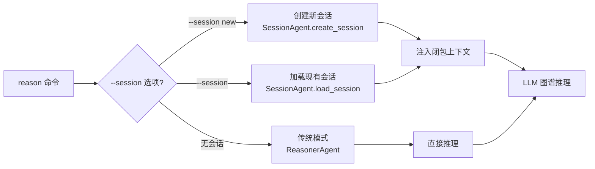
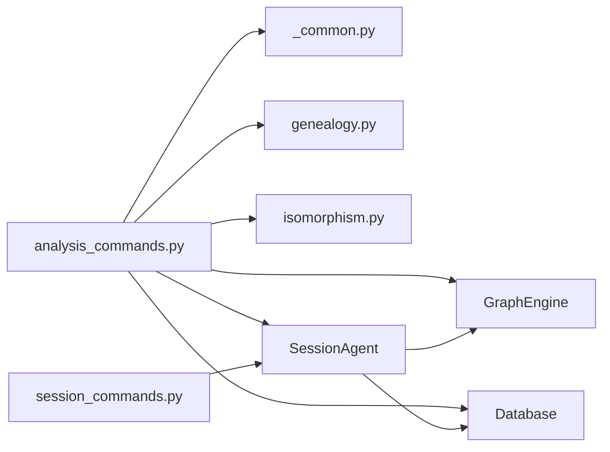

# 分析探索命令

<cite>
**本文引用的文件**
- [analysis_commands.py](file://src/drbrain/cli/analysis_commands.py)
- [main.py](file://src/drbrain/cli/main.py)
- [session_commands.py](file://src/drbrain/cli/session_commands.py)
- [session_agent.py](file://src/drbrain/extractor/session_agent.py)
- [genealogy.py](file://src/drbrain/graph/genealogy.py)
- [isomorphism.py](file://src/drbrain/extractor/isomorphism.py)
- [_common.py](file://src/drbrain/cli/_common.py)
- [SKILL.md（知识图谱推理）](file://skills/kg-reason/SKILL.md)
- [SKILL.md（工作空间分析）](file://skills/workspace-analysis/SKILL.md)
- [SKILL.md（知识地图）](file://skills/knowledge-cartography/SKILL.md)
- [cli-reference.md](file://docs/cli-reference.md)
- [README.md](file://README.md)
</cite>

## 目录
1. [简介](#简介)
2. [项目结构与入口](#项目结构与入口)
3. [核心命令总览](#核心命令总览)
4. [架构概览](#架构概览)
5. [详细命令解析](#详细命令解析)
   - [ask 命令](#ask-命令)
   - [evolve 命令](#evolve-命令)
   - [descendants 命令](#descendants-命令)
   - [landscape 命令](#landscape-命令)
   - [paradigm 命令](#paradigm-命令)
   - [transfers 命令](#transfers-命令)
   - [isomorphism 命令](#isomorphism-命令)
   - [difficulty 命令](#difficulty-命令)
   - [frontier 命令](#frontier-命令)
   - [reason 命令](#reason-命令)
6. [会话支持功能](#会话支持功能)
7. [依赖关系分析](#依赖关系分析)
8. [性能与可扩展性](#性能与可扩展性)
9. [故障排查指南](#故障排查指南)
10. [结论](#结论)
11. [附录](#附录)

## 简介
本文件系统化梳理 DrBrain 的"分析探索"相关命令，覆盖 ask、evolve、descendants、landscape、paradigm、transfers、isomorphism、difficulty、frontier、reason 等命令。内容包括：
- 功能定位与适用场景
- 工作原理与数据流
- 输出格式与结果解读
- 最佳实践与结果验证方法
- 与知识图谱引擎、数据库、检索模块的耦合关系
- **新增**：会话支持功能，允许继续在构建阶段启动的推理会话

## 项目结构与入口
- 命令注册集中在主入口，分析类命令通过 Typer 注册到 CLI。
- 分析命令实现位于 CLI 层，调用图谱引擎、数据库与分析模块。
- 公共渲染与上下文构建工具位于 _common.py。
- **新增**：会话管理命令通过独立的 session_app 子命令组提供。

**图表来源**
- [main.py:129-142](file://src/drbrain/cli/main.py#L129-L142)
- [analysis_commands.py:10-18](file://src/drbrain/cli/analysis_commands.py#L10-L18)
- [session_commands.py:14](file://src/drbrain/cli/session_commands.py#L14)
- [_common.py](file://src/drbrain/cli/_common.py)

**章节来源**
- [main.py:129-142](file://src/drbrain/cli/main.py#L129-L142)
- [analysis_commands.py:1-726](file://src/drbrain/cli/analysis_commands.py#L1-L726)
- [session_commands.py:1-290](file://src/drbrain/cli/session_commands.py#L1-L290)

## 核心命令总览
- ask：自然语言问题到知识图谱检索与回答（KGQA）
- evolve：概念演化树（祖先/后代/双向），支持统计与 Mermaid 输出
- descendants：论文后代追踪（扩展/细化/应用/挑战/引用）
- landscape：工作空间领域全景（时间线、持久性缺口、争议）
- paradigm：范式转移检测（替换/爆炸/跨域入侵）
- transfers：跨域方法迁移机会发现（显式/自动/历史）
- isomorphism：结构同构模式匹配（含 RAPTOR 上下文）
- difficulty：难度图（按来源章节类型分类）
- frontier：知识前沿（活跃缺口、争议、范式转移）
- reason：LLM 图谱智能体推理（单向/双向迭代验证），**新增会话支持**

**更新** 新增会话支持功能，允许在构建阶段启动推理会话并在后续命令中继续使用

**章节来源**
- [analysis_commands.py:118-726](file://src/drbrain/cli/analysis_commands.py#L118-L726)
- [cli-reference.md:410-595](file://docs/cli-reference.md#L410-L595)

## 架构概览
分析命令的典型执行链路：
- 解析参数与配置
- 初始化数据库与图谱引擎
- 可选：BM25 检索种子概念，构建闭包上下文
- **新增**：会话管理：创建或加载持久化推理会话
- 调用分析模块（基因谱/同构/前沿等）
- 渲染输出（文本/Mermaid/JSON）

**图表来源**
- [analysis_commands.py:78-115](file://src/drbrain/cli/analysis_commands.py#L78-L115)
- [session_agent.py:38-356](file://src/drbrain/extractor/session_agent.py#L38-L356)
- [genealogy.py:14-71](file://src/drbrain/graph/genealogy.py#L14-L71)
- [isomorphism.py:111-170](file://src/drbrain/extractor/isomorphism.py#L111-L170)

## 详细命令解析

### ask 命令
- 功能：自然语言问题问答，基于 BM25 检索相关概念与邻接边，结合闭包上下文生成答案。
- 关键流程：
  - 构建 BM25 索引并检索 top-k 概念
  - 对命中概念进行图谱邻域遍历，补充关系证据
  - 可选注入闭包推断边作为上下文
  - 使用 LLM 生成简洁回答（可 JSON 输出）
- 输出：
  - 文本回答与引用的概念/关系
  - JSON 模式包含问题、答案、上下文
- 应用场景：
  - 快速对比不同方法/模型
  - 查找特定技术的上下游关系
- 结果解读：
  - 回答质量取决于检索到的概念代表性与图谱覆盖率
  - 若无 LLM 配置，仅输出上下文

**章节来源**
- [analysis_commands.py:166-260](file://src/drbrain/cli/analysis_commands.py#L166-L260)
- [SKILL.md（知识图谱推理）:31-44](file://skills/kg-reason/SKILL.md#L31-L44)

### evolve 命令
- 功能：追踪概念的演化路径（祖先/后代/双向），可输出统计信息与时序趋势。
- 关键流程：
  - 选择方向（ancestors/descendants/both）
  - BFS 遍历，遵循"extends/refines/applies"等关系
  - 可选统计：信号强度、年份分布
  - 支持 Mermaid 输出与 JSON
- 输出：
  - 文本树或 Mermaid 流程图
  - JSON 包含树结构与可选统计
- 应用场景：
  - 追踪方法演进（如从 CNN 到注意力机制）
  - 发现研究脉络中的关键转折点
- 结果解读：
  - 年度条形图反映增长/下降/首次出现趋势
  - 重根策略确保以最早祖先为根节点展示

**章节来源**
- [analysis_commands.py:262-314](file://src/drbrain/cli/analysis_commands.py#L262-L314)
- [genealogy.py:14-71](file://src/drbrain/graph/genealogy.py#L14-L71)
- [genealogy.py:273-316](file://src/drbrain/graph/genealogy.py#L273-L316)

### descendants 命令
- 功能：追踪某篇论文的学术后代（扩展/细化/应用/挑战/引用）。
- 关键流程：
  - 以论文为中心，遍历其概念在图谱中的邻接节点
  - 识别后代论文并标注来源章节与证明
  - 支持 Mermaid 输出与 JSON
- 输出：
  - 文本后代树或 Mermaid
  - JSON 包含后代论文列表与桥接证明
- 应用场景：
  - 追溯某篇开创性论文的影响范围
  - 识别后续工作的改进方向
- 结果解读：
  - via_concept/via_section/via_provenance 提供"经由"关系的来源证据

**章节来源**
- [analysis_commands.py:316-354](file://src/drbrain/cli/analysis_commands.py#L316-L354)
- [genealogy.py:189-270](file://src/drbrain/graph/genealogy.py#L189-L270)

### landscape 命令
- 功能：工作空间领域全景，包含时间线、持久性缺口与争议区。
- 关键流程：
  - 解析工作空间，加载论文 ID
  - 按年份排序论文，提取关键概念
  - 基于研究种子检测持久性缺口与争议区
- 输出：
  - 文本时间线与缺口/争议列表
  - JSON 包含 timeline/gaps/debates
- 应用场景：
  - 撰写综述/提案时把握领域现状
  - 识别长期未解问题与热点争议
- 结果解读：
  - gaps 中的 provenance 字段标注缺口来源

**章节来源**
- [analysis_commands.py:357-390](file://src/drbrain/cli/analysis_commands.py#L357-L390)
- [genealogy.py:540-632](file://src/drbrain/graph/genealogy.py#L540-L632)

### paradigm 命令
- 功能：范式转移检测，三类模式：
  - 替换：旧概念衰落、新概念快速成长并通过"challenges"关系连接
  - 爆炸：概念在短时间内大量出现并产生多个后代
  - 跨域入侵：通过"applies"关系在新领域级联传播
- 关键流程：
  - 统计"challenges"边两端概念的年份分布
  - 检测"applies"边的级联效应
  - 可限定在工作空间内扫描
- 输出：
  - 文本描述与来源证明
  - JSON 包含类型、描述、概念对与置信度
- 应用场景：
  - 把握技术路线切换与新兴子领域
  - 评估跨学科融合趋势
- 结果解读：
  - cross_domain 的 cascade 字段显示级联概念数量

**章节来源**
- [analysis_commands.py:393-443](file://src/drbrain/cli/analysis_commands.py#L393-L443)
- [genealogy.py:318-494](file://src/drbrain/graph/genealogy.py#L318-L494)

### transfers 命令
- 功能：跨域方法迁移机会发现，支持三种模式：
  - 显式工作空间：指定方法域与问题域
  - 自动聚类：按标签相似度聚类后交叉配对
  - 历史时间线：列出所有"applies"边的历史记录
- 关键流程：
  - 计算方法/问题节点的关系签名（入/出关系计数）
  - 使用 Jaccard + 标签相似度组合打分
  - 可选注入章节证明（source_section/target_section）
- 输出：
  - 文本迁移对（含置信度）
  - JSON 包含 source_method/target_problem/confidence/source_section
  - 历史模式按年份排序输出
- 应用场景：
  - 寻找可迁移的方法（如 NLP 技术迁移到 CV）
  - 识别跨学科合作机会
- 结果解读：
  - 置信度越高，迁移可能性越大；sections 字段提供来源证据

**章节来源**
- [analysis_commands.py:446-595](file://src/drbrain/cli/analysis_commands.py#L446-L595)
- [genealogy.py:779-1000](file://src/drbrain/graph/genealogy.py#L779-L1000)

### isomorphism 命令
- 功能：寻找结构同构的子图模式（概念关系模式相似），可用于跨域迁移建议。
- 关键流程：
  - 为每个节点构建关系签名（入/出关系及计数）
  - 按签名分组，两两比较 Jaccard 相似度
  - 结合标签相似度计算综合置信度
  - 可选注入 RAPTOR 摘要上下文
- 输出：
  - 文本对（含共享结构描述与置信度）
  - JSON 包含 source/target/shared_structure/confidence/raptor 上下文
- 应用场景：
  - 发现不同领域中相似的因果/方法结构
  - 引导跨域知识迁移
- 结果解读：
  - shared_structure 描述关系模式；置信度越高越可能迁移

**章节来源**
- [analysis_commands.py:598-649](file://src/drbrain/cli/analysis_commands.py#L598-L649)
- [isomorphism.py:111-170](file://src/drbrain/extractor/isomorphism.py#L111-L170)
- [isomorphism.py:173-256](file://src/drbrain/extractor/isomorphism.py#L173-L256)

### difficulty 命令
- 功能：难度图，按来源章节语义对 Gap 进行分类（限制、未来工作、讨论、未分类）。
- 输出：
  - 文本分类清单与来源证明
  - JSON 包含各分类下的 Gap 列表
- 应用场景：
  - 识别高难度缺口与潜在突破点
  - 指导文献阅读优先级
- 结果解读：
  - 不同类别代表缺口性质差异（如"限制"更偏向方法论，"未来工作"更偏向开放问题）

**章节来源**
- [analysis_commands.py:652-685](file://src/drbrain/cli/analysis_commands.py#L652-L685)
- [genealogy.py:635-681](file://src/drbrain/graph/genealogy.py#L635-L681)

### frontier 命令
- 功能：知识前沿综合报告，整合活跃缺口、争议、范式转移与难度分类。
- 关键流程：
  - Gap 按年份分桶（最近三年 vs 更早）
  - 综合难度分类与研究种子检测
  - 范式转移检测（顶层概念）
- 输出：
  - 文本摘要与列表
  - JSON 包含 active_gaps/stale_gaps/debates/paradigm_shifts/difficulty/summary
- 应用场景：
  - 制定研究路线图与选题策略
  - 识别当前热点与冷门方向
- 结果解读：
  - summary 提供整体概览；列表便于进一步筛选

**章节来源**
- [analysis_commands.py:688-726](file://src/drbrain/cli/analysis_commands.py#L688-L726)
- [genealogy.py:684-753](file://src/drbrain/graph/genealogy.py#L684-L753)

### reason 命令
- 功能：LLM 图谱智能体推理，支持单向检索回答与双向迭代验证（Hypothesis→KG 约束校验→修订）。
- **新增**：会话支持，允许继续在构建阶段启动的推理会话
- 关键流程：
  - 单向：检索种子概念，构建闭包上下文，生成答案
  - 双向：提出假设，验证约束（TBox/RBox），必要时修订
  - **新增**：会话模式：使用 SessionAgent 创建或加载持久化会话
- 输出：
  - 文本答案与往返轮次统计
  - JSON 模式包含答案、轮次、假设与验证详情
  - **新增**：会话标识符显示
- 应用场景：
  - 复杂问题的合成性回答
  - 验证假设是否满足图谱约束
  - **新增**：长时间推理任务的上下文延续
- 结果解读：
  - 双向模式可减少错误结论，适合存在矛盾或强约束的问题
  - **新增**：会话模式支持多轮对话和复杂推理任务

**章节来源**
- [analysis_commands.py:54-163](file://src/drbrain/cli/analysis_commands.py#L54-L163)
- [session_agent.py:38-356](file://src/drbrain/extractor/session_agent.py#L38-L356)
- [SKILL.md（知识图谱推理）:46-66](file://skills/kg-reason/SKILL.md#L46-L66)

## 会话支持功能

### 会话代理概述
DrBrain 现在支持持久化的推理会话，通过 SessionAgent 实现：

- **持久化存储**：会话状态存储在 agent_sessions 和 agent_messages 表中
- **跨调用延续**：支持在不同 CLI 调用之间延续推理上下文
- **自动压缩**：当对话超过令牌预算时自动压缩历史消息
- **多模式支持**：支持单轮问答（ask）和交互式聊天（chat）

### 会话命令组
会话功能通过独立的 `session` 子命令组提供：

- `drbrain session new`：创建新的推理会话
- `drbrain session ask`：在现有会话中提问
- `drbrain session chat`：进入交互式聊天模式
- `drbrain session list`：列出所有会话
- `drbrain session delete`：删除会话
- `drbrain session export`：导出会话历史

### 会话模式在 reason 命令中的应用
reason 命令现在支持 `--session` 选项：

- `--session new`：创建新会话并开始推理
- `--session <session_id>`：加载现有会话并继续推理
- 会话模式下自动注入闭包上下文
- 支持双向推理模式

**图表来源**
- [analysis_commands.py:99-163](file://src/drbrain/cli/analysis_commands.py#L99-L163)
- [session_agent.py:120-179](file://src/drbrain/extractor/session_agent.py#L120-L179)

**章节来源**
- [analysis_commands.py:54-163](file://src/drbrain/cli/analysis_commands.py#L54-L163)
- [session_commands.py:33-290](file://src/drbrain/cli/session_commands.py#L33-L290)
- [session_agent.py:1-581](file://src/drbrain/extractor/session_agent.py#L1-L581)

## 依赖关系分析
- 命令层依赖：
  - 数据库：查询论文、概念、边与 RAPTOR 摘要
  - 图谱引擎：图遍历、闭包、邻接查询
  - 分析模块：基因谱（evolve/paradigm/transfers）、同构（isomorphism）、难度/前沿（difficulty/frontier）
  - 公共工具：闭包上下文构建、Mermaid 渲染、工作空间解析
  - **新增**：会话代理：持久化推理会话管理
- 耦合与内聚：
  - 命令层职责清晰，分析逻辑集中在模块层，便于测试与复用
  - 通过统一的 Database/GraphEngine 接口降低耦合
  - **新增**：会话代理提供统一的推理会话接口
- 循环依赖：
  - 未见循环导入；模块间通过函数调用传递对象实例

**图表来源**
- [analysis_commands.py:10-18](file://src/drbrain/cli/analysis_commands.py#L10-L18)
- [session_commands.py:14](file://src/drbrain/cli/session_commands.py#L14)
- [session_agent.py:38-356](file://src/drbrain/extractor/session_agent.py#L38-L356)
- [genealogy.py:10-11](file://src/drbrain/graph/genealogy.py#L10-L11)
- [isomorphism.py](file://src/drbrain/extractor/isomorphism.py#L14)

**章节来源**
- [analysis_commands.py:1-726](file://src/drbrain/cli/analysis_commands.py#L1-L726)
- [session_commands.py:1-290](file://src/drbrain/cli/session_commands.py#L1-L290)
- [session_agent.py:1-581](file://src/drbrain/extractor/session_agent.py#L1-L581)
- [genealogy.py:1-1001](file://src/drbrain/graph/genealogy.py#L1-L1001)
- [isomorphism.py:1-257](file://src/drbrain/extractor/isomorphism.py#L1-L257)

## 性能与可扩展性
- 检索与遍历：
  - BM25 检索与图谱 BFS 在大规模图上需注意深度与剪枝
  - 可通过 max_depth/top_k 控制搜索规模
- 并发与缓存：
  - LLM 调用建议使用异步与限流
  - RAPTOR 摘要与章节上下文可缓存以减少重复查询
- 输出优化：
  - 大量结果建议使用 --json 输出，便于后续批处理
- **新增**：会话性能优化：
  - 会话代理自动压缩历史消息，控制令牌预算
  - 支持会话持久化，避免重复初始化开销
- 可扩展点：
  - 新增分析指标（如复杂度、多样性）可在对应模块扩展
  - 支持自定义阈值与权重（如 paradigm/transfers 的置信度）
  - **新增**：会话配置参数可扩展（超时、令牌限制等）

## 故障排查指南
- 无 LLM 配置
  - 现象：reason/ask 在无模型时仅输出上下文或报错
  - 处理：运行 drbrain setup 完成 LLM 配置
- 无知识图谱
  - 现象：frontier/difficulty/paradigm 等命令返回空或提示需先构建
  - 处理：先执行 kg-build 与 embed/closure 步骤
- 未找到概念/论文
  - 现象：evolve/landscape/transfers 等返回"未找到"
  - 处理：确认输入名称/ID 是否正确；检查数据库中是否存在
- 工作空间无效
  - 现象：--workspace 参数无法解析
  - 处理：确认工作空间已创建且包含有效论文列表
- 输出为空
  - 现象：transfers/isomorphism/difficulty/frontier 返回空
  - 处理：调整阈值（如 --min-confidence），或扩大工作空间范围
- **新增**：会话相关问题
  - 会话不存在：检查会话 ID 或使用 `drbrain session list` 查看可用会话
  - 会话过期：重新创建新会话或加载其他会话
  - 令牌不足：会话代理会自动压缩历史消息，但可考虑清理不必要消息

**章节来源**
- [analysis_commands.py:90-93](file://src/drbrain/cli/analysis_commands.py#L90-L93)
- [session_commands.py:77-81](file://src/drbrain/cli/session_commands.py#L77-L81)
- [cli-reference.md:410-595](file://docs/cli-reference.md#L410-L595)

## 结论
DrBrain 的分析探索命令围绕"知识图谱 + 符号驱动推理"构建，既支持快速问答（ask/reason），也支持深入探索（evolve/descendants/paradigm/transfers/isomorphism/frontier/difficulty/landscape）。**最新更新**增加了会话支持功能，允许在构建阶段启动推理会话并在后续命令中继续使用，显著提升了复杂推理任务的用户体验。通过统一的数据库与图谱引擎接口，命令层保持简洁，分析模块可独立演进。建议在实际使用中：
- 先构建图谱并启用闭包与嵌入
- 使用工作空间聚焦子领域
- 结合 JSON 输出进行批量分析与可视化
- 采用双向推理验证复杂假设
- **新增**：利用会话功能进行长时间推理任务，享受上下文延续的优势

## 附录

### 命令最佳实践清单
- ask
  - 使用 --top 提升召回质量
  - 配置 LLM 后获得带证据的答案
- evolve
  - 限定 max_depth 避免过度展开
  - 使用 --stats 观察趋势
- descendants
  - 使用 --sections 获取"经由"证明
- landscape
  - 指定工作空间聚焦主题
- paradigm
  - 结合工作空间扫描更贴近领域动态
- transfers
  - 显式工作空间用于精确迁移建议
  - --auto 适合探索未知领域边界
  - --history 用于回顾跨域融合历程
- isomorphism
  - 结合 RAPTOR 上下文提升解释力
- difficulty/frontier
  - 作为选题与综述的参考依据
- **新增**：reason + 会话
  - 使用 --session new 创建新会话
  - 使用 --session <id> 继续现有会话
  - 适合复杂推理任务的多轮对话

### 会话管理最佳实践
- 会话生命周期管理
  - 使用 `drbrain session list` 查看所有会话
  - 使用 `drbrain session delete <id>` 清理不需要的会话
  - 使用 `drbrain session export <id>` 导出会话历史
- 会话选择策略
  - 简单查询：使用传统模式（无 --session）
  - 复杂推理：使用会话模式（--session new）
  - 多轮对话：使用现有会话（--session <id>）
- 会话优化技巧
  - 合理设置 --max-rounds 参数
  - 使用 --bidirectional 进行假设验证
  - 结合 --json 输出便于后续处理

### 结果验证方法
- 交叉验证：将文本输出与 JSON 结果对照，核对关键节点与关系
- 来源溯源：关注 provenance/source_section 等字段，回查原始论文与章节
- 可重复性：固定 --top/--min-confidence 等参数，多次运行一致性检验
- 可视化：使用 --mermaid 输出 Mermaid，辅助理解结构关系
- **新增**：会话验证：使用 `drbrain session list` 和 `drbrain session export` 验证会话状态和历史

**章节来源**
- [SKILL.md（知识图谱推理）:1-105](file://skills/kg-reason/SKILL.md#L1-L105)
- [SKILL.md（工作空间分析）:1-89](file://skills/workspace-analysis/SKILL.md#L1-L89)
- [SKILL.md（知识地图）:75-124](file://skills/knowledge-cartography/SKILL.md#L75-L124)
- [cli-reference.md:410-595](file://docs/cli-reference.md#L410-L595)
- [README.md:41-66](file://README.md#L41-L66)
- [session_commands.py:33-290](file://src/drbrain/cli/session_commands.py#L33-L290)
- [session_agent.py:1-581](file://src/drbrain/extractor/session_agent.py#L1-L581)