# 初始化命令

<cite>
**本文档引用的文件**
- [setup.py](file://src/drbrain/cli/setup.py)
- [main.py](file://src/drbrain/cli/main.py)
- [config.py](file://src/drbrain/config.py)
- [_setup_i18n.py](file://src/drbrain/cli/_setup_i18n.py)
- [auth.py](file://src/drbrain/auth.py)
- [config.example.yaml](file://config.example.yaml)
- [config.yaml](file://config.yaml)
- [setup.sh](file://scripts/setup.sh)
- [test_setup.py](file://tests/test_setup.py)
- [README.md](file://README.md)
- [getting-started.md](file://docs/getting-started.md)
- [configuration.md](file://docs/configuration.md)
</cite>

## 目录
1. [简介](#简介)
2. [项目结构](#项目结构)
3. [核心组件](#核心组件)
4. [架构概览](#架构概览)
5. [详细组件分析](#详细组件分析)
6. [依赖分析](#依赖分析)
7. [性能考虑](#性能考虑)
8. [故障排除指南](#故障排除指南)
9. [结论](#结论)
10. [附录](#附录)

## 简介

DrBrain 初始化命令（setup）是系统启动和配置的核心工具，负责生成配置文件、创建数据目录、验证环境以及安装必要的依赖。该命令提供了交互式和非交互式两种模式，支持中英文双语界面，并能够处理各种配置场景。

初始化命令的主要目标是：
- 自动生成 `config.local.yaml` 配置文件
- 创建必要的数据目录结构
- 验证系统环境和依赖
- 提供代理技能安装选项
- 支持管理员密码设置

## 项目结构

DrBrain 的初始化功能主要分布在以下模块中：

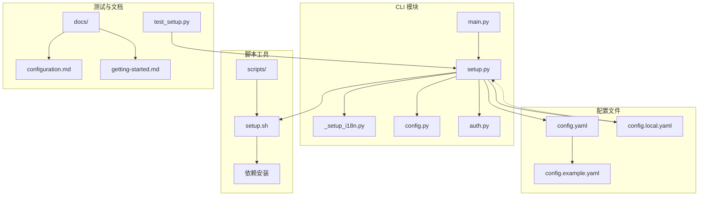

**图表来源**
- [main.py:72-94](file://src/drbrain/cli/main.py#L72-L94)
- [setup.py:1-588](file://src/drbrain/cli/setup.py#L1-L588)

**章节来源**
- [main.py:1-150](file://src/drbrain/cli/main.py#L1-L150)
- [setup.py:1-588](file://src/drbrain/cli/setup.py#L1-L588)

## 核心组件

初始化命令由多个核心组件协同工作：

### 主要组件架构

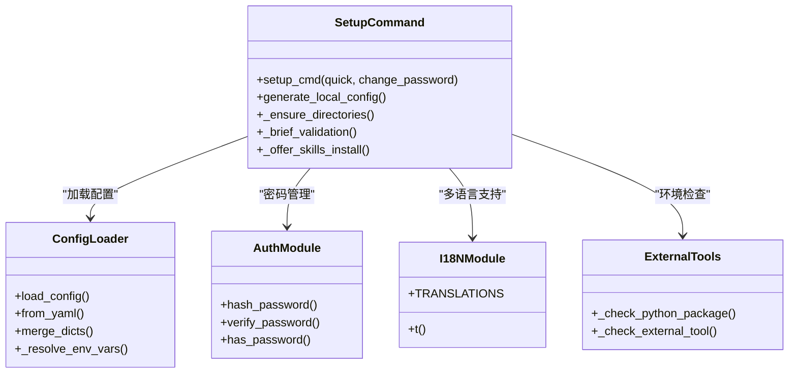

**图表来源**
- [setup.py:207-588](file://src/drbrain/cli/setup.py#L207-L588)
- [config.py:283-292](file://src/drbrain/config.py#L283-L292)
- [auth.py:7-29](file://src/drbrain/auth.py#L7-L29)

### 配置系统架构

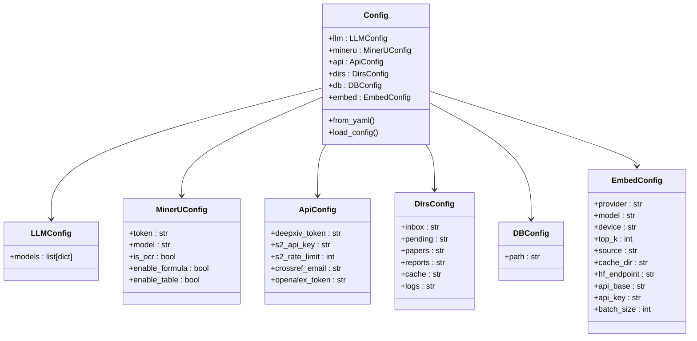

**图表来源**
- [config.py:44-193](file://src/drbrain/config.py#L44-L193)

**章节来源**
- [setup.py:31-91](file://src/drbrain/cli/setup.py#L31-L91)
- [config.py:182-292](file://src/drbrain/config.py#L182-L292)

## 架构概览

初始化命令的完整执行流程如下：

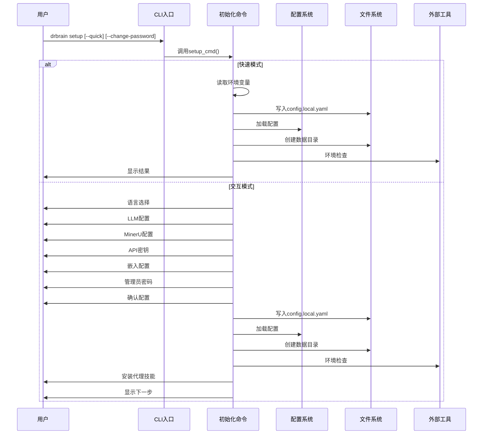

**图表来源**
- [setup.py:207-588](file://src/drbrain/cli/setup.py#L207-L588)
- [main.py:94](file://src/drbrain/cli/main.py#L94)

## 详细组件分析

### 初始化命令主流程

初始化命令支持两种执行模式：快速模式和交互模式。

#### 快速模式（--quick）

快速模式适用于自动化部署和CI/CD场景，通过环境变量自动配置所有必需参数：

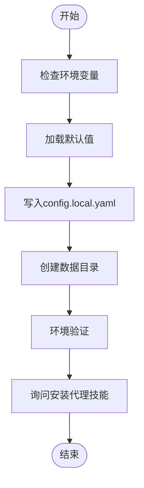

**图表来源**
- [setup.py:285-369](file://src/drbrain/cli/setup.py#L285-L369)

#### 交互模式

交互模式提供完整的配置向导，支持中英文双语界面：

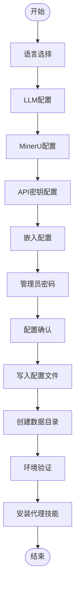

**图表来源**
- [setup.py:378-588](file://src/drbrain/cli/setup.py#L378-L588)

**章节来源**
- [setup.py:207-588](file://src/drbrain/cli/setup.py#L207-L588)

### 配置生成器

配置生成器负责将用户输入转换为标准的 YAML 格式配置文件：

#### 配置生成流程

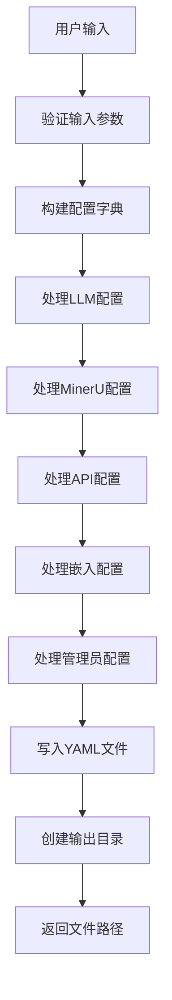

**图表来源**
- [setup.py:31-91](file://src/drbrain/cli/setup.py#L31-L91)

#### 配置参数详解

| 组件 | 参数 | 类型 | 默认值 | 描述 |
|------|------|------|--------|------|
| LLM | provider | string | "openai" | 大模型提供商 |
| LLM | model | string | "gpt-4o" | 模型名称 |
| LLM | api_key | string | "" | API密钥 |
| LLM | base_url | string | null | 自定义基础URL |
| MinerU | token | string | "" | MinerU API令牌 |
| MinerU | model | string | "vlm" | 解析模型类型 |
| MinerU | is_ocr | boolean | false | 是否启用OCR |
| MinerU | enable_formula | boolean | true | 是否解析公式 |
| MinerU | enable_table | boolean | true | 是否解析表格 |
| API | deepxiv_token | string | "" | DeepXiv令牌 |
| API | s2_rate_limit | integer | 100 | Semantic Scholar速率限制 |
| API | crossref_email | string | "" | CrossRef邮箱 |
| API | openalex_token | string | "" | OpenAlex令牌 |
| 嵌入 | provider | string | "local" | 嵌入提供者 |
| 嵌入 | model | string | "Qwen/Qwen3-Embedding-0.6B" | 模型名称 |
| 嵌入 | device | string | "auto" | 设备类型 |

**章节来源**
- [setup.py:31-91](file://src/drbrain/cli/setup.py#L31-L91)
- [config.example.yaml:1-145](file://config.example.yaml#L1-L145)

### 环境验证系统

环境验证系统检查系统的准备状态，确保所有必需组件都已正确配置：

#### 验证流程

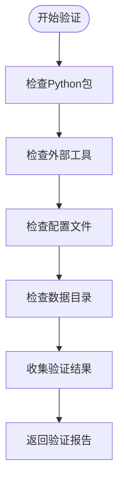

**图表来源**
- [setup.py:119-188](file://src/drbrain/cli/setup.py#L119-L188)

#### 验证项目

| 验证类别 | 检查内容 | 重要性 |
|----------|----------|--------|
| Python包 | pymupdf, litellm, typer, rich, yaml, pydantic, pyalex, arxiv, pymupdf4llm | 高 |
| 外部工具 | mineru-open-api CLI | 中 |
| 配置文件 | config.yaml, config.local.yaml | 高 |
| 数据目录 | data/spool/inbox, data/papers, data/cache等 | 高 |

**章节来源**
- [setup.py:119-188](file://src/drbrain/cli/setup.py#L119-L188)

### 多语言支持系统

初始化命令支持中英文双语界面，通过翻译模块实现本地化：

#### 翻译系统架构

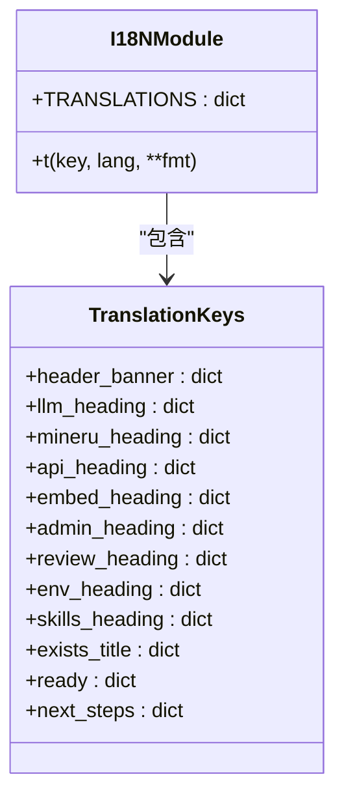

**图表来源**
- [_setup_i18n.py:6-342](file://src/drbrain/cli/_setup_i18n.py#L6-L342)

**章节来源**
- [_setup_i18n.py:1-342](file://src/drbrain/cli/_setup_i18n.py#L1-L342)

### 管理员密码管理

管理员密码功能提供额外的安全层，保护破坏性命令：

#### 密码处理流程

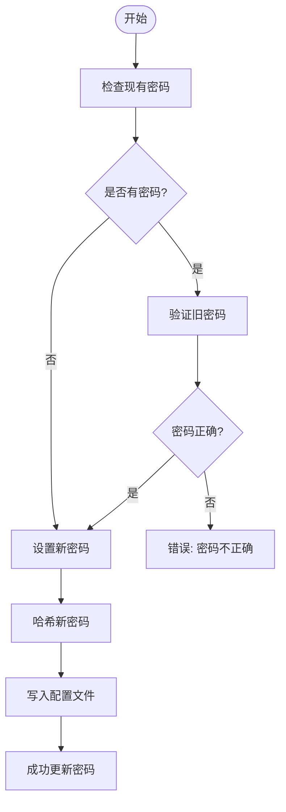

**图表来源**
- [setup.py:218-250](file://src/drbrain/cli/setup.py#L218-L250)
- [auth.py:7-29](file://src/drbrain/auth.py#L7-L29)

**章节来源**
- [setup.py:218-250](file://src/drbrain/cli/setup.py#L218-L250)
- [auth.py:1-29](file://src/drbrain/auth.py#L1-L29)

## 依赖分析

初始化命令的依赖关系图：

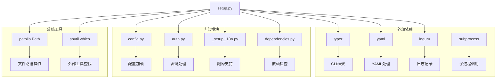

**图表来源**
- [setup.py:1-11](file://src/drbrain/cli/setup.py#L1-L11)
- [main.py:7-8](file://src/drbrain/cli/main.py#L7-L8)

### 关键依赖关系

| 依赖模块 | 用途 | 版本要求 | 重要性 |
|----------|------|----------|--------|
| typer | CLI框架 | >= 0.9.0 | 高 |
| yaml | YAML处理 | >= 5.4.0 | 高 |
| loguru | 日志记录 | >= 0.7.0 | 中 |
| pathlib | 文件路径操作 | Python内置 | 高 |
| shutil | 系统工具 | Python内置 | 高 |
| subprocess | 子进程管理 | Python内置 | 中 |

**章节来源**
- [setup.py:1-11](file://src/drbrain/cli/setup.py#L1-L11)
- [main.py:7-8](file://src/drbrain/cli/main.py#L7-L8)

## 性能考虑

初始化命令的性能优化策略：

### 内存使用优化

- 使用生成器表达式处理大型配置文件
- 按需加载配置，避免不必要的内存占用
- 及时释放临时文件句柄

### I/O性能优化

- 批量创建目录，减少系统调用次数
- 异步检查外部工具可用性
- 缓存翻译字符串以减少重复计算

### 并发处理

- 在环境验证阶段并行检查多个依赖
- 使用异步I/O处理文件系统操作
- 优化YAML序列化过程

## 故障排除指南

### 常见问题及解决方案

#### 配置文件问题

| 问题 | 症状 | 解决方案 |
|------|------|----------|
| config.local.yaml不存在 | 初始化失败或配置缺失 | 运行 `drbrain setup` 重新生成 |
| 配置格式错误 | YAML解析异常 | 检查YAML缩进和语法 |
| 环境变量未生效 | 配置值为空 | 确保环境变量已正确设置 |

#### 环境依赖问题

| 问题 | 症状 | 解决方案 |
|------|------|----------|
| Python包缺失 | 导入错误 | 运行 `uv sync` 安装依赖 |
| 外部工具不可用 | 命令找不到 | 安装对应工具并添加到PATH |
| 权限不足 | 文件创建失败 | 检查目录权限和磁盘空间 |

#### 网络连接问题

| 问题 | 症状 | 解决方案 |
|------|------|----------|
| API密钥无效 | 请求被拒绝 | 检查API密钥是否正确 |
| 速率限制 | 请求被限流 | 调整速率限制或使用付费API |
| 网络超时 | 连接失败 | 检查网络连接和防火墙设置 |

**章节来源**
- [setup.py:119-188](file://src/drbrain/cli/setup.py#L119-L188)
- [configuration.md:1-342](file://docs/configuration.md#L1-L342)

### 调试技巧

1. **启用详细日志**：使用 `--verbose` 选项查看更多调试信息
2. **检查配置优先级**：确认 `config.yaml` 和 `config.local.yaml` 的合并结果
3. **验证环境变量**：使用 `echo` 命令检查环境变量值
4. **手动测试依赖**：直接运行外部工具命令验证可用性

## 结论

DrBrain 初始化命令是一个功能完整、设计良好的配置工具，它提供了以下优势：

### 主要特性

- **双模式支持**：既支持交互式配置，也支持自动化部署
- **多语言界面**：提供中英文双语支持
- **全面的环境检查**：自动验证所有依赖和配置
- **灵活的配置生成**：支持多种配置场景和参数组合
- **安全的密码管理**：提供管理员密码保护机制

### 最佳实践建议

1. **首次使用**：推荐使用交互模式获得完整的配置指导
2. **自动化部署**：使用 `--quick` 模式配合环境变量进行CI/CD集成
3. **生产环境**：确保所有API密钥和敏感信息存储在 `config.local.yaml` 中
4. **定期维护**：使用 `drbrain check` 命令定期验证环境状态

初始化命令为DrBrain系统的成功部署奠定了坚实的基础，通过其直观的界面和强大的功能，使得复杂的配置过程变得简单易懂。

## 附录

### 配置文件示例

#### 基础配置示例

```yaml
# config.yaml - 基础配置模板
llm:
  models:
    - provider: openai
      model: gpt-4o
      api_key: "${OPENAI_API_KEY}"

mineru:
  token: "${MINERU_TOKEN}"
  model: "vlm"
  is_ocr: false
  enable_formula: true
  enable_table: true

db:
  path: "data/drbrain.db"

dirs:
  inbox: "data/spool/inbox"
  pending: "data/spool/pending"
  papers: "data/papers"
  reports: "data/reports"
  cache: "data/cache"
  logs: "data/logs"
```

#### 本地配置示例

```yaml
# config.local.yaml - 本地配置覆盖
llm:
  models:
    - provider: openai
      model: gpt-4o
      api_key: "sk-your-secret-key"

mineru:
  token: "your-mineru-token"

api:
  deepxiv_token: "your-deepxiv-token"
  crossref_email: "your-email@example.com"
  openalex_token: "your-openalex-token"

embed:
  provider: "local"
  model: "Qwen/Qwen3-Embedding-0.6B"
  device: "auto"
```

### 命令行参考

#### 基本用法

```bash
# 交互式初始化
drbrain setup

# 快速初始化（使用环境变量）
drbrain setup --quick

# 修改管理员密码
drbrain setup --change-password
```

#### 选项说明

| 选项 | 简写 | 类型 | 默认值 | 描述 |
|------|------|------|--------|------|
| --quick | -q | boolean | false | 跳过交互提示，使用默认值 |
| --change-password |  | boolean | false | 修改管理员密码 |

#### 环境变量

| 变量名 | 默认值 | 描述 |
|--------|--------|------|
| DRBRAIN_LLM_PROVIDER | "openai" | LLM提供商 |
| DRBRAIN_LLM_MODEL | 根据提供商 | LLM模型名称 |
| OPENAI_API_KEY | "" | OpenAI API密钥 |
| ANTHROPIC_API_KEY | "" | Anthropic API密钥 |
| DEEPSEEK_API_KEY | "" | DeepSeek API密钥 |
| MINERU_TOKEN | "" | MinerU API令牌 |
| DRBRAIN_MINERU_MODEL | "vlm" | MinerU模型类型 |
| DRBRAIN_MINERU_OCR | "" | 是否启用OCR |
| DRBRAIN_MINERU_FORMULA | "1" | 是否解析公式 |
| DRBRAIN_MINERU_TABLE | "1" | 是否解析表格 |
| DRBRAIN_EMBED_PROVIDER | "local" | 嵌入提供者 |
| DRBRAIN_EMBED_MODEL | "" | 嵌入模型名称 |
| DRBRAIN_EMBED_API_KEY | "" | 嵌入API密钥 |
| DRBRAIN_EMBED_API_BASE | "" | 嵌入API基础URL |
| DRBRAIN_EMBED_DEVICE | "auto" | 嵌入设备类型 |

**章节来源**
- [config.example.yaml:1-145](file://config.example.yaml#L1-L145)
- [config.yaml:1-72](file://config.yaml#L1-L72)
- [setup.py:285-369](file://src/drbrain/cli/setup.py#L285-L369)