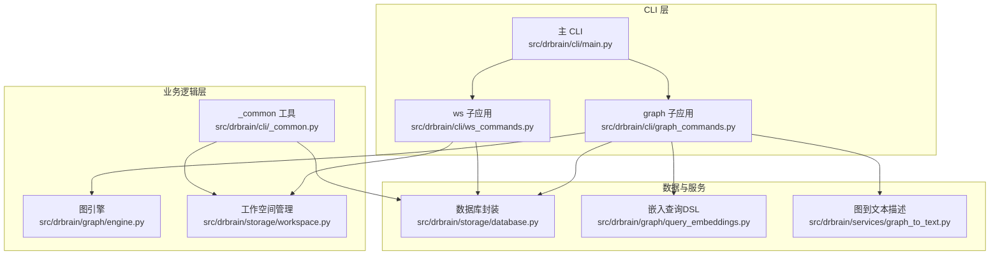
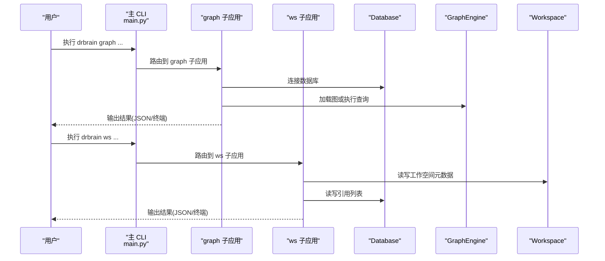
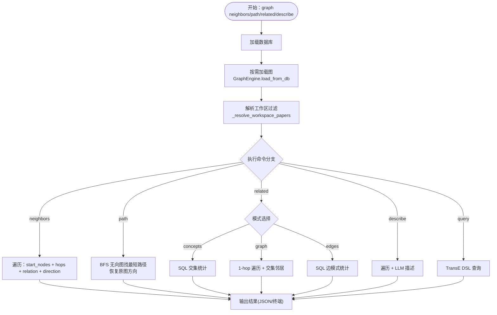
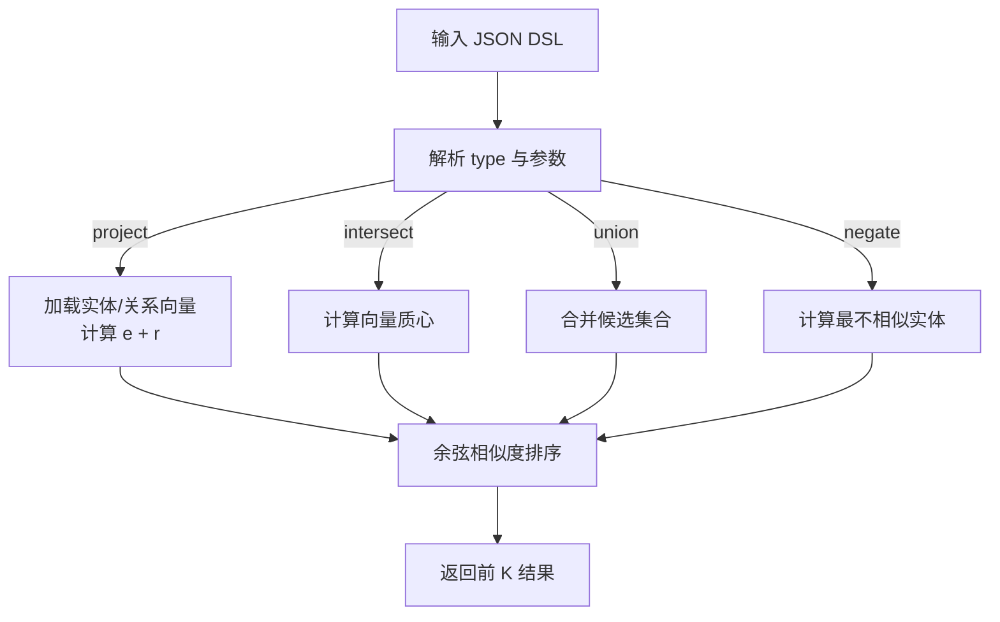
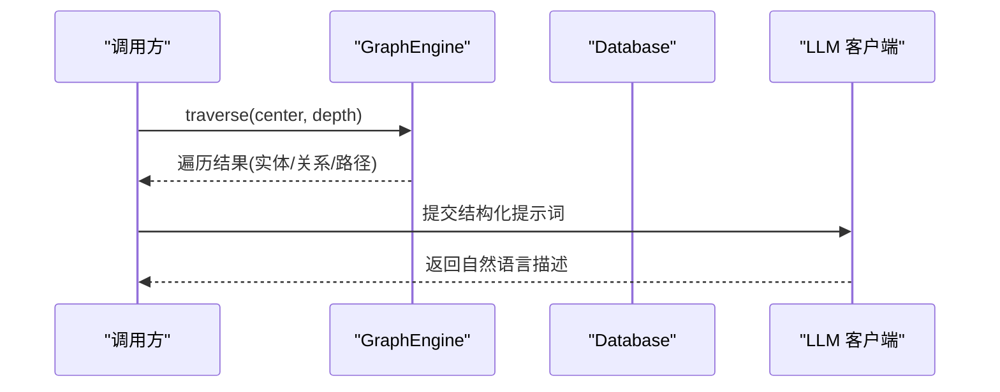
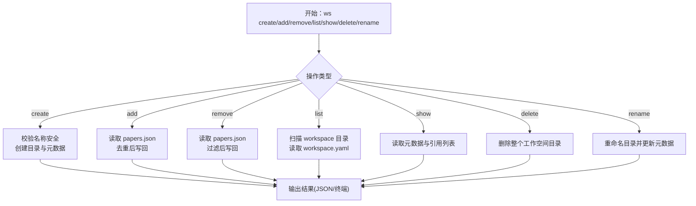
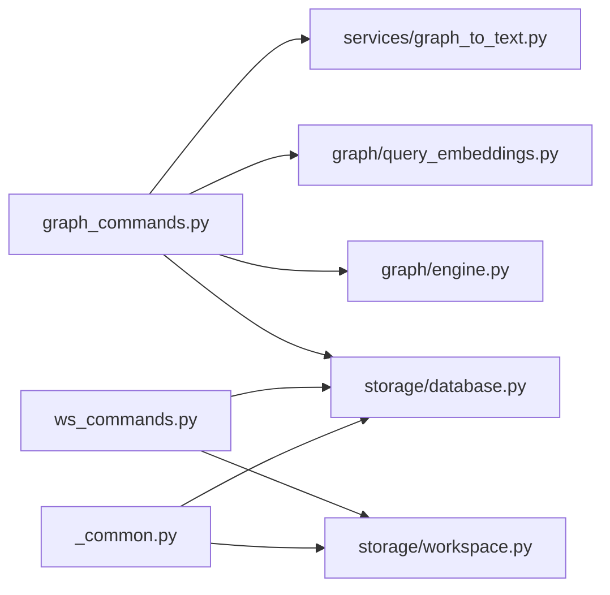

# 子应用

<cite>
**本文引用的文件**
- [README.md](file://README.md)
- [config.example.yaml](file://config.example.yaml)
- [src/drbrain/cli/main.py](file://src/drbrain/cli/main.py)
- [src/drbrain/cli/graph_commands.py](file://src/drbrain/cli/graph_commands.py)
- [src/drbrain/cli/ws_commands.py](file://src/drbrain/cli/ws_commands.py)
- [src/drbrain/cli/_common.py](file://src/drbrain/cli/_common.py)
- [src/drbrain/storage/workspace.py](file://src/drbrain/storage/workspace.py)
- [src/drbrain/storage/database.py](file://src/drbrain/storage/database.py)
- [src/drbrain/graph/engine.py](file://src/drbrain/graph/engine.py)
- [src/drbrain/graph/query_embeddings.py](file://src/drbrain/graph/query_embeddings.py)
- [src/drbrain/services/graph_to_text.py](file://src/drbrain/services/graph_to_text.py)
- [skills/graph/SKILL.md](file://skills/graph/SKILL.md)
- [skills/workspace-analysis/SKILL.md](file://skills/workspace-analysis/SKILL.md)
</cite>

## 目录
1. [简介](#简介)
2. [项目结构](#项目结构)
3. [核心组件](#核心组件)
4. [架构总览](#架构总览)
5. [详细组件分析](#详细组件分析)
6. [依赖分析](#依赖分析)
7. [性能考虑](#性能考虑)
8. [故障排查指南](#故障排查指南)
9. [结论](#结论)
10. [附录](#附录)

## 简介
本文件聚焦 DrBrain 的两个子应用：graph（知识图分析）与 ws（工作空间）。前者提供直接的图查询能力，包括邻居遍历、最短路径、跨论文概念分析、子图描述、嵌入式复杂查询与混合树+图遍历；后者提供工作空间的创建、增删、列举、展示、重命名与删除等管理能力，并支持在分析命令中通过工作区限定范围，实现“聚焦研究”的能力。文档覆盖功能说明、使用方法、启动方式、配置项与集成使用建议，帮助用户快速上手并高效利用这两个子应用。

## 项目结构
- 子应用入口由主 CLI 注册为独立子命令：
  - graph 子应用：通过 graph_app 注册，包含 neighbors、path、related、describe、query、traverse-from 等命令。
  - ws 子应用：通过 ws_app 注册，包含 create、add、remove、list、show、delete、rename 等命令。
- 数据层采用 SQLite（Database），图计算基于 NetworkX（GraphEngine），并提供嵌入式查询与自然语言描述服务。

图表来源
- [src/drbrain/cli/main.py:144-146](file://src/drbrain/cli/main.py#L144-L146)
- [src/drbrain/cli/graph_commands.py:17](file://src/drbrain/cli/graph_commands.py#L17)
- [src/drbrain/cli/ws_commands.py:9](file://src/drbrain/cli/ws_commands.py#L9)
- [src/drbrain/graph/engine.py:33](file://src/drbrain/graph/engine.py#L33)
- [src/drbrain/storage/workspace.py:71](file://src/drbrain/storage/workspace.py#L71)
- [src/drbrain/storage/database.py:159](file://src/drbrain/storage/database.py#L159)
- [src/drbrain/graph/query_embeddings.py:133](file://src/drbrain/graph/query_embeddings.py#L133)
- [src/drbrain/services/graph_to_text.py:70](file://src/drbrain/services/graph_to_text.py#L70)

章节来源
- [src/drbrain/cli/main.py:144-146](file://src/drbrain/cli/main.py#L144-L146)
- [README.md:24-66](file://README.md#L24-L66)

## 核心组件
- graph 子应用
  - 命令族：neighbors、path、related、describe、query、traverse-from
  - 关键依赖：GraphEngine（NetworkX 多重有向图）、Database（SQLite）、query_embeddings（TransE 嵌入查询 DSL）、graph_to_text（LLM 图描述）
- ws 子应用
  - 命令族：create、add、remove、list、show、delete、rename
  - 关键依赖：workspace.py（工作空间元数据与引用列表管理）、Database（SQLite）

章节来源
- [src/drbrain/cli/graph_commands.py:20-756](file://src/drbrain/cli/graph_commands.py#L20-L756)
- [src/drbrain/cli/ws_commands.py:12-171](file://src/drbrain/cli/ws_commands.py#L12-L171)
- [src/drbrain/graph/engine.py:33-800](file://src/drbrain/graph/engine.py#L33-L800)
- [src/drbrain/storage/workspace.py:71-212](file://src/drbrain/storage/workspace.py#L71-L212)

## 架构总览
graph 与 ws 子应用均通过主 CLI 注册为独立子命令，内部通过公共工具函数解析工作区过滤参数，加载数据库连接，调用各自的业务模块完成操作。graph 子应用进一步结合图引擎与嵌入查询能力，提供符号驱动的知识推理与检索增强能力；ws 子应用则围绕“纸张集合”进行管理与分析命令的范围限定。

图表来源
- [src/drbrain/cli/main.py:144-146](file://src/drbrain/cli/main.py#L144-L146)
- [src/drbrain/cli/graph_commands.py:41-756](file://src/drbrain/cli/graph_commands.py#L41-L756)
- [src/drbrain/cli/ws_commands.py:12-171](file://src/drbrain/cli/ws_commands.py#L12-L171)
- [src/drbrain/storage/database.py:159-775](file://src/drbrain/storage/database.py#L159-L775)
- [src/drbrain/graph/engine.py:760-786](file://src/drbrain/graph/engine.py#L760-L786)
- [src/drbrain/storage/workspace.py:142-168](file://src/drbrain/storage/workspace.py#L142-L168)

## 详细组件分析

### graph 子应用
- 功能概览
  - 邻居遍历 neighbors：从给定节点出发，按跳数、关系类型与方向进行遍历，输出邻接节点及路径信息。
  - 最短路径 path：在无向图上寻找两点间最短路径，恢复原图边的方向与关系。
  - 共享分析 related：支持三种模式：
    - concepts：SQL 按标签交集统计共享概念数量与覆盖率。
    - graph：对每篇论文的概念做 1-hop 遍历，求共享邻居并给出路径。
    - edges：统计共享（关系，目标）边模式。
  - 子图描述 describe：围绕中心节点遍历并生成自然语言描述，可选 JSON 输出。
  - 嵌入查询 query：基于 TransE 向量运算的复杂查询（投影、交集、并集、否定），支持 JSON DSL。
  - 混合树+图遍历 traverse-from：从文档树中的某个节出发，找到锚定的概念，再在知识图中遍历。
- 关键流程
  - 通用前置：解析工作区过滤参数（--workspace/-w），加载数据库，必要时加载图。
  - neighbors/path/related/describe：根据参数构建遍历或查询，返回结构化结果。
  - query：解析 JSON DSL，调用嵌入查询模块，返回排序后的实体列表。
  - traverse-from：先在所有论文的 tree.json 中匹配节名，收集锚定概念，再在图中遍历。
- 输出格式
  - 默认人类可读输出；--json 可输出 JSON 结构，便于脚本处理与集成。

图表来源
- [src/drbrain/cli/graph_commands.py:20-756](file://src/drbrain/cli/graph_commands.py#L20-L756)
- [src/drbrain/graph/engine.py:62-122](file://src/drbrain/graph/engine.py#L62-L122)
- [src/drbrain/graph/query_embeddings.py:133-226](file://src/drbrain/graph/query_embeddings.py#L133-L226)
- [src/drbrain/services/graph_to_text.py:70-145](file://src/drbrain/services/graph_to_text.py#L70-L145)
- [src/drbrain/cli/_common.py:370-381](file://src/drbrain/cli/_common.py#L370-L381)

章节来源
- [skills/graph/SKILL.md:25-126](file://skills/graph/SKILL.md#L25-L126)
- [src/drbrain/cli/graph_commands.py:20-756](file://src/drbrain/cli/graph_commands.py#L20-L756)
- [src/drbrain/graph/engine.py:33-800](file://src/drbrain/graph/engine.py#L33-L800)
- [src/drbrain/graph/query_embeddings.py:133-226](file://src/drbrain/graph/query_embeddings.py#L133-L226)
- [src/drbrain/services/graph_to_text.py:70-145](file://src/drbrain/services/graph_to_text.py#L70-L145)

#### 嵌入查询 DSL（TransE）
- 支持的操作
  - project：实体 + 关系向量近似指向目标实体（e + r ≈ t）
  - intersect：多个实体向量的质心，返回最接近的实体集合
  - union：合并多分支候选集合，保留最高分
  - negate：返回与给定向量最不相似的实体
- 使用场景
  - 在已训练嵌入向量基础上，进行语义层面的复合查询与推理，辅助图分析与检索增强。

图表来源
- [src/drbrain/graph/query_embeddings.py:133-226](file://src/drbrain/graph/query_embeddings.py#L133-L226)

章节来源
- [src/drbrain/graph/query_embeddings.py:133-226](file://src/drbrain/graph/query_embeddings.py#L133-L226)

#### 子图描述（LLM）
- 流程
  - 遍历中心节点的邻居（可选深度），收集实体与关系。
  - 构造结构化提示词，调用 LLM 生成自然语言描述。
  - 返回纯文本摘要，支持 JSON 输出。
- 应用价值
  - 将复杂的图路径转化为易理解的自然语言，辅助知识发现与汇报。

图表来源
- [src/drbrain/services/graph_to_text.py:70-145](file://src/drbrain/services/graph_to_text.py#L70-L145)
- [src/drbrain/graph/engine.py:62-122](file://src/drbrain/graph/engine.py#L62-L122)

章节来源
- [src/drbrain/services/graph_to_text.py:70-145](file://src/drbrain/services/graph_to_text.py#L70-L145)

### ws 子应用
- 功能概览
  - 创建工作空间 create：创建目录与元数据文件，记录名称、描述与创建时间。
  - 添加/移除 papers：向工作空间添加或移除纸张引用（仅引用，不复制文件）。
  - 列表/显示/删除/重命名：列出所有工作空间、查看详情、删除工作空间、重命名工作空间。
- 关键流程
  - create：校验名称安全，创建 refs 目录，写入 workspace.yaml 与空 papers.json。
  - add/remove：读取 papers.json，去重后写回；支持批量。
  - list/show/delete/rename：读取元数据与引用列表，执行相应操作。
- 权限与协作
  - 当前实现为本地文件系统级管理，未内置用户权限与并发写锁；建议配合版本控制与共享存储使用，避免多人同时修改同一工作空间。

图表来源
- [src/drbrain/cli/ws_commands.py:12-171](file://src/drbrain/cli/ws_commands.py#L12-L171)
- [src/drbrain/storage/workspace.py:71-212](file://src/drbrain/storage/workspace.py#L71-L212)

章节来源
- [skills/workspace-analysis/SKILL.md:24-89](file://skills/workspace-analysis/SKILL.md#L24-L89)
- [src/drbrain/cli/ws_commands.py:12-171](file://src/drbrain/cli/ws_commands.py#L12-L171)
- [src/drbrain/storage/workspace.py:71-212](file://src/drbrain/storage/workspace.py#L71-L212)

## 依赖分析
- 组件耦合
  - graph 子应用依赖 GraphEngine（图结构与规则闭包）、Database（图边与概念数据）、query_embeddings（嵌入查询）、graph_to_text（LLM 描述）。
  - ws 子应用依赖 workspace.py（工作空间元数据与引用列表）与 Database（持久化）。
  - 两者均通过 _common.py 的 _resolve_workspace_papers 实现“工作区过滤”能力。
- 外部依赖
  - NetworkX（图算法）、NumPy（向量运算）、SQLite（轻量存储）、loguru（日志）。
- 潜在循环依赖
  - 未见直接循环导入；graph 与 ws 子应用相互独立，通过主 CLI 路由。

图表来源
- [src/drbrain/cli/graph_commands.py:11-15](file://src/drbrain/cli/graph_commands.py#L11-L15)
- [src/drbrain/cli/ws_commands.py:19](file://src/drbrain/cli/ws_commands.py#L19)
- [src/drbrain/cli/_common.py:370-381](file://src/drbrain/cli/_common.py#L370-L381)

章节来源
- [src/drbrain/cli/graph_commands.py:11-15](file://src/drbrain/cli/graph_commands.py#L11-L15)
- [src/drbrain/cli/ws_commands.py:19](file://src/drbrain/cli/ws_commands.py#L19)
- [src/drbrain/cli/_common.py:370-381](file://src/drbrain/cli/_common.py#L370-L381)

## 性能考虑
- 图遍历与 BFS
  - neighbors/path 使用 BFS，注意 hops 参数与图规模；过大可能导致内存与时间开销上升。
- 嵌入查询
  - query 命令依赖已训练的嵌入向量；首次运行可能触发加载或训练流程，建议提前完成 embed 训练。
- LLM 描述
  - describe 命令会并发调用 LLM，注意模型提供商速率限制与成本控制。
- 工作区过滤
  - 通过 _resolve_workspace_papers 将 paper_ids 作为过滤条件，减少图加载与遍历范围，提升性能。

[本节为通用指导，无需特定文件引用]

## 故障排查指南
- graph 子应用
  - 节点不存在：当指定节点不在图中时，命令会报错并退出。请确认节点标签或纸张 ID 是否正确。
  - 无效关系类型/方向：命令会校验关系集合与方向参数，错误时打印有效值列表。
  - 无路径：path 命令在最大长度限制下无路径时会提示。
  - 嵌入未训练：query 命令需要已训练的嵌入向量，否则返回空结果。
- ws 子应用
  - 工作空间不存在：show/delete/rename 等命令若工作空间不存在会报错。
  - 名称非法：create/rename 会拒绝包含非法字符或路径分隔符的名称。
  - 并发冲突：多人同时修改同一工作空间可能导致数据不一致，建议配合版本控制或共享存储策略。

章节来源
- [src/drbrain/cli/graph_commands.py:44-73](file://src/drbrain/cli/graph_commands.py#L44-L73)
- [src/drbrain/cli/graph_commands.py:174-206](file://src/drbrain/cli/graph_commands.py#L174-L206)
- [src/drbrain/storage/workspace.py:22-40](file://src/drbrain/storage/workspace.py#L22-L40)
- [src/drbrain/storage/workspace.py:158-162](file://src/drbrain/storage/workspace.py#L158-L162)

## 结论
graph 与 ws 子应用分别覆盖了“知识图分析”与“工作空间管理”的核心需求。graph 子应用提供了从符号到向量的多维分析能力，适合深入探索概念关系与知识前沿；ws 子应用则提供了聚焦研究的组织与范围限定能力，便于在特定子域内开展系统性分析。二者结合可形成“范围限定 + 图分析”的完整工作流，提升研究效率与质量。

[本节为总结，无需特定文件引用]

## 附录

### 启动方式与配置
- 启动方式
  - 通过主 CLI 调用子应用：
    - drbrain graph neighbors ...
    - drbrain graph path ...
    - drbrain graph related ...
    - drbrain graph describe ...
    - drbrain graph query ...
    - drbrain graph traverse-from ...
    - drbrain ws create|add|remove|list|show|delete|rename ...
- 配置项
  - LLM 模型与提供商、MinerU 解析器、数据库路径、数据目录、外部 API、BM25 参数、嵌入服务、质量控制队列、备份目标等。
  - 示例配置文件：config.example.yaml

章节来源
- [README.md:24-66](file://README.md#L24-L66)
- [config.example.yaml:12-145](file://config.example.yaml#L12-L145)
- [src/drbrain/cli/main.py:144-146](file://src/drbrain/cli/main.py#L144-L146)

### 集成使用方法
- 在分析命令中使用工作区限定
  - 多个分析命令支持 --workspace/-w 选项，如 analyze、seed、query、stats、closure、export 等（具体以各命令实现为准）。
  - 通过 _resolve_workspace_papers 将工作区内的 paper_ids 作为过滤条件，缩小分析范围。
- 与主流程衔接
  - 先通过 ingest/pipeline/build 完成库构建，再使用 graph 子应用进行图分析；随后可将分析结果导出至工作区，供后续汇报与协作使用。

章节来源
- [src/drbrain/cli/_common.py:370-381](file://src/drbrain/cli/_common.py#L370-L381)
- [skills/workspace-analysis/SKILL.md:44-53](file://skills/workspace-analysis/SKILL.md#L44-L53)