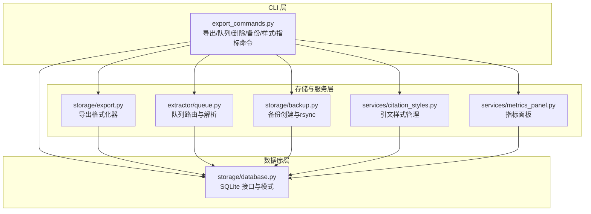
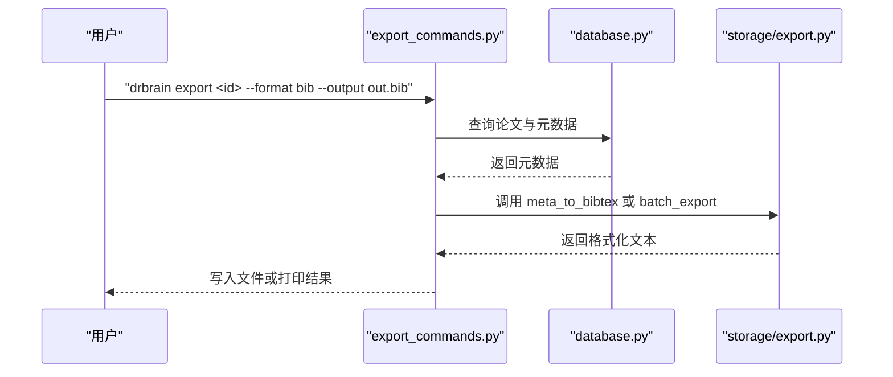
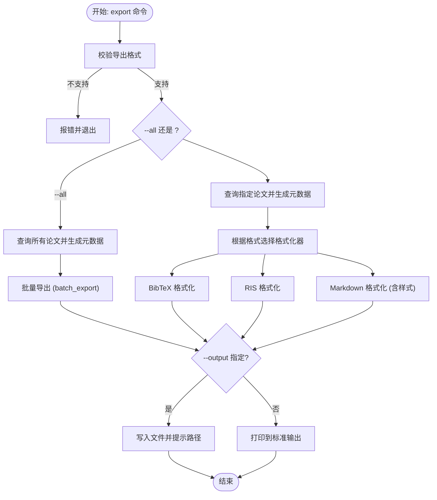
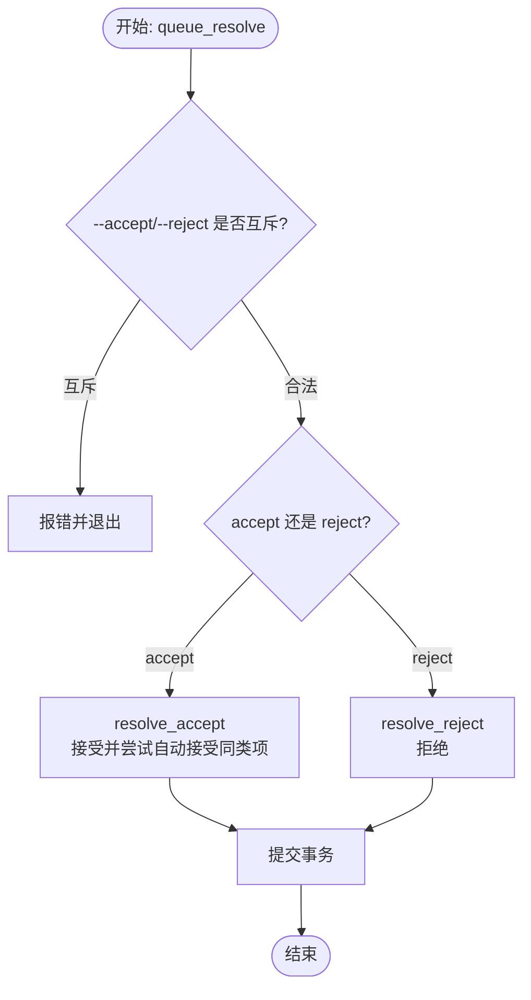
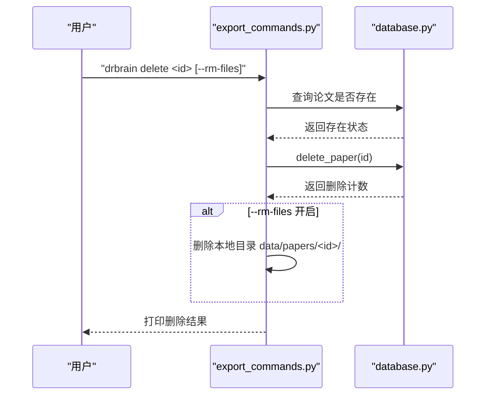
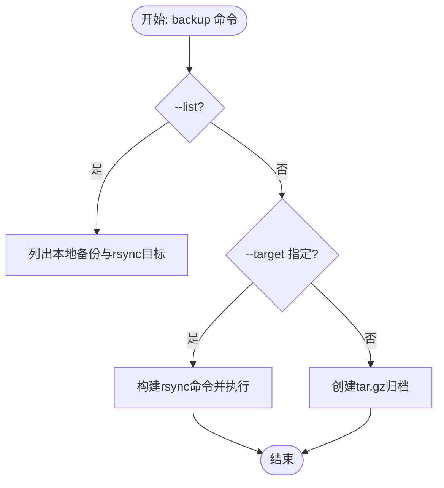
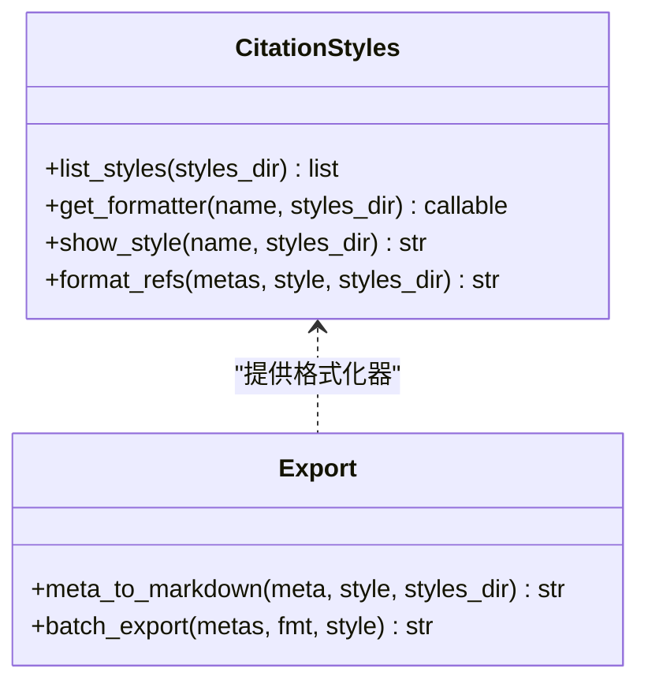
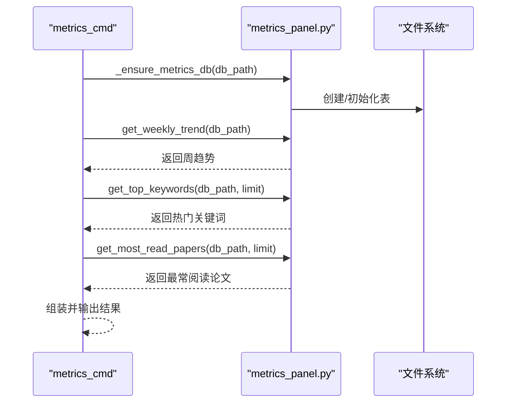
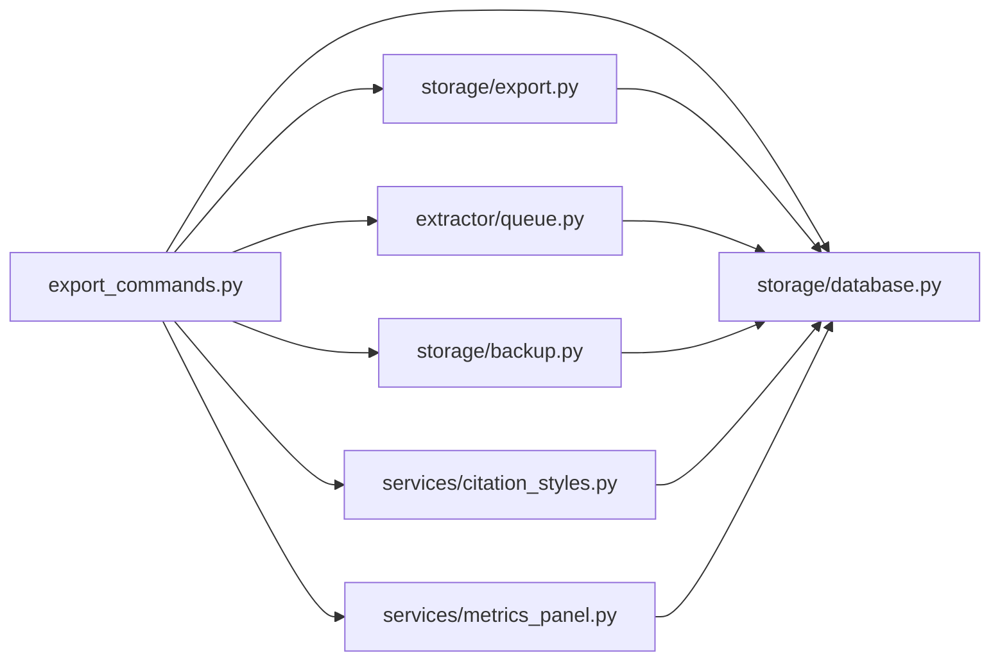

# 导出管理命令

<cite>
**本文档引用的文件**
- [export_commands.py](file://src/drbrain/cli/export_commands.py)
- [export.py](file://src/drbrain/storage/export.py)
- [queue.py](file://src/drbrain/extractor/queue.py)
- [database.py](file://src/drbrain/storage/database.py)
- [backup.py](file://src/drbrain/storage/backup.py)
- [citation_styles.py](file://src/drbrain/services/citation_styles.py)
- [metrics_panel.py](file://src/drbrain/services/metrics_panel.py)
- [SKILL.md（导出）](file://skills/export/SKILL.md)
- [SKILL.md（备份）](file://skills/backup/SKILL.md)
- [SKILL.md（引文样式）](file://skills/citation-styles/SKILL.md)
- [SKILL.md（文档检查）](file://skills/document/SKILL.md)
- [SKILL.md（指标）](file://skills/metrics/SKILL.md)
- [cli-reference.md](file://docs/cli-reference.md)
- [test_cli_commands.py](file://tests/test_cli_commands.py)
- [test_delete_cmd.py](file://tests/test_delete_cmd.py)
</cite>

## 目录
1. [简介](#简介)
2. [项目结构](#项目结构)
3. [核心组件](#核心组件)
4. [架构概览](#架构概览)
5. [详细组件分析](#详细组件分析)
6. [依赖关系分析](#依赖关系分析)
7. [性能考虑](#性能考虑)
8. [故障排除指南](#故障排除指南)
9. [结论](#结论)
10. [附录](#附录)

## 简介
本文件系统性梳理 DrBrain 的导出管理相关命令，涵盖 export、queue、queue resolve、queue resolve-all、delete、lineage、document、metrics、style、backup 等命令的功能与用法。重点说明导出格式（BibTeX、RIS、Markdown）、备份策略（本地 tar.gz 与远程 rsync）、数据管理操作以及批量处理与自动化脚本实践。文档同时提供数据流图、序列图与类图，帮助读者从不同层面理解命令实现与交互。

## 项目结构
导出管理相关功能主要分布在以下模块：
- CLI 命令层：负责参数解析、输出控制与调用业务逻辑
- 存储与服务层：负责数据导出、备份、引文样式与指标统计
- 数据库层：提供论文、概念、关系、队列等数据访问接口

**图表来源**
- [export_commands.py:21-628](file://src/drbrain/cli/export_commands.py#L21-L628)
- [export.py:1-180](file://src/drbrain/storage/export.py#L1-L180)
- [queue.py:1-106](file://src/drbrain/extractor/queue.py#L1-L106)
- [backup.py:1-240](file://src/drbrain/storage/backup.py#L1-L240)
- [citation_styles.py:1-389](file://src/drbrain/services/citation_styles.py#L1-L389)
- [metrics_panel.py:1-139](file://src/drbrain/services/metrics_panel.py#L1-L139)
- [database.py:1-200](file://src/drbrain/storage/database.py#L1-L200)

**章节来源**
- [export_commands.py:21-628](file://src/drbrain/cli/export_commands.py#L21-L628)
- [export.py:1-180](file://src/drbrain/storage/export.py#L1-L180)
- [queue.py:1-106](file://src/drbrain/extractor/queue.py#L1-L106)
- [backup.py:1-240](file://src/drbrain/storage/backup.py#L1-L240)
- [citation_styles.py:1-389](file://src/drbrain/services/citation_styles.py#L1-L389)
- [metrics_panel.py:1-139](file://src/drbrain/services/metrics_panel.py#L1-L139)
- [database.py:1-200](file://src/drbrain/storage/database.py#L1-L200)

## 核心组件
- 导出命令（export）：支持单篇或全库导出，格式包括 BibTeX、RIS、Markdown；可指定样式与输出路径，支持 JSON 输出。
- 队列命令（queue、queue resolve、queue resolve-all）：查看待处理项、人工接受/拒绝、批量处理；支持按类型与置信度过滤。
- 删除命令（delete）：删除论文及其关联的概念、关系、队列项等；可选择是否删除本地文件目录。
- 备份命令（backup）：创建本地 tar.gz 备份或通过 rsync 同步到远程目标；支持列出现有备份与目标。
- 引文样式（style）：列出内置与自定义样式、显示样式源码；用于 Markdown 导出格式化。
- 指标（metrics）：展示用户行为分析，包括周趋势、热门关键词、最常阅读论文。
- 文档检查（document）：对 Office 文档进行结构化内容摘要检查。

**章节来源**
- [export_commands.py:21-628](file://src/drbrain/cli/export_commands.py#L21-L628)
- [export.py:68-180](file://src/drbrain/storage/export.py#L68-L180)
- [queue.py:10-106](file://src/drbrain/extractor/queue.py#L10-L106)
- [backup.py:26-240](file://src/drbrain/storage/backup.py#L26-L240)
- [citation_styles.py:234-389](file://src/drbrain/services/citation_styles.py#L234-L389)
- [metrics_panel.py:13-139](file://src/drbrain/services/metrics_panel.py#L13-L139)
- [database.py:105-156](file://src/drbrain/storage/database.py#L105-L156)

## 架构概览
下图展示导出命令从 CLI 到存储层的调用链路与关键数据转换：

**图表来源**
- [export_commands.py:21-78](file://src/drbrain/cli/export_commands.py#L21-L78)
- [export.py:68-106](file://src/drbrain/storage/export.py#L68-L106)
- [database.py:105-156](file://src/drbrain/storage/database.py#L105-L156)

## 详细组件分析

### 导出命令（export）
- 功能要点
  - 支持单篇导出与全库导出
  - 导出格式：BibTeX（.bib）、RIS（.ris）、Markdown（list）
  - Markdown 导出支持样式（APA、Vancouver、Chicago、MLA 及自定义）
  - 输出控制：stdout、文件写入、JSON 包裹
- 关键流程
  - 参数校验与格式选择
  - 数据库查询与元数据组装
  - 格式化器调用与批量导出
  - 结果输出与错误处理

**图表来源**
- [export_commands.py:21-78](file://src/drbrain/cli/export_commands.py#L21-L78)
- [export.py:68-180](file://src/drbrain/storage/export.py#L68-L180)

**章节来源**
- [export_commands.py:21-78](file://src/drbrain/cli/export_commands.py#L21-L78)
- [export.py:68-180](file://src/drbrain/storage/export.py#L68-L180)
- [SKILL.md（导出）:14-86](file://skills/export/SKILL.md#L14-L86)
- [cli-reference.md:617-635](file://docs/cli-reference.md#L617-L635)

### 队列管理（queue、queue resolve、queue resolve-all）
- 功能要点
  - queue：列出所有待处理项（包含类型、标签、置信度、来源论文）
  - queue resolve：接受或拒绝单个队列项；互斥参数校验
  - queue resolve-all：批量接受/拒绝，支持按类型与最大置信度过滤
- 关键机制
  - 队列项路由：高置信度自动接受，中等置信度弱确认，低置信度入队
  - 共识检测：当某概念在多篇论文中出现且置信度达标时，可自动接受同类项

**图表来源**
- [export_commands.py:122-164](file://src/drbrain/cli/export_commands.py#L122-L164)
- [queue.py:48-75](file://src/drbrain/extractor/queue.py#L48-L75)

**章节来源**
- [export_commands.py:80-225](file://src/drbrain/cli/export_commands.py#L80-L225)
- [queue.py:10-106](file://src/drbrain/extractor/queue.py#L10-L106)
- [database.py:105-156](file://src/drbrain/storage/database.py#L105-L156)

### 删除命令（delete）
- 功能要点
  - 删除论文及其关联数据：概念、论点、边、队列项
  - 可选删除本地文件目录（data/papers/<id>/）
  - 支持 JSON 输出与强制模式
- 数据一致性
  - 使用外键约束与级联删除保证完整性
  - 删除后返回各类实体计数

**图表来源**
- [export_commands.py:227-281](file://src/drbrain/cli/export_commands.py#L227-L281)
- [database.py:105-156](file://src/drbrain/storage/database.py#L105-L156)

**章节来源**
- [export_commands.py:227-281](file://src/drbrain/cli/export_commands.py#L227-L281)
- [test_delete_cmd.py:9-108](file://tests/test_delete_cmd.py#L9-L108)
- [database.py:105-156](file://src/drbrain/storage/database.py#L105-L156)

### 备份命令（backup）
- 功能要点
  - 本地 tar.gz 备份：打包 papers、数据库、workspace、reports
  - 列表现有备份与 rsync 目标
  - 远程同步：基于配置构建 rsync 命令，支持压缩、排除规则、凭据
- 流程
  - --list：列出本地备份与已配置的 rsync 目标
  - --target：<name>：执行 rsync 同步（可 dry-run 预览）
  - 默认：创建时间戳命名的 tar.gz 文件

**图表来源**
- [export_commands.py:283-427](file://src/drbrain/cli/export_commands.py#L283-L427)
- [backup.py:26-240](file://src/drbrain/storage/backup.py#L26-L240)

**章节来源**
- [export_commands.py:283-427](file://src/drbrain/cli/export_commands.py#L283-L427)
- [backup.py:26-240](file://src/drbrain/storage/backup.py#L26-L240)
- [SKILL.md（备份）:10-58](file://skills/backup/SKILL.md#L10-L58)

### 引文样式（style）
- 功能要点
  - 列出可用样式（内置与自定义）
  - 显示特定样式的源码（内置样式显示描述）
  - 支持自定义样式文件（data/citation_styles/<name>.py），需实现 format_ref(meta, idx)
- 与导出的关系
  - Markdown 导出时通过样式名称选择格式化函数

**图表来源**
- [citation_styles.py:234-389](file://src/drbrain/services/citation_styles.py#L234-L389)
- [export.py:152-179](file://src/drbrain/storage/export.py#L152-L179)

**章节来源**
- [export_commands.py:429-478](file://src/drbrain/cli/export_commands.py#L429-L478)
- [citation_styles.py:234-389](file://src/drbrain/services/citation_styles.py#L234-L389)
- [SKILL.md（引文样式）:11-57](file://skills/citation-styles/SKILL.md#L11-L57)

### 指标（metrics）
- 功能要点
  - 统计搜索事件、阅读事件
  - 计算周趋势（总搜索/阅读次数、唯一关键词/论文数）
  - 热门关键词与最常阅读论文排行
- 数据库
  - 独立的 metrics.db，包含 search_events 与 read_events 表

**图表来源**
- [export_commands.py:576-628](file://src/drbrain/cli/export_commands.py#L576-L628)
- [metrics_panel.py:13-139](file://src/drbrain/services/metrics_panel.py#L13-L139)

**章节来源**
- [export_commands.py:576-628](file://src/drbrain/cli/export_commands.py#L576-L628)
- [metrics_panel.py:13-139](file://src/drbrain/services/metrics_panel.py#L13-L139)
- [SKILL.md（指标）:11-42](file://skills/metrics/SKILL.md#L11-L42)

### 文档检查（document）
- 功能要点
  - 对 Office 文档（DOCX、PPTX、XLSX）进行结构化内容摘要
  - 支持格式覆盖与错误处理
- 适用场景
  - 验证文档结构、检测布局问题、预览内容

**章节来源**
- [export_commands.py:554-574](file://src/drbrain/cli/export_commands.py#L554-L574)
- [SKILL.md（文档检查）:11-37](file://skills/document/SKILL.md#L11-L37)

## 依赖关系分析
- 命令到服务的依赖
  - export 命令依赖导出格式化器与数据库查询
  - queue 命令依赖队列解析与数据库状态更新
  - backup 命令依赖备份创建与 rsync 执行
  - style 命令依赖样式管理服务
  - metrics 命令依赖指标面板服务
- 数据库模式
  - confidence_queue、concepts、arguments、edges 等表支撑队列与知识图谱数据

**图表来源**
- [export_commands.py:21-628](file://src/drbrain/cli/export_commands.py#L21-L628)
- [export.py:1-180](file://src/drbrain/storage/export.py#L1-L180)
- [queue.py:1-106](file://src/drbrain/extractor/queue.py#L1-L106)
- [backup.py:1-240](file://src/drbrain/storage/backup.py#L1-L240)
- [citation_styles.py:1-389](file://src/drbrain/services/citation_styles.py#L1-L389)
- [metrics_panel.py:1-139](file://src/drbrain/services/metrics_panel.py#L1-L139)
- [database.py:105-156](file://src/drbrain/storage/database.py#L105-L156)

**章节来源**
- [export_commands.py:21-628](file://src/drbrain/cli/export_commands.py#L21-L628)
- [database.py:105-156](file://src/drbrain/storage/database.py#L105-L156)

## 性能考虑
- 导出性能
  - 全库导出采用批量格式化（batch_export），避免逐条拼接开销
  - BibTeX/RIS/Markdown 分别使用专用格式化器，减少重复计算
- 队列处理
  - resolve_all 支持 SQL 层过滤（类型与置信度），降低 Python 循环成本
  - 自动接受共识项减少后续人工干预
- 备份性能
  - tar.gz 归档适合离线存储与快速恢复
  - rsync 支持增量传输与压缩，适合远程同步

[本节为通用指导，无需具体文件分析]

## 故障排除指南
- 导出命令
  - 不支持的格式：会返回错误并退出（见测试）
  - 缺少参数：未指定 local_id 且未使用 --all 时提示错误
- 队列命令
  - 同时指定 accept 与 reject：抛出异常并退出
  - 既不指定 accept 也不指定 reject：抛出异常并退出
- 备份命令
  - 未配置 rsync 目标：提示“未配置”并退出
  - rsync 执行失败：返回非零退出码并输出错误信息
- 删除命令
  - 论文不存在：返回错误并退出
  - 文件删除：仅在 --rm-files 开启且目录存在时执行

**章节来源**
- [test_cli_commands.py:509-521](file://tests/test_cli_commands.py#L509-L521)
- [test_cli_commands.py:598-622](file://tests/test_cli_commands.py#L598-L622)
- [export_commands.py:283-427](file://src/drbrain/cli/export_commands.py#L283-L427)
- [export_commands.py:227-281](file://src/drbrain/cli/export_commands.py#L227-L281)

## 结论
DrBrain 的导出管理命令围绕“数据导出—质量控制—备份—指标”的完整闭环设计。通过统一的 CLI 接口与清晰的服务分层，用户可以高效完成参考文献导出、知识图谱数据治理、系统备份与使用分析。建议在批量导出与大规模备份前先进行健康检查与备份，确保数据安全与可追溯。

[本节为总结性内容，无需具体文件分析]

## 附录
- 常用命令速查
  - 导出：单篇 BibTeX、全库 RIS、Markdown 列表与自定义样式
  - 队列：查看待处理项、接受/拒绝、批量处理
  - 删除：删除论文及关联数据，可选删除本地文件
  - 备份：本地 tar.gz 与远程 rsync 同步
  - 指标：周趋势、热门关键词、最常阅读论文
  - 文档检查：Office 文档结构化摘要
- 自动化脚本示例思路
  - 定时备份：在 crontab 中调用 backup --list 或 backup --target
  - 批量导出：结合 shell 脚本遍历 papers 目录并调用 export --all
  - 队列清理：定期运行 queue resolve-all --accept/--reject 并记录结果
  - 指标报表：周期性导出 metrics --json 并聚合到报告系统

**章节来源**
- [SKILL.md（导出）:14-86](file://skills/export/SKILL.md#L14-L86)
- [SKILL.md（备份）:10-58](file://skills/backup/SKILL.md#L10-L58)
- [SKILL.md（引文样式）:11-57](file://skills/citation-styles/SKILL.md#L11-L57)
- [SKILL.md（指标）:11-42](file://skills/metrics/SKILL.md#L11-L42)
- [cli-reference.md:597-648](file://docs/cli-reference.md#L597-L648)