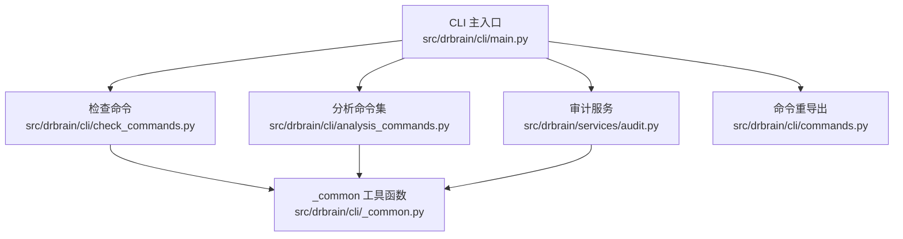
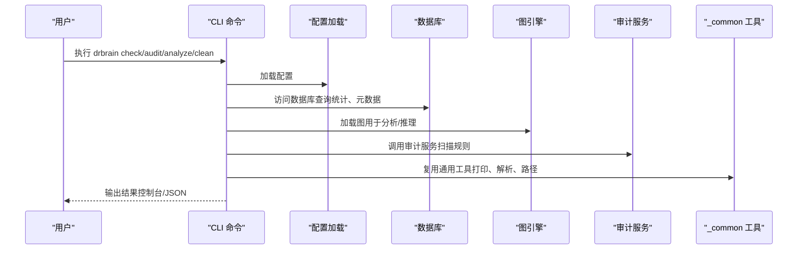
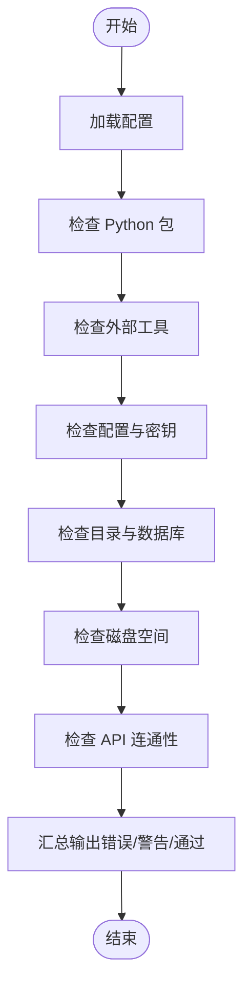
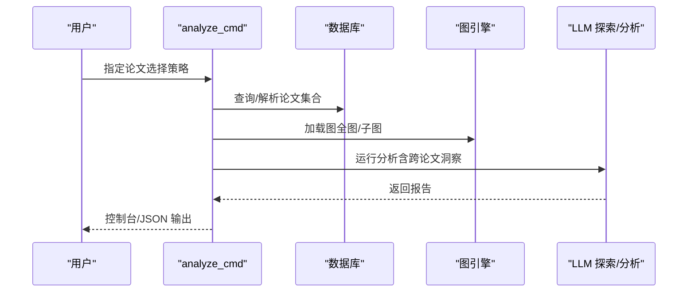
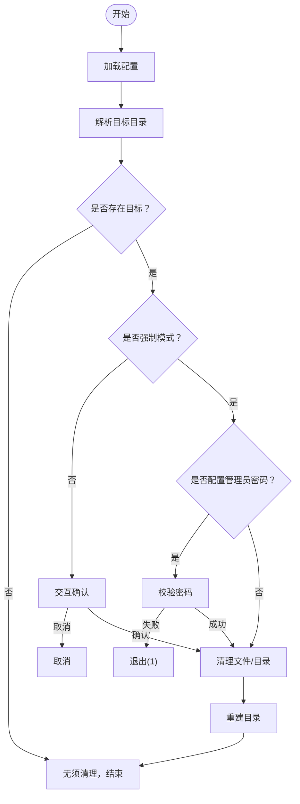
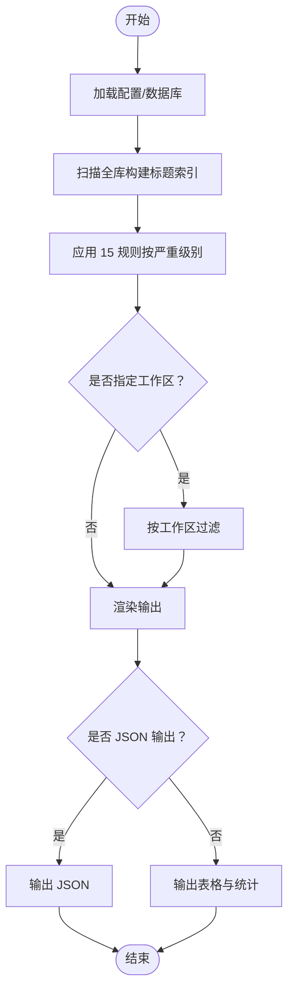
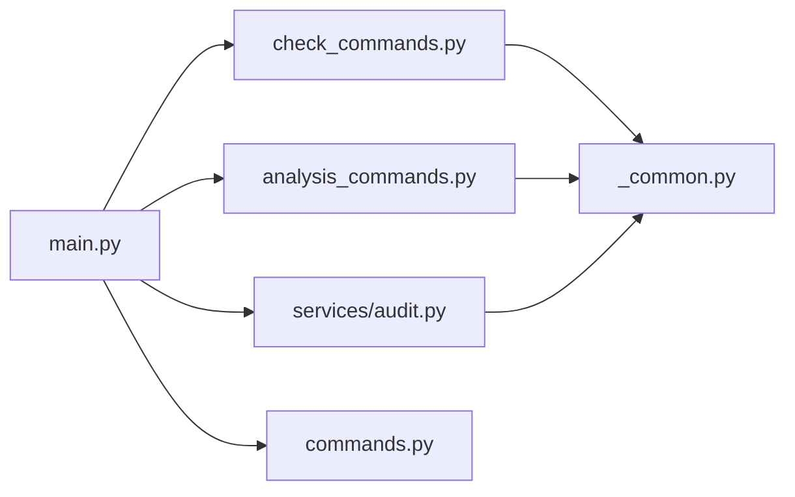

# 工具辅助命令

<cite>
**本文引用的文件列表**
- [check_commands.py](file://src/drbrain/cli/check_commands.py)
- [analysis_commands.py](file://src/drbrain/cli/analysis_commands.py)
- [audit.py](file://src/drbrain/services/audit.py)
- [SKILL.md（audit 技能说明）](file://skills/audit/SKILL.md)
- [main.py（CLI 入口）](file://src/drbrain/cli/main.py)
- [_common.py（通用工具函数）](file://src/drbrain/cli/_common.py)
- [cli-reference.md（CLI 参考）](file://docs/cli-reference.md)
- [README.md（项目总览）](file://README.md)
- [commands.py（命令模块重导出）](file://src/drbrain/cli/commands.py)
</cite>

## 目录
1. [简介](#简介)
2. [项目结构与入口](#项目结构与入口)
3. [核心命令概览](#核心命令概览)
4. [架构总览](#架构总览)
5. [详细组件分析](#详细组件分析)
6. [依赖关系分析](#依赖关系分析)
7. [性能与可用性建议](#性能与可用性建议)
8. [故障排查指南](#故障排查指南)
9. [结论](#结论)

## 简介
本文件面向 DrBrain 的“工具辅助命令”，重点覆盖以下命令：
- 检查类：check（环境与依赖检查）
- 分析类：analyze（知识前沿分析）
- 清理类：clean（数据目录清理）
- 审计类：audit（数据质量扫描）

内容涵盖功能说明、使用场景、操作流程、可视化架构图、常见问题排查与优化建议，帮助用户在日常维护、数据治理与系统健康度保障方面高效使用 DrBrain。

## 项目结构与入口
DrBrain CLI 通过主入口注册所有命令，并按功能拆分为多个模块。工具辅助命令位于 CLI 子模块中，服务层提供审计能力，通用工具函数被多命令共享。

图表来源
- [main.py:77-146](file://src/drbrain/cli/main.py#L77-L146)
- [check_commands.py:24-426](file://src/drbrain/cli/check_commands.py#L24-L426)
- [analysis_commands.py:1-678](file://src/drbrain/cli/analysis_commands.py#L1-L678)
- [audit.py:1-396](file://src/drbrain/services/audit.py#L1-L396)
- [_common.py:1-988](file://src/drbrain/cli/_common.py#L1-L988)
- [commands.py:1-88](file://src/drbrain/cli/commands.py#L1-L88)

章节来源
- [main.py:77-146](file://src/drbrain/cli/main.py#L77-L146)
- [README.md:68-78](file://README.md#L68-L78)

## 核心命令概览
- check：检查依赖、外部工具、配置、数据库、API 连通性、磁盘空间等，输出汇总与建议。
- analyze：基于 BM25 或 LLM 图探索选择论文，运行知识前沿分析，支持单篇或多篇，支持跨论文洞察。
- clean：清理数据库、缓存、日志、论文与报告目录，保留 inbox（PDF）；支持强制模式与管理员密码校验。
- audit：对全库执行 15 规则、3 级别的数据质量扫描，支持工作区过滤与 JSON 输出。

章节来源
- [cli-reference.md:23-106](file://docs/cli-reference.md#L23-L106)
- [cli-reference.md:31-45](file://docs/cli-reference.md#L31-L45)
- [cli-reference.md:485-511](file://docs/cli-reference.md#L485-L511)
- [cli-reference.md:95-106](file://docs/cli-reference.md#L95-L106)

## 架构总览
工具辅助命令围绕“配置加载—数据库访问—图引擎—服务层审计—通用工具”的链路协作，形成闭环的数据治理与系统健康保障体系。

图表来源
- [main.py:80-92](file://src/drbrain/cli/main.py#L80-L92)
- [check_commands.py:24-426](file://src/drbrain/cli/check_commands.py#L24-L426)
- [analysis_commands.py:428-563](file://src/drbrain/cli/analysis_commands.py#L428-L563)
- [audit.py:312-396](file://src/drbrain/services/audit.py#L312-L396)
- [_common.py:370-380](file://src/drbrain/cli/_common.py#L370-L380)

## 详细组件分析

### 检查命令（check）
- 功能要点
  - 检查 Python 包、外部工具（MinerU CLI、PyMuPDF）、配置文件存在性与关键字段、目录与数据库状态、磁盘空间。
  - 校验 API 连通性（MinerU、DeepXiv、LLM），汇总错误与警告。
- 使用场景
  - 新环境初始化后验证；升级依赖或配置后确认；批量导入/构建前的健康检查。
- 操作流程
  - 运行 drbrain check，查看各模块检查结果与建议；根据提示修复缺失包、配置项或网络问题。
- 关键实现点
  - 配置加载、数据库连接、图引擎初始化、API 请求、磁盘空间统计、Rich 表格渲染。
  - 错误与警告收集，最终汇总输出。

图表来源
- [check_commands.py:24-426](file://src/drbrain/cli/check_commands.py#L24-L426)

章节来源
- [check_commands.py:24-426](file://src/drbrain/cli/check_commands.py#L24-L426)
- [cli-reference.md:23-29](file://docs/cli-reference.md#L23-L29)

### 分析命令（analyze）
- 功能要点
  - 支持单篇、指定 ID 列表、BM25 查询匹配、LLM 图探索发现、工作区边界扫描五种论文选择方式。
  - 对选中论文运行知识前沿分析，生成报告；多篇时可追加跨论文洞察。
- 使用场景
  - 发现研究种子、因果链条、假设与跨域模式；为论文写作与综述提供结构化洞察。
- 操作流程
  - 选择一种论文选择策略；可开启 --full 获取更详尽分析；支持 --json 输出便于脚本处理。
- 关键实现点
  - 论文选择逻辑（互斥优先级）、BM25 检索、LLM 图探索、图加载、报告生成与打印。

图表来源
- [analysis_commands.py:428-563](file://src/drbrain/cli/analysis_commands.py#L428-L563)

章节来源
- [analysis_commands.py:428-563](file://src/drbrain/cli/analysis_commands.py#L428-L563)
- [cli-reference.md:485-511](file://docs/cli-reference.md#L485-L511)

### 清理命令（clean）
- 功能要点
  - 清理数据库、缓存、日志、论文与报告目录；保留 inbox（PDF）。
  - 支持 --force 强制模式与管理员密码校验；交互式确认。
- 使用场景
  - 数据库膨胀、缓存污染、日志过大后的系统维护；迁移环境或重装前的“清空”。
- 操作流程
  - drbrain clean --force（可选）；如配置了管理员密码，需输入密码；确认后清理并重建目录。
- 关键实现点
  - 目标目录解析、存在性检测、文件/目录遍历删除、目录重建、密码校验。

图表来源
- [check_commands.py:565-626](file://src/drbrain/cli/check_commands.py#L565-L626)

章节来源
- [check_commands.py:565-626](file://src/drbrain/cli/check_commands.py#L565-L626)
- [cli-reference.md:95-106](file://docs/cli-reference.md#L95-L106)

### 审计命令（audit）
- 功能要点
  - 全库 15 规则扫描，按严重级别（error/warning/info）输出；支持工作区过滤与 JSON 输出。
  - 规则覆盖标题/元数据完整性、摘要/年份/期刊/作者、树结构与概念数量、占位符状态与重复标题等。
- 使用场景
  - 导入/构建后健康度评估；分析/种子/闭包前的数据清洗前置；定期巡检。
- 操作流程
  - drbrain audit（默认 warning 级别）；--severity 指定级别；--workspace 限定范围；--json 便于脚本处理。
- 关键实现点
  - 规则分层（error/warning/info）、标题归一化去重、概念/边数统计、时间阈值判断、Rich 表格与统计汇总。

图表来源
- [audit.py:30-396](file://src/drbrain/services/audit.py#L30-L396)
- [SKILL.md（audit 技能说明）:1-88](file://skills/audit/SKILL.md#L1-L88)

章节来源
- [audit.py:30-396](file://src/drbrain/services/audit.py#L30-L396)
- [SKILL.md（audit 技能说明）:1-88](file://skills/audit/SKILL.md#L1-L88)
- [cli-reference.md:31-45](file://docs/cli-reference.md#L31-L45)

## 依赖关系分析
- 命令到服务
  - check/analyze/clean 均依赖配置加载与数据库访问；analyze 还依赖图引擎；audit 作为独立服务模块。
- 通用工具复用
  - _common 提供工作区解析、打印报告、路径工具、PDF 资产保存等，被多命令共享。
- CLI 注册
  - main.py 将命令统一注册到 Typer 应用，commands.py 作为模块重导出入口。

图表来源
- [main.py:77-146](file://src/drbrain/cli/main.py#L77-L146)
- [commands.py:1-88](file://src/drbrain/cli/commands.py#L1-L88)

章节来源
- [main.py:77-146](file://src/drbrain/cli/main.py#L77-L146)
- [commands.py:1-88](file://src/drbrain/cli/commands.py#L1-L88)

## 性能与可用性建议
- 检查命令
  - 外部 API 连通性检查可能受网络影响，建议在稳定网络环境下执行；必要时增加超时参数或重试策略。
- 分析命令
  - --full 模式耗时较长，建议仅在需要深度洞察时启用；多篇分析会进行跨论文洞察，注意 LLM 调用成本。
- 清理命令
  - --force 模式涉及文件系统操作，建议在备份后执行；对大量文件的目录清理可能耗时，建议在低峰期运行。
- 审计命令
  - 15 规则扫描对全库执行，建议在空闲时段运行；配合 --workspace 缩小范围以提升效率；--json 便于自动化集成。

[本节为通用建议，不直接分析具体文件]

## 故障排查指南
- check 命令返回错误
  - 缺少关键包或外部工具：安装对应依赖或工具；参考安装提示。
  - API 不可达：检查令牌、网络连通性；必要时更换备用 API。
  - 配置未解析：确保 config.yaml 与 config.local.yaml 正确放置且变量已替换。
- analyze 命令无结果
  - 确认论文选择策略有效；若使用 BM25，先运行 index 重建索引；若使用 LLM 探索，确保模型配置正确。
- clean 命令权限问题
  - 若配置了管理员密码，--force 模式需正确输入密码；否则会退出。
- audit 命令无问题
  - 默认只显示 warning 及以上级别；如需查看 info 级别，使用 --severity info；如需仅看错误，使用 --severity error。

章节来源
- [check_commands.py:24-426](file://src/drbrain/cli/check_commands.py#L24-L426)
- [analysis_commands.py:428-563](file://src/drbrain/cli/analysis_commands.py#L428-L563)
- [audit.py:312-396](file://src/drbrain/services/audit.py#L312-L396)

## 结论
DrBrain 的工具辅助命令围绕“健康检查—质量审计—知识分析—系统清理”形成闭环，既保证系统运行的稳定性，又支撑高质量的知识图谱构建与分析。建议在日常工作中：
- 定期运行 check 与 audit，保持环境与数据健康；
- 在执行大规模分析前，先进行数据质量前置检查；
- 使用 clean 进行周期性维护，避免缓存与日志膨胀；
- 通过 analyze 获取知识前沿洞察，指导研究方向与写作。

[本节为总结性内容，不直接分析具体文件]