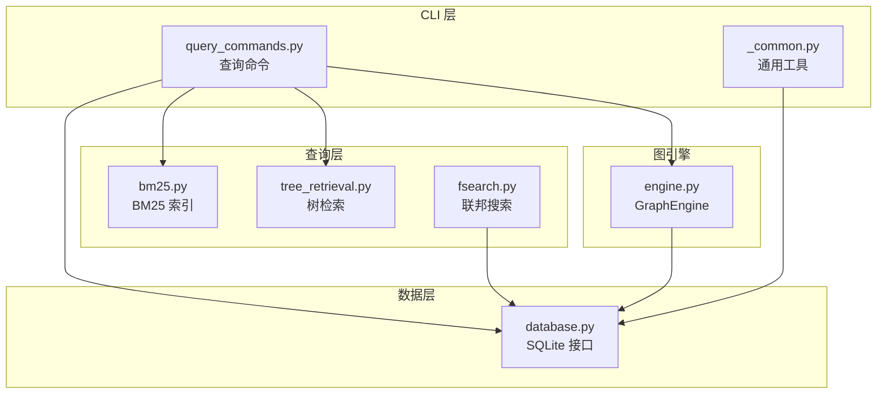
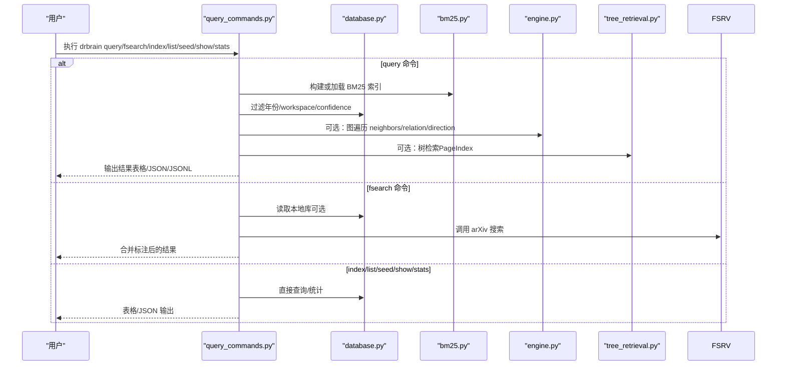
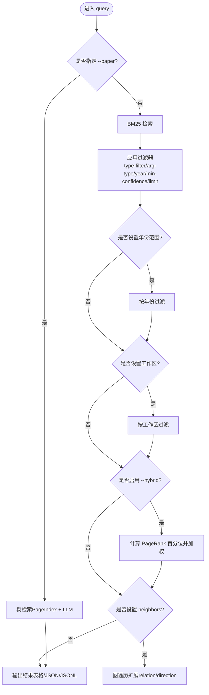
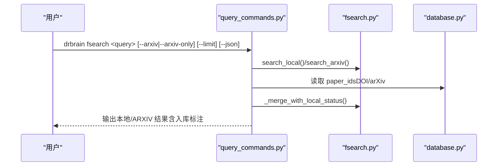
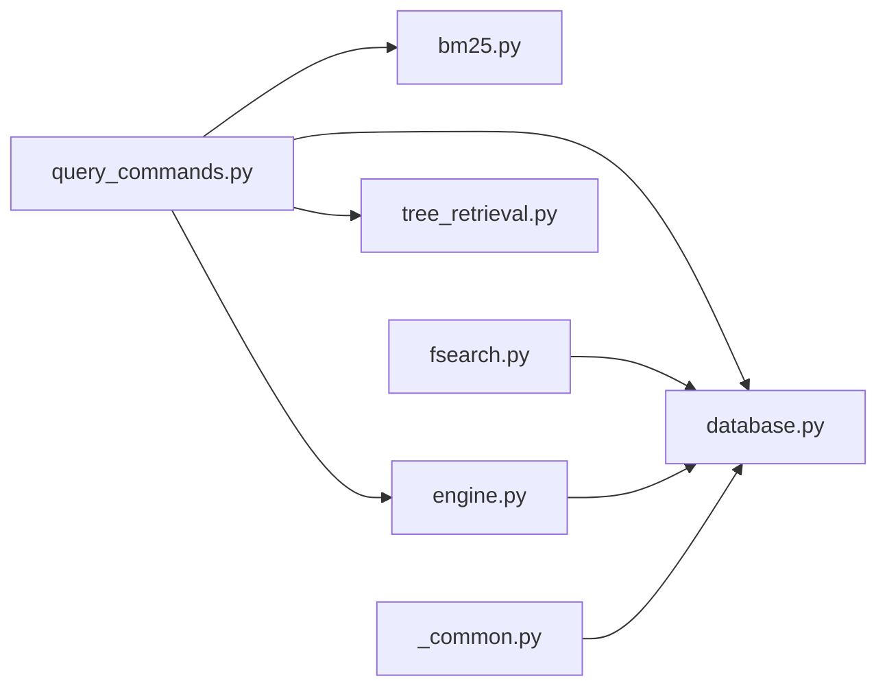

# 查询检索命令

<cite>
**本文引用的文件**
- [src/drbrain/cli/query_commands.py](file://src/drbrain/cli/query_commands.py)
- [src/drbrain/query/bm25.py](file://src/drbrain/query/bm25.py)
- [src/drbrain/query/tree_retrieval.py](file://src/drbrain/query/tree_retrieval.py)
- [src/drbrain/services/fsearch.py](file://src/drbrain/services/fsearch.py)
- [src/drbrain/storage/database.py](file://src/drbrain/storage/database.py)
- [src/drbrain/graph/engine.py](file://src/drbrain/graph/engine.py)
- [src/drbrain/cli/_common.py](file://src/drbrain/cli/_common.py)
- [docs/cli-reference.md](file://docs/cli-reference.md)
- [skills/paper-query/SKILL.md](file://skills/paper-query/SKILL.md)
- [skills/fsearch/SKILL.md](file://skills/fsearch/SKILL.md)
- [skills/index/SKILL.md](file://skills/index/SKILL.md)
- [skills/show/SKILL.md](file://skills/show/SKILL.md)
</cite>

## 目录
1. [简介](#简介)
2. [项目结构](#项目结构)
3. [核心组件](#核心组件)
4. [架构总览](#架构总览)
5. [详细组件分析](#详细组件分析)
6. [依赖分析](#依赖分析)
7. [性能考虑](#性能考虑)
8. [故障排查指南](#故障排查指南)
9. [结论](#结论)
10. [附录](#附录)

## 简介
本文件面向 DrBrain 的查询检索命令，系统性梳理并解释以下命令的功能与用法：query、fsearch、index、list、seed、show、stats。重点阐述三类查询模式：关键词检索（BM25）、语义检索（向量+检索融合）、图增强检索（基于知识图谱的邻域扩展与中心性加权）。同时提供查询语法示例、结果过滤选项与排序方法说明，帮助用户在实际研究工作中高效定位文献与概念。

## 项目结构
DrBrain 将查询相关能力集中在 CLI 模块与查询子模块中：
- CLI 层：命令入口与参数解析，负责调用底层服务与展示结果
- 查询层：BM25 全文索引、树检索（PageIndex）与混合检索
- 图引擎：图遍历、规则闭包与中心性计算
- 数据层：SQLite 数据库读写与统计聚合

图表来源
- [src/drbrain/cli/query_commands.py:1-738](file://src/drbrain/cli/query_commands.py#L1-L738)
- [src/drbrain/query/bm25.py:1-135](file://src/drbrain/query/bm25.py#L1-L135)
- [src/drbrain/query/tree_retrieval.py:1-876](file://src/drbrain/query/tree_retrieval.py#L1-L876)
- [src/drbrain/services/fsearch.py:1-178](file://src/drbrain/services/fsearch.py#L1-L178)
- [src/drbrain/graph/engine.py:1-1118](file://src/drbrain/graph/engine.py#L1-L1118)
- [src/drbrain/storage/database.py:1-775](file://src/drbrain/storage/database.py#L1-L775)
- [src/drbrain/cli/_common.py:370-381](file://src/drbrain/cli/_common.py#L370-L381)

章节来源
- [docs/cli-reference.md:149-224](file://docs/cli-reference.md#L149-L224)
- [src/drbrain/cli/query_commands.py:1-738](file://src/drbrain/cli/query_commands.py#L1-L738)

## 核心组件
- 查询命令集：query、fsearch、index、list、seed、show、stats
- BM25 全文检索：基于概念标签、论文元数据与论点构建倒排索引
- 树检索（PageIndex）：基于论文树结构的 LLM 引导检索，支持分层导航与二次确认
- 联邦搜索：本地库 + arXiv 的统一检索，并标注是否已入库
- 图引擎：图遍历、关系过滤、方向控制与中心性加权
- 统计与清单：数据库统计、论文清单、种子检测

章节来源
- [src/drbrain/cli/query_commands.py:24-738](file://src/drbrain/cli/query_commands.py#L24-L738)
- [src/drbrain/query/bm25.py:1-135](file://src/drbrain/query/bm25.py#L1-L135)
- [src/drbrain/query/tree_retrieval.py:1-876](file://src/drbrain/query/tree_retrieval.py#L1-L876)
- [src/drbrain/services/fsearch.py:1-178](file://src/drbrain/services/fsearch.py#L1-L178)
- [src/drbrain/graph/engine.py:1-1118](file://src/drbrain/graph/engine.py#L1-L1118)
- [src/drbrain/storage/database.py:1-775](file://src/drbrain/storage/database.py#L1-L775)

## 架构总览
下图展示了查询命令在 DrBrain 中的调用链路与数据流：

图表来源
- [src/drbrain/cli/query_commands.py:24-738](file://src/drbrain/cli/query_commands.py#L24-L738)
- [src/drbrain/query/bm25.py:93-135](file://src/drbrain/query/bm25.py#L93-L135)
- [src/drbrain/query/tree_retrieval.py:215-380](file://src/drbrain/query/tree_retrieval.py#L215-L380)
- [src/drbrain/services/fsearch.py:125-178](file://src/drbrain/services/fsearch.py#L125-L178)
- [src/drbrain/graph/engine.py:62-122](file://src/drbrain/graph/engine.py#L62-L122)
- [src/drbrain/storage/database.py:419-586](file://src/drbrain/storage/database.py#L419-L586)

## 详细组件分析

### 命令概览与适用场景
- query：关键词检索（BM25）+ 结果过滤；可结合图遍历与中心性加权；也可针对单篇论文进行树检索（LLM + 向量辅助）
- fsearch：本地库 + arXiv 联邦检索，自动标注“已入库”
- index：重建 BM25 全文索引，解决检索不准确或为空的问题
- list：列出数据库中的所有论文
- seed：从图模式识别研究信号（停滞问题、未解决缺口、争议区、技术瓶颈、信心坍缩）
- show：查看单篇论文的元数据、概念、论点与图边
- stats：数据库统计（论文、概念、边、别名、种子、置信队列等）

章节来源
- [docs/cli-reference.md:149-224](file://docs/cli-reference.md#L149-L224)
- [skills/paper-query/SKILL.md:1-96](file://skills/paper-query/SKILL.md#L1-L96)
- [skills/fsearch/SKILL.md:1-39](file://skills/fsearch/SKILL.md#L1-L39)
- [skills/index/SKILL.md:1-69](file://skills/index/SKILL.md#L1-L69)
- [skills/show/SKILL.md:1-74](file://skills/show/SKILL.md#L1-L74)

### 关键命令详解

#### 1) query：关键词检索、图增强与树检索
- 功能要点
  - BM25 关键词检索：支持按概念类型（Problem/Method/Conclusion/Gap/Debate/Actor）、论点类型（supports/challenges/extends 等）、年份范围、最小置信度、结果上限过滤
  - 图增强：通过 neighbors、relation、direction 对 BM25 结果进行邻域扩展；可启用 hybrid 使用 PageRank 中心性加权
  - 单篇树检索：当指定 --paper 时，绕过 BM25，直接使用 PageIndex 树结构进行 LLM 引导检索，支持向量预筛选
  - workspace 限制：仅在指定工作区范围内检索
  - 输出格式：表格、JSON、JSONL
- 查询语法与过滤
  - --type-filter：按概念类型过滤
  - --arg-type：按论点类型过滤
  - --year-start/--year-end：限定发表年份
  - --min-confidence：最小置信度阈值
  - --limit：最大返回条数
  - --neighbors/-n：图遍历跳数
  - --relation/-R：逗号分隔的关系类型集合
  - --direction/-D：forward/backward/both
  - --hybrid：启用 PageRank 中心性加权
  - --paper：指定论文 local_id 进行树检索
  - --workspace/-w：限定工作区
  - --json/--jsonl：机器可读输出
- 排序与评分
  - BM25 默认按分数降序
  - 启用 --hybrid 后，基于 PageRank 百分位进行乘性加权，再重新排序
  - 图扩展结果标记 _via_graph、_source_seed、_distance、_path 等路径信息
- 示例
  - 关键词检索：drbrain query "graph neural networks" --type-filter Method --year-start 2020
  - 图扩展检索：drbrain query "attention mechanism" --neighbors 2 --json | jq '.[]._distance'
  - 单篇树检索：drbrain query "regularization strategy" --paper p3f8a2
  - 混合排序：drbrain query "graph attention" --hybrid

图表来源
- [src/drbrain/cli/query_commands.py:283-631](file://src/drbrain/cli/query_commands.py#L283-L631)
- [src/drbrain/query/tree_retrieval.py:742-800](file://src/drbrain/query/tree_retrieval.py#L742-L800)
- [src/drbrain/graph/engine.py:62-122](file://src/drbrain/graph/engine.py#L62-L122)
- [src/drbrain/query/bm25.py:56-91](file://src/drbrain/query/bm25.py#L56-L91)

章节来源
- [src/drbrain/cli/query_commands.py:283-631](file://src/drbrain/cli/query_commands.py#L283-L631)
- [src/drbrain/query/bm25.py:1-135](file://src/drbrain/query/bm25.py#L1-L135)
- [src/drbrain/query/tree_retrieval.py:1-876](file://src/drbrain/query/tree_retrieval.py#L1-L876)
- [src/drbrain/graph/engine.py:1-1118](file://src/drbrain/graph/engine.py#L1-L1118)
- [skills/paper-query/SKILL.md:1-96](file://skills/paper-query/SKILL.md#L1-L96)
- [docs/cli-reference.md:149-178](file://docs/cli-reference.md#L149-L178)

#### 2) fsearch：本地库 + arXiv 联邦搜索
- 功能要点
  - 本地库检索：基于 BM25-like 的 SQL 全文匹配（标题、概念标签、论点）
  - arXiv 检索：Atom API 搜索，支持 --arxiv 或 --arxiv-only
  - 自动去重：通过 DOI 与标准化 arXiv ID 匹配本地库，标注 [ingested]
  - 输出：表格或 JSON，包含标题、作者、年份、DOI、arXiv ID、是否入库
- 查询语法
  - --arxiv：本地 + arXiv
  - --arxiv-only：仅 arXiv
  - --limit/-n：每源最大结果数
  - --json：JSON 输出
- 示例
  - drbrain fsearch "attention mechanism"
  - drbrain fsearch "transformer" --arxiv
  - drbrain fsearch "graph neural network" --arxiv-only --json

图表来源
- [src/drbrain/cli/query_commands.py:633-738](file://src/drbrain/cli/query_commands.py#L633-L738)
- [src/drbrain/services/fsearch.py:32-178](file://src/drbrain/services/fsearch.py#L32-L178)
- [src/drbrain/storage/database.py:28-34](file://src/drbrain/storage/database.py#L28-L34)

章节来源
- [src/drbrain/cli/query_commands.py:633-738](file://src/drbrain/cli/query_commands.py#L633-L738)
- [src/drbrain/services/fsearch.py:1-178](file://src/drbrain/services/fsearch.py#L1-L178)
- [skills/fsearch/SKILL.md:1-39](file://skills/fsearch/SKILL.md#L1-L39)
- [docs/cli-reference.md:193-209](file://docs/cli-reference.md#L193-L209)

#### 3) index：重建 BM25 全文索引
- 功能要点
  - 从数据库读取论文、概念、论点文本，构建 BM25 索引
  - 支持 --rebuild 强制全量重建；--json 输出文档数量验证
  - 与查询命令配合：新增/修改概念后需重建索引以保证检索效果
- 示例
  - drbrain index --rebuild
  - drbrain index --rebuild --json

章节来源
- [src/drbrain/cli/query_commands.py:263-281](file://src/drbrain/cli/query_commands.py#L263-L281)
- [src/drbrain/query/bm25.py:93-135](file://src/drbrain/query/bm25.py#L93-L135)
- [skills/index/SKILL.md:1-69](file://skills/index/SKILL.md#L1-L69)
- [docs/cli-reference.md:210-224](file://docs/cli-reference.md#L210-L224)

#### 4) list：列出数据库中的论文
- 功能要点
  - 列出所有论文的基本信息（ID、标题、年份、状态）
  - --json 输出 JSON
- 示例
  - drbrain list
  - drbrain list --json

章节来源
- [src/drbrain/cli/query_commands.py:49-75](file://src/drbrain/cli/query_commands.py#L49-L75)
- [docs/cli-reference.md:679-686](file://docs/cli-reference.md#L679-L686)

#### 5) seed：研究信号检测
- 功能要点
  - 基于图模式识别：停滞问题、未解决缺口、争议区、技术瓶颈、信心坍缩
  - 可限定工作区；--json 输出 JSON
- 示例
  - drbrain seed
  - drbrain seed --workspace cv --json

章节来源
- [src/drbrain/cli/query_commands.py:24-47](file://src/drbrain/cli/query_commands.py#L24-L47)
- [src/drbrain/graph/engine.py:354-622](file://src/drbrain/graph/engine.py#L354-L622)
- [docs/cli-reference.md:513-525](file://docs/cli-reference.md#L513-L525)

#### 6) show：查看单篇论文详情
- 功能要点
  - 论文元数据：标题、年份、类型、状态、期刊、DOI、摘要、被引数
  - 概念：按类型分组（Problem/Method/Conclusion/Gap/Debate/Actor）
  - 论点：主张类型、主张内容、目标概念
  - 图边：出边与入边（指向/被指）
  - --json 输出机器可读 JSON
- 示例
  - drbrain show p3f8a2
  - drbrain show p3f8a2 --json

章节来源
- [src/drbrain/cli/query_commands.py:180-261](file://src/drbrain/cli/query_commands.py#L180-L261)
- [src/drbrain/storage/database.py:448-586](file://src/drbrain/storage/database.py#L448-L586)
- [skills/show/SKILL.md:1-74](file://skills/show/SKILL.md#L1-L74)
- [docs/cli-reference.md:688-696](file://docs/cli-reference.md#L688-L696)

#### 7) stats：数据库统计
- 功能要点
  - 统计论文总数、已上传、占位、概念、论点、边、别名、研究种子、置信队列待处理数
  - --workspace 限定工作区；--json 输出 JSON
- 示例
  - drbrain stats
  - drbrain stats --workspace nlp

章节来源
- [src/drbrain/cli/query_commands.py:77-178](file://src/drbrain/cli/query_commands.py#L77-L178)
- [docs/cli-reference.md:697-709](file://docs/cli-reference.md#L697-L709)

### 查询类型与适用场景
- 关键词搜索（BM25）
  - 适用：主题检索、概念/论点检索、跨论文对比
  - 优势：快速、稳定、可解释
  - 限制：依赖文本质量与索引完整性
- 语义检索（向量 + 检索融合）
  - 适用：语义近似匹配、跨表征检索
  - 实现：tree_retrieval 提供向量预筛选与跨论文检索能力
- 图增强检索（邻域扩展 + 中心性加权）
  - 适用：发现相关但非直接关键词匹配的论文与概念
  - 实现：neighbors/relation/direction 控制扩展范围；--hybrid 使用 PageRank 百分位加权

章节来源
- [src/drbrain/query/bm25.py:1-135](file://src/drbrain/query/bm25.py#L1-L135)
- [src/drbrain/query/tree_retrieval.py:382-709](file://src/drbrain/query/tree_retrieval.py#L382-L709)
- [src/drbrain/graph/engine.py:62-122](file://src/drbrain/graph/engine.py#L62-L122)
- [skills/paper-query/SKILL.md:1-96](file://skills/paper-query/SKILL.md#L1-L96)

## 依赖分析
- 命令到服务的依赖
  - query 命令依赖 BM25、图引擎、树检索与数据库
  - fsearch 依赖本地库查询与 arXiv API 客户端
  - 其他命令直接依赖数据库与通用工具
- 内部耦合
  - 图引擎与数据库双向交互：加载/持久化边、执行规则闭包
  - 通用工具提供工作区解析与节点类型判定
- 外部依赖
  - arXiv Atom API、SQLite、NetworkX、rank_bm25

图表来源
- [src/drbrain/cli/query_commands.py:1-738](file://src/drbrain/cli/query_commands.py#L1-L738)
- [src/drbrain/services/fsearch.py:1-178](file://src/drbrain/services/fsearch.py#L1-L178)
- [src/drbrain/graph/engine.py:1-1118](file://src/drbrain/graph/engine.py#L1-L1118)
- [src/drbrain/storage/database.py:1-775](file://src/drbrain/storage/database.py#L1-L775)
- [src/drbrain/cli/_common.py:370-381](file://src/drbrain/cli/_common.py#L370-L381)

章节来源
- [src/drbrain/cli/query_commands.py:1-738](file://src/drbrain/cli/query_commands.py#L1-L738)
- [src/drbrain/services/fsearch.py:1-178](file://src/drbrain/services/fsearch.py#L1-L178)
- [src/drbrain/graph/engine.py:1-1118](file://src/drbrain/graph/engine.py#L1-L1118)
- [src/drbrain/storage/database.py:1-775](file://src/drbrain/storage/database.py#L1-L775)
- [src/drbrain/cli/_common.py:370-381](file://src/drbrain/cli/_common.py#L370-L381)

## 性能考虑
- BM25 索引
  - 建议在新增/修改概念后运行 drbrain index --rebuild，确保检索召回率
  - 使用 --limit 控制返回规模，避免大结果集带来的渲染与传输开销
- 图遍历
  - neighbors 过大将显著增加计算与 I/O；建议从小值起步（如 1-2），逐步增大
  - relation 与 direction 有助于缩小搜索空间，提升效率
- hybrid 加权
  - PageRank 计算采用迭代收敛策略；大规模图上建议谨慎使用或缓存结果
- 树检索
  - 大型树结构可能触发自适应导航（仅显示顶层），减少上下文长度；合理设置 top_k 与 per_round 参数

## 故障排查指南
- 检索为空或不准确
  - 确认索引存在且最新：drbrain index --rebuild --json 验证文档数
  - 检查是否需要 --workspace 限定范围
  - 使用 --json 输出原始结果，检查 year/min-confidence 等过滤条件
- 无法进行树检索
  - 确认已执行 drbrain embed --tree 并生成 tree.json
  - 检查论文目录是否存在 raw.md 与 tree.json
- arXiv 检索失败
  - 网络异常或解析错误；可重试或切换网络环境
  - 检查 API 超时与限流设置
- 图遍历报错
  - 检查 relation 是否为有效集合（addresses/extends/challenges 等）
  - direction 必须为 forward/backward/both 之一

章节来源
- [src/drbrain/cli/query_commands.py:263-281](file://src/drbrain/cli/query_commands.py#L263-L281)
- [src/drbrain/cli/query_commands.py:339-347](file://src/drbrain/cli/query_commands.py#L339-L347)
- [src/drbrain/services/fsearch.py:32-96](file://src/drbrain/services/fsearch.py#L32-L96)
- [src/drbrain/graph/engine.py:62-122](file://src/drbrain/graph/engine.py#L62-L122)

## 结论
DrBrain 的查询检索体系以 BM25 为基础，结合图增强与树检索，覆盖了从关键词到语义再到图结构的多层级检索需求。通过合理的过滤与排序选项，用户可在海量论文中高效定位目标内容。建议在新增/修改内容后及时重建索引，并根据任务选择合适的检索模式与参数组合，以获得最佳体验。

## 附录
- 常用命令速查
  - 关键词检索：drbrain query "<关键词>"
  - 图扩展：drbrain query "<关键词>" --neighbors 2 --relation addresses,extends
  - 单篇树检索：drbrain query "<问题>" --paper <local_id>
  - 联邦搜索：drbrain fsearch "<关键词>" --arxiv
  - 重建索引：drbrain index --rebuild
  - 查看论文：drbrain show <local_id>
  - 统计信息：drbrain stats --workspace <ws>