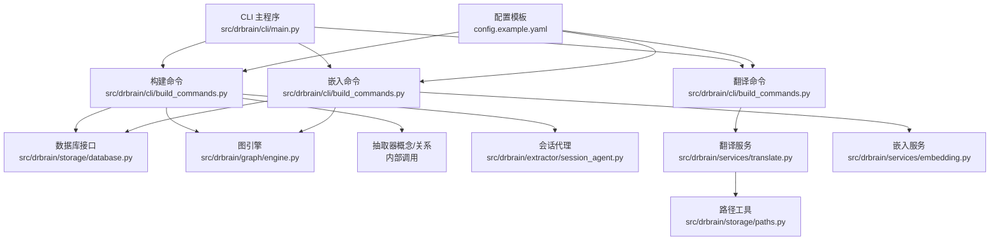
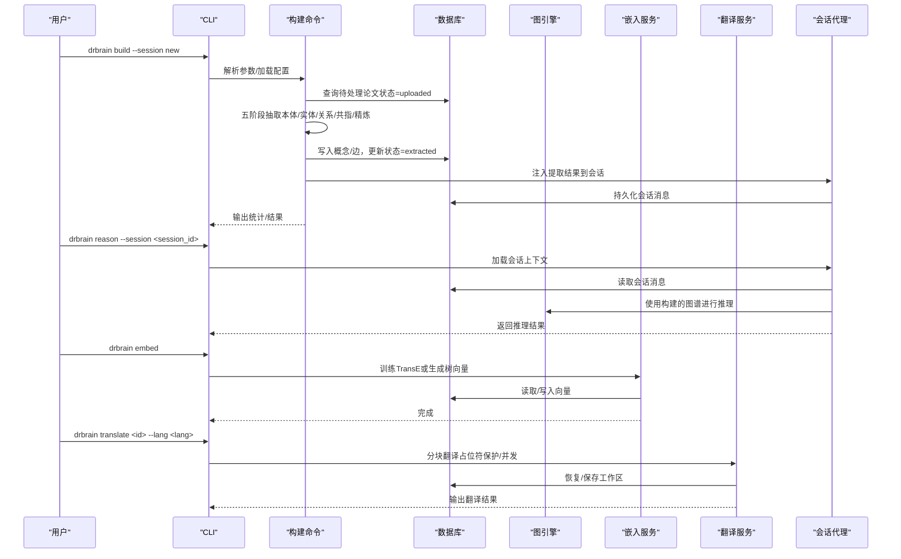
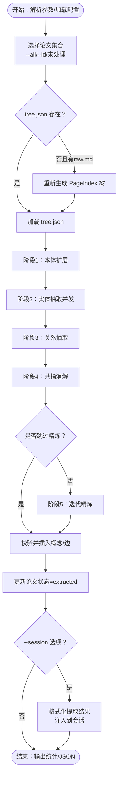
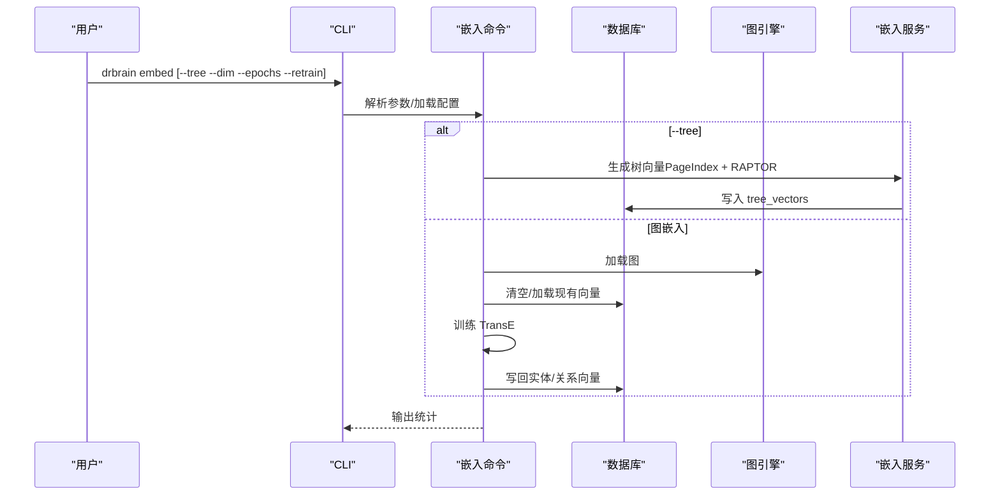
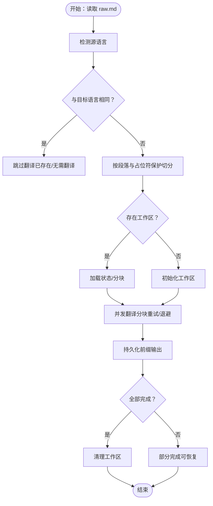
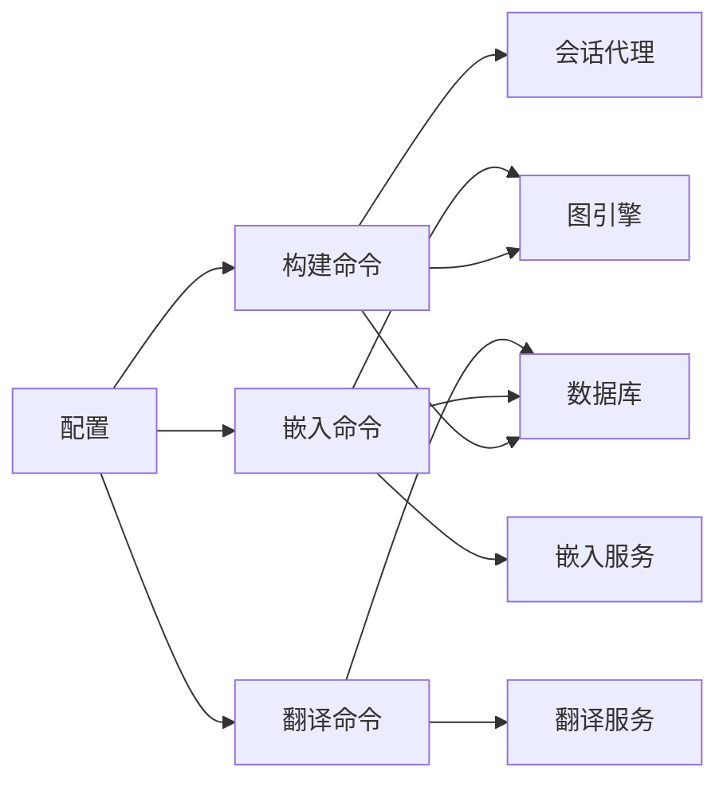

# 知识构建命令

<cite>
**本文引用的文件**
- [src/drbrain/cli/build_commands.py](file://src/drbrain/cli/build_commands.py)
- [src/drbrain/cli/main.py](file://src/drbrain/cli/main.py)
- [src/drbrain/services/translate.py](file://src/drbrain/services/translate.py)
- [src/drbrain/services/embedding.py](file://src/drbrain/services/embedding.py)
- [src/drbrain/graph/engine.py](file://src/drbrain/graph/engine.py)
- [src/drbrain/storage/database.py](file://src/drbrain/storage/database.py)
- [src/drbrain/extractor/session_agent.py](file://src/drbrain/extractor/session_agent.py)
- [skills/kg-build/SKILL.md](file://skills/kg-build/SKILL.md)
- [skills/translate/SKILL.md](file://skills/translate/SKILL.md)
- [docs/embedding.md](file://docs/embedding.md)
- [docs/getting-started.md](file://docs/getting-started.md)
- [docs/architecture.md](file://docs/architecture.md)
- [docs/cli-reference.md](file://docs/cli-reference.md)
- [config.example.yaml](file://config.example.yaml)
</cite>

## 更新摘要
**变更内容**
- 新增 build 命令的 --session 选项，支持自动将提取结果注入到会话中
- 更新构建命令的详细说明，包含会话集成功能
- 添加会话上下文注入的工作流程说明
- 更新使用示例，展示会话驱动的构建流程

## 目录
1. [简介](#简介)
2. [项目结构](#项目结构)
3. [核心组件](#核心组件)
4. [架构总览](#架构总览)
5. [详细组件分析](#详细组件分析)
6. [依赖分析](#依赖分析)
7. [性能考虑](#性能考虑)
8. [故障排查指南](#故障排查指南)
9. [结论](#结论)
10. [附录](#附录)

## 简介
本文件面向 DrBrain 的"知识构建"相关命令，系统性梳理并说明以下命令的功能与使用方式：
- build：从已入库论文中抽取知识（概念、关系），构建知识图谱
- embed：训练图嵌入（TransE）与文本嵌入（树节点 + RAPTOR）
- translate：将论文 Markdown 翻译为目标语言

文档覆盖命令参数、配置项、执行流程、数据预处理、模型选择、性能优化与常见问题排查，并提供端到端使用示例与最佳实践建议。

**更新** 新增 --session 选项，支持自动将构建结果注入到会话中，实现跨命令的上下文延续。

## 项目结构
DrBrain 的 CLI 命令入口集中于主模块，知识构建相关命令由独立模块实现，服务层负责具体逻辑（翻译、嵌入），图引擎与数据库提供存储与推理能力。

**图表来源**
- [src/drbrain/cli/main.py:1-150](file://src/drbrain/cli/main.py#L1-L150)
- [src/drbrain/cli/build_commands.py:1-427](file://src/drbrain/cli/build_commands.py#L1-L427)
- [src/drbrain/services/translate.py:1-726](file://src/drbrain/services/translate.py#L1-L726)
- [src/drbrain/services/embedding.py:1-786](file://src/drbrain/services/embedding.py#L1-L786)
- [src/drbrain/graph/engine.py:1-1118](file://src/drbrain/graph/engine.py#L1-L1118)
- [src/drbrain/storage/database.py:1-775](file://src/drbrain/storage/database.py#L1-L775)
- [src/drbrain/extractor/session_agent.py:1-582](file://src/drbrain/extractor/session_agent.py#L1-L582)
- [config.example.yaml:1-145](file://config.example.yaml#L1-L145)

**章节来源**
- [src/drbrain/cli/main.py:1-150](file://src/drbrain/cli/main.py#L1-L150)
- [src/drbrain/cli/build_commands.py:1-427](file://src/drbrain/cli/build_commands.py#L1-L427)
- [config.example.yaml:1-145](file://config.example.yaml#L1-L145)

## 核心组件
- 构建命令（build）：执行五阶段 LLM 抽取（本体扩展、实体抽取、关系抽取、共指消解、迭代精炼），写入数据库并更新状态；支持增量去重与可选跳过精炼；**新增** 支持 --session 选项，自动将提取结果注入到会话中
- 嵌入命令（embed）：训练图嵌入（TransE）或生成文本嵌入（树节点 + RAPTOR），支持增量训练与树向量批量生成
- 翻译命令（translate）：对论文 raw.md 进行分块翻译，保护代码/公式/图片占位符，支持并发与断点续传，支持强制重翻

**更新** 构建命令现在集成了会话功能，可以在构建完成后自动将提取结果注入到指定会话中，实现跨命令的上下文延续。

**章节来源**
- [src/drbrain/cli/build_commands.py:97-277](file://src/drbrain/cli/build_commands.py#L97-L277)
- [src/drbrain/cli/build_commands.py:280-361](file://src/drbrain/cli/build_commands.py#L280-L361)
- [src/drbrain/services/translate.py:562-726](file://src/drbrain/services/translate.py#L562-L726)

## 架构总览
DrBrain 的知识构建管线分为两阶段：
- 轻量入库（PageIndex 树结构化）：仅生成 raw.md 与 tree.json，不进行概念抽取
- 多阶段图构建（2511.11017 风格）：基于 PageIndex 树作为种子本体，执行五阶段抽取，产出图谱与可选文本向量

**更新** 新增会话集成架构，构建结果可以自动注入到会话中，支持后续的推理和分析操作。

**图表来源**
- [docs/architecture.md:38-72](file://docs/architecture.md#L38-L72)
- [docs/superpowers/specs/2026-05-03-pipeline-refactor-design.md:17-46](file://docs/superpowers/specs/2026-05-03-pipeline-refactor-design.md#L17-L46)
- [src/drbrain/cli/build_commands.py:97-277](file://src/drbrain/cli/build_commands.py#L97-L277)
- [src/drbrain/services/translate.py:562-726](file://src/drbrain/services/translate.py#L562-L726)
- [src/drbrain/services/embedding.py:598-705](file://src/drbrain/services/embedding.py#L598-L705)
- [src/drbrain/extractor/session_agent.py:341-355](file://src/drbrain/extractor/session_agent.py#L341-L355)

## 详细组件分析

### 构建命令（build）
- 功能概述
  - 支持按论文 ID、全部论文或未处理论文运行
  - 自动补齐缺失的 PageIndex 树（若存在 raw.md）
  - 执行五阶段抽取：本体扩展、实体抽取（并发）、关系抽取、共指消解、迭代精炼（可跳过）
  - 将有效概念与关系写入数据库，更新论文状态为 extracted
  - 可输出 JSON 或汇总统计，支持跨论文概念去重
  - **新增** 支持 --session 选项，自动将提取结果注入到会话中

- 关键参数
  - paper_id：指定论文 ID 列表
  - --all：对数据库中所有论文执行
  - --skip-refine：跳过迭代精炼阶段
  - --session/-s：会话选项，支持 'new' 创建新会话或指定现有会话 ID
  - --json：以 JSON 输出结果

- 数据流与处理逻辑
  - 读取配置与数据库连接
  - 选择待处理论文集合
  - 若缺少 tree.json 但有 raw.md，则重新生成 PageIndex 树
  - 逐篇执行抽取流水线，收集概念/关系/合并/修正
  - 校验类型合法性后写入数据库，标记状态
  - 可选：跨论文概念去重并输出统计
  - **新增**：当 --session 选项存在时，自动将提取结果注入到会话中

- 会话集成机制
  - 当 session_id 为 'new' 时，自动创建新会话并使用该 ID
  - 当 session_id 为现有 ID 时，加载指定会话
  - 使用 _build_extraction_summary() 格式化提取结果
  - 通过 inject_context() 方法将结果注入到会话系统消息中
  - 自动添加标签前缀（如 'build:<paper_id>'）便于识别

- 错误处理
  - 缺少 LLM 模型配置时提示 setup
  - 无 raw.md 时提示先执行入库
  - 空树结构跳过该论文
  - 边重复/无效时记录调试日志并忽略
  - 会话注入失败时继续执行其他流程

- 性能与并发
  - 实体抽取阶段采用并发策略（默认 10 并发）
  - 可通过配置调整最大并发数
  - 会话注入为同步操作，对整体性能影响较小

**图表来源**
- [src/drbrain/cli/build_commands.py:97-277](file://src/drbrain/cli/build_commands.py#L97-L277)
- [src/drbrain/cli/build_commands.py:312-326](file://src/drbrain/cli/build_commands.py#L312-L326)
- [src/drbrain/cli/build_commands.py:97-140](file://src/drbrain/cli/build_commands.py#L97-L140)
- [docs/architecture.md:48-72](file://docs/architecture.md#L48-L72)
- [docs/getting-started.md:116-136](file://docs/getting-started.md#L116-L136)

**章节来源**
- [src/drbrain/cli/build_commands.py:97-277](file://src/drbrain/cli/build_commands.py#L97-L277)
- [src/drbrain/cli/build_commands.py:312-326](file://src/drbrain/cli/build_commands.py#L312-L326)
- [src/drbrain/cli/build_commands.py:97-140](file://src/drbrain/cli/build_commands.py#L97-L140)
- [docs/architecture.md:48-72](file://docs/architecture.md#L48-L72)
- [docs/getting-started.md:116-136](file://docs/getting-started.md#L116-L136)

### 嵌入命令（embed）
- 功能概述
  - 训练图嵌入（TransE）：基于已构建的知识图谱训练实体与关系向量，支持增量训练
  - 文本嵌入（树向量）：为 PageIndex 叶子节点与 RAPTOR 递归摘要生成向量，支持批量生成与增量更新
  - 可选：树向量生成时结合 LLM 进行递归摘要

- 关键参数
  - --dim：嵌入维度，默认 128
  - --epochs：训练轮次，默认 100
  - --retrain：强制重新训练（清空已有向量）
  - --tree：生成树节点文本向量（PageIndex + RAPTOR）

- 配置要点
  - 图嵌入：依赖已构建的图（非空），否则提示先执行 build
  - 文本嵌入：依赖配置中的嵌入提供方（local/openai-compat/none），以及 LLM 模型列表用于 RAPTOR 摘要
  - 增量更新：树向量按内容哈希判断是否需要重新编码

- 流程与错误处理
  - 图嵌入：加载现有向量作为热启动，训练后写回数据库
  - 树向量：遍历每篇论文目录，生成向量并写入 tree_vectors 表
  - provider=none 时跳过树向量生成

**图表来源**
- [src/drbrain/cli/build_commands.py:280-361](file://src/drbrain/cli/build_commands.py#L280-L361)
- [src/drbrain/services/embedding.py:598-705](file://src/drbrain/services/embedding.py#L598-L705)
- [src/drbrain/graph/engine.py:624-785](file://src/drbrain/graph/engine.py#L624-L785)

**章节来源**
- [src/drbrain/cli/build_commands.py:280-361](file://src/drbrain/cli/build_commands.py#L280-L361)
- [src/drbrain/services/embedding.py:598-705](file://src/drbrain/services/embedding.py#L598-L705)
- [src/drbrain/graph/engine.py:624-785](file://src/drbrain/graph/engine.py#L624-L785)
- [docs/embedding.md:141-169](file://docs/embedding.md#L141-L169)

### 翻译命令（translate）
- 功能概述
  - 将论文 raw.md 按自然段边界切分为若干块，保护代码块、公式、图片等占位符
  - 使用 LLM 并发翻译各块，支持指数退避重试与断点续传
  - 输出目标语言版本，支持强制重翻

- 关键参数
  - --lang/-l：目标语言代码（如 zh/en/ja 等）
  - --force/-f：强制重翻，覆盖已有输出
  - --json：以 JSON 输出进度与结果

- 工作流与容错
  - 语言检测：自动识别源语言，相同则跳过
  - 分块策略：优先句号分割，避免破坏占位符
  - 工作区：保存 state.json 与分块输出，支持恢复
  - 失败处理：单块失败记录状态，后续重试；全部失败返回部分结果

**图表来源**
- [src/drbrain/cli/build_commands.py:16-95](file://src/drbrain/cli/build_commands.py#L16-L95)
- [src/drbrain/services/translate.py:562-726](file://src/drbrain/services/translate.py#L562-L726)

**章节来源**
- [src/drbrain/cli/build_commands.py:16-95](file://src/drbrain/cli/build_commands.py#L16-L95)
- [src/drbrain/services/translate.py:562-726](file://src/drbrain/services/translate.py#L562-L726)
- [skills/translate/SKILL.md:1-86](file://skills/translate/SKILL.md#L1-L86)

## 依赖分析
- 组件耦合
  - 构建命令依赖数据库与图引擎，用于抽取结果写入与状态管理
  - **新增** 构建命令现在依赖会话代理，用于自动注入提取结果
  - 嵌入命令依赖数据库与图引擎（TransE）或嵌入服务（树向量）
  - 翻译命令依赖翻译服务与数据库（工作区状态）
- 外部依赖
  - LLM 提供商（OpenAI、Anthropic、DeepSeek、Zhipu、阿里百炼、Moonshot、Ollama、vLLM 等）
  - 嵌入提供方（本地 SentenceTransformers、OpenAI 兼容、禁用 none）
  - SQLite 数据库存储图谱、向量与元数据

**图表来源**
- [src/drbrain/cli/build_commands.py:1-427](file://src/drbrain/cli/build_commands.py#L1-L427)
- [src/drbrain/services/embedding.py:1-786](file://src/drbrain/services/embedding.py#L1-L786)
- [src/drbrain/services/translate.py:1-726](file://src/drbrain/services/translate.py#L1-L726)
- [src/drbrain/extractor/session_agent.py:1-582](file://src/drbrain/extractor/session_agent.py#L1-L582)
- [config.example.yaml:1-145](file://config.example.yaml#L1-L145)

**章节来源**
- [src/drbrain/cli/build_commands.py:1-427](file://src/drbrain/cli/build_commands.py#L1-L427)
- [src/drbrain/services/embedding.py:1-786](file://src/drbrain/services/embedding.py#L1-L786)
- [src/drbrain/services/translate.py:1-726](file://src/drbrain/services/translate.py#L1-L726)
- [src/drbrain/extractor/session_agent.py:1-582](file://src/drbrain/extractor/session_agent.py#L1-L582)
- [config.example.yaml:1-145](file://config.example.yaml#L1-L145)

## 性能考虑
- 并发与批处理
  - 实体抽取阶段默认 10 并发，可根据硬件资源调整
  - 树向量生成支持自适应批大小（GPU 内存档位），减少 OOM 风险
- 增量更新
  - 构建：跨论文概念去重，仅对新增论文增量执行
  - 嵌入：树向量按内容哈希判断是否重算；TransE 支持热启动
  - **新增** 会话注入：为每个论文单独注入，不会显著影响整体性能
- 设备与内存
  - GPU：自动检测 CUDA，启用 GPU 时进行一次内存档位分析，后续自适应批大小
  - CPU：降级为 CPU 模式，批大小可手动降低
- I/O 与缓存
  - SQLite WAL 模式提升并发写入性能
  - 向量元数据与缓存表辅助检索与一致性
  - **新增** 会话消息持久化：使用数据库事务保证数据一致性

## 故障排查指南
- 构建命令
  - "无论文可构建"：确认已入库且状态为 uploaded
  - "未配置 LLM 模型"：运行 setup 或检查配置
  - "无 raw.md"：先执行入库
  - "空树结构"：检查 PageIndex 生成是否成功
  - **新增** "会话注入失败"：检查会话 ID 是否有效，确认数据库连接正常
- 嵌入命令
  - "无图数据"：先执行 build
  - "provider=none"：树向量生成被禁用
  - "维度不匹配"：切换模型后需重新生成树向量
- 翻译命令
  - "源语言与目标相同"：自动跳过
  - "分块过大导致恢复异常"：减小分块大小或使用 --force 重新开始
  - "网络/鉴权失败"：检查 openai-compat 的 api_base 与 api_key

**章节来源**
- [src/drbrain/cli/build_commands.py:137-146](file://src/drbrain/cli/build_commands.py#L137-L146)
- [src/drbrain/cli/build_commands.py:333-336](file://src/drbrain/cli/build_commands.py#L333-L336)
- [src/drbrain/services/translate.py:598-601](file://src/drbrain/services/translate.py#L598-L601)
- [docs/embedding.md:172-188](file://docs/embedding.md#L172-L188)

## 结论
- build 是知识图谱构建的核心命令，建议配合 embed 与 closure 使用以获得更丰富的推理与检索能力
- **新增** build 命令现在支持 --session 选项，可以自动将提取结果注入到会话中，实现跨命令的上下文延续
- embed 支持图嵌入与文本嵌入双路径，推荐在有 GPU 条件下启用树向量与 TransE
- translate 提供鲁棒的多语言支持，适合国际化协作与阅读需求
- 建议在生产环境启用增量更新与并发控制，结合配置模板合理分配资源

## 附录

### 使用流程与示例
- 全流程（从入库到检索）
  - 入库：drbrain ingest
  - 构建：drbrain build（或 --all）
  - 图嵌入：drbrain embed
  - 树向量：drbrain embed --tree
  - 推理：drbrain closure --mode hybrid
  - 查询：drbrain query "<关键词>"
- **新增** 会话驱动的构建流程
  - 创建会话：drbrain build --session new
  - 在会话中推理：drbrain reason --session <session_id>
  - 重新构建并更新会话：drbrain build --session <session_id>
- 单命令流水线
  - 快速：drbrain pipeline --preset quick
  - 完整：drbrain pipeline --preset full
- 翻译示例
  - drbrain translate <id> --lang zh
  - drbrain translate <id> --lang en --force
  - drbrain translate <id> --json

**章节来源**
- [docs/getting-started.md:116-222](file://docs/getting-started.md#L116-L222)
- [skills/kg-build/SKILL.md:82-109](file://skills/kg-build/SKILL.md#L82-L109)
- [skills/translate/SKILL.md:28-86](file://skills/translate/SKILL.md#L28-L86)
- [docs/cli-reference.md:128-151](file://docs/cli-reference.md#L128-L151)

### 配置参考
- LLM 模型配置（多提供商支持）
  - 示例：OpenAI、Anthropic、DeepSeek、Zhipu、阿里百炼、Moonshot、Ollama、vLLM 等
- 嵌入配置
  - provider：local/openai-compat/none
  - model：本地模型名或兼容模型名
  - device：auto/cpu/cuda
  - batch_size：批大小
  - api_base/api_key：openai-compat 专用
- 数据库与目录
  - db.path：SQLite 文件路径
  - dirs.papers：论文目录
- 搜索与抽取
  - bm25 参数：k1/b
  - extract.max_concurrent：实体抽取并发数

**章节来源**
- [config.example.yaml:9-145](file://config.example.yaml#L9-L145)
- [docs/embedding.md:42-124](file://docs/embedding.md#L42-L124)

### 会话集成详细说明
- **会话创建**：使用 `--session new` 创建新会话，自动获取会话 ID
- **会话注入**：构建完成后自动将提取结果注入到会话中，包含概念、关系、合并和修正信息
- **上下文格式**：使用 `_build_extraction_summary()` 格式化提取结果，便于后续推理使用
- **标签系统**：自动添加 `build:<paper_id>` 标签，便于识别和管理不同论文的提取结果
- **持续性**：会话结果持久化到数据库，支持跨命令调用和重启后的恢复

**章节来源**
- [src/drbrain/cli/build_commands.py:312-326](file://src/drbrain/cli/build_commands.py#L312-L326)
- [src/drbrain/cli/build_commands.py:97-140](file://src/drbrain/cli/build_commands.py#L97-L140)
- [src/drbrain/extractor/session_agent.py:341-355](file://src/drbrain/extractor/session_agent.py#L341-L355)