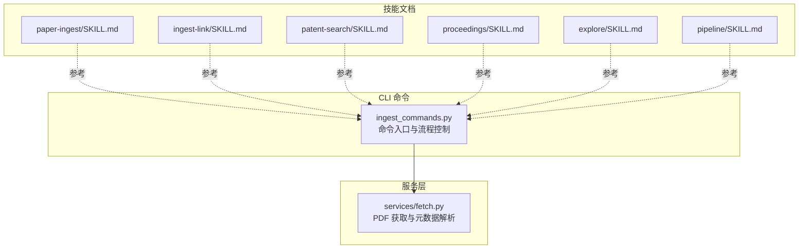
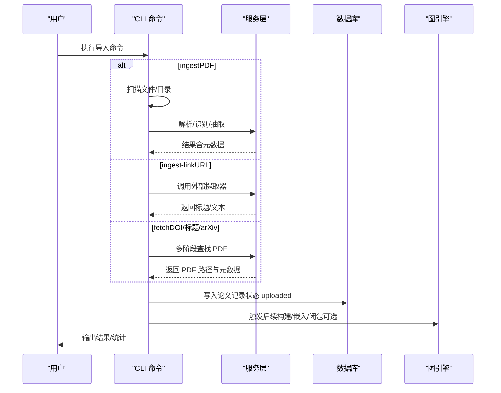
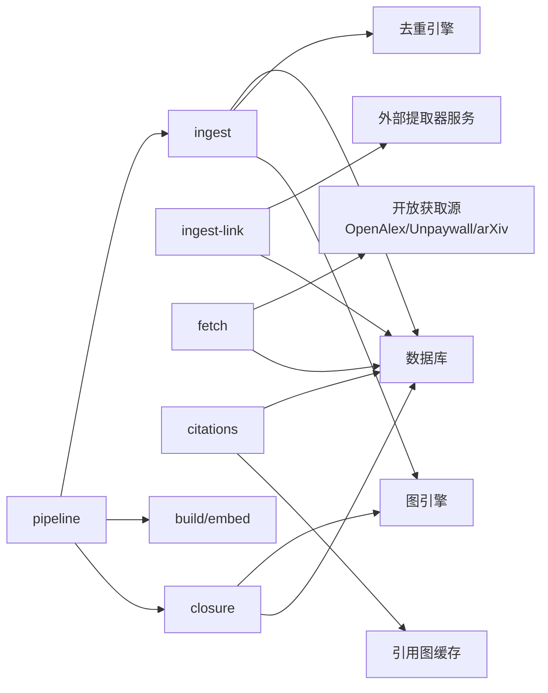

# 论文导入命令

<cite>
**本文引用的文件**
- [src/drbrain/cli/ingest_commands.py](file://src/drbrain/cli/ingest_commands.py)
- [src/drbrain/services/fetch.py](file://src/drbrain/services/fetch.py)
- [skills/paper-ingest/SKILL.md](file://skills/paper-ingest/SKILL.md)
- [skills/ingest-link/SKILL.md](file://skills/ingest-link/SKILL.md)
- [skills/patent-search/SKILL.md](file://skills/patent-search/SKILL.md)
- [skills/proceedings/SKILL.md](file://skills/proceedings/SKILL.md)
- [skills/explore/SKILL.md](file://skills/explore/SKILL.md)
- [skills/pipeline/SKILL.md](file://skills/pipeline/SKILL.md)
</cite>

## 目录
1. [简介](#简介)
2. [项目结构](#项目结构)
3. [核心组件](#核心组件)
4. [架构总览](#架构总览)
5. [详细组件分析](#详细组件分析)
6. [依赖分析](#依赖分析)
7. [性能考虑](#性能考虑)
8. [故障排除指南](#故障排除指南)
9. [结论](#结论)
10. [附录](#附录)

## 简介
本文件面向 DrBrain 的“论文导入”相关命令，系统性梳理并说明以下命令的功能、用法与最佳实践：ingest（批量 PDF 导入）、ingest-link（网页/在线 PDF 导入）、patent-search（专利检索）、proceedings（会议论文集管理）、explore（探索型阅读集合）、fetch（从开放获取源下载并导入）、citations（引用图查询与验证）、check-citations（引文核对）、report（单篇报告查看）、closure（基于规则的闭包推理）。文档同时给出适用场景、参数说明、典型命令行示例与注意事项。

## 项目结构
与论文导入直接相关的代码与技能文件主要分布在如下位置：
- CLI 命令实现：src/drbrain/cli/ingest_commands.py
- PDF 获取与元数据解析：src/drbrain/services/fetch.py
- 技能文档（用户参考）：skills/*.md

图表来源
- [src/drbrain/cli/ingest_commands.py:1-935](file://src/drbrain/cli/ingest_commands.py#L1-L935)
- [src/drbrain/services/fetch.py:1-345](file://src/drbrain/services/fetch.py#L1-L345)

章节来源
- [src/drbrain/cli/ingest_commands.py:1-935](file://src/drbrain/cli/ingest_commands.py#L1-L935)
- [src/drbrain/services/fetch.py:1-345](file://src/drbrain/services/fetch.py#L1-L345)

## 核心组件
- ingest：扫描 PDF（单个/目录），执行解析、识别、树化、记录入库；支持批量与 JSON 输出。
- ingest-link：通过外部 web 提取器抓取网页/在线 PDF，生成本地记录。
- patent-search：基于 PPUBS（免费）或 ODP（需密钥）检索 USPTO 专利，支持按申请号查询。
- proceedings：创建/列出/展示/添加论文至会议论文集。
- explore：轻量级探索集合，用于文献发现与主题阅读清单。
- fetch：从开放获取源多阶段回退查找 PDF 并下载，随后自动触发入库。
- citations/check-citations：查询引用图、共享参考、核对文内引文是否匹配本地库。
- report：查看单篇报告摘要与指标。
- closure：在知识图谱上运行规则闭包推理，可选嵌入驱动规则挖掘与规则落地。

章节来源
- [src/drbrain/cli/ingest_commands.py:26-935](file://src/drbrain/cli/ingest_commands.py#L26-L935)
- [src/drbrain/services/fetch.py:219-345](file://src/drbrain/services/fetch.py#L219-L345)

## 架构总览
下图展示“从输入到入库”的端到端流程，涵盖 ingest、ingest-link、fetch 三类导入路径与共同的入库与后续处理环节。

图表来源
- [src/drbrain/cli/ingest_commands.py:26-150](file://src/drbrain/cli/ingest_commands.py#L26-L150)
- [src/drbrain/cli/ingest_commands.py:464-567](file://src/drbrain/cli/ingest_commands.py#L464-L567)
- [src/drbrain/services/fetch.py:219-264](file://src/drbrain/services/fetch.py#L219-L264)

## 详细组件分析

### ingest 命令（批量 PDF 导入）
- 功能概述
  - 接受单个 PDF、多个 PDF 或目录路径，默认扫描 inbox 目录。
  - 对每个 PDF 执行解析、识别、树化、抽取等步骤，并写入数据库。
  - 支持 JSON 输出，便于自动化集成。
- 关键参数
  - 参数 paths：PDF 文件或目录列表；未提供时默认使用配置中的 inbox 目录。
  - 选项 --json：以机器可读 JSON 输出统计与错误明细。
- 典型用法
  - 批量导入：drbrain ingest ~/Downloads/arxiv-papers/
  - 指定文件：drbrain ingest paper1.pdf paper2.pdf
  - JSON 输出：drbrain ingest --json
- 最佳实践
  - 将待导入 PDF 放入 inbox 目录，直接运行 drbrain ingest 即可。
  - 大批量导入建议使用 --json 以便监控与排障。
  - 失败项会进入 pending 队列，可通过日志定位原因。
- 适用场景
  - 新下载的 PDF、arXiv 文档、会议论文等离线材料入库。
- 故障排查
  - 若无 PDF 被识别，检查文件是否损坏或非文本型扫描版。
  - 若 LLM 抽取失败，确认 API 密钥与网络连通性。

章节来源
- [src/drbrain/cli/ingest_commands.py:26-110](file://src/drbrain/cli/ingest_commands.py#L26-L110)
- [skills/paper-ingest/SKILL.md:26-98](file://skills/paper-ingest/SKILL.md#L26-L98)

### ingest-link 命令（网页/在线 PDF 导入）
- 功能概述
  - 通过外部 qt-web-extractor 服务抓取渲染后的内容，保存为 Markdown 并注册为论文记录。
  - 支持 --pdf 强制 PDF 提取模式，--dry-run 预览不落盘，--json 输出结构化结果。
- 关键参数
  - 参数 urls：一个或多个 URL。
  - 选项 --pdf/--no-pdf：强制 PDF 提取。
  - 选项 --dry-run：仅预览，不保存。
  - 选项 --json：输出 JSON。
- 典型用法
  - 单条导入：drbrain ingest-link https://example.com/page
  - 在线 PDF：drbrain ingest-link https://example.com/report.pdf --pdf
  - 批量导入：drbrain ingest-link https://a.com https://b.com
  - 预览：drbrain ingest-link https://example.com --dry-run
- 最佳实践
  - 确保外部提取器服务可用（默认 http://127.0.0.1:8766），或设置 WEBEXTRACT_URL。
  - 对于反爬/登录保护页面，优先使用 --pdf 或先登录再抓取。
- 适用场景
  - 保存网页文章、在线 PDF、新闻稿等非本地 PDF 材料。
- 故障排查
  - 无法连接提取器：检查服务状态与端口，或设置 WEBEXTRACT_URL。
  - 提取失败：确认 URL 可访问且返回文本；必要时使用 --pdf。

章节来源
- [src/drbrain/cli/ingest_commands.py:464-567](file://src/drbrain/cli/ingest_commands.py#L464-L567)
- [skills/ingest-link/SKILL.md:15-45](file://skills/ingest-link/SKILL.md#L15-L45)

### patent-search 命令（专利检索）
- 功能概述
  - 支持两种来源：PPUBS（免费，无需密钥）与 ODP（需 API 密钥，元数据更丰富）。
  - 支持关键词检索与按申请号查询（仅 ODP）。
- 关键参数
  - 参数 query：检索关键词列表，拼接为查询字符串。
  - 选项 --application/-a：按申请号查询（仅 ODP）。
  - 选项 --limit/-n：限制返回数量。
  - 选项 --source/-s：选择来源（ppubs 或 odp）。
  - 选项 --api-key：USPTO ODP API 密钥（环境变量 USPTO_ODP_API_KEY 也可）。
  - 选项 --json：输出 JSON。
- 典型用法
  - PPUBS 检索：drbrain patent-search "machine learning transformer" --limit 5
  - ODP 检索：drbrain patent-search "quantum computing" --source odp
  - 按申请号查询：drbrain patent-search --application 17123456 --source odp --api-key your-key
- 最佳实践
  - 优先使用 PPUBS 快速检索；需要更全元数据时使用 ODP。
  - 申请 ODP 密钥后设置环境变量，避免明文传参。
- 适用场景
  - 发现现有技术、专利导航、规避设计、前言艺术检索。
- 故障排查
  - ODP 缺少密钥：按提示注册并设置密钥。
  - 查询无结果：调整关键词或尝试不同来源。

章节来源
- [src/drbrain/cli/ingest_commands.py:569-701](file://src/drbrain/cli/ingest_commands.py#L569-L701)
- [skills/patent-search/SKILL.md:14-51](file://skills/patent-search/SKILL.md#L14-L51)

### proceedings 命令（会议论文集管理）
- 功能概述
  - 创建、列出、展示会议论文集，并将论文加入指定论文集。
- 关键参数
  - 选项 --list：列出所有论文集。
  - 选项 --create：创建论文集（名称 年份 [地点]）。
  - 选项 --show：显示指定论文集详情。
  - 选项 --add：添加论文到论文集（PROCEEDING_ID PAPER_ID）。
  - 选项 --json：输出 JSON。
- 典型用法
  - 创建：drbrain proceedings --create "NeurIPS 2024"
  - 列表：drbrain proceedings --list
  - 展示：drbrain proceedings --show <ID>
  - 添加：drbrain proceedings --add <PROC_ID> <PAPER_ID>
- 最佳实践
  - 使用统一命名规范（如 Conference Year），便于检索与导出。
- 适用场景
  - 组织会议论文、跟踪特定会议的收录情况。
- 故障排查
  - 论文集不存在：先创建再添加。
  - 添加失败：确认 ID 正确且论文已入库。

章节来源
- [src/drbrain/cli/ingest_commands.py:759-833](file://src/drbrain/cli/ingest_commands.py#L759-L833)
- [skills/proceedings/SKILL.md:15-39](file://skills/proceedings/SKILL.md#L15-L39)

### explore 命令（探索型阅读集合）
- 功能概述
  - 轻量级探索集合，独立于主库与工作区，适合文献综述与主题阅读清单。
- 关键参数
  - 选项 --list：列出所有 silo。
  - 选项 --create：创建 silo。
  - 选项 --delete：删除 silo。
  - 选项 --name/-n：配合 --search 或 --show 使用。
  - 选项 --search/-s：在 silo 内搜索。
  - 选项 --show：显示 silo 中论文。
  - 选项 --json：输出 JSON。
- 典型用法
  - 创建：drbrain explore --create transformers
  - 列表：drbrain explore --list
  - 搜索：drbrain explore --name transformers --search "attention"
  - 删除：drbrain explore --delete transformers
- 最佳实践
  - 为不同主题建立独立 silo，避免污染主库。
- 适用场景
  - 新领域探索、文献调查、阅读清单管理。
- 故障排查
  - silo 不存在：先创建再操作。
  - 搜索无结果：检查关键词与 silo 内容。

章节来源
- [src/drbrain/cli/ingest_commands.py:835-922](file://src/drbrain/cli/ingest_commands.py#L835-L922)
- [skills/explore/SKILL.md:16-49](file://skills/explore/SKILL.md#L16-L49)

### fetch 命令（从开放获取源下载并导入）
- 功能概述
  - 依据 DOI、标题或 arXiv ID，通过多阶段回退策略寻找可下载 PDF，下载后自动触发入库。
- 关键参数
  - 参数 identifier：DOI、标题或 arXiv ID。
  - 选项 --arxiv：将 identifier 视作 arXiv ID。
- 典型用法
  - 通过 DOI：drbrain fetch 10.xxxx/xxxx
  - 通过 arXiv：drbrain fetch arXiv:2106.12345 --arxiv
  - 通过标题：drbrain fetch "Attention Is All You Need"
- 最佳实践
  - 优先使用 DOI；若无 DOI，可尝试 arXiv ID 或标题。
  - 确保网络与第三方服务可用（OpenAlex、Unpaywall、arXiv 等）。
- 适用场景
  - 从开放获取源快速获取 PDF 并入库，减少手动下载。
- 故障排查
  - 无法找到 PDF：检查 identifier 是否正确，或尝试其他标识符。
  - 下载失败：检查网络、代理配置与超时设置。

章节来源
- [src/drbrain/cli/ingest_commands.py:112-150](file://src/drbrain/cli/ingest_commands.py#L112-L150)
- [src/drbrain/services/fetch.py:219-345](file://src/drbrain/services/fetch.py#L219-L345)

### citations 与 check-citations 命令（引用图与引文核对）
- 功能概述
  - citations：查询某篇论文的参考文献、被引文献、共享参考（前沿信号）。
  - check-citations：核对文内引文与本地库的匹配情况。
- 关键参数（citations）
  - 参数 local_id：目标论文 ID。
  - 选项 --type/-t：refs（仅参考文献）、citing（仅被引）、shared-refs（共享参考）、all（全部）。
  - 选项 --limit/-l：每类最大结果数。
  - 选项 --sort/-s：排序方式（如 cited_by_count:desc、publication_date:desc、relevance_score:desc）。
  - 选项 --workspace/-w：限定在某个工作区范围内。
  - 选项 --json：输出 JSON。
  - 选项 --fetch-interested：交互式选择并批量抓取占位论文。
- 关键参数（check-citations）
  - 参数 text：要检查的文本。
  - 选项 --file/-f：从文件读取文本。
  - 选项 --json：输出 JSON。
- 典型用法
  - 查看引用图：drbrain citations p3f8a2 --type all
  - 共享参考分析：drbrain citations p3f8a2 --type shared-refs
  - 核对引文：drbrain check-citations --file draft.txt
- 最佳实践
  - 共享参考中 status 为 unlinked 的论文是潜在的知识前沿信号，值得进一步挖掘。
  - 本地库需有足够已知 DOI 的论文，才能更好匹配文内引文。
- 适用场景
  - 学术脉络追踪、前沿探测、写作引文校验。
- 故障排查
  - 无结果：确认论文已入库且存在引用缓存；必要时先扩展引用网络。

章节来源
- [src/drbrain/cli/ingest_commands.py:152-305](file://src/drbrain/cli/ingest_commands.py#L152-L305)
- [skills/citation-tracking/SKILL.md:25-88](file://skills/citation-tracking/SKILL.md#L25-L88)

### report 命令（单篇报告查看）
- 功能概述
  - 显示某篇论文的完整报告（摘要、覆盖率、概念统计等）。
- 关键参数
  - 参数 local_id：论文 ID。
  - 选项 --json：输出完整报告 JSON。
- 典型用法
  - drbrain report p3f8a2
  - drbrain report p3f8a2 --json
- 最佳实践
  - 在完成构建与闭包后查看报告，信息更完整。
- 适用场景
  - 论文质量评估、摘要与概念概览。
- 故障排查
  - 无报告：先运行 ingest 与后续构建流程。

章节来源
- [src/drbrain/cli/ingest_commands.py:307-349](file://src/drbrain/cli/ingest_commands.py#L307-L349)

### closure 命令（基于规则的闭包推理）
- 功能概述
  - 在知识图谱上运行规则闭包推理，可选嵌入驱动规则挖掘与规则落地。
- 关键参数
  - 选项 --json：输出 JSON。
  - 选项 --dry-run：仅输出推断边但不持久化。
  - 选项 --rule：仅运行指定规则（可重复）。
  - 选项 --workspace/-w：限定在某个工作区。
  - 选项 --mode：推理模式（symbolic 或 hybrid）。
  - 选项 --mine-rules：从 TransE 嵌入中挖掘路径规则。
  - 选项 --min-confidence：最小置信度（0.0–1.0）。
  - 选项 --ground：将传递规则作为具体三元组落地（t-norm）。
- 典型用法
  - drbrain closure --mode hybrid
  - drbrain closure --rule creates_debate --rule gap_addressed
  - drbrain closure --mine-rules --min-confidence 0.6
- 最佳实践
  - 先运行构建与嵌入，再进行闭包推理。
  - 使用 --dry-run 预览影响范围。
- 适用场景
  - 自动发现隐含关系、知识图谱增强、规则验证与落地。
- 故障排查
  - 规则无效：确认规则名在有效集合内。
  - 性能问题：适当降低 --limit 或缩小 --workspace。

章节来源
- [src/drbrain/cli/ingest_commands.py:350-462](file://src/drbrain/cli/ingest_commands.py#L350-L462)

### pipeline 命令（端到端流水线）
- 功能概述
  - 一键运行预设或自定义步骤序列（ingest → build → embed → closure）。
- 关键参数
  - 选项 --preset/-p：full（完整）、quick（跳过 ingest）、embed（仅嵌入+闭包）。
  - 选项 --steps/-s：逗号分隔的步骤名。
  - 选项 --list：列出可用步骤与预设。
  - 选项 --dry-run：仅预览不执行。
- 典型用法
  - drbrain pipeline --preset full
  - drbrain pipeline --steps build,embed,closure
  - drbrain pipeline --preset full --dry-run
- 最佳实践
  - 新手建议使用 --preset full；已有库可使用 quick 或 embed。
- 适用场景
  - 批量处理、自动化工作流、CI/CD 集成。
- 故障排查
  - 步骤缺失：使用 --list 查看可用步骤。

章节来源
- [src/drbrain/cli/ingest_commands.py:703-757](file://src/drbrain/cli/ingest_commands.py#L703-L757)
- [skills/pipeline/SKILL.md:14-51](file://skills/pipeline/SKILL.md#L14-L51)

## 依赖分析
- ingest 与 fetch 共同依赖数据库与去重引擎，确保入库一致性。
- ingest-link 依赖外部 web 提取器服务，需保证服务可达与配置正确。
- citations 依赖引用图缓存与数据库；首次查询可能触发引用扩展。
- closure 依赖图引擎与可选的嵌入规则挖掘模块。
- pipeline 串联多个命令，形成端到端处理链路。

图表来源
- [src/drbrain/cli/ingest_commands.py:69-110](file://src/drbrain/cli/ingest_commands.py#L69-L110)
- [src/drbrain/cli/ingest_commands.py:464-567](file://src/drbrain/cli/ingest_commands.py#L464-L567)
- [src/drbrain/services/fetch.py:219-264](file://src/drbrain/services/fetch.py#L219-L264)

## 性能考虑
- 批量导入建议使用 --json 输出，便于异步处理与监控。
- 引文扩展与闭包推理成本较高，建议在小范围工作区或使用 --dry-run 预览后再持久化。
- 外部服务（提取器、USPTO API、开放获取源）的可用性与响应时间直接影响整体吞吐。
- 合理设置 --limit 与 --workspace，避免不必要的全库扫描。

## 故障排除指南
- 无 PDF 文件被识别
  - 检查文件是否损坏或为扫描版；确认解析器可用。
- 外部提取器不可达
  - 确认服务运行状态与端口；设置 WEBEXTRACT_URL。
- ODP API 密钥缺失
  - 注册并设置 USPTO_ODP_API_KEY 环境变量。
- 引文核对无匹配
  - 确保本地库包含已知 DOI 的论文；调整作者/年份变体。
- 闭包规则无效
  - 使用 --list 查看可用规则；确认规则名拼写正确。

章节来源
- [src/drbrain/cli/ingest_commands.py:588-600](file://src/drbrain/cli/ingest_commands.py#L588-L600)
- [src/drbrain/cli/ingest_commands.py:182-184](file://src/drbrain/cli/ingest_commands.py#L182-L184)
- [src/drbrain/cli/ingest_commands.py:401-406](file://src/drbrain/cli/ingest_commands.py#L401-L406)

## 结论
本文系统梳理了 DrBrain 的论文导入与关联命令，覆盖 PDF 批量导入、网页/在线 PDF 导入、专利检索、论文集管理、探索集合、开放获取下载、引用图分析、引文核对、报告查看与规则闭包等关键能力。建议根据场景选择合适命令组合：新资料优先 ingest 或 ingest-link；需要开放获取 PDF 使用 fetch；组织会议用 proceedings；探索新领域用 explore；最终通过 pipeline 完整跑通端到端流程。

## 附录
- 常用命令速查
  - ingest：drbrain ingest [files/dirs] [--json]
  - ingest-link：drbrain ingest-link <urls...> [--pdf/--no-pdf] [--dry-run] [--json]
  - patent-search：drbrain patent-search "<terms>" [--source odp|ppubs] [--application <num>] [--api-key <key>] [--limit <n>] [--json]
  - proceedings：drbrain proceedings --create "<Name Year [Venue]>" | --list | --show <id> | --add <proc_id> <paper_id> [--json]
  - explore：drbrain explore --create <name> | --list | --name <n> --show | --name <n> --search <q> | --delete <name> [--json]
  - fetch：drbrain fetch <identifier> [--arxiv]
  - citations：drbrain citations <id> [--type refs|citing|shared-refs|all] [--limit <n>] [--sort <field:dir>] [--workspace <ws>] [--json] [--fetch-interested]
  - check-citations：drbrain check-citations "<text>" | --file <path> [--json]
  - report：drbrain report <id> [--json]
  - closure：drbrain closure [--json] [--dry-run] [--rule <name>...] [--workspace <ws>] [--mode symbolic|hybrid] [--mine-rules] [--min-confidence <0-1>] [--ground]
  - pipeline：drbrain pipeline --preset full|quick|embed | --steps <step,...> | --list | --dry-run