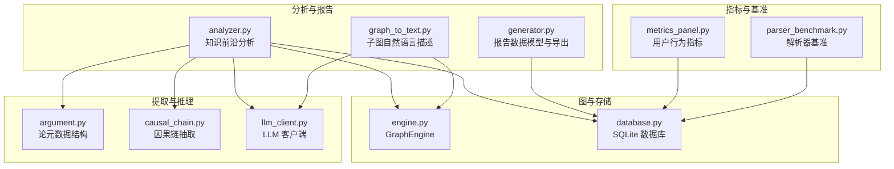
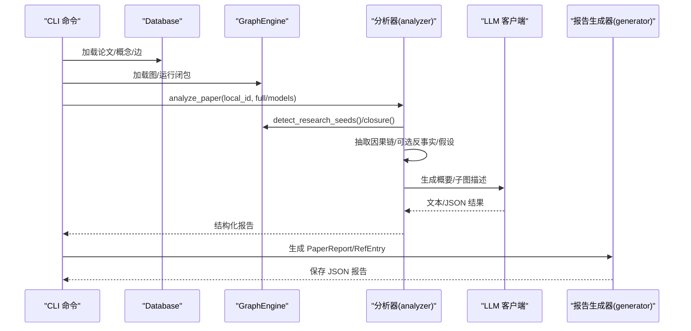
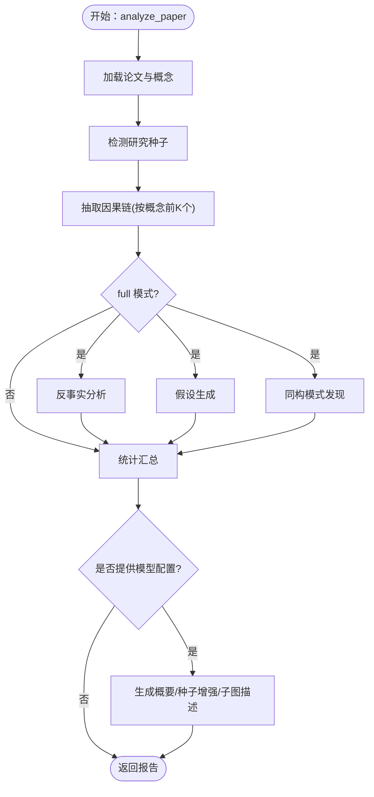
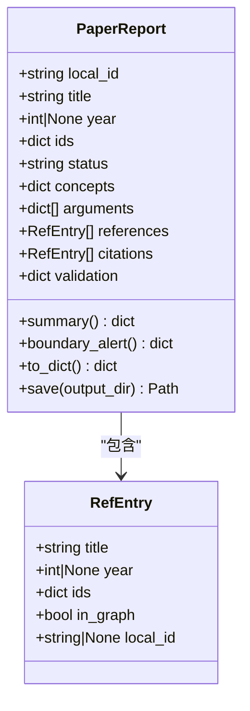
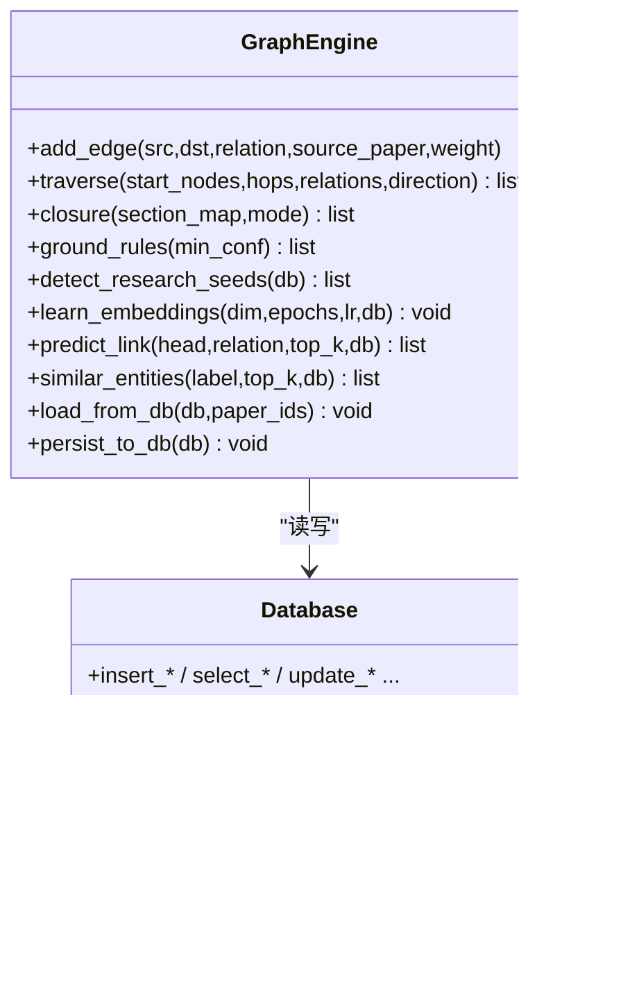
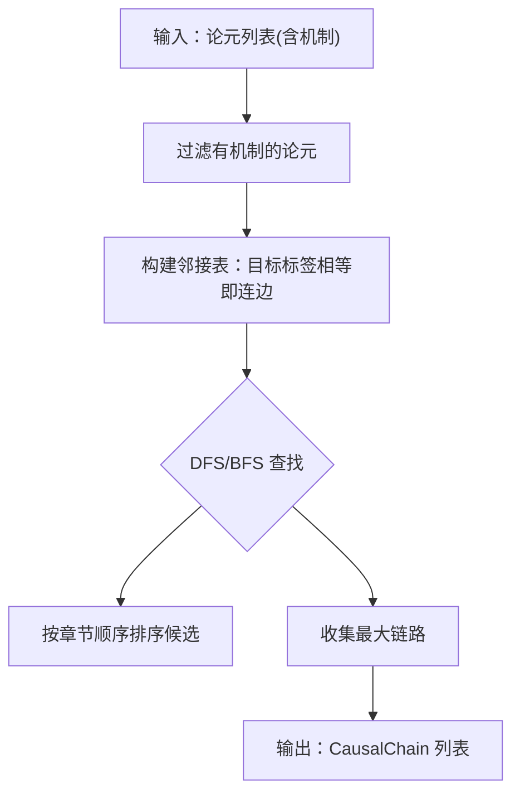
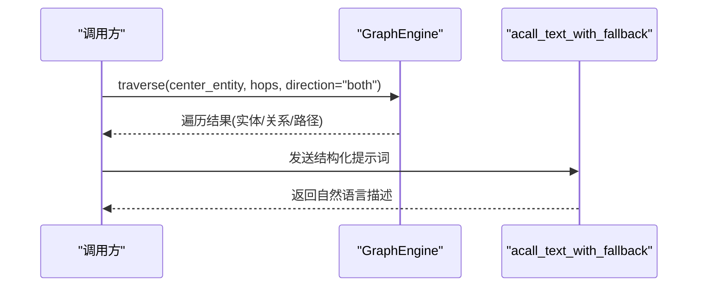
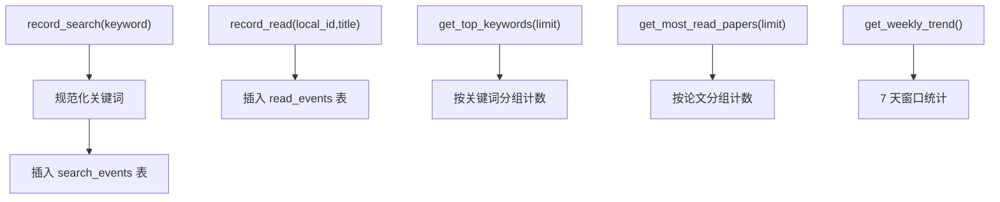
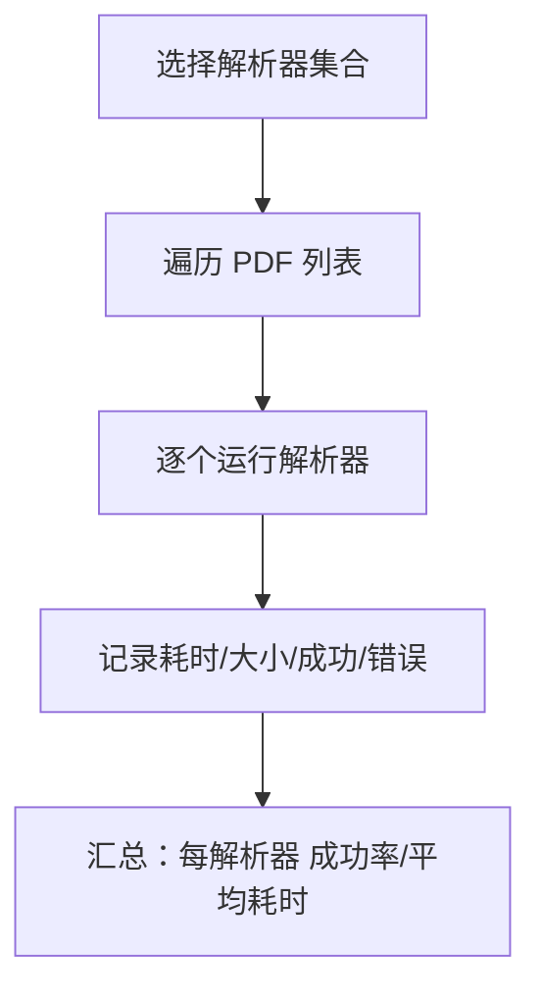
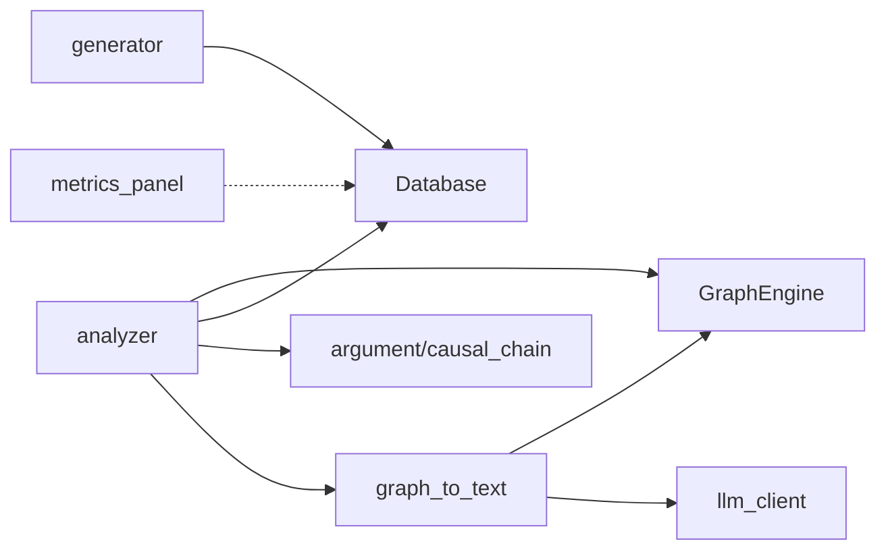

# 分析与报告

<cite>
**本文引用的文件**
- [analyzer.py](file://src/drbrain/report/analyzer.py)
- [generator.py](file://src/drbrain/report/generator.py)
- [metrics_panel.py](file://src/drbrain/services/metrics_panel.py)
- [analysis_commands.py](file://src/drbrain/cli/analysis_commands.py)
- [database.py](file://src/drbrain/storage/database.py)
- [engine.py](file://src/drbrain/graph/engine.py)
- [argument.py](file://src/drbrain/extractor/argument.py)
- [causal_chain.py](file://src/drbrain/extractor/causal_chain.py)
- [graph_to_text.py](file://src/drbrain/services/graph_to_text.py)
- [llm_client.py](file://src/drbrain/extractor/llm_client.py)
- [parser_benchmark.py](file://src/drbrain/services/parser_benchmark.py)
- [test_report_generator.py](file://tests/test_report_generator.py)
- [test_metrics_panel.py](file://tests/test_metrics_panel.py)
- [README.md](file://README.md)
</cite>

## 目录
1. [简介](#简介)
2. [项目结构](#项目结构)
3. [核心组件](#核心组件)
4. [架构总览](#架构总览)
5. [详细组件分析](#详细组件分析)
6. [依赖分析](#依赖分析)
7. [性能考虑](#性能考虑)
8. [故障排查指南](#故障排查指南)
9. [结论](#结论)
10. [附录](#附录)

## 简介
本文件面向 DrBrain 的“分析与报告”子系统，系统性阐述知识前沿分析、研究趋势报告、统计分析、可视化与指标面板等能力的实现原理与使用方法。文档覆盖以下主题：
- 知识前沿分析：研究种子检测、因果链抽取、反事实分析、同构模式发现、假设生成等。
- 报告生成：单篇论文报告的数据模型、引用覆盖率统计、边界预警与持久化。
- 可视化与自然语言描述：基于图遍历的路径描述与子图自然语言摘要。
- 指标面板：用户行为度量（搜索关键词、最热论文、周趋势）的采集与查询。
- 性能基准：PDF 解析器对比评测工具与结果解读。
- 自定义扩展：如何开发自定义分析与报告模板。

## 项目结构
DrBrain 将“分析与报告”能力组织在如下模块中：
- 报告与分析：report/analyzer.py、report/generator.py
- 图引擎与推理：graph/engine.py、storage/database.py
- 提取与推理：extractor/argument.py、extractor/causal_chain.py、extractor/llm_client.py
- 可视化与文本描述：services/graph_to_text.py
- 指标面板：services/metrics_panel.py
- 基准测试：services/parser_benchmark.py
- CLI 命令入口：cli/analysis_commands.py
- 测试用例：tests/test_report_generator.py、tests/test_metrics_panel.py

图表来源
- [analyzer.py:1-231](file://src/drbrain/report/analyzer.py#L1-L231)
- [generator.py:1-110](file://src/drbrain/report/generator.py#L1-L110)
- [graph_to_text.py:1-145](file://src/drbrain/services/graph_to_text.py#L1-L145)
- [engine.py:1-800](file://src/drbrain/graph/engine.py#L1-L800)
- [database.py:1-775](file://src/drbrain/storage/database.py#L1-L775)
- [argument.py:1-87](file://src/drbrain/extractor/argument.py#L1-L87)
- [causal_chain.py:1-238](file://src/drbrain/extractor/causal_chain.py#L1-L238)
- [llm_client.py:1-154](file://src/drbrain/extractor/llm_client.py#L1-L154)
- [metrics_panel.py:1-139](file://src/drbrain/services/metrics_panel.py#L1-L139)
- [parser_benchmark.py:1-154](file://src/drbrain/services/parser_benchmark.py#L1-L154)

章节来源
- [README.md:41-66](file://README.md#L41-L66)

## 核心组件
- 知识前沿分析器：对单篇论文执行研究种子检测、因果链抽取、可选的反事实与假设生成，并汇总统计与 LLM 概要。
- 报告生成器：以 PaperReport/RefEntry 为核心数据模型，计算引用覆盖率与边界预警，并支持保存为 JSON。
- 图引擎与数据库：提供规则闭包、邻域遍历、嵌入学习与持久化，支撑分析器与可视化。
- 因果链抽取：从论元机制字段构建概念间的因果链，支持按起点筛选与最短路径查找。
- 子图自然语言描述：围绕中心实体进行多跳遍历，生成自然语言描述。
- 用户行为指标：轻量 SQLite 记录搜索与阅读事件，提供热门关键词、最热论文与周趋势。
- 解析器基准：对比不同 PDF 解析器的耗时与输出大小，辅助选择与优化。

章节来源
- [analyzer.py:9-134](file://src/drbrain/report/analyzer.py#L9-L134)
- [generator.py:21-106](file://src/drbrain/report/generator.py#L21-L106)
- [engine.py:124-315](file://src/drbrain/graph/engine.py#L124-L315)
- [database.py:419-775](file://src/drbrain/storage/database.py#L419-L775)
- [causal_chain.py:63-238](file://src/drbrain/extractor/causal_chain.py#L63-L238)
- [graph_to_text.py:70-145](file://src/drbrain/services/graph_to_text.py#L70-L145)
- [metrics_panel.py:13-139](file://src/drbrain/services/metrics_panel.py#L13-L139)
- [parser_benchmark.py:39-154](file://src/drbrain/services/parser_benchmark.py#L39-L154)

## 架构总览
下图展示“分析与报告”子系统的端到端工作流：CLI 命令加载图与数据库，调用分析器生成报告；分析器通过图引擎执行规则闭包与研究种子检测，必要时调用 LLM 客户端生成自然语言摘要；报告生成器负责数据模型与导出；指标面板与基准测试分别提供用户行为度量与性能评估。

图表来源
- [analysis_commands.py:54-116](file://src/drbrain/cli/analysis_commands.py#L54-L116)
- [analyzer.py:9-134](file://src/drbrain/report/analyzer.py#L9-L134)
- [engine.py:124-315](file://src/drbrain/graph/engine.py#L124-L315)
- [llm_client.py:117-154](file://src/drbrain/extractor/llm_client.py#L117-L154)
- [generator.py:21-106](file://src/drbrain/report/generator.py#L21-L106)

## 详细组件分析

### 知识前沿分析器（analyzer）
- 单篇分析流程
  - 加载论文与概念，构建基础报告结构。
  - 研究种子检测：基于图模式与时间维度识别“未解决缺口”“争议区”“技术瓶颈”等机会点。
  - 因果链抽取：从带机制的论元中构建 X→Y(via Z) 链条，限定前若干概念以控制规模。
  - 可选增强：反事实节点筛选、假设生成、同构模式发现。
  - 统计汇总：统计种子数、因果链数、推断边数、关键节点、假设与同构数量。
  - LLM 能力：生成高层概要、为研究种子补充解决方案方向、对顶级概念子图生成自然语言描述。
- 跨论文洞察
  - 收集各论文的概念集合，按类型区分“方法/问题”，计算标签相似度，发现跨论文迁移机会。

图表来源
- [analyzer.py:9-134](file://src/drbrain/report/analyzer.py#L9-L134)
- [analyzer.py:137-182](file://src/drbrain/report/analyzer.py#L137-L182)

章节来源
- [analyzer.py:9-134](file://src/drbrain/report/analyzer.py#L9-L134)
- [analyzer.py:137-182](file://src/drbrain/report/analyzer.py#L137-L182)

### 报告生成器（generator）
- 数据模型
  - RefEntry：参考文献条目，包含标题、年份、标识符、是否在图内、本地 ID。
  - PaperReport：单篇论文完整报告，包含论文元数据、概念、论元、参考文献、引证、验证状态等。
- 统计与预警
  - 引用覆盖率：总参考与引文数量、图内命中数、覆盖率。
  - 边界预警：核心参考缺失、孤立子图、验证失败。
- 导出
  - to_dict 输出标准化字典，save 保存为 JSON 文件。

图表来源
- [generator.py:10-106](file://src/drbrain/report/generator.py#L10-L106)

章节来源
- [generator.py:21-106](file://src/drbrain/report/generator.py#L21-L106)
- [test_report_generator.py:1-100](file://tests/test_report_generator.py#L1-L100)

### 图引擎与数据库（engine + database）
- 图引擎
  - 提供邻域遍历、规则闭包（符号与混合模式）、TransE 嵌入学习与预测、实体相似度检索。
  - 闭包规则涵盖争议生成、缺口解决、间接演化、缺口到争议、共享演员网络、传递闭包与路径规则等。
- 数据库
  - 提供论文、概念、论元、边、别名、嵌入、树向量/摘要、置信队列、研究种子、引用缓存、构建阶段、模式版本等表。
  - 提供演进信号检测（新兴/已建立/衰落/争议/复苏）、概念年表统计、删除论文级联清理等。

图表来源
- [engine.py:33-800](file://src/drbrain/graph/engine.py#L33-L800)
- [database.py:159-775](file://src/drbrain/storage/database.py#L159-L775)

章节来源
- [engine.py:124-315](file://src/drbrain/graph/engine.py#L124-L315)
- [engine.py:354-622](file://src/drbrain/graph/engine.py#L354-L622)
- [database.py:619-775](file://src/drbrain/storage/database.py#L619-L775)

### 因果链抽取（causal_chain）
- 输入：ExtractedArgument 列表（来自 LLM 提取的论元单元）。
- 算法要点
  - 仅使用机制字段构建链，按目标标签匹配形成邻接关系。
  - 使用 DFS/BFS 找到最大链路，按文档章节顺序排序以提升可读性。
  - 支持按起点筛选与最短路径查找。
- 输出：CausalChain 对象序列，每个包含链接列表与摘要字符串。

图表来源
- [causal_chain.py:63-150](file://src/drbrain/extractor/causal_chain.py#L63-L150)
- [causal_chain.py:153-189](file://src/drbrain/extractor/causal_chain.py#L153-L189)
- [causal_chain.py:192-238](file://src/drbrain/extractor/causal_chain.py#L192-L238)

章节来源
- [causal_chain.py:40-61](file://src/drbrain/extractor/causal_chain.py#L40-L61)
- [argument.py:13-38](file://src/drbrain/extractor/argument.py#L13-L38)

### 子图自然语言描述（graph_to_text）
- 步骤
  - 以中心实体为起点，双向遍历至指定深度，收集实体与关系。
  - 构造提示词，调用 LLM 客户端生成自然语言段落。
- 关系映射：将关系名称映射为自然语言动词或动名词形式，便于生成通顺描述。

图表来源
- [graph_to_text.py:70-145](file://src/drbrain/services/graph_to_text.py#L70-L145)
- [llm_client.py:117-154](file://src/drbrain/extractor/llm_client.py#L117-L154)

章节来源
- [graph_to_text.py:6-68](file://src/drbrain/services/graph_to_text.py#L6-L68)
- [graph_to_text.py:70-145](file://src/drbrain/services/graph_to_text.py#L70-L145)

### 指标面板（metrics_panel）
- 功能
  - 记录搜索事件与阅读事件，维护 SQLite 表。
  - 查询：热门关键词、最热论文、周趋势（搜索/阅读总量、去重数量）。
- 设计
  - 独立于主数据库的轻量 SQLite，避免影响主业务性能。
  - 关键词归一化（空白折叠、小写），索引加速。

图表来源
- [metrics_panel.py:42-139](file://src/drbrain/services/metrics_panel.py#L42-L139)

章节来源
- [metrics_panel.py:13-139](file://src/drbrain/services/metrics_panel.py#L13-L139)
- [test_metrics_panel.py:1-99](file://tests/test_metrics_panel.py#L1-L99)

### 解析器基准（parser_benchmark）
- 目的：对比 PyMuPDF、MinerU、PyMuPDF4LLM 的耗时与输出大小，评估稳定性与性能。
- 方法：对一组 PDF 文件逐一运行各解析器，记录耗时、输出大小与错误信息，汇总统计。

图表来源
- [parser_benchmark.py:39-154](file://src/drbrain/services/parser_benchmark.py#L39-L154)

章节来源
- [parser_benchmark.py:10-154](file://src/drbrain/services/parser_benchmark.py#L10-L154)

## 依赖分析
- 组件耦合
  - analyzer 依赖 graph.engine.GraphEngine 与 storage.database.Database，以及 extractor.* 与 services.graph_to_text。
  - generator 依赖 database（用于引用/引文关联，尽管当前示例未直接使用）。
  - graph_to_text 依赖 GraphEngine 与 LLM 客户端。
  - metrics_panel 独立维护 SQLite，不依赖主数据库。
- 外部依赖
  - LLM 客户端通过 litellm 调用多提供商后端，支持 API Key 与 Base URL 配置。
  - 图引擎依赖 NetworkX、NumPy 与自定义规则模块。

图表来源
- [analyzer.py:5-8](file://src/drbrain/report/analyzer.py#L5-L8)
- [graph_to_text.py:95-144](file://src/drbrain/services/graph_to_text.py#L95-L144)
- [llm_client.py:8-10](file://src/drbrain/extractor/llm_client.py#L8-L10)
- [metrics_panel.py:13-39](file://src/drbrain/services/metrics_panel.py#L13-L39)

章节来源
- [analyzer.py:3-8](file://src/drbrain/report/analyzer.py#L3-L8)
- [graph_to_text.py:1-5](file://src/drbrain/services/graph_to_text.py#L1-L5)
- [llm_client.py:1-10](file://src/drbrain/extractor/llm_client.py#L1-L10)
- [metrics_panel.py:8-12](file://src/drbrain/services/metrics_panel.py#L8-L12)

## 性能考虑
- 规则闭包复杂度
  - 闭包过程扫描边并应用多条规则，时间复杂度与节点/边数量线性相关；建议在增量场景使用 closure_incremental 或按种子子图执行。
- LLM 调用
  - LLM 客户端支持回退链与令牌追踪，避免单点失败；合理设置 max_tokens 与温度参数。
- 嵌入与相似度
  - TransE 嵌入训练与预测需加载/持久化向量，建议在图更新后增量训练并持久化。
- 指标面板
  - SQLite 写入采用事务提交，查询通过索引加速；建议定期归档历史数据。

[本节为通用指导，无需列出具体文件来源]

## 故障排查指南
- LLM 回退链全部失败
  - 检查模型配置（提供商/模型名/API Key/Base URL）、网络连通性与配额限制。
  - 参考日志中的失败尝试次数与错误信息定位问题。
- 闭包无推断边
  - 确认图中存在满足规则的边集合；检查关系类型与方向；必要时切换混合模式并启用嵌入评分。
- 引用覆盖率异常
  - 检查 RefEntry 的 in_graph 字段标注与数据库中引用缓存；确认外部 ID 映射正确。
- 指标查询为空
  - 确认记录函数已被调用且数据库文件存在；检查时间窗口与 limit 参数。

章节来源
- [llm_client.py:66-114](file://src/drbrain/extractor/llm_client.py#L66-L114)
- [engine.py:124-315](file://src/drbrain/graph/engine.py#L124-L315)
- [generator.py:36-62](file://src/drbrain/report/generator.py#L36-L62)
- [metrics_panel.py:69-139](file://src/drbrain/services/metrics_panel.py#L69-L139)

## 结论
DrBrain 的“分析与报告”子系统以图引擎为核心，结合规则闭包、因果链抽取与 LLM 能力，实现了从单篇论文到跨论文洞察的知识前沿分析；以 PaperReport 为载体的报告生成器提供了结构化输出与边界预警；指标面板与解析器基准为用户行为与性能优化提供数据支持。通过模块化设计与 CLI 入口，系统既适合交互使用，也便于被 AI Agent 调用与自动化集成。

[本节为总结性内容，无需列出具体文件来源]

## 附录

### 使用方法与最佳实践
- 知识前沿分析
  - 使用 CLI 命令触发分析，传入 full 模式以启用反事实、假设与同构发现；提供模型配置以启用 LLM 概要与增强。
- 报告生成
  - 在分析完成后，使用报告生成器保存 JSON；结合边界预警判断数据完整性。
- 可视化与描述
  - 使用子图描述功能围绕关键概念生成自然语言摘要，辅助快速理解子图结构。
- 指标面板
  - 在搜索与阅读路径中埋点记录事件；定期查看热门关键词与周趋势，优化检索策略。
- 基准测试
  - 使用解析器基准对比不同解析器在目标 PDF 集上的表现，选择最优组合。

章节来源
- [analysis_commands.py:54-116](file://src/drbrain/cli/analysis_commands.py#L54-L116)
- [analyzer.py:111-134](file://src/drbrain/report/analyzer.py#L111-L134)
- [graph_to_text.py:70-145](file://src/drbrain/services/graph_to_text.py#L70-L145)
- [metrics_panel.py:42-139](file://src/drbrain/services/metrics_panel.py#L42-L139)
- [parser_benchmark.py:104-154](file://src/drbrain/services/parser_benchmark.py#L104-L154)

### 自定义分析与报告模板开发指南
- 自定义分析
  - 在 analyzer.analyze_paper 基础上扩展：新增抽取模块（如新的因果模式/统计指标），在 full 分支中调用并纳入统计汇总。
  - 若涉及 LLM，复用 llm_client.acall_text_with_fallback 并在提示词中明确输出格式。
- 自定义报告模板
  - 基于 PaperReport/RefEntry 的 to_dict 结构，扩展字段（如额外统计、可视化元数据）；在 save 之前完成渲染。
  - 如需跨论文对比，可在 analyzer.add_cross_paper_insights 基础上扩展相似度计算与阈值策略。

章节来源
- [analyzer.py:137-182](file://src/drbrain/report/analyzer.py#L137-L182)
- [generator.py:64-106](file://src/drbrain/report/generator.py#L64-L106)
- [llm_client.py:117-154](file://src/drbrain/extractor/llm_client.py#L117-L154)