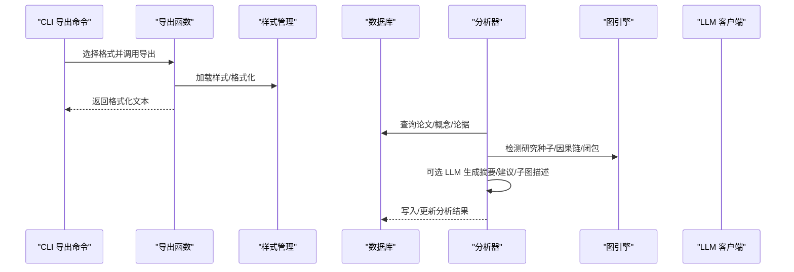
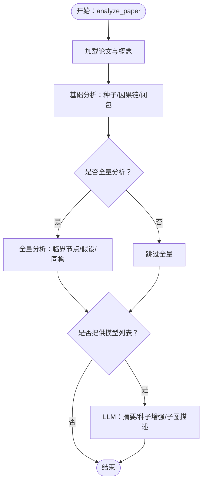
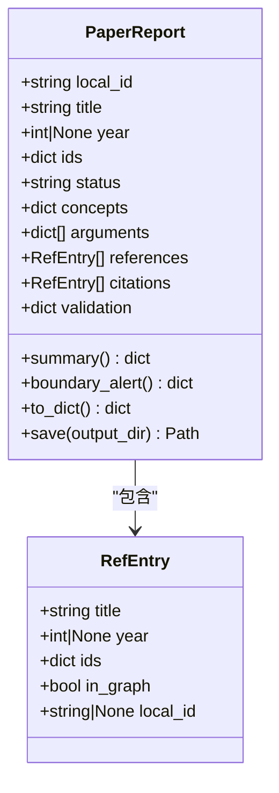
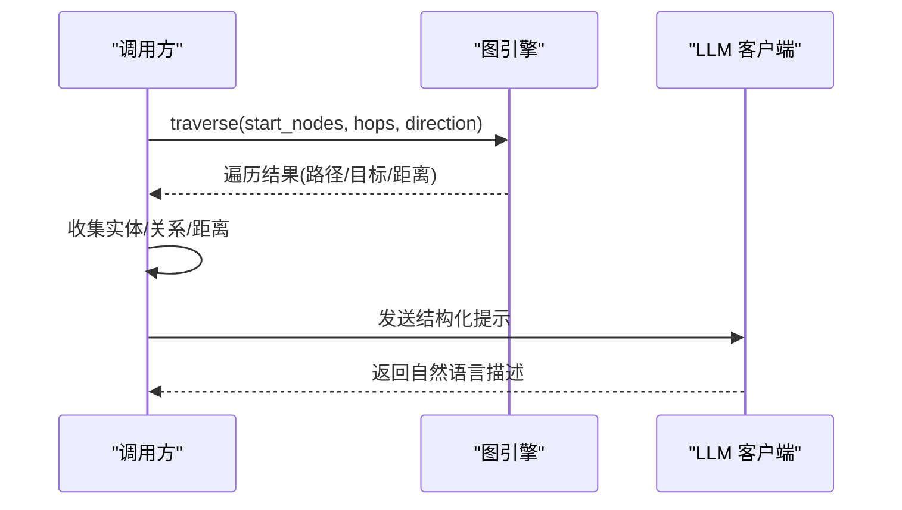
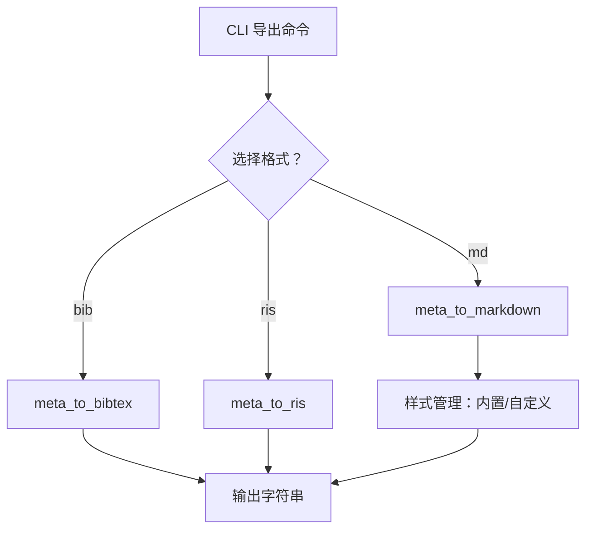
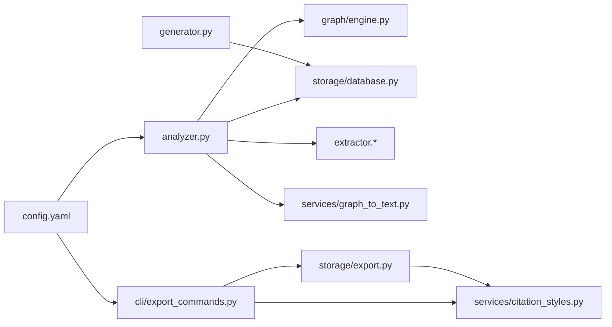

# 报告生成系统

<cite>
**本文引用的文件**
- [report/analyzer.py](file://src/drbrain/report/analyzer.py)
- [report/generator.py](file://src/drbrain/report/generator.py)
- [services/graph_to_text.py](file://src/drbrain/services/graph_to_text.py)
- [storage/export.py](file://src/drbrain/storage/export.py)
- [services/citation_styles.py](file://src/drbrain/services/citation_styles.py)
- [cli/export_commands.py](file://src/drbrain/cli/export_commands.py)
- [config.yaml](file://config.yaml)
- [test_report_generator.py](file://tests/test_report_generator.py)
- [test_analyzer.py](file://tests/test_analyzer.py)
</cite>

## 目录
1. [简介](#简介)
2. [项目结构](#项目结构)
3. [核心组件](#核心组件)
4. [架构总览](#架构总览)
5. [详细组件分析](#详细组件分析)
6. [依赖关系分析](#依赖关系分析)
7. [性能考量](#性能考量)
8. [故障排查指南](#故障排查指南)
9. [结论](#结论)
10. [附录：自定义报告模板开发指南](#附录自定义报告模板开发指南)

## 简介
本文件面向 DrBrain 的报告生成系统，聚焦两类报告：
- 单篇知识图谱分析报告：由分析器对单篇论文进行多维度推理，产出 JSON 结构化报告，并可选地通过 LLM 生成摘要与子图描述。
- 参考文献元数据导出：将论文元数据批量导出为 BibTeX、RIS、Markdown 格式，支持内置与自定义引用样式。

系统通过“分析器”“生成器”“服务层”“CLI 导出命令”“配置”等模块协同工作，既保证了分析能力的扩展性，也提供了灵活的输出格式与样式定制能力。

## 项目结构
围绕报告生成的核心目录与文件如下：
- 分析与生成
  - src/drbrain/report/analyzer.py：知识前沿分析与 LLM 辅助增强
  - src/drbrain/report/generator.py：单篇论文报告对象与 JSON 导出
  - src/drbrain/services/graph_to_text.py：基于图遍历的子图自然语言描述
- 导出与样式
  - src/drbrain/storage/export.py：BibTeX/RIS/Markdown 元数据导出
  - src/drbrain/services/citation_styles.py：引用样式管理与格式化
- CLI 集成
  - src/drbrain/cli/export_commands.py：导出命令入口（支持 bib/ris/md）
- 配置
  - config.yaml：LLM 模型、数据库路径、目录结构等全局配置

```mermaid
graph TB
subgraph "报告分析"
A["analyzer.py<br/>知识前沿分析与LLM增强"]
G["generator.py<br/>PaperReport/RefEntry/JSON导出"]
S["graph_to_text.py<br/>子图描述"]
end
subgraph "导出与样式"
E["export.py<br/>BibTeX/RIS/Markdown导出"]
CS["citation_styles.py<br/>样式管理与格式化"]
end
subgraph "CLI"
CLI["export_commands.py<br/>导出命令入口"]
end
subgraph "配置"
CFG["config.yaml<br/>模型/目录/参数"]
end
A --> G
A --> S
CLI --> E
E --> CS
CFG --> A
CFG --> CLI
```

图表来源
- [report/analyzer.py:1-231](file://src/drbrain/report/analyzer.py#L1-L231)
- [report/generator.py:1-110](file://src/drbrain/report/generator.py#L1-L110)
- [services/graph_to_text.py:1-145](file://src/drbrain/services/graph_to_text.py#L1-L145)
- [storage/export.py:1-180](file://src/drbrain/storage/export.py#L1-L180)
- [services/citation_styles.py:1-389](file://src/drbrain/services/citation_styles.py#L1-L389)
- [cli/export_commands.py:1-628](file://src/drbrain/cli/export_commands.py#L1-L628)
- [config.yaml:1-72](file://config.yaml#L1-L72)

章节来源
- [report/analyzer.py:1-231](file://src/drbrain/report/analyzer.py#L1-L231)
- [report/generator.py:1-110](file://src/drbrain/report/generator.py#L1-L110)
- [services/graph_to_text.py:1-145](file://src/drbrain/services/graph_to_text.py#L1-L145)
- [storage/export.py:1-180](file://src/drbrain/storage/export.py#L1-L180)
- [services/citation_styles.py:1-389](file://src/drbrain/services/citation_styles.py#L1-L389)
- [cli/export_commands.py:1-628](file://src/drbrain/cli/export_commands.py#L1-L628)
- [config.yaml:1-72](file://config.yaml#L1-L72)

## 核心组件
- 知识前沿分析器（analyze_paper）
  - 聚合研究种子、因果链、临界节点、假设、同构模式等多维洞察
  - 支持通过 LLM 生成“执行摘要”和“研究种子建议方向”
  - 可选生成“图子图摘要”，对高置信度概念的邻域进行自然语言描述
- 单篇报告生成器（PaperReport/RefEntry）
  - 封装论文元数据、概念、论据、参考文献与引文
  - 提供摘要统计与边界预警（覆盖率、缺失核心参考、验证失败）
  - 以 JSON 形式保存到 data/reports 目录
- 子图描述服务（describe_subgraph/describe_path）
  - 基于图引擎遍历中心实体的邻域，构建结构化提示词
  - 通过 LLM 生成简洁段落式描述
- 引用导出与样式（export_commands + export.py + citation_styles.py）
  - 导出 BibTeX、RIS、Markdown
  - 支持内置 APA/Vancouver/Chicago-AuthDate/MLA 与自定义样式文件
  - 自定义样式需提供 format_ref(meta, idx) 函数

章节来源
- [report/analyzer.py:9-134](file://src/drbrain/report/analyzer.py#L9-L134)
- [report/generator.py:21-105](file://src/drbrain/report/generator.py#L21-L105)
- [services/graph_to_text.py:70-145](file://src/drbrain/services/graph_to_text.py#L70-L145)
- [storage/export.py:68-179](file://src/drbrain/storage/export.py#L68-L179)
- [services/citation_styles.py:367-389](file://src/drbrain/services/citation_styles.py#L367-L389)

## 架构总览
下图展示从分析到导出的端到端流程，以及关键模块间的依赖关系。



图表来源
- [cli/export_commands.py:21-78](file://src/drbrain/cli/export_commands.py#L21-L78)
- [storage/export.py:170-179](file://src/drbrain/storage/export.py#L170-L179)
- [services/citation_styles.py:268-325](file://src/drbrain/services/citation_styles.py#L268-L325)
- [report/analyzer.py:9-134](file://src/drbrain/report/analyzer.py#L9-L134)

## 详细组件分析

### 组件A：知识前沿分析器（analyze_paper）
- 功能要点
  - 基础分析：研究种子、因果链、图闭包边数统计
  - 全量分析（full=True）：临界节点、假设、同构模式
  - LLM 增强：执行摘要、研究种子建议方向、图子图描述
- 数据流与处理逻辑
  - 读取论文与概念集合，构建基础报告结构
  - 调用提取器与图引擎获取种子、因果链、闭包
  - 若提供 models，则异步调用 LLM 客户端生成摘要与描述
- 关键接口
  - analyze_paper(db, graph, local_id, full=False, models=None)
  - add_cross_paper_insights(reports, db)
  - _generate_executive_summary(report, models)
  - _enhance_seeds(seeds, paper_title, models)



图表来源
- [report/analyzer.py:9-134](file://src/drbrain/report/analyzer.py#L9-L134)
- [report/analyzer.py:185-231](file://src/drbrain/report/analyzer.py#L185-L231)

章节来源
- [report/analyzer.py:9-134](file://src/drbrain/report/analyzer.py#L9-L134)
- [report/analyzer.py:185-231](file://src/drbrain/report/analyzer.py#L185-L231)
- [tests/test_analyzer.py:626-646](file://tests/test_analyzer.py#L626-L646)

### 组件B：单篇报告生成器（PaperReport/RefEntry）
- 数据结构
  - RefEntry：参考/引文条目（标题、年份、标识符、是否在图中、本地ID）
  - PaperReport：封装论文元数据、概念、论据、参考/引文、摘要统计、边界预警、校验结果
- 计算指标
  - 摘要统计：核心参考/引文在图内数量、总数、覆盖率
  - 边界预警：缺失核心参考、孤立子图、验证失败
- 输出
  - to_dict：序列化为字典
  - save：写入 data/reports/<local_id>.json



图表来源
- [report/generator.py:10-105](file://src/drbrain/report/generator.py#L10-L105)

章节来源
- [report/generator.py:21-105](file://src/drbrain/report/generator.py#L21-L105)
- [tests/test_report_generator.py:6-100](file://tests/test_report_generator.py#L6-L100)

### 组件C：子图描述服务（describe_subgraph/describe_path）
- 工作流程
  - 图遍历：以中心实体为中心，按指定深度双向遍历邻居
  - 结构化提示：收集实体、关系类型，构造 LLM 提示
  - LLM 生成：返回自然语言段落描述
- 关键函数
  - describe_path：将路径序列转为自然语言句子
  - describe_subgraph：主流程（遍历→提示→LLM）



图表来源
- [services/graph_to_text.py:70-145](file://src/drbrain/services/graph_to_text.py#L70-L145)

章节来源
- [services/graph_to_text.py:6-145](file://src/drbrain/services/graph_to_text.py#L6-L145)

### 组件D：导出与引用样式（export_commands + export.py + citation_styles.py）
- 导出命令
  - 支持格式：bib、ris、md；支持 --all 批量导出
  - 支持样式：Markdown 导出时可指定引用样式（如 apa、vancouver 等）
- 导出实现
  - meta_to_bibtex/meta_to_ris/meta_to_markdown：单项格式化
  - batch_export：批量聚合
- 引用样式
  - 内置样式：apa、vancouver、chicago-author-date、mla
  - 自定义样式：动态加载 styles_dir 下的 .py 文件，要求提供 format_ref(meta, idx)



图表来源
- [cli/export_commands.py:21-78](file://src/drbrain/cli/export_commands.py#L21-L78)
- [storage/export.py:68-179](file://src/drbrain/storage/export.py#L68-L179)
- [services/citation_styles.py:268-389](file://src/drbrain/services/citation_styles.py#L268-L389)

章节来源
- [cli/export_commands.py:21-78](file://src/drbrain/cli/export_commands.py#L21-L78)
- [storage/export.py:68-179](file://src/drbrain/storage/export.py#L68-L179)
- [services/citation_styles.py:234-389](file://src/drbrain/services/citation_styles.py#L234-L389)

## 依赖关系分析
- 模块耦合
  - analyzer.py 依赖 graph/engine、storage/database、extractor.*、services.graph_to_text
  - generator.py 与 analyzer.py 解耦，仅依赖存储查询结果
  - export_commands.py 依赖 storage.export 与 services.citation_styles
- 外部依赖
  - LLM 客户端（acall_text_with_fallback）来自 extractor.llm_client
  - 配置通过 config.yaml 注入（模型、目录、数据库路径）



图表来源
- [report/analyzer.py:5-6](file://src/drbrain/report/analyzer.py#L5-L6)
- [services/graph_to_text.py:95-95](file://src/drbrain/services/graph_to_text.py#L95-L95)
- [cli/export_commands.py:31-36](file://src/drbrain/cli/export_commands.py#L31-L36)
- [config.yaml:7-23](file://config.yaml#L7-L23)

章节来源
- [report/analyzer.py:5-6](file://src/drbrain/report/analyzer.py#L5-L6)
- [services/graph_to_text.py:95-95](file://src/drbrain/services/graph_to_text.py#L95-L95)
- [cli/export_commands.py:31-36](file://src/drbrain/cli/export_commands.py#L31-L36)
- [config.yaml:7-23](file://config.yaml#L7-L23)

## 性能考量
- 并行与并发
  - analyze_paper 在 full 模式下可能触发多个 LLM 调用，建议合理设置并发与令牌上限
  - extractor.confidence_propagation 与 queue 处理支持并发，避免阻塞
- 缓存与索引
  - 使用数据库缓存论文、概念、论据，减少重复查询
  - 引用样式文件动态加载，建议在启动时预热常用样式
- I/O 与磁盘
  - reports 目录默认 data/reports，注意磁盘空间与权限
  - 批量导出时建议分批处理，避免内存峰值

## 故障排查指南
- 导出命令
  - “未知格式”：确保 --format 为 bib/ris/md
  - “未找到论文”：确认 local_id 正确且数据库存在该论文
  - “请指定论文或使用 --all”：未提供参数时会报错
- 引用样式
  - “样式不存在”：检查 styles_dir 下是否存在对应 .py 文件，且包含 format_ref 函数
  - “路径穿越检测”：自定义样式名称仅允许字母、数字、连字符、下划线
- 报告生成
  - “覆盖率异常”：检查 references/citations 是否正确填充 in_graph 标记
  - “边界预警误判”：调整阈值或人工复核缺失核心参考情况
- LLM 相关
  - “LLM 后备回退”：若首选模型不可用，系统会尝试备用模型配置
  - “超时/限流”：适当降低并发或增加重试策略

章节来源
- [cli/export_commands.py:38-65](file://src/drbrain/cli/export_commands.py#L38-L65)
- [services/citation_styles.py:286-325](file://src/drbrain/services/citation_styles.py#L286-L325)
- [report/generator.py:52-62](file://src/drbrain/report/generator.py#L52-L62)

## 结论
DrBrain 的报告生成系统以“分析器 + 生成器 + 服务层 + 导出层”的分层架构实现了从知识图谱分析到多格式输出的完整闭环。分析器提供丰富的推理能力与 LLM 增强，生成器负责结构化与持久化，服务层提供子图描述与引用样式管理，CLI 则统一对外提供导出能力。通过配置文件集中管理模型与目录，系统具备良好的可扩展性与可维护性。

## 附录：自定义报告模板开发指南
说明：当前代码库未提供“模板语法、变量替换、条件渲染”的通用模板引擎。以下为基于现有能力的最佳实践建议，帮助你以现有模块为基础实现“类模板”的报告生成与样式定制。

- 报告结构与字段映射
  - 使用 PaperReport/RefEntry 的 to_dict 结果作为“数据源”
  - 在业务层根据字段组合生成“报告片段”，再拼接为最终输出
- 摘要与子图描述
  - 执行摘要：沿用 analyze_paper 中的 _generate_executive_summary 流程
  - 子图描述：沿用 services/graph_to_text 的 describe_subgraph，按需调整提示词与深度
- 引用样式定制
  - 在 data/citation_styles 下新增 <style>.py，实现 format_ref(meta, idx)
  - 通过 CLI 或导出函数选择样式名，实现不同学术领域的引用风格
- 输出格式扩展
  - 当前支持 BibTeX、RIS、Markdown；如需 PDF/HTML/Markdown，可在上层封装：
    - PDF：将 Markdown 文本交给外部工具（如 pandoc）转换
    - HTML：将结构化数据渲染为 HTML 片段，结合 CSS 实现布局
    - Markdown：沿用现有 meta_to_markdown 与样式系统
- 样式与布局
  - 引用样式：通过 citation_styles 管理
  - 页面布局：在上层渲染阶段添加标题、章节、页眉页脚等
- 最佳实践
  - 将“数据准备”“模板渲染”“样式应用”三步解耦，便于单元测试与演进
  - 对 LLM 调用设置超时与重试，避免阻塞
  - 对大体量导出采用分批与进度反馈，提升用户体验

章节来源
- [report/generator.py:64-98](file://src/drbrain/report/generator.py#L64-L98)
- [services/graph_to_text.py:117-144](file://src/drbrain/services/graph_to_text.py#L117-L144)
- [storage/export.py:152-179](file://src/drbrain/storage/export.py#L152-L179)
- [services/citation_styles.py:268-325](file://src/drbrain/services/citation_styles.py#L268-L325)
- [config.yaml:25-29](file://config.yaml#L25-L29)