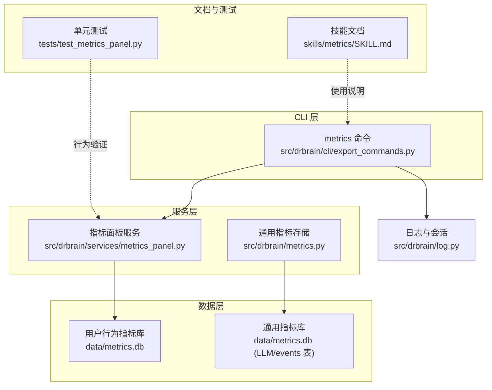
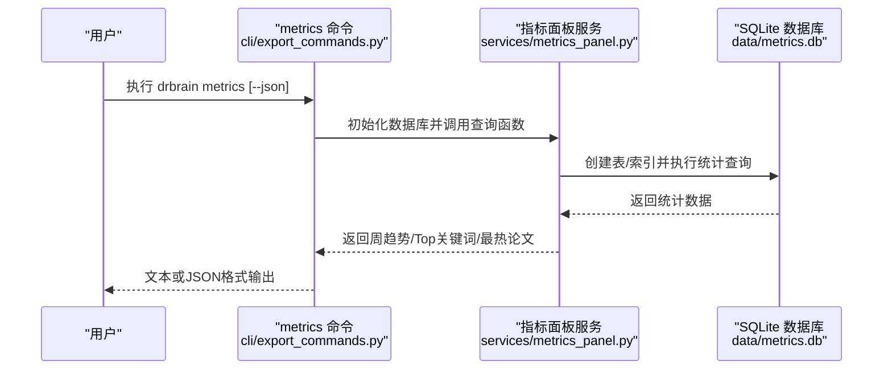
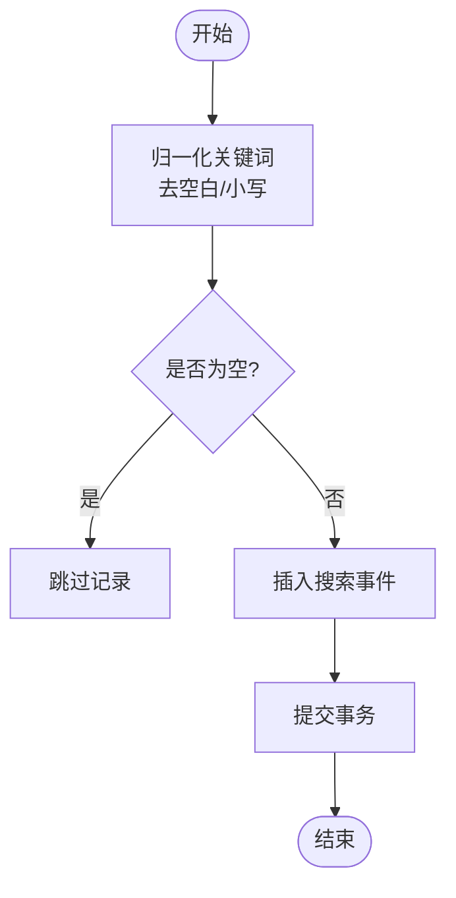
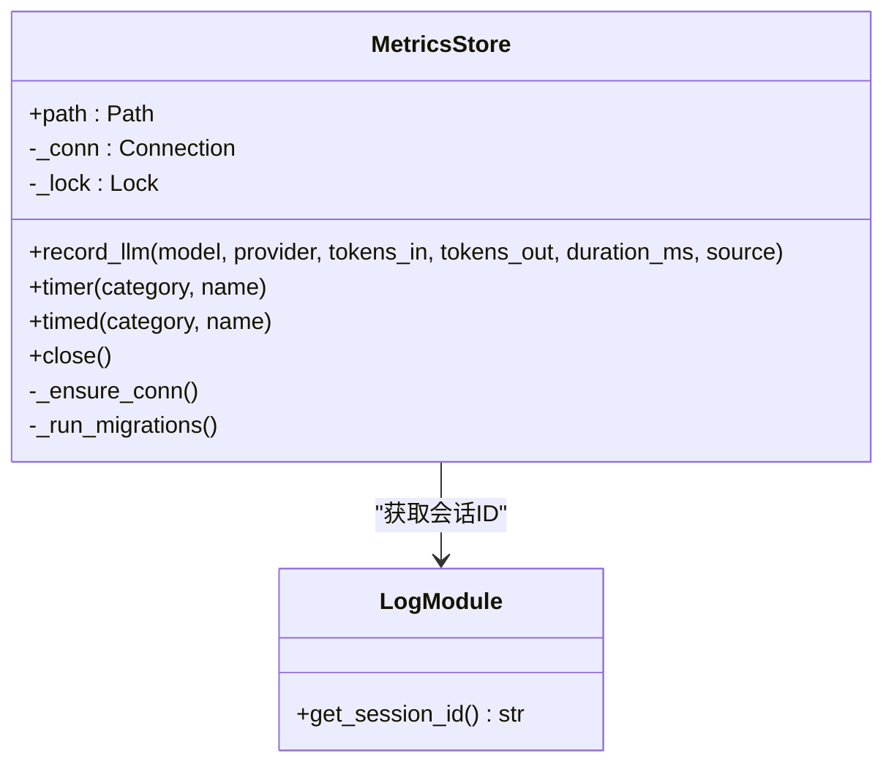
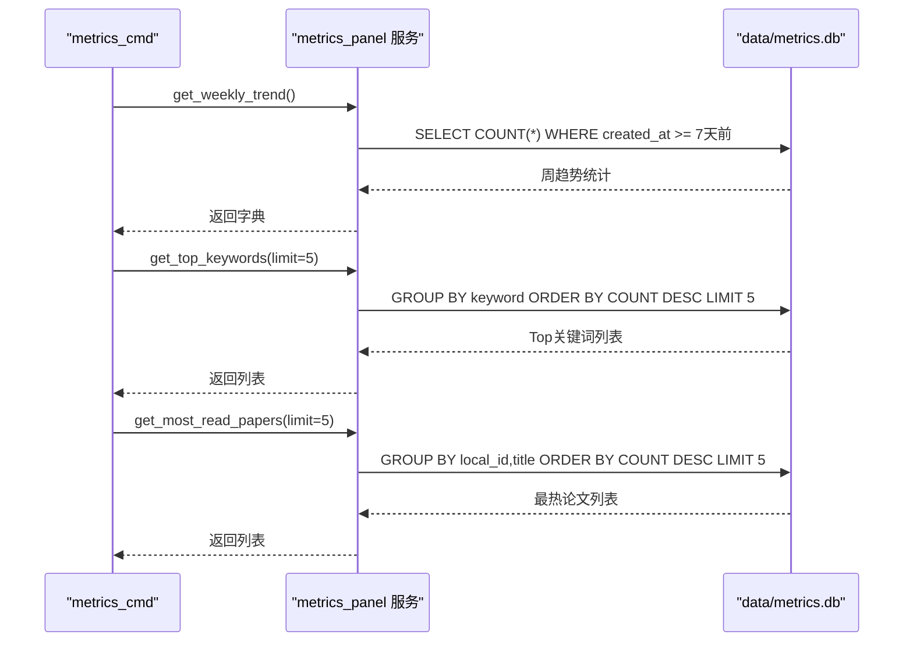
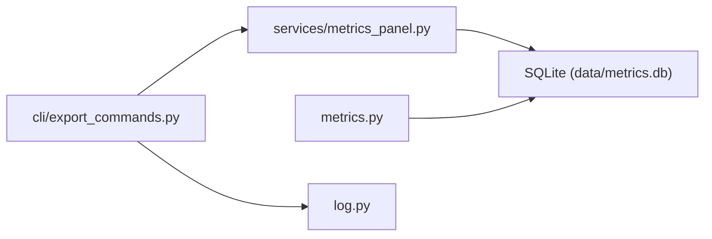

# 指标面板

<cite>
**本文引用的文件**
- [src/drbrain/services/metrics_panel.py](file://src/drbrain/services/metrics_panel.py)
- [src/drbrain/metrics.py](file://src/drbrain/metrics.py)
- [src/drbrain/cli/export_commands.py](file://src/drbrain/cli/export_commands.py)
- [skills/metrics/SKILL.md](file://skills/metrics/SKILL.md)
- [tests/test_metrics_panel.py](file://tests/test_metrics_panel.py)
- [src/drbrain/log.py](file://src/drbrain/log.py)
</cite>

## 目录
1. [简介](#简介)
2. [项目结构](#项目结构)
3. [核心组件](#核心组件)
4. [架构总览](#架构总览)
5. [详细组件分析](#详细组件分析)
6. [依赖关系分析](#依赖关系分析)
7. [性能考量](#性能考量)
8. [故障排查指南](#故障排查指南)
9. [结论](#结论)
10. [附录](#附录)

## 简介
本文件系统性阐述 DrBrain 指标面板（Metrics Panel）的功能与实现，覆盖用户行为指标的采集、计算与展示流程；解释统计指标的定义、计算方法与阈值建议；说明 CLI 配置选项、数据刷新机制与可视化输出；并提供最佳实践、异常检测方法以及扩展自定义指标与调整仪表板布局的指导。

指标面板专注于三类用户行为指标：
- 搜索事件：通过本地查询与联合搜索记录关键词
- 阅读事件：通过查看论文详情记录阅读行为
- 周趋势：过去七天的搜索/阅读总量与去重统计

这些指标存储在独立的 SQLite 数据库中，避免与主业务数据库耦合，便于长期留存与分析。

## 项目结构
指标面板相关代码分布于以下模块：
- 服务层：用户行为指标的采集与查询接口
- CLI 层：对外暴露的 metrics 命令与输出格式控制
- 技能文档：指标面板的使用说明与 CLI 参考
- 单元测试：对指标采集与查询的验证
- 日志会话：用于关联指标与当前会话上下文

**图表来源**
- [src/drbrain/cli/export_commands.py:575-628](file://src/drbrain/cli/export_commands.py#L575-L628)
- [src/drbrain/services/metrics_panel.py:1-139](file://src/drbrain/services/metrics_panel.py#L1-L139)
- [src/drbrain/metrics.py:1-203](file://src/drbrain/metrics.py#L1-L203)
- [skills/metrics/SKILL.md:1-42](file://skills/metrics/SKILL.md#L1-L42)
- [tests/test_metrics_panel.py:1-99](file://tests/test_metrics_panel.py#L1-L99)
- [src/drbrain/log.py:1-68](file://src/drbrain/log.py#L1-L68)

**章节来源**
- [src/drbrain/cli/export_commands.py:575-628](file://src/drbrain/cli/export_commands.py#L575-L628)
- [src/drbrain/services/metrics_panel.py:1-139](file://src/drbrain/services/metrics_panel.py#L1-L139)
- [src/drbrain/metrics.py:1-203](file://src/drbrain/metrics.py#L1-L203)
- [skills/metrics/SKILL.md:1-42](file://skills/metrics/SKILL.md#L1-L42)
- [tests/test_metrics_panel.py:1-99](file://tests/test_metrics_panel.py#L1-L99)
- [src/drbrain/log.py:1-68](file://src/drbrain/log.py#L1-L68)

## 核心组件
- 用户行为指标服务
  - 负责创建与维护用户行为指标表（搜索事件、阅读事件）
  - 提供搜索关键词归一化、Top 关键词统计、最热论文统计、周趋势统计等查询接口
- 通用指标存储
  - 提供线程安全的 SQLite 封装，支持 LLM 调用与通用事件记录
  - 支持基于会话 ID 的事件关联与迁移管理
- CLI 指标命令
  - 对外暴露 metrics 子命令，支持文本与 JSON 输出
  - 调用服务层接口生成周趋势、Top 关键词、最热论文等结果
- 技能文档与测试
  - 文档说明指标内容与 CLI 使用方式
  - 测试覆盖指标表创建、事件记录、关键词归一化、空指标处理与周趋势统计

**章节来源**
- [src/drbrain/services/metrics_panel.py:13-139](file://src/drbrain/services/metrics_panel.py#L13-L139)
- [src/drbrain/metrics.py:49-203](file://src/drbrain/metrics.py#L49-L203)
- [src/drbrain/cli/export_commands.py:575-628](file://src/drbrain/cli/export_commands.py#L575-L628)
- [skills/metrics/SKILL.md:17-42](file://skills/metrics/SKILL.md#L17-L42)
- [tests/test_metrics_panel.py:9-99](file://tests/test_metrics_panel.py#L9-L99)

## 架构总览
指标面板采用“服务层 + CLI 层 + 独立 SQLite 数据库”的分层设计，确保：
- 数据隔离：用户行为指标库与主业务库分离
- 接口清晰：服务层提供稳定的查询与写入接口
- 输出灵活：CLI 支持文本与 JSON 两种输出格式
- 可扩展：通用指标存储可承载更多系统级指标

**图表来源**
- [src/drbrain/cli/export_commands.py:575-628](file://src/drbrain/cli/export_commands.py#L575-L628)
- [src/drbrain/services/metrics_panel.py:13-139](file://src/drbrain/services/metrics_panel.py#L13-L139)

## 详细组件分析

### 用户行为指标服务
- 数据模型
  - 搜索事件表：包含关键字与时间戳
  - 阅读事件表：包含论文标识、标题与时间戳
  - 索引：按关键字与论文标识建立索引以优化查询
- 关键能力
  - 记录搜索事件：对输入进行归一化（去除多余空白、转小写），空值直接忽略
  - 记录阅读事件：记录论文标识与标题
  - 统计 Top 关键词：按出现次数降序取前 N
  - 统计最热论文：按论文标识与标题分组统计阅读次数
  - 周趋势统计：统计最近七天的搜索/阅读总量与去重数量
- 复杂度与性能
  - 写入：O(1)，依赖 SQLite 追加写入与事务提交
  - 查询：Top 关键词与最热论文为 O(n log n)（SQL GROUP BY + ORDER BY），受数据量影响
  - 建议：定期清理历史数据或限制保留周期，避免表膨胀

**图表来源**
- [src/drbrain/services/metrics_panel.py:42-54](file://src/drbrain/services/metrics_panel.py#L42-L54)

**章节来源**
- [src/drbrain/services/metrics_panel.py:13-139](file://src/drbrain/services/metrics_panel.py#L13-L139)

### 通用指标存储（MetricsStore）
- 设计要点
  - 线程安全：内部使用锁保护连接与写入
  - WAL 模式：提升并发写入性能与可靠性
  - 模块级单例：延迟初始化与复用连接
  - 迁移管理：自动尝试新增列，兼容版本演进
- 支持指标类型
  - LLM 调用：模型、提供商、输入/输出 token 数、耗时、来源
  - 通用事件：分类、名称、持续时间、状态、token 统计、模型、详情
- 会话关联
  - 通过日志模块提供的会话 ID 关联同一进程生命周期内的事件
- 使用方式
  - 上下文管理器计时：自动记录耗时与状态
  - 装饰器计时：对函数调用进行透明计时

**图表来源**
- [src/drbrain/metrics.py:49-203](file://src/drbrain/metrics.py#L49-L203)
- [src/drbrain/log.py:18-23](file://src/drbrain/log.py#L18-L23)

**章节来源**
- [src/drbrain/metrics.py:49-203](file://src/drbrain/metrics.py#L49-L203)
- [src/drbrain/log.py:18-23](file://src/drbrain/log.py#L18-L23)

### CLI 指标命令
- 功能
  - 加载指标数据库并查询周趋势、Top 关键词、最热论文
  - 支持文本输出与 JSON 输出
- 输出字段
  - 周趋势：总搜索数、总阅读数、唯一关键词数、唯一阅读论文数
  - Top 关键词：关键词与出现次数
  - 最热论文：论文标识、标题与阅读次数
- 刷新机制
  - 每次执行命令时实时查询数据库，无需额外刷新逻辑

**图表来源**
- [src/drbrain/cli/export_commands.py:575-628](file://src/drbrain/cli/export_commands.py#L575-L628)
- [src/drbrain/services/metrics_panel.py:69-139](file://src/drbrain/services/metrics_panel.py#L69-L139)

**章节来源**
- [src/drbrain/cli/export_commands.py:575-628](file://src/drbrain/cli/export_commands.py#L575-L628)

### 指标定义、计算与阈值建议
- 指标定义
  - 总搜索数：过去七天内搜索事件总数
  - 总阅读数：过去七天内阅读事件总数
  - 唯一关键词数：过去七天内不同关键词的数量（已归一化）
  - 唯一阅读论文数：过去七天内不同论文的阅读数量
  - Top 关键词：按出现次数排序的前 N 个关键词
  - 最热论文：按阅读次数排序的前 N 篇论文
- 计算方法
  - 使用 SQL 的 COUNT 与 COUNT(DISTINCT) 实现聚合
  - 使用 GROUP BY 与 ORDER BY 实现分组与排序
- 阈值建议（示例）
  - 周活跃度：若总搜索数/阅读数连续两周下降超过 30%，触发关注
  - 关键词集中度：Top 1 占比过高可能代表检索策略单一，建议阈值 50%
  - 新增关键词：若新增关键词数低于基准值，提示检索策略优化
  - 异常波动：若某日搜索/阅读数超过均值 3 倍标准差，标记为异常

**章节来源**
- [src/drbrain/services/metrics_panel.py:69-139](file://src/drbrain/services/metrics_panel.py#L69-L139)

### 配置选项与数据刷新
- 配置项
  - 指标数据库路径：默认 data/metrics.db（独立于主数据库）
  - CLI 输出：--json 控制输出格式
- 刷新机制
  - 实时查询：每次执行 metrics 命令时从数据库读取最新数据
  - 无后台任务：不包含定时刷新或缓存层
- 可视化图表
  - 文本输出：表格化展示周趋势、Top 关键词与最热论文
  - JSON 输出：便于外部工具集成与二次可视化

**章节来源**
- [src/drbrain/cli/export_commands.py:575-628](file://src/drbrain/cli/export_commands.py#L575-L628)
- [skills/metrics/SKILL.md:17-42](file://skills/metrics/SKILL.md#L17-L42)

### 自定义指标添加与仪表板布局调整
- 添加自定义指标
  - 在服务层新增统计查询函数，并在 CLI 中调用
  - 若需要持久化，可在独立指标库中新增表或列
  - 使用通用指标存储记录系统级事件，便于统一分析
- 仪表板布局调整
  - 文本输出：通过 CLI 输出顺序与分段标题控制展示顺序
  - JSON 输出：在 CLI 中组合字段，便于前端或外部工具自定义渲染
  - 建议：为关键指标设置阈值与颜色编码，增强可读性

**章节来源**
- [src/drbrain/services/metrics_panel.py:13-139](file://src/drbrain/services/metrics_panel.py#L13-L139)
- [src/drbrain/cli/export_commands.py:575-628](file://src/drbrain/cli/export_commands.py#L575-L628)
- [src/drbrain/metrics.py:49-203](file://src/drbrain/metrics.py#L49-L203)

## 依赖关系分析
- 组件耦合
  - CLI 仅依赖服务层接口，耦合度低，便于替换实现
  - 服务层依赖 SQLite 与时间工具，无循环依赖
  - 通用指标存储与日志模块弱耦合（仅会话 ID 获取）
- 外部依赖
  - SQLite：轻量可靠，适合指标数据的短期到中期留存
  - Typer：命令行解析与输出
  - Rich：文本表格渲染（在其他命令中使用）

**图表来源**
- [src/drbrain/cli/export_commands.py:575-628](file://src/drbrain/cli/export_commands.py#L575-L628)
- [src/drbrain/services/metrics_panel.py:1-139](file://src/drbrain/services/metrics_panel.py#L1-L139)
- [src/drbrain/metrics.py:1-203](file://src/drbrain/metrics.py#L1-L203)
- [src/drbrain/log.py:1-68](file://src/drbrain/log.py#L1-L68)

**章节来源**
- [src/drbrain/cli/export_commands.py:575-628](file://src/drbrain/cli/export_commands.py#L575-L628)
- [src/drbrain/services/metrics_panel.py:1-139](file://src/drbrain/services/metrics_panel.py#L1-L139)
- [src/drbrain/metrics.py:1-203](file://src/drbrain/metrics.py#L1-L203)
- [src/drbrain/log.py:1-68](file://src/drbrain/log.py#L1-L68)

## 性能考量
- 写入性能
  - SQLite 默认模式下写入较慢；建议在高并发场景评估 WAL 模式与合适的事务批量策略
- 查询性能
  - 为高频查询字段建立索引（已对关键字与论文标识建立索引）
  - 合理设置 Top N 限制，避免大结果集排序开销
- 数据保留
  - 定期清理历史数据或按时间分区，防止表膨胀导致查询变慢
- 并发与一致性
  - 通用指标存储使用锁保证线程安全；建议在 CLI 层避免长时间持有锁

[本节为通用性能建议，不直接分析具体文件]

## 故障排查指南
- 指标未显示
  - 确认已执行过搜索与阅读操作，数据库中存在记录
  - 检查指标数据库路径与权限
- 关键词重复统计
  - 归一化逻辑会去除多余空白并转小写，确保相同语义的不同大小写与空格不会被拆分
- 查询结果为空
  - 检查时间范围是否正确（周趋势统计以 UTC 时间计算）
- CLI 输出异常
  - 使用 --json 查看原始数据结构，定位渲染问题

**章节来源**
- [tests/test_metrics_panel.py:19-99](file://tests/test_metrics_panel.py#L19-L99)
- [src/drbrain/services/metrics_panel.py:42-54](file://src/drbrain/services/metrics_panel.py#L42-L54)
- [src/drbrain/services/metrics_panel.py:101-139](file://src/drbrain/services/metrics_panel.py#L101-L139)

## 结论
DrBrain 指标面板通过轻量的 SQLite 存储与清晰的服务接口，实现了用户行为指标的采集、统计与展示。其设计具备良好的可扩展性与可维护性，既满足日常使用，也为后续接入更多系统级指标与可视化工具提供了基础。

## 附录
- CLI 快速参考
  - drbrain metrics：展示文本版仪表板
  - drbrain metrics --json：输出 JSON 格式数据
- 相关文档
  - 技能文档：包含指标内容与 CLI 使用说明

**章节来源**
- [skills/metrics/SKILL.md:17-42](file://skills/metrics/SKILL.md#L17-L42)