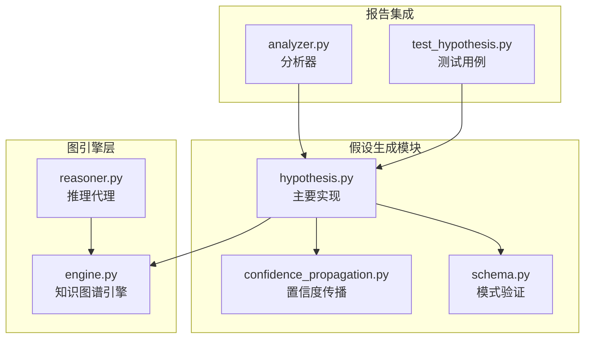
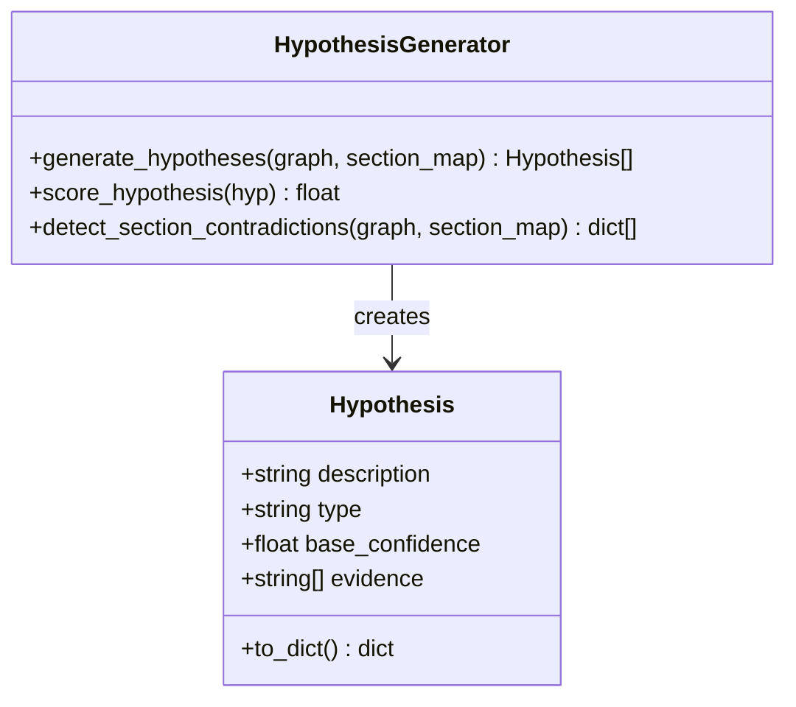
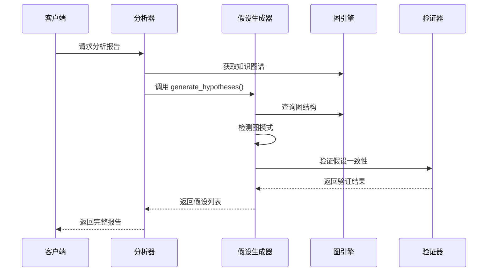
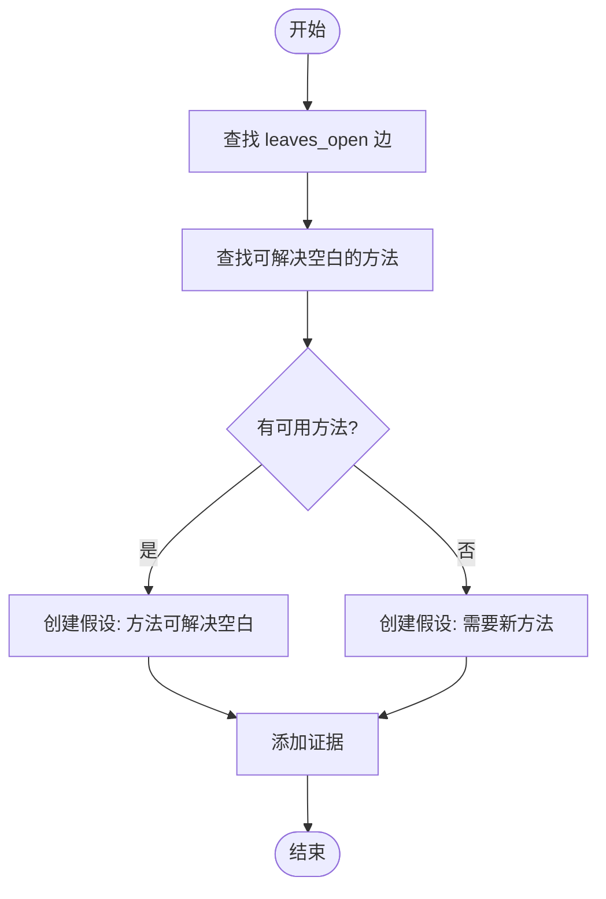
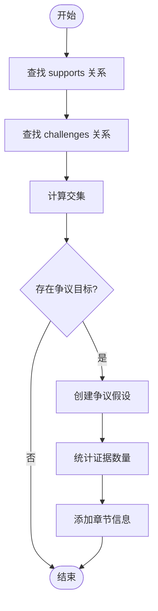
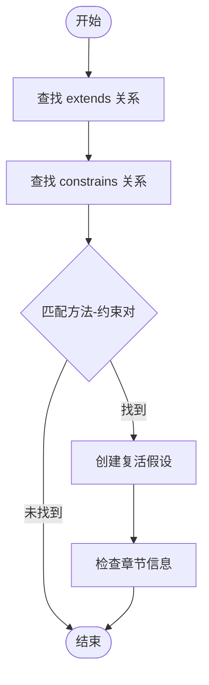
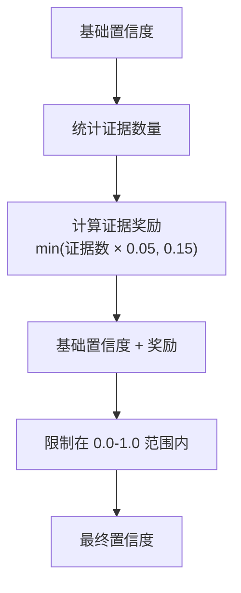
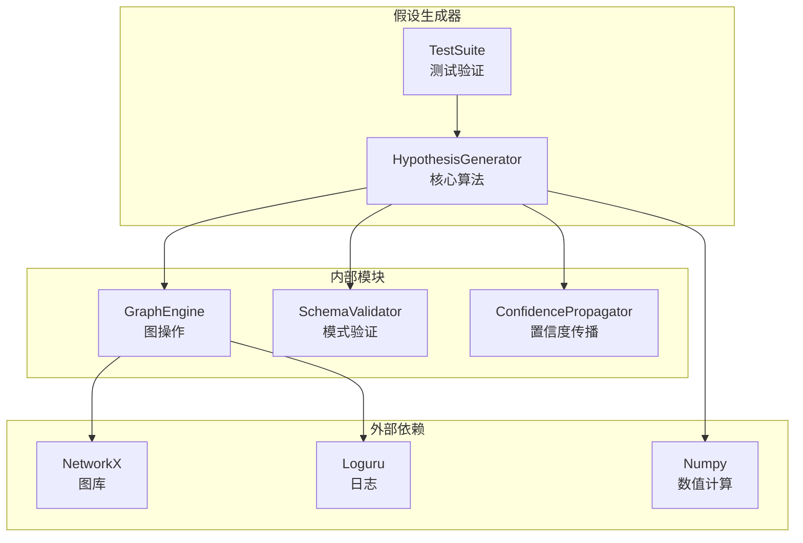

# 假设生成

<cite>
**本文档引用的文件**
- [hypothesis.py](file://src/drbrain/extractor/hypothesis.py)
- [analyzer.py](file://src/drbrain/report/analyzer.py)
- [engine.py](file://src/drbrain/graph/engine.py)
- [reasoner.py](file://src/drbrain/extractor/reasoner.py)
- [confidence_propagation.py](file://src/drbrain/extractor/confidence_propagation.py)
- [schema.py](file://src/drbrain/validator/schema.py)
- [test_hypothesis.py](file://tests/test_hypothesis.py)
</cite>

## 目录
1. [简介](#简介)
2. [项目结构](#项目结构)
3. [核心组件](#核心组件)
4. [架构概览](#架构概览)
5. [详细组件分析](#详细组件分析)
6. [依赖关系分析](#依赖关系分析)
7. [性能考虑](#性能考虑)
8. [故障排除指南](#故障排除指南)
9. [结论](#结论)

## 简介

DrBrain 的假设生成功能是一个基于知识图谱的智能推理系统，旨在从学术论文和研究数据中自动发现新的研究机会和假设。该功能通过分析知识图谱中的结构模式，识别研究空白、争议领域和技术瓶颈，并生成具有置信度评分的研究假设。

假设生成功能的核心价值在于：
- **自动化研究机会发现**：自动识别未解决的研究问题和方法空白
- **跨领域知识转移**：促进不同研究领域间的方法论迁移
- **争议焦点识别**：帮助研究人员快速定位活跃的学术争议
- **技术演进洞察**：揭示研究方法的发展轨迹和停滞点

## 项目结构

假设生成功能在 DrBrain 项目中的组织结构如下：



**图表来源**
- [hypothesis.py:1-198](file://src/drbrain/extractor/hypothesis.py#L1-L198)
- [engine.py:1-800](file://src/drbrain/graph/engine.py#L1-L800)

**章节来源**
- [hypothesis.py:1-198](file://src/drbrain/extractor/hypothesis.py#L1-L198)
- [engine.py:1-800](file://src/drbrain/graph/engine.py#L1-L800)

## 核心组件

### Hypothesis 数据类

假设生成功能的核心是 `Hypothesis` 数据类，它定义了假设的基本结构：



**图表来源**
- [hypothesis.py:18-35](file://src/drbrain/extractor/hypothesis.py#L18-L35)

### 置信度计算机制

假设的置信度由基础置信度和证据增强两部分组成：

- **基础置信度**：根据假设类型预先设定的初始置信度
- **证据增强**：每条证据增加 0.05，最多不超过 0.15 的总提升

**章节来源**
- [hypothesis.py:37-43](file://src/drbrain/extractor/hypothesis.py#L37-L43)

## 架构概览

假设生成功能采用分层架构设计，确保模块间的清晰分离和高内聚性：



**图表来源**
- [analyzer.py:78-85](file://src/drbrain/report/analyzer.py#L78-L85)
- [hypothesis.py:82-197](file://src/drbrain/extractor/hypothesis.py#L82-L197)

## 详细组件分析

### 假设生成算法

假设生成算法基于四种核心图模式进行工作：

#### 1. 未解决空白模式 (Unaddressed Gap)

当检测到研究空白但没有相应的方法来解决时，生成 "方法可能解决空白" 类型的假设：



**图表来源**
- [hypothesis.py:105-146](file://src/drbrain/extractor/hypothesis.py#L105-L146)

#### 2. 争议区域模式 (Debate Zone)

当同一结论同时受到支持和挑战时，生成 "需要解决" 类型的假设：



**图表来源**
- [hypothesis.py:148-171](file://src/drbrain/extractor/hypothesis.py#L148-L171)

#### 3. 技术悬崖模式 (Technology Cliff)

当研究方法因约束而停滞时，生成 "可复活" 类型的假设：



**图表来源**
- [hypothesis.py:173-196](file://src/drbrain/extractor/hypothesis.py#L173-L196)

### 假设类型分类体系

假设生成器支持以下假设类型：

| 假设类型 | 描述 | 基础置信度 | 示例场景 |
|---------|------|-----------|----------|
| `gap_filling` | 未解决空白的填补建议 | 0.4-0.5 | "方法 M 可能解决空白 G" |
| `debate_resolution` | 争议领域的解决方案 | 0.6 | "需要解决结论 C 的冲突证据" |
| `technology_revival` | 技术方法的复活建议 | 0.4 | "在新条件下可复活方法 M" |

**章节来源**
- [hypothesis.py:105-196](file://src/drbrain/extractor/hypothesis.py#L105-L196)

### 置信度计算方法

置信度计算采用线性增强模型：



**图表来源**
- [hypothesis.py:37-43](file://src/drbrain/extractor/hypothesis.py#L37-L43)

**章节来源**
- [hypothesis.py:37-43](file://src/drbrain/extractor/hypothesis.py#L37-L43)

### 章节感知机制

假设生成器支持章节感知功能，通过 `section_map` 参数提供证据来源的上下文信息：

- **章节映射**：将节点标签映射到论文章节标题
- **证据增强**：在证据字符串中包含章节信息
- **置信度衰减**：不同章节的证据具有不同的可信度权重

**章节来源**
- [hypothesis.py:96-98](file://src/drbrain/extractor/hypothesis.py#L96-L98)
- [confidence_propagation.py:14-28](file://src/drbrain/extractor/confidence_propagation.py#L14-L28)

## 依赖关系分析

假设生成功能的依赖关系体现了清晰的分层设计：



**图表来源**
- [hypothesis.py:10-15](file://src/drbrain/extractor/hypothesis.py#L10-L15)
- [engine.py:5-13](file://src/drbrain/graph/engine.py#L5-L13)

### 核心依赖关系

1. **图引擎依赖**：假设生成器完全依赖于 `GraphEngine` 提供的图操作能力
2. **验证器集成**：通过 `SchemaValidator` 确保生成的假设符合本体约束
3. **置信度传播**：利用 `ConfidencePropagator` 实现章节感知的置信度衰减

**章节来源**
- [hypothesis.py:15](file://src/drbrain/extractor/hypothesis.py#L15)
- [engine.py:12](file://src/drbrain/graph/engine.py#L12)

## 性能考虑

### 时间复杂度分析

假设生成算法的时间复杂度主要取决于图的规模：

- **模式扫描**：O(E) - 其中 E 是边的数量
- **关系索引构建**：O(E) - 单次遍历图构建关系映射
- **假设生成**：O(E) - 对每个关系类型进行线性扫描

### 空间复杂度优化

- **关系索引**：使用字典存储关系映射，避免重复查询
- **证据收集**：限制每个假设的证据数量（最多 3 个）
- **内存管理**：及时释放中间结果和临时数据结构

### 扩展性考虑

- **增量处理**：支持基于种子节点的增量闭包计算
- **并行化**：不同假设类型的生成可以并行执行
- **缓存机制**：重复查询的结果可以缓存以提高性能

## 故障排除指南

### 常见问题诊断

1. **空图返回空假设**
   - 检查图是否正确加载
   - 验证关系类型是否正确设置

2. **置信度异常**
   - 确认基础置信度值范围 (0.0-1.0)
   - 检查证据数量是否合理

3. **章节信息缺失**
   - 验证 `section_map` 参数格式
   - 检查节点标签与章节映射的一致性

### 调试技巧

```python
# 启用详细日志
import logging
logging.basicConfig(level=logging.DEBUG)

# 验证图结构
print(f"节点数量: {graph.graph.number_of_nodes()}")
print(f"边数量: {graph.graph.number_of_edges()}")

# 检查关系分布
for rel_type, edges in edges_by_rel.items():
    print(f"{rel_type}: {len(edges)} 条边")
```

**章节来源**
- [test_hypothesis.py:44-47](file://tests/test_hypothesis.py#L44-L47)

## 结论

DrBrain 的假设生成功能通过精心设计的图模式识别算法，为学术研究提供了强大的自动化推理能力。该系统的主要优势包括：

1. **多维度模式识别**：能够同时识别空白填补、争议解决、技术复活等多种研究机会
2. **置信度量化**：提供可解释的置信度评分，帮助研究人员评估假设质量
3. **章节感知**：结合论文结构信息，提供更精确的证据来源标注
4. **模块化设计**：清晰的架构分离便于维护和扩展

该功能在推动知识前沿发展中发挥着重要作用，不仅能够加速科学发现过程，还能帮助研究人员发现跨领域的创新机会，从而促进学科交叉和突破性进展。