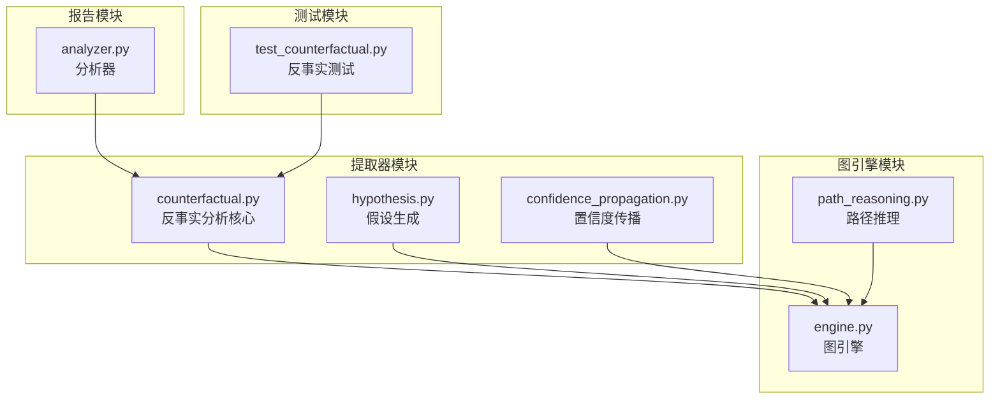
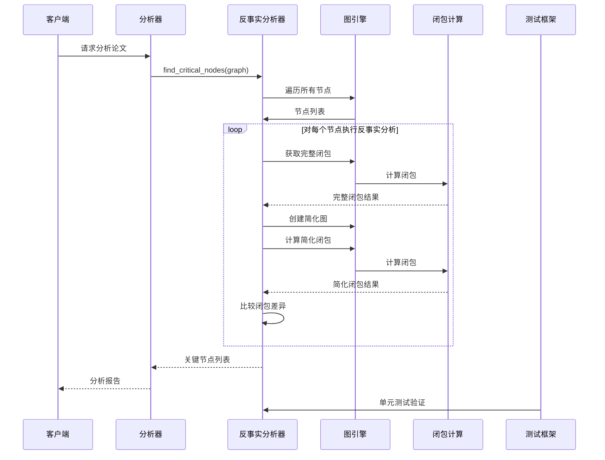
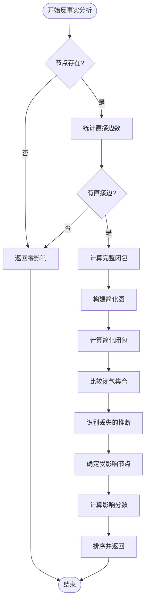
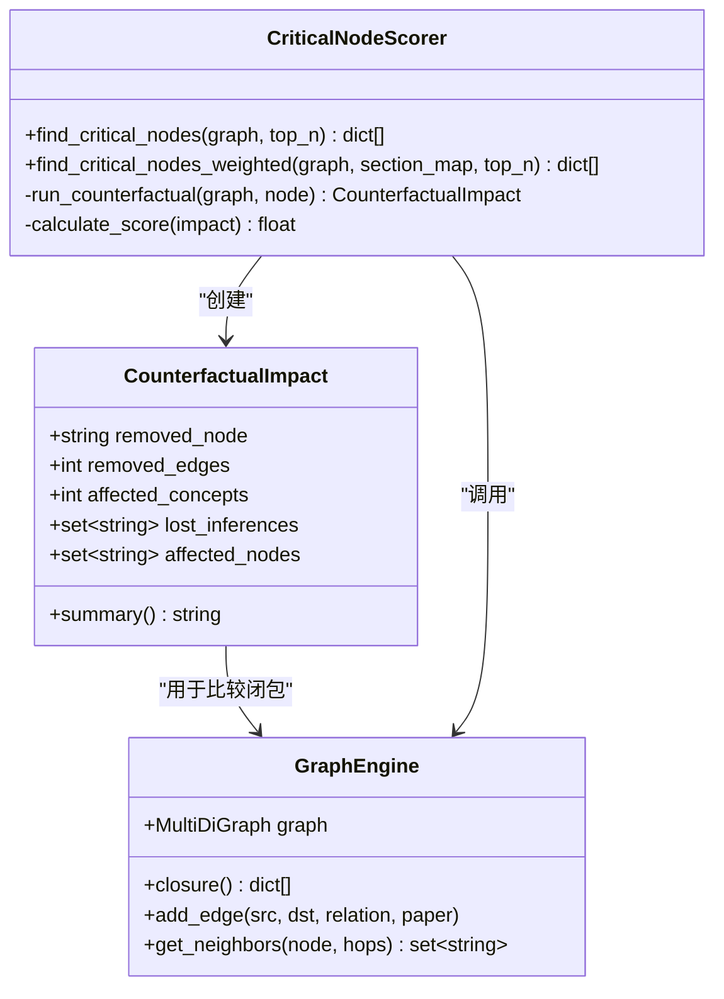
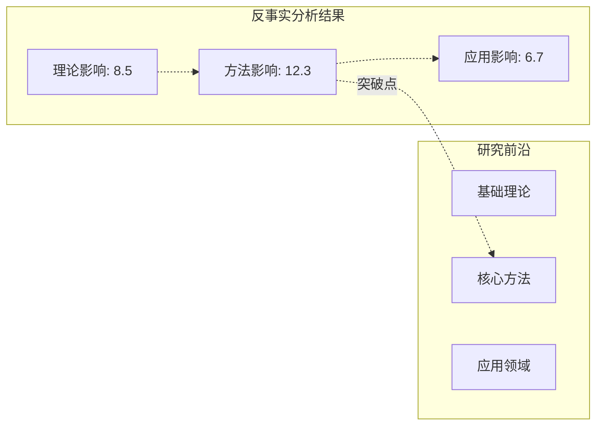
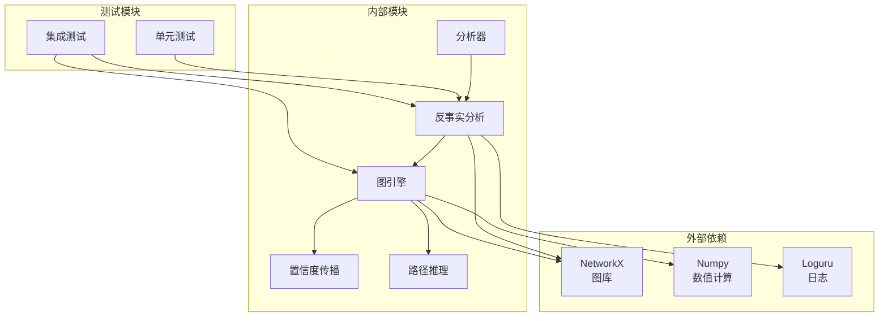

# 反事实分析

<cite>
**本文档引用的文件**
- [counterfactual.py](file://src/drbrain/extractor/counterfactual.py)
- [hypothesis.py](file://src/drbrain/extractor/hypothesis.py)
- [engine.py](file://src/drbrain/graph/engine.py)
- [analyzer.py](file://src/drbrain/report/analyzer.py)
- [test_counterfactual.py](file://tests/test_counterfactual.py)
- [confidence_propagation.py](file://src/drbrain/extractor/confidence_propagation.py)
- [path_reasoning.py](file://src/drbrain/graph/path_reasoning.py)
</cite>

## 目录
1. [简介](#简介)
2. [项目结构](#项目结构)
3. [核心组件](#核心组件)
4. [架构概览](#架构概览)
5. [详细组件分析](#详细组件分析)
6. [依赖关系分析](#依赖关系分析)
7. [性能考虑](#性能考虑)
8. [故障排除指南](#故障排除指南)
9. [结论](#结论)

## 简介

反事实分析是 DrBrain 知识图谱推理系统中的一个关键功能模块，用于评估知识图谱中概念节点的重要性及其对整体研究前沿的影响。该功能基于"如果某个概念不存在会怎样"的假设情景，通过模拟移除特定节点来量化其对知识图谱连通性和推断关系的影响。

反事实分析的核心价值在于：
- **研究脆弱性评估**：识别知识图谱中最关键的概念节点
- **突破点识别**：发现可能成为研究瓶颈或阻碍的关键节点
- **假设情景构建**：为研究策略制定提供数据驱动的决策支持
- **影响评估**：量化单个概念对整个研究领域的影响力

## 项目结构

反事实分析功能在 DrBrain 项目中的组织结构如下：



**图表来源**
- [counterfactual.py:1-144](file://src/drbrain/extractor/counterfactual.py#L1-L144)
- [engine.py:1-800](file://src/drbrain/graph/engine.py#L1-L800)
- [analyzer.py:1-231](file://src/drbrain/report/analyzer.py#L1-L231)

**章节来源**
- [counterfactual.py:1-144](file://src/drbrain/extractor/counterfactual.py#L1-L144)
- [engine.py:1-800](file://src/drbrain/graph/engine.py#L1-L800)

## 核心组件

反事实分析系统由以下核心组件构成：

### CounterfactualImpact 数据类
负责存储单个节点移除后的分析结果，包含：
- `removed_node`: 被移除的节点标识
- `removed_edges`: 直接移除的边数
- `affected_concepts`: 受影响的概念数量
- `lost_inferences`: 丢失的推断关系集合
- `affected_nodes`: 受影响的节点集合

### find_critical_nodes 函数
主入口函数，用于识别知识图谱中的关键节点：
- 接受 GraphEngine 实例和可选的 top_n 参数
- 对每个节点运行反事实分析
- 基于影响分数进行排序
- 返回前 n 个最关键的节点

### find_critical_nodes_weighted 函数
加权版本的关节点识别，考虑节点所在章节的可信度：
- 使用预定义的章节权重表
- Methods 和 Results 等实证章节的节点获得更高权重
- Introduction 和 Related Work 等推测性章节的节点权重较低

**章节来源**
- [counterfactual.py:16-96](file://src/drbrain/extractor/counterfactual.py#L16-L96)
- [counterfactual.py:81-144](file://src/drbrain/extractor/counterfactual.py#L81-L144)

## 架构概览

反事实分析的系统架构采用分层设计，确保模块间的清晰分离和高内聚低耦合：



**图表来源**
- [analyzer.py:70-76](file://src/drbrain/report/analyzer.py#L70-L76)
- [counterfactual.py:35-78](file://src/drbrain/extractor/counterfactual.py#L35-L78)
- [engine.py:124-315](file://src/drbrain/graph/engine.py#L124-L315)

## 详细组件分析

### 反事实分析算法实现

反事实分析的核心算法基于"比较完整图与移除节点后的图"的方法论：

#### 算法步骤流程图



**图表来源**
- [counterfactual.py:35-78](file://src/drbrain/extractor/counterfactual.py#L35-L78)

#### 影响评分机制

关键节点的评分采用多维度综合评估：

| 维度 | 计算方式 | 权重 |
|------|----------|------|
| 直接移除的边数 | `impact.removed_edges` | 1.0 |
| 受影响的概念数量 | `impact.affected_concepts` | 1.0 |
| 丢失的推断关系数 | `len(impact.lost_inferences)` | 1.0 |
| **总分** | **边数 + 概念数 + 推断数** | **100%** |

章节加权版本使用公式：`base_score × section_weight`

章节权重表（部分）：
- Methods/Methodology/Results/Experiments/Evaluation: 1.5
- Discussion/Conclusion: 1.2  
- Introduction/Background: 0.8
- Abstract: 0.9
- Future Work: 0.6

**章节来源**
- [counterfactual.py:81-96](file://src/drbrain/extractor/counterfactual.py#L81-L96)
- [counterfactual.py:116-143](file://src/drbrain/extractor/counterfactual.py#L116-L143)

### 关键节点识别标准

#### 节点重要性评估指标

1. **连接性影响**
   - 直接边移除数：衡量节点作为连接桥梁的作用
   - 闭包差异：反映节点对隐式关系推断的贡献

2. **概念影响范围**
   - 受影响概念数：评估节点对下游研究的辐射范围
   - 多跳影响：通过闭包计算识别间接影响

3. **推断关系损失**
   - 创造争议关系：`creates_debate`
   - 解决问题关系：`gap_addressed`
   - 技术演进关系：`indirect_evolution`

#### 筛选机制



**图表来源**
- [counterfactual.py:16-143](file://src/drbrain/extractor/counterfactual.py#L16-L143)
- [engine.py:33-800](file://src/drbrain/graph/engine.py#L33-L800)

### 实际代码示例

#### 识别知识图谱中的关键概念节点

以下示例展示了如何使用反事实分析来识别关键概念节点：

```python
# 示例1：基本关键节点识别
from drbrain.graph.engine import GraphEngine
from drbrain.extractor.counterfactual import find_critical_nodes

# 创建知识图谱
graph = GraphEngine()
graph.add_edge("Transformer", "Attention", "extends", "paper1")
graph.add_edge("Attention", "Self-Attention", "extends", "paper2")
graph.add_edge("Self-Attention", "GPT", "addresses", "paper3")

# 识别关键节点
critical_nodes = find_critical_nodes(graph, top_n=5)
print("关键节点:", critical_nodes)

# 输出示例格式：
# [{'node': 'Transformer', 'impact': 3.0}, {'node': 'Attention', 'impact': 2.0}]
```

**章节来源**
- [test_counterfactual.py:98-114](file://tests/test_counterfactual.py#L98-L114)

#### 节点重要性评估和影响范围分析

```python
# 示例2：加权关键节点识别
from drbrain.extractor.counterfactual import find_critical_nodes_weighted

# 定义章节映射
section_map = {
    "Transformer": "Methods",
    "Attention": "Methods", 
    "Self-Attention": "Results",
    "GPT": "Introduction"
}

# 加权识别关键节点
weighted_critical = find_critical_nodes_weighted(graph, section_map, top_n=5)
print("加权关键节点:", weighted_critical)

# 输出示例格式：
# [{'node': 'Transformer', 'impact': 4.5}, {'node': 'Attention', 'impact': 3.0}]
```

**章节来源**
- [test_counterfactual.py:125-142](file://tests/test_counterfactual.py#L125-L142)

### 反事实分析在研究理解中的应用

#### 研究脆弱性评估

反事实分析能够有效识别研究领域的脆弱环节：

1. **方法论脆弱性**：识别依赖单一方法或技术的关键节点
2. **理论基础脆弱性**：发现支撑多个理论的基础概念
3. **跨领域整合脆弱性**：定位连接不同研究领域的桥梁节点

#### 突破点识别

通过分析节点移除后的影响，可以识别潜在的研究突破点：



**图表来源**
- [counterfactual.py:81-96](file://src/drbrain/extractor/counterfactual.py#L81-L96)

## 依赖关系分析

反事实分析模块的依赖关系体现了清晰的分层架构：



**图表来源**
- [counterfactual.py:13](file://src/drbrain/extractor/counterfactual.py#L13)
- [engine.py:9-13](file://src/drbrain/graph/engine.py#L9-L13)

**章节来源**
- [counterfactual.py:1-144](file://src/drbrain/extractor/counterfactual.py#L1-L144)
- [engine.py:1-800](file://src/drbrain/graph/engine.py#L1-L800)

## 性能考虑

### 时间复杂度分析

反事实分析的时间复杂度主要取决于以下因素：

1. **节点数量 (V)**：外层循环遍历所有节点
2. **边数量 (E)**：每次闭包计算的复杂度
3. **闭包规则数量 (R)**：推理规则的应用次数

总体时间复杂度：O(V × (E + R))

### 空间复杂度优化

- **增量闭包**：使用 `closure_incremental` 函数减少不必要的计算
- **缓存机制**：复用已计算的闭包结果
- **内存管理**：及时释放中间结果和临时图结构

### 性能优化建议

1. **批量处理**：对大量论文进行批处理分析
2. **并行计算**：利用多核处理器并行处理不同节点
3. **索引优化**：建立关系类型的快速查找索引
4. **阈值过滤**：设置最小影响阈值避免处理微小影响

## 故障排除指南

### 常见问题及解决方案

#### 问题1：空图分析
**症状**：返回空的关键节点列表
**原因**：输入图为空或没有节点
**解决方案**：检查图数据加载是否成功

#### 问题2：节点不存在
**症状**：分析返回零影响
**原因**：指定的节点不在图中
**解决方案**：验证节点标签的正确性

#### 问题3：性能问题
**症状**：分析过程耗时过长
**原因**：图规模过大或闭包计算复杂
**解决方案**：使用 `closure_incremental` 进行增量分析

#### 问题4：结果不一致
**症状**：多次运行结果不同
**原因**：随机因素或并发访问
**解决方案**：确保分析过程的确定性

**章节来源**
- [test_counterfactual.py:64-82](file://tests/test_counterfactual.py#L64-L82)
- [test_counterfactual.py:116-120](file://tests/test_counterfactual.py#L116-L120)

## 结论

反事实分析功能为 DrBrain 系统提供了强大的知识图谱分析能力。通过模拟节点移除来评估概念的重要性，该功能在以下方面具有重要价值：

1. **研究前沿洞察**：帮助研究人员识别关键概念和潜在突破点
2. **策略制定支持**：为研究资源分配和优先级设定提供数据支持
3. **脆弱性评估**：识别研究领域的潜在风险和薄弱环节
4. **跨领域整合**：发现连接不同研究领域的关键桥梁

该功能的成功实施得益于其清晰的算法设计、合理的性能优化和完善的测试覆盖。随着知识图谱规模的增长和分析需求的提升，反事实分析将继续发挥重要作用，为科学研究提供更加深入的洞察和指导。