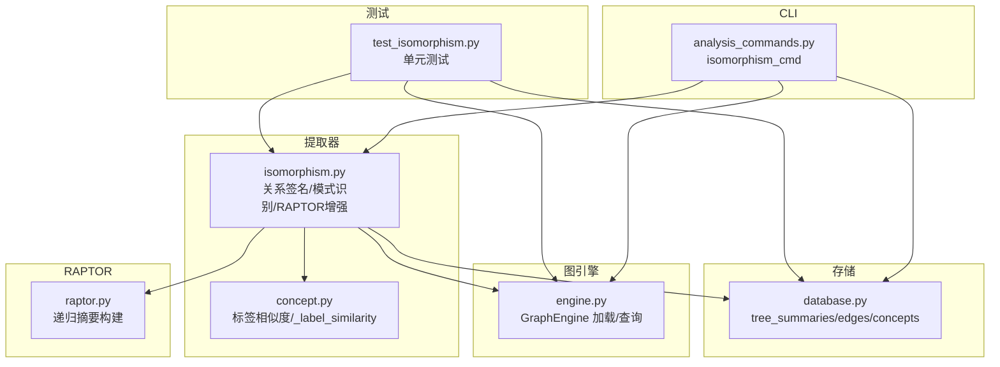
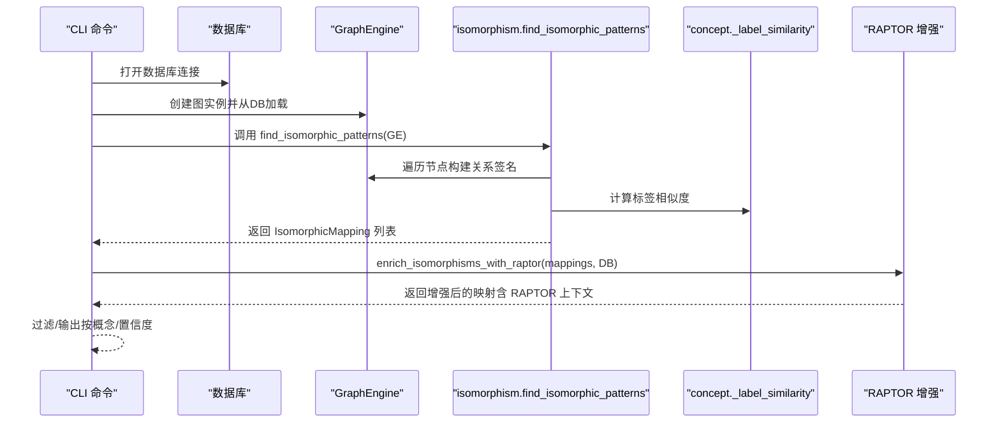
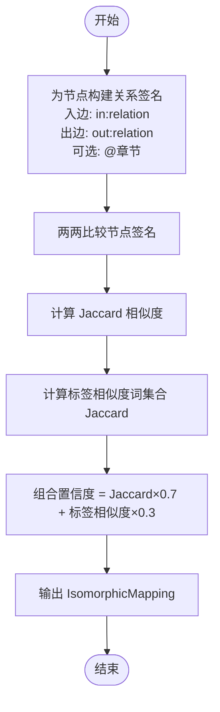
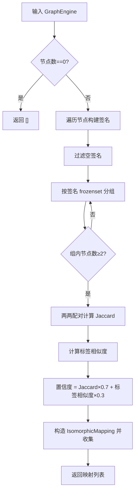
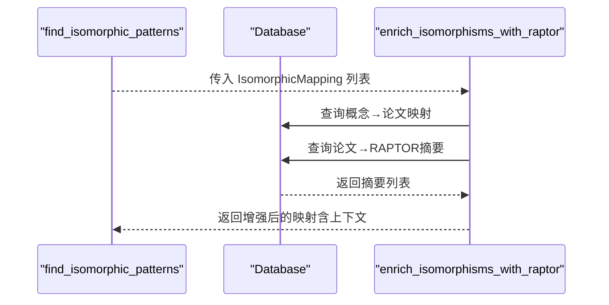
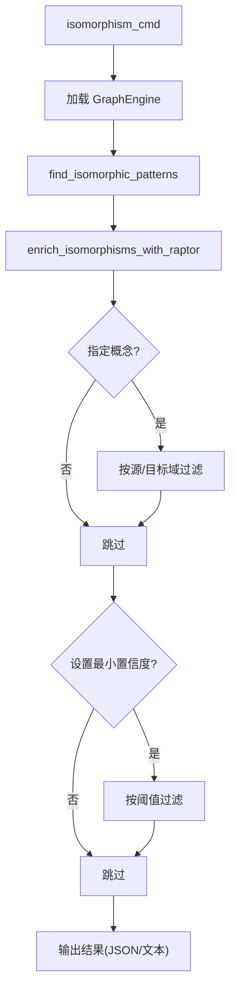
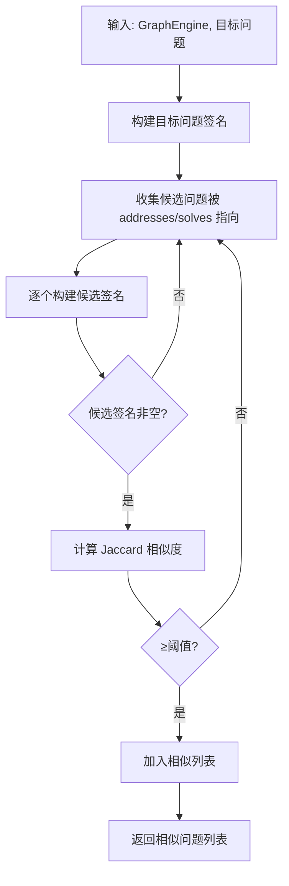
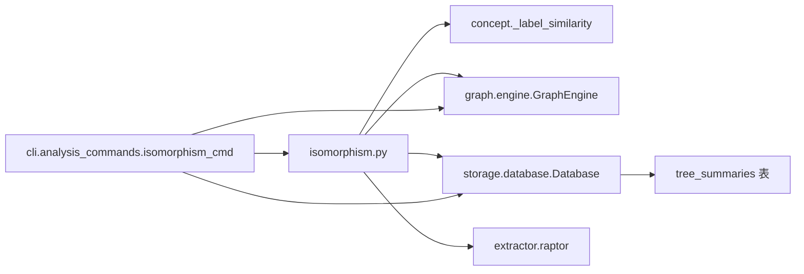

# 同构模式识别

<cite>
**本文引用的文件**
- [isomorphism.py](file://src/drbrain/extractor/isomorphism.py)
- [concept.py](file://src/drbrain/extractor/concept.py)
- [engine.py](file://src/drbrain/graph/engine.py)
- [database.py](file://src/drbrain/storage/database.py)
- [raptor.py](file://src/drbrain/extractor/raptor.py)
- [test_isomorphism.py](file://tests/test_isomorphism.py)
- [analysis_commands.py](file://src/drbrain/cli/analysis_commands.py)
</cite>

## 目录
1. [简介](#简介)
2. [项目结构](#项目结构)
3. [核心组件](#核心组件)
4. [架构总览](#架构总览)
5. [详细组件分析](#详细组件分析)
6. [依赖关系分析](#依赖关系分析)
7. [性能考量](#性能考量)
8. [故障排查指南](#故障排查指南)
9. [结论](#结论)
10. [附录](#附录)

## 简介
本技术文档围绕 DrBrain 的“同构模式识别”能力展开，系统性阐述其在知识图谱中发现结构相似研究模式的原理与实现。该能力通过“关系签名”对节点进行向量式表征，基于签名的 Jaccard 相似度进行子图匹配与模式识别，并结合标签相似度综合生成置信度，最终输出可解释的“结构同构映射”。同时，文档还说明了如何利用 RAPTOR 跨章节摘要增强映射结果，以及在跨领域知识迁移与方法借鉴中的应用价值。

## 项目结构
与同构模式识别直接相关的模块分布如下：
- 提取器：关系签名构建、相似度计算、模式识别与 RAPTOR 增强
- 图引擎：知识图谱加载与查询
- 存储：数据库 Schema 与 RAPTOR 摘要存储
- CLI：命令入口，支持过滤与输出控制
- 测试：覆盖签名构建、相似问题查找、模式识别、置信度评分、CLI 行为与 RAPTOR 增强等场景

图表来源
- [isomorphism.py:1-257](file://src/drbrain/extractor/isomorphism.py#L1-L257)
- [concept.py:890-900](file://src/drbrain/extractor/concept.py#L890-L900)
- [engine.py:531-548](file://src/drbrain/graph/engine.py#L531-L548)
- [database.py:92-98](file://src/drbrain/storage/database.py#L92-L98)
- [raptor.py:176-200](file://src/drbrain/extractor/raptor.py#L176-L200)
- [analysis_commands.py:550-575](file://src/drbrain/cli/analysis_commands.py#L550-L575)
- [test_isomorphism.py:1-463](file://tests/test_isomorphism.py#L1-L463)

章节来源
- [isomorphism.py:1-257](file://src/drbrain/extractor/isomorphism.py#L1-L257)
- [concept.py:890-900](file://src/drbrain/extractor/concept.py#L890-L900)
- [engine.py:531-548](file://src/drbrain/graph/engine.py#L531-L548)
- [database.py:92-98](file://src/drbrain/storage/database.py#L92-L98)
- [raptor.py:176-200](file://src/drbrain/extractor/raptor.py#L176-L200)
- [analysis_commands.py:550-575](file://src/drbrain/cli/analysis_commands.py#L550-L575)
- [test_isomorphism.py:1-463](file://tests/test_isomorphism.py#L1-L463)

## 核心组件
- 关系签名函数：为每个节点统计“入边/出边关系类型及其计数”，可选带章节维度，形成可比较的字典签名
- 相似度计算：Jaccard 相似度用于衡量两节点关系签名的重叠程度；标签相似度使用词集合的 Jaccard 计算
- 模式识别：按签名分组，组内两两配对，计算置信度（Jaccard×0.7 + 标签相似度×0.3），输出结构同构映射
- RAPTOR 增强：根据映射涉及的概念所属论文，拉取跨章节摘要作为上下文，提升可解释性
- CLI 命令：从数据库加载图，执行模式识别与增强，支持按概念筛选与最小置信度过滤

章节来源
- [isomorphism.py:35-171](file://src/drbrain/extractor/isomorphism.py#L35-L171)
- [concept.py:890-900](file://src/drbrain/extractor/concept.py#L890-L900)
- [analysis_commands.py:550-575](file://src/drbrain/cli/analysis_commands.py#L550-L575)

## 架构总览
下图展示了 find_isomorphic_patterns 的端到端工作流，包括数据准备、关系签名构建、相似度计算、映射生成与 RAPTOR 增强。

图表来源
- [analysis_commands.py:550-575](file://src/drbrain/cli/analysis_commands.py#L550-L575)
- [isomorphism.py:111-171](file://src/drbrain/extractor/isomorphism.py#L111-L171)
- [isomorphism.py:173-256](file://src/drbrain/extractor/isomorphism.py#L173-L256)
- [concept.py:890-900](file://src/drbrain/extractor/concept.py#L890-L900)

## 详细组件分析

### 组件一：关系签名与相似度计算
- 关系签名：遍历节点的入边/出边，统计关系类型计数，可选加入“章节信息”以区分不同章节的相同关系
- 相似度：对两节点的关系签名分别转为键值对集合，计算交集/并集的比值（Jaccard）
- 标签相似度：对两个节点标签进行词集合的 Jaccard 相似度计算

图表来源
- [isomorphism.py:35-171](file://src/drbrain/extractor/isomorphism.py#L35-L171)
- [concept.py:890-900](file://src/drbrain/extractor/concept.py#L890-L900)

章节来源
- [isomorphism.py:35-108](file://src/drbrain/extractor/isomorphism.py#L35-L108)
- [concept.py:890-900](file://src/drbrain/extractor/concept.py#L890-L900)

### 组件二：find_isomorphic_patterns 工作流程
- 输入：GraphEngine 实例
- 步骤：
  - 为空图返回空列表
  - 为每个节点构建关系签名（忽略空签名）
  - 将节点按签名的 frozenset 键进行分组
  - 对每组内节点两两配对，计算 Jaccard 相似度与标签相似度，得到置信度
  - 输出 IsomorphicMapping（包含源域、目标域、共享结构描述、置信度）

图表来源
- [isomorphism.py:111-171](file://src/drbrain/extractor/isomorphism.py#L111-L171)

章节来源
- [isomorphism.py:111-171](file://src/drbrain/extractor/isomorphism.py#L111-L171)

### 组件三：RAPTOR 增强与上下文注入
- 目标：为每个映射的源域与目标域概念，补充其所属论文的跨章节摘要，形成结构化上下文
- 流程：
  - 收集所有映射涉及的概念标签
  - 查询数据库中这些标签对应的论文 ID
  - 拉取对应论文的所有 RAPTOR 摘要（按层级排序）
  - 将摘要列表分别注入到映射的源/目标上下文字段

图表来源
- [isomorphism.py:173-256](file://src/drbrain/extractor/isomorphism.py#L173-L256)
- [database.py:92-98](file://src/drbrain/storage/database.py#L92-L98)

章节来源
- [isomorphism.py:173-256](file://src/drbrain/extractor/isomorphism.py#L173-L256)
- [database.py:92-98](file://src/drbrain/storage/database.py#L92-L98)

### 组件四：CLI 命令与过滤
- 命令：isomorphism_cmd
- 功能：从数据库加载图，调用 find_isomorphic_patterns 与 RAPTOR 增强，支持按概念筛选与最小置信度过滤，输出 JSON 或文本

图表来源
- [analysis_commands.py:550-575](file://src/drbrain/cli/analysis_commands.py#L550-L575)

章节来源
- [analysis_commands.py:550-575](file://src/drbrain/cli/analysis_commands.py#L550-L575)

### 组件五：相似问题查找（辅助能力）
- 作用：在“解决/应对”关系的目标节点中，寻找具有相似入边关系签名的问题节点
- 方法：对目标问题签名与候选问题签名做 Jaccard 相似度比较，超过阈值则认为相似

图表来源
- [isomorphism.py:68-108](file://src/drbrain/extractor/isomorphism.py#L68-L108)

章节来源
- [isomorphism.py:68-108](file://src/drbrain/extractor/isomorphism.py#L68-L108)

## 依赖关系分析
- 模块耦合
  - isomorphism 依赖 concept 的标签相似度函数
  - CLI 依赖 isomorphism 与 GraphEngine、Database
  - RAPTOR 增强依赖 database 的 tree_summaries 表
- 外部依赖
  - 数据库：SQLite，包含 concepts、edges、tree_summaries 等表
  - RAPTOR：递归摘要树，存储于 tree_summaries 与 tree_vectors

图表来源
- [isomorphism.py:111-171](file://src/drbrain/extractor/isomorphism.py#L111-L171)
- [concept.py:890-900](file://src/drbrain/extractor/concept.py#L890-L900)
- [analysis_commands.py:550-575](file://src/drbrain/cli/analysis_commands.py#L550-L575)
- [database.py:92-98](file://src/drbrain/storage/database.py#L92-L98)
- [raptor.py:176-200](file://src/drbrain/extractor/raptor.py#L176-L200)

章节来源
- [isomorphism.py:111-171](file://src/drbrain/extractor/isomorphism.py#L111-L171)
- [concept.py:890-900](file://src/drbrain/extractor/concept.py#L890-L900)
- [analysis_commands.py:550-575](file://src/drbrain/cli/analysis_commands.py#L550-L575)
- [database.py:92-98](file://src/drbrain/storage/database.py#L92-L98)
- [raptor.py:176-200](file://src/drbrain/extractor/raptor.py#L176-L200)

## 性能考量
- 时间复杂度
  - 关系签名：O(E)，E 为边数
  - 分组与配对：最坏 O(N^2)，N 为节点数；但通常按签名分组后组内配对数量有限
  - 置信度计算：每对 O(S)，S 为签名大小（通常很小）
- 空间复杂度
  - 签名字典与分组哈希表：O(N·S)
  - 映射列表：O(N^2) 最坏情况
- 优化建议
  - 使用索引：对 edges.relation、concepts.label 等建立索引可加速候选节点筛选
  - 分段处理：对大规模图可按领域或时间窗口分批处理
  - 缓存：对重复计算的签名与相似度结果进行缓存

## 故障排查指南
- 空图或单节点图
  - 现象：返回空列表
  - 排查：确认图是否正确加载与写入
- 无相似映射
  - 现象：Jaccard 相似度低或标签差异大
  - 排查：检查关系签名构建逻辑与标签相似度阈值
- RAPTOR 上下文为空
  - 现象：增强后上下文字段为空
  - 排查：确认数据库中是否存在 tree_summaries 数据；确认概念与论文映射正确
- CLI 报错
  - 现象：数据库路径错误或空图
  - 排查：检查配置项 db.path；确保数据库已初始化

章节来源
- [test_isomorphism.py:65-90](file://tests/test_isomorphism.py#L65-L90)
- [test_isomorphism.py:433-462](file://tests/test_isomorphism.py#L433-L462)
- [analysis_commands.py:550-575](file://src/drbrain/cli/analysis_commands.py#L550-L575)

## 结论
DrBrain 的同构模式识别通过“关系签名 + Jaccard 相似度 + 标签相似度”的组合策略，在知识图谱中高效发现跨领域、跨章节的结构相似研究模式。配合 RAPTOR 跨章节摘要增强，能够为跨领域知识迁移与方法借鉴提供高可解释性的线索。该能力既可用于自动化的模式检索，也可作为人工探索的起点，推动学术知识的深度挖掘与迁移。

## 附录

### 同构模式识别判定标准与阈值
- 判定标准
  - 关系签名：入边/出边关系类型计数，可选章节维度
  - 相似度：Jaccard 相似度（默认阈值未硬编码，测试显示置信度随签名与标签差异变化）
  - 置信度：Jaccard×0.7 + 标签相似度×0.3
- 阈值设置
  - CLI 中可通过 --min-confidence 设置最小置信度过滤
  - 相似问题查找使用 find_similar_problems 的 min_similarity 参数（默认 0.8）

章节来源
- [isomorphism.py:111-171](file://src/drbrain/extractor/isomorphism.py#L111-L171)
- [isomorphism.py:68-108](file://src/drbrain/extractor/isomorphism.py#L68-L108)
- [analysis_commands.py:550-575](file://src/drbrain/cli/analysis_commands.py#L550-L575)

### 实际用例：在知识图谱中识别结构相似的研究模式
- 场景一：问题模式识别
  - 目标：发现“应对/解决”关系中具有相似入边关系签名的问题
  - 流程：构建目标问题签名 → 筛选候选问题 → 计算 Jaccard 相似度 → 返回相似列表
- 场景二：方法模式识别
  - 目标：发现“解决/应对”关系中具有相同出边关系签名的方法
  - 流程：构建方法签名 → 分组 → 组内配对 → 计算置信度 → 输出映射
- 场景三：跨领域迁移
  - 目标：在不同领域中发现结构相似的研究模式，辅助方法借鉴
  - 流程：find_isomorphic_patterns → enrich_isomorphisms_with_raptor → 按概念/置信度过滤 → 输出

章节来源
- [isomorphism.py:68-108](file://src/drbrain/extractor/isomorphism.py#L68-L108)
- [isomorphism.py:111-171](file://src/drbrain/extractor/isomorphism.py#L111-L171)
- [isomorphism.py:173-256](file://src/drbrain/extractor/isomorphism.py#L173-L256)
- [test_isomorphism.py:22-118](file://tests/test_isomorphism.py#L22-L118)
- [test_isomorphism.py:49-90](file://tests/test_isomorphism.py#L49-L90)