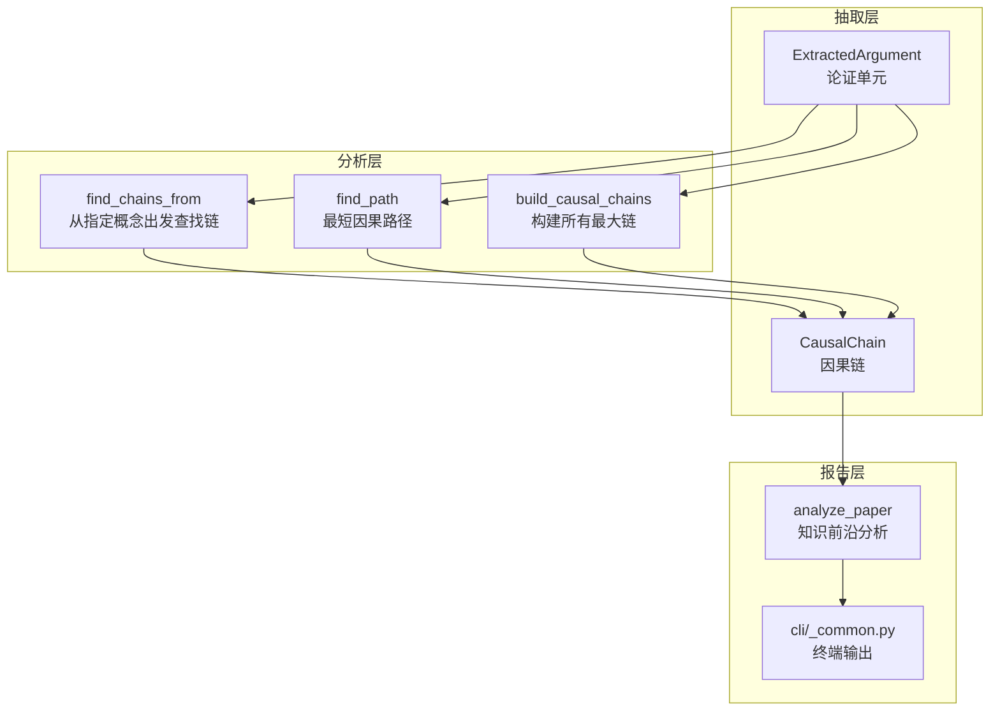
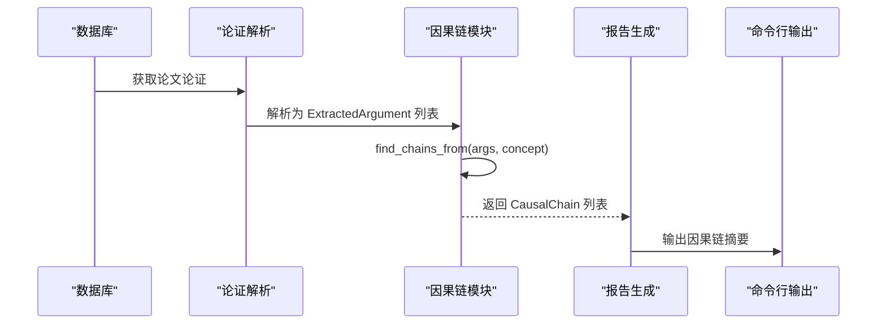
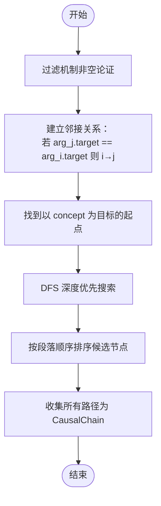
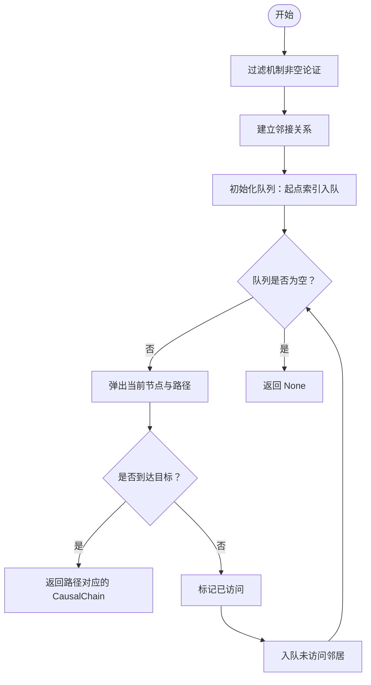
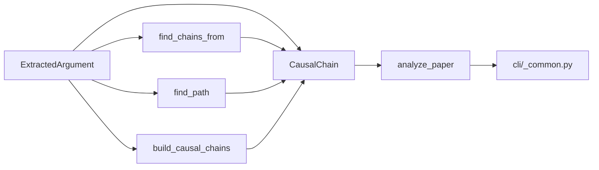

# 因果链分析

<cite>
**本文引用的文件**
- [causal_chain.py](file://src/drbrain/extractor/causal_chain.py)
- [argument.py](file://src/drbrain/extractor/argument.py)
- [analyzer.py](file://src/drbrain/report/analyzer.py)
- [test_causal_chain.py](file://tests/test_causal_chain.py)
- [_common.py](file://src/drbrain/cli/_common.py)
- [SKILL.md（研究分析）](file://skills/research-analysis/SKILL.md)
- [SKILL.md（知识前沿）](file://skills/knowledge-cartography/SKILL.md)
</cite>

## 目录
1. [简介](#简介)
2. [项目结构](#项目结构)
3. [核心组件](#核心组件)
4. [架构总览](#架构总览)
5. [详细组件分析](#详细组件分析)
6. [依赖分析](#依赖分析)
7. [性能考虑](#性能考虑)
8. [故障排除指南](#故障排除指南)
9. [结论](#结论)
10. [附录](#附录)

## 简介
本技术文档围绕 DrBrain 的因果链分析功能展开，系统性阐述因果链算法的核心原理、数据结构设计与实现细节，并结合论文论证抽取结果，给出从“源概念—机制—目标概念”的链式推理过程。文档重点覆盖以下内容：
- ExtractedArgument 数据结构的字段含义与使用方法
- find_chains_from 函数的工作流程与参数配置
- 基于机制字段的因果链构建策略与排序规则
- 在知识前沿分析中的作用与应用场景
- 实际用法示例与最佳实践建议

## 项目结构
因果链分析位于抽取模块中，与论证解析、报告生成、CLI 展示等模块协同工作：
- 抽取层：负责从论文中抽取结构化论证单元（ExtractedArgument）
- 分析层：基于机制字段构建因果链，支持路径查找与最长链生成
- 报告层：将因果链整合进知识前沿报告，供 CLI 输出展示

图表来源
- [causal_chain.py:153-189](file://src/drbrain/extractor/causal_chain.py#L153-L189)
- [argument.py:13-38](file://src/drbrain/extractor/argument.py#L13-L38)
- [analyzer.py:37-68](file://src/drbrain/report/analyzer.py#L37-L68)
- [_common.py:872-874](file://src/drbrain/cli/_common.py#L872-L874)

章节来源
- [causal_chain.py:1-238](file://src/drbrain/extractor/causal_chain.py#L1-L238)
- [argument.py:1-87](file://src/drbrain/extractor/argument.py#L1-L87)
- [analyzer.py:1-134](file://src/drbrain/report/analyzer.py#L1-L134)

## 核心组件
- ExtractedArgument：表示一次结构化的学术论证单元，包含主张、主张类型、目标概念、目标类型、证据类型/详情、机制、所在段落、置信度等字段。该结构是因果链构建的基础输入。
- CausalChain：表示由多个 ExtractedArgument 组成的因果链，提供长度统计与摘要字符串（格式为“起始概念 → 结束概念（via 机制列表）”）。
- find_chains_from：从给定的概念出发，查找所有以该概念为目标的因果链。
- find_path：在概念之间寻找最短因果路径（BFS）。
- build_causal_chains：构建所有最大因果链（DFS），并按论文段落顺序进行邻接排序。

章节来源
- [argument.py:13-38](file://src/drbrain/extractor/argument.py#L13-L38)
- [causal_chain.py:40-61](file://src/drbrain/extractor/causal_chain.py#L40-L61)
- [causal_chain.py:153-189](file://src/drbrain/extractor/causal_chain.py#L153-L189)
- [causal_chain.py:192-237](file://src/drbrain/extractor/causal_chain.py#L192-L237)
- [causal_chain.py:63-150](file://src/drbrain/extractor/causal_chain.py#L63-L150)

## 架构总览
因果链分析的端到端流程如下：
- 输入：论文级的论证集合（ExtractedArgument 列表）
- 处理：基于机制字段构建链图，通过 DFS/BFS 搜索最长链或最短路径
- 输出：CausalChain 集合，用于知识前沿报告与 CLI 可视化

图表来源
- [analyzer.py:37-68](file://src/drbrain/report/analyzer.py#L37-L68)
- [causal_chain.py:153-189](file://src/drbrain/extractor/causal_chain.py#L153-L189)
- [_common.py:872-874](file://src/drbrain/cli/_common.py#L872-L874)

## 详细组件分析

### ExtractedArgument 数据结构
- 字段说明
  - claim：主张文本
  - claim_type：主张类型（如 supports/challenges/extends/solves/proposes 等）
  - target：目标概念
  - target_type：目标类型（Method/Problem/Conclusion/Gap/Debate/Argument 等）
  - evidence_type/evidence_detail：证据类型与细节
  - mechanism：机制描述（决定是否参与因果链构建）
  - section：所在论文段落（用于排序）
  - confidence：置信度
- 使用方法
  - 从数据库导出的原始论证字典解析为 ExtractedArgument 对象
  - 仅当 mechanism 非空时，论证才会被纳入因果链构建
  - 支持 to_dict 序列化以便持久化或报告输出

章节来源
- [argument.py:13-38](file://src/drbrain/extractor/argument.py#L13-L38)
- [argument.py:41-58](file://src/drbrain/extractor/argument.py#L41-L58)
- [argument.py:61-86](file://src/drbrain/extractor/argument.py#L61-L86)

### CausalChain 数据结构
- 字段与行为
  - links：由 ExtractedArgument 组成的有序序列
  - __len__：返回链长度
  - summary：生成人类可读摘要，格式为“起始概念 → 结束概念（via 机制列表）”
- 用途
  - 作为 find_chains_from/find_path/build_causal_chains 的统一输出载体
  - 用于报告与 CLI 展示

章节来源
- [causal_chain.py:40-61](file://src/drbrain/extractor/causal_chain.py#L40-L61)

### find_chains_from：从指定概念出发查找因果链
- 功能概述
  - 从给定的概念出发，查找所有以该概念为目标的因果链
  - 仅考虑具有非空机制字段的论证
- 工作流程
  1) 过滤出机制非空的论证
  2) 以“目标概念相同”建立邻接关系（arg_j.target == arg_i.target）
  3) 从所有以 concept 为目标的论证出发，执行 DFS 搜索
  4) 排序策略：优先选择在论文段落顺序上相邻的下一个节点
- 参数与返回
  - 参数：args（ExtractedArgument 列表）、concept（字符串）
  - 返回：CausalChain 列表

图表来源
- [causal_chain.py:153-189](file://src/drbrain/extractor/causal_chain.py#L153-L189)

章节来源
- [causal_chain.py:153-189](file://src/drbrain/extractor/causal_chain.py#L153-L189)

### find_path：最短因果路径（BFS）
- 功能概述
  - 在两个概念之间寻找最短因果路径
  - 采用广度优先搜索（BFS），确保返回最短链
- 工作流程
  1) 过滤机制非空论证
  2) 建立邻接关系（同上）
  3) 从以 source 为目标的论证出发，BFS 扩展至以 target 为目标的论证
  4) 返回第一条到达的路径对应的 CausalChain

图表来源
- [causal_chain.py:192-237](file://src/drbrain/extractor/causal_chain.py#L192-L237)

章节来源
- [causal_chain.py:192-237](file://src/drbrain/extractor/causal_chain.py#L192-L237)

### build_causal_chains：构建所有最大因果链（DFS）
- 功能概述
  - 构建论文中所有最大因果链（不考虑起点）
  - 通过 DFS 从无入边节点出发，收集所有可达路径
- 排序规则
  - 按论文段落顺序对候选节点进行排序，优先选择“紧随其后”的段落

章节来源
- [causal_chain.py:63-150](file://src/drbrain/extractor/causal_chain.py#L63-L150)

### 知识前沿分析中的因果链
- 报告集成
  - analyze_paper 会从数据库读取论文论证，解析为 ExtractedArgument 列表
  - 调用 find_chains_from 对论文中的前若干概念进行链式探索
  - 将因果链摘要写入报告，供 CLI 输出展示
- CLI 展示
  - 终端输出中包含“因果链”小节，格式为“源概念 → 目标概念（via: 机制）”

章节来源
- [analyzer.py:37-68](file://src/drbrain/report/analyzer.py#L37-L68)
- [_common.py:872-874](file://src/drbrain/cli/_common.py#L872-L874)

## 依赖分析
- 组件耦合
  - CausalChain 依赖 ExtractedArgument 的字段（target、mechanism、section）
  - find_chains_from/find_path/build_causal_chains 共享邻接关系构建逻辑
  - analyze_paper 依赖因果链模块与数据库接口
- 外部依赖
  - 无外部库依赖，纯 Python 实现
- 循环依赖
  - 无循环依赖

图表来源
- [argument.py:13-38](file://src/drbrain/extractor/argument.py#L13-L38)
- [causal_chain.py:40-61](file://src/drbrain/extractor/causal_chain.py#L40-L61)
- [analyzer.py:37-68](file://src/drbrain/report/analyzer.py#L37-L68)
- [_common.py:872-874](file://src/drbrain/cli/_common.py#L872-L874)

章节来源
- [argument.py:1-87](file://src/drbrain/extractor/argument.py#L1-L87)
- [causal_chain.py:1-238](file://src/drbrain/extractor/causal_chain.py#L1-L238)
- [analyzer.py:1-134](file://src/drbrain/report/analyzer.py#L1-L134)

## 性能考虑
- 时间复杂度
  - 邻接关系构建：O(N^2)，N 为机制非空论证数量
  - DFS/BFS：在最坏情况下可能遍历所有节点，整体约为 O(N^2)
- 空间复杂度
  - 邻接表占用 O(N^2)；递归 DFS/BFS 的栈/队列深度最多为 N
- 优化建议
  - 仅保留机制非空论证，减少邻接矩阵规模
  - 对大规模论文，可限制起始概念数量或链长上限
  - 段落排序仅在需要时启用，避免不必要的排序开销

## 故障排除指南
- 问题：find_chains_from 返回空
  - 可能原因：目标概念不在任何论证的目标集中，或所有论证均无机制
  - 处理：检查 ExtractedArgument 的 target 与 mechanism 字段
- 问题：find_path 返回 None
  - 可能原因：源/目标概念不存在于任何论证的目标集中，或两者之间无共享目标
  - 处理：确认概念标签一致性与大小写
- 问题：build_causal_chains 未形成链
  - 可能原因：论证之间未共享目标概念，或机制字段缺失
  - 处理：确保论证的 target 字段一致且机制非空

章节来源
- [test_causal_chain.py:110-127](file://tests/test_causal_chain.py#L110-L127)
- [test_causal_chain.py:133-161](file://tests/test_causal_chain.py#L133-L161)

## 结论
因果链分析通过“机制驱动”的链式推理，将论文中的结构化论证转化为可解释的研究路径。ExtractedArgument 提供了统一的数据模型，CausalChain 提供了简洁的输出形式，find_chains_from/find_path/build_causal_chains 则分别满足“从概念出发探索”、“最短路径定位”和“全局链发现”的需求。在知识前沿分析中，因果链帮助识别研究动态、跨论文方法迁移机会与关键环节，为科研决策提供支撑。

## 附录

### 实际用法示例（步骤说明）
- 步骤一：从数据库读取论文论证并解析为 ExtractedArgument 列表
- 步骤二：调用 find_chains_from(args, concept) 获取以 concept 为起点的所有因果链
- 步骤三：将链摘要写入报告，CLI 输出展示

章节来源
- [analyzer.py:37-68](file://src/drbrain/report/analyzer.py#L37-L68)
- [causal_chain.py:153-189](file://src/drbrain/extractor/causal_chain.py#L153-L189)

### 知识前沿分析中的应用场景
- 识别研究种子（Research Seeds）与潜在突破点
- 发现跨论文的方法迁移机会（Method→Problem 匹配）
- 评估关键节点（Critical Nodes）对领域演进的影响
- 生成可解释的执行摘要与子图描述

章节来源
- [analyzer.py:100-134](file://src/drbrain/report/analyzer.py#L100-L134)
- [SKILL.md（研究分析）:1-33](file://skills/research-analysis/SKILL.md#L1-L33)
- [SKILL.md（知识前沿）:119-161](file://skills/knowledge-cartography/SKILL.md#L119-L161)