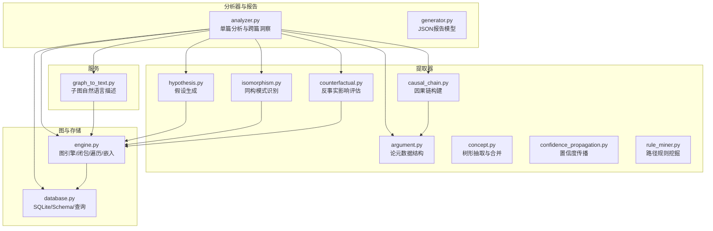
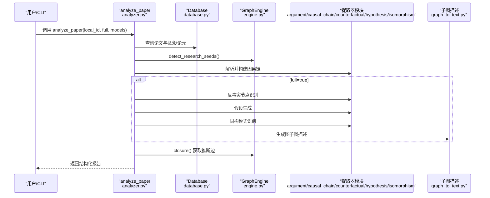
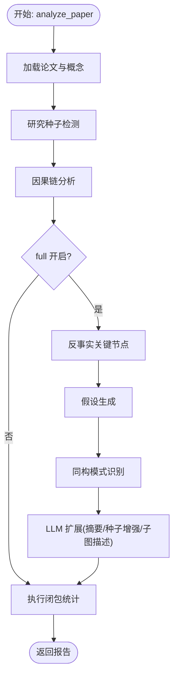
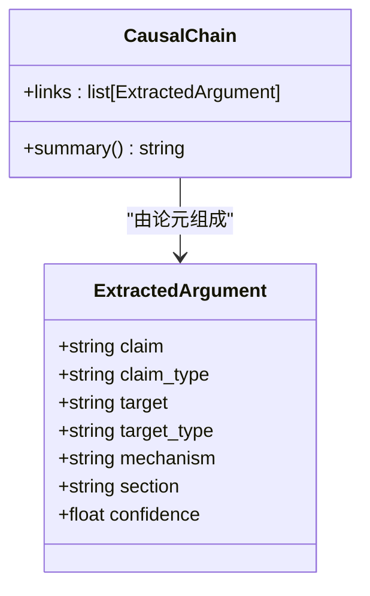
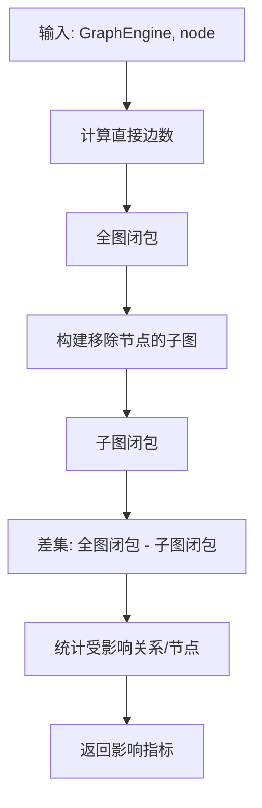
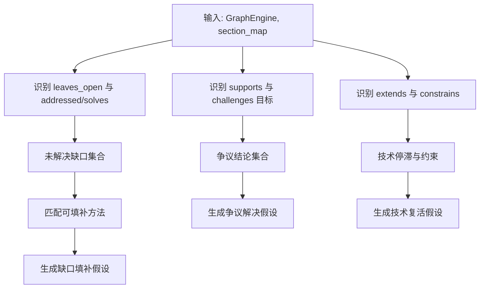
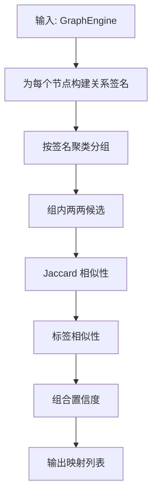
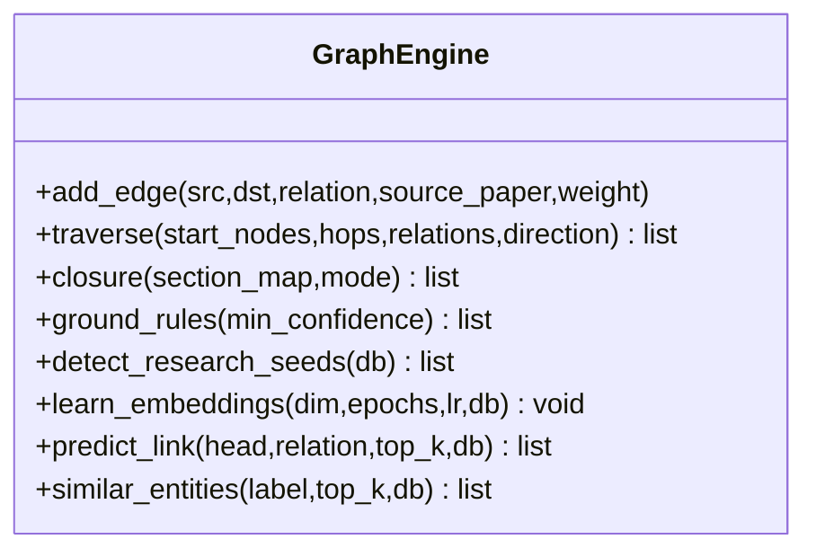
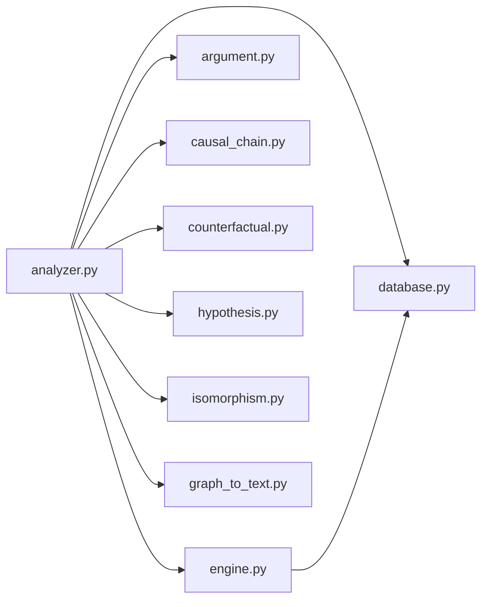

# 知识前沿分析

<cite>
**本文引用的文件**
- [analyzer.py](file://src/drbrain/report/analyzer.py)
- [generator.py](file://src/drbrain/report/generator.py)
- [engine.py](file://src/drbrain/graph/engine.py)
- [database.py](file://src/drbrain/storage/database.py)
- [argument.py](file://src/drbrain/extractor/argument.py)
- [causal_chain.py](file://src/drbrain/extractor/causal_chain.py)
- [counterfactual.py](file://src/drbrain/extractor/counterfactual.py)
- [hypothesis.py](file://src/drbrain/extractor/hypothesis.py)
- [isomorphism.py](file://src/drbrain/extractor/isomorphism.py)
- [concept.py](file://src/drbrain/extractor/concept.py)
- [graph_to_text.py](file://src/drbrain/services/graph_to_text.py)
- [analysis_commands.py](file://src/drbrain/cli/analysis_commands.py)
- [confidence_propagation.py](file://src/drbrain/extractor/confidence_propagation.py)
- [rule_miner.py](file://src/drbrain/extractor/rule_miner.py)
</cite>

## 目录
1. [简介](#简介)
2. [项目结构](#项目结构)
3. [核心组件](#核心组件)
4. [架构总览](#架构总览)
5. [详细组件分析](#详细组件分析)
6. [依赖关系分析](#依赖关系分析)
7. [性能考量](#性能考量)
8. [故障排查指南](#故障排查指南)
9. [结论](#结论)
10. [附录：调用与使用示例](#附录调用与使用示例)

## 简介
本技术文档面向 DrBrain 的“知识前沿分析”能力，系统阐述单篇论文的分析流程与推理模块集成方式，覆盖研究种子检测、因果链分析、反事实分析、假设生成、同构模式识别等核心算法，并说明如何通过分析器整合多模块输出形成结构化报告。文档同时给出参数配置、性能优化策略、扩展机制以及调用示例与报告数据结构说明，帮助开发者与使用者高效落地与迭代该能力。

## 项目结构
围绕“知识前沿分析”的关键代码分布在以下子系统：
- 报告与分析器：负责将各推理模块的结果整合为统一报告，支持可选的 LLM 扩展摘要与图子图描述。
- 图引擎与存储：提供规则闭包、遍历、嵌入、反事实影响评估等能力，并持久化到数据库。
- 提取器：概念与论元抽取、因果链构建、反事实节点识别、假设生成、同构模式发现。
- 服务层：将子图转换为自然语言描述，辅助高层洞察。
- CLI 命令：对外暴露分析命令入口，便于批量或交互式运行。

图表来源
- [analyzer.py:9-134](file://src/drbrain/report/analyzer.py#L9-L134)
- [engine.py:33-315](file://src/drbrain/graph/engine.py#L33-L315)
- [database.py:159-775](file://src/drbrain/storage/database.py#L159-L775)
- [argument.py:13-87](file://src/drbrain/extractor/argument.py#L13-L87)
- [causal_chain.py:40-238](file://src/drbrain/extractor/causal_chain.py#L40-L238)
- [counterfactual.py:16-144](file://src/drbrain/extractor/counterfactual.py#L16-L144)
- [hypothesis.py:18-198](file://src/drbrain/extractor/hypothesis.py#L18-L198)
- [isomorphism.py:17-257](file://src/drbrain/extractor/isomorphism.py#L17-L257)
- [concept.py:28-800](file://src/drbrain/extractor/concept.py#L28-L800)
- [graph_to_text.py:70-145](file://src/drbrain/services/graph_to_text.py#L70-L145)
- [confidence_propagation.py:31-87](file://src/drbrain/extractor/confidence_propagation.py#L31-L87)
- [rule_miner.py:33-290](file://src/drbrain/extractor/rule_miner.py#L33-L290)

章节来源
- [analyzer.py:9-134](file://src/drbrain/report/analyzer.py#L9-L134)
- [engine.py:33-315](file://src/drbrain/graph/engine.py#L33-L315)
- [database.py:159-775](file://src/drbrain/storage/database.py#L159-L775)

## 核心组件
- 单篇分析器 analyze_paper
  - 负责加载论文、提取概念、执行研究种子检测、因果链分析、（可选）反事实、假设生成、同构模式识别，并汇总统计与可选的 LLM 洞察。
  - 支持可选的 executive summary、种子增强与图子图描述。
- 因果链分析
  - 基于 ExtractedArgument 构建因果链，按段落顺序排序，输出“源→目标（经由机制）”的链路。
- 反事实分析
  - 计算移除节点对边数、推断关系与受影响概念的影响，用于识别关键节点。
- 假设生成
  - 基于图模式识别未解决缺口、争议区、技术悬崖等，生成可解释的假设并打分。
- 同构模式识别
  - 基于关系签名相似性与标签相似性，发现跨域结构相似的子图，辅助知识迁移。
- 图引擎与闭包
  - 提供规则闭包、路径规则、TransE 嵌入、置信度传播、反事实影响评估等能力。
- 数据库与持久化
  - 提供论文、概念、论元、边、别名、嵌入、树向量与摘要等表结构与查询接口。
- 子图自然语言描述
  - 将中心实体的邻域子图转换为自然语言段落，辅助高层综述。

章节来源
- [analyzer.py:9-134](file://src/drbrain/report/analyzer.py#L9-L134)
- [causal_chain.py:63-190](file://src/drbrain/extractor/causal_chain.py#L63-L190)
- [counterfactual.py:35-96](file://src/drbrain/extractor/counterfactual.py#L35-L96)
- [hypothesis.py:82-198](file://src/drbrain/extractor/hypothesis.py#L82-L198)
- [isomorphism.py:111-170](file://src/drbrain/extractor/isomorphism.py#L111-L170)
- [engine.py:124-315](file://src/drbrain/graph/engine.py#L124-L315)
- [database.py:419-585](file://src/drbrain/storage/database.py#L419-L585)
- [graph_to_text.py:70-145](file://src/drbrain/services/graph_to_text.py#L70-L145)

## 架构总览
下图展示了“知识前沿分析”的端到端流程：从单篇论文出发，经由论元与概念抽取、因果链构建、反事实与假设生成、同构模式识别，最终由分析器整合为结构化报告，并可选地生成 LLM 洞察与子图描述。

图表来源
- [analyzer.py:9-134](file://src/drbrain/report/analyzer.py#L9-L134)
- [engine.py:354-454](file://src/drbrain/graph/engine.py#L354-L454)
- [database.py:480-585](file://src/drbrain/storage/database.py#L480-L585)
- [argument.py:41-87](file://src/drbrain/extractor/argument.py#L41-L87)
- [causal_chain.py:153-189](file://src/drbrain/extractor/causal_chain.py#L153-L189)
- [counterfactual.py:81-96](file://src/drbrain/extractor/counterfactual.py#L81-L96)
- [hypothesis.py:82-198](file://src/drbrain/extractor/hypothesis.py#L82-L198)
- [isomorphism.py:111-170](file://src/drbrain/extractor/isomorphism.py#L111-L170)
- [graph_to_text.py:70-145](file://src/drbrain/services/graph_to_text.py#L70-L145)

## 详细组件分析

### 组件一：单篇分析器 analyze_paper
- 输入
  - Database 实例、GraphEngine 实例、论文 local_id
  - 参数：full（是否启用反事实/假设/同构）、models（LLM 配置列表）
- 主要步骤
  - 加载论文与概念集合，构建基础报告结构
  - 研究种子检测：基于图模式与时间维度识别“停滞问题/未解决缺口/争议区/技术悬崖/跨域同构/置信度坍缩”
  - 因果链分析：按概念筛选，构建“源→目标（经由机制）”链路
  - 反事实分析（full）：识别关键节点，过滤为论文概念集合内的节点
  - 假设生成（full）：识别缺口填补、争议解决、技术复活等模式
  - 同构模式识别（full）：基于关系签名与标签相似性发现跨域结构相似性
  - 统计汇总：统计种子、因果链、推断边、关键节点、假设、同构数量
  - LLM 扩展（可选）：生成高层摘要、增强种子建议方向、生成图子图描述
- 输出
  - 结构化字典，包含 paper、seeds、causal_chains、critical_nodes、hypotheses、isomorphisms、summary、executive_summary、graph_summary 等字段

图表来源
- [analyzer.py:9-134](file://src/drbrain/report/analyzer.py#L9-L134)

章节来源
- [analyzer.py:9-134](file://src/drbrain/report/analyzer.py#L9-L134)

### 组件二：因果链分析（causal_chain）
- 数据结构
  - ExtractedArgument：承载 claim、claim_type、target、target_type、mechanism、section、confidence 等
  - CausalChain：由一组 ExtractedArgument 组成的链，提供 summary() 生成人类可读描述
- 算法要点
  - 基于“机制非空”的论元构建邻接图，按段落顺序权重进行 DFS/BFS，得到最大因果链
  - 支持从指定概念出发查找所有链，或寻找最短路径
- 复杂度
  - 邻接构建 O(N^2)，DFS/BFS 最坏 O(N + E)，N 为论元数，E 为边数

图表来源
- [argument.py:13-87](file://src/drbrain/extractor/argument.py#L13-L87)
- [causal_chain.py:40-61](file://src/drbrain/extractor/causal_chain.py#L40-L61)

章节来源
- [argument.py:13-87](file://src/drbrain/extractor/argument.py#L13-L87)
- [causal_chain.py:63-190](file://src/drbrain/extractor/causal_chain.py#L63-L190)

### 组件三：反事实分析（counterfactual）
- 目标
  - 评估移除某个节点对图的影响：直接边移除数、推断关系损失、受影响的概念数
- 方法
  - 对比完整图与移除节点后的闭包差异，统计受影响的关系与节点
  - 提供加权版本，依据段落类型赋予不同权重（如方法/结果段落权重更高）
- 输出
  - CounterfactualImpact 结构，包含 removed_edges、affected_concepts、lost_inferences、affected_nodes

图表来源
- [counterfactual.py:35-96](file://src/drbrain/extractor/counterfactual.py#L35-L96)

章节来源
- [counterfactual.py:35-96](file://src/drbrain/extractor/counterfactual.py#L35-L96)

### 组件四：假设生成（hypothesis）
- 模式
  - 未解决缺口：某方法可填补某缺口
  - 争议区：同一结论被多方支持/挑战，需要进一步证据
  - 技术悬崖：某方法曾扩展后停滞，若约束解除可能复活
- 评分
  - 基础置信度 + 证据项加成（上限 0.15），总分不超过 1.0
- 输出
  - Hypothesis 列表，包含 description、type、base_confidence、evidence、score

图表来源
- [hypothesis.py:82-198](file://src/drbrain/extractor/hypothesis.py#L82-L198)

章节来源
- [hypothesis.py:82-198](file://src/drbrain/extractor/hypothesis.py#L82-L198)

### 组件五：同构模式识别（isomorphism）
- 思路
  - 以节点的关系签名（入/出关系类型计数）作为结构指纹，计算 Jaccard 相似性
  - 结合标签相似性，综合得出映射置信度
  - 可选：利用 RAPTOR 摘要增强上下文
- 输出
  - IsomorphicMapping 列表，包含 source_domain、target_domain、shared_structure、confidence、上下文

图表来源
- [isomorphism.py:111-170](file://src/drbrain/extractor/isomorphism.py#L111-L170)

章节来源
- [isomorphism.py:111-170](file://src/drbrain/extractor/isomorphism.py#L111-L170)

### 组件六：图引擎与闭包（engine）
- 规则闭包
  - 支持多种规则：创建争议、缺口已填补、间接演化、缺口→争议、共享作者网络、传递闭包、路径规则
  - 可选混合模式：结合 TransE 嵌入得分调整置信度
- 置信度传播
  - 默认衰减因子 0.85；按段落类型给予不同衰减权重（方法/结果段衰减更小）
- 研究种子检测
  - 基于图模式与时间维度识别：停滞问题、未解决缺口、争议区、技术悬崖、跨域同构、置信度坍缩
- 嵌入与预测
  - 支持 TransE 嵌入训练、保存/加载、相似实体检索、链接预测

图表来源
- [engine.py:33-315](file://src/drbrain/graph/engine.py#L33-L315)

章节来源
- [engine.py:124-315](file://src/drbrain/graph/engine.py#L124-L315)
- [confidence_propagation.py:31-87](file://src/drbrain/extractor/confidence_propagation.py#L31-L87)

### 组件七：数据库与持久化（database）
- 表结构
  - papers、paper_ids、concepts、arguments、edges、aliases、embeddings、tree_vectors、tree_summaries、confidence_queue、research_seeds、citation_cache、build_stages、schema_versions
- 查询接口
  - 获取论文、概念、论元、研究种子、删除论文、演进信号与年表等
- 迁移管理
  - 自动迁移与版本记录

章节来源
- [database.py:10-156](file://src/drbrain/storage/database.py#L10-L156)
- [database.py:419-775](file://src/drbrain/storage/database.py#L419-L775)

### 组件八：子图自然语言描述（graph_to_text）
- 功能
  - 以中心实体为起点，按 hop 遍历邻居，收集实体与关系，构造提示词，调用 LLM 生成自然语言描述
- 输出
  - 描述文本（plain text）

章节来源
- [graph_to_text.py:70-145](file://src/drbrain/services/graph_to_text.py#L70-L145)

## 依赖关系分析
- 分析器依赖
  - analyzer.py 依赖 GraphEngine、Database、各提取器模块与 LLM 客户端
  - 通过异步调用实现 LLM 扩展摘要、种子增强与子图描述
- 提取器模块耦合
  - 因果链依赖论元结构；反事实与同构依赖图引擎；假设生成依赖图关系索引
- 图引擎与存储
  - engine 依赖 database 进行嵌入加载与研究信号计算；database 提供论文/概念/论元/边等数据支撑

图表来源
- [analyzer.py:9-134](file://src/drbrain/report/analyzer.py#L9-L134)
- [engine.py:33-315](file://src/drbrain/graph/engine.py#L33-L315)
- [database.py:159-775](file://src/drbrain/storage/database.py#L159-L775)

章节来源
- [analyzer.py:9-134](file://src/drbrain/report/analyzer.py#L9-L134)

## 性能考量
- 闭包与规则推理
  - 闭包阶段会扫描边并应用多条规则，复杂度与边数相关；可通过 section_map 与 hybrid 模式控制置信度计算成本
- 因果链构建
  - 邻接构建为 O(N^2)，建议限制每篇论文参与分析的概念数量（例如仅分析前 K 个概念）
- 反事实分析
  - 对每个节点运行一次闭包对比，整体复杂度约为 O(V·(N+E))，建议 top_n 控制在较小范围
- 假设生成与同构识别
  - 假设生成为常数级模式扫描；同构识别按签名聚类，复杂度受节点数与签名唯一性影响
- LLM 调用
  - LLM 扩展（摘要、种子增强、子图描述）为异步调用，建议合理设置 max_tokens 并缓存结果
- 嵌入与规则挖掘
  - TransE 训练与相似度检索成本较高，建议增量训练与缓存；规则挖掘按关系向量规模线性增长

[本节为通用性能指导，不直接分析具体文件]

## 故障排查指南
- 论文不存在
  - 现象：返回错误信息“Paper not found”
  - 排查：确认 local_id 正确且已入库
- 无因果链/反事实/假设/同构
  - 现象：对应字段为空或数量极少
  - 排查：检查论元提取质量、机制字段是否为空、图中是否存在相关关系
- LLM 未配置
  - 现象：无法生成摘要/种子增强/子图描述
  - 排查：检查配置中的 llm.models 是否存在
- 闭包无推断边
  - 现象：summary.inferred_edges 为 0
  - 排查：确认图中存在可触发规则的关系组合
- 反事实关键节点为空
  - 现象：critical_nodes 为空
  - 排查：确认图非空且存在节点；检查 top_n 设置是否过小

章节来源
- [analyzer.py:18-21](file://src/drbrain/report/analyzer.py#L18-L21)
- [analyzer.py:111-133](file://src/drbrain/report/analyzer.py#L111-L133)
- [engine.py:124-315](file://src/drbrain/graph/engine.py#L124-L315)

## 结论
“知识前沿分析”通过将研究种子检测、因果链分析、反事实分析、假设生成与同构模式识别等模块有机整合，形成从数据到洞察的闭环。分析器在保证可解释性的同时，引入 LLM 进行高层总结与上下文增强，显著提升报告的实用性与可读性。通过合理的参数配置与性能优化策略，可在大规模知识图谱上稳定运行并持续扩展新能力。

[本节为总结性内容，不直接分析具体文件]

## 附录：调用与使用示例
- 单篇分析（Python）
  - 调用路径参考：[analyze_paper:9-134](file://src/drbrain/report/analyzer.py#L9-L134)
  - 示例步骤
    - 初始化 Database 与 GraphEngine
    - 调用 analyze_paper(db, graph, local_id, full=True, models=[...])
    - 处理返回的报告字典
- 批量/跨篇洞察
  - 调用路径参考：[add_cross_paper_insights:137-182](file://src/drbrain/report/analyzer.py#L137-L182)
  - 示例步骤
    - 对多篇分析结果调用该函数，基于概念标签相似性发现跨论文迁移机会
- CLI 使用
  - 命令入口参考：[analysis_commands.py:640-678](file://src/drbrain/cli/analysis_commands.py#L640-L678)
  - 常用命令
    - frontier_cmd：查看知识前沿概览
    - transfers_cmd：跨领域方法迁移机会
    - isomorphism_cmd：同构模式发现
    - reason_cmd/ask_cmd：与知识图谱问答与双向推理

章节来源
- [analyzer.py:9-134](file://src/drbrain/report/analyzer.py#L9-L134)
- [analyzer.py:137-182](file://src/drbrain/report/analyzer.py#L137-L182)
- [analysis_commands.py:640-678](file://src/drbrain/cli/analysis_commands.py#L640-L678)