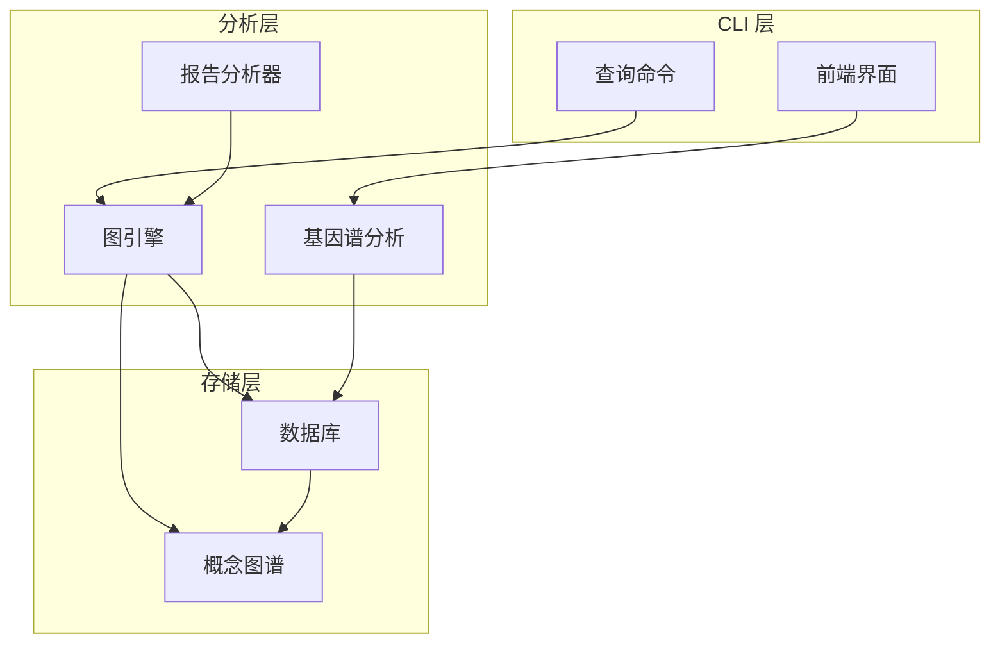
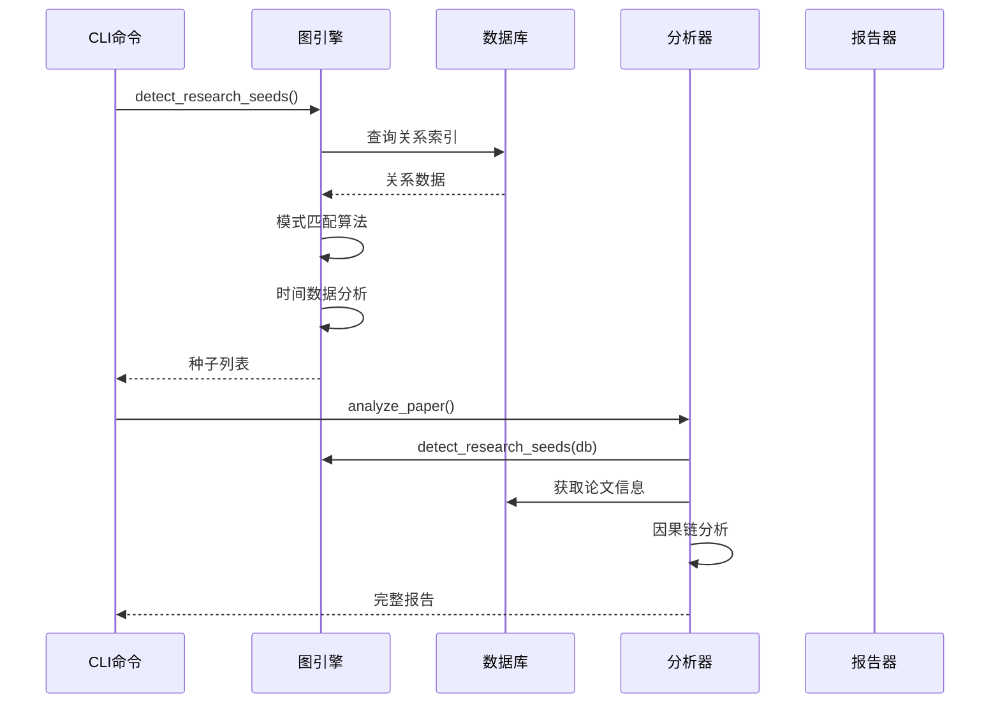
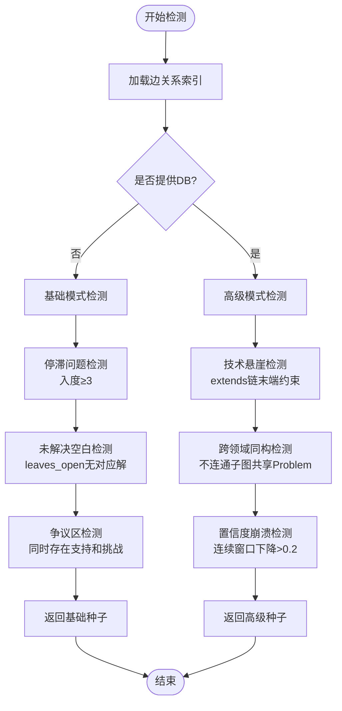
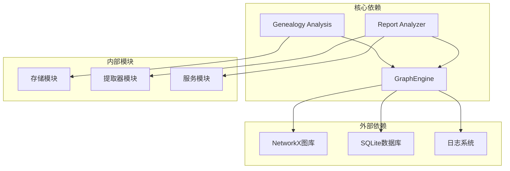

# 研究种子检测

<cite>
**本文档引用的文件**
- [engine.py](file://src/drbrain/graph/engine.py)
- [genealogy.py](file://src/drbrain/graph/genealogy.py)
- [analyzer.py](file://src/drbrain/report/analyzer.py)
- [query_commands.py](file://src/drbrain/cli/query_commands.py)
- [test_engine.py](file://tests/test_engine.py)
- [test_genealogy.py](file://tests/test_genealogy.py)
- [SKILL.md](file://skills/research-analysis/SKILL.md)
</cite>

## 目录
1. [简介](#简介)
2. [项目结构](#项目结构)
3. [核心组件](#核心组件)
4. [架构概览](#架构概览)
5. [详细组件分析](#详细组件分析)
6. [依赖分析](#依赖分析)
7. [性能考虑](#性能考虑)
8. [故障排除指南](#故障排除指南)
9. [结论](#结论)
10. [附录](#附录)

## 简介

研究种子检测是 DrBrain 系统中一个关键功能，用于从知识图谱中识别潜在的研究机会和前沿领域。该功能通过分析论文集合中的概念关系网络，自动发现知识空白、研究热点和前沿领域，为研究人员提供数据驱动的研究方向指导。

研究种子检测的核心价值在于：
- **知识空白识别**：自动发现未被充分研究或缺乏解决方案的概念领域
- **研究热点分析**：识别当前活跃度高但可能停滞的研究主题
- **前沿领域定位**：发现具有突破潜力的新兴研究方向
- **跨领域机会发现**：识别不同领域间的方法转移机会

## 项目结构

研究种子检测功能分布在多个模块中，形成了完整的分析流水线：



**图表来源**
- [engine.py:354-454](file://src/drbrain/graph/engine.py#L354-L454)
- [genealogy.py:684-753](file://src/drbrain/graph/genealogy.py#L684-L753)
- [analyzer.py:9-134](file://src/drbrain/report/analyzer.py#L9-L134)

**章节来源**
- [engine.py:1-1118](file://src/drbrain/graph/engine.py#L1-L1118)
- [genealogy.py:1-1001](file://src/drbrain/graph/genealogy.py#L1-L1001)
- [analyzer.py:1-231](file://src/drbrain/report/analyzer.py#L1-L231)

## 核心组件

### 图引擎 (GraphEngine)

图引擎是研究种子检测的核心组件，负责构建和操作知识图谱，并实现各种检测算法。

主要功能包括：
- **图模式匹配**：基于预定义的关系模式识别研究信号
- **时间数据分析**：结合论文发表年份进行时序分析
- **规则推理**：应用符号推理规则生成新的知识
- **种子检测**：识别不同类型的研究机会

### 基因谱分析 (Genealogy Analysis)

基因谱分析模块负责综合多种分析结果，生成全面的知识前沿报告。

关键特性：
- **多维度分析**：整合空白识别、争议分析、范式转换等
- **时间敏感性**：区分活跃和陈旧的研究空白
- **难度分类**：按来源章节类型对空白进行分类

### 报告分析器 (Report Analyzer)

报告分析器提供高级分析功能，包括因果链分析、假设生成和跨领域机会发现。

**章节来源**
- [engine.py:354-454](file://src/drbrain/graph/engine.py#L354-L454)
- [genealogy.py:684-753](file://src/drbrain/graph/genealogy.py#L684-L753)
- [analyzer.py:9-134](file://src/drbrain/report/analyzer.py#L9-L134)

## 架构概览

研究种子检测采用分层架构设计，确保功能模块的清晰分离和高效协作：



**图表来源**
- [query_commands.py:24-46](file://src/drbrain/cli/query_commands.py#L24-L46)
- [engine.py:354-454](file://src/drbrain/graph/engine.py#L354-L454)
- [analyzer.py:9-134](file://src/drbrain/report/analyzer.py#L9-L134)

## 详细组件分析

### detect_research_seeds 函数实现机制

`detect_research_seeds` 是研究种子检测的核心函数，实现了多种检测算法：

#### 基础检测模式

1. **停滞问题检测 (stale_problem)**：
   - 检测入度≥5且最近2年无新进展的问题
   - 使用时间窗口分析判断研究停滞状态
   - 提供置信度评估（0.85）

2. **未解决空白检测 (unaddressed_gap)**：
   - 识别有 leaves_open 边但无 solves/addresses 的空白
   - 统计相关论文数量作为强度指标
   - 不同场景下提供不同的置信度（0.8 vs 0.6）

3. **争议区检测 (debate_zone)**：
   - 同一目标同时存在 supports 和 challenges
   - 计算支持与挑战的比例
   - 提供置信度评估（0.75 vs 0.6）

#### 高级检测模式

当提供数据库连接时，还支持以下增强检测：

1. **技术悬崖检测 (technology_cliff)**：
   - 密集 extends 链条结束且受相关 Gap 约束的方法
   - 分析方法演化的瓶颈点
   - 置信度：0.7

2. **跨领域同构检测 (cross_domain_isomorphism)**：
   - 不同子图共享相同 Problem 的方法
   - 检测方法迁移机会
   - 置信度：0.65

3. **置信度崩溃检测 (confidence_collapse)**：
   - 连续两年窗口平均置信度下降>0.2
   - 检测范式转换信号
   - 置信度：0.8

#### 算法流程图



**图表来源**
- [engine.py:354-454](file://src/drbrain/graph/engine.py#L354-L454)
- [engine.py:458-622](file://src/drbrain/graph/engine.py#L458-L622)

**章节来源**
- [engine.py:354-454](file://src/drbrain/graph/engine.py#L354-L454)
- [engine.py:458-622](file://src/drbrain/graph/engine.py#L458-L622)

### 种子评分标准和筛选条件

#### 置信度评分体系

| 种子类型 | 置信度 | 评分依据 | 筛选条件 |
|---------|--------|----------|----------|
| stale_problem | 0.85 | 入度≥5且最近2年无进展 | 入度阈值≥5，时间窗口=2年 |
| unaddressed_gap | 0.8/0.6 | leaves_open边数 | 边数统计，DB提供时更高 |
| debate_zone | 0.75/0.6 | 支持vs挑战比例 | 同时存在支持和挑战 |
| technology_cliff | 0.7 | 约束关系强度 | Gap约束+演进历史 |
| cross_domain_isomorphism | 0.65 | 方法迁移潜力 | 不连通子图+共享Problem |
| confidence_collapse | 0.8 | 范式转换强度 | 连续窗口差异>0.2 |

#### 筛选条件详解

1. **基础模式阈值**：
   - 入度阈值：3（基础模式）vs 5（高级模式）
   - 时间窗口：2年（技术停滞）
   - 连接强度：4个以上不连通方法对

2. **DB增强模式**：
   - 利用论文发表年份进行时序分析
   - 结合概念置信度进行加权
   - 支持更复杂的SQL查询和统计

**章节来源**
- [engine.py:378-446](file://src/drbrain/graph/engine.py#L378-L446)
- [engine.py:458-622](file://src/drbrain/graph/engine.py#L458-L622)

### 实际代码示例

#### 从知识图谱中识别潜在研究机会

以下示例展示了如何使用研究种子检测功能：

```python
# 基础种子检测（仅图模式）
from drbrain.graph.engine import GraphEngine
from drbrain.storage.database import Database

# 创建图引擎实例
graph = GraphEngine()
db = Database("path/to/db")

# 加载数据库中的图数据
graph.load_from_db(db)

# 检测研究种子
seeds = graph.detect_research_seeds(db)
print(f"发现 {len(seeds)} 个研究种子")

# 分类显示不同类型的种子
for seed in seeds:
    print(f"[{seed['type']}] {seed['concept']}: {seed['description']}")
```

#### 综合评估问题领域、方法空白和应用前景

```python
# 完整分析流程
from drbrain.report.analyzer import analyze_paper

# 分析单篇论文
report = analyze_paper(db, graph, "paper_id", full=True)

# 获取研究种子
seeds = report["seeds"]
print("研究种子：")
for seed in seeds:
    print(f"- {seed['concept']}: {seed['description']}")
    if 'suggested_solutions' in seed:
        print(f"  建议方案: {seed['suggested_solutions']}")

# 获取因果链分析
chains = report["causal_chains"]
print("因果链：")
for chain in chains:
    print(f"- {chain['source']} → {chain['target']} (via: {chain['via']})")
```

#### 知识前沿综合报告

```python
# 生成知识前沿报告
from drbrain.graph.genealogy import analyze_frontier

frontier = analyze_frontier(db)
print("知识前沿报告：")
print(f"活跃空白: {len(frontier['active_gaps'])}")
print(f"争议: {len(frontier['debates'])}")
print(f"范式转换: {len(frontier['paradigm_shifts'])}")

# 显示活跃空白
for gap in frontier['active_gaps']:
    print(f"- {gap['label']} ({gap['year']}): {gap['provenance']}")
```

**章节来源**
- [analyzer.py:9-134](file://src/drbrain/report/analyzer.py#L9-L134)
- [genealogy.py:684-753](file://src/drbrain/graph/genealogy.py#L684-L753)

## 依赖分析

研究种子检测功能涉及多个模块间的复杂依赖关系：



**图表来源**
- [engine.py:1-14](file://src/drbrain/graph/engine.py#L1-L14)
- [genealogy.py:1-12](file://src/drbrain/graph/genealogy.py#L1-L12)
- [analyzer.py:1-7](file://src/drbrain/report/analyzer.py#L1-L7)

### 组件耦合度分析

- **高内聚低耦合**：各模块职责明确，接口清晰
- **数据流清晰**：从图构建到分析输出形成完整数据流
- **可扩展性强**：新增检测模式不影响现有功能

**章节来源**
- [engine.py:1-1118](file://src/drbrain/graph/engine.py#L1-L1118)
- [genealogy.py:1-1001](file://src/drbrain/graph/genealogy.py#L1-L1001)
- [analyzer.py:1-231](file://src/drbrain/report/analyzer.py#L1-L231)

## 性能考虑

### 时间复杂度分析

1. **基础检测模式**：
   - 时间复杂度：O(E)，其中 E 为边数
   - 空间复杂度：O(V+E)，其中 V 为节点数

2. **DB增强模式**：
   - SQL查询：O(log N + K)，N 为表大小，K 为结果数
   - 复杂度：O(E + log N + K)

3. **批量分析**：
   - 可并行处理多个论文
   - 内存使用与论文数量线性相关

### 优化策略

1. **索引优化**：
   - 在关系类型上建立索引
   - 优化时间范围查询

2. **缓存机制**：
   - 缓存频繁访问的图数据
   - 存储中间计算结果

3. **增量更新**：
   - 支持增量训练嵌入向量
   - 避免全量重新计算

## 故障排除指南

### 常见问题及解决方案

#### 1. 种子检测结果为空

**可能原因**：
- 图数据不足或质量差
- 关系标签不正确
- 数据库连接问题

**解决方案**：
- 检查图构建过程
- 验证关系类型一致性
- 确认数据库权限

#### 2. 性能问题

**可能原因**：
- 图规模过大
- 缺少必要的索引
- 内存不足

**解决方案**：
- 实施分批处理
- 添加数据库索引
- 增加内存配置

#### 3. 精度问题

**可能原因**：
- 检测阈值设置不当
- 数据噪声影响
- 模式匹配误判

**解决方案**：
- 调整阈值参数
- 数据清洗和验证
- 手动审核关键结果

**章节来源**
- [test_engine.py:238-279](file://tests/test_engine.py#L238-L279)
- [test_genealogy.py:1217-1281](file://tests/test_genealogy.py#L1217-L1281)

## 结论

研究种子检测功能为 DrBrain 系统提供了强大的知识发现能力。通过多层次的检测算法和综合分析框架，该功能能够：

1. **自动化程度高**：减少人工分析工作量
2. **准确性强**：基于严格的图模式匹配和统计分析
3. **实用性好**：直接指导具体的研究方向选择
4. **可扩展性强**：支持自定义检测模式和阈值调整

该功能在指导研究方向、发现新领域和促进跨学科合作方面发挥着重要作用，是现代科研工作中不可或缺的智能工具。

## 附录

### CLI 使用示例

```bash
# 基础种子检测
drbrain seed

# JSON格式输出
drbrain seed --json

# 工作空间限定
drbrain seed -w my-workspace

# 完整论文分析
drbrain analyze paper_id --full

# 知识前沿报告
drbrain frontier
```

### 相关技能参考

- **research-analysis**：综合研究分析技能
- **knowledge-cartography**：知识地图绘制
- **kg-reason**：知识图谱推理
- **graph**：图探索工具