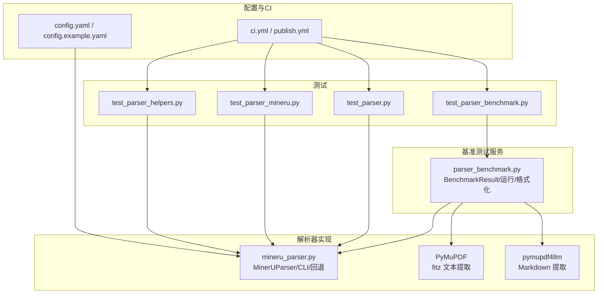
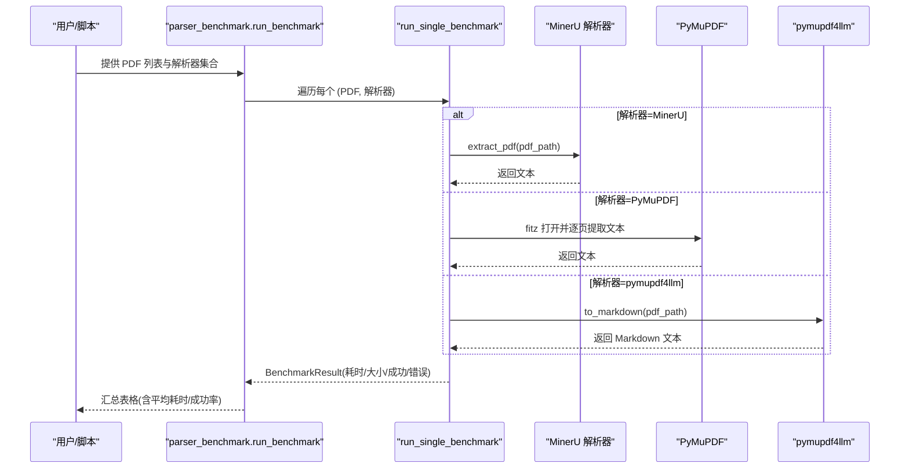
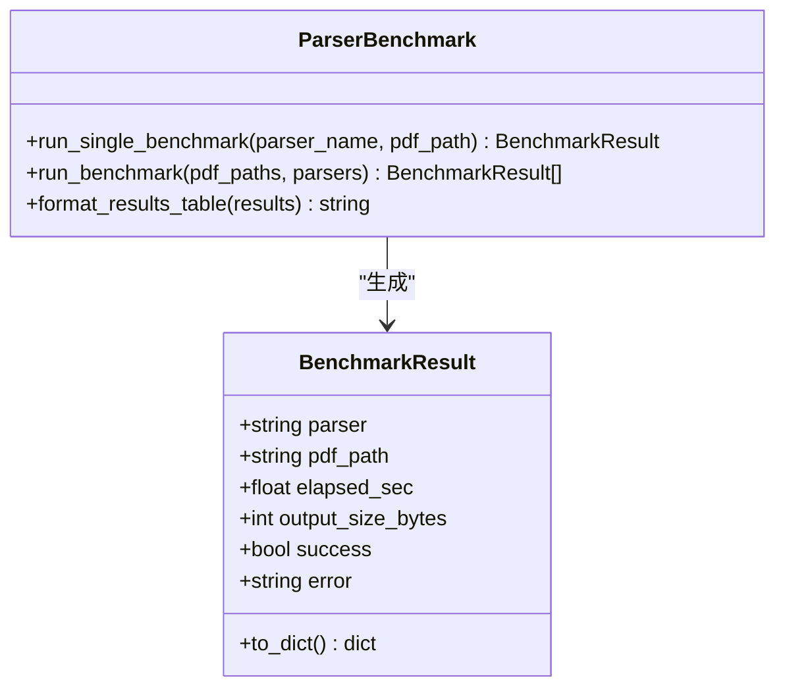
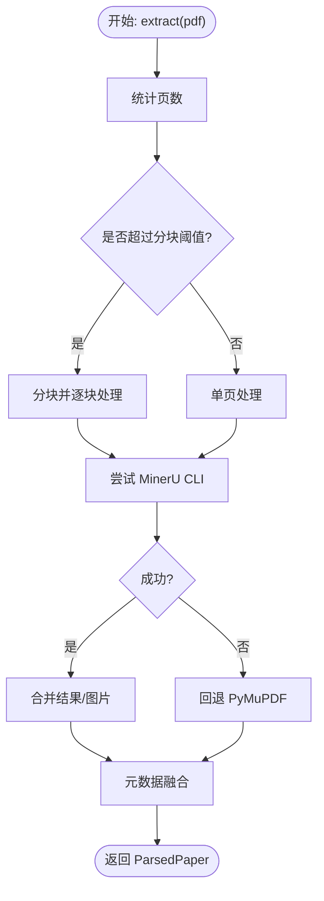
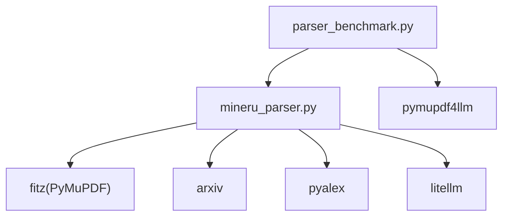

# 解析器基准测试

<cite>
**本文档引用的文件**
- [src/drbrain/services/parser_benchmark.py](file://src/drbrain/services/parser_benchmark.py)
- [tests/test_parser_benchmark.py](file://tests/test_parser_benchmark.py)
- [src/drbrain/parser/mineru_parser.py](file://src/drbrain/parser/mineru_parser.py)
- [tests/test_parser.py](file://tests/test_parser.py)
- [tests/test_parser_mineru.py](file://tests/test_parser_mineru.py)
- [tests/test_parser_helpers.py](file://tests/test_parser_helpers.py)
- [.github/workflows/ci.yml](file://.github/workflows/ci.yml)
- [.github/workflows/publish.yml](file://.github/workflows/publish.yml)
- [config.yaml](file://config.yaml)
- [config.example.yaml](file://config.example.yaml)
</cite>

## 目录
1. [简介](#简介)
2. [项目结构](#项目结构)
3. [核心组件](#核心组件)
4. [架构总览](#架构总览)
5. [详细组件分析](#详细组件分析)
6. [依赖分析](#依赖分析)
7. [性能考量](#性能考量)
8. [故障排查指南](#故障排查指南)
9. [结论](#结论)
10. [附录](#附录)

## 简介
本文件面向 DrBrain 的解析器基准测试功能，提供从设计原理到实践操作的完整技术文档。重点涵盖以下方面：
- 基准测试设计：对比 PyMuPDF、MinerU（通过 CLI 调用）与 pymupdf4llm 三种解析器在真实 PDF 上的处理时延、输出大小与稳定性。
- 评估指标：解析时延（秒）、输出文本字节数、成功/失败状态与错误摘要；并提供按解析器分组的汇总统计。
- 测试数据集与评估协议：如何准备 PDF 数据集、选择解析器组合、批量执行与结果格式化。
- 运行方式与结果分析：命令行或脚本化运行、结果表格化展示、差异对比与趋势分析。
- 优化建议与调优：解析器参数、外部依赖可用性、重试策略与回退路径对性能与稳定性的权衡。
- 自动化与持续集成：测试与覆盖率检查、发布流程。

## 项目结构
与解析器基准测试直接相关的代码与测试分布如下：
- 服务层：解析器基准测试核心逻辑位于服务模块，负责计时、调用具体解析器、收集输出大小与异常。
- 解析器实现：MinerU 解析器封装了 CLI 调用、重试、回退与元数据融合，PyMuPDF 与 pymupdf4llm 则作为直接调用示例。
- 测试：针对基准测试工具与解析器实现分别编写单元测试，覆盖关键路径与边界条件。
- 配置：基础配置文件定义 LLM 与解析器相关参数，便于在实际环境中启用/禁用特性。
- CI/CD：GitHub Actions 定义了代码检查、测试与覆盖率校验，以及发布流程。

图表来源
- [src/drbrain/services/parser_benchmark.py:1-154](file://src/drbrain/services/parser_benchmark.py#L1-L154)
- [src/drbrain/parser/mineru_parser.py:1-932](file://src/drbrain/parser/mineru_parser.py#L1-L932)
- [tests/test_parser_benchmark.py:1-77](file://tests/test_parser_benchmark.py#L1-L77)
- [tests/test_parser.py:1-90](file://tests/test_parser.py#L1-L90)
- [tests/test_parser_mineru.py:1-172](file://tests/test_parser_mineru.py#L1-L172)
- [tests/test_parser_helpers.py:1-847](file://tests/test_parser_helpers.py#L1-L847)
- [config.yaml:1-72](file://config.yaml#L1-L72)
- [.github/workflows/ci.yml:1-38](file://.github/workflows/ci.yml#L1-L38)
- [.github/workflows/publish.yml:1-51](file://.github/workflows/publish.yml#L1-L51)

章节来源
- [src/drbrain/services/parser_benchmark.py:1-154](file://src/drbrain/services/parser_benchmark.py#L1-L154)
- [src/drbrain/parser/mineru_parser.py:1-932](file://src/drbrain/parser/mineru_parser.py#L1-L932)
- [tests/test_parser_benchmark.py:1-77](file://tests/test_parser_benchmark.py#L1-L77)
- [tests/test_parser.py:1-90](file://tests/test_parser.py#L1-L90)
- [tests/test_parser_mineru.py:1-172](file://tests/test_parser_mineru.py#L1-L172)
- [tests/test_parser_helpers.py:1-847](file://tests/test_parser_helpers.py#L1-L847)
- [config.yaml:1-72](file://config.yaml#L1-L72)
- [.github/workflows/ci.yml:1-38](file://.github/workflows/ci.yml#L1-L38)
- [.github/workflows/publish.yml:1-51](file://.github/workflows/publish.yml#L1-L51)

## 核心组件
- 基准测试结果数据类：记录单次解析的解析器名称、输入路径、耗时、输出大小、成功标志与错误信息，并支持导出为字典。
- 解析器注册表：定义可测试的解析器集合及其内部执行函数映射。
- 单次基准测试：根据解析器键选择对应实现，计算耗时与输出大小，捕获异常并返回失败结果。
- 批量基准测试：遍历 PDF 列表与解析器列表，生成每种组合的结果。
- 结果格式化：以文本表格形式输出逐项结果与按解析器的汇总统计（成功数、平均耗时）。

章节来源
- [src/drbrain/services/parser_benchmark.py:10-154](file://src/drbrain/services/parser_benchmark.py#L10-L154)

## 架构总览
下图展示了基准测试的端到端流程：从输入 PDF 列表与解析器集合出发，依次调用各解析器实现，收集耗时与输出大小，最终汇总为可读表格。

图表来源
- [src/drbrain/services/parser_benchmark.py:39-119](file://src/drbrain/services/parser_benchmark.py#L39-L119)
- [src/drbrain/parser/mineru_parser.py:120-314](file://src/drbrain/parser/mineru_parser.py#L120-L314)

## 详细组件分析

### 组件A：基准测试服务（parser_benchmark）
- 设计要点
  - 使用单调时钟进行高精度计时，避免系统时间回拨影响。
  - 对 PyMuPDF 采用逐页文本拼接，确保与真实解析一致。
  - 对 pymupdf4llm 直接生成 Markdown 文本，便于后续结构化处理。
  - 对 MinerU 通过统一入口函数提取文本，便于后续扩展为结构化对象。
  - 异常捕获并记录，保证测试不中断且保留错误上下文。
- 关键接口
  - run_single_benchmark：单次解析测试。
  - run_benchmark：批量测试。
  - format_results_table：结果表格化与汇总。
- 复杂度分析
  - 时间复杂度：O(N×M)，N 为 PDF 数量，M 为解析器数量；每次解析主要受 I/O 与解析算法决定。
  - 空间复杂度：O(N×M)，存储所有 BenchmarkResult。
- 优化机会
  - 并发执行：当前串行顺序执行，可引入线程池/进程池提升吞吐。
  - 缓存中间产物：如已解析的 Markdown 可缓存以复用。
  - 输出大小采样：对超大输出仅统计关键指标，减少内存占用。

图表来源
- [src/drbrain/services/parser_benchmark.py:10-154](file://src/drbrain/services/parser_benchmark.py#L10-L154)

章节来源
- [src/drbrain/services/parser_benchmark.py:10-154](file://src/drbrain/services/parser_benchmark.py#L10-L154)

### 组件B：MinerU 解析器（mineru_parser）
- 设计要点
  - 主解析流程：优先尝试 MinerU CLI，若不可用或失败则回退至 PyMuPDF。
  - 重试机制：对 CLI 调用设置最大重试次数与指数退避，提升鲁棒性。
  - 元数据增强：结合 arXiv、CrossRef、OpenAlex、Semantic Scholar 等源进行标题、年份、DOI、引用数等交叉验证。
  - 分块处理：对超过阈值的 PDF 进行分块解析并合并，避免单次调用超限。
- 关键接口
  - MinerUParser.extract：主入口，负责分页、分块、回退与元数据融合。
  - _try_mineru_open_api：CLI 调用与重试控制。
  - _fallback_pymupdf：PyMuPDF 回退实现。
  - _resolve_metadata：多源元数据融合策略。
- 复杂度分析
  - 时间复杂度：受 PDF 页数、CLI 调用次数与外部 API 响应时间影响；分块后整体仍为线性增长。
  - 空间复杂度：临时目录与合并后的 Markdown 内存占用。
- 优化机会
  - 合理设置分块阈值与重试参数，平衡成功率与耗时。
  - 在可用时优先使用 CLI，避免不必要的回退路径。

图表来源
- [src/drbrain/parser/mineru_parser.py:120-314](file://src/drbrain/parser/mineru_parser.py#L120-L314)
- [src/drbrain/parser/mineru_parser.py:347-423](file://src/drbrain/parser/mineru_parser.py#L347-L423)

章节来源
- [src/drbrain/parser/mineru_parser.py:1-932](file://src/drbrain/parser/mineru_parser.py#L1-L932)

### 组件C：测试与验证
- 基准测试工具测试
  - 覆盖导入、数据类导出、未知解析器处理、表格打印等场景。
- MinerU 解析器测试
  - 覆盖重试、回退、CLI 参数构造、元数据提取、分块合并、图像合并等关键路径。
- 辅助函数测试
  - 覆盖 DOI/arXiv 规范化、标题/年份/ID 提取、段落过滤、回退策略等。

章节来源
- [tests/test_parser_benchmark.py:1-77](file://tests/test_parser_benchmark.py#L1-L77)
- [tests/test_parser.py:1-90](file://tests/test_parser.py#L1-L90)
- [tests/test_parser_mineru.py:1-172](file://tests/test_parser_mineru.py#L1-L172)
- [tests/test_parser_helpers.py:1-847](file://tests/test_parser_helpers.py#L1-L847)

## 依赖分析
- 内部依赖
  - parser_benchmark 依赖 mineru_parser 的 extract_pdf 入口，用于 MinerU 解析。
  - mineru_parser 依赖外部 CLI 工具与多个第三方库（如 arxiv、pyalex、litellm 等），并在不可用时回退至 PyMuPDF。
- 外部依赖
  - PyMuPDF（fitz）：文本与图像提取。
  - pymupdf4llm：将 PDF 转换为 Markdown。
  - arxiv/pyalex/litellm：元数据获取与令牌计数。
- 配置依赖
  - config.yaml 中的 llm、mineru、api 等配置影响解析器行为与外部 API 访问能力。

图表来源
- [src/drbrain/services/parser_benchmark.py:71-81](file://src/drbrain/services/parser_benchmark.py#L71-L81)
- [src/drbrain/parser/mineru_parser.py:378-423](file://src/drbrain/parser/mineru_parser.py#L378-L423)

章节来源
- [src/drbrain/services/parser_benchmark.py:1-154](file://src/drbrain/services/parser_benchmark.py#L1-L154)
- [src/drbrain/parser/mineru_parser.py:1-932](file://src/drbrain/parser/mineru_parser.py#L1-L932)
- [config.yaml:1-72](file://config.yaml#L1-L72)

## 性能考量
- 解析时延
  - 由计时器与解析器实现共同决定。PyMuPDF 与 pymupdf4llm 为纯本地解析，MinerU 需要外部 CLI 调用与可能的重试，通常时延更高但质量更优。
- 输出大小
  - 以解析后文本的字节数衡量，可用于评估解析完整性与冗余度。
- 成功率
  - 未知解析器键、CLI 不可用、网络异常、PDF 加密/空页等情况会导致失败。
- 资源消耗
  - CPU：解析算法复杂度；I/O：PDF 文件读取与临时目录写入；内存：大型 PDF 的分块与合并。
- 优化建议
  - 合理设置分块阈值与重试参数，避免过度重试导致时延放大。
  - 在可用时启用 MinerU CLI，必要时再回退至 PyMuPDF。
  - 对大批量测试引入并发执行与结果缓存，缩短总耗时。
  - 预先过滤无效 PDF（加密、空页）以减少失败与重试。

## 故障排查指南
- 常见问题
  - 未知解析器键：检查解析器注册表与传入名称是否匹配。
  - CLI 不可用：确认 mineru-open-api 是否安装在 PATH 中，或在配置中提供有效 token。
  - 外部 API 失败：检查网络连通性与 API 密钥配置。
  - PDF 无法打开：检查文件是否存在、权限与格式有效性。
- 定位手段
  - 查看 BenchmarkResult.error 字段中的异常描述。
  - 在测试中使用断言定位具体失败点（如未知解析器、表格打印、CLI 参数构造等）。
- 修复建议
  - 补充缺失的依赖或配置项。
  - 调整重试次数与延迟，平衡成功率与时延。
  - 对于加密或损坏的 PDF，提前过滤或提示用户修正。

章节来源
- [src/drbrain/services/parser_benchmark.py:49-101](file://src/drbrain/services/parser_benchmark.py#L49-L101)
- [tests/test_parser_benchmark.py:46-76](file://tests/test_parser_benchmark.py#L46-L76)
- [tests/test_parser_mineru.py:1-172](file://tests/test_parser_mineru.py#L1-L172)

## 结论
解析器基准测试为 DrBrain 的 PDF 解析能力提供了可量化、可重复的评估手段。通过统一的计时、输出大小统计与结果汇总，能够直观对比不同解析器在时延、稳定性与资源消耗方面的表现。结合配置与测试体系，可在持续集成中保持质量基线，并为解析器优化与调参提供数据支撑。

## 附录

### 如何运行基准测试
- 准备 PDF 数据集：将待测 PDF 放置在本地目录，确保可读权限。
- 选择解析器：默认测试全部已注册解析器（PyMuPDF、MinerU、pymupdf4llm）。
- 执行测试：调用批量基准测试函数，传入 PDF 路径列表与可选解析器列表。
- 查看结果：使用表格格式化函数输出逐项与汇总统计。

章节来源
- [src/drbrain/services/parser_benchmark.py:104-154](file://src/drbrain/services/parser_benchmark.py#L104-L154)

### 评估指标与解读
- 解析时延（秒）：越低越好；注意区分解析器类型与 PDF 大小。
- 输出大小（字节）：反映解析完整性；过大可能包含冗余信息。
- 成功/失败：关注失败率与失败原因（未知解析器、CLI 不可用、外部 API 错误等）。
- 汇总统计：按解析器分组的平均耗时与成功率，便于横向对比。

章节来源
- [src/drbrain/services/parser_benchmark.py:122-154](file://src/drbrain/services/parser_benchmark.py#L122-L154)

### 测试数据集构建与评估协议
- 数据集构建：包含多种类型与规模的 PDF（含长文档、公式、表格、图像等），确保覆盖典型场景。
- 评估协议：固定解析器组合与参数，多次运行取均值与方差；记录失败案例以便复现与改进。
- 结果归档：保存表格与原始日志，便于后续回归分析。

### 解析器优化与调优技巧
- MinerU CLI：合理设置 token、模型与 OCR 开关；调整分块阈值与重试参数。
- PyMuPDF：针对不同 PDF 类型选择合适的提取模式；避免不必要的图像处理。
- pymupdf4llm：关注 Markdown 质量与结构一致性，必要时结合后续结构化处理。

### 测试自动化与持续集成
- CI 流程：代码检查（Ruff）、格式检查（Ruff）、单元测试（pytest）与覆盖率校验。
- 发布流程：根据标签与发布事件自动发布到 TestPyPI 或 PyPI。

章节来源
- [.github/workflows/ci.yml:1-38](file://.github/workflows/ci.yml#L1-L38)
- [.github/workflows/publish.yml:1-51](file://.github/workflows/publish.yml#L1-L51)