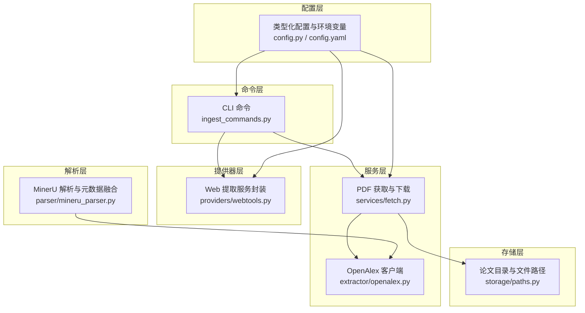
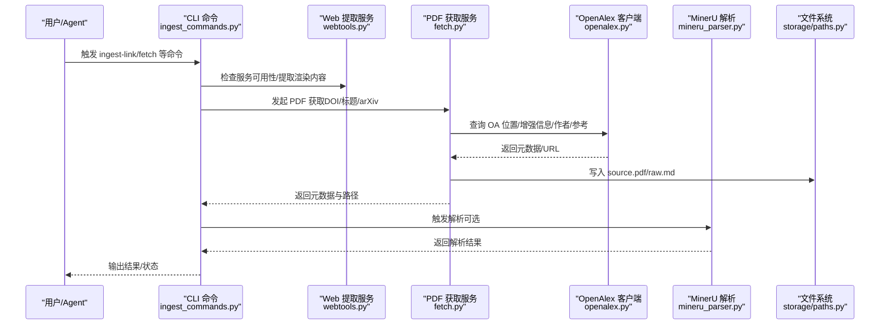
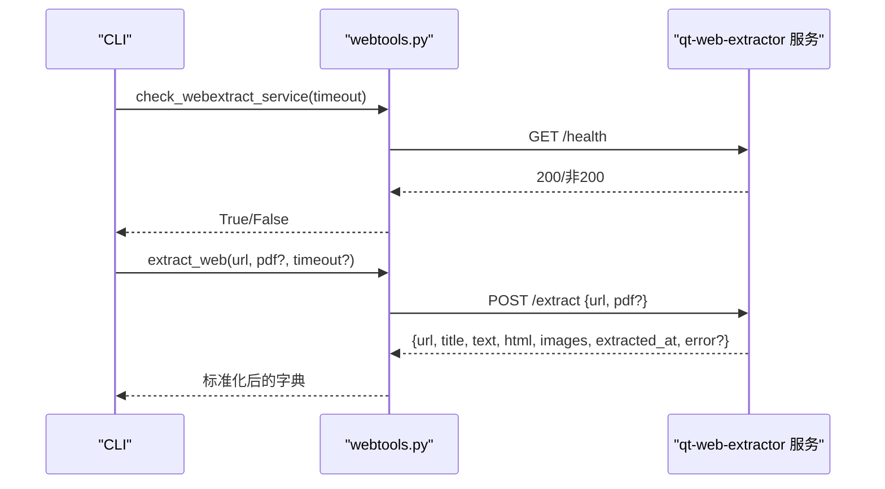
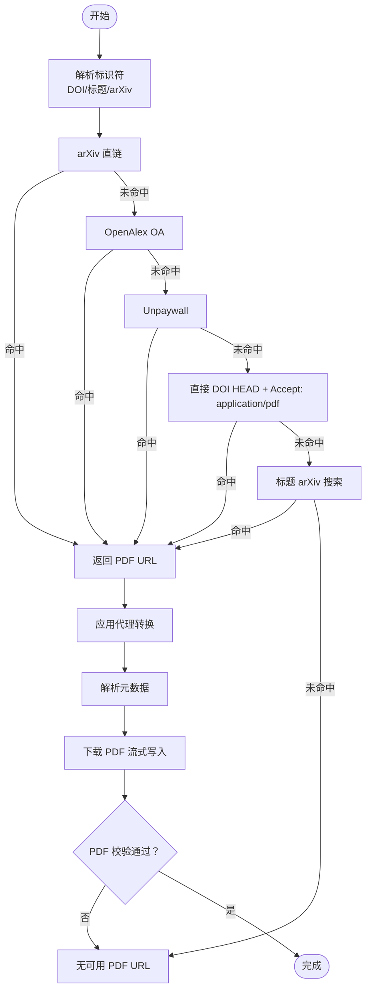
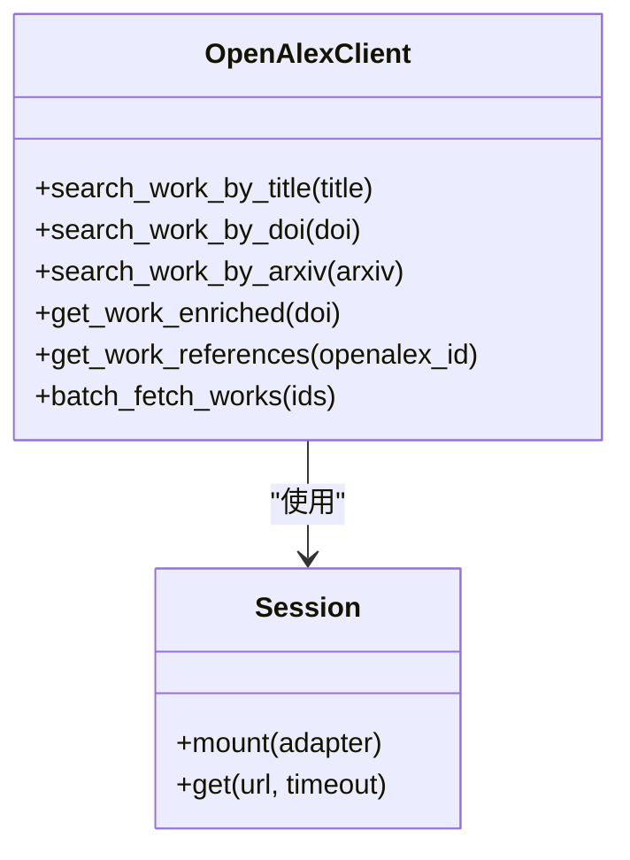
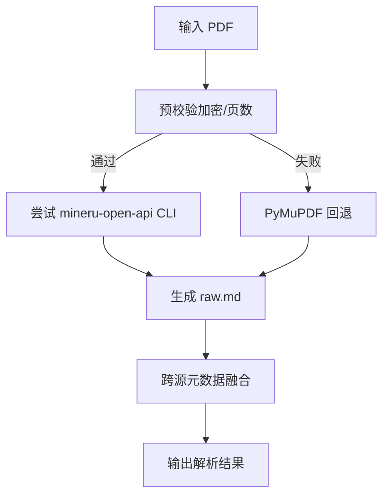
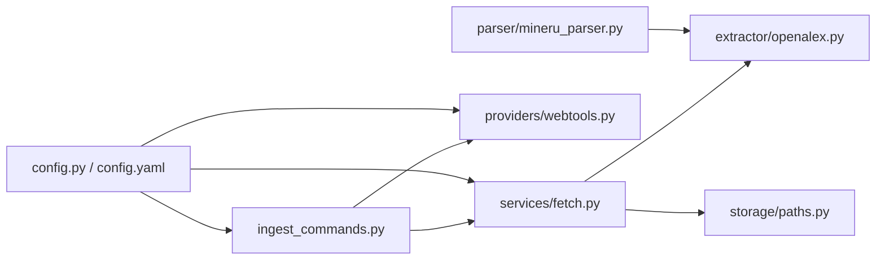

# API 集成

<cite>
**本文引用的文件**
- [src/drbrain/providers/webtools.py](file://src/drbrain/providers/webtools.py)
- [src/drbrain/services/fetch.py](file://src/drbrain/services/fetch.py)
- [src/drbrain/extractor/openalex.py](file://src/drbrain/extractor/openalex.py)
- [src/drbrain/parser/mineru_parser.py](file://src/drbrain/parser/mineru_parser.py)
- [src/drbrain/storage/paths.py](file://src/drbrain/storage/paths.py)
- [src/drbrain/config.py](file://src/drbrain/config.py)
- [config.yaml](file://config.yaml)
- [src/drbrain/cli/ingest_commands.py](file://src/drbrain/cli/ingest_commands.py)
- [src/drbrain/exceptions.py](file://src/drbrain/exceptions.py)
- [skills/ingest-link/SKILL.md](file://skills/ingest-link/SKILL.md)
</cite>

## 目录
1. [简介](#简介)
2. [项目结构](#项目结构)
3. [核心组件](#核心组件)
4. [架构总览](#架构总览)
5. [详细组件分析](#详细组件分析)
6. [依赖分析](#依赖分析)
7. [性能考虑](#性能考虑)
8. [故障排除指南](#故障排除指南)
9. [结论](#结论)
10. [附录](#附录)

## 简介
本文件面向 DrBrain 的 API 集成功能，系统性阐述以下能力与实现：
- 外部 Web 提取服务（qt-web-extractor）的集成方式、HTTP 请求处理、错误处理与健康检查
- PDF 获取与下载流程：多阶段回退、代理与校验、元数据解析
- HTTP 请求超时、重试策略、连接管理与响应解析
- 环境变量配置、服务健康检查与故障排除方法
- 性能优化建议与最佳实践

## 项目结构
围绕 API 集成的关键模块包括：
- 提供器层：外部 Web 提取服务封装（webtools）
- 服务层：PDF 获取与下载（fetch）、OpenAlex API 客户端（openalex）
- 解析层：MinerU PDF 解析与跨源元数据融合（mineru_parser）
- 存储层：论文目录与文件路径（storage/paths）
- 配置层：类型化配置与环境变量解析（config）
- 命令层：CLI 入口（ingest_commands），以及技能文档（SKILL.md）

图表来源
- [src/drbrain/cli/ingest_commands.py:464-567](file://src/drbrain/cli/ingest_commands.py#L464-L567)
- [src/drbrain/services/fetch.py:13-345](file://src/drbrain/services/fetch.py#L13-L345)
- [src/drbrain/providers/webtools.py:1-135](file://src/drbrain/providers/webtools.py#L1-L135)
- [src/drbrain/extractor/openalex.py:1-421](file://src/drbrain/extractor/openalex.py#L1-L421)
- [src/drbrain/parser/mineru_parser.py:1-932](file://src/drbrain/parser/mineru_parser.py#L1-L932)
- [src/drbrain/storage/paths.py:1-29](file://src/drbrain/storage/paths.py#L1-L29)
- [src/drbrain/config.py:1-292](file://src/drbrain/config.py#L1-L292)
- [config.yaml:1-72](file://config.yaml#L1-L72)

章节来源
- [src/drbrain/cli/ingest_commands.py:464-567](file://src/drbrain/cli/ingest_commands.py#L464-L567)
- [src/drbrain/services/fetch.py:13-345](file://src/drbrain/services/fetch.py#L13-L345)
- [src/drbrain/providers/webtools.py:1-135](file://src/drbrain/providers/webtools.py#L1-L135)
- [src/drbrain/extractor/openalex.py:1-421](file://src/drbrain/extractor/openalex.py#L1-L421)
- [src/drbrain/parser/mineru_parser.py:1-932](file://src/drbrain/parser/mineru_parser.py#L1-L932)
- [src/drbrain/storage/paths.py:1-29](file://src/drbrain/storage/paths.py#L1-L29)
- [src/drbrain/config.py:1-292](file://src/drbrain/config.py#L1-L292)
- [config.yaml:1-72](file://config.yaml#L1-L72)

## 核心组件
- 外部 Web 提取服务封装（webtools）
  - 支持通过环境变量配置服务地址与请求超时
  - 封装 HTTP JSON POST 请求，统一处理异常与返回值
  - 提供健康检查接口
- PDF 获取与下载（fetch）
  - 多阶段回退：arXiv → OpenAlex OA → Unpaywall → 直接 DOI → 标题 arXiv 搜索
  - 支持机构代理（ezproxy/url_prefix）转换
  - 下载时进行内容类型检测与 PDF 校验
  - 元数据解析：优先 OpenAlex，其次 arXiv，最后标题搜索
- OpenAlex 客户端（openalex）
  - 使用会话与重试适配器，统一处理 429/5xx 与速率限制
  - 提供工作查询、增强信息、作者信息、参考文献批量获取等
- MinerU 解析与跨源元数据融合（mineru_parser）
  - 通过 CLI 与 PyMuPDF 双通道提取 PDF 文本
  - 融合 arXiv、CrossRef、OpenAlex、S2、DeepXiv 等多源元数据
- 存储路径（storage/paths）
  - 统一论文目录、原始 Markdown、树 JSON、源 PDF、图片目录的路径生成
- 配置（config）
  - 类型化配置数据类，支持 YAML 加载、本地覆盖与环境变量解析
  - 提供 fetch 与 webtools 的默认参数与行为控制

章节来源
- [src/drbrain/providers/webtools.py:1-135](file://src/drbrain/providers/webtools.py#L1-L135)
- [src/drbrain/services/fetch.py:13-345](file://src/drbrain/services/fetch.py#L13-L345)
- [src/drbrain/extractor/openalex.py:1-421](file://src/drbrain/extractor/openalex.py#L1-L421)
- [src/drbrain/parser/mineru_parser.py:1-932](file://src/drbrain/parser/mineru_parser.py#L1-L932)
- [src/drbrain/storage/paths.py:1-29](file://src/drbrain/storage/paths.py#L1-L29)
- [src/drbrain/config.py:1-292](file://src/drbrain/config.py#L1-L292)
- [config.yaml:1-72](file://config.yaml#L1-L72)

## 架构总览
DrBrain 的 API 集成以“命令层 → 服务层 → 提供器层/解析层”的分层设计组织，确保职责清晰、可测试与可扩展。

图表来源
- [src/drbrain/cli/ingest_commands.py:464-567](file://src/drbrain/cli/ingest_commands.py#L464-L567)
- [src/drbrain/providers/webtools.py:1-135](file://src/drbrain/providers/webtools.py#L1-L135)
- [src/drbrain/services/fetch.py:13-345](file://src/drbrain/services/fetch.py#L13-L345)
- [src/drbrain/extractor/openalex.py:1-421](file://src/drbrain/extractor/openalex.py#L1-L421)
- [src/drbrain/parser/mineru_parser.py:1-932](file://src/drbrain/parser/mineru_parser.py#L1-L932)
- [src/drbrain/storage/paths.py:1-29](file://src/drbrain/storage/paths.py#L1-L29)

## 详细组件分析

### 外部 Web 提取服务（qt-web-extractor）集成
- 环境变量
  - WEBEXTRACT_URL 或 QT_WEB_EXTRACTOR_URL：服务基础地址（末尾斜杠会被清理）
  - WEBEXTRACT_TIMEOUT：默认超时秒数（字符串转浮点，失败回退为 60）
- HTTP 请求处理
  - JSON POST 到 /extract，自动设置 Content-Type
  - 统一捕获 HTTPError/URLError/OSError/ValueError 并记录日志，返回带 error 字段的结果
- 响应解析
  - 成功：返回 url/title/text/html/images/extracted_at/error
  - 失败：仅 error，其余字段为空
- 健康检查
  - GET /health，超时默认 3 秒，非 200 即不可达

图表来源
- [src/drbrain/providers/webtools.py:1-135](file://src/drbrain/providers/webtools.py#L1-L135)

章节来源
- [src/drbrain/providers/webtools.py:1-135](file://src/drbrain/providers/webtools.py#L1-L135)
- [skills/ingest-link/SKILL.md:1-45](file://skills/ingest-link/SKILL.md#L1-L45)

### PDF 获取与下载（多阶段回退、代理、校验、元数据解析）
- 回退顺序（可配置）：arXiv → OpenAlex OA → Unpaywall → 直接 DOI → 标题 arXiv 搜索
- 代理支持
  - 支持两种模式：ezproxy（域名替换）与 url_prefix（前缀拼接）
  - 通过配置项 institutional_proxy 与 proxy_type 控制
- 下载与校验
  - 使用流式下载与分块写入
  - 通过读取首字节与 Content-Type 判断是否为 PDF
  - 文件大小为 0 时删除空文件并返回失败
- 元数据解析
  - 优先 OpenAlex DOI 查询；其次 arXiv 标题/年份；最后标题搜索
  - 生成临时 local_id，后续由去重引擎替换
- CLI 集成
  - ingest-link 命令在确认服务可达后执行提取与入库
  - fetch 命令直接发起 PDF 获取并触发入库流程

图表来源
- [src/drbrain/services/fetch.py:13-345](file://src/drbrain/services/fetch.py#L13-L345)

章节来源
- [src/drbrain/services/fetch.py:13-345](file://src/drbrain/services/fetch.py#L13-L345)
- [src/drbrain/storage/paths.py:1-29](file://src/drbrain/storage/paths.py#L1-L29)
- [src/drbrain/cli/ingest_commands.py:464-567](file://src/drbrain/cli/ingest_commands.py#L464-L567)

### OpenAlex API 客户端（重试、会话、字段选择）
- 会话与重试
  - 使用 HTTPAdapter + Retry，对 429/5xx 与 408/504 等进行指数退避重试
  - 全局单例 Session，避免重复创建连接
- 关键接口
  - 按标题/DOI/ArXiv 查询工作，返回标准化元数据
  - 获取增强信息（含 abstract、cited_by_count、作者、卷期页码等）
  - 批量获取参考文献 ID 并拉取基本信息
- 超时与容错
  - 统一 10 秒超时，异常时记录日志并返回 None/空列表

图表来源
- [src/drbrain/extractor/openalex.py:1-421](file://src/drbrain/extractor/openalex.py#L1-L421)

章节来源
- [src/drbrain/extractor/openalex.py:1-421](file://src/drbrain/extractor/openalex.py#L1-L421)

### MinerU 解析与跨源元数据融合
- 解析流程
  - 优先调用 mineru-open-api CLI；若失败则回退到 PyMuPDF
  - 支持分页拆分与合并，避免超大 PDF 导致内存压力
- 元数据融合策略
  - arXiv → CrossRef → OpenAlex → S2 → DeepXiv 多源比对与一致性过滤
  - 基于文本锚点（年份）过滤 API 结果，提升准确性
  - 合并标题、年份、DOI、期刊、引用计数等字段

图表来源
- [src/drbrain/parser/mineru_parser.py:1-932](file://src/drbrain/parser/mineru_parser.py#L1-L932)

章节来源
- [src/drbrain/parser/mineru_parser.py:1-932](file://src/drbrain/parser/mineru_parser.py#L1-L932)

### 配置与环境变量
- 类型化配置
  - Config/Dataclass：提供 LLM、MinerU、API、目录、数据库、提取、队列、抓取、嵌入、备份等子配置
  - 支持 YAML 加载、本地覆盖、环境变量解析（${VAR}）
- 关键配置项（与 API 集成相关）
  - fetch：max_concurrent、timeout_per_fetch、user_agent、fallback_order、unpaywall_email、institutional_proxy、proxy_type
  - api：deepxiv_token、s2_api_key、s2_rate_limit、cache_ttl、crossref_email、openalex_token
  - dirs：papers 等目录路径
- 环境变量
  - WEBEXTRACT_URL / QT_WEB_EXTRACTOR_URL：Web 提取服务地址
  - WEBEXTRACT_TIMEOUT：Web 提取请求超时
  - DEEPXIV_TOKEN、S2_API_KEY、CROSSREF_EMAIL、OPENALEX_TOKEN 等用于各外部 API

章节来源
- [src/drbrain/config.py:1-292](file://src/drbrain/config.py#L1-L292)
- [config.yaml:1-72](file://config.yaml#L1-L72)
- [src/drbrain/providers/webtools.py:1-135](file://src/drbrain/providers/webtools.py#L1-L135)
- [src/drbrain/services/fetch.py:102-112](file://src/drbrain/services/fetch.py#L102-L112)

## 依赖分析
- 组件耦合
  - CLI 命令依赖 fetch 与 webtools；fetch 依赖 openalex 与存储路径
  - MinerU 解析依赖 openalex 与外部 CLI 工具
- 外部依赖
  - requests + urllib（HTTP 客户端与 URL 操作）
  - loguru（统一日志）
  - arxiv/pyalex/deepxiv_sdk 等第三方 SDK（按需导入）
- 循环依赖
  - 当前模块间无明显循环导入；解析器与客户端通过函数调用解耦

图表来源
- [src/drbrain/cli/ingest_commands.py:464-567](file://src/drbrain/cli/ingest_commands.py#L464-L567)
- [src/drbrain/services/fetch.py:13-345](file://src/drbrain/services/fetch.py#L13-L345)
- [src/drbrain/providers/webtools.py:1-135](file://src/drbrain/providers/webtools.py#L1-L135)
- [src/drbrain/extractor/openalex.py:1-421](file://src/drbrain/extractor/openalex.py#L1-L421)
- [src/drbrain/parser/mineru_parser.py:1-932](file://src/drbrain/parser/mineru_parser.py#L1-L932)
- [src/drbrain/storage/paths.py:1-29](file://src/drbrain/storage/paths.py#L1-L29)
- [src/drbrain/config.py:1-292](file://src/drbrain/config.py#L1-L292)
- [config.yaml:1-72](file://config.yaml#L1-L72)

章节来源
- [src/drbrain/cli/ingest_commands.py:464-567](file://src/drbrain/cli/ingest_commands.py#L464-L567)
- [src/drbrain/services/fetch.py:13-345](file://src/drbrain/services/fetch.py#L13-L345)
- [src/drbrain/providers/webtools.py:1-135](file://src/drbrain/providers/webtools.py#L1-L135)
- [src/drbrain/extractor/openalex.py:1-421](file://src/drbrain/extractor/openalex.py#L1-L421)
- [src/drbrain/parser/mineru_parser.py:1-932](file://src/drbrain/parser/mineru_parser.py#L1-L932)
- [src/drbrain/storage/paths.py:1-29](file://src/drbrain/storage/paths.py#L1-L29)
- [src/drbrain/config.py:1-292](file://src/drbrain/config.py#L1-L292)
- [config.yaml:1-72](file://config.yaml#L1-L72)

## 性能考虑
- 连接复用与重试
  - OpenAlex 使用全局 Session 与 Retry 适配器，减少连接开销并提升稳定性
- 超时与并发
  - fetch 的 timeout_per_fetch 控制单次下载超时；max_concurrent 控制并发度
  - webtools 的 WEBEXTRACT_TIMEOUT 控制外部服务请求超时
- 流式下载与分块
  - PDF 下载采用流式与分块写入，降低内存占用
- 代理与网络优化
  - 机构代理可绕过访问限制，但可能增加延迟；建议按需启用
- 缓存与去重
  - API 缓存（cache_ttl）与去重引擎减少重复请求与入库成本

[本节为通用指导，无需特定文件引用]

## 故障排除指南
- Web 提取服务不可达
  - 现象：check_webextract_service 返回 False
  - 排查：确认服务运行状态、端口与防火墙；检查 WEBEXTRACT_URL/WEBEXTRACT_TIMEOUT
  - 参考：[src/drbrain/providers/webtools.py:119-135](file://src/drbrain/providers/webtools.py#L119-L135)
- PDF 获取失败
  - 现象：resolve_pdf_url 无法找到可用 URL 或下载后非 PDF
  - 排查：检查回退顺序配置、Unpaywall 邮箱、代理设置；确认目标站点可访问
  - 参考：[src/drbrain/services/fetch.py:13-345](file://src/drbrain/services/fetch.py#L13-L345)
- OpenAlex API 限流或错误
  - 现象：429/5xx 错误或响应异常
  - 排查：确认 Token 与 User-Agent 设置；观察重试日志
  - 参考：[src/drbrain/extractor/openalex.py:17-40](file://src/drbrain/extractor/openalex.py#L17-L40)
- 解析失败或元数据不一致
  - 现象：MinerU CLI 不可用或解析结果质量差
  - 排查：确认 CLI 安装与权限；回退到 PyMuPDF；检查多源元数据一致性策略
  - 参考：[src/drbrain/parser/mineru_parser.py:1-932](file://src/drbrain/parser/mineru_parser.py#L1-L932)
- 异常类型与日志
  - DrBrainError 基类与 APIError/APIRateLimitError 等细分类型
  - 所有 API 客户端在失败时记录异常日志并返回默认值
  - 参考：[src/drbrain/exceptions.py:1-28](file://src/drbrain/exceptions.py#L1-L28)

章节来源
- [src/drbrain/providers/webtools.py:1-135](file://src/drbrain/providers/webtools.py#L1-L135)
- [src/drbrain/services/fetch.py:13-345](file://src/drbrain/services/fetch.py#L13-L345)
- [src/drbrain/extractor/openalex.py:1-421](file://src/drbrain/extractor/openalex.py#L1-L421)
- [src/drbrain/parser/mineru_parser.py:1-932](file://src/drbrain/parser/mineru_parser.py#L1-L932)
- [src/drbrain/exceptions.py:1-28](file://src/drbrain/exceptions.py#L1-L28)

## 结论
DrBrain 的 API 集成通过分层设计实现了对外部 Web 提取服务与学术 API 的稳健接入：
- Web 提取服务封装提供了统一的 HTTP 接口与健康检查
- PDF 获取服务采用多阶段回退与代理支持，兼顾可靠性与灵活性
- OpenAlex 客户端通过会话与重试机制应对高并发与限流场景
- MinerU 解析与跨源元数据融合提升了入库质量
- 配置系统与环境变量使部署与运维更加便捷

建议在生产环境中结合缓存、限速与监控，持续优化超时与重试策略，并根据机构网络条件合理启用代理。

[本节为总结性内容，无需特定文件引用]

## 附录

### API 调用示例与配置参数说明
- Web 提取服务
  - 环境变量：WEBEXTRACT_URL、WEBEXTRACT_TIMEOUT
  - 方法：extract_web(url, pdf?, timeout?)；check_webextract_service(timeout?)
  - 参考：[src/drbrain/providers/webtools.py:67-135](file://src/drbrain/providers/webtools.py#L67-L135)
- PDF 获取
  - 配置项：fetch.max_concurrent、timeout_per_fetch、user_agent、fallback_order、unpaywall_email、institutional_proxy、proxy_type
  - 方法：fetch_paper(doi?, title?, arxiv_id?, fetch_config?)
  - 参考：[src/drbrain/services/fetch.py:219-265](file://src/drbrain/services/fetch.py#L219-L265)、[config.yaml:52-60](file://config.yaml#L52-L60)
- OpenAlex 客户端
  - 方法：search_work_by_title/search_work_by_doi/search_work_by_arxiv/get_work_enriched/batch_fetch_works
  - 参考：[src/drbrain/extractor/openalex.py:47-421](file://src/drbrain/extractor/openalex.py#L47-L421)
- CLI 集成
  - ingest-link：drbrain ingest-link <url> [--pdf] [--dry-run] [--json]
  - fetch：drbrain fetch <identifier> [--arxiv]
  - 参考：[src/drbrain/cli/ingest_commands.py:464-567](file://src/drbrain/cli/ingest_commands.py#L464-L567)、[skills/ingest-link/SKILL.md:1-45](file://skills/ingest-link/SKILL.md#L1-L45)

章节来源
- [src/drbrain/providers/webtools.py:1-135](file://src/drbrain/providers/webtools.py#L1-L135)
- [src/drbrain/services/fetch.py:102-112](file://src/drbrain/services/fetch.py#L102-L112)
- [src/drbrain/extractor/openalex.py:1-421](file://src/drbrain/extractor/openalex.py#L1-L421)
- [src/drbrain/cli/ingest_commands.py:464-567](file://src/drbrain/cli/ingest_commands.py#L464-L567)
- [skills/ingest-link/SKILL.md:1-45](file://skills/ingest-link/SKILL.md#L1-L45)
- [config.yaml:52-60](file://config.yaml#L52-L60)