# 专利搜索集成

<cite>
**本文档引用的文件**
- [SKILL.md](file://skills/patent-search/SKILL.md)
- [uspto_odp.py](file://src/drbrain/providers/uspto_odp.py)
- [uspto_ppubs.py](file://src/drbrain/providers/uspto_ppubs.py)
- [ingest_commands.py](file://src/drbrain/cli/ingest_commands.py)
- [main.py](file://src/drbrain/cli/main.py)
- [database.py](file://src/drbrain/storage/database.py)
- [resolver.py](file://src/drbrain/dedup/resolver.py)
- [bm25.py](file://src/drbrain/query/bm25.py)
- [architecture.md](file://docs/architecture.md)
</cite>

## 目录
1. [简介](#简介)
2. [项目结构](#项目结构)
3. [核心组件](#核心组件)
4. [架构概览](#架构概览)
5. [详细组件分析](#详细组件分析)
6. [依赖关系分析](#依赖关系分析)
7. [性能考虑](#性能考虑)
8. [故障排除指南](#故障排除指南)
9. [结论](#结论)
10. [附录](#附录)

## 简介

DrBrain 的专利搜索集成功能提供了与美国专利商标局（USPTO）数据库的深度集成，支持通过两种不同的数据源进行专利检索：USPTO 专利公开搜索（PPUBS）和 USPTO 开放数据门户（ODP）。该系统旨在为用户提供全面的专利搜索能力，包括全文检索、申请人信息查询、法律状态跟踪以及引用关系分析。

本功能的核心价值在于：
- **多源数据集成**：同时支持免费的 PPUBS 和付费的 ODP 数据源
- **标准化数据处理**：统一不同来源的专利数据格式
- **智能搜索体验**：提供直观的命令行界面和丰富的搜索选项
- **质量保证机制**：内置的数据验证和去重处理

## 项目结构

DrBrain 专利搜索功能采用模块化设计，主要分布在以下目录结构中：

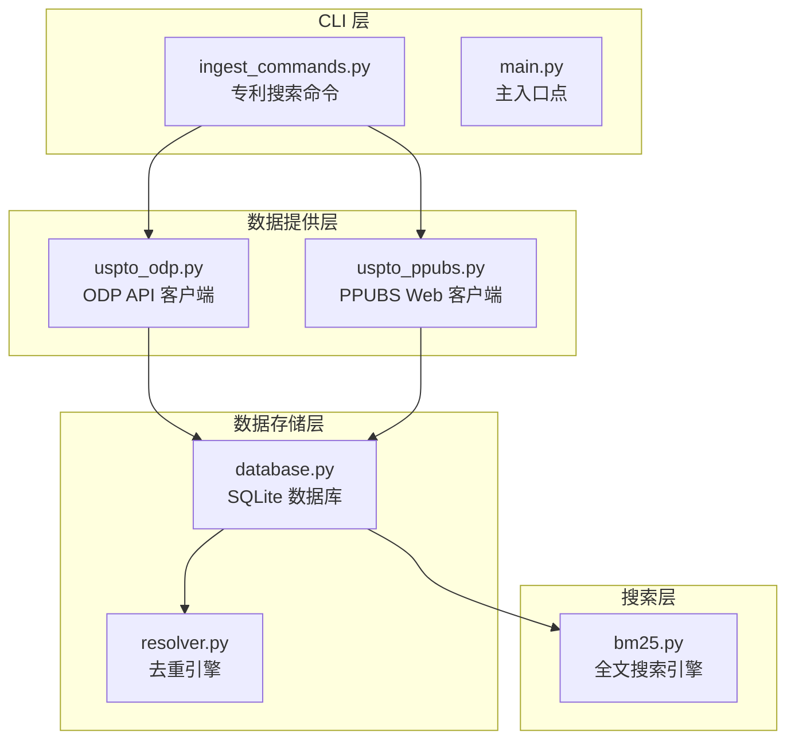

**图表来源**
- [ingest_commands.py:569-768](file://src/drbrain/cli/ingest_commands.py#L569-L768)
- [uspto_odp.py:1-289](file://src/drbrain/providers/uspto_odp.py#L1-L289)
- [uspto_ppubs.py:1-350](file://src/drbrain/providers/uspto_ppubs.py#L1-L350)

**章节来源**
- [ingest_commands.py:569-768](file://src/drbrain/cli/ingest_commands.py#L569-L768)
- [main.py:94-98](file://src/drbrain/cli/main.py#L94-L98)

## 核心组件

### 命令行接口组件

专利搜索功能通过专门的 CLI 命令实现，提供灵活的搜索选项和输出格式：

- **基础搜索命令**：`drbrain patent-search <query>`
- **源选择**：支持 `--source odp` 或 `--source ppubs`
- **应用号查询**：`--application <number>` 参数
- **结果限制**：`--limit <n>` 控制返回数量
- **JSON 输出**：`--json` 获取结构化数据

### 数据提供器组件

系统实现了两个主要的数据提供器来获取专利数据：

#### ODP API 提供器
- **认证要求**：需要有效的 API 密钥
- **数据丰富度**：提供完整的专利元数据
- **查询能力**：支持复杂的 OpenSearch 查询语法
- **错误处理**：完善的 HTTP 错误和超时处理

#### PPUBS Web 提供器
- **免认证访问**：无需 API 密钥即可使用
- **会话管理**：自动处理 Cookie 和令牌刷新
- **反爬虫防护**：模拟真实浏览器请求
- **数据提取**：从网页内容中解析专利信息

**章节来源**
- [SKILL.md:14-50](file://skills/patent-search/SKILL.md#L14-L50)
- [uspto_odp.py:221-288](file://src/drbrain/providers/uspto_odp.py#L221-L288)
- [uspto_ppubs.py:87-176](file://src/drbrain/providers/uspto_ppubs.py#L87-L176)

## 架构概览

DrBrain 的专利搜索系统采用分层架构设计，确保了良好的可扩展性和维护性：

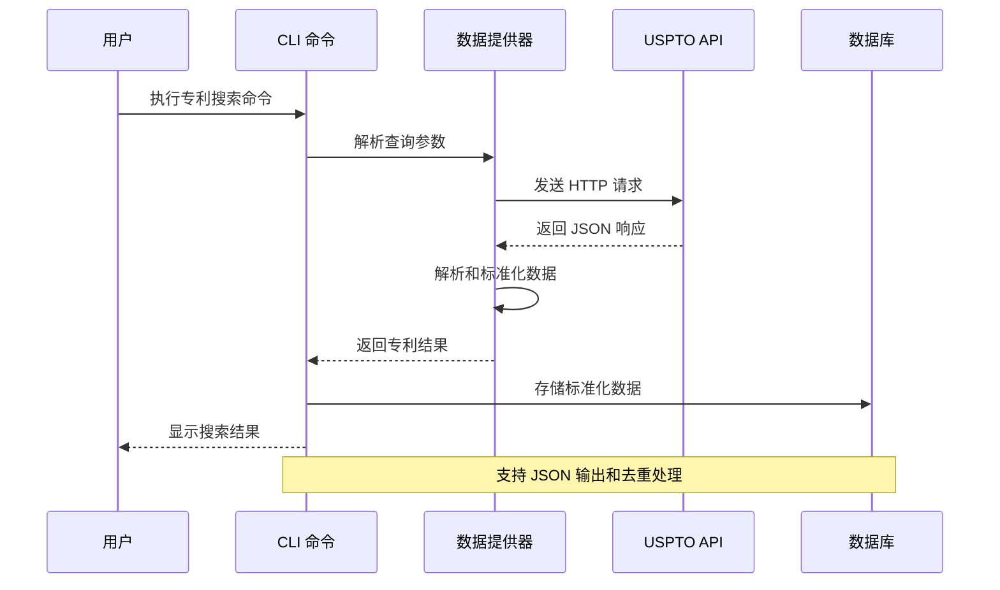

**图表来源**
- [ingest_commands.py:569-768](file://src/drbrain/cli/ingest_commands.py#L569-L768)
- [uspto_odp.py:221-288](file://src/drbrain/providers/uspto_odp.py#L221-L288)
- [uspto_ppubs.py:177-233](file://src/drbrain/providers/uspto_ppubs.py#L177-L233)

系统架构的关键特点：
- **解耦设计**：CLI 层与数据提供层完全分离
- **错误隔离**：每个组件都有独立的错误处理机制
- **数据标准化**：统一不同来源的数据格式
- **缓存友好**：支持后续的数据处理和查询

## 详细组件分析

### ODP API 集成组件

ODP（Open Data Portal）提供器实现了与 USPTO 官方 API 的直接集成：

#### 数据模型设计

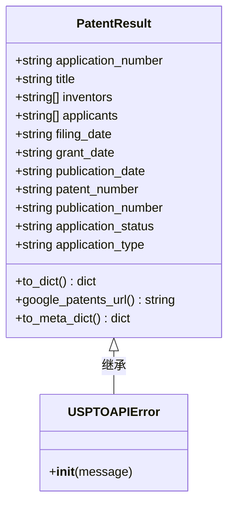

**图表来源**
- [uspto_odp.py:23-96](file://src/drbrain/providers/uspto_odp.py#L23-L96)

#### 查询处理流程

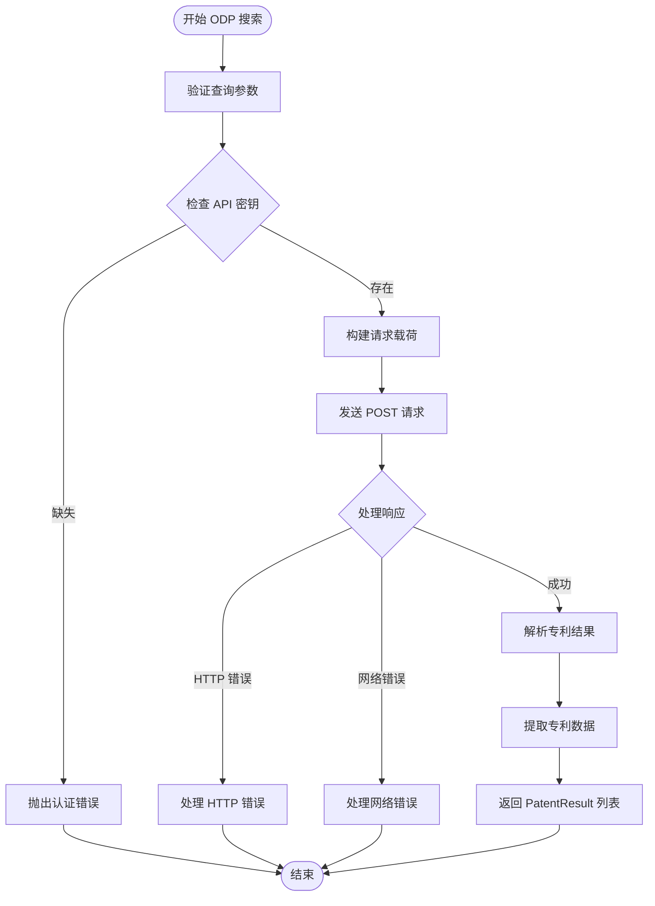

**图表来源**
- [uspto_odp.py:221-256](file://src/drbrain/providers/uspto_odp.py#L221-L256)

**章节来源**
- [uspto_odp.py:19-218](file://src/drbrain/providers/uspto_odp.py#L19-L218)

### PPUBS Web 客户端组件

PPUBS（Patent Public Search）客户端实现了对 USPTO 公开搜索界面的自动化访问：

#### 会话管理机制

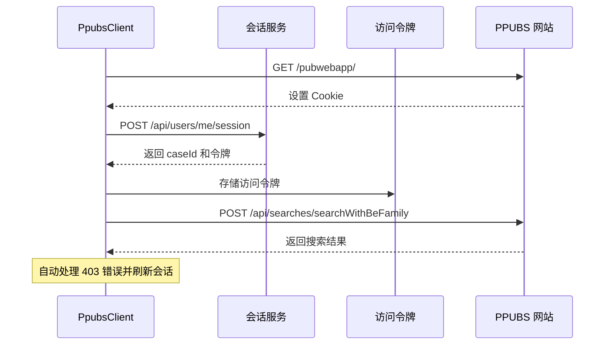

**图表来源**
- [uspto_ppubs.py:99-133](file://src/drbrain/providers/uspto_ppubs.py#L99-L133)

#### 数据提取算法

PPUBS 客户端使用正则表达式和 HTML 解析技术从网页中提取专利信息：

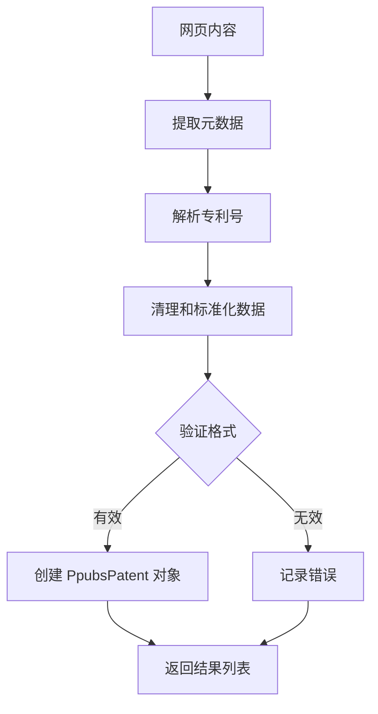

**图表来源**
- [uspto_ppubs.py:268-328](file://src/drbrain/providers/uspto_ppubs.py#L268-L328)

**章节来源**
- [uspto_ppubs.py:87-176](file://src/drbrain/providers/uspto_ppubs.py#L87-L176)

### CLI 命令处理组件

专利搜索命令通过统一的 CLI 接口处理用户输入并协调各个组件：

#### 命令参数解析

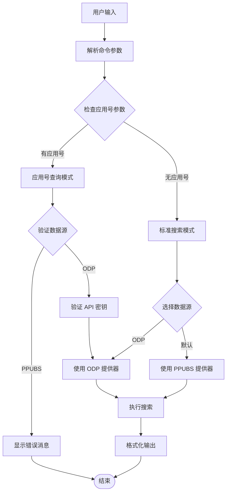

**图表来源**
- [ingest_commands.py:569-671](file://src/drbrain/cli/ingest_commands.py#L569-L671)

**章节来源**
- [ingest_commands.py:569-768](file://src/drbrain/cli/ingest_commands.py#L569-L768)

### 数据存储和去重组件

系统集成了完整的数据存储和去重机制，确保专利数据的一致性和准确性：

#### 数据库模式设计

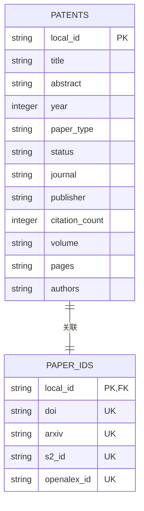

**图表来源**
- [database.py:10-156](file://src/drbrain/storage/database.py#L10-L156)

#### 去重算法实现

去重引擎采用多级优先级策略来识别重复的专利记录：

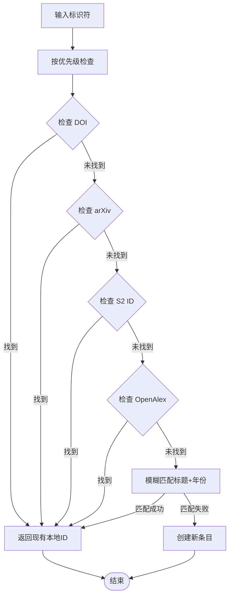

**图表来源**
- [resolver.py:59-82](file://src/drbrain/dedup/resolver.py#L59-L82)

**章节来源**
- [database.py:159-775](file://src/drbrain/storage/database.py#L159-L775)
- [resolver.py:50-82](file://src/drbrain/dedup/resolver.py#L50-L82)

## 依赖关系分析

DrBrain 专利搜索系统的依赖关系体现了清晰的分层架构：

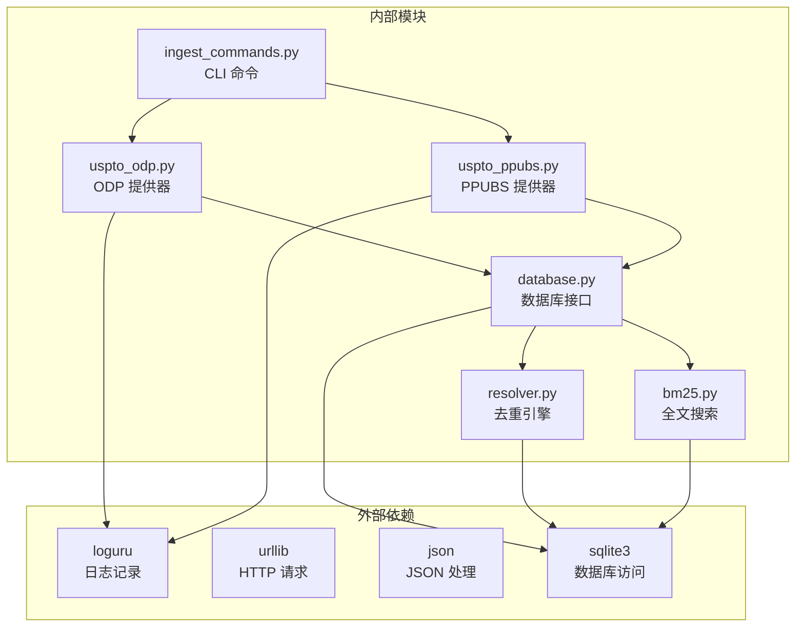

**图表来源**
- [uspto_odp.py:14](file://src/drbrain/providers/uspto_odp.py#L14)
- [uspto_ppubs.py:18](file://src/drbrain/providers/uspto_ppubs.py#L18)
- [database.py:5](file://src/drbrain/storage/database.py#L5)

系统的主要依赖特点：
- **最小化外部依赖**：仅使用 Python 标准库
- **模块化设计**：每个组件职责单一
- **松耦合架构**：组件间依赖关系清晰
- **向后兼容**：使用兼容性良好的 Python 特性

**章节来源**
- [main.py:10-75](file://src/drbrain/cli/main.py#L10-L75)

## 性能考虑

### API 限制和速率控制

系统在设计时充分考虑了 USPTO API 的限制和性能优化：

#### ODP API 限制
- **请求频率**：每次请求间隔至少 1 秒
- **结果限制**：单次请求最多 100 条记录
- **认证要求**：所有请求必须包含有效的 API 密钥
- **超时设置**：默认 30 秒超时，可根据网络状况调整

#### PPUBS Web 爬取优化
- **会话复用**：避免重复建立 HTTP 连接
- **令牌缓存**：减少重新认证的频率
- **错误重试**：对临时性错误进行有限次数重试
- **反爬虫防护**：模拟真实用户行为

### 缓存和去重策略

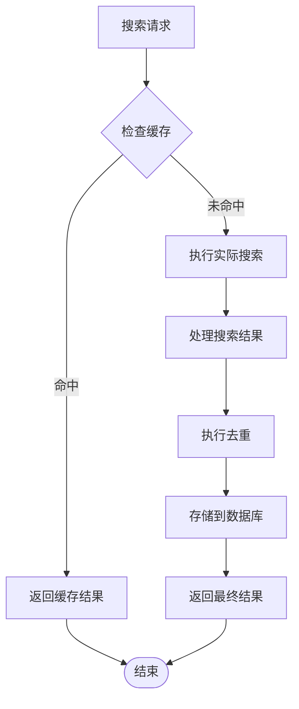

**图表来源**
- [resolver.py:59-82](file://src/drbrain/dedup/resolver.py#L59-L82)

### 内存和资源管理

系统采用渐进式数据处理策略：
- **流式处理**：避免一次性加载大量数据
- **连接池**：复用数据库连接
- **垃圾回收**：及时释放不再使用的对象
- **内存监控**：监控大数据集处理过程

## 故障排除指南

### 常见问题和解决方案

#### API 认证问题
**症状**：ODP API 调用返回 401 或 403 错误
**原因**：API 密钥无效或过期
**解决方案**：
1. 验证 API 密钥格式正确
2. 检查密钥是否已激活
3. 确认网络连接正常
4. 尝试重新生成 API 密钥

#### 网络连接问题
**症状**：PPUBS 搜索失败或超时
**原因**：网络不稳定或 USPTO 服务器问题
**解决方案**：
1. 检查网络连接状态
2. 尝试稍后重试
3. 减少并发请求
4. 调整超时参数

#### 数据解析错误
**症状**：专利数据解析失败或格式异常
**原因**：USPTO 网页结构调整或数据格式变化
**解决方案**：
1. 更新数据提取规则
2. 检查正则表达式模式
3. 验证数据字段映射
4. 实施更健壮的错误处理

### 调试和监控

系统提供了多层次的调试支持：

#### 日志记录
- **详细日志**：记录 API 请求和响应详情
- **错误日志**：捕获和报告异常情况
- **性能日志**：监控请求响应时间和资源使用
- **调试模式**：提供详细的调试信息

#### 错误分类
系统定义了明确的错误类型来区分不同类型的故障：
- **USPTOAPIError**：ODP API 相关错误
- **PpubsError**：PPUBS 网页访问错误
- **DatabaseError**：数据库操作错误
- **ValidationError**：数据验证错误

**章节来源**
- [uspto_odp.py:19-21](file://src/drbrain/providers/uspto_odp.py#L19-L21)
- [uspto_ppubs.py:26-28](file://src/drbrain/providers/uspto_ppubs.py#L26-L28)

## 结论

DrBrain 的专利搜索集成功能展现了现代学术知识图谱系统的设计理念，通过以下关键特性实现了高质量的专利数据检索：

### 技术优势

1. **双数据源架构**：同时支持免费和付费数据源，满足不同用户需求
2. **标准化数据处理**：统一不同来源的数据格式，确保一致性
3. **智能去重机制**：基于多级优先级的识别策略，提高数据质量
4. **健壮的错误处理**：完善的异常处理和恢复机制
5. **模块化设计**：清晰的组件分离，便于维护和扩展

### 应用价值

该系统为研究人员、专利分析师和创新团队提供了强大的专利检索能力，支持：
- **快速文献发现**：高效的专利搜索和筛选
- **竞争情报分析**：全面的专利态势分析
- **技术趋势洞察**：基于专利数据的创新趋势识别
- **知识产权管理**：系统化的专利组合管理

### 未来发展

系统具备良好的扩展性，未来可以进一步增强：
- **机器学习集成**：利用 AI 技术提升搜索精度
- **实时更新机制**：实现专利数据的实时同步
- **多语言支持**：扩展到全球专利数据库
- **高级分析功能**：提供更深入的专利数据分析工具

## 附录

### 使用示例

#### 基础搜索
```bash
# 使用 PPUBS 进行免费搜索
drbrain patent-search "machine learning transformer"

# 限制结果数量
drbrain patent-search "graph neural networks" --limit 5
```

#### ODP 高级搜索
```bash
# 设置 API 密钥
export USPTO_ODP_API_KEY=your-key

# 使用 ODP 搜索
drbrain patent-search "quantum computing" --source odp

# 按应用号查找
drbrain patent-search --application 17123456 --source odp --api-key your-key
```

#### 数据导出
```bash
# 获取 JSON 格式结果
drbrain patent-search "neural network" --json

# 结合其他功能使用
drbrain patent-search "AI ethics" --source odp --limit 10
```

### 配置选项

| 选项 | 类型 | 默认值 | 描述 |
|------|------|--------|------|
| `--source` | 字符串 | `ppubs` | 数据源选择（ppubs/odp） |
| `--limit` | 整数 | `10` | 最大结果数量 |
| `--application` | 字符串 | `None` | 应用号查询 |
| `--api-key` | 字符串 | `None` | ODP API 密钥 |
| `--json` | 布尔值 | `False` | JSON 输出格式 |

### 数据格式规范

系统支持的标准专利数据字段包括：
- **基本标识符**：申请号、专利号、公开号
- **技术信息**：标题、摘要、分类代码
- **时间信息**：申请日期、公开日期、授权日期
- **法律状态**：申请状态、类型、有效性
- **人员信息**：发明人、申请人、代理人

这些字段为后续的知识图谱构建和分析提供了坚实的基础，支持复杂的关系推理和模式识别任务。