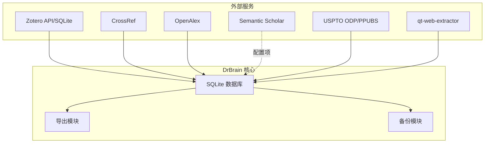
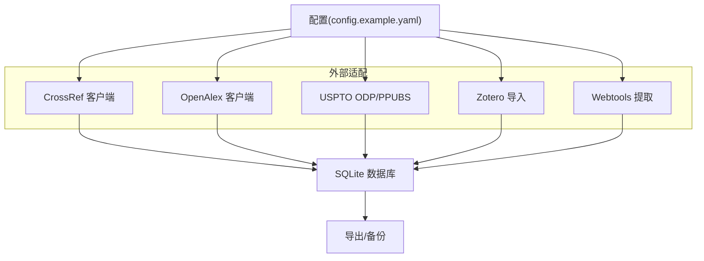
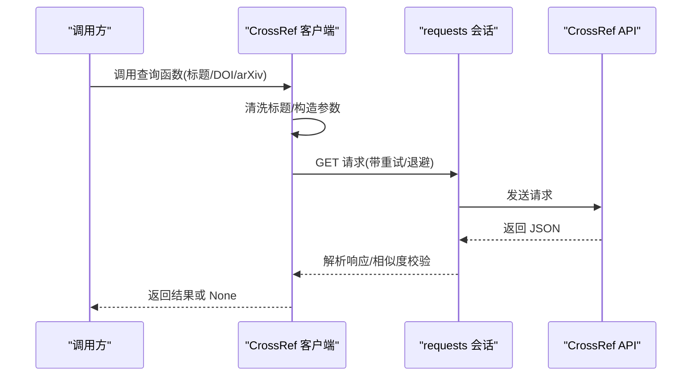
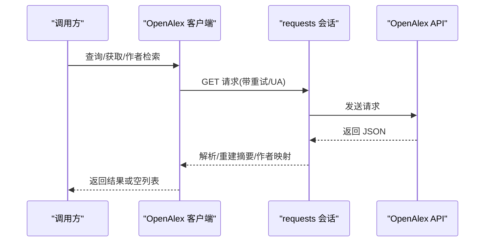
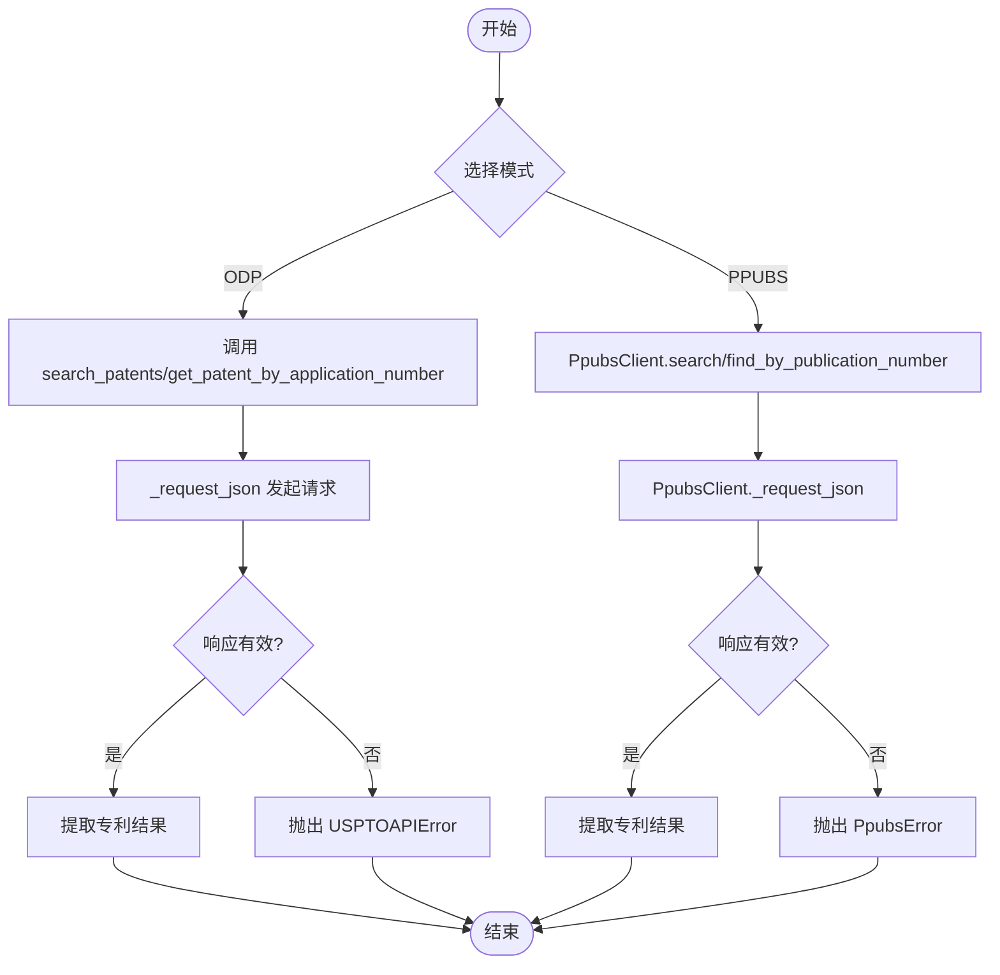
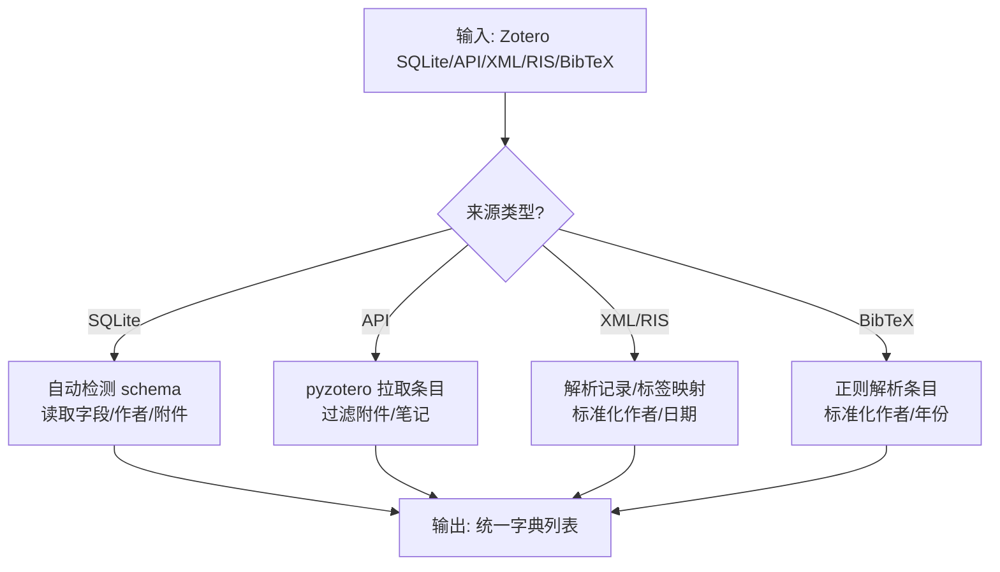
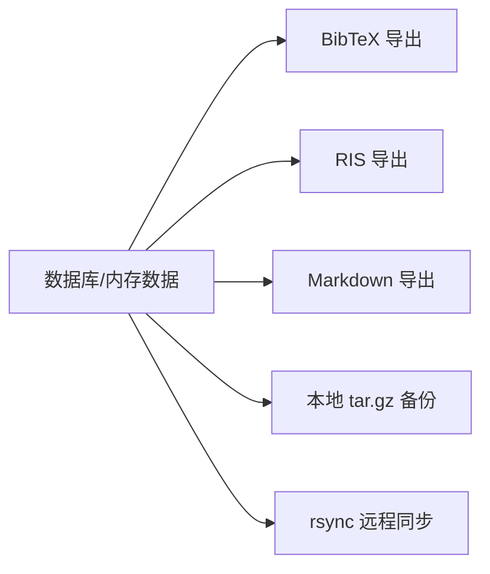
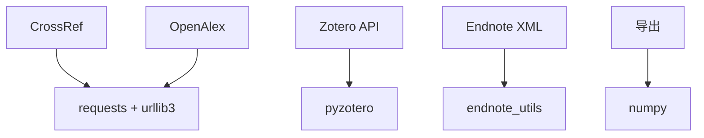

# 外部集成

<cite>
**本文引用的文件**
- [README.md](file://README.md)
- [config.example.yaml](file://config.example.yaml)
- [src/drbrain/providers/uspto_odp.py](file://src/drbrain/providers/uspto_odp.py)
- [src/drbrain/providers/uspto_ppubs.py](file://src/drbrain/providers/uspto_ppubs.py)
- [src/drbrain/providers/webtools.py](file://src/drbrain/providers/webtools.py)
- [src/drbrain/services/zotero_import.py](file://src/drbrain/services/zotero_import.py)
- [src/drbrain/extractor/crossref.py](file://src/drbrain/extractor/crossref.py)
- [src/drbrain/extractor/openalex.py](file://src/drbrain/extractor/openalex.py)
- [src/drbrain/storage/export.py](file://src/drbrain/storage/export.py)
- [src/drbrain/storage/backup.py](file://src/drbrain/storage/backup.py)
- [src/drbrain/storage/database.py](file://src/drbrain/storage/database.py)
- [tests/test_crossref.py](file://tests/test_crossref.py)
- [tests/test_openalex.py](file://tests/test_openalex.py)
- [tests/test_zotero_import.py](file://tests/test_zotero_import.py)
- [tests/test_backup.py](file://tests/test_backup.py)
</cite>

## 目录
1. [简介](#简介)
2. [项目结构](#项目结构)
3. [核心组件](#核心组件)
4. [架构总览](#架构总览)
5. [详细组件分析](#详细组件分析)
6. [依赖分析](#依赖分析)
7. [性能考虑](#性能考虑)
8. [故障排除指南](#故障排除指南)
9. [结论](#结论)
10. [附录](#附录)

## 简介
本文件系统化梳理 DrBrain 的外部集成功能，覆盖以下方面：
- 第三方学术数据库与服务：CrossRef、OpenAlex、Semantic Scholar（通过配置项）、USPTO（ODP 与 PPUBS）
- 文献导入：Zotero 本地 SQLite、Web API、Endnote XML/RIS、BibTeX
- 文献导出：BibTeX、RIS、Markdown 引文样式
- 备份与同步：本地 tar.gz 备份与 rsync 远程同步
- PDF 获取与网页提取：qt-web-extractor 服务对接
- 认证机制与速率限制：API Key、User-Agent、重试与退避策略
- 集成测试与故障排除：单元测试覆盖与常见问题定位

## 项目结构
围绕“外部集成”的关键模块分布如下：
- 提供商与外部 API 客户端：providers、extractor
- 导入/导出与备份：services、storage
- 配置模板：config.example.yaml
- 测试：tests 下针对各外部集成点的单元测试

图示来源
- [src/drbrain/providers/uspto_odp.py:1-289](file://src/drbrain/providers/uspto_odp.py#L1-L289)
- [src/drbrain/providers/uspto_ppubs.py:1-350](file://src/drbrain/providers/uspto_ppubs.py#L1-L350)
- [src/drbrain/providers/webtools.py:1-135](file://src/drbrain/providers/webtools.py#L1-L135)
- [src/drbrain/services/zotero_import.py:1-719](file://src/drbrain/services/zotero_import.py#L1-L719)
- [src/drbrain/extractor/crossref.py:1-180](file://src/drbrain/extractor/crossref.py#L1-L180)
- [src/drbrain/extractor/openalex.py:1-421](file://src/drbrain/extractor/openalex.py#L1-L421)
- [src/drbrain/storage/export.py:1-180](file://src/drbrain/storage/export.py#L1-L180)
- [src/drbrain/storage/backup.py:1-240](file://src/drbrain/storage/backup.py#L1-L240)
- [src/drbrain/storage/database.py:1-775](file://src/drbrain/storage/database.py#L1-L775)

章节来源
- [README.md:41-67](file://README.md#L41-L67)

## 核心组件
- CrossRef 客户端：基于 requests 的会话级重试与标题相似度匹配，支持按 DOI、arXiv、标题查询
- OpenAlex 客户端：带重试的会话、User-Agent 设置、作者检索、批量工作查询
- Semantic Scholar：通过配置项设置速率限制与可选 API Key
- USPTO ODP：需要 API Key，支持应用号与关键词搜索
- USPTO PPUBS：无需 API Key，基于会话与令牌刷新的网页客户端
- Zotero 导入：本地 SQLite、Web API、Endnote XML/RIS、BibTeX 解析
- 导出：BibTeX、RIS、Markdown 引文样式
- 备份：本地 tar.gz 与 rsync 远程同步
- 网页提取：qt-web-extractor 服务对接

章节来源
- [src/drbrain/extractor/crossref.py:1-180](file://src/drbrain/extractor/crossref.py#L1-L180)
- [src/drbrain/extractor/openalex.py:1-421](file://src/drbrain/extractor/openalex.py#L1-L421)
- [src/drbrain/providers/uspto_odp.py:1-289](file://src/drbrain/providers/uspto_odp.py#L1-L289)
- [src/drbrain/providers/uspto_ppubs.py:1-350](file://src/drbrain/providers/uspto_ppubs.py#L1-L350)
- [src/drbrain/services/zotero_import.py:1-719](file://src/drbrain/services/zotero_import.py#L1-L719)
- [src/drbrain/storage/export.py:1-180](file://src/drbrain/storage/export.py#L1-L180)
- [src/drbrain/storage/backup.py:1-240](file://src/drbrain/storage/backup.py#L1-L240)
- [src/drbrain/providers/webtools.py:1-135](file://src/drbrain/providers/webtools.py#L1-L135)

## 架构总览
DrBrain 的外部集成遵循“配置驱动 + 统一会话 + 结构化数据模型”的设计：
- 配置层：config.example.yaml 提供 API Key、速率限制、缓存 TTL、目录路径等
- 适配层：各外部服务封装为独立模块，统一返回结构化字典或列表
- 存储层：SQLite 表结构承载论文元数据、ID 映射、概念/论点/边等
- 工具层：导出、备份、网页提取作为通用能力复用

图示来源
- [config.example.yaml:90-98](file://config.example.yaml#L90-L98)
- [src/drbrain/extractor/crossref.py:17-39](file://src/drbrain/extractor/crossref.py#L17-L39)
- [src/drbrain/extractor/openalex.py:17-39](file://src/drbrain/extractor/openalex.py#L17-L39)
- [src/drbrain/providers/uspto_odp.py:185-219](file://src/drbrain/providers/uspto_odp.py#L185-L219)
- [src/drbrain/providers/uspto_ppubs.py:134-175](file://src/drbrain/providers/uspto_ppubs.py#L134-L175)
- [src/drbrain/services/zotero_import.py:118-281](file://src/drbrain/services/zotero_import.py#L118-L281)
- [src/drbrain/providers/webtools.py:35-52](file://src/drbrain/providers/webtools.py#L35-L52)
- [src/drbrain/storage/database.py:10-156](file://src/drbrain/storage/database.py#L10-L156)

## 详细组件分析

### CrossRef 集成
- 功能要点
  - 会话级重试：对 429/5xx 与 GET/POST 自动退避重试
  - 标题清洗与相似度判断：清洗特殊字符、空格合并、前缀/词重叠阈值
  - 查询接口：按标题、按 DOI、按 arXiv
  - 可选 mailto 头用于礼貌池
- 使用建议
  - 建议在配置中提供 CROSSREF_EMAIL，提升访问稳定性
  - 对于 arXiv 记录，优先使用 arXiv 查询以提高命中率
- 错误处理
  - 请求异常统一返回 None，并记录日志

图示来源
- [src/drbrain/extractor/crossref.py:17-39](file://src/drbrain/extractor/crossref.py#L17-L39)
- [src/drbrain/extractor/crossref.py:49-84](file://src/drbrain/extractor/crossref.py#L49-L84)
- [src/drbrain/extractor/crossref.py:107-133](file://src/drbrain/extractor/crossref.py#L107-L133)
- [src/drbrain/extractor/crossref.py:136-179](file://src/drbrain/extractor/crossref.py#L136-L179)

章节来源
- [src/drbrain/extractor/crossref.py:1-180](file://src/drbrain/extractor/crossref.py#L1-L180)
- [tests/test_crossref.py:1-279](file://tests/test_crossref.py#L1-L279)

### OpenAlex 集成
- 功能要点
  - 会话级重试与 User-Agent 设置（可选 token）
  - 按标题/按 arXiv/按 DOI 查询工作；批量查询与引用工作抓取
  - 作者信息提取（短 ID、显示名、ORCID、机构字符串）
- 使用建议
  - 提供 OPENALEX_TOKEN 可获得更高速率限制
  - 批量查询一次最多 50 个 ID
- 错误处理
  - 请求异常与 error 字段均返回 None 或空列表

图示来源
- [src/drbrain/extractor/openalex.py:17-39](file://src/drbrain/extractor/openalex.py#L17-L39)
- [src/drbrain/extractor/openalex.py:47-79](file://src/drbrain/extractor/openalex.py#L47-L79)
- [src/drbrain/extractor/openalex.py:116-148](file://src/drbrain/extractor/openalex.py#L116-L148)
- [src/drbrain/extractor/openalex.py:312-383](file://src/drbrain/extractor/openalex.py#L312-L383)

章节来源
- [src/drbrain/extractor/openalex.py:1-421](file://src/drbrain/extractor/openalex.py#L1-L421)
- [tests/test_openalex.py:1-561](file://tests/test_openalex.py#L1-L561)

### Semantic Scholar 集成（配置项）
- 配置项
  - s2_rate_limit：每分钟请求数
  - s2_api_key：可选 API Key
- 使用建议
  - 在高并发场景下建议配置 API Key 并合理设置速率限制
  - 该模块本身不直接实现客户端，需结合上层业务逻辑进行限流

章节来源
- [config.example.yaml:90-98](file://config.example.yaml#L90-L98)

### USPTO 集成（ODP 与 PPUBS）
- ODP（需要 API Key）
  - 支持关键词搜索与应用号精确查找
  - 返回专利元数据并转换为内部结构
- PPUBS（无需 API Key）
  - 基于会话与令牌刷新的网页客户端
  - 支持关键词搜索与出版号解析
- 错误处理
  - ODP：404 视为空结果；其他 HTTP/JSON 错误抛出自定义异常
  - PPUBS：自动刷新令牌与重试，失败时抛出自定义异常

图示来源
- [src/drbrain/providers/uspto_odp.py:185-219](file://src/drbrain/providers/uspto_odp.py#L185-L219)
- [src/drbrain/providers/uspto_odp.py:221-288](file://src/drbrain/providers/uspto_odp.py#L221-L288)
- [src/drbrain/providers/uspto_ppubs.py:134-175](file://src/drbrain/providers/uspto_ppubs.py#L134-L175)
- [src/drbrain/providers/uspto_ppubs.py:177-248](file://src/drbrain/providers/uspto_ppubs.py#L177-L248)

章节来源
- [src/drbrain/providers/uspto_odp.py:1-289](file://src/drbrain/providers/uspto_odp.py#L1-L289)
- [src/drbrain/providers/uspto_ppubs.py:1-350](file://src/drbrain/providers/uspto_ppubs.py#L1-L350)

### Zotero 导入
- 支持格式
  - 本地：SQLite（兼容标准化/简化 schema），集合过滤、PDF 附件检测
  - Web API：pyzotero 客户端，集合列表与条目拉取
  - Endnote：XML（可选）与 RIS（正则解析）
  - BibTeX：文件解析
- 关键流程
  - 本地 SQLite：自动检测 schema，读取字段/作者/附件，输出统一字典列表
  - Web API：过滤附件/笔记，映射类型与字段
  - Endnote/RIS/BibTeX：正则/标签映射，标准化作者与日期

图示来源
- [src/drbrain/services/zotero_import.py:118-281](file://src/drbrain/services/zotero_import.py#L118-L281)
- [src/drbrain/services/zotero_import.py:348-435](file://src/drbrain/services/zotero_import.py#L348-L435)
- [src/drbrain/services/zotero_import.py:478-504](file://src/drbrain/services/zotero_import.py#L478-L504)
- [src/drbrain/services/zotero_import.py:555-657](file://src/drbrain/services/zotero_import.py#L555-L657)
- [src/drbrain/services/zotero_import.py:665-718](file://src/drbrain/services/zotero_import.py#L665-L718)

章节来源
- [src/drbrain/services/zotero_import.py:1-719](file://src/drbrain/services/zotero_import.py#L1-L719)
- [tests/test_zotero_import.py:1-619](file://tests/test_zotero_import.py#L1-L619)

### 导出与备份
- 导出
  - BibTeX：转义特殊字符、生成 cite key、映射条目类型
  - RIS：字段映射与分页格式化
  - Markdown：内置样式与自定义样式支持
- 备份
  - 本地 tar.gz：打包 papers、db、workspace、reports
  - rsync 远程同步：构建命令行、SSH 参数、凭据注入、干运行与统计

图示来源
- [src/drbrain/storage/export.py:68-105](file://src/drbrain/storage/export.py#L68-L105)
- [src/drbrain/storage/export.py:108-149](file://src/drbrain/storage/export.py#L108-L149)
- [src/drbrain/storage/export.py:152-179](file://src/drbrain/storage/export.py#L152-L179)
- [src/drbrain/storage/backup.py:26-63](file://src/drbrain/storage/backup.py#L26-L63)
- [src/drbrain/storage/backup.py:171-196](file://src/drbrain/storage/backup.py#L171-L196)
- [src/drbrain/storage/backup.py:199-239](file://src/drbrain/storage/backup.py#L199-L239)

章节来源
- [src/drbrain/storage/export.py:1-180](file://src/drbrain/storage/export.py#L1-L180)
- [src/drbrain/storage/backup.py:1-240](file://src/drbrain/storage/backup.py#L1-L240)
- [tests/test_backup.py:1-390](file://tests/test_backup.py#L1-L390)

### 网页提取（qt-web-extractor）
- 功能要点
  - 通过环境变量控制服务地址与超时
  - JSON POST 请求，健康检查 /health
  - 返回文本、HTML、图片、时间戳与错误信息
- 使用建议
  - 确保 WEBEXTRACT_URL 指向可用服务端口
  - 合理设置 WEBEXTRACT_TIMEOUT 以避免阻塞

章节来源
- [src/drbrain/providers/webtools.py:21-52](file://src/drbrain/providers/webtools.py#L21-L52)
- [src/drbrain/providers/webtools.py:67-116](file://src/drbrain/providers/webtools.py#L67-L116)
- [src/drbrain/providers/webtools.py:119-135](file://src/drbrain/providers/webtools.py#L119-L135)

## 依赖分析
- 组件耦合
  - CrossRef/OpenAlex：依赖 requests 会话与 urllib3 Retry，具备统一重试策略
  - USPTO：ODP 使用 urllib.request，PPUBS 使用 http.cookiejar 与会话刷新
  - Zotero：依赖 pyzotero（API）、endnote_utils（XML，可选）
  - 导出/备份：纯 Python 标准库与第三方依赖（如 numpy）
- 外部依赖
  - requests + urllib3 Retry（CrossRef/OpenAlex）
  - pyzotero（Zotero Web API）
  - endnote_utils（Endnote XML）
  - numpy（嵌入向量序列化）

图示来源
- [src/drbrain/extractor/crossref.py:9-29](file://src/drbrain/extractor/crossref.py#L9-L29)
- [src/drbrain/extractor/openalex.py:9-29](file://src/drbrain/extractor/openalex.py#L9-L29)
- [src/drbrain/services/zotero_import.py:368-372](file://src/drbrain/services/zotero_import.py#L368-L372)
- [src/drbrain/storage/export.py:7-11](file://src/drbrain/storage/export.py#L7-L11)

## 性能考虑
- 重试与退避
  - CrossRef/OpenAlex 使用 Retry 适配器，指数退避降低服务器压力
- 速率限制
  - Semantic Scholar 通过 s2_rate_limit 控制并发
  - OpenAlex 可通过 token 提升限额
- 批量与分页
  - OpenAlex 批量查询限制 50 个 ID
  - USPTO ODP 限制每页最大 100
- I/O 优化
  - 导出采用一次性拼接，减少多次写入
  - 备份仅打包指定目录，避免缓存与日志

## 故障排除指南
- API 访问失败
  - 检查 API Key 与 User-Agent 设置（OpenAlex）
  - 确认 mailto 头（CrossRef）与 token（OpenAlex）
- 429/5xx 错误
  - 等待退避后重试；必要时降低并发或启用缓存
- USPTO
  - ODP：确认 API Key 与 URL；404 视为空结果
  - PPUBS：检查网络连通性与会话刷新逻辑
- Zotero
  - SQLite：确认 schema 兼容性与表存在性
  - API：确认 pyzotero 安装与权限
- 导出/备份
  - 导出：确认 cite key 生成与字段映射
  - 备份：确认 rsync/ssh 可执行文件路径与目标配置

章节来源
- [src/drbrain/extractor/crossref.py:17-39](file://src/drbrain/extractor/crossref.py#L17-L39)
- [src/drbrain/extractor/openalex.py:17-39](file://src/drbrain/extractor/openalex.py#L17-L39)
- [src/drbrain/providers/uspto_odp.py:185-219](file://src/drbrain/providers/uspto_odp.py#L185-L219)
- [src/drbrain/providers/uspto_ppubs.py:134-175](file://src/drbrain/providers/uspto_ppubs.py#L134-L175)
- [src/drbrain/services/zotero_import.py:368-372](file://src/drbrain/services/zotero_import.py#L368-L372)
- [src/drbrain/storage/backup.py:171-239](file://src/drbrain/storage/backup.py#L171-L239)
- [tests/test_crossref.py:108-116](file://tests/test_crossref.py#L108-L116)
- [tests/test_openalex.py:178-186](file://tests/test_openalex.py#L178-L186)
- [tests/test_zotero_import.py:1-619](file://tests/test_zotero_import.py#L1-L619)
- [tests/test_backup.py:351-374](file://tests/test_backup.py#L351-L374)

## 结论
DrBrain 的外部集成功能以“配置驱动 + 统一会话 + 结构化存储”为核心，覆盖学术数据库、专利库、文献管理与导出备份等关键场景。通过重试与退避、速率限制与批量策略，兼顾可靠性与性能。建议在生产环境中：
- 正确配置 API Key 与速率限制
- 使用缓存与批量接口降低请求压力
- 定期进行备份与健康检查

## 附录
- 配置参考
  - 外部 API：api.deepxiv_token、s2_rate_limit、s2_api_key、cache_ttl、crossref_email、openalex_token
  - 目录与数据库：dirs、db.path
  - 备份目标：backup.targets
- 常用命令
  - drbrain setup：交互式初始化配置
  - drbrain backup：本地备份与远程同步

章节来源
- [config.example.yaml:90-144](file://config.example.yaml#L90-L144)
- [README.md:91-99](file://README.md#L91-L99)