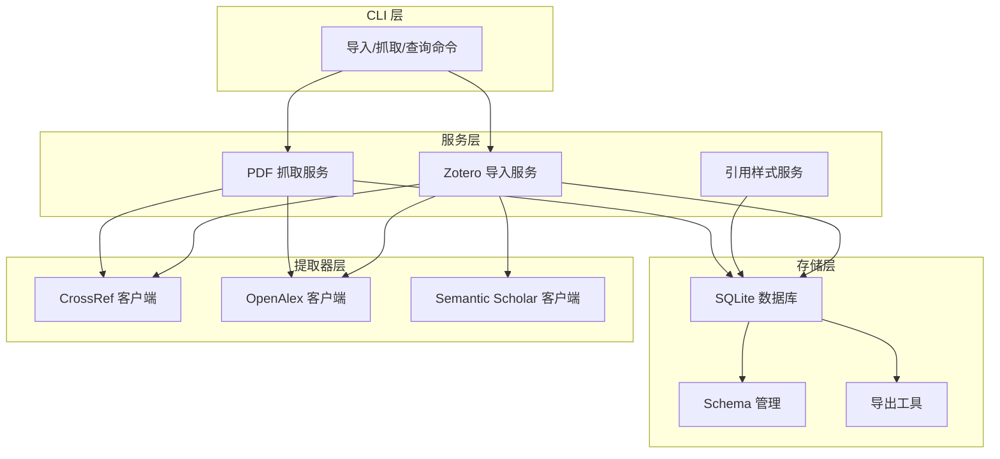
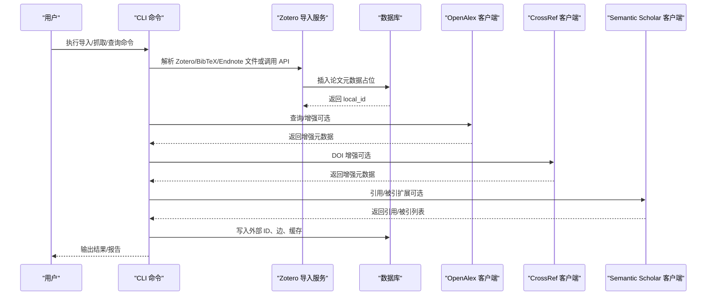
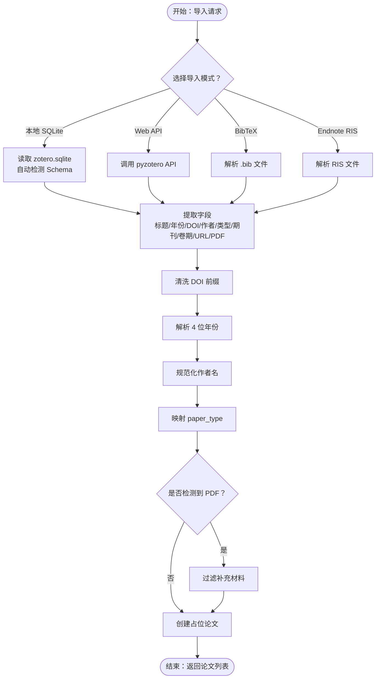
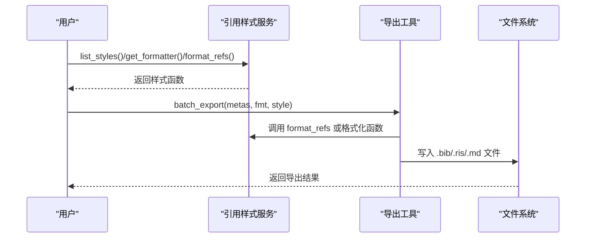
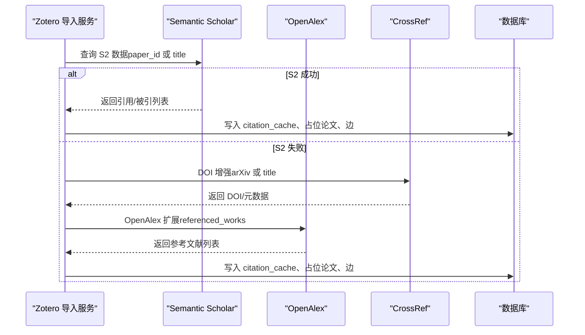
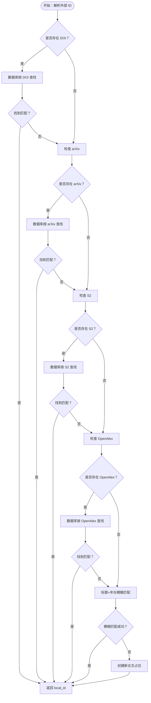
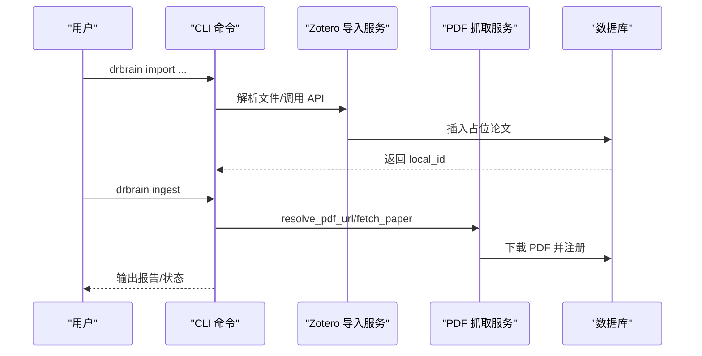
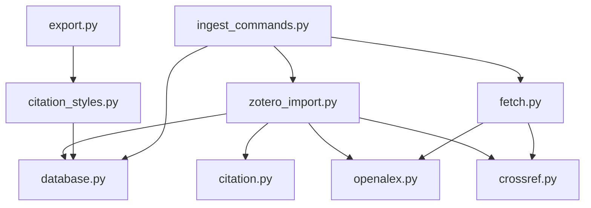

# 文献管理集成

<cite>
**本文档引用的文件**
- [zotero_import.py](file://src/drbrain/services/zotero_import.py)
- [database.py](file://src/drbrain/storage/database.py)
- [citation_styles.py](file://src/drbrain/services/citation_styles.py)
- [crossref.py](file://src/drbrain/extractor/crossref.py)
- [openalex.py](file://src/drbrain/extractor/openalex.py)
- [citation.py](file://src/drbrain/extractor/citation.py)
- [resolver.py](file://src/drbrain/dedup/resolver.py)
- [export.py](file://src/drbrain/storage/export.py)
- [ingest_commands.py](file://src/drbrain/cli/ingest_commands.py)
- [fetch.py](file://src/drbrain/services/fetch.py)
- [test_zotero_import.py](file://tests/test_zotero_import.py)
- [SKILL.md](file://skills/import/SKILL.md)
- [config.example.yaml](file://config.example.yaml)
</cite>

## 目录
1. [简介](#简介)
2. [项目结构](#项目结构)
3. [核心组件](#核心组件)
4. [架构总览](#架构总览)
5. [详细组件分析](#详细组件分析)
6. [依赖关系分析](#依赖关系分析)
7. [性能考虑](#性能考虑)
8. [故障排除指南](#故障排除指南)
9. [结论](#结论)
10. [附录](#附录)

## 简介
本文件面向 DrBrain 的文献管理集成功能，系统性阐述 Zotero 导入、文献数据库管理、引用格式处理与跨库数据同步机制。重点覆盖：
- Zotero 本地 SQLite、Web API、BibTeX、Endnote/RIS 的导入流程与字段映射
- 文献数据库 Schema、重复检测与冲突解决策略
- CrossRef、OpenAlex、Semantic Scholar 的学术数据库集成与数据同步
- 引用格式转换、导出与样式扩展
- 导入性能优化与错误处理最佳实践

## 项目结构
DrBrain 将文献管理能力分布在服务层、存储层、提取器层与 CLI 层：
- 服务层：Zotero 导入、引用样式管理、PDF 获取与抓取
- 存储层：SQLite 数据库、Schema 管理、导出工具
- 提取器层：CrossRef、OpenAlex、Semantic Scholar API 客户端
- CLI 层：导入、抓取、引用图查询、报告生成等命令



图表来源
- [zotero_import.py:1-719](file://src/drbrain/services/zotero_import.py#L1-L719)
- [database.py:1-775](file://src/drbrain/storage/database.py#L1-L775)
- [citation_styles.py:1-389](file://src/drbrain/services/citation_styles.py#L1-L389)
- [crossref.py:1-180](file://src/drbrain/extractor/crossref.py#L1-L180)
- [openalex.py:1-421](file://src/drbrain/extractor/openalex.py#L1-L421)
- [citation.py:1-710](file://src/drbrain/extractor/citation.py#L1-L710)
- [fetch.py:1-345](file://src/drbrain/services/fetch.py#L1-L345)
- [export.py:1-180](file://src/drbrain/storage/export.py#L1-L180)

章节来源
- [zotero_import.py:1-719](file://src/drbrain/services/zotero_import.py#L1-L719)
- [database.py:1-775](file://src/drbrain/storage/database.py#L1-L775)
- [citation_styles.py:1-389](file://src/drbrain/services/citation_styles.py#L1-L389)
- [crossref.py:1-180](file://src/drbrain/extractor/crossref.py#L1-L180)
- [openalex.py:1-421](file://src/drbrain/extractor/openalex.py#L1-L421)
- [citation.py:1-710](file://src/drbrain/extractor/citation.py#L1-L710)
- [fetch.py:1-345](file://src/drbrain/services/fetch.py#L1-L345)
- [export.py:1-180](file://src/drbrain/storage/export.py#L1-L180)

## 核心组件
- Zotero 导入服务：支持本地 SQLite、Web API、BibTeX、Endnote/RIS；自动识别 Zotero Schema 变体；解析作者、DOI、年份、期刊、卷期页码等字段；可检测本地 PDF 并过滤补充材料。
- 文献数据库：统一 Schema 管理，支持外部 ID（DOI、arXiv、S2、OpenAlex）索引与模糊匹配；提供插入、更新、删除、查询接口。
- 引用样式服务：内置 APA、Vancouver、Chicago、MLA 等样式；支持自定义样式动态加载；输出 Markdown 引文列表。
- 跨库集成：CrossRef、OpenAlex、Semantic Scholar 的 API 客户端；DOI 增强、参考文献/被引文献扩展、作者信息获取。
- 导出工具：BibTeX、RIS、Markdown 格式导出；作者名规范化、CiteKey 生成、条目类型映射。
- CLI 命令：导入、抓取、引用图查询、报告生成；与服务层协同完成端到端工作流。

章节来源
- [zotero_import.py:118-281](file://src/drbrain/services/zotero_import.py#L118-L281)
- [database.py:10-156](file://src/drbrain/storage/database.py#L10-L156)
- [citation_styles.py:214-226](file://src/drbrain/services/citation_styles.py#L214-L226)
- [crossref.py:14-134](file://src/drbrain/extractor/crossref.py#L14-L134)
- [openalex.py:14-148](file://src/drbrain/extractor/openalex.py#L14-L148)
- [citation.py:16-147](file://src/drbrain/extractor/citation.py#L16-L147)
- [export.py:68-105](file://src/drbrain/storage/export.py#L68-L105)
- [ingest_commands.py:26-110](file://src/drbrain/cli/ingest_commands.py#L26-L110)

## 架构总览
下图展示从导入到入库再到引用扩展的数据流与模块交互。



图表来源
- [ingest_commands.py:152-247](file://src/drbrain/cli/ingest_commands.py#L152-L247)
- [zotero_import.py:348-435](file://src/drbrain/services/zotero_import.py#L348-L435)
- [openalex.py:116-148](file://src/drbrain/extractor/openalex.py#L116-L148)
- [crossref.py:107-134](file://src/drbrain/extractor/crossref.py#L107-L134)
- [citation.py:231-287](file://src/drbrain/extractor/citation.py#L231-L287)

## 详细组件分析

### Zotero 导入与字段映射
- 支持模式
  - 本地 SQLite：自动检测标准化/简化 Schema；支持集合过滤、已删除项过滤、作者顺序与类型解析、本地 PDF 检测与过滤补充材料。
  - Web API：通过 pyzotero 访问用户或组库；支持集合过滤与分页。
  - BibTeX：正则解析 .bib 文件，映射条目类型到内部 paper_type。
  - Endnote：支持 XML 与 RIS；RIS 使用标签映射表与类型映射。
- 关键函数
  - import_zotero_db：主入口，返回标准字典列表（标题、年份、DOI、作者、类型、期刊、卷期、URL、PDF 路径）。
  - fetch_zotero_api：Web API 入口，返回不含 PDF 的字典列表。
  - import_bibtex_file：BibTeX 解析入口。
  - parse_endnote_ris：RIS 解析入口。
  - _find_local_pdf：根据 itemAttachments 与 storage 目录解析 PDF 路径。
- 字段映射与清洗
  - DOI 清洗：去除 http/https 与 dx.doi.org 前缀。
  - 年份解析：从日期字符串中提取 4 位年份。
  - 作者规范化：支持 Last, First 与 First Last 两种格式互转。
  - 类型映射：journalArticle/conferencePaper/preprint/thesis/book/bookSection/report/document 映射到 internal paper_type。
- 补充材料过滤
  - 使用正则过滤以 SI、Suppl、Supporting、S\d+、Table S\d+、Figure S\d+ 结尾的 PDF，避免将补充材料误判为主论文 PDF。



图表来源
- [zotero_import.py:118-281](file://src/drbrain/services/zotero_import.py#L118-L281)
- [zotero_import.py:348-435](file://src/drbrain/services/zotero_import.py#L348-L435)
- [zotero_import.py:665-718](file://src/drbrain/services/zotero_import.py#L665-L718)
- [zotero_import.py:555-579](file://src/drbrain/services/zotero_import.py#L555-L579)
- [zotero_import.py:284-314](file://src/drbrain/services/zotero_import.py#L284-L314)

章节来源
- [zotero_import.py:118-281](file://src/drbrain/services/zotero_import.py#L118-L281)
- [zotero_import.py:348-435](file://src/drbrain/services/zotero_import.py#L348-L435)
- [zotero_import.py:665-718](file://src/drbrain/services/zotero_import.py#L665-L718)
- [zotero_import.py:555-579](file://src/drbrain/services/zotero_import.py#L555-L579)
- [zotero_import.py:284-314](file://src/drbrain/services/zotero_import.py#L284-L314)

### 文献数据库管理与重复检测
- Schema 设计
  - papers 表：主表，包含 local_id、title、abstract、year、paper_type、status、journal、publisher、citation_count、volume、pages、authors、created_at 等。
  - paper_ids 表：外部 ID 索引（doi、arxiv、s2_id、openalex_id），唯一约束。
  - 概念/论点/边/别名/队列/嵌入/树向量/树摘要/向量元数据/构建阶段/模式版本等辅助表。
- 外部 ID 查找与模糊匹配
  - get_paper_by_external_id：按外部 ID 查找 local_id。
  - fuzzy_match_title_year：基于标题+年份的简单匹配。
- 插入与更新
  - insert_paper、insert_paper_ids：插入论文与外部 ID。
  - upgrade_placeholder：将占位状态升级为已上传。
  - update_paper_venue：更新期刊、出版者、引用数等。
- 删除与清理
  - delete_paper：级联删除论文及其关联概念、论点、边、队列、树向量/摘要等。
- 迁移机制
  - 自动迁移旧版本 Schema，逐步添加缺失列与索引。

```mermaid
erDiagram
PAPERS {
text local_id PK
text title
text abstract
int year
text paper_type
text status
text journal
text publisher
int citation_count
text volume
text pages
text authors
timestamp created_at
}
PAPER_IDS {
text local_id FK
text doi UK
text arxiv UK
text s2_id UK
text openalex_id UK
}
CONCEPTS {
int concept_id PK
text local_id FK
text type
text label
real confidence
text section
text node_id
int first_seen
int last_seen
}
ARGUMENTS {
int arg_id PK
text source_paper FK
text claim
text claim_type
text target_label
text target_type
text evidence_type
text evidence_detail
text mechanism
text section
text node_id
real confidence
timestamp created_at
}
EDGES {
text src_id
text dst_id
text relation
text source_paper
real weight
PK src_id,dst_id,relation,source_paper
}
ALIASES {
text variant PK
text canonical_id
}
EMBEDDINGS {
text entity PK
blob vec
int dim
}
TREE_VECTORS {
text node_id PK
text paper_id
blob embedding
text content_hash
text tree_layer
}
TREE_SUMMARIES {
text node_id PK
text paper_id
text summary_text
text source_node_ids
int tree_layer
}
VECTOR_METADATA {
text key PK
text value
}
CONFIDENCE_QUEUE {
int queue_id PK
text source_paper
text item_type
text item_data
real confidence
text status
timestamp created_at
}
RESEARCH_SEEDS {
int seed_id PK
text pattern_type
text description
real confidence
timestamp created_at
}
CITATION_CACHE {
text source_paper
text target_title
int target_year
text relation
text target_doi
text target_s2_id
timestamp cached_at
PK source_paper,target_title
}
BUILD_STAGES {
text paper_id
text stage
text status
text result_json
timestamp updated_at
PK paper_id,stage
}
SCHEMA_VERSIONS {
int version PK
timestamp applied_at
}
PAPERS ||--o{ PAPER_IDS : "has"
PAPERS ||--o{ CONCEPTS : "contains"
PAPERS ||--o{ ARGUMENTS : "contains"
PAPERS ||--o{ EDGES : "connected_by"
PAPERS ||--o{ CITATION_CACHE : "caches"
PAPERS ||--o{ BUILD_STAGES : "tracked_by"
```

图表来源
- [database.py:10-156](file://src/drbrain/storage/database.py#L10-L156)

章节来源
- [database.py:159-775](file://src/drbrain/storage/database.py#L159-L775)

### 引用格式处理与导出
- 内置样式
  - APA、Vancouver、Chicago Author-Date、MLA；支持编号列表（Vancouver）与项目符号列表。
- 动态样式加载
  - 支持自定义样式目录，通过 format_ref 接口定义；路径遍历与安全校验防止路径穿越。
- 导出工具
  - BibTeX：escape 特殊字符、生成 cite key、映射条目类型。
  - RIS：映射 paper_type、作者多值处理、起止页码拆分。
  - Markdown：基于内置样式或自定义样式生成引用列表。
- 引用样式服务
  - 列举可用样式、加载指定样式、显示样式源码、批量格式化引用。



图表来源
- [citation_styles.py:234-389](file://src/drbrain/services/citation_styles.py#L234-L389)
- [export.py:170-179](file://src/drbrain/storage/export.py#L170-L179)

章节来源
- [citation_styles.py:214-389](file://src/drbrain/services/citation_styles.py#L214-L389)
- [export.py:68-179](file://src/drbrain/storage/export.py#L68-L179)

### CrossRef、OpenAlex、Semantic Scholar 集成
- CrossRef
  - 标题搜索：清洗标题后查询，要求标题相似度阈值；支持 mailto 头部。
  - DOI 直查：直接查询 DOI 对应元数据。
  - arXiv 映射：通过 bibliographic 信息匹配 arXiv 与 DOI。
- OpenAlex
  - 标题/DOI/arXiv 搜索；获取完整元数据（含 abstract、cited_by_count、journal、作者、卷期页码）。
  - 引用网络：通过 referenced_works 批量获取参考文献；支持作者信息获取。
  - 反向引用：通过 cited_by_api_url 获取被引作品。
- Semantic Scholar
  - S2 API：获取 paper 详情、搜索、重试与指数退避；解析 externalIds（DOI、arXiv、OpenAlex、S2）。
  - 引用扩展：优先使用 S2 数据，回退至 CrossRef/OpenAlex；支持缓存与速率限制。
  - 匹配策略：DOI > arXiv > S2 > OpenAlex > 标题+年份模糊匹配。



图表来源
- [citation.py:231-287](file://src/drbrain/extractor/citation.py#L231-L287)
- [citation.py:290-399](file://src/drbrain/extractor/citation.py#L290-L399)
- [openalex.py:116-148](file://src/drbrain/extractor/openalex.py#L116-L148)
- [crossref.py:107-134](file://src/drbrain/extractor/crossref.py#L107-L134)

章节来源
- [crossref.py:49-179](file://src/drbrain/extractor/crossref.py#L49-L179)
- [openalex.py:47-421](file://src/drbrain/extractor/openalex.py#L47-L421)
- [citation.py:16-147](file://src/drbrain/extractor/citation.py#L16-L147)
- [citation.py:231-709](file://src/drbrain/extractor/citation.py#L231-L709)

### 重复检测与冲突解决
- 三重 ID 优先级
  - 优先匹配：DOI > arXiv > S2 > OpenAlex；最后使用标题+年份模糊匹配。
- 规范化策略
  - DOI：去前缀、小写化。
  - arXiv：去版本号、标准化格式。
  - 标题：去冠词、标点、多余空白，保留关键词。
- 冲突解决
  - 外部 ID 冲突时，以数据库中已存在记录为准；新 ID 回填至 paper_ids。
  - 作者列表合并：保持作者顺序与去重。
  - 期刊/卷期/页码：优先使用权威来源（OpenAlex/CrossRef）。



图表来源
- [resolver.py:50-82](file://src/drbrain/dedup/resolver.py#L50-L82)

章节来源
- [resolver.py:10-82](file://src/drbrain/dedup/resolver.py#L10-L82)

### 导入流程与 CLI 协同
- 导入命令
  - 支持 Zotero 本地/Web API、BibTeX、Endnote；支持预览（--dry-run）、集合过滤、工作区映射、JSON 输出。
- 抓取命令
  - 通过多阶段回退（arXiv > OpenAlex OA > Unpaywall > 直接 DOI > 标题 arXiv 搜索）获取 PDF；支持代理、超时、UA 设置。
- 引用图查询
  - 自动扩展引用/被引（OpenAlex + S2 + CrossRef）；支持按工作区过滤、交互式抓取感兴趣论文。
- 报告生成
  - 输出单篇报告，包含覆盖率、引用/被引在图中的统计、概念数量等。



图表来源
- [ingest_commands.py:26-110](file://src/drbrain/cli/ingest_commands.py#L26-L110)
- [ingest_commands.py:112-150](file://src/drbrain/cli/ingest_commands.py#L112-L150)
- [ingest_commands.py:152-247](file://src/drbrain/cli/ingest_commands.py#L152-L247)
- [fetch.py:13-264](file://src/drbrain/services/fetch.py#L13-L264)

章节来源
- [ingest_commands.py:26-110](file://src/drbrain/cli/ingest_commands.py#L26-L110)
- [ingest_commands.py:112-150](file://src/drbrain/cli/ingest_commands.py#L112-L150)
- [ingest_commands.py:152-247](file://src/drbrain/cli/ingest_commands.py#L152-L247)
- [fetch.py:13-345](file://src/drbrain/services/fetch.py#L13-L345)

## 依赖关系分析
- 组件耦合
  - Zotero 导入服务依赖数据库进行占位插入与外部 ID 写入。
  - 引用扩展依赖 OpenAlex、CrossRef、Semantic Scholar 客户端；失败时回退策略明确。
  - 导出工具依赖引用样式服务与数据库查询结果。
- 外部依赖
  - pyzotero（Zotero Web API）
  - requests（HTTP 客户端，带重试与退避）
  - numpy（嵌入向量序列化）
- 循环依赖
  - 未发现循环导入；各模块职责清晰，接口稳定。



图表来源
- [zotero_import.py:1-719](file://src/drbrain/services/zotero_import.py#L1-L719)
- [database.py:1-775](file://src/drbrain/storage/database.py#L1-L775)
- [citation_styles.py:1-389](file://src/drbrain/services/citation_styles.py#L1-L389)
- [crossref.py:1-180](file://src/drbrain/extractor/crossref.py#L1-L180)
- [openalex.py:1-421](file://src/drbrain/extractor/openalex.py#L1-L421)
- [citation.py:1-710](file://src/drbrain/extractor/citation.py#L1-L710)
- [export.py:1-180](file://src/drbrain/storage/export.py#L1-L180)
- [fetch.py:1-345](file://src/drbrain/services/fetch.py#L1-L345)
- [ingest_commands.py:1-935](file://src/drbrain/cli/ingest_commands.py#L1-L935)

章节来源
- [zotero_import.py:1-719](file://src/drbrain/services/zotero_import.py#L1-L719)
- [database.py:1-775](file://src/drbrain/storage/database.py#L1-L775)
- [citation_styles.py:1-389](file://src/drbrain/services/citation_styles.py#L1-L389)
- [crossref.py:1-180](file://src/drbrain/extractor/crossref.py#L1-L180)
- [openalex.py:1-421](file://src/drbrain/extractor/openalex.py#L1-L421)
- [citation.py:1-710](file://src/drbrain/extractor/citation.py#L1-L710)
- [export.py:1-180](file://src/drbrain/storage/export.py#L1-L180)
- [fetch.py:1-345](file://src/drbrain/services/fetch.py#L1-L345)
- [ingest_commands.py:1-935](file://src/drbrain/cli/ingest_commands.py#L1-L935)

## 性能考虑
- 数据库优化
  - WAL 模式提升并发写入性能；外键启用保证一致性。
  - 为常用查询建立索引（概念类型/标签、论点目标、边关系/源、队列状态）。
- API 调用
  - OpenAlex、CrossRef、Semantic Scholar 使用会话与重试策略；S2 采用指数退避与速率限制控制。
  - 引用扩展支持缓存（ApiCache）与批量获取（batch_fetch_works）。
- 导入流程
  - 本地 SQLite 模式优先检测 PDF 并过滤补充材料，减少无效占位。
  - BibTeX/Endnote 解析使用正则，避免大依赖；XML 解析需要额外包时提供降级提示。
- 内存与 IO
  - 导出工具按需生成，避免一次性加载大量数据；下载 PDF 流式写入磁盘。

[本节为通用指导，无需特定文件引用]

## 故障排除指南
- ImportError：缺少 pyzotero
  - 现象：调用 Zotero Web API 时报 ImportError。
  - 处理：安装 pyzotero；或改用本地 SQLite 模式。
- API 错误与限流
  - 现象：S2 429、OpenAlex/CrossRef 临时错误。
  - 处理：启用重试与退避；调整速率限制；配置邮箱以进入礼貌池。
- PDF 获取失败
  - 现象：resolve_pdf_url 返回 None 或下载失败。
  - 处理：检查 arXiv ID、DOI 是否正确；确认 Unpaywall 邮箱配置；尝试直接 DOI 或标题 arXiv 搜索。
- 数据库异常
  - 现象：Schema 不一致或迁移失败。
  - 处理：确保 WAL 模式与外键开启；查看日志；重新初始化数据库。
- 测试验证
  - 使用测试用例验证导入行为：空数据库、集合过滤、作者解析、PDF 检测、RIS 解析等。

章节来源
- [zotero_import.py:369-372](file://src/drbrain/services/zotero_import.py#L369-L372)
- [crossref.py:17-39](file://src/drbrain/extractor/crossref.py#L17-L39)
- [openalex.py:17-39](file://src/drbrain/extractor/openalex.py#L17-L39)
- [citation.py:93-115](file://src/drbrain/extractor/citation.py#L93-L115)
- [fetch.py:81-97](file://src/drbrain/services/fetch.py#L81-L97)
- [test_zotero_import.py:1-619](file://tests/test_zotero_import.py#L1-L619)

## 结论
DrBrain 的文献管理集成功能以模块化设计实现了从多种来源导入、统一数据库管理、跨库数据同步与引用格式导出的完整闭环。通过严格的字段映射、重复检测与冲突解决策略，以及对 API 限流与错误的稳健处理，系统能够在复杂场景下保持高可靠性与高性能。建议在生产环境中结合缓存、速率限制与代理配置，进一步提升导入与抓取效率。

[本节为总结，无需特定文件引用]

## 附录

### 配置选项说明
- 数据库路径：db.path
- 数据目录：dirs.inbox、dirs.pending、dirs.papers、dirs.reports、dirs.cache、dirs.logs
- 外部 API：api.deepxiv_token、api.s2_rate_limit、api.s2_api_key、api.cache_ttl、api.crossref_email、api.openalex_token
- 搜索参数：bm25.k1、bm25.b
- 提取参数：extract.max_concurrent
- 嵌入参数：embed.provider、embed.model、embed.device、embed.top_k、embed.source、embed.cache_dir、embed.hf_endpoint、embed.api_base、embed.api_key、embed.batch_size
- 质量控制：queue.weak_threshold、queue.auto_accept
- 备份：backup.targets（SSH/rsync）

章节来源
- [config.example.yaml:78-145](file://config.example.yaml#L78-L145)

### 使用示例与 CLI 参考
- 导入示例
  - Zotero 本地：drbrain import zotero ~/Zotero/zotero.sqlite
  - BibTeX：drbrain import bibtex references.bib
  - Endnote：drbrain import endnote library.xml
- 后续步骤
  - 若有 PDF：drbrain ingest
  - 无 PDF：drbrain repair --all
- 引用图查询：drbrain citations <local_id> --type refs --limit 200 --sort cited_by_count:desc
- 报告生成：drbrain report <local_id>

章节来源
- [SKILL.md:20-91](file://skills/import/SKILL.md#L20-L91)
- [ingest_commands.py:152-247](file://src/drbrain/cli/ingest_commands.py#L152-L247)