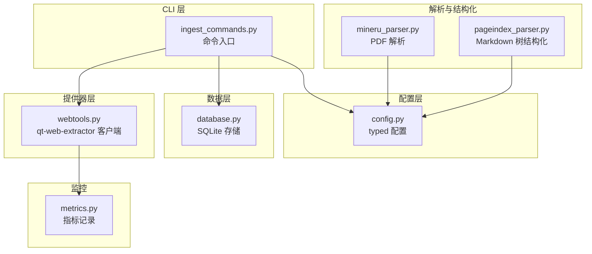
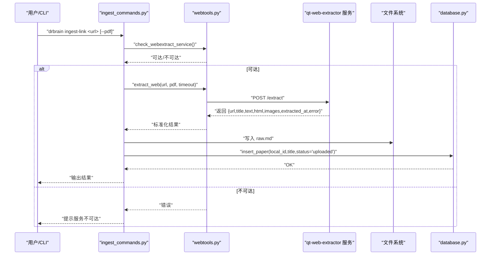
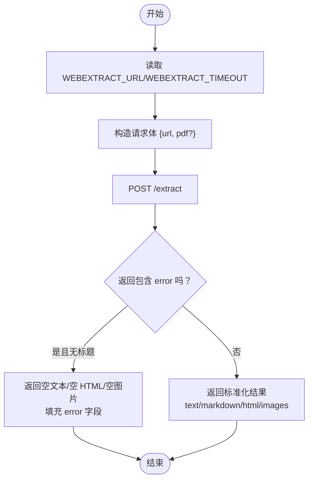
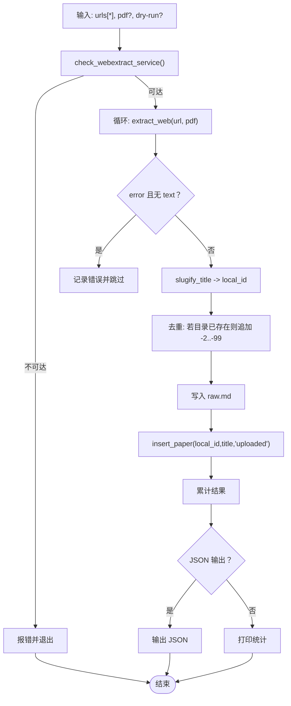
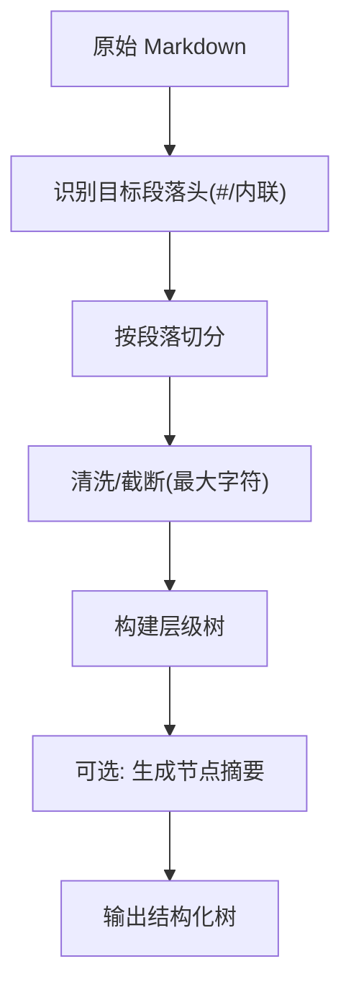
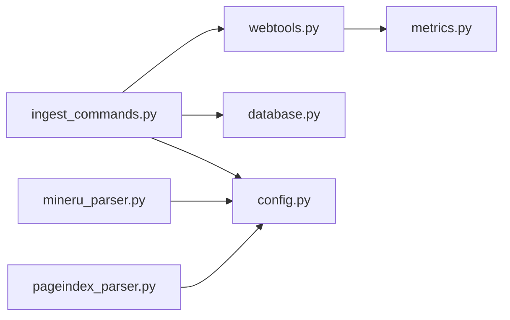

# 网页内容提取

<cite>
**本文引用的文件**
- [webtools.py](file://src/drbrain/providers/webtools.py)
- [ingest_commands.py](file://src/drbrain/cli/ingest_commands.py)
- [config.py](file://src/drbrain/config.py)
- [database.py](file://src/drbrain/storage/database.py)
- [mineru_parser.py](file://src/drbrain/parser/mineru_parser.py)
- [pageindex_parser.py](file://src/drbrain/parser/pageindex_parser.py)
- [metrics.py](file://src/drbrain/metrics.py)
- [SKILL.md](file://skills/ingest-link/SKILL.md)
</cite>

## 目录
1. [简介](#简介)
2. [项目结构](#项目结构)
3. [核心组件](#核心组件)
4. [架构总览](#架构总览)
5. [详细组件分析](#详细组件分析)
6. [依赖分析](#依赖分析)
7. [性能考虑](#性能考虑)
8. [故障排除指南](#故障排除指南)
9. [结论](#结论)
10. [附录](#附录)

## 简介
本技术文档聚焦 DrBrain 的“网页内容提取”能力，系统性阐述其与外部 qt-web-extractor 服务的集成方式、网页渲染与内容抽取流程、URL 处理策略、PDF 强制提取模式、图像识别与元数据提取、内容清洗与文本格式化、HTML 解析与 Markdown 转换、以及超时设置、错误处理、重试机制与性能监控等工程实践。同时提供可操作的提取示例与配置参数说明，并给出提取质量评估与故障排除建议。

## 项目结构
围绕网页内容提取的关键模块包括：
- 提供器层：通过 HTTP 连接外部 qt-web-extractor 服务，负责 URL 提取与健康检查。
- 命令层：CLI 子命令入口，负责调用提取器、写入本地存储、登记数据库状态。
- 配置层：统一加载与解析配置，支持环境变量覆盖。
- 数据层：SQLite 存储论文元数据与状态，支撑后续构建与检索。
- 解析与结构化：PDF 解析（MinerU/PyMuPDF）与 Markdown 树结构化（PageIndex），用于非网页场景；网页提取结果以 Markdown 文本为主。
- 指标与监控：通用指标记录器，便于追踪耗时与错误。

图表来源
- [webtools.py:67-134](file://src/drbrain/providers/webtools.py#L67-L134)
- [ingest_commands.py:464-567](file://src/drbrain/cli/ingest_commands.py#L464-L567)
- [config.py:182-292](file://src/drbrain/config.py#L182-L292)
- [database.py:159-346](file://src/drbrain/storage/database.py#L159-L346)
- [mineru_parser.py:95-318](file://src/drbrain/parser/mineru_parser.py#L95-L318)
- [pageindex_parser.py:412-486](file://src/drbrain/parser/pageindex_parser.py#L412-L486)
- [metrics.py:49-174](file://src/drbrain/metrics.py#L49-L174)

章节来源
- [webtools.py:1-135](file://src/drbrain/providers/webtools.py#L1-L135)
- [ingest_commands.py:464-567](file://src/drbrain/cli/ingest_commands.py#L464-L567)
- [config.py:182-292](file://src/drbrain/config.py#L182-L292)
- [database.py:159-346](file://src/drbrain/storage/database.py#L159-L346)
- [mineru_parser.py:95-318](file://src/drbrain/parser/mineru_parser.py#L95-L318)
- [pageindex_parser.py:412-486](file://src/drbrain/parser/pageindex_parser.py#L412-L486)
- [metrics.py:49-174](file://src/drbrain/metrics.py#L49-L174)

## 核心组件
- 外部网页提取器客户端：封装 HTTP 请求、超时控制、错误回退与返回标准化。
- CLI 入口：校验服务可用性、批量提取、生成本地 ID、写入 raw.md、登记数据库状态。
- 配置系统：统一加载 YAML 配置，支持环境变量替换，提供提取并发、超时、代理等参数。
- 数据存储：维护论文主表与 ID 映射，记录状态（如 uploaded）以便后续处理。
- 内容清洗与结构化：针对 PDF 的分段过滤、标题/年份/ID 抽取、树结构化与摘要生成（PDF 场景）；网页提取以 Markdown 文本为主。
- 性能与监控：通用计时装饰器与事件记录，便于定位瓶颈与异常。

章节来源
- [webtools.py:67-134](file://src/drbrain/providers/webtools.py#L67-L134)
- [ingest_commands.py:464-567](file://src/drbrain/cli/ingest_commands.py#L464-L567)
- [config.py:102-112](file://src/drbrain/config.py#L102-L112)
- [database.py:11-34](file://src/drbrain/storage/database.py#L11-L34)
- [mineru_parser.py:853-932](file://src/drbrain/parser/mineru_parser.py#L853-L932)
- [pageindex_parser.py:412-486](file://src/drbrain/parser/pageindex_parser.py#L412-L486)
- [metrics.py:134-174](file://src/drbrain/metrics.py#L134-L174)

## 架构总览
DrBrain 的网页内容提取采用“外部服务 + 内部编排”的设计：网页渲染与抽取由独立的 qt-web-extractor 服务完成，DrBrain 仅负责调用、落盘与入库。整体流程如下：

图表来源
- [ingest_commands.py:464-567](file://src/drbrain/cli/ingest_commands.py#L464-L567)
- [webtools.py:67-134](file://src/drbrain/providers/webtools.py#L67-L134)
- [database.py:279-318](file://src/drbrain/storage/database.py#L279-L318)

章节来源
- [ingest_commands.py:464-567](file://src/drbrain/cli/ingest_commands.py#L464-L567)
- [webtools.py:67-134](file://src/drbrain/providers/webtools.py#L67-L134)
- [database.py:279-318](file://src/drbrain/storage/database.py#L279-L318)

## 详细组件分析

### 组件 A：外部网页提取器客户端（webtools）
- 功能要点
  - 通过环境变量配置服务地址与超时，默认端点与超时值可被覆盖。
  - 将请求体序列化为 JSON 并发送到 /extract 端点，接收标准化响应。
  - 对错误进行分类记录，区分“无标题但有错误”与“成功但带错误”的情形。
  - 提供健康检查接口 /health，便于 CLI 在执行前探测服务可用性。
- 关键行为
  - 自动从 URL 推断是否强制 PDF 模式（当 pdf 参数未显式提供时）。
  - 返回字段包含：url、title、text/markdown、html、images、extracted_at、error。
- 错误处理
  - HTTPError/URLError/OSError/ValueError 均转为统一错误字典，避免上抛异常导致 CLI 中断。
- 性能与可靠性
  - 超时可控，避免长时间阻塞；日志记录失败详情，便于诊断。

图表来源
- [webtools.py:67-116](file://src/drbrain/providers/webtools.py#L67-L116)

章节来源
- [webtools.py:21-52](file://src/drbrain/providers/webtools.py#L21-L52)
- [webtools.py:67-134](file://src/drbrain/providers/webtools.py#L67-L134)

### 组件 B：CLI 网页提取命令（ingest-link）
- 功能要点
  - 校验外部提取服务可达性；若不可达则中止并提示配置方法。
  - 批量处理多个 URL，逐个提取并写入 raw.md。
  - 自动生成本地 ID（基于标题 slug 化，冲突时追加 -2/-3）。
  - 将提取结果登记到数据库，状态设为 uploaded。
- 流程图

图表来源
- [ingest_commands.py:464-567](file://src/drbrain/cli/ingest_commands.py#L464-L567)

章节来源
- [ingest_commands.py:464-567](file://src/drbrain/cli/ingest_commands.py#L464-L567)
- [SKILL.md:15-44](file://skills/ingest-link/SKILL.md#L15-L44)

### 组件 C：配置系统（config）
- 提取相关配置项
  - max_concurrent：提取并发数（影响队列与调度，间接影响网页提取吞吐）。
  - timeout_per_fetch：下载 PDF 的超时（与网页提取超时不同，后者由 WEBEXTRACT_TIMEOUT 控制）。
  - user_agent：下载 PDF 时的 UA。
  - fallback_order：PDF 获取的回退顺序（与网页提取无直接关系）。
  - institutional_proxy/proxy_type：机构代理配置（与网页提取无直接关系）。
- 环境变量覆盖
  - 支持在运行时通过环境变量覆盖配置项，便于部署灵活性。

章节来源
- [config.py:102-112](file://src/drbrain/config.py#L102-L112)
- [config.py:283-292](file://src/drbrain/config.py#L283-L292)

### 组件 D：数据存储（database）
- 表结构要点
  - papers：主表，包含 local_id、title、year、status、paper_type 等。
  - paper_ids：外部 ID 映射表（doi/arxiv/s2_id/openalex_id）。
- 网页提取后的登记
  - insert_paper(local_id,title,status='uploaded')，用于标记该条目已完成网页提取阶段。

章节来源
- [database.py:11-34](file://src/drbrain/storage/database.py#L11-L34)
- [database.py:279-318](file://src/drbrain/storage/database.py#L279-L318)

### 组件 E：内容清洗与结构化（PDF 场景）
虽然网页提取主要产出 Markdown 文本，但 DrBrain 的 PDF 解析与结构化流程可作为内容清洗与格式化的参考：
- 分段过滤：仅保留目标学术段落（Abstract/Introduction/Related Work/Method/Conclusion/Limitations/Future Work/Discussion/Results 等），并支持内联标记匹配。
- 标题/年份/ID 抽取：从首若干行中抽取标题、年份与 DOI/arXiv。
- 树结构化：将 Markdown 节点转换为层级树，支持节点摘要生成与深度限制。
- 图像提取：MinerU 输出 images 目录，PDF 解析可合并多分块图像。

图表来源
- [mineru_parser.py:853-932](file://src/drbrain/parser/mineru_parser.py#L853-L932)
- [pageindex_parser.py:412-486](file://src/drbrain/parser/pageindex_parser.py#L412-L486)

章节来源
- [mineru_parser.py:853-932](file://src/drbrain/parser/mineru_parser.py#L853-L932)
- [pageindex_parser.py:412-486](file://src/drbrain/parser/pageindex_parser.py#L412-L486)

## 依赖分析
- CLI 依赖 webtools 进行外部服务调用与健康检查。
- webtools 依赖环境变量控制服务地址与超时。
- CLI 依赖 database 进行入库登记。
- 配置系统为 CLI 与解析模块提供统一参数来源。
- 指标模块为关键路径提供计时与事件记录能力。

图表来源
- [ingest_commands.py:464-567](file://src/drbrain/cli/ingest_commands.py#L464-L567)
- [webtools.py:67-134](file://src/drbrain/providers/webtools.py#L67-L134)
- [database.py:279-318](file://src/drbrain/storage/database.py#L279-L318)
- [config.py:182-292](file://src/drbrain/config.py#L182-L292)
- [metrics.py:49-174](file://src/drbrain/metrics.py#L49-L174)
- [mineru_parser.py:95-318](file://src/drbrain/parser/mineru_parser.py#L95-L318)
- [pageindex_parser.py:412-486](file://src/drbrain/parser/pageindex_parser.py#L412-L486)

章节来源
- [ingest_commands.py:464-567](file://src/drbrain/cli/ingest_commands.py#L464-L567)
- [webtools.py:67-134](file://src/drbrain/providers/webtools.py#L67-L134)
- [database.py:279-318](file://src/drbrain/storage/database.py#L279-L318)
- [config.py:182-292](file://src/drbrain/config.py#L182-L292)
- [metrics.py:49-174](file://src/drbrain/metrics.py#L49-L174)
- [mineru_parser.py:95-318](file://src/drbrain/parser/mineru_parser.py#L95-L318)
- [pageindex_parser.py:412-486](file://src/drbrain/parser/pageindex_parser.py#L412-L486)

## 性能考虑
- 超时与并发
  - 网页提取超时由 WEBEXTRACT_TIMEOUT 控制；CLI 会将单次提取耗时纳入日志，便于观察。
  - 提取并发受 max_concurrent 影响（间接影响队列与调度）。
- 重试与稳定性
  - webtools 对网络错误进行捕获与降级，返回标准化错误信息，避免中断。
  - PDF 解析（MinerU/PyMuPDF）具备重试与超时控制，提升鲁棒性。
- 监控与度量
  - 使用 metrics 计时装饰器或上下文管理器记录关键路径耗时与状态，便于性能分析与告警。

章节来源
- [webtools.py:28-32](file://src/drbrain/providers/webtools.py#L28-L32)
- [webtools.py:35-52](file://src/drbrain/providers/webtools.py#L35-L52)
- [config.py:102-112](file://src/drbrain/config.py#L102-L112)
- [mineru_parser.py:390-423](file://src/drbrain/parser/mineru_parser.py#L390-L423)
- [metrics.py:134-174](file://src/drbrain/metrics.py#L134-L174)

## 故障排除指南
- 服务不可达
  - 现象：提示外部提取服务不可达。
  - 处理：确认 WEBEXTRACT_URL 指向正确实例；确保端口开放；必要时使用 check_webextract_service 进行快速验证。
- 提取失败但无文本
  - 现象：返回 error 字段，text/html/images 均为空。
  - 处理：查看日志中的错误详情；检查 URL 是否有效、是否需要强制 PDF 模式；调整超时。
- URL 处理与 PDF 强制
  - 现象：某些站点需强制 PDF 模式才能稳定抓取。
  - 处理：使用 --pdf 选项强制 PDF 模式；或根据 URL 自动推断（当 pdf 未显式提供时）。
- 重复条目与本地 ID 冲突
  - 现象：同名标题生成相同 local_id。
  - 处理：系统自动追加 -2/-3…；可在入库后手动修正。
- 数据库状态不一致
  - 现象：入库后状态未更新。
  - 处理：确认 insert_paper 调用与提交逻辑；检查数据库连接与事务。

章节来源
- [webtools.py:119-134](file://src/drbrain/providers/webtools.py#L119-L134)
- [ingest_commands.py:464-567](file://src/drbrain/cli/ingest_commands.py#L464-L567)
- [database.py:279-318](file://src/drbrain/storage/database.py#L279-L318)

## 结论
DrBrain 的网页内容提取以“外部服务 + 内部编排”为核心：外部 qt-web-extractor 负责网页渲染与抽取，DrBrain 负责调用、落盘与入库。通过环境变量与配置系统实现灵活部署，借助指标模块实现可观测性。PDF 场景下的内容清洗与结构化流程可作为网页提取后进一步处理的参考。建议在生产环境中合理设置超时与并发，完善健康检查与错误回退策略，并结合指标监控持续优化提取质量与稳定性。

## 附录

### 提取示例与使用方法
- 基本用法
  - 单个网页：drbrain ingest-link https://example.com/page
  - 批量网页：drbrain ingest-link https://a.com https://b.com
  - 强制 PDF 模式：drbrain ingest-link https://example.com/report.pdf --pdf
  - 预览模式：drbrain ingest-link https://example.com --dry-run
  - JSON 输出：drbrain ingest-link https://example.com --json
- 前置条件
  - 确保外部 qt-web-extractor 服务运行在默认端口（或通过 WEBEXTRACT_URL 指定）。

章节来源
- [SKILL.md:20-44](file://skills/ingest-link/SKILL.md#L20-L44)
- [ingest_commands.py:464-496](file://src/drbrain/cli/ingest_commands.py#L464-L496)

### 配置参数说明
- 网页提取相关
  - WEBEXTRACT_URL：外部提取服务地址（默认 http://127.0.0.1:8766）
  - WEBEXTRACT_TIMEOUT：提取超时（秒，默认 60）
- PDF 获取相关（与网页提取无直接关系）
  - fetch.timeout_per_fetch：下载 PDF 超时（秒，默认 60）
  - fetch.user_agent：下载 UA（默认 DrBrain/0.1）
  - fetch.institutional_proxy/proxy_type：机构代理配置
- 其他
  - WEBEXTRACT_URL/QT_WEB_EXTRACTOR_URL：兼容旧环境变量别名

章节来源
- [webtools.py:21-32](file://src/drbrain/providers/webtools.py#L21-L32)
- [config.py:102-112](file://src/drbrain/config.py#L102-L112)