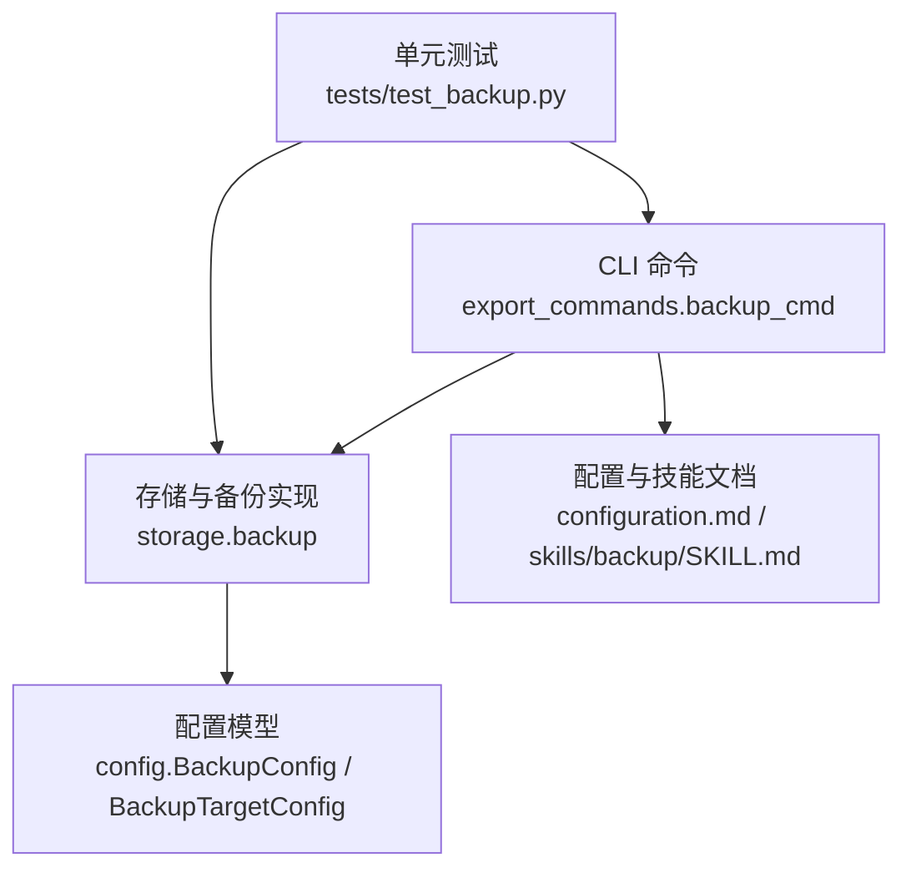
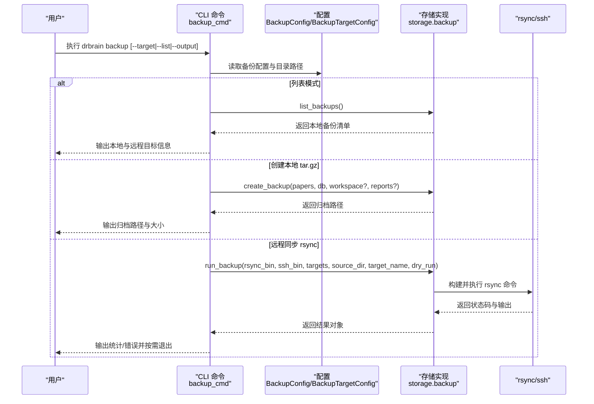
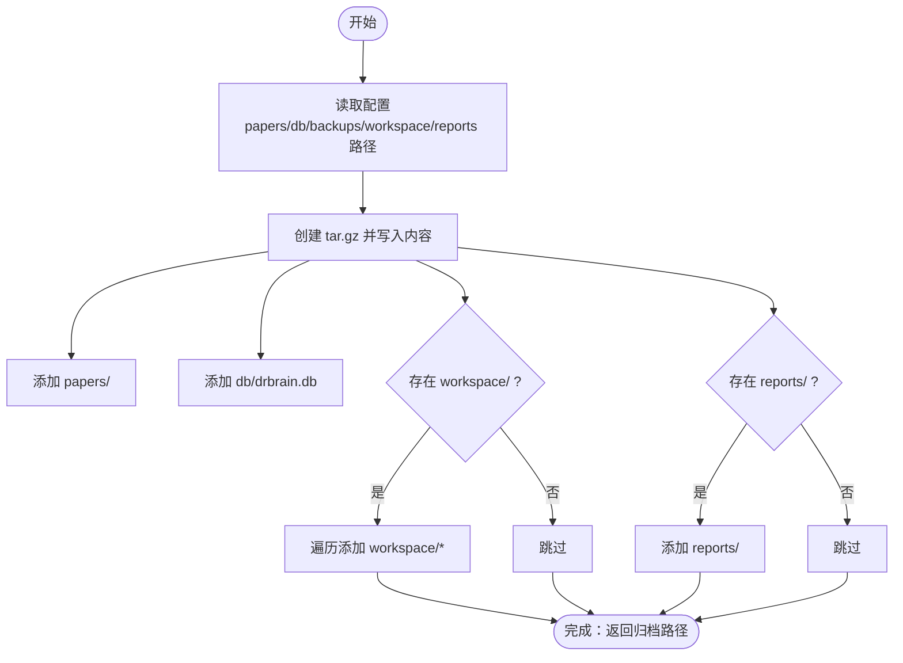
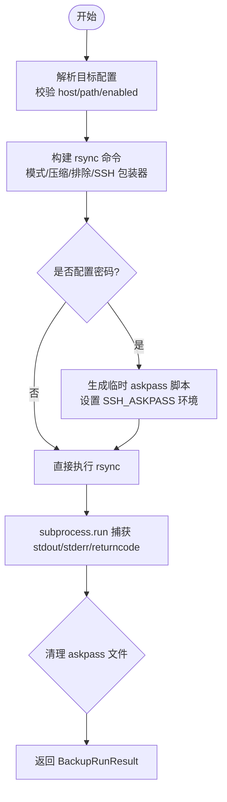
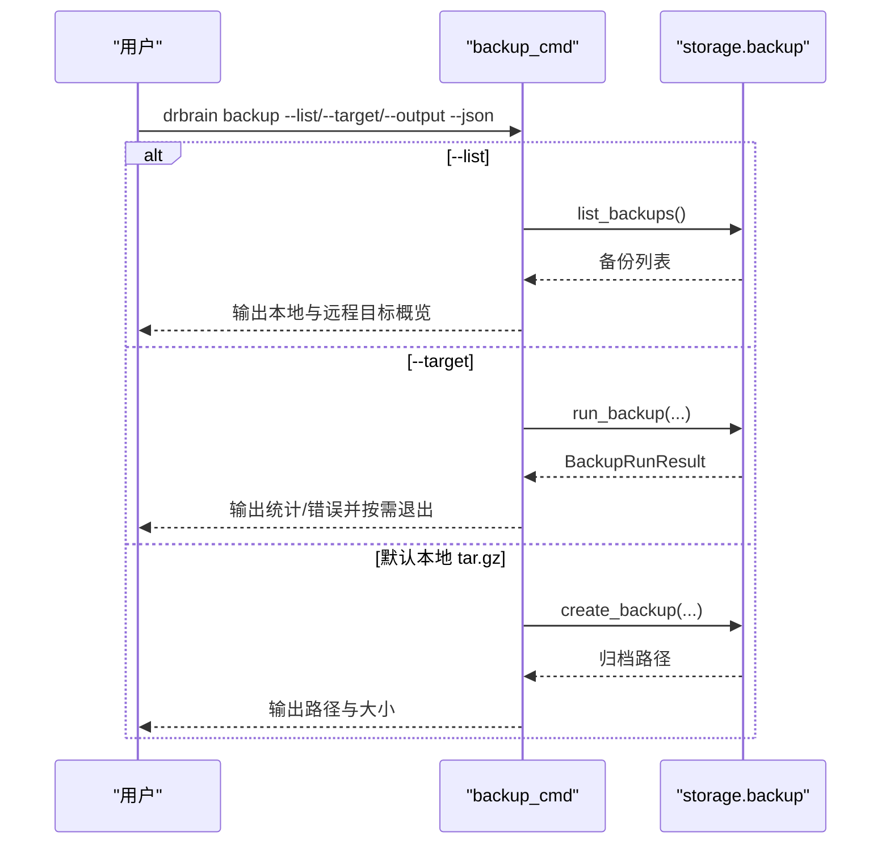
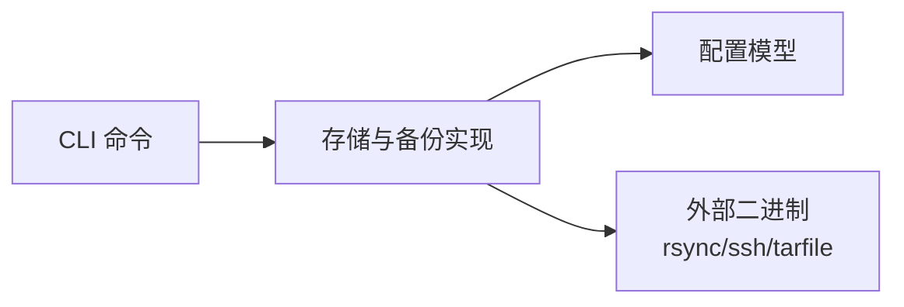

# 备份与恢复

<cite>
**本文引用的文件**
- [src/drbrain/storage/backup.py](file://src/drbrain/storage/backup.py)
- [src/drbrain/cli/export_commands.py](file://src/drbrain/cli/export_commands.py)
- [src/drbrain/config.py](file://src/drbrain/config.py)
- [config.example.yaml](file://config.example.yaml)
- [docs/configuration.md](file://docs/configuration.md)
- [skills/backup/SKILL.md](file://skills/backup/SKILL.md)
- [tests/test_backup.py](file://tests/test_backup.py)
- [docs/troubleshooting.md](file://docs/troubleshooting.md)
</cite>

## 目录
1. [简介](#简介)
2. [项目结构](#项目结构)
3. [核心组件](#核心组件)
4. [架构总览](#架构总览)
5. [详细组件分析](#详细组件分析)
6. [依赖分析](#依赖分析)
7. [性能考虑](#性能考虑)
8. [故障排除指南](#故障排除指南)
9. [结论](#结论)
10. [附录](#附录)

## 简介
本文件面向 DrBrain 的备份与恢复系统，提供从策略、配置到执行流程、验证与恢复测试的完整技术文档。内容涵盖：
- 自动备份与手动备份的配置与使用
- 备份数据格式（本地 tar.gz）与存储位置
- 增量与全量备份的差异与适用场景
- 备份验证与恢复测试操作指南
- 备份数据安全性与加密机制说明
- 备份失败的故障排除与恢复方案
- 与版本控制的集成方式建议

## 项目结构
DrBrain 的备份能力由以下模块协同实现：
- CLI 命令层：负责解析用户输入、调用备份子系统
- 存储与备份实现层：封装本地归档与远程同步逻辑
- 配置层：定义备份目标与默认参数
- 文档与技能：提供配置示例与命令参考
- 测试：覆盖命令行为、命令构建与错误处理

**图表来源**
- [src/drbrain/cli/export_commands.py:283-427](file://src/drbrain/cli/export_commands.py#L283-L427)
- [src/drbrain/storage/backup.py:1-240](file://src/drbrain/storage/backup.py#L1-L240)
- [src/drbrain/config.py:143-178](file://src/drbrain/config.py#L143-L178)
- [docs/configuration.md:267-304](file://docs/configuration.md#L267-L304)
- [skills/backup/SKILL.md:1-58](file://skills/backup/SKILL.md#L1-L58)
- [tests/test_backup.py:1-390](file://tests/test_backup.py#L1-L390)

**章节来源**
- [src/drbrain/cli/export_commands.py:283-427](file://src/drbrain/cli/export_commands.py#L283-L427)
- [src/drbrain/storage/backup.py:1-240](file://src/drbrain/storage/backup.py#L1-L240)
- [src/drbrain/config.py:143-178](file://src/drbrain/config.py#L143-L178)
- [config.example.yaml:127-144](file://config.example.yaml#L127-L144)
- [docs/configuration.md:267-304](file://docs/configuration.md#L267-L304)
- [skills/backup/SKILL.md:1-58](file://skills/backup/SKILL.md#L1-L58)
- [tests/test_backup.py:1-390](file://tests/test_backup.py#L1-L390)

## 核心组件
- 本地 tar.gz 备份：将 papers、数据库、workspace、reports 等关键目录打包为压缩归档，便于离线保存与快速恢复。
- 远程 rsync 同步：通过 SSH 将本地数据增量同步至远端服务器，支持多种传输模式与过滤规则。
- CLI 命令：提供列表、创建、远程同步、预演等能力；支持 JSON 输出与错误码返回。
- 配置模型：定义备份二进制路径、目标主机、认证方式、传输模式、压缩与排除规则等。

**章节来源**
- [src/drbrain/storage/backup.py:26-63](file://src/drbrain/storage/backup.py#L26-L63)
- [src/drbrain/storage/backup.py:171-196](file://src/drbrain/storage/backup.py#L171-L196)
- [src/drbrain/cli/export_commands.py:283-427](file://src/drbrain/cli/export_commands.py#L283-L427)
- [src/drbrain/config.py:143-178](file://src/drbrain/config.py#L143-L178)
- [config.example.yaml:127-144](file://config.example.yaml#L127-L144)
- [docs/configuration.md:267-304](file://docs/configuration.md#L267-L304)

## 架构总览
下图展示从 CLI 到存储实现再到远程同步的整体流程：

**图表来源**
- [src/drbrain/cli/export_commands.py:283-427](file://src/drbrain/cli/export_commands.py#L283-L427)
- [src/drbrain/storage/backup.py:171-239](file://src/drbrain/storage/backup.py#L171-L239)
- [src/drbrain/config.py:143-178](file://src/drbrain/config.py#L143-L178)

## 详细组件分析

### 组件一：本地 tar.gz 备份
- 功能要点
  - 归档内容：papers、drbrain.db、workspace（可选）、reports（可选）
  - 输出命名：以时间戳命名，统一前缀与扩展名
  - 输出目录：默认 data/backups，可通过配置或命令行覆盖
- 数据流
  - 解析配置中的目录路径
  - 按需添加各目录到归档
  - 记录日志并返回归档路径

**图表来源**
- [src/drbrain/storage/backup.py:26-63](file://src/drbrain/storage/backup.py#L26-L63)
- [src/drbrain/cli/export_commands.py:394-427](file://src/drbrain/cli/export_commands.py#L394-L427)

**章节来源**
- [src/drbrain/storage/backup.py:26-63](file://src/drbrain/storage/backup.py#L26-L63)
- [src/drbrain/cli/export_commands.py:394-427](file://src/drbrain/cli/export_commands.py#L394-L427)
- [tests/test_backup.py:25-170](file://tests/test_backup.py#L25-L170)

### 组件二：远程 rsync 同步
- 功能要点
  - 支持三种传输模式：default、append、append-verify
  - 可配置压缩、排除模式、SSH 端口与密钥
  - 支持密码认证（非交互式）与临时 askpass 环境
- 命令构建
  - 基于目标配置动态拼接 rsync 参数
  - 通过 SSH 包装器注入认证与端口设置
- 执行与结果
  - 使用子进程运行 rsync，捕获标准输出与错误
  - 返回结构化结果对象，供 CLI 展示与判断

**图表来源**
- [src/drbrain/storage/backup.py:96-106](file://src/drbrain/storage/backup.py#L96-L106)
- [src/drbrain/storage/backup.py:171-196](file://src/drbrain/storage/backup.py#L171-L196)
- [src/drbrain/storage/backup.py:218-239](file://src/drbrain/storage/backup.py#L218-L239)

**章节来源**
- [src/drbrain/storage/backup.py:171-196](file://src/drbrain/storage/backup.py#L171-L196)
- [src/drbrain/storage/backup.py:136-163](file://src/drbrain/storage/backup.py#L136-L163)
- [src/drbrain/storage/backup.py:199-239](file://src/drbrain/storage/backup.py#L199-L239)
- [tests/test_backup.py:221-348](file://tests/test_backup.py#L221-L348)

### 组件三：CLI 命令与交互
- 命令行为
  - --list：列出本地备份与已配置的远程目标
  - --target <name>：对指定目标执行 rsync 同步（可带 --dry-run 预演）
  - --output <path>：自定义本地归档输出路径
  - --json：以 JSON 输出机器可读结果
- 错误处理
  - 未配置目标时提示并退出
  - rsync 返回非零退出码时提示并退出
  - 内部异常转换为用户可见消息并退出

**图表来源**
- [src/drbrain/cli/export_commands.py:283-427](file://src/drbrain/cli/export_commands.py#L283-L427)
- [src/drbrain/storage/backup.py:199-239](file://src/drbrain/storage/backup.py#L199-L239)

**章节来源**
- [src/drbrain/cli/export_commands.py:283-427](file://src/drbrain/cli/export_commands.py#L283-L427)
- [tests/test_cli_commands.py:831-842](file://tests/test_cli_commands.py#L831-L842)

### 组件四：配置模型与默认值
- BackupConfig
  - 字段：ssh_bin、rsync_bin、targets（字典）
- BackupTargetConfig
  - 字段：host、user、path、port、identity_file、password、mode、compress、enabled、exclude
- 默认值
  - ssh_bin="ssh"、rsync_bin="rsync"
  - port=22、mode="default"、compress=True、enabled=True、exclude=[]

**章节来源**
- [src/drbrain/config.py:143-178](file://src/drbrain/config.py#L143-L178)
- [config.example.yaml:127-144](file://config.example.yaml#L127-L144)
- [docs/configuration.md:267-304](file://docs/configuration.md#L267-L304)
- [tests/test_backup.py:376-390](file://tests/test_backup.py#L376-L390)

## 依赖分析
- 组件耦合
  - CLI 仅依赖存储模块接口，低耦合高内聚
  - 存储模块依赖配置模型与外部二进制（rsync/ssh），通过命令行参数与环境变量解耦
- 外部依赖
  - rsync/ssh：用于远程同步
  - tarfile：用于本地归档
  - subprocess：用于执行外部命令
- 潜在循环依赖
  - 未发现循环导入；模块职责清晰

**图表来源**
- [src/drbrain/cli/export_commands.py:283-427](file://src/drbrain/cli/export_commands.py#L283-L427)
- [src/drbrain/storage/backup.py:1-240](file://src/drbrain/storage/backup.py#L1-L240)
- [src/drbrain/config.py:143-178](file://src/drbrain/config.py#L143-L178)

**章节来源**
- [src/drbrain/cli/export_commands.py:283-427](file://src/drbrain/cli/export_commands.py#L283-L427)
- [src/drbrain/storage/backup.py:1-240](file://src/drbrain/storage/backup.py#L1-L240)
- [src/drbrain/config.py:143-178](file://src/drbrain/config.py#L143-L178)

## 性能考虑
- 本地归档
  - 压缩比与速度取决于 tar.gz 算法；适合离线归档与跨平台传输
  - 建议定期清理不必要的缓存与日志，减少归档体积
- 远程同步
  - 增量同步基于 rsync 算法，传输效率高
  - 压缩开关影响网络带宽与 CPU 占用；根据网络条件权衡
  - 排除规则可显著降低传输量，建议排除日志、缓存与临时文件
- 批处理与并发
  - CLI 未内置多目标并发；可通过外部调度工具并行触发多个目标

[本节为通用指导，无需特定文件引用]

## 故障排除指南
- 常见问题与定位
  - 未安装 rsync/ssh：命令构建阶段即报错，检查二进制路径与权限
  - 目标不可用：校验 host/path/enabled；确认网络连通性
  - 密码认证失败：确认 password 配置与 askpass 环境；避免明文存储
  - 权限不足：确保 SSH 密钥或密码正确；必要时调整远程目录权限
- 恢复与回滚
  - 本地恢复：解压 data/backups/drbrain-<timestamp>.tar.gz 至原位
  - 数据库迁移：如迁移失败，优先使用最近一次备份恢复
- 日志与诊断
  - CLI 输出包含 rsync 统计与错误；必要时开启更详细日志级别
  - 使用 --dry-run 预演远程同步，避免误操作

**章节来源**
- [src/drbrain/storage/backup.py:218-239](file://src/drbrain/storage/backup.py#L218-L239)
- [src/drbrain/cli/export_commands.py:353-392](file://src/drbrain/cli/export_commands.py#L353-L392)
- [docs/troubleshooting.md:175-198](file://docs/troubleshooting.md#L175-L198)
- [tests/test_backup.py:351-374](file://tests/test_backup.py#L351-L374)

## 结论
DrBrain 的备份系统以“本地 tar.gz + 远程 rsync”为核心，兼顾易用性与可靠性。通过清晰的配置模型、完善的 CLI 交互与严格的错误处理，用户可在不同场景下选择合适的备份策略，并在需要时快速验证与恢复。建议结合版本控制与自动化脚本，形成可审计、可重复的备份流程。

[本节为总结性内容，无需特定文件引用]

## 附录

### A. 备份策略与配置选项
- 本地备份
  - 目录：data/backups（可通过命令行覆盖）
  - 内容：papers、drbrain.db、workspace（可选）、reports（可选）
- 远程备份
  - 目标配置项：host、user、path、port、identity_file、password、mode、compress、enabled、exclude
  - 传输模式：default（标准增量）、append（追加模式）、append-verify（追加并校验）
  - 示例与字段说明参见配置文档与示例文件

**章节来源**
- [src/drbrain/storage/backup.py:18-63](file://src/drbrain/storage/backup.py#L18-L63)
- [src/drbrain/config.py:143-178](file://src/drbrain/config.py#L143-L178)
- [config.example.yaml:127-144](file://config.example.yaml#L127-L144)
- [docs/configuration.md:267-304](file://docs/configuration.md#L267-L304)

### B. 增量备份与全量备份
- 增量备份
  - 通过 rsync 的默认算法实现，仅传输变更文件，适合频繁同步
- 全量备份
  - 通过本地 tar.gz 实现，适合离线归档与跨平台迁移
- 适用场景
  - 增量：日常同步、远程归档
  - 全量：灾难恢复、长期归档、审计备份

**章节来源**
- [src/drbrain/storage/backup.py:171-196](file://src/drbrain/storage/backup.py#L171-L196)
- [src/drbrain/storage/backup.py:26-63](file://src/drbrain/storage/backup.py#L26-L63)

### C. 备份验证与恢复测试
- 验证步骤
  - 列出备份：drbrain backup --list
  - 预演同步：drbrain backup --target <name> --dry-run
  - 检查输出与返回码
- 恢复测试
  - 在隔离环境中解压归档，核对关键文件是否存在
  - 对照数据库与索引重建流程进行功能回归

**章节来源**
- [src/drbrain/cli/export_commands.py:300-331](file://src/drbrain/cli/export_commands.py#L300-L331)
- [src/drbrain/cli/export_commands.py:353-392](file://src/drbrain/cli/export_commands.py#L353-L392)
- [docs/troubleshooting.md:175-198](file://docs/troubleshooting.md#L175-L198)

### D. 安全性与加密机制
- 认证与传输
  - SSH 私钥与端口配置用于加密传输
  - 密码认证通过 askpass 环境传递，避免明文参数
- 存储安全
  - 本地归档未内置加密；建议配合文件系统级加密或外部加密工具
  - 远端服务器应限制访问权限与保留最小可用日志

**章节来源**
- [src/drbrain/storage/backup.py:115-133](file://src/drbrain/storage/backup.py#L115-L133)
- [src/drbrain/storage/backup.py:136-163](file://src/drbrain/storage/backup.py#L136-L163)
- [src/drbrain/config.py:143-178](file://src/drbrain/config.py#L143-L178)

### E. 与版本控制的集成
- 建议做法
  - 将 data/backups/ 作为独立工作副本或外部存储，避免纳入主仓库
  - 使用 Git hooks 或 CI 触发备份任务，形成可追溯的备份历史
  - 对敏感配置（如密码）使用受控的密钥管理工具，不在仓库中提交
- 工具链
  - Git：记录备份策略与变更
  - CI：自动化执行备份与验证

**章节来源**
- [skills/backup/SKILL.md:1-58](file://skills/backup/SKILL.md#L1-L58)
- [.github/workflows/ci.yml:1-38](file://.github/workflows/ci.yml#L1-L38)