# 存储管理系统

<cite>
**本文档引用的文件**
- [database.py](file://src/drbrain/storage/database.py)
- [workspace.py](file://src/drbrain/storage/workspace.py)
- [backup.py](file://src/drbrain/storage/backup.py)
- [paths.py](file://src/drbrain/storage/paths.py)
- [explore.py](file://src/drbrain/storage/explore.py)
- [export.py](file://src/drbrain/storage/export.py)
- [inbox.py](file://src/drbrain/storage/inbox.py)
- [proceedings.py](file://src/drbrain/storage/proceedings.py)
- [citation_graph.py](file://src/drbrain/storage/citation_graph.py)
- [config.py](file://src/drbrain/config.py)
- [test_database_extended.py](file://tests/test_database_extended.py)
- [test_workspace.py](file://tests/test_workspace.py)
- [test_backup.py](file://tests/test_backup.py)
</cite>

## 目录
1. [简介](#简介)
2. [项目结构](#项目结构)
3. [核心组件](#核心组件)
4. [架构总览](#架构总览)
5. [详细组件分析](#详细组件分析)
6. [依赖关系分析](#依赖关系分析)
7. [性能考虑](#性能考虑)
8. [故障排除指南](#故障排除指南)
9. [结论](#结论)
10. [附录](#附录)

## 简介
本文件为 DrBrain 存储管理系统的权威技术文档，覆盖数据库设计、文件存储、备份与恢复、工作空间管理、探索集合、导出格式、收件箱与待处理文件、会议论文集以及引文图分析等核心功能。文档从代码级实现出发，结合测试用例与配置说明，系统阐述数据模型、约束关系、迁移策略、并发与性能优化、以及数据迁移与版本兼容处理。

## 项目结构
存储相关模块主要位于 src/drbrain/storage 下，围绕 SQLite 数据库、文件目录结构、备份与远程同步、工作空间与探索集合、导出工具、收件箱与待处理文件、会议论文集以及引文图分析展开。配置通过 config.py 提供路径、数据库位置、备份目标等参数。

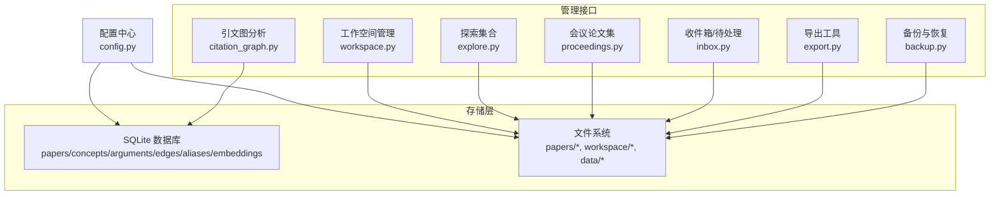

**图表来源**
- [database.py:10-156](file://src/drbrain/storage/database.py#L10-L156)
- [workspace.py:1-212](file://src/drbrain/storage/workspace.py#L1-L212)
- [explore.py:1-203](file://src/drbrain/storage/explore.py#L1-L203)
- [proceedings.py:1-122](file://src/drbrain/storage/proceedings.py#L1-L122)
- [inbox.py:1-55](file://src/drbrain/storage/inbox.py#L1-L55)
- [export.py:1-180](file://src/drbrain/storage/export.py#L1-L180)
- [backup.py:1-240](file://src/drbrain/storage/backup.py#L1-L240)
- [config.py:70-180](file://src/drbrain/config.py#L70-L180)

**章节来源**
- [database.py:10-156](file://src/drbrain/storage/database.py#L10-L156)
- [workspace.py:1-212](file://src/drbrain/storage/workspace.py#L1-L212)
- [explore.py:1-203](file://src/drbrain/storage/explore.py#L1-L203)
- [proceedings.py:1-122](file://src/drbrain/storage/proceedings.py#L1-L122)
- [inbox.py:1-55](file://src/drbrain/storage/inbox.py#L1-L55)
- [export.py:1-180](file://src/drbrain/storage/export.py#L1-L180)
- [backup.py:1-240](file://src/drbrain/storage/backup.py#L1-L240)
- [config.py:70-180](file://src/drbrain/config.py#L70-L180)

## 核心组件
- SQLite 数据库：统一存储论文元数据、概念、论点、关系、别名、向量嵌入、树向量与摘要、构建阶段状态、模式版本等。
- 文件系统：按论文本地 ID 组织的目录结构，存放原始 Markdown、PDF 副本、提取图片等；工作空间与探索集合采用轻量 JSON/YAML 元数据。
- 备份与恢复：本地 tar.gz 备份与 rsync 远程同步，支持压缩、排除规则、干运行与密码认证。
- 工作空间：面向聚焦分析的论文子集管理，支持增删、重命名、列表与查询。
- 探索集合：临时探索用的小型文献集合，JSONL 记录论文，支持关键词搜索。
- 导出工具：将论文元数据导出为 BibTeX、RIS、Markdown 格式。
- 收件箱与待处理：扫描收件箱中的 PDF，失败时移动到待处理并记录原因。
- 会议论文集：JSON 存储会议信息及关联论文。
- 引文图分析：基于缓存的引文统计与共享参考发现。

**章节来源**
- [database.py:159-775](file://src/drbrain/storage/database.py#L159-L775)
- [workspace.py:71-212](file://src/drbrain/storage/workspace.py#L71-L212)
- [backup.py:26-240](file://src/drbrain/storage/backup.py#L26-L240)
- [explore.py:49-203](file://src/drbrain/storage/explore.py#L49-L203)
- [export.py:68-180](file://src/drbrain/storage/export.py#L68-L180)
- [inbox.py:12-55](file://src/drbrain/storage/inbox.py#L12-L55)
- [proceedings.py:31-122](file://src/drbrain/storage/proceedings.py#L31-L122)
- [citation_graph.py:8-129](file://src/drbrain/storage/citation_graph.py#L8-L129)

## 架构总览
存储系统采用“数据库 + 文件系统”的混合架构：
- 数据库负责结构化知识图谱（论文、概念、关系、证据）与元数据管理，并内置模式迁移。
- 文件系统负责论文制品（原始文本、PDF、图片）与工作空间/探索集合的轻量持久化。
- 备份模块提供本地归档与远程同步能力，确保数据可恢复性。

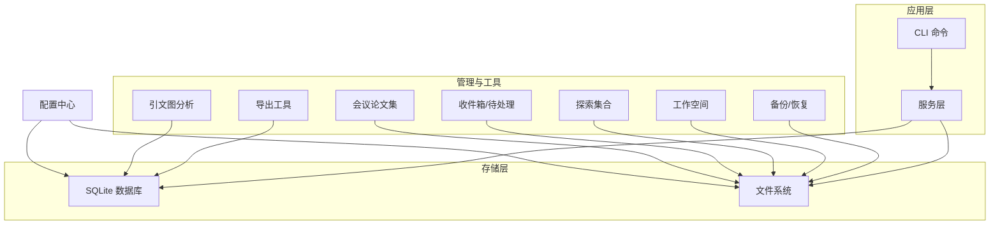

**图表来源**
- [database.py:159-775](file://src/drbrain/storage/database.py#L159-L775)
- [backup.py:26-240](file://src/drbrain/storage/backup.py#L26-L240)
- [export.py:68-180](file://src/drbrain/storage/export.py#L68-L180)
- [workspace.py:71-212](file://src/drbrain/storage/workspace.py#L71-L212)
- [explore.py:49-203](file://src/drbrain/storage/explore.py#L49-L203)
- [inbox.py:12-55](file://src/drbrain/storage/inbox.py#L12-L55)
- [proceedings.py:31-122](file://src/drbrain/storage/proceedings.py#L31-L122)
- [citation_graph.py:74-129](file://src/drbrain/storage/citation_graph.py#L74-L129)
- [config.py:70-180](file://src/drbrain/config.py#L70-L180)

## 详细组件分析

### 数据库设计与模式迁移
- 表结构概览
  - papers：论文主表，含类型、状态、元数据字段与外键标识。
  - paper_ids：外部 ID 映射（DOI/arXiv/S2/OpenAlex）。
  - concepts/arguments/edges：知识图谱三元组（概念、论点、关系）。
  - aliases：别名到规范 ID 的映射。
  - embeddings/tree_vectors/tree_summaries/vector_metadata：向量与树摘要。
  - confidence_queue：置信度审核队列。
  - research_seeds：研究种子。
  - citation_cache：引文缓存。
  - build_stages：构建阶段状态。
  - schema_versions：模式版本跟踪。
- 约束与索引
  - 主键、唯一约束、外键级联删除。
  - 针对高频查询建立索引（如概念类型、标签、年份、边关系等）。
- 模式迁移
  - 通过 schema_versions 跟踪当前版本，按序执行迁移函数，自动补齐缺失列或新增表。
  - 迁移包括：paper_type、期刊/出版信息、作者、节点 ID、边溯源字段等。

```mermaid
erDiagram
PAPERS {
text local_id PK
text title
text abstract
int year
text paper_type
text status
text journal
text publisher
int citation_count
text volume
text pages
text authors
timestamp created_at
}
PAPER_IDS {
text local_id FK
text doi UK
text arxiv UK
text s2_id UK
text openalex_id UK
}
CONCEPTS {
int concept_id PK
text local_id FK
text type
text label
real confidence
text section
text node_id
int first_seen
int last_seen
}
ARGUMENTS {
int arg_id PK
text source_paper FK
text claim
text claim_type
text target_label
text target_type
text evidence_type
text evidence_detail
text mechanism
text section
text node_id
real confidence
timestamp created_at
}
EDGES {
text src_id
text dst_id
text relation
text source_paper
real weight
PK src_id,dst_id,relation,source_paper
}
ALIASES {
text variant PK
text canonical_id
}
EMBEDDINGS {
text entity PK
blob vec
int dim
}
TREE_VECTORS {
text node_id PK
text paper_id
blob embedding
text content_hash
text tree_layer
}
TREE_SUMMARIES {
text node_id PK
text paper_id
text summary_text
text source_node_ids
int tree_layer
}
CONFIDENCE_QUEUE {
int queue_id PK
text source_paper
text item_type
text item_data
real confidence
text status
timestamp created_at
}
RESEARCH_SEEDS {
int seed_id PK
text pattern_type
text description
real confidence
timestamp created_at
}
CITATION_CACHE {
text source_paper
text target_title
int target_year
text relation
text target_doi
text target_s2_id
timestamp cached_at
PK source_paper,target_title
}
BUILD_STAGES {
text paper_id
text stage
text status
text result_json
timestamp updated_at
PK paper_id,stage
}
SCHEMA_VERSIONS {
int version PK
timestamp applied_at
}
PAPERS ||--o{ PAPER_IDS : "映射"
PAPERS ||--o{ CONCEPTS : "拥有"
PAPERS ||--o{ ARGUMENTS : "产生"
PAPERS ||--o{ EDGES : "参与"
PAPERS ||--o{ CITATION_CACHE : "引用"
PAPERS ||--o{ BUILD_STAGES : "构建"
```

**图表来源**
- [database.py:10-156](file://src/drbrain/storage/database.py#L10-L156)

**章节来源**
- [database.py:10-156](file://src/drbrain/storage/database.py#L10-L156)
- [database.py:175-246](file://src/drbrain/storage/database.py#L175-L246)

#### 模式迁移流程
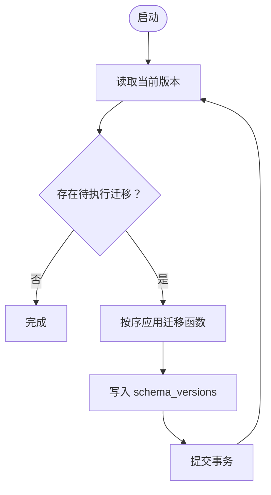

**图表来源**
- [database.py:175-200](file://src/drbrain/storage/database.py#L175-L200)

**章节来源**
- [database.py:175-200](file://src/drbrain/storage/database.py#L175-L200)

### 文件存储与路径组织
- 按论文本地 ID 组织目录，包含原始 Markdown、PDF 副本、提取图片等。
- 提供路径工具函数，便于在不同模块间复用。

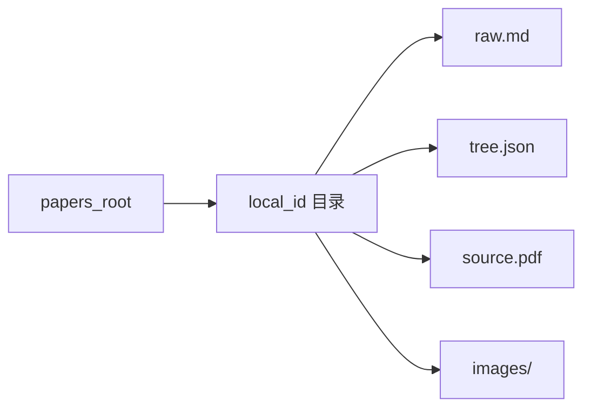

**图表来源**
- [paths.py:6-29](file://src/drbrain/storage/paths.py#L6-L29)

**章节来源**
- [paths.py:6-29](file://src/drbrain/storage/paths.py#L6-L29)

### 工作空间管理
- 工作空间是论文子集的轻量容器，包含元数据 YAML 与 papers.json 列表。
- 支持创建、添加/移除论文、列出、获取详情、删除、重命名与名称校验。
- 名称安全校验避免路径穿越与非法字符。

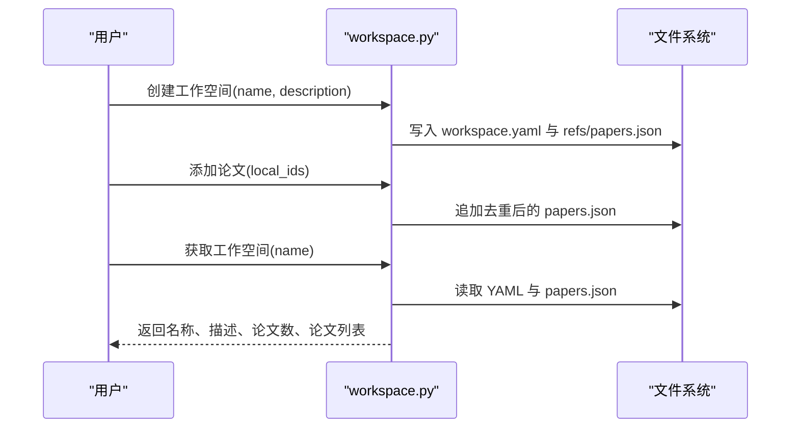

**图表来源**
- [workspace.py:71-155](file://src/drbrain/storage/workspace.py#L71-L155)

**章节来源**
- [workspace.py:22-40](file://src/drbrain/storage/workspace.py#L22-L40)
- [workspace.py:71-155](file://src/drbrain/storage/workspace.py#L71-L155)
- [workspace.py:158-212](file://src/drbrain/storage/workspace.py#L158-L212)

### 探索集合（Explore Silos）
- 轻量探索用集合，每个集合一个目录，包含 silo.json 元数据与 papers.jsonl 记录。
- 支持创建、追加论文、读取、关键词搜索（标题/作者/DOI）、列出与删除。

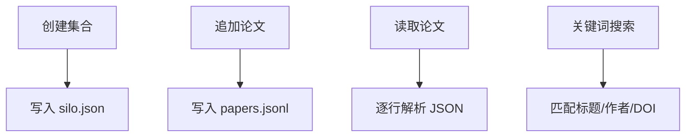

**图表来源**
- [explore.py:49-171](file://src/drbrain/storage/explore.py#L49-L171)

**章节来源**
- [explore.py:49-171](file://src/drbrain/storage/explore.py#L49-L171)

### 备份与恢复
- 本地备份：打包 papers、数据库、可选 workspace 与 reports 目录为 tar.gz。
- 远程同步：基于 rsync 的 SSH 同步，支持压缩、排除模式、干运行、凭据注入。
- 备份目标配置：主机、用户、路径、端口、密钥/密码、传输模式、是否启用、排除规则。

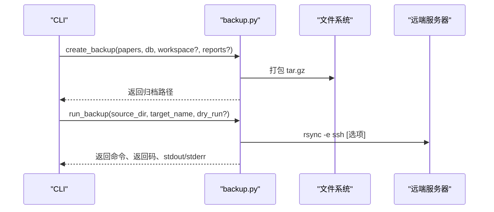

**图表来源**
- [backup.py:26-63](file://src/drbrain/storage/backup.py#L26-L63)
- [backup.py:199-240](file://src/drbrain/storage/backup.py#L199-L240)
- [config.py:144-179](file://src/drbrain/config.py#L144-L179)

**章节来源**
- [backup.py:26-63](file://src/drbrain/storage/backup.py#L26-L63)
- [backup.py:171-240](file://src/drbrain/storage/backup.py#L171-L240)
- [config.py:144-179](file://src/drbrain/config.py#L144-L179)

### 导出工具
- 支持 BibTeX、RIS、Markdown 三种格式导出。
- BibTeX 键生成、作者姓氏提取与转义、条目类型映射。
- RIS 类型映射与页码区间处理。
- Markdown 样式化输出。

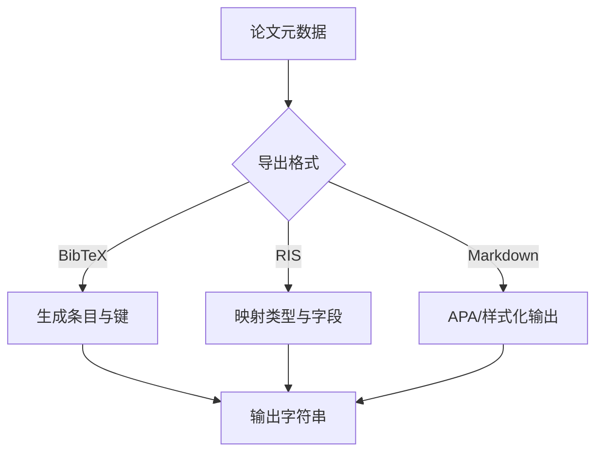

**图表来源**
- [export.py:68-180](file://src/drbrain/storage/export.py#L68-L180)

**章节来源**
- [export.py:68-180](file://src/drbrain/storage/export.py#L68-L180)

### 收件箱与待处理文件
- 扫描收件箱中 PDF 文件，失败时移动至待处理目录并记录原因与时间戳。
- 待处理日志为 JSONL 格式，便于审计与重试。

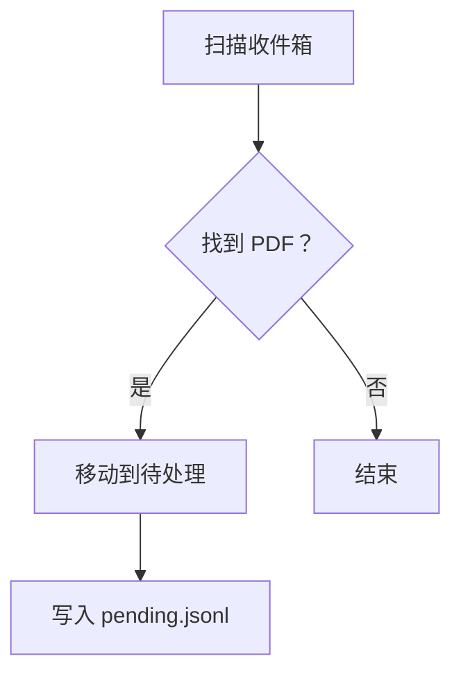

**图表来源**
- [inbox.py:12-55](file://src/drbrain/storage/inbox.py#L12-L55)

**章节来源**
- [inbox.py:12-55](file://src/drbrain/storage/inbox.py#L12-L55)

### 会议论文集
- JSON 数组存储会议条目（名称、年份、地点、论文列表），支持创建、添加论文、列出、查询与加载。

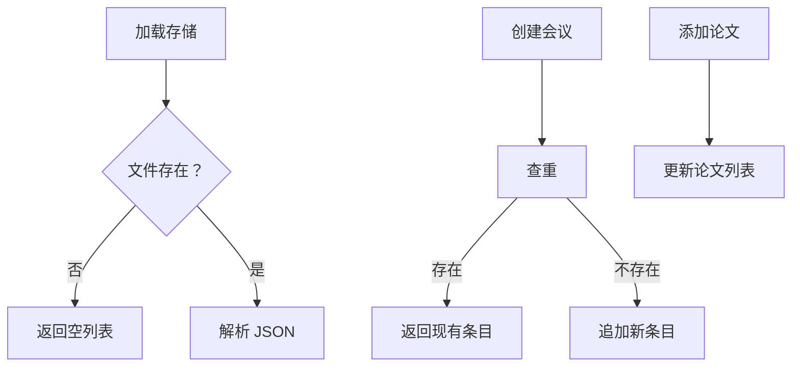

**图表来源**
- [proceedings.py:17-122](file://src/drbrain/storage/proceedings.py#L17-L122)

**章节来源**
- [proceedings.py:31-122](file://src/drbrain/storage/proceedings.py#L31-L122)

### 引文图分析
- 基于 citation_cache 与 edges 查询论文的参考、被引、共享参考与直接链接状态。
- 提供引用计数统计与图查询结果。

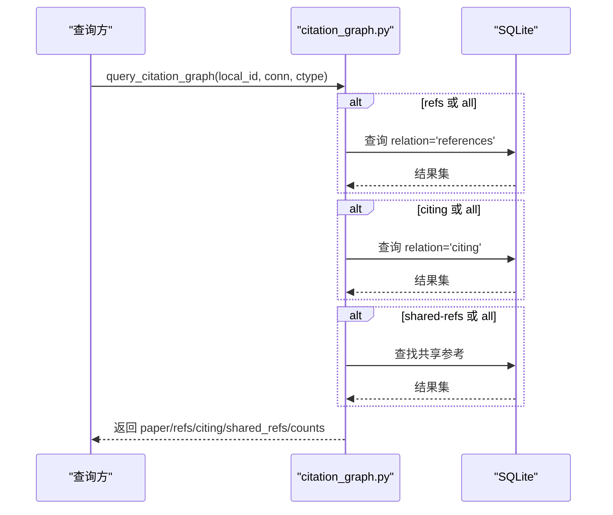

**图表来源**
- [citation_graph.py:74-129](file://src/drbrain/storage/citation_graph.py#L74-L129)

**章节来源**
- [citation_graph.py:8-129](file://src/drbrain/storage/citation_graph.py#L8-L129)

## 依赖关系分析
- 组件内聚与耦合
  - database.py 作为单一数据源，被多个模块查询与写入，耦合度高但职责清晰。
  - workspace.py、explore.py、proceedings.py、inbox.py 等以文件系统为中心，耦合度较低，便于独立演进。
  - backup.py 依赖 config.py 中的备份目标配置，形成配置驱动的外部集成。
- 外部依赖
  - SQLite：原生支持 WAL 模式与外键约束。
  - Python 标准库：tarfile、subprocess、shlex、yaml、json、tempfile 等。
  - numpy：用于向量序列化（仅在数据库模块内部）。

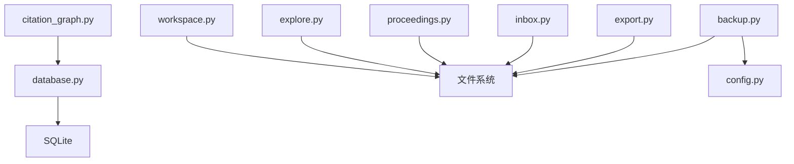

**图表来源**
- [database.py:159-775](file://src/drbrain/storage/database.py#L159-L775)
- [workspace.py:1-212](file://src/drbrain/storage/workspace.py#L1-L212)
- [explore.py:1-203](file://src/drbrain/storage/explore.py#L1-L203)
- [proceedings.py:1-122](file://src/drbrain/storage/proceedings.py#L1-L122)
- [inbox.py:1-55](file://src/drbrain/storage/inbox.py#L1-L55)
- [export.py:1-180](file://src/drbrain/storage/export.py#L1-L180)
- [backup.py:1-240](file://src/drbrain/storage/backup.py#L1-L240)
- [config.py:144-179](file://src/drbrain/config.py#L144-L179)
- [citation_graph.py:1-129](file://src/drbrain/storage/citation_graph.py#L1-L129)

**章节来源**
- [database.py:159-775](file://src/drbrain/storage/database.py#L159-L775)
- [backup.py:1-240](file://src/drbrain/storage/backup.py#L1-L240)
- [config.py:144-179](file://src/drbrain/config.py#L144-L179)

## 性能考虑
- 数据库层面
  - 使用 WAL 日志模式提升并发读写性能。
  - 为高频查询字段建立索引（概念类型/标签、边关系、队列状态等）。
  - 对大对象（向量）使用 BLOB 存储，必要时分表或分区。
- 文件系统层面
  - 将论文制品按本地 ID 分散到目录，避免单目录过大。
  - 备份时排除缓存与日志目录，减少冗余数据。
- 导出与分析
  - 批量导出时合并字符串拼接，减少 I/O 次数。
  - 引文图查询尽量复用连接与游标，避免重复扫描。
- 并发与锁
  - SQLite 默认串行写入，建议在导入/批量写入时使用事务包裹，减少提交次数。
  - 对只读查询开启只读连接或使用快照读取策略（WAL 模式下更友好）。

[本节为通用性能指导，不直接分析具体文件]

## 故障排除指南
- 备份失败
  - 检查 rsync/ssh 可执行文件路径与权限。
  - 确认备份目标配置（主机、端口、密钥/密码、启用状态）。
  - 使用 dry-run 模式预检传输计划。
- 数据库迁移异常
  - 查看 schema_versions 是否正确写入。
  - 确认迁移函数对缺失列的处理逻辑。
- 工作空间操作错误
  - 名称校验失败：检查是否包含非法字符或相对路径。
  - 重命名冲突：确认新名称未被占用。
- 引文图查询为空
  - 确认 citation_cache 是否已填充。
  - 检查 edges 中是否存在引用关系。

**章节来源**
- [backup.py:82-106](file://src/drbrain/storage/backup.py#L82-L106)
- [backup.py:209-239](file://src/drbrain/storage/backup.py#L209-L239)
- [workspace.py:185-210](file://src/drbrain/storage/workspace.py#L185-L210)
- [database.py:175-200](file://src/drbrain/storage/database.py#L175-L200)
- [citation_graph.py:14-56](file://src/drbrain/storage/citation_graph.py#L14-L56)

## 结论
DrBrain 存储管理系统以 SQLite 为核心，结合文件系统与备份工具，形成了结构化与非结构化数据协同的完整方案。通过完善的模式迁移、工作空间与探索集合管理、导出与备份能力，系统在可维护性、扩展性与可靠性方面具备良好基础。建议在生产环境中配合 WAL 模式、索引策略与定期备份演练，持续优化性能与灾备能力。

[本节为总结性内容，不直接分析具体文件]

## 附录

### 数据库表结构与约束要点
- 主键与外键：确保引用完整性，CASCADE 删除保证级联清理。
- 唯一约束：paper_ids 的各外部 ID 字段唯一，防止重复。
- 检查约束：paper_type、status、claim_type、证据类型等枚举值限制。
- 索引：针对高频过滤与排序字段建立索引，提升查询效率。

**章节来源**
- [database.py:10-156](file://src/drbrain/storage/database.py#L10-L156)

### 备份策略与恢复流程
- 本地备份：周期性创建 tar.gz 归档，保留 papers、数据库、工作空间与报告。
- 远程同步：配置 rsync 目标，支持压缩、排除与干运行；可使用密钥或密码认证。
- 恢复流程：解压归档到目标目录，重建数据库连接与文件路径映射，验证数据一致性。

**章节来源**
- [backup.py:26-63](file://src/drbrain/storage/backup.py#L26-L63)
- [backup.py:171-240](file://src/drbrain/storage/backup.py#L171-L240)
- [config.py:144-179](file://src/drbrain/config.py#L144-L179)

### 工作空间多用户与权限控制
- 当前实现为单机文件系统操作，未内置用户与权限控制。
- 建议在上层应用或网关层增加鉴权与访问控制，限制对工作空间的读写权限。
- 对敏感备份目标使用 SSH 密钥而非密码，最小化暴露面。

[本节为概念性建议，不直接分析具体文件]

### 存储优化与性能调优建议
- 数据库
  - 使用 WAL 模式与合适的 PRAGMA 设置。
  - 为热点字段建立复合索引，避免全表扫描。
  - 批量写入使用事务包裹，减少提交开销。
- 文件系统
  - 将论文制品分散到多级目录，避免单目录过大。
  - 备份时排除缓存与日志，缩短备份时间。
- 导出与分析
  - 批量导出合并字符串，减少 I/O。
  - 引文图查询复用连接，避免重复扫描。

[本节为通用优化建议，不直接分析具体文件]

### 数据迁移与版本兼容
- 模式迁移：通过 schema_versions 有序执行迁移函数，自动补齐缺失列。
- 版本兼容：旧版数据库可平滑升级，新增列默认值与约束确保兼容性。
- 测试验证：通过单元测试覆盖迁移前后行为，确保数据一致性。

**章节来源**
- [database.py:175-200](file://src/drbrain/storage/database.py#L175-L200)
- [test_database_extended.py:1-200](file://tests/test_database_extended.py#L1-L200)