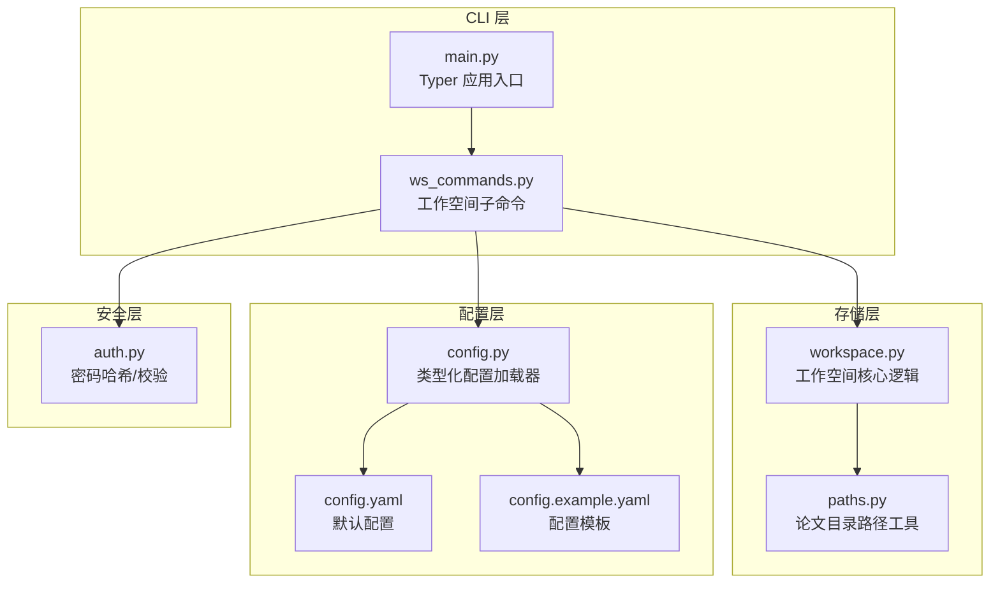
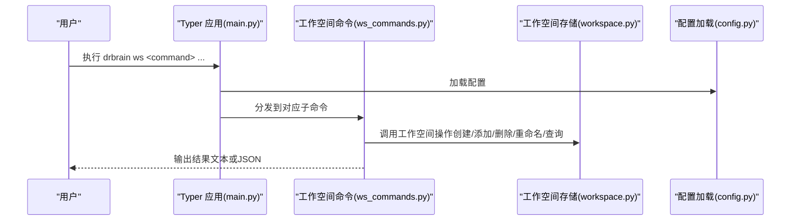
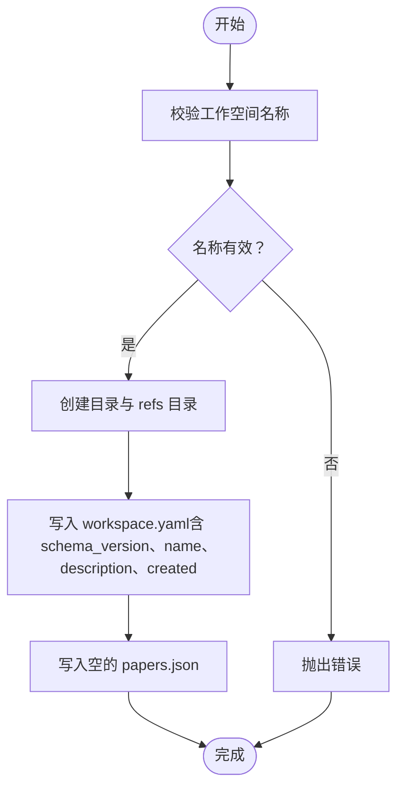
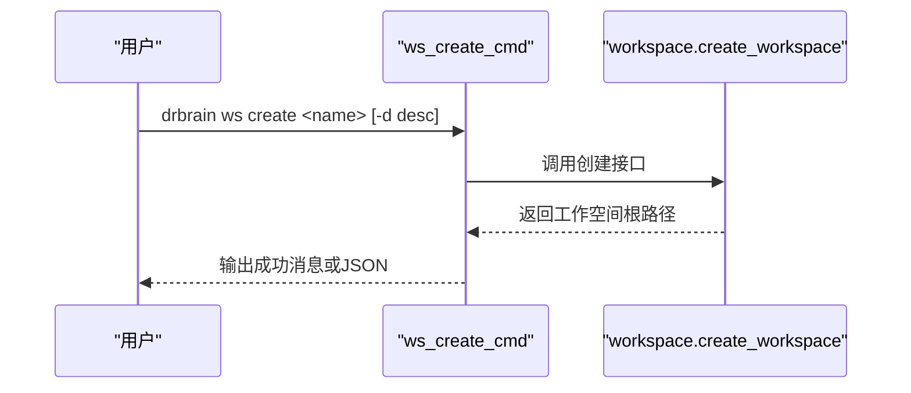
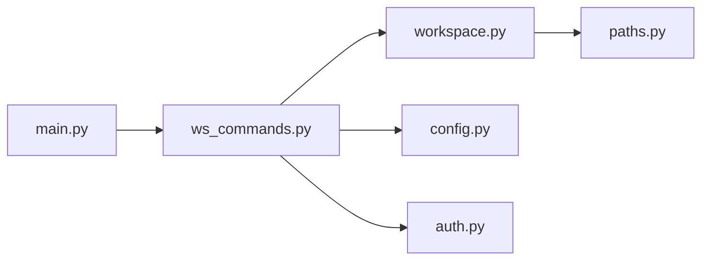

# 工作空间管理

<cite>
**本文引用的文件**
- [workspace.py](file://src/drbrain/storage/workspace.py)
- [ws_commands.py](file://src/drbrain/cli/ws_commands.py)
- [main.py](file://src/drbrain/cli/main.py)
- [paths.py](file://src/drbrain/storage/paths.py)
- [config.py](file://src/drbrain/config.py)
- [config.yaml](file://config.yaml)
- [config.example.yaml](file://config.example.yaml)
- [auth.py](file://src/drbrain/auth.py)
- [test_workspace.py](file://tests/test_workspace.py)
- [SKILL.md（工作空间分析）](file://skills/workspace-analysis/SKILL.md)
</cite>

## 目录
1. [简介](#简介)
2. [项目结构](#项目结构)
3. [核心组件](#核心组件)
4. [架构总览](#架构总览)
5. [详细组件分析](#详细组件分析)
6. [依赖分析](#依赖分析)
7. [性能考虑](#性能考虑)
8. [故障排除指南](#故障排除指南)
9. [结论](#结论)
10. [附录](#附录)

## 简介
本技术文档围绕 DrBrain 的“工作空间”子系统，系统化阐述其多用户支持与权限控制机制、工作空间的创建/配置/管理流程、用户角色与访问权限策略、工作空间隔离与数据保护、工作空间切换/共享/协作的使用方式、配置文件结构与参数设置，以及故障排除与维护操作。工作空间用于聚焦特定研究主题，以“论文引用列表”的形式组织知识图谱分析的范围，既保证了资源高效利用，也便于团队协作与结果复现。

## 项目结构
工作空间管理由三层组成：
- CLI 层：通过子命令提供工作空间的增删改查与展示能力
- 存储层：负责工作空间目录结构、元数据与引用列表的持久化
- 配置层：提供全局路径、外部服务等运行时环境

图表来源
- [main.py:77-146](file://src/drbrain/cli/main.py#L77-L146)
- [ws_commands.py:1-171](file://src/drbrain/cli/ws_commands.py#L1-L171)
- [workspace.py:1-212](file://src/drbrain/storage/workspace.py#L1-L212)
- [paths.py:1-29](file://src/drbrain/storage/paths.py#L1-L29)
- [config.py:182-292](file://src/drbrain/config.py#L182-L292)
- [config.yaml:1-72](file://config.yaml#L1-L72)
- [config.example.yaml:1-145](file://config.example.yaml#L1-L145)
- [auth.py:1-29](file://src/drbrain/auth.py#L1-L29)

章节来源
- [main.py:77-146](file://src/drbrain/cli/main.py#L77-L146)
- [ws_commands.py:1-171](file://src/drbrain/cli/ws_commands.py#L1-L171)
- [workspace.py:1-212](file://src/drbrain/storage/workspace.py#L1-L212)
- [paths.py:1-29](file://src/drbrain/storage/paths.py#L1-L29)
- [config.py:182-292](file://src/drbrain/config.py#L182-L292)
- [config.yaml:1-72](file://config.yaml#L1-L72)
- [config.example.yaml:1-145](file://config.example.yaml#L1-L145)
- [auth.py:1-29](file://src/drbrain/auth.py#L1-L29)

## 核心组件
- 工作空间存储模块：提供工作空间命名校验、目录结构、元数据与引用列表的读写、列举、查询、重命名、删除等能力
- 工作空间 CLI 命令：封装 create/add/remove/list/show/delete/rename 等子命令，并输出人类可读或 JSON 格式结果
- 论文路径工具：统一论文目录与关键文件的路径解析
- 类型化配置：集中管理全局路径、外部 API、嵌入模型等配置项
- 权限与安全：通过管理员密码哈希保护高风险命令；工作空间本身不内置细粒度权限控制

章节来源
- [workspace.py:22-212](file://src/drbrain/storage/workspace.py#L22-L212)
- [ws_commands.py:12-171](file://src/drbrain/cli/ws_commands.py#L12-L171)
- [paths.py:6-29](file://src/drbrain/storage/paths.py#L6-L29)
- [config.py:182-292](file://src/drbrain/config.py#L182-L292)
- [auth.py:7-29](file://src/drbrain/auth.py#L7-L29)

## 架构总览
下图展示了从 CLI 到存储再到配置的整体调用链路，以及工作空间在系统中的定位。

图表来源
- [main.py:77-146](file://src/drbrain/cli/main.py#L77-L146)
- [ws_commands.py:12-171](file://src/drbrain/cli/ws_commands.py#L12-L171)
- [workspace.py:71-212](file://src/drbrain/storage/workspace.py#L71-L212)
- [config.py:283-292](file://src/drbrain/config.py#L283-L292)

## 详细组件分析

### 组件一：工作空间存储模块（workspace.py）
- 命名校验规则：拒绝空串、点/双点、绝对路径、包含路径分隔符或冒号、包含“..”、首尾空白等
- 目录结构：每个工作空间包含一个 workspace.yaml（元数据）与 refs/papers.json（引用列表）
- 原子写入：papers.json 写入采用临时文件再替换的方式，避免部分写入导致的数据损坏
- 核心接口：
  - 创建：创建目录、生成元数据、初始化空引用列表
  - 添加/移除：去重添加、按 ID 移除
  - 查询：列出名称、读取详情（含论文数量与 ID 列表）、加载引用 ID
  - 重命名：先重命名目录，再更新 workspace.yaml 中的 name 字段
  - 删除：整目录删除

图表来源
- [workspace.py:22-100](file://src/drbrain/storage/workspace.py#L22-L100)

章节来源
- [workspace.py:22-212](file://src/drbrain/storage/workspace.py#L22-L212)
- [test_workspace.py:22-277](file://tests/test_workspace.py#L22-L277)

### 组件二：工作空间 CLI 命令（ws_commands.py）
- 子命令覆盖：create、add、remove、list、show、delete、rename
- 错误处理：捕获工作空间相关异常并输出 JSON 或文本错误信息
- 输出格式：支持 --json 选项输出结构化结果
- 与存储交互：直接调用 workspace.py 提供的函数执行业务逻辑

图表来源
- [ws_commands.py:12-33](file://src/drbrain/cli/ws_commands.py#L12-L33)
- [workspace.py:71-100](file://src/drbrain/storage/workspace.py#L71-L100)

章节来源
- [ws_commands.py:12-171](file://src/drbrain/cli/ws_commands.py#L12-L171)

### 组件三：论文路径工具（paths.py）
- 统一论文目录与关键文件的路径解析，便于上层模块按需访问 raw.md、tree.json、source.pdf、images 等

章节来源
- [paths.py:6-29](file://src/drbrain/storage/paths.py#L6-L29)

### 组件四：类型化配置（config.py 与 config.yaml）
- 类型化配置：通过 dataclass 封装各子配置（如 dirs、embed、api 等），提供默认值与字典兼容访问
- 环境变量解析：支持 ${ENV_VAR} 语法，自动从环境变量注入
- 本地覆盖：优先合并 config.local.yaml，实现本地化定制

章节来源
- [config.py:182-292](file://src/drbrain/config.py#L182-L292)
- [config.yaml:1-72](file://config.yaml#L1-L72)
- [config.example.yaml:1-145](file://config.example.yaml#L1-L145)

### 组件五：权限与安全（auth.py）
- 管理员密码：采用随机盐值的 SHA-256 哈希保存于配置中，用于保护高风险命令（如强制清理）
- 密码验证：在执行受保护命令前进行交互式校验，防止误操作

章节来源
- [auth.py:7-29](file://src/drbrain/auth.py#L7-L29)

## 依赖分析
- CLI 与存储：ws_commands.py 直接依赖 workspace.py 的函数
- 存储与路径：workspace.py 使用 paths.py 的路径工具
- CLI 与配置：main.py 在回调中加载配置并传递给各命令
- 安全与 CLI：部分高风险命令在执行前会检查管理员密码

图表来源
- [main.py:80-92](file://src/drbrain/cli/main.py#L80-L92)
- [ws_commands.py:12-171](file://src/drbrain/cli/ws_commands.py#L12-L171)
- [workspace.py:1-212](file://src/drbrain/storage/workspace.py#L1-L212)
- [paths.py:1-29](file://src/drbrain/storage/paths.py#L1-L29)
- [config.py:283-292](file://src/drbrain/config.py#L283-L292)
- [auth.py:1-29](file://src/drbrain/auth.py#L1-L29)

章节来源
- [main.py:80-92](file://src/drbrain/cli/main.py#L80-L92)
- [ws_commands.py:12-171](file://src/drbrain/cli/ws_commands.py#L12-L171)
- [workspace.py:1-212](file://src/drbrain/storage/workspace.py#L1-L212)
- [paths.py:1-29](file://src/drbrain/storage/paths.py#L1-L29)
- [config.py:283-292](file://src/drbrain/config.py#L283-L292)
- [auth.py:1-29](file://src/drbrain/auth.py#L1-L29)

## 性能考虑
- 引用列表写入采用原子替换策略，避免并发写入导致的数据损坏，同时减少磁盘碎片与 IO 开销
- 列举工作空间时仅扫描根目录下的合法工作空间，时间复杂度近似 O(N)，N 为工作空间数量
- JSON 文件读写使用标准库，编码与缩进可控，兼顾可读性与体积
- 建议在大规模引用列表场景下，定期备份与归档，避免单文件过大影响 I/O

## 故障排除指南
- 命名非法
  - 现象：创建工作空间时报错
  - 排查：检查名称是否包含非法字符、是否以“..”出现、是否为空或带空白
  - 参考：命名校验规则与测试用例
- 工作空间不存在
  - 现象：添加/移除/显示/删除/重命名时提示未找到
  - 排查：确认工作空间名称拼写、是否存在 workspace.yaml
  - 参考：命令与存储层的错误分支
- 重复创建
  - 现象：同名工作空间已存在
  - 排查：先列出现有工作空间，再选择新名称
- 原子写入失败
  - 现象：papers.json 写入后残留 .tmp 文件或内容不完整
  - 排查：检查磁盘权限、磁盘空间、并发写入冲突
- 权限相关
  - 现象：执行受保护命令被拒绝
  - 排查：确认已设置管理员密码并通过验证；检查配置中密码哈希是否存在

章节来源
- [workspace.py:22-40](file://src/drbrain/storage/workspace.py#L22-L40)
- [test_workspace.py:133-189](file://tests/test_workspace.py#L133-L189)
- [test_workspace.py:208-227](file://tests/test_workspace.py#L208-L227)
- [ws_commands.py:21-32](file://src/drbrain/cli/ws_commands.py#L21-L32)
- [auth.py:15-29](file://src/drbrain/auth.py#L15-L29)

## 结论
DrBrain 的工作空间系统以轻量、可扩展的方式实现了“聚焦分析”的核心诉求：通过命名校验与原子写入保障数据一致性，通过 CLI 子命令提供易用的操作界面，通过类型化配置与环境变量实现灵活部署。当前版本未内置细粒度权限控制，但通过管理员密码机制为高风险操作提供了基础安全防护。建议在团队协作场景中配合外部版本控制与备份策略，进一步强化工作空间的隔离与可追溯性。

## 附录

### 多用户支持与权限控制机制
- 当前实现
  - 工作空间本身为文件系统级隔离，不同用户可通过独立的配置与数据目录实现隔离
  - 管理员密码用于保护高风险命令（如强制清理），非工作空间级细粒度权限
- 最佳实践
  - 为每位用户配置独立的 config.local.yaml 与数据目录
  - 对共享服务器上的工作空间目录设置最小必要权限
  - 使用备份与版本控制工具记录工作空间变更历史

章节来源
- [config.py:182-292](file://src/drbrain/config.py#L182-L292)
- [auth.py:7-29](file://src/drbrain/auth.py#L7-L29)

### 工作空间创建、配置与管理流程
- 创建
  - CLI：drbrain ws create <name> [-d 描述]
  - 存储：创建目录、生成 workspace.yaml 与空 papers.json
- 配置
  - 默认配置位于 config.yaml；本地覆盖 config.local.yaml
  - 环境变量通过 ${VAR} 注入
- 管理
  - 添加/移除论文、列出、显示详情、删除、重命名
  - 支持 JSON 输出，便于自动化集成

章节来源
- [ws_commands.py:12-171](file://src/drbrain/cli/ws_commands.py#L12-L171)
- [workspace.py:71-212](file://src/drbrain/storage/workspace.py#L71-L212)
- [config.yaml:1-72](file://config.yaml#L1-L72)
- [config.example.yaml:1-145](file://config.example.yaml#L1-L145)

### 用户角色与访问权限分配策略
- 角色划分
  - 普通用户：可执行常规分析命令与工作空间 CRUD
  - 管理员：可执行受保护命令（如强制清理），需配置管理员密码
- 分配建议
  - 通过操作系统账户与文件权限实现物理隔离
  - 在 CI/CD 场景中，使用专用服务账号与只读策略

章节来源
- [auth.py:7-29](file://src/drbrain/auth.py#L7-L29)

### 工作空间隔离与数据保护
- 隔离
  - 每个工作空间为独立目录，引用列表仅记录 ID，不复制论文数据
- 数据保护
  - 原子写入避免部分写入
  - 建议结合备份与版本控制，定期归档重要工作空间

章节来源
- [workspace.py:62-69](file://src/drbrain/storage/workspace.py#L62-L69)
- [workspace.py:165-169](file://src/drbrain/storage/workspace.py#L165-L169)

### 工作空间切换、共享与协作使用指南
- 切换
  - 通过命令行参数指定工作空间（如 analyze -w <name>）
- 共享
  - 将 workspace.yaml 与 refs/papers.json 作为共享资产；注意敏感元数据
- 协作
  - 建议配合外部版本控制与备份策略，确保多人协作时的一致性与可追溯性

章节来源
- [SKILL.md（工作空间分析）:24-89](file://skills/workspace-analysis/SKILL.md#L24-L89)

### 工作空间配置文件结构与参数设置
- workspace.yaml
  - 字段：schema_version、name、description、created
  - 作用：工作空间元数据与版本标识
- papers.json
  - 结构：每条记录包含 local_id 与 added_at
  - 作用：引用列表，不复制论文数据
- 目录布局
  - workspace/<name>/workspace.yaml
  - workspace/<name>/refs/papers.json

章节来源
- [workspace.py:88-97](file://src/drbrain/storage/workspace.py#L88-L97)
- [workspace.py:47-52](file://src/drbrain/storage/workspace.py#L47-L52)
- [workspace.py:55-69](file://src/drbrain/storage/workspace.py#L55-L69)

### 故障排除与维护操作
- 常见问题
  - 命名非法、工作空间不存在、重复创建、原子写入失败、权限拒绝
- 维护建议
  - 定期备份 workspace 目录
  - 清理不再使用的工作空间
  - 使用 JSON 输出便于自动化脚本处理

章节来源
- [test_workspace.py:133-277](file://tests/test_workspace.py#L133-L277)
- [ws_commands.py:21-32](file://src/drbrain/cli/ws_commands.py#L21-L32)